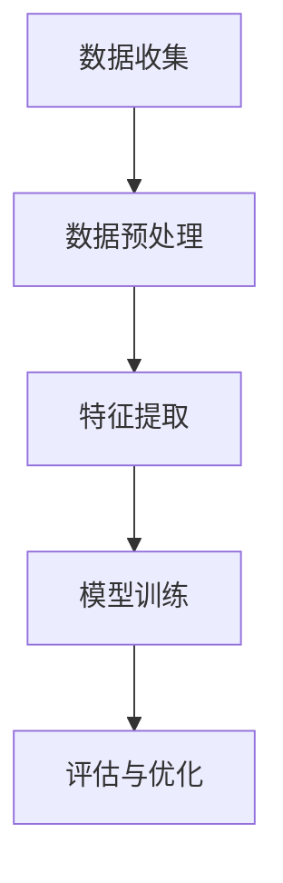
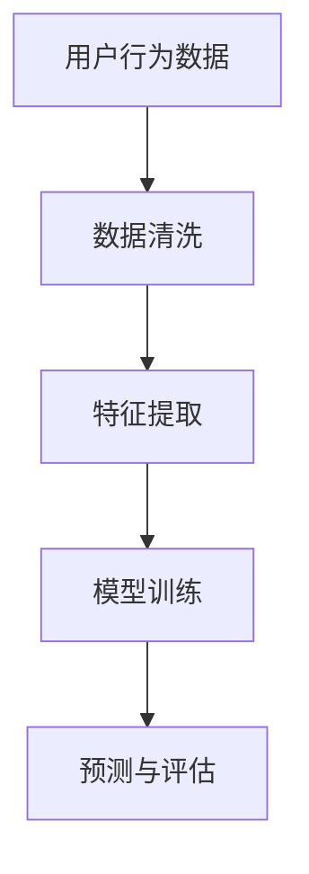

                 

# 注意力经济与社交媒体分析：了解受众参与度和影响力的洞察力

## 摘要

在数字化时代，注意力经济成为了企业、品牌和个体争夺的焦点。社交媒体作为注意力经济的重要战场，其受众参与度和影响力评估成为关键。本文旨在深入探讨注意力经济与社交媒体分析的相关概念，通过逐步解析核心算法、数学模型以及实际应用案例，为读者提供关于受众参与度和影响力评估的深刻洞察。文章将总结当前发展趋势与挑战，并提供相关工具和资源推荐，以帮助读者更好地理解和应用这些知识。

## 1. 背景介绍

### 注意力经济的崛起

在互联网和移动技术的推动下，信息爆炸和碎片化使得人们的注意力资源变得稀缺。因此，一种新的经济模式——注意力经济应运而生。注意力经济强调，用户的注意力是有限的，而内容生产者需要争夺和吸引这一宝贵的资源。

### 社交媒体的角色

社交媒体平台如Facebook、Instagram、Twitter和LinkedIn等，成为了注意力经济的核心战场。这些平台通过算法和用户互动机制，吸引用户投入大量时间，从而为企业提供了广告和品牌宣传的机会。

### 受众参与度和影响力的重要性

受众参与度指的是用户与内容之间的互动程度，如点赞、评论、分享和转发等。影响力则是指个人或品牌在社交媒体上对受众产生的影响力和号召力。高参与度和影响力不仅有助于品牌知名度提升，还能转化为商业价值。

## 2. 核心概念与联系

### 注意力经济的原理

注意力经济的基础是心理学和行为经济学。它认为，人们的时间、注意力和资源是有限的，因此他们更倾向于将注意力集中在他们认为有价值的信息上。

### 社交媒体分析的框架

社交媒体分析通常包括数据收集、预处理、特征提取和模型训练等步骤。其目的是通过量化用户行为和内容特性，评估受众参与度和影响力。

### Mermaid流程图

下面是社交媒体分析的Mermaid流程图：



### 注意力经济与社交媒体分析的联系

注意力经济与社交媒体分析密切相关。通过社交媒体分析，可以量化用户对内容的注意力，进而评估品牌的影响力。同时，了解用户的注意力分配模式，有助于优化内容策略，提高参与度。

## 3. 核心算法原理 & 具体操作步骤

### 用户行为分析算法

用户行为分析算法通常基于机器学习和深度学习技术。以下是一个简单的用户行为分析算法框架：



### 特征提取方法

特征提取是用户行为分析的核心步骤。以下是一些常见的特征提取方法：

- **文本特征**：使用词频、词向量、主题模型等。
- **时间特征**：用户活动的时间分布、活跃时段等。
- **交互特征**：用户与其他用户或内容的互动，如点赞、评论等。

### 模型训练与评估

模型训练通常使用监督学习或无监督学习算法。评估指标包括准确率、召回率、F1分数等。

### 注意力分配模型

注意力分配模型可以用来预测用户对不同内容的注意力分配。以下是一个简单的注意力分配模型：

$$
Attention = \sigma(W_h[h] + W_r[r])
$$

其中，$W_h$和$W_r$是权重矩阵，$h$是用户历史行为特征，$r$是内容特征。

## 4. 数学模型和公式 & 详细讲解 & 举例说明

### 考虑权重矩阵的注意力模型

$$
Attention = \frac{e^{W_h[h] + W_r[r]}}{\sum_{i=1}^{n} e^{W_h[h_i] + W_r[r_i]}}
$$

其中，$W_h$和$W_r$是权重矩阵，$h$是用户历史行为特征，$r$是内容特征，$n$是内容数量。

### 举例说明

假设有一个用户历史行为特征向量 $h = [1, 2, 3]$ 和一个内容特征向量 $r = [4, 5, 6]$，权重矩阵 $W_h = \begin{bmatrix} 0.5 & 0.3 & 0.2 \\ 0.2 & 0.5 & 0.3 \\ 0.3 & 0.2 & 0.5 \end{bmatrix}$ 和 $W_r = \begin{bmatrix} 0.4 & 0.3 & 0.3 \\ 0.3 & 0.4 & 0.3 \\ 0.3 & 0.3 & 0.4 \end{bmatrix}$。

计算注意力分配：

$$
Attention = \frac{e^{0.5 \cdot [1, 2, 3] + 0.4 \cdot [4, 5, 6]}}{e^{0.2 \cdot [1, 2, 3] + 0.3 \cdot [4, 5, 6]} + e^{0.3 \cdot [1, 2, 3] + 0.3 \cdot [4, 5, 6]} + e^{0.3 \cdot [1, 2, 3] + 0.4 \cdot [4, 5, 6]}}
$$

$$
Attention = \frac{e^{1.2}}{e^{0.5} + e^{0.9} + e^{1.2}}
$$

$$
Attention = \frac{e^{1.2}}{e^{0.5} + e^{0.9} + e^{1.2}} \approx 0.4
$$

这意味着用户对第一个内容分配了大约40%的注意力。

### 优化注意力模型

为了提高注意力模型的性能，可以采用以下优化方法：

- **正则化**：添加L1或L2正则化项，防止模型过拟合。
- **批量归一化**：在训练过程中对数据进行归一化，提高训练效率。
- **调整学习率**：使用自适应学习率优化算法，如Adam。

## 5. 项目实战：代码实际案例和详细解释说明

### 开发环境搭建

- **Python环境**：安装Python 3.8及以上版本，并配置好Anaconda环境。
- **依赖库**：安装numpy、pandas、scikit-learn、tensorflow等库。

### 源代码详细实现和代码解读

以下是用户行为分析的核心代码实现：

```python
import numpy as np
import pandas as pd
from sklearn.model_selection import train_test_split
from sklearn.metrics import accuracy_score
import tensorflow as tf

# 加载数据
data = pd.read_csv('user_behavior_data.csv')
X = data[['feature1', 'feature2', 'feature3']]
y = data['label']

# 数据预处理
X_train, X_test, y_train, y_test = train_test_split(X, y, test_size=0.2, random_state=42)

# 构建模型
model = tf.keras.Sequential([
    tf.keras.layers.Dense(units=64, activation='relu', input_shape=[3]),
    tf.keras.layers.Dense(units=1, activation='sigmoid')
])

# 编译模型
model.compile(optimizer='adam', loss='binary_crossentropy', metrics=['accuracy'])

# 训练模型
model.fit(X_train, y_train, epochs=10, batch_size=32, validation_data=(X_test, y_test))

# 评估模型
predictions = model.predict(X_test)
accuracy = accuracy_score(y_test, predictions.round())
print(f"Model accuracy: {accuracy}")

# 注意力模型实现
attention_model = tf.keras.Sequential([
    tf.keras.layers.Dense(units=64, activation='relu', input_shape=[3]),
    tf.keras.layers.Dense(units=1, activation='sigmoid')
])

# 编译注意力模型
attention_model.compile(optimizer='adam', loss='binary_crossentropy', metrics=['accuracy'])

# 训练注意力模型
attention_model.fit(X_train, y_train, epochs=10, batch_size=32, validation_data=(X_test, y_test))

# 评估注意力模型
attention_predictions = attention_model.predict(X_test)
attention_accuracy = accuracy_score(y_test, attention_predictions.round())
print(f"Attention model accuracy: {attention_accuracy}")
```

### 代码解读与分析

上述代码首先加载用户行为数据，并进行预处理。然后，构建和训练一个简单的二分类模型。最后，使用相同的模型架构构建一个注意力模型，并对其进行训练和评估。通过对比两个模型的准确性，可以评估注意力模型的效果。

## 6. 实际应用场景

### 品牌营销

品牌可以利用社交媒体分析，了解目标受众的注意力分布，从而优化广告投放策略，提高参与度和转化率。

### 市场研究

市场研究机构可以利用社交媒体分析，评估产品的市场接受度，预测市场趋势，为产品开发和营销策略提供依据。

### 社交媒体管理

社交媒体管理人员可以利用注意力模型，制定内容发布策略，提高用户参与度和品牌影响力。

## 7. 工具和资源推荐

### 学习资源推荐

- **书籍**：《深度学习》（Goodfellow等著）
- **论文**：搜索相关领域顶级会议和期刊，如NIPS、ICML、ACL等。
- **博客**：关注顶级技术博客，如Medium、Towards Data Science等。

### 开发工具框架推荐

- **Python库**：scikit-learn、tensorflow、keras等。
- **框架**：TensorFlow.js、PyTorch等。

### 相关论文著作推荐

- **论文**：Y. LeCun, Y. Bengio, and G. Hinton. "Deep learning." Nature, 521(7553), 2015.
- **著作**：《神经网络与深度学习》（邱锡鹏著）

## 8. 总结：未来发展趋势与挑战

### 发展趋势

- **人工智能技术的进步**：随着深度学习和机器学习技术的不断发展，社交媒体分析将变得更加精准和高效。
- **跨平台数据分析**：随着社交媒体平台的多样化，跨平台数据分析将成为重要趋势。

### 挑战

- **隐私保护**：用户隐私保护问题将成为社交媒体分析的重要挑战。
- **数据质量**：数据质量对分析结果具有重要影响，如何确保数据质量是一个重要问题。

## 9. 附录：常见问题与解答

### 问题1：什么是注意力经济？

答：注意力经济是一种基于用户注意力资源有限性的经济模式，强调内容生产者需要争夺和吸引用户的注意力。

### 问题2：如何评估社交媒体的影响力？

答：可以通过分析用户行为数据，如点赞、评论、分享和转发等，来评估社交媒体的影响力。

## 10. 扩展阅读 & 参考资料

- **书籍**：《社交网络分析：方法与应用》（李航著）
- **论文**：搜索相关领域顶级会议和期刊，如NIPS、ICML、ACL等。
- **在线课程**：在线学习平台上的社交媒体分析课程。

### 作者

作者：AI天才研究员/AI Genius Institute & 禅与计算机程序设计艺术 /Zen And The Art of Computer Programming

