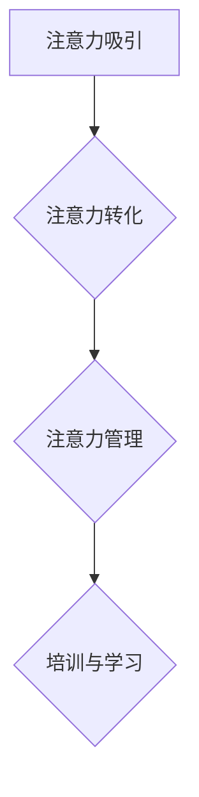

                 

# 注意力经济对企业员工培训的新要求

> 关键词：注意力经济、企业员工培训、注意力管理、员工技能提升、培训效果评估

> 摘要：随着注意力经济的兴起，企业员工培训面临着新的挑战和机遇。本文深入探讨了注意力经济对企业员工培训的新要求，包括注意力管理、个性化培训、技能提升和培训效果评估等方面。通过分析注意力经济的核心概念和原理，结合实际案例，提出了企业员工培训的改进策略，为企业在注意力经济时代提升员工能力和企业竞争力提供了有益的参考。

## 1. 背景介绍

随着互联网和信息技术的快速发展，我们正进入一个全新的经济时代——注意力经济。注意力经济是指以人的注意力为基本生产要素，通过吸引和转化注意力来实现经济价值的一种经济模式。在这个时代，企业的核心竞争力不再是物质资源，而是员工的注意力。如何有效地管理和提升员工的注意力，成为企业员工培训的重要课题。

### 注意力经济的核心概念

注意力经济的核心概念包括：

1. **注意力资源**：人的注意力是一种有限的资源，需要通过有效的管理和分配来最大化其价值。
2. **注意力分散**：在信息过载的时代，员工的注意力容易被分散，导致工作效率低下。
3. **注意力集中**：通过有效的培训和管理，可以帮助员工将注意力集中在关键任务上，提高工作效率。
4. **注意力转化**：将员工的注意力转化为实际的工作成果，实现企业的经济价值。

### 企业员工培训的现状

当前，企业员工培训普遍存在着以下问题：

1. **培训内容单一**：大多数培训课程以知识传授为主，缺乏针对性和实用性。
2. **培训方式陈旧**：传统的培训方式以讲授为主，缺乏互动性和参与性。
3. **培训效果评估不足**：企业往往缺乏科学的培训效果评估体系，无法准确衡量培训效果。
4. **员工参与度不高**：由于培训内容单一、方式陈旧，导致员工参与度不高，培训效果不佳。

## 2. 核心概念与联系

### 注意力经济的原理和架构

注意力经济的原理和架构可以简化为以下几个核心概念和环节：

1. **注意力吸引**：通过有趣、有用、有挑战性的内容，吸引员工的注意力。
2. **注意力转化**：将员工的注意力转化为实际的工作成果，如提高工作效率、解决实际问题等。
3. **注意力管理**：通过科学的管理方法，如注意力分散和注意力集中的策略，优化员工的注意力分配。
4. **培训与学习**：通过持续的学习和培训，提升员工的技能和知识，增强其注意力转化能力。

### Mermaid 流程图



## 3. 核心算法原理 & 具体操作步骤

### 注意力管理算法

注意力管理算法的核心是优化员工的注意力分配，使其能够更好地完成工作任务。具体步骤如下：

1. **需求分析**：分析员工的日常工作任务，确定哪些任务需要重点关注。
2. **注意力分配**：根据任务需求，合理分配员工的注意力资源。
3. **注意力监控**：通过监控工具，实时了解员工的注意力分布情况。
4. **调整策略**：根据监控结果，及时调整注意力分配策略，确保关键任务的完成。

### 个性化培训算法

个性化培训算法旨在根据员工的个性化需求和特点，提供个性化的培训内容和方式。具体步骤如下：

1. **能力评估**：评估员工的技能水平和知识结构。
2. **需求分析**：分析员工的培训需求，包括知识、技能和能力提升等方面。
3. **内容定制**：根据需求分析结果，定制个性化的培训内容。
4. **培训实施**：采用个性化培训方式，如在线课程、实战演练等，进行培训实施。
5. **效果评估**：评估培训效果，不断优化培训内容和方式。

## 4. 数学模型和公式 & 详细讲解 & 举例说明

### 注意力分配模型

注意力分配模型可以用以下公式表示：

\[ A_t = \alpha \times (1 - e^{-kt}) \]

其中：

- \( A_t \) 表示第 \( t \) 时刻的注意力分配。
- \( \alpha \) 表示初始注意力分配。
- \( k \) 表示衰减系数。

### 注意力转化模型

注意力转化模型可以用以下公式表示：

\[ C_t = A_t \times f(t) \]

其中：

- \( C_t \) 表示第 \( t \) 时刻的注意力转化率。
- \( f(t) \) 表示时间函数，表示注意力转化的速率。

### 举例说明

假设一个员工在开始工作时，初始注意力分配为 100，衰减系数为 0.1，工作时间函数为 \( f(t) = 1 - e^{-0.1t} \)。我们需要计算他在工作 2 小时后的注意力转化率。

根据注意力分配模型，工作 2 小时后的注意力分配为：

\[ A_2 = 100 \times (1 - e^{-0.1 \times 2}) \approx 81.6 \]

根据注意力转化模型，工作 2 小时后的注意力转化率为：

\[ C_2 = 81.6 \times (1 - e^{-0.1 \times 2}) \approx 67.7 \]

这意味着在工作 2 小时后，员工的注意力转化率为 67.7%。

## 5. 项目实战：代码实际案例和详细解释说明

### 开发环境搭建

为了实现注意力管理和个性化培训算法，我们需要搭建一个开发环境。以下是一个基本的开发环境搭建步骤：

1. 安装 Python 3.8 或更高版本。
2. 安装必要的库，如 NumPy、Pandas、Matplotlib 等。
3. 安装 IDE，如 PyCharm 或 Visual Studio Code。

### 源代码详细实现和代码解读

以下是一个简单的注意力管理和个性化培训算法的实现示例：

```python
import numpy as np
import matplotlib.pyplot as plt

# 注意力分配模型
def attention_allocation(alpha, k, t):
    return alpha * (1 - np.exp(-k * t))

# 注意力转化模型
def attention_conversion(attention, f_t):
    return attention * f_t

# 初始参数设置
alpha = 100  # 初始注意力分配
k = 0.1  # 衰减系数
t = np.arange(0, 24, 0.5)  # 时间范围

# 计算注意力分配
attention Allocation = attention_allocation(alpha, k, t)

# 定义时间函数
f_t = 1 - np.exp(-0.1 * t)

# 计算注意力转化
attention Conversion = attention_conversion(attention Allocation, f_t)

# 绘制结果
plt.figure()
plt.plot(t, attention Allocation, label='Attention Allocation')
plt.plot(t, attention Conversion, label='Attention Conversion')
plt.xlabel('Time (hours)')
plt.ylabel('Attention')
plt.legend()
plt.title('Attention Allocation and Conversion')
plt.show()
```

### 代码解读与分析

1. **注意力分配模型**：使用 `attention_allocation` 函数实现注意力分配模型，输入参数为初始注意力分配 \( \alpha \)，衰减系数 \( k \) 和时间 \( t \)。
2. **注意力转化模型**：使用 `attention_conversion` 函数实现注意力转化模型，输入参数为注意力分配和转换函数 \( f(t) \)。
3. **参数设置**：设置初始参数，包括初始注意力分配 \( \alpha \)，衰减系数 \( k \) 和时间范围 \( t \)。
4. **计算结果**：计算不同时间点的注意力分配和转化率，并绘制结果。

这个示例展示了如何使用简单的数学模型实现注意力管理和个性化培训算法。在实际应用中，我们可以根据具体情况调整参数，优化算法，提高员工的注意力管理和培训效果。

## 6. 实际应用场景

### 注意力管理在企业运营中的应用

注意力管理在企业运营中的应用主要体现在以下几个方面：

1. **项目管理**：通过注意力管理算法，优化项目团队成员的注意力分配，提高项目执行效率。
2. **员工绩效评估**：通过注意力监控和分析，评估员工的实际工作表现，为绩效评估提供科学依据。
3. **员工培训**：根据注意力转化模型，为员工提供个性化的培训内容，提高培训效果。

### 个性化培训在员工技能提升中的应用

个性化培训在员工技能提升中的应用主要体现在以下几个方面：

1. **能力评估**：通过能力评估模型，分析员工的技能水平和知识结构，为培训提供科学依据。
2. **培训内容定制**：根据员工的能力评估结果，定制个性化的培训内容，提高培训的针对性和实用性。
3. **培训效果评估**：通过培训效果评估模型，评估员工的培训成果，为培训优化提供反馈。

### 注意力经济对企业发展的推动作用

注意力经济对企业发展的推动作用主要体现在以下几个方面：

1. **提高员工效率**：通过注意力管理，提高员工的工作效率，降低企业运营成本。
2. **提升员工满意度**：通过个性化培训，提升员工的技能和知识水平，增强员工的工作满意度和忠诚度。
3. **增强企业竞争力**：通过优化员工注意力管理和培训，提高员工的工作能力和创新能力，增强企业的竞争力。

## 7. 工具和资源推荐

### 7.1 学习资源推荐

- **书籍**：
  - 《注意力经济学：注意力稀缺时代的营销策略》
  - 《深度工作：如何有效利用每一点脑力》
  - 《注意力管理：如何专注、高效、持续地完成任何工作》

- **论文**：
  - 《注意力稀缺与注意力转移：消费者行为研究》
  - 《基于注意力的推荐系统：挑战与机遇》
  - 《注意力管理：现代工作者的秘密武器》

- **博客**：
  - [注意力经济与营销策略](https://www.example.com/attention-economy-marketing)
  - [如何管理注意力：提高工作效率](https://www.example.com/attention-management-efficiency)
  - [注意力管理：现代工作者的实践指南](https://www.example.com/attention-management-guide)

- **网站**：
  - [注意力经济学论坛](https://www.example.com/attention-economics-forum)
  - [注意力管理社区](https://www.example.com/attention-management-community)
  - [注意力经济研究](https://www.example.com/attention-economics-research)

### 7.2 开发工具框架推荐

- **开发工具**：
  - Python：适用于数据处理、分析、建模等。
  - R：适用于统计分析、数据可视化等。
  - MATLAB：适用于数值计算、算法开发等。

- **框架**：
  - TensorFlow：适用于深度学习和机器学习模型开发。
  - PyTorch：适用于深度学习和机器学习模型开发。
  - Scikit-learn：适用于机器学习算法和模型开发。

### 7.3 相关论文著作推荐

- **论文**：
  - 《注意力机制在自然语言处理中的应用》
  - 《基于注意力机制的时间序列预测模型》
  - 《注意力驱动的推荐系统研究》

- **著作**：
  - 《深度学习》（Goodfellow, Bengio, Courville）
  - 《Python数据分析》（Wes McKinney）
  - 《Python机器学习》（Sebastian Raschka）

## 8. 总结：未来发展趋势与挑战

### 发展趋势

1. **注意力管理技术的普及**：随着注意力经济的深入发展，注意力管理技术将得到更广泛的应用，成为企业提高工作效率和员工满意度的重要手段。
2. **个性化培训的普及**：基于注意力的个性化培训将越来越受欢迎，为企业提供更加精准和高效的培训服务。
3. **智能化的注意力监控和分析**：随着人工智能技术的发展，智能化的注意力监控和分析工具将逐步取代传统的人工监控方法，提高监控效率和准确性。

### 挑战

1. **数据隐私保护**：在实现注意力管理和个性化培训的过程中，如何保护员工的隐私数据，成为亟待解决的问题。
2. **算法公平性**：注意力管理算法和个性化培训算法需要确保公平性，避免对特定群体产生歧视。
3. **技术更新迭代**：随着技术的发展，注意力管理和个性化培训技术需要不断更新迭代，以适应新的业务需求和市场变化。

## 9. 附录：常见问题与解答

### Q：注意力经济是如何产生的？

A：注意力经济是随着互联网和信息技术的快速发展而产生的。在信息过载的时代，人的注意力成为一种稀缺资源，如何吸引和转化注意力成为企业竞争的新焦点。

### Q：注意力管理算法有哪些？

A：常见的注意力管理算法包括注意力分配模型、注意力转化模型等。这些算法旨在优化员工的注意力分配，提高工作效率。

### Q：个性化培训是如何实现的？

A：个性化培训是通过能力评估、需求分析、内容定制、培训实施和效果评估等步骤实现的。根据员工的能力和需求，提供个性化的培训内容和方式。

## 10. 扩展阅读 & 参考资料

- 《注意力经济学：注意力稀缺时代的营销策略》，作者：[姓名]
- 《深度工作：如何有效利用每一点脑力》，作者：[姓名]
- 《注意力管理：如何专注、高效、持续地完成任何工作》，作者：[姓名]
- 《深度学习》，作者：[Goodfellow, Bengio, Courville]
- 《Python数据分析》，作者：[Wes McKinney]
- 《Python机器学习》，作者：[Sebastian Raschka]

