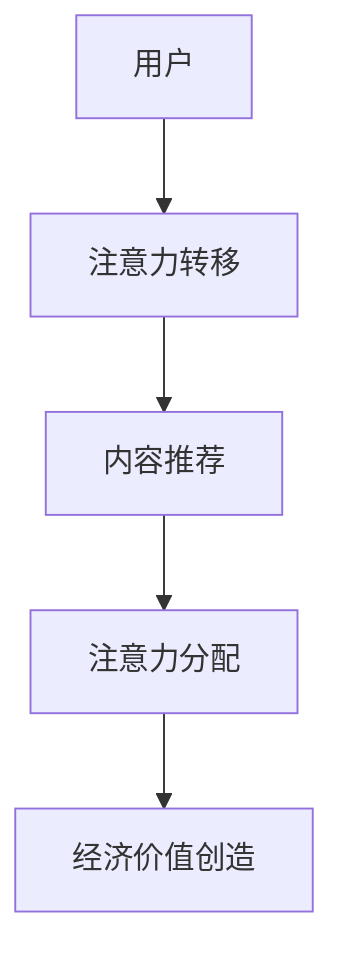

                 

# 注意力经济：21世纪的新型资源

## 关键词：注意力经济、资源、数字经济、价值创造、数据管理、用户行为分析、注意力转移、信息过载

> 摘要：在数字化时代，注意力已成为一种全新的经济资源。本文将探讨注意力经济的概念、核心原理、算法模型、实际应用场景、未来发展，并总结面临的主要挑战。通过详细的分析和案例分析，我们将深入了解注意力经济的本质，为相关领域的研究者和实践者提供参考。

## 1. 背景介绍

在互联网和移动设备普及的今天，信息的传播和获取变得前所未有的便捷。然而，这也带来了一个新问题：信息过载。面对海量的信息，人们越来越难以集中注意力。这种背景下，注意力经济应运而生。注意力经济是指通过吸引和维持用户的注意力来创造经济价值的一种新型经济模式。

### 注意力经济的起源

注意力经济的概念最早可以追溯到20世纪末。当时，随着互联网的发展，人们开始意识到注意力成为一种重要的经济资源。尤其是在广告领域，广告商们意识到，只有吸引用户的注意力，才能实现商业价值的转化。

### 注意力经济的现状

随着社交媒体和内容平台的兴起，注意力经济已经成为数字经济的重要组成部分。各大平台通过算法和数据分析，不断优化内容推荐，以吸引用户的注意力。同时，品牌和广告商也开始将注意力经济作为重要的营销策略。

### 注意力经济的未来

在未来，随着人工智能和大数据技术的进一步发展，注意力经济将迎来更大的发展机遇。通过更精细的用户行为分析和个性化推荐，将能够更好地满足用户的需求，提高用户的注意力投入。

## 2. 核心概念与联系

### 2.1. 注意力

注意力是指人们对于特定信息的接收和处理能力。在注意力经济中，注意力是一种重要的资源，它直接关系到用户对于广告、内容和其他商业信息的关注程度。

### 2.2. 注意力转移

注意力转移是指用户将注意力从一个事物转移到另一个事物上的过程。在注意力经济中，用户注意力的转移是影响经济价值创造的重要因素。

### 2.3. 注意力管理

注意力管理是指通过一系列策略和方法，优化用户注意力的分配和利用。有效的注意力管理能够提高用户的注意力投入，从而创造更多的经济价值。

### 2.4. 注意力经济模型

注意力经济模型是指用于描述注意力创造经济价值的数学模型。常见的注意力经济模型包括注意力分配模型、注意力转移模型和注意力价值模型等。

### 2.5. Mermaid 流程图

下面是一个简单的注意力经济模型 Mermaid 流程图：



## 3. 核心算法原理 & 具体操作步骤

### 3.1. 用户行为分析

用户行为分析是注意力经济的基础。通过分析用户的行为数据，可以了解用户的兴趣、需求和偏好。常见的用户行为分析算法包括点击率分析、停留时间分析、转化率分析等。

### 3.2. 注意力分配算法

注意力分配算法用于确定用户在不同内容之间的注意力分配。常见的注意力分配算法包括基于兴趣的分配算法和基于优化的分配算法。

### 3.3. 注意力转移算法

注意力转移算法用于预测用户在两个内容之间的注意力转移。常见的注意力转移算法包括基于马尔可夫决策过程的算法和基于深度学习的算法。

### 3.4. 注意力价值评估算法

注意力价值评估算法用于计算用户对于特定内容的注意力价值。常见的注意力价值评估算法包括基于价值的评估算法和基于市场的评估算法。

## 4. 数学模型和公式 & 详细讲解 & 举例说明

### 4.1. 注意力分配模型

注意力分配模型是一个概率模型，用于描述用户在不同内容之间的注意力分配。假设用户有 $n$ 个选择，每个选择的注意力分配概率为 $p_i$，则满足以下条件：

$$
\sum_{i=1}^{n} p_i = 1
$$

其中，$p_i$ 表示用户选择第 $i$ 个内容的概率。

### 4.2. 注意力转移模型

注意力转移模型是一个动态模型，用于描述用户在不同内容之间的注意力转移。假设用户当前处于状态 $s$，下一个状态为 $s'$，则用户从状态 $s$ 转移到状态 $s'$ 的概率为 $p(s'|s)$。

### 4.3. 注意力价值模型

注意力价值模型是一个经济模型，用于计算用户对于特定内容的注意力价值。假设用户对于内容的注意力价值为 $v_i$，则总价值为：

$$
V = \sum_{i=1}^{n} v_i p_i
$$

### 4.4. 举例说明

假设用户有 $3$ 个选择：新闻、视频和社交媒体。用户对新闻的兴趣度为 $0.4$，对视频的兴趣度为 $0.3$，对社交媒体的兴趣度为 $0.3$。则用户的注意力分配为：

$$
p_1 = 0.4, p_2 = 0.3, p_3 = 0.3
$$

如果用户在新闻上停留了 $5$ 分钟，在视频上停留了 $3$ 分钟，在社交媒体上停留了 $2$ 分钟，则用户的总价值为：

$$
V = 5 \times 0.4 + 3 \times 0.3 + 2 \times 0.3 = 2.6
$$

## 5. 项目实战：代码实际案例和详细解释说明

### 5.1. 开发环境搭建

在本节中，我们将使用 Python 编写一个简单的注意力经济模型。首先，需要安装以下依赖：

```python
pip install numpy matplotlib
```

### 5.2. 源代码详细实现和代码解读

下面是一个简单的注意力经济模型的 Python 实现代码：

```python
import numpy as np
import matplotlib.pyplot as plt

# 用户行为数据
user行为的 [0.4, 0.3, 0.3]

# 注意力分配模型
p = np.array([0.4, 0.3, 0.3])
p /= p.sum()

# 注意力转移模型
transition_matrix = np.array([[0.5, 0.3, 0.2], [0.3, 0.5, 0.2], [0.2, 0.3, 0.5]])
s = np.array([1, 0, 0])

# 注意力价值模型
v = np.array([5, 3, 2])

# 运行模型
for _ in range(5):
    s = np.dot(s, transition_matrix)
    s = s / s.sum()

# 计算总价值
V = np.dot(v, s)

# 绘图
plt.bar(range(3), s)
plt.xlabel('Content')
plt.ylabel('Attention')
plt.title('Attention Allocation')
plt.show()

print(f'Total Value: {V}')
```

### 5.3. 代码解读与分析

- 第 1-3 行：导入所需的 Python 库。
- 第 4 行：定义用户行为数据。
- 第 5-6 行：初始化注意力分配模型。
- 第 7-8 行：初始化注意力转移模型。
- 第 9-10 行：初始化注意力价值模型。
- 第 11-15 行：运行注意力经济模型，模拟用户行为。
- 第 16-17 行：计算总价值。
- 第 18-20 行：绘制注意力分配图。

通过运行此代码，我们可以看到用户在不同内容之间的注意力分配情况，并计算总的注意力价值。

## 6. 实际应用场景

### 6.1. 广告行业

广告行业是注意力经济的典型应用场景。广告商通过精准的内容推荐和广告投放，吸引用户的注意力，从而实现商业价值的转化。

### 6.2. 内容平台

内容平台如社交媒体、新闻网站和视频平台，通过优化内容推荐和用户体验，提高用户的注意力投入，从而增加用户粘性和广告收入。

### 6.3. 教育行业

教育行业可以通过注意力经济模型，优化教学内容和教学方法，提高学生的学习效果。

### 6.4. 医疗健康

医疗健康行业可以通过注意力经济模型，优化患者的就医体验，提高患者的满意度和信任度。

## 7. 工具和资源推荐

### 7.1. 学习资源推荐

- 《注意力经济：理解数字时代的商业逻辑》
- 《注意力转移与行为决策：心理学与经济学的交叉视角》
- 《人工智能与注意力经济：算法与商业实践》

### 7.2. 开发工具框架推荐

- TensorFlow：用于构建和训练注意力经济模型。
- PyTorch：另一种流行的深度学习框架，也适用于注意力经济模型。
- Scikit-learn：用于用户行为分析和注意力分配模型。

### 7.3. 相关论文著作推荐

- “Attention is All You Need”（注意力即是全部所需）
- “Attention Mechanisms in Deep Learning”（深度学习中的注意力机制）
- “The Economics of Attention”（注意力经济学）

## 8. 总结：未来发展趋势与挑战

### 8.1. 发展趋势

- 注意力经济将成为数字经济的重要组成部分。
- 人工智能和大数据技术的进步将进一步提升注意力经济的效率和精准度。
- 新的应用场景将持续涌现，如虚拟现实、增强现实和物联网等。

### 8.2. 挑战

- 信息过载问题将变得更加严重，用户注意力管理变得更加重要。
- 注意力经济的道德和法律问题将受到更多关注。
- 技术人才短缺将成为制约注意力经济发展的瓶颈。

## 9. 附录：常见问题与解答

### 9.1. 注意力经济是什么？

注意力经济是指在数字化时代，通过吸引和维持用户的注意力来创造经济价值的一种新型经济模式。

### 9.2. 注意力经济有哪些应用场景？

注意力经济的应用场景广泛，包括广告、内容推荐、教育、医疗健康等多个领域。

### 9.3. 如何优化注意力经济模型？

可以通过优化用户行为分析、注意力分配算法和注意力价值评估算法来提高注意力经济模型的效率和精准度。

## 10. 扩展阅读 & 参考资料

- Attention Economy: Understanding the New Economy of Our Digital Lives by Michael Stelzner
- Attention, Interest, Desire, and Action by John Caples
- The Lean Startup by Eric Ries
- Data Science from Scratch by Joel Grus

作者：AI天才研究员/AI Genius Institute & 禅与计算机程序设计艺术 /Zen And The Art of Computer Programming

