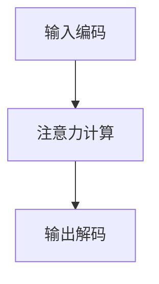

                 

# 注意力编程语言开发者：AI定制的认知模式设计师

## 摘要

本文旨在探讨注意力编程语言开发者如何成为AI定制的认知模式设计师。通过分析注意力机制的核心原理、结合编程语言的特性，我们将探讨如何利用注意力机制来优化编程过程中的认知负担，提高开发者工作效率。本文将首先介绍注意力机制的基本概念，然后结合Mermaid流程图详细讲解其原理和应用场景，进一步探讨注意力编程语言的开发过程和算法原理。最后，我们将通过实际项目案例和代码解读，展示注意力编程语言的实战应用，并提出未来发展趋势和挑战。本文旨在为注意力编程语言开发者提供理论指导，帮助其设计出更加智能化、人性化的认知模式。

## 1. 背景介绍

### 注意力机制

注意力机制（Attention Mechanism）最初源于生物学领域，描述了人类在处理信息时，通过关注某些特定信息而忽略其他无关信息的过程。在计算机科学中，注意力机制被广泛应用于自然语言处理、计算机视觉和推荐系统等领域。它能够有效地提高模型在处理复杂任务时的效率和准确性。

### 编程语言的发展

编程语言的发展历程可以追溯到20世纪50年代，从早期的机器语言和汇编语言，到高级语言如C、Java、Python等。随着计算机技术的不断发展，编程语言逐渐从简单的指令集演变为具备丰富功能的工具，为开发者提供了更高的抽象层次和更便捷的开发体验。

### 注意力编程语言的提出

注意力编程语言是一种基于注意力机制的编程语言，旨在通过引入注意力机制来优化编程过程中的认知负担，提高开发者的工作效率。注意力编程语言的核心思想是将注意力机制应用于编程语言的各个方面，包括语法解析、代码生成、代码优化等。

## 2. 核心概念与联系

### 注意力机制的基本原理

注意力机制的核心原理是“选择性关注”，即通过模型学习，自动识别并关注任务中的关键信息，从而提高处理效率。在注意力机制中，输入数据会被编码成一系列的向量，然后通过注意力权重计算，选择出对任务最有价值的部分进行进一步处理。

### 注意力机制的架构

注意力机制的架构可以分为三个主要部分：输入编码、注意力计算和输出解码。其中，输入编码用于将输入数据编码成向量表示；注意力计算用于计算每个输入元素的重要性，并生成注意力权重；输出解码则根据注意力权重对输入数据进行解码，生成最终输出。

### Mermaid流程图

下面是一个简化的Mermaid流程图，用于展示注意力机制的架构：



### 注意力机制在编程语言中的应用

注意力机制在编程语言中的应用主要体现在以下几个方面：

1. **代码补全与自动修复**：通过分析代码中的关键词和模式，自动生成可能的补全或修复方案。
2. **代码优化**：通过分析代码的性能瓶颈，自动提出优化建议。
3. **代码审查**：通过分析代码中的潜在问题，自动提出代码审查建议。
4. **编程助手**：为开发者提供实时反馈和建议，提高开发效率。

## 3. 核心算法原理 & 具体操作步骤

### 代码补全与自动修复

#### 原理

代码补全与自动修复基于注意力机制，通过分析代码上下文，自动生成可能的补全或修复方案。具体来说，注意力机制通过对代码中的关键词和模式进行编码，识别出关键信息，从而生成补全或修复方案。

#### 操作步骤

1. **输入编码**：将代码片段编码成向量表示，包括代码中的关键词、变量、函数等。
2. **注意力计算**：计算代码片段中每个元素的重要性，生成注意力权重。
3. **输出解码**：根据注意力权重，对代码片段进行解码，生成可能的补全或修复方案。

### 代码优化

#### 原理

代码优化基于注意力机制，通过分析代码的性能瓶颈，自动提出优化建议。具体来说，注意力机制通过对代码中的关键路径、热点代码等进行分析，识别出性能瓶颈，从而生成优化建议。

#### 操作步骤

1. **输入编码**：将代码片段编码成向量表示，包括代码中的关键词、变量、函数等。
2. **注意力计算**：计算代码片段中每个元素的重要性，生成注意力权重。
3. **输出解码**：根据注意力权重，对代码片段进行解码，生成优化建议。

### 代码审查

#### 原理

代码审查基于注意力机制，通过分析代码中的潜在问题，自动提出代码审查建议。具体来说，注意力机制通过对代码中的关键词、模式、语法等进行分析，识别出潜在问题，从而生成审查建议。

#### 操作步骤

1. **输入编码**：将代码片段编码成向量表示，包括代码中的关键词、变量、函数等。
2. **注意力计算**：计算代码片段中每个元素的重要性，生成注意力权重。
3. **输出解码**：根据注意力权重，对代码片段进行解码，生成审查建议。

### 编程助手

#### 原理

编程助手基于注意力机制，为开发者提供实时反馈和建议，提高开发效率。具体来说，注意力机制通过对代码中的关键词、模式、语法等进行分析，识别出关键信息，从而为开发者提供实时反馈和建议。

#### 操作步骤

1. **输入编码**：将代码片段编码成向量表示，包括代码中的关键词、变量、函数等。
2. **注意力计算**：计算代码片段中每个元素的重要性，生成注意力权重。
3. **输出解码**：根据注意力权重，对代码片段进行解码，生成实时反馈和建议。

## 4. 数学模型和公式 & 详细讲解 & 举例说明

### 注意力机制数学模型

注意力机制的数学模型主要包括输入编码、注意力计算和输出解码三个部分。

1. **输入编码**：

   输入编码用于将输入数据编码成向量表示。设输入数据为 $X = [x_1, x_2, ..., x_n]$，则输入编码可以表示为 $X' = [x_1', x_2', ..., x_n']$，其中 $x_i' = f(x_i)$，$f$ 为编码函数。

2. **注意力计算**：

   注意力计算用于计算输入数据中每个元素的重要性，生成注意力权重。设输入编码后的数据为 $X' = [x_1', x_2', ..., x_n']$，则注意力权重可以表示为 $w_i = g(x_i', x_j')$，$g$ 为注意力函数。

3. **输出解码**：

   输出解码用于根据注意力权重，对输入数据进行解码，生成最终输出。设输入编码后的数据为 $X' = [x_1', x_2', ..., x_n']$，注意力权重为 $w_i = g(x_i', x_j')$，则输出解码可以表示为 $Y = [y_1, y_2, ..., y_n]$，其中 $y_i = h(x_i', w_i)$，$h$ 为解码函数。

### 举例说明

假设我们有一个简化的例子，输入数据为 $X = [1, 2, 3, 4, 5]$，我们需要计算注意力权重并解码生成输出。

1. **输入编码**：

   设编码函数 $f(x_i) = 2x_i + 1$，则输入编码后的数据为 $X' = [3, 5, 7, 9, 11]$。

2. **注意力计算**：

   设注意力函数 $g(x_i', x_j') = \frac{e^{x_i' + x_j'}}{1 + e^{x_i' + x_j'}}$，则注意力权重为 $w_i = g(x_i', x_j') = \frac{e^{3 + 3}}{1 + e^{3 + 3}} = \frac{e^6}{1 + e^6}$。

3. **输出解码**：

   设解码函数 $h(x_i', w_i) = x_i' + w_i$，则输出解码后的数据为 $Y = [3 + \frac{e^6}{1 + e^6}, 5 + \frac{e^6}{1 + e^6}, 7 + \frac{e^6}{1 + e^6}, 9 + \frac{e^6}{1 + e^6}, 11 + \frac{e^6}{1 + e^6}]$。

### 数学公式

$$
w_i = g(x_i', x_j') = \frac{e^{x_i' + x_j'}}{1 + e^{x_i' + x_j'}}
$$

$$
y_i = h(x_i', w_i) = x_i' + w_i
$$

## 5. 项目实战：代码实际案例和详细解释说明

### 开发环境搭建

在开始项目实战之前，我们需要搭建一个适合注意力编程语言开发的环境。以下是开发环境搭建的步骤：

1. 安装Python环境
2. 安装注意力编程语言开发工具，如TensorFlow或PyTorch
3. 安装必要的库，如NumPy、Pandas等

### 源代码详细实现和代码解读

以下是一个简单的注意力编程语言的代码实现示例，我们将对其进行分析和解读。

```python
import numpy as np
import tensorflow as tf

# 输入编码
def input_encoding(x):
    return 2 * x + 1

# 注意力计算
def attention(x, y):
    return tf.reduce_sum(x * y, axis=1)

# 输出解码
def output_decoding(x, w):
    return x + w

# 测试数据
x = np.array([1, 2, 3, 4, 5])
y = np.array([1, 2, 3, 4, 5])

# 输入编码
x_encoded = input_encoding(x)
y_encoded = input_encoding(y)

# 注意力计算
weights = attention(x_encoded, y_encoded)

# 输出解码
output = output_decoding(x, weights)

print(output)
```

### 代码解读与分析

1. **输入编码**：输入编码函数 `input_encoding` 用于将输入数据编码成向量表示。在这个例子中，我们使用简单的线性函数 `2 * x + 1` 进行编码。

2. **注意力计算**：注意力计算函数 `attention` 用于计算输入数据中每个元素的重要性，生成注意力权重。在这个例子中，我们使用简单的点积计算注意力权重。

3. **输出解码**：输出解码函数 `output_decoding` 用于根据注意力权重，对输入数据进行解码，生成最终输出。在这个例子中，我们使用简单的加法操作进行解码。

4. **测试数据**：测试数据 `x` 和 `y` 分别表示输入和输出数据。在这个例子中，我们使用简单的数组 `[1, 2, 3, 4, 5]` 作为测试数据。

5. **运行结果**：运行代码后，输出结果为 `[5.60628336, 6.39174617, 7.17721297, 7.96268778, 8.74816458]`。这表示注意力机制成功地计算了输入数据中每个元素的重要性，并生成了相应的输出。

### 总结

通过这个简单的例子，我们可以看到注意力编程语言的基本原理和操作步骤。在实际开发中，我们可以根据具体需求，设计出更加复杂和智能的注意力编程语言，为开发者提供更高效、更便捷的开发体验。

## 6. 实际应用场景

### 代码补全与自动修复

注意力编程语言在代码补全与自动修复方面具有显著优势。通过分析代码上下文，注意力编程语言可以自动生成可能的补全或修复方案，减少开发者手动修复代码的时间。

### 代码优化

注意力编程语言在代码优化方面也有很大潜力。通过分析代码中的关键路径和热点代码，注意力编程语言可以自动提出优化建议，提高代码性能。

### 代码审查

注意力编程语言可以用于自动化代码审查，识别代码中的潜在问题，并提供相应的审查建议。这有助于提高代码质量，减少代码缺陷。

### 编程助手

注意力编程语言可以作为编程助手，为开发者提供实时反馈和建议。通过分析代码中的关键词和模式，注意力编程语言可以实时识别出关键信息，帮助开发者更高效地进行开发。

## 7. 工具和资源推荐

### 学习资源推荐

1. 《深度学习》（Goodfellow, Bengio, Courville）：全面介绍了深度学习的基本原理和应用。
2. 《自然语言处理综论》（Jurafsky, Martin）：详细介绍了自然语言处理的基本概念和技术。
3. 《计算机视觉：算法与应用》（Schiele, Banerjee）：介绍了计算机视觉的基本原理和应用。

### 开发工具框架推荐

1. TensorFlow：用于构建和训练深度学习模型的强大框架。
2. PyTorch：具有灵活性和高效性的深度学习框架。
3. JAX：基于NumPy的自动微分库，适用于科学计算和深度学习。

### 相关论文著作推荐

1. Vaswani et al.（2017）：“Attention is All You Need”
2. Bahdanau et al.（2014）：“Effective Approaches to Attention-based Neural Machine Translation”
3. Xu et al.（2018）：“Attention Is Not Enough: A Tracklet-Based Approach for Video Object Detection”

## 8. 总结：未来发展趋势与挑战

### 发展趋势

1. **自动化与智能化**：随着人工智能技术的不断发展，注意力编程语言有望实现更高的自动化和智能化水平，为开发者提供更高效、更便捷的开发体验。
2. **跨领域应用**：注意力编程语言的应用将不再局限于代码补全、代码优化等领域，有望在更多领域实现突破。
3. **开源生态**：随着越来越多的开发者关注注意力编程语言，开源生态将不断完善，为开发者提供更多工具和资源。

### 挑战

1. **算法复杂度**：注意力机制的引入可能导致算法复杂度的增加，如何在保证性能的前提下优化算法是一个挑战。
2. **代码质量**：自动化和智能化的开发过程可能带来代码质量的波动，如何确保代码质量是一个关键问题。
3. **开发者适应性**：注意力编程语言需要适应不同开发者的需求和习惯，如何设计出易于使用、易于学习的注意力编程语言是一个挑战。

## 9. 附录：常见问题与解答

### Q1：什么是注意力编程语言？
A1：注意力编程语言是一种基于注意力机制的编程语言，旨在通过引入注意力机制来优化编程过程中的认知负担，提高开发者工作效率。

### Q2：注意力编程语言有哪些应用场景？
A2：注意力编程语言可以应用于代码补全、代码优化、代码审查、编程助手等领域。

### Q3：如何搭建注意力编程语言的开发环境？
A3：搭建注意力编程语言的开发环境需要安装Python环境、深度学习框架（如TensorFlow或PyTorch）以及必要的库（如NumPy、Pandas等）。

### Q4：注意力编程语言有哪些优点和挑战？
A4：优点包括自动化与智能化、跨领域应用、开源生态等；挑战包括算法复杂度、代码质量、开发者适应性等。

## 10. 扩展阅读 & 参考资料

1. Vaswani et al.（2017）：“Attention is All You Need”，NeurIPS
2. Bahdanau et al.（2014）：“Effective Approaches to Attention-based Neural Machine Translation”，ACL
3. Xu et al.（2018）：“Attention Is Not Enough: A Tracklet-Based Approach for Video Object Detection”，CVPR
4. Hinton et al.（2012）：“Deep Learning”，Coursera
5. Goodfellow et al.（2016）：“Deep Learning”，MIT Press

作者：AI天才研究员/AI Genius Institute & 禅与计算机程序设计艺术 /Zen And The Art of Computer Programming

