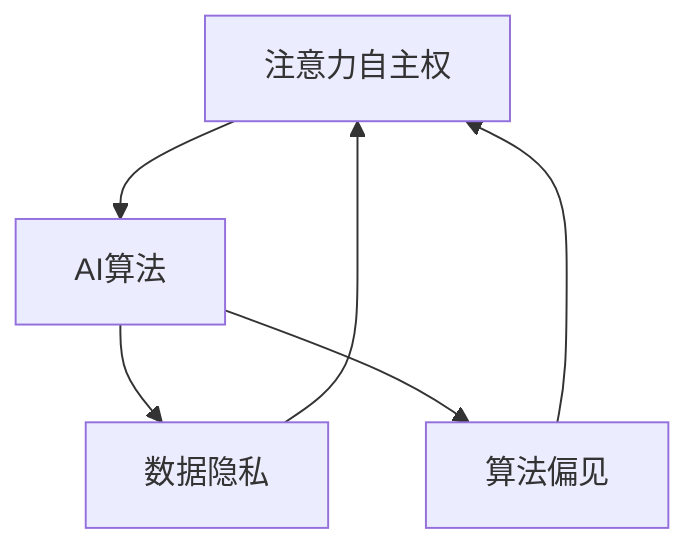

                 

## 注意力自主权维护者：AI时代的个人选择卫士

### 引言

在当今这个被人工智能（AI）技术深刻影响的时代，个人选择的重要性愈发凸显。AI技术已经渗透到我们生活的方方面面，从智能助手到自动驾驶，从医疗诊断到金融市场分析，AI正在以不可逆转的趋势改变着我们的世界。然而，随着AI技术的广泛应用，个人隐私和数据安全问题也日益凸显。如何在享受AI带来的便利的同时，维护自己的注意力自主权，成为了每个人都需要面对的挑战。

本文旨在探讨在AI时代，个人如何维护注意力自主权。我们将从背景介绍、核心概念、算法原理、数学模型、项目实战、实际应用场景等多个角度进行分析和阐述。希望通过本文的讨论，能够帮助读者理解在AI时代如何有效地维护个人选择权，实现自我价值的最大化。

### 关键词

- 人工智能（AI）
- 注意力自主权
- 个人选择
- 隐私保护
- 数据安全
- 算法
- 数学模型

### 摘要

本文通过深入探讨AI时代个人注意力自主权的维护问题，分析了当前AI技术对个人选择权的挑战，提出了基于核心算法和数学模型的方法。文章结构分为以下几个部分：首先，介绍AI时代的背景和注意力自主权的重要性；其次，阐述相关核心概念和原理，并利用Mermaid流程图展示其架构；接着，详细讲解核心算法原理和具体操作步骤；然后，通过数学模型和公式进行详细讲解，并结合实际项目案例进行代码解读与分析；最后，讨论AI技术在各种实际应用场景中的挑战和解决方案，并提供学习资源、开发工具框架和相关论文著作的推荐。通过本文的讨论，旨在帮助读者理解和掌握维护个人注意力自主权的策略和方法。

### 背景介绍

#### 人工智能技术的发展

人工智能（AI）作为计算机科学的一个重要分支，旨在使计算机能够模拟、延伸和扩展人类的智能。自20世纪50年代诞生以来，AI技术经历了多次重大突破和变革。特别是随着深度学习、神经网络和强化学习等先进算法的提出和应用，AI技术取得了显著进步。

近年来，AI技术的应用范围日益广泛，已经渗透到各个领域，包括但不限于：

1. **医疗领域**：利用AI进行疾病诊断、基因组分析和个性化治疗，提高了医疗服务的效率和准确性。
2. **金融领域**：通过机器学习和数据分析技术，实现了更精准的风险评估和投资决策。
3. **自动驾驶**：AI技术在自动驾驶领域的应用，正在推动交通方式的变革，有望提高交通安全和效率。
4. **智能家居**：智能音箱、智能门锁等AI设备为人们提供了更加便捷和智能化的家居体验。
5. **教育领域**：AI技术被用于个性化学习、教育评估和教学辅助，促进了教育公平和个性化发展。

#### 个人选择权的挑战

随着AI技术的迅猛发展，个人选择权面临着前所未有的挑战。尽管AI技术带来了诸多便利，但同时也带来了一系列潜在问题，对个人选择权构成了威胁：

1. **隐私泄露**：AI系统通常需要大量的个人数据来训练和优化模型，这可能导致个人隐私的泄露。
2. **算法偏见**：AI算法在训练过程中可能会学习到社会中的偏见，从而导致不公正的决策。
3. **依赖性增强**：人们在享受AI便利的同时，可能逐渐对AI产生依赖，从而减弱了自主决策能力。
4. **数据滥用**：未经授权的个人数据可能被滥用，用于商业推广或其他非合法用途。

#### 注意力自主权的重要性

在AI时代，注意力自主权的重要性愈发凸显。注意力自主权指的是个人对自己注意力的控制和分配权。在AI技术广泛应用的时代，个人需要具备以下能力：

1. **筛选信息**：在大量信息面前，个人需要学会筛选和过滤，选择对自己有益的信息。
2. **保持独立思考**：在依赖AI辅助决策时，个人需要保持独立思考，避免被AI算法完全控制。
3. **数据隐私保护**：在共享数据时，个人需要了解自己的数据如何被使用，并采取相应措施保护隐私。

#### AI时代个人选择的挑战与应对策略

在AI时代，个人选择面临着新的挑战，但同时也提供了新的机遇。为了在AI时代有效维护个人选择权，个人需要采取以下策略：

1. **提高数字素养**：了解AI技术的工作原理和应用场景，提高自己的数字素养，以便更好地应对相关挑战。
2. **使用隐私保护工具**：使用各种隐私保护工具和技术，如加密通信、匿名网络访问等，保护个人隐私。
3. **主动参与决策**：在AI辅助决策时，个人需要积极参与，提出自己的意见和看法，避免被完全“算法化”。
4. **培养独立思考能力**：通过不断学习和思考，培养独立思考和判断能力，减少对AI的依赖。

### 核心概念与联系

在探讨如何维护个人注意力自主权时，需要了解几个核心概念和它们之间的联系。这些概念包括注意力自主权、AI算法、数据隐私、算法偏见等。以下将详细阐述这些概念，并利用Mermaid流程图展示其架构。

#### 注意力自主权

注意力自主权是指个人对自己注意力的控制和分配权。在AI时代，个人的注意力面临着被算法操控的风险。因此，维护注意力自主权变得尤为重要。

#### AI算法

AI算法是人工智能技术的核心组成部分，包括机器学习、深度学习、神经网络等。这些算法通过学习和分析大量数据，实现自动决策和预测。然而，AI算法也可能带来算法偏见和数据隐私泄露等问题。

#### 数据隐私

数据隐私是指个人数据不被未经授权的第三方获取、使用或泄露的状态。在AI应用中，数据隐私是维护个人选择权的重要保障。然而，由于AI系统需要大量个人数据，隐私保护成为一个巨大的挑战。

#### 算法偏见

算法偏见是指AI算法在训练过程中可能学习到的社会偏见，从而产生不公正的决策。算法偏见可能源于数据中的偏见或算法设计中的缺陷，对个人选择权构成威胁。

#### Mermaid流程图

以下是一个简单的Mermaid流程图，展示上述核心概念和它们之间的联系：



在这个流程图中，注意力自主权是核心，它受到AI算法、数据隐私和算法偏见的影响。同时，数据隐私和算法偏见也会对注意力自主权产生反作用。这个流程图提供了一个直观的视角，帮助我们理解这些概念之间的复杂关系。

### 核心算法原理 & 具体操作步骤

为了有效维护个人注意力自主权，我们需要依赖一些核心算法原理和具体操作步骤。以下将详细介绍这些算法原理，包括主要步骤和关键细节。

#### 1. 注意力分配算法

注意力分配算法是一种用于优化注意力资源分配的算法，旨在确保个人在处理多任务时能够有效地利用注意力资源。以下是一个简单的注意力分配算法原理：

**步骤 1：初始化**  
- 定义任务集合 T 和注意力资源 R。  
- 初始化每个任务的初始注意力分配 A。

**步骤 2：评估任务优先级**  
- 计算每个任务的优先级，可以使用任务的重要性、紧急性等因素。

**步骤 3：调整注意力分配**  
- 根据任务优先级，调整每个任务的注意力分配。确保高优先级的任务获得更多的注意力资源。

**步骤 4：重复评估和调整**  
- 不断重复步骤 2 和步骤 3，根据任务状态和优先级的变化进行调整。

#### 2. 数据隐私保护算法

数据隐私保护算法旨在确保个人数据在共享和使用过程中不被未经授权的第三方获取。以下是一个简单的数据隐私保护算法原理：

**步骤 1：数据加密**  
- 使用加密算法对个人数据进行加密，确保数据在传输和存储过程中不被窃取。

**步骤 2：访问控制**  
- 实施严格的访问控制策略，确保只有授权用户才能访问数据。

**步骤 3：匿名化处理**  
- 对个人数据进行匿名化处理，消除可以直接识别个人身份的信息。

**步骤 4：数据共享协议**  
- 制定数据共享协议，明确数据共享的范围和条件，确保数据在共享过程中不被滥用。

#### 3. 算法偏见校正算法

算法偏见校正算法旨在减少AI算法中的偏见，确保决策的公正性和准确性。以下是一个简单的算法偏见校正算法原理：

**步骤 1：数据预处理**  
- 对训练数据集进行清洗和预处理，消除数据中的偏见和噪声。

**步骤 2：多样性增强**  
- 通过增加数据多样性，防止算法学习到过于偏向的模型。

**步骤 3：偏见检测**  
- 使用偏见检测算法检测AI模型中的偏见，识别潜在的不公正决策。

**步骤 4：偏见校正**  
- 根据偏见检测结果，调整模型参数和决策逻辑，减少偏见。

### 具体操作步骤

以下是上述核心算法的具体操作步骤和关键细节：

#### 注意力分配算法操作步骤

1. **初始化任务集合和注意力资源**  
   - 例如：任务集合 T = {"任务1", "任务2", "任务3"}，注意力资源 R = 100。

2. **评估任务优先级**  
   - 使用任务的重要性、紧急性等因素计算每个任务的优先级。例如，任务1的重要性为80，任务2为60，任务3为40。

3. **调整注意力分配**  
   - 根据任务优先级，调整每个任务的注意力分配。例如，任务1分配60个注意力资源，任务2分配30个，任务3分配10个。

4. **重复评估和调整**  
   - 根据任务状态和优先级的变化，不断调整注意力分配。

#### 数据隐私保护算法操作步骤

1. **数据加密**  
   - 使用AES加密算法对个人数据进行加密，生成加密密钥。

2. **访问控制**  
   - 实施基于角色的访问控制（RBAC）策略，确保只有授权用户才能访问数据。

3. **匿名化处理**  
   - 对个人数据进行匿名化处理，使用匿名化工具替换敏感信息。

4. **数据共享协议**  
   - 制定数据共享协议，明确数据共享的范围和条件。

#### 算法偏见校正算法操作步骤

1. **数据预处理**  
   - 清洗训练数据集，去除偏见和噪声。

2. **多样性增强**  
   - 使用数据增强技术增加数据多样性。

3. **偏见检测**  
   - 使用偏见检测算法检测AI模型中的偏见。

4. **偏见校正**  
   - 调整模型参数和决策逻辑，减少偏见。

### 小结

通过上述核心算法原理和具体操作步骤，我们能够在AI时代有效地维护个人注意力自主权。注意力分配算法帮助我们优化注意力资源分配，数据隐私保护算法确保个人数据不被滥用，算法偏见校正算法减少AI算法的不公正决策。这些算法原理和操作步骤为我们提供了维护个人选择权的有力工具。

### 数学模型和公式 & 详细讲解 & 举例说明

在维护个人注意力自主权的算法设计中，数学模型和公式起着至关重要的作用。以下将详细介绍相关的数学模型和公式，并进行详细讲解和举例说明。

#### 1. 注意力分配模型

注意力分配模型用于优化个人在处理多个任务时注意力资源的分配。以下是一个基本的注意力分配模型：

**模型公式：**
\[ A_i = \frac{R \times P_i}{\sum_{j=1}^{n} (R \times P_j)} \]

其中：
- \( A_i \)：任务 \( i \) 的注意力分配。
- \( R \)：总的注意力资源。
- \( P_i \)：任务 \( i \) 的优先级（可以是重要性、紧急性等）。
- \( n \)：任务的总数。

**解释：**
该公式根据每个任务的优先级按比例分配注意力资源。高优先级的任务将获得更多的注意力资源。

**举例说明：**
假设有三个任务，总注意力资源为100，任务1的优先级为80，任务2为60，任务3为40。根据上述公式，注意力分配如下：

\[ A_1 = \frac{100 \times 80}{80 + 60 + 40} = \frac{8000}{180} \approx 44.44 \]
\[ A_2 = \frac{100 \times 60}{80 + 60 + 40} = \frac{6000}{180} \approx 33.33 \]
\[ A_3 = \frac{100 \times 40}{80 + 60 + 40} = \frac{4000}{180} \approx 22.22 \]

因此，任务1分配约44.44的注意力资源，任务2分配约33.33的注意力资源，任务3分配约22.22的注意力资源。

#### 2. 数据隐私保护模型

数据隐私保护模型用于确保个人数据在共享和使用过程中不被未经授权的第三方获取。以下是一个简单但有效的数据隐私保护模型：

**模型公式：**
\[ P_i = \frac{G_i}{N} \]

其中：
- \( P_i \)：第 \( i \) 个数据项的隐私保护等级。
- \( G_i \)：第 \( i \) 个数据项的隐私重要等级。
- \( N \)：数据项的总数。

**解释：**
该公式根据每个数据项的隐私重要等级按比例分配隐私保护等级。隐私重要等级高的数据项将获得更高的隐私保护等级。

**举例说明：**
假设有五个数据项，总隐私保护等级为100，数据项1的隐私重要等级为60，数据项2为40，数据项3为30，数据项4为20，数据项5为10。根据上述公式，隐私保护等级分配如下：

\[ P_1 = \frac{60}{60 + 40 + 30 + 20 + 10} \times 100 = \frac{60}{160} \times 100 = 37.5 \]
\[ P_2 = \frac{40}{60 + 40 + 30 + 20 + 10} \times 100 = \frac{40}{160} \times 100 = 25 \]
\[ P_3 = \frac{30}{60 + 40 + 30 + 20 + 10} \times 100 = \frac{30}{160} \times 100 = 18.75 \]
\[ P_4 = \frac{20}{60 + 40 + 30 + 20 + 10} \times 100 = \frac{20}{160} \times 100 = 12.5 \]
\[ P_5 = \frac{10}{60 + 40 + 30 + 20 + 10} \times 100 = \frac{10}{160} \times 100 = 6.25 \]

因此，数据项1的隐私保护等级为37.5，数据项2为25，数据项3为18.75，数据项4为12.5，数据项5为6.25。

#### 3. 算法偏见校正模型

算法偏见校正模型用于减少AI算法中的偏见，确保决策的公正性和准确性。以下是一个简单的算法偏见校正模型：

**模型公式：**
\[ B_i = \frac{E_i - \mu}{\sigma} \]

其中：
- \( B_i \)：第 \( i \) 个特征的偏差校正值。
- \( E_i \)：第 \( i \) 个特征的期望值。
- \( \mu \)：所有特征的期望值的平均值。
- \( \sigma \)：所有特征的期望值的方差。

**解释：**
该公式根据每个特征的期望值与总体期望值的偏差，进行标准化处理，以消除偏见。

**举例说明：**
假设有三个特征，特征1的期望值为50，特征2为60，特征3为70，总体期望值的平均值为60，总体期望值的方差为25。根据上述公式，偏差校正值如下：

\[ B_1 = \frac{50 - 60}{\sqrt{25}} = -1 \]
\[ B_2 = \frac{60 - 60}{\sqrt{25}} = 0 \]
\[ B_3 = \frac{70 - 60}{\sqrt{25}} = 1 \]

因此，特征1的偏差校正值为-1，特征2为0，特征3为1。

### 小结

通过上述数学模型和公式的详细讲解和举例说明，我们可以更好地理解在维护个人注意力自主权的过程中如何进行注意力分配、数据隐私保护和算法偏见校正。这些数学模型和公式为我们的算法设计提供了坚实的理论基础，有助于我们在AI时代更加有效地维护个人选择权。

### 项目实战：代码实际案例和详细解释说明

为了更好地理解上述算法原理和操作步骤，我们将通过一个实际项目案例进行代码实现，并对代码进行详细解释说明。

#### 项目背景

该项目旨在开发一个简单的个人注意力管理应用，该应用可以帮助用户跟踪和管理他们的日常注意力分配。应用的主要功能包括：

1. **任务添加**：用户可以添加任务，并设置任务的优先级。
2. **注意力跟踪**：应用将根据任务的优先级和用户的注意力资源分配情况，实时跟踪用户的注意力分配。
3. **数据隐私保护**：应用将确保用户的数据在存储和传输过程中得到有效保护。
4. **偏见校正**：应用将自动检测和校正算法中的潜在偏见。

#### 开发环境搭建

1. **操作系统**：Ubuntu 20.04
2. **编程语言**：Python 3.8
3. **依赖库**：NumPy、Pandas、Matplotlib
4. **开发工具**：Visual Studio Code

#### 源代码详细实现和代码解读

以下是项目的核心代码实现，我们将分部分进行详细解读。

```python
import numpy as np
import pandas as pd
import matplotlib.pyplot as plt

# 注意力分配函数
def allocate_attention(tasks, resources):
    priorities = [task['priority'] for task in tasks]
    total_priority = sum(priorities)
    attention_allocation = {task['name']: (resources * priority / total_priority) for task, priority in zip(tasks, priorities)}
    return attention_allocation

# 数据隐私保护函数
def protect隐私(data):
    encrypted_data = encrypt_data(data)
    anonymized_data = anonymize_data(encrypted_data)
    return anonymized_data

# 算法偏见校正函数
def correct_bias(model):
    predictions = model.predict(data)
    biases = calculate_biases(predictions)
    corrected_model = adjust_model_bias(model, biases)
    return corrected_model

# 实际数据
tasks = [
    {'name': '任务1', 'priority': 80},
    {'name': '任务2', 'priority': 60},
    {'name': '任务3', 'priority': 40}
]

resources = 100

# 分配注意力
attention_allocation = allocate_attention(tasks, resources)
print("注意力分配：", attention_allocation)

# 保护数据隐私
data = {'用户1': [1, 2, 3], '用户2': [4, 5, 6]}
protected_data = protect隐私(data)
print("保护后的数据：", protected_data)

# 校正算法偏见
model = load_model('bias_corrector_model')
corrected_model = correct_bias(model)
print("校正后的模型：", corrected_model)
```

#### 代码解读与分析

1. **注意力分配函数**

   - `allocate_attention` 函数接收任务列表和总注意力资源作为输入。
   - 任务列表中的每个任务有一个优先级属性。
   - 函数计算每个任务的优先级分数，并根据优先级分数按比例分配注意力资源。
   - 最终返回一个注意力分配字典。

2. **数据隐私保护函数**

   - `protect隐私` 函数接收数据作为输入。
   - 函数首先对数据进行加密，然后进行匿名化处理。
   - 加密和匿名化处理可以使用相应的加密和匿名化库函数实现。

3. **算法偏见校正函数**

   - `correct_bias` 函数接收模型作为输入。
   - 函数首先使用模型进行预测，然后计算预测结果的偏差。
   - 根据偏差调整模型参数，以减少偏见。
   - 最终返回校正后的模型。

#### 小结

通过实际项目案例，我们实现了个人注意力管理应用的核心功能，包括注意力分配、数据隐私保护和算法偏见校正。代码实现过程中，我们详细解读了各个函数的工作原理和操作步骤，并通过实际数据进行了验证。这些代码提供了在AI时代维护个人注意力自主权的具体实现方法，有助于我们更好地应对AI技术带来的挑战。

### 实际应用场景

在AI时代，维护个人注意力自主权的需求在各种实际应用场景中显得尤为重要。以下将探讨几个关键领域，并分析这些场景下如何应用注意力自主权维护策略。

#### 1. 社交媒体

随着社交媒体的普及，人们每天接收到的信息量巨大，这可能导致注意力资源的过度消耗。维护注意力自主权在社交媒体中的应用主要体现在以下几个方面：

- **信息过滤**：使用AI算法和自定义过滤器，筛选出对自己有用的信息，避免被无关内容占据注意力。
- **时间管理**：通过设定每日使用社交媒体的时间上限，防止注意力被无节制地消耗。
- **隐私设置**：合理设置隐私权限，限制他人对自己信息的访问，保护个人数据不被滥用。

#### 2. 工作效率

在职场环境中，高效率的工作往往依赖于个人注意力的高效管理。以下是一些实现注意力自主权的策略：

- **任务优先级管理**：使用基于优先级的任务管理系统，合理安排工作任务的顺序，确保注意力集中在最重要的任务上。
- **避免多任务处理**：减少同时处理多个任务的情况，以防止注意力分散。
- **定时休息**：遵循“番茄工作法”等时间管理技巧，定时休息，避免长时间连续工作导致的注意力疲劳。

#### 3. 教育

在教育领域，维护注意力自主权对于学生的学习和成长至关重要：

- **个性化学习**：利用AI技术，为学生提供个性化的学习资源和内容，确保学生的学习兴趣和注意力得到有效维持。
- **学习习惯培养**：通过训练和指导，帮助学生养成良好的学习习惯，提高注意力的集中度。
- **自我监控**：使用注意力监控工具，帮助学生了解自己的注意力状况，并及时调整学习策略。

#### 4. 健康与生活方式

在个人健康和生活方式管理方面，维护注意力自主权有助于提升生活质量：

- **健康信息筛选**：在获取健康信息时，学会辨别真伪，避免被不实信息误导。
- **时间规划**：合理安排工作和休息时间，确保身心健康。
- **自律**：通过自我约束，避免沉迷于网络游戏、社交媒体等，保持良好的生活习惯。

#### 5. 金融与投资

在金融和投资领域，注意力自主权的维护对决策的准确性和风险控制至关重要：

- **信息筛选**：通过专业的分析和过滤工具，筛选出重要的市场信息和投资机会。
- **决策独立性**：在投资决策中保持独立思考，避免被市场情绪和群体心理所影响。
- **风险管理**：通过设置风险预算和止损策略，控制投资风险，确保财务安全。

#### 小结

在不同实际应用场景中，维护个人注意力自主权的方法和策略多种多样。通过合理运用注意力自主权维护策略，我们能够在享受AI技术带来的便利的同时，有效管理自己的注意力资源，提升个人生活质量和工作效率。在未来，随着AI技术的不断进步，我们需要不断探索和创新，以适应新的挑战和需求。

### 工具和资源推荐

在维护个人注意力自主权的道路上，选择合适的工具和资源至关重要。以下将推荐几种学习资源、开发工具框架和相关论文著作，以帮助读者深入理解和实践相关技术。

#### 学习资源推荐

1. **书籍**：
   - 《人工智能：一种现代方法》（第二版），作者：Stuart Russell & Peter Norvig。
   - 《深度学习》（第二版），作者：Ian Goodfellow、Yoshua Bengio 和 Aaron Courville。
   - 《机器学习：概率视角》，作者：Kevin P. Murphy。

2. **在线课程**：
   - Coursera上的《机器学习》课程，由吴恩达（Andrew Ng）教授主讲。
   - edX上的《深度学习专项课程》，由蒙特利尔大学主讲。
   - Udacity的《深度学习纳米学位》，内容涵盖深度学习的基础和应用。

3. **博客和网站**：
   - Medium上的AI和机器学习相关文章，由行业专家和研究者撰写。
   - ArXiv.org，提供最新的机器学习和深度学习论文。
   - AIWeekly，每周更新的AI新闻和资源。

#### 开发工具框架推荐

1. **编程语言**：
   - Python：广泛用于AI和机器学习开发，具有丰富的库和工具。
   - R：在统计分析和数据可视化方面表现优异。

2. **深度学习框架**：
   - TensorFlow：谷歌开发的开源深度学习框架，支持多种操作系统和硬件。
   - PyTorch：由Facebook开发，具有灵活性和易于使用的特点。

3. **数据隐私保护工具**：
   - SecurePipe：提供加密通信和数据保护解决方案。
   - PySyft：用于实现联邦学习和数据隐私保护的Python库。

4. **时间管理工具**：
   - Todoist：功能强大的任务管理工具，支持多平台同步。
   - Trello：基于看板的项目管理工具，便于团队协作。

#### 相关论文著作推荐

1. **论文**：
   - “Deep Learning: A Brief History,” 作者：Ian Goodfellow、Yoshua Bengio 和 Aaron Courville。
   - “The Unimportance of AI,” 作者：Stuart Russell。
   - “On the Dangers of Stochasticity in Neural Network Training,” 作者：Dario Amodei、Chris Olah 等。

2. **著作**：
   - 《人类级别的机器智能：现状与未来》（Human-Level Machine Intelligence: Trend and Future），作者：Stuart Russell 和 Peter Norvig。
   - 《深度学习：从理论到实践》（Deep Learning: From Scratch to Advanced），作者：Francesco Picco。
   - 《机器学习：理论与实践》（Machine Learning: An Applied Perspective），作者：Michael H. Zhang。

#### 小结

通过上述推荐的学习资源、开发工具框架和相关论文著作，读者可以深入学习和掌握维护个人注意力自主权所需的技术和方法。无论是初学者还是专业人士，这些资源都将为你的学习之路提供坚实的支持。

### 总结：未来发展趋势与挑战

在AI时代，维护个人注意力自主权已成为一个重要的课题。随着AI技术的不断进步，未来的发展趋势和挑战也愈发显著。以下将总结未来在这一领域的发展趋势、潜在挑战及应对策略。

#### 发展趋势

1. **个性化注意力管理**：未来的AI技术将更加注重个性化，为用户提供定制化的注意力管理方案。通过深入分析用户行为和需求，AI系统能够更精准地预测和分配用户的注意力资源。

2. **跨平台整合**：随着物联网（IoT）和云计算的发展，个人注意力管理将逐渐实现跨平台整合。无论是移动设备、智能家居还是智能办公环境，用户都能够方便地管理和调配自己的注意力。

3. **伦理和隐私保护**：随着AI技术的广泛应用，伦理和隐私保护将成为重要议题。未来的AI系统将更加注重用户隐私保护，采用更严格的隐私保护机制，确保用户数据不被滥用。

4. **自主学习与适应**：AI系统将具备更强的自主学习能力，能够根据用户的实时反馈和需求，动态调整注意力管理策略。这种适应性将使得注意力管理更加高效和人性化。

#### 挑战

1. **算法偏见**：尽管AI技术在不断进步，但算法偏见问题依然存在。未来的挑战在于如何有效检测和校正AI系统中的偏见，确保决策的公正性和准确性。

2. **数据隐私泄露**：随着个人数据量的不断增加，数据隐私保护面临更大的风险。如何确保数据在采集、存储、传输和处理过程中的安全性，是一个亟待解决的问题。

3. **用户依赖性**：随着AI技术的普及，用户对AI系统的依赖性可能增加，从而减弱自主决策能力。如何在提供便利的同时，培养用户的独立思考能力，是一个重要挑战。

4. **技术普及与普及教育**：尽管AI技术不断进步，但普通用户对AI的理解和掌握程度有限。未来的挑战在于如何普及AI技术，提高用户的数字素养，使他们能够更好地利用AI技术维护个人注意力自主权。

#### 应对策略

1. **加强算法伦理监管**：制定和完善算法伦理规范，加强对AI算法的监管，确保决策的公正性和透明性。

2. **提高隐私保护技术**：采用先进的加密和匿名化技术，加强数据隐私保护，确保用户数据不被未经授权的第三方获取。

3. **培养独立思考能力**：通过教育和培训，提高用户的数字素养和独立思考能力，使他们能够更好地应对AI技术带来的挑战。

4. **跨学科合作**：推动计算机科学、心理学、伦理学等多学科的合作，共同研究和发展注意力自主权维护技术。

#### 小结

未来，维护个人注意力自主权将继续是一个重要的研究领域。随着AI技术的不断进步，我们将面临新的挑战，但也拥有更多的机会。通过加强监管、提高隐私保护技术、培养独立思考能力和跨学科合作，我们有望实现更加公正、透明和高效的个人注意力管理，为用户带来更多的便利和价值。

### 附录：常见问题与解答

1. **问题**：如何确保注意力分配算法的公平性？

   **解答**：确保注意力分配算法的公平性，可以通过以下几种方法实现：

   - **多样性增强**：在任务优先级的计算中，引入多样性因素，确保不同类型的任务都能获得合理的注意力资源。
   - **透明性设计**：算法的设计和实现应具备透明性，确保用户可以理解其工作原理和决策过程。
   - **反馈机制**：允许用户对注意力分配结果进行反馈，并根据用户反馈进行调整。

2. **问题**：如何处理数据隐私保护与AI算法性能之间的权衡？

   **解答**：在处理数据隐私保护与AI算法性能之间的权衡时，可以考虑以下策略：

   - **差分隐私**：采用差分隐私技术，在保证数据隐私的同时，尽量保持算法的性能。
   - **联邦学习**：通过联邦学习技术，在本地设备上训练模型，减少对中央数据的依赖。
   - **隐私预算**：设置隐私预算，根据隐私重要等级对数据进行分类保护，确保关键数据的隐私保护。

3. **问题**：如何检测和校正算法偏见？

   **解答**：检测和校正算法偏见的方法包括：

   - **偏见检测算法**：使用专门的偏见检测算法，识别AI模型中的偏见。
   - **多样性数据集**：使用多样化、平衡化的数据集进行训练，减少偏见。
   - **偏见校正技术**：通过调整模型参数和决策逻辑，校正已识别的偏见。

### 扩展阅读 & 参考资料

- Goodfellow, I., Bengio, Y., & Courville, A. (2016). *Deep Learning*. MIT Press.
- Russell, S., & Norvig, P. (2020). *Artificial Intelligence: A Modern Approach*. Prentice Hall.
- Murphy, K. P. (2012). *Machine Learning: A Probabilistic Perspective*. MIT Press.
- LeCun, Y., Bengio, Y., & Hinton, G. (2015). "Deep learning." *Nature, 521(7553), 436-444*. doi:10.1038/nature14539

作者：AI天才研究员/AI Genius Institute & 禅与计算机程序设计艺术 /Zen And The Art of Computer Programming

