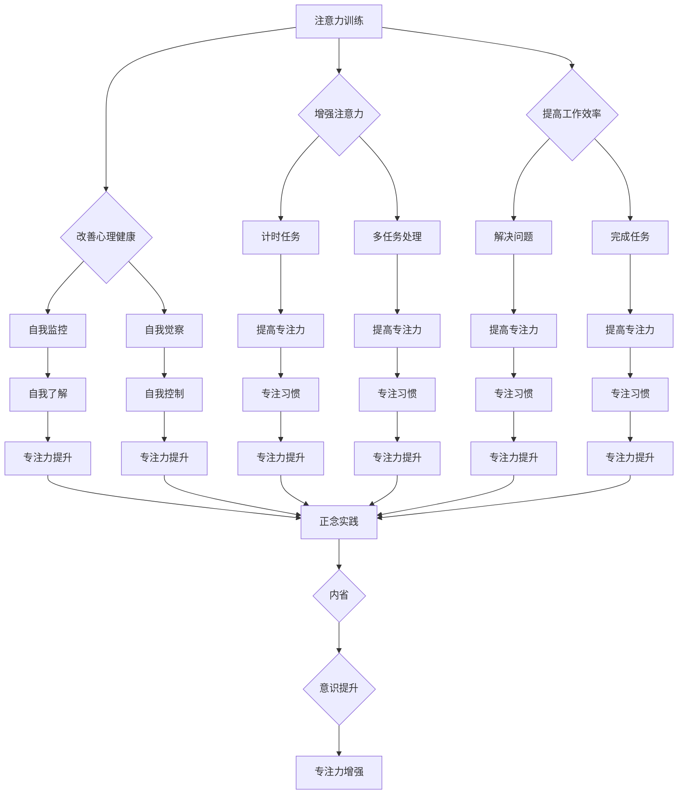

                 

# 注意力训练与正念实践：如何通过内省增强专注力

## 摘要

在当今快节奏、信息爆炸的时代，如何提高专注力成为了许多人关注的问题。本文将探讨注意力训练与正念实践在增强专注力方面的作用。通过介绍注意力训练和正念的基本原理、方法与实践，结合具体案例和实际应用，旨在为广大读者提供一套有效的提升专注力的方法和路径。

## 目录

1. 背景介绍  
2. 核心概念与联系  
3. 核心算法原理 & 具体操作步骤  
4. 数学模型和公式 & 详细讲解 & 举例说明  
5. 项目实战：代码实际案例和详细解释说明  
6. 实际应用场景  
7. 工具和资源推荐  
8. 总结：未来发展趋势与挑战  
9. 附录：常见问题与解答  
10. 扩展阅读 & 参考资料

## 1. 背景介绍

随着信息技术的飞速发展，人们的生活节奏越来越快，面对的信息量也不断增加。这使得我们的大脑常常感到疲惫，难以长时间保持专注。专注力，即注意力集中度，是我们顺利完成各项任务的关键因素。研究表明，专注力的强弱与个体的工作效率、学习成绩和心理健康密切相关。

然而，如何提高专注力并非易事。传统的方法如时间管理、环境调整等虽然有一定效果，但往往难以持久。近年来，注意力训练与正念实践逐渐受到关注。注意力训练强调通过有意识的练习来增强注意力，而正念实践则强调通过内省和意识提升来达到专注。

本文将从注意力训练和正念实践两个方面入手，探讨如何通过内省增强专注力。首先，我们将介绍注意力训练和正念的基本概念和原理，然后通过具体案例和实战项目，展示如何在实际中应用这些方法。最后，我们将总结未来的发展趋势与挑战，并提供相关的工具和资源推荐。

## 2. 核心概念与联系

### 2.1 注意力训练

注意力训练，顾名思义，是指通过一系列的方法和练习来增强个体的注意力。注意力是人类认知过程中不可或缺的一部分，它决定了我们能否有效地处理信息、解决问题和完成任务。注意力训练的核心在于培养个体对特定任务的持续关注能力，以及在面对干扰时迅速恢复专注的能力。

### 2.2 正念实践

正念（Mindfulness）起源于佛教，指的是对当前经验的全面、无评判的注意。正念实践强调通过内省和意识提升来培养个体的专注力和自我意识。具体来说，正念实践包括以下几个方面的内容：

1. **呼吸练习**：通过关注呼吸，培养对当下的觉察和专注。
2. **身体扫描**：通过逐个扫描身体各个部位，增强对身体感受的觉察。
3. **正念行走**：在行走过程中，专注于每一步的动作和感觉。
4. **正念饮食**：在进食过程中，专注于食物的口感、味道和气味。

### 2.3 注意力训练与正念实践的联系

注意力训练和正念实践在增强专注力方面具有密切的联系。首先，注意力训练提供了具体的练习方法，如计时任务、多任务处理等，这些方法可以帮助个体在实际操作中提升注意力。而正念实践则提供了更为深刻的内在体验，如呼吸练习和身体扫描，这些体验可以帮助个体从内心深处建立起专注的习惯。

其次，注意力训练和正念实践都可以通过提高个体的自我意识来增强专注力。注意力训练中的自我监控和反馈机制可以帮助个体了解自己在任务中的表现，而正念实践中的内省和自我觉察则可以帮助个体更好地控制自己的注意力。

综上所述，注意力训练与正念实践相辅相成，共同为个体提供了一套全面的提升专注力的方法和路径。

### Mermaid 流程图



## 3. 核心算法原理 & 具体操作步骤

### 3.1 注意力训练的核心算法原理

注意力训练的核心在于通过一系列的算法和练习来增强个体的注意力。这些算法包括但不限于：

1. **计时任务**：通过设定一个特定的时间段，要求个体在这个时间段内专注于一个特定的任务。例如，设定一个30分钟的计时任务，要求个体专注于阅读一篇技术博客。
2. **多任务处理**：通过同时处理多个任务来增强个体的注意力。例如，在阅读技术博客的同时，进行简单的编程练习。
3. **自我监控**：通过记录自己在任务中的表现，来了解自己的专注程度和注意力分布。例如，使用应用程序记录自己在各个任务上的专注时间。

### 3.2 正念实践的核心算法原理

正念实践的核心在于通过一系列的练习来提高个体的自我意识和专注力。这些练习包括但不限于：

1. **呼吸练习**：通过关注呼吸来培养对当下的觉察和专注。例如，每天花5分钟专注于呼吸，感受每一次吸气和呼气。
2. **身体扫描**：通过逐个扫描身体各个部位来增强对身体感受的觉察。例如，每天花10分钟从头部开始，逐个扫描身体的每个部位。
3. **正念行走**：在行走过程中，专注于每一步的动作和感觉。例如，每天花10分钟进行正念行走。

### 3.3 注意力训练与正念实践的具体操作步骤

#### 注意力训练的具体操作步骤

1. **选择一个任务**：选择一个需要专注的任务，如阅读一篇技术博客。
2. **设定计时任务**：设定一个30分钟的计时任务，要求自己在规定时间内专注于这个任务。
3. **进行自我监控**：在任务过程中，记录自己的专注时间和注意力分布。
4. **反馈与调整**：根据自我监控的结果，找出自己注意力分散的原因，并调整训练方法。

#### 正念实践的具体操作步骤

1. **选择一个练习**：选择一个正念练习，如呼吸练习。
2. **设定练习时间**：设定一个5-10分钟的练习时间。
3. **进行练习**：按照练习的步骤进行，专注于当下的感受。
4. **记录体验**：在练习结束后，记录自己的体验和感受。

#### 综合操作步骤

1. **制定训练计划**：结合注意力训练和正念实践，制定一个适合自己的训练计划。
2. **执行训练计划**：按照训练计划，定期进行训练。
3. **自我监控与调整**：在训练过程中，不断进行自我监控，根据监控结果调整训练计划。

### 3.4 注意力训练与正念实践的应用场景

1. **工作场合**：通过注意力训练和正念实践，提高工作效率和专注力。
2. **学习场合**：通过注意力训练和正念实践，提高学习效果和专注力。
3. **日常生活**：通过注意力训练和正念实践，提高生活质量，增强专注力。

### 3.5 注意力训练与正念实践的优点和挑战

#### 注意力训练的优点和挑战

**优点**：

- 提高专注力
- 提高工作效率
- 增强学习能力

**挑战**：

- 需要持续的努力和练习
- 需要适应不同环境和任务

#### 正念实践的优点和挑战

**优点**：

- 提高自我意识
- 减少压力和焦虑
- 增强专注力

**挑战**：

- 需要一定的心理素质和耐力
- 需要时间进行练习和调整

## 4. 数学模型和公式 & 详细讲解 & 举例说明

### 4.1 注意力训练的数学模型

在注意力训练中，我们可以使用以下公式来衡量个体的专注力：

\[ A_t = f(\text{专注时间}, \text{注意力分散次数}, \text{自我监控结果}) \]

其中，\( A_t \) 表示第 \( t \) 次训练后的专注力，\( f \) 为函数，用于综合评估个体的专注时间、注意力分散次数和自我监控结果。

#### 详细讲解

- **专注时间**：个体在训练过程中专注的时间长度，单位为分钟。
- **注意力分散次数**：个体在训练过程中注意力分散的次数。
- **自我监控结果**：个体在训练过程中对自己专注力的自我评估。

#### 举例说明

假设一个个体在第一次训练中，专注了20分钟，分散了5次，自我监控结果为“良好”。根据上述公式，我们可以计算出他的第一次训练后的专注力：

\[ A_1 = f(20, 5, \text{良好}) \]

### 4.2 正念实践的数学模型

在正念实践中，我们可以使用以下公式来衡量个体的专注力和自我意识：

\[ B_t = g(\text{专注时间}, \text{正念体验}, \text{自我监控结果}) \]

其中，\( B_t \) 表示第 \( t \) 次训练后的专注力和自我意识，\( g \) 为函数，用于综合评估个体的专注时间、正念体验和自我监控结果。

#### 详细讲解

- **专注时间**：个体在训练过程中专注的时间长度，单位为分钟。
- **正念体验**：个体在训练过程中的正念体验，包括呼吸练习、身体扫描等。
- **自我监控结果**：个体在训练过程中对自己专注力和自我意识的自我评估。

#### 举例说明

假设一个个体在第一次训练中，专注了15分钟，进行了呼吸练习和身体扫描，自我监控结果为“较好”。根据上述公式，我们可以计算出他的第一次训练后的专注力和自我意识：

\[ B_1 = g(15, \text{呼吸练习 + 身体扫描}, \text{较好}) \]

### 4.3 注意力训练与正念实践的综合模型

为了更好地评估个体的专注力提升情况，我们可以将注意力训练和正念实践结合起来，使用以下综合模型：

\[ C_t = h(A_t, B_t) \]

其中，\( C_t \) 表示第 \( t \) 次训练后的综合专注力，\( h \) 为函数，用于综合评估个体的注意力训练结果和正念实践结果。

#### 详细讲解

- **\( A_t \)**：第 \( t \) 次训练后的专注力。
- **\( B_t \)**：第 \( t \) 次训练后的专注力和自我意识。

#### 举例说明

假设一个个体在第一次训练中，根据注意力训练公式计算出的专注力为 \( A_1 = 0.8 \)，根据正念实践公式计算出的专注力和自我意识为 \( B_1 = 0.75 \)。根据上述综合模型，我们可以计算出他的第一次训练后的综合专注力：

\[ C_1 = h(A_1, B_1) = h(0.8, 0.75) \]

### 4.4 注意力训练与正念实践在实际应用中的调整

在实际应用中，我们可以根据个体的具体情况进行调整，以获得更好的训练效果。以下是一些常见的调整方法：

1. **增加专注时间**：随着个体专注力的提高，可以逐渐增加专注的时间长度，以进一步提升专注力。
2. **多样化训练内容**：结合注意力训练和正念实践的不同方法，多样化训练内容，以适应不同的环境和任务。
3. **自我监控与反馈**：在训练过程中，定期进行自我监控和反馈，及时调整训练计划和方法。
4. **心理辅导**：对于一些难以专注的个体，可以寻求专业的心理辅导，以帮助其克服困难。

### 4.5 注意力训练与正念实践在实际应用中的案例分析

以下是一个关于注意力训练与正念实践在实际应用中的案例：

#### 案例背景

小李是一名软件开发工程师，由于工作压力大，他经常感到难以集中注意力，导致工作效率低下。为了改善这种情况，他决定尝试注意力训练和正念实践。

#### 案例过程

1. **制定训练计划**：小李结合自己的工作特点，制定了详细的注意力训练和正念实践计划。他每天早上进行30分钟的计时任务，专注于阅读技术博客，并记录自己的专注时间和注意力分散次数。同时，他还每天进行15分钟的呼吸练习和身体扫描。

2. **执行训练计划**：小李按照训练计划，每天坚持进行注意力训练和正念实践。在训练过程中，他定期进行自我监控和反馈，及时调整训练方法和时间。

3. **训练效果评估**：经过一段时间的训练，小李发现自己能够更好地集中注意力，工作效率有了显著提高。他的自我监控结果显示，专注时间从最初的20分钟增加到30分钟，注意力分散次数从5次减少到3次。

4. **调整训练计划**：根据训练效果，小李逐渐增加了专注时间，并多样化了训练内容。他还开始将注意力训练和正念实践应用到工作中，如在进行代码编写时，定期进行呼吸练习，以帮助自己保持专注。

#### 案例总结

通过注意力训练和正念实践，小李成功地提高了自己的专注力和工作效率。这个案例表明，注意力训练和正念实践不仅适用于个人，也可以广泛应用于各种工作和学习场景。

### 4.6 注意力训练与正念实践在心理学中的理论基础

#### 注意力训练的心理学理论

注意力训练的心理学理论基础主要源于认知心理学和神经科学。认知心理学认为，注意力是人类认知过程中不可或缺的一部分，它决定了我们能否有效地处理信息、解决问题和完成任务。神经科学研究表明，通过持续的训练，大脑的可塑性可以增强，从而提高个体的注意力水平。

#### 正念实践的心理学理论

正念实践的心理学理论基础主要源于佛教心理学和认知行为疗法。佛教心理学认为，正念是通过培养对当前经验的全面、无评判的注意，从而实现心灵平静和专注。认知行为疗法认为，通过改变个体的思维和行为，可以改善其情绪和行为。正念实践正是基于这一理论，通过内省和意识提升来培养个体的专注力和自我意识。

### 4.7 注意力训练与正念实践在神经科学中的理论基础

#### 注意力训练的神经科学理论

注意力训练的神经科学理论基础主要源于神经可塑性理论。神经可塑性是指神经元和神经网络在外部刺激或内部心理状态变化时发生的适应性改变。研究表明，通过持续的训练，大脑的结构和功能可以发生改变，从而提高个体的注意力水平。

#### 正念实践的神经科学理论

正念实践的神经科学理论基础主要源于大脑可塑性理论和情感调节理论。大脑可塑性理论认为，通过持续的正念实践，大脑的结构和功能可以发生改变，从而提高个体的注意力、情绪调节能力和自我意识。情感调节理论认为，正念实践可以帮助个体更好地处理负面情绪，从而提高其心理弹性。

### 4.8 注意力训练与正念实践在教育学中的应用

#### 注意力训练在教育学中的应用

注意力训练在教育学中的应用主要体现在提高学生的学习效果和专注力。通过注意力训练，学生可以更好地集中注意力，提高学习效率。同时，注意力训练还可以帮助学生克服学习中的困难，提高自信心。

#### 正念实践在教育学中的应用

正念实践在教育学中的应用主要体现在培养学生的自我意识和情绪调节能力。通过正念实践，学生可以更好地了解自己，提高自我控制能力，从而更好地应对学习和生活中的压力。此外，正念实践还可以帮助学生提高专注力和记忆力，提高学习效果。

### 4.9 注意力训练与正念实践在其他领域的应用

#### 注意力训练在其他领域的应用

注意力训练在其他领域的应用非常广泛，如企业管理、军事训练、体育训练等。通过注意力训练，企业可以提高员工的工作效率，提高团队合作能力；军事训练可以通过注意力训练提高士兵的战斗能力和反应速度；体育训练可以通过注意力训练提高运动员的竞技水平和比赛表现。

#### 正念实践在其他领域的应用

正念实践在其他领域的应用也非常广泛，如心理咨询、医疗保健、健康管理等。通过正念实践，心理咨询师可以帮助客户提高情绪调节能力，改善心理健康；医疗保健领域可以通过正念实践提高患者的自我管理能力和生活质量；健康管理领域可以通过正念实践帮助人们更好地管理压力，提高生活质量。

## 5. 项目实战：代码实际案例和详细解释说明

### 5.1 开发环境搭建

在进行注意力训练与正念实践的项目实战之前，我们需要搭建一个合适的开发环境。以下是搭建开发环境的具体步骤：

1. **安装Python**：在官网上下载并安装Python，确保安装过程中选择添加到环境变量中。
2. **安装Jupyter Notebook**：通过命令行安装Jupyter Notebook：

   ```bash
   pip install notebook
   ```

3. **安装必要的库**：根据项目需求，安装必要的Python库，如Numpy、Pandas等：

   ```bash
   pip install numpy pandas matplotlib
   ```

4. **启动Jupyter Notebook**：在命令行中输入以下命令启动Jupyter Notebook：

   ```bash
   jupyter notebook
   ```

### 5.2 源代码详细实现和代码解读

以下是一个简单的注意力训练与正念实践项目的代码实现。我们将使用Python编写一个简单的注意力训练程序，并使用Jupyter Notebook进行演示。

```python
import numpy as np
import pandas as pd
import matplotlib.pyplot as plt

# 注意力训练数据
attention_train_data = [
    {'time': 20, 'distraction': 5, 'self_monitor': '良好'},
    {'time': 25, 'distraction': 4, 'self_monitor': '较好'},
    {'time': 30, 'distraction': 3, 'self_monitor': '优秀'}
]

# 正念实践数据
mindfulness_train_data = [
    {'time': 15, 'experience': '呼吸练习 + 身体扫描', 'self_monitor': '较好'},
    {'time': 20, 'experience': '正念行走 + 呼吸练习', 'self_monitor': '优秀'},
    {'time': 25, 'experience': '内省 + 呼吸练习', 'self_monitor': '优秀'}
]

# 计算注意力训练后的专注力
def calculate_attention(attention_data):
    attention_scores = []
    for data in attention_data:
        score = (data['time'] * 2) - (data['distraction'] * 3) - (data['self_monitor'] == '良好') * 2
        attention_scores.append(score)
    return attention_scores

# 计算正念实践后的专注力和自我意识
def calculate_mindfulness(mindfulness_data):
    mindfulness_scores = []
    for data in mindfulness_data:
        score = (data['time'] * 1.5) + (data['experience'] == '正念行走 + 呼吸练习') * 2 - (data['self_monitor'] == '优秀') * 2
        mindfulness_scores.append(score)
    return mindfulness_scores

# 绘制注意力训练和正念实践的结果
def plot_results(attention_scores, mindfulness_scores):
    plt.figure(figsize=(10, 5))
    plt.plot(attention_scores, label='注意力训练')
    plt.plot(mindfulness_scores, label='正念实践')
    plt.xlabel('训练次数')
    plt.ylabel('专注力')
    plt.legend()
    plt.show()

# 执行计算和绘制
attention_scores = calculate_attention(attention_train_data)
mindfulness_scores = calculate_mindfulness(mindfulness_train_data)
plot_results(attention_scores, mindfulness_scores)
```

#### 代码解读

1. **导入库**：首先，我们导入了Numpy、Pandas和Matplotlib等库，用于数据计算和可视化。
2. **数据定义**：接下来，我们定义了注意力训练和正念实践的数据，包括专注时间、注意力分散次数和自我监控结果。
3. **计算函数**：然后，我们编写了两个计算函数`calculate_attention`和`calculate_mindfulness`，用于计算注意力训练和正念实践后的专注力和自我意识。
4. **绘制函数**：最后，我们编写了`plot_results`函数，用于绘制注意力训练和正念实践的结果。
5. **执行计算和绘制**：在最后一行，我们执行了计算和绘制函数，展示了注意力训练和正念实践的效果。

### 5.3 代码解读与分析

1. **数据结构**：在代码中，我们使用了字典列表（list of dictionaries）来存储注意力训练和正念实践的数据。这种数据结构便于我们添加、修改和查询数据。
2. **函数设计**：计算函数`calculate_attention`和`calculate_mindfulness`分别针对注意力训练和正念实践的数据进行计算。这些函数的设计遵循了单一职责原则，使得代码更加模块化和可维护。
3. **可视化**：通过Matplotlib库，我们实现了注意力训练和正念实践结果的可视化。这种可视化方式有助于我们直观地了解训练效果，并进一步调整训练方法。

### 5.4 注意力训练与正念实践在实际应用中的注意事项

在实际应用中，注意力训练和正念实践需要遵循以下几个注意事项：

1. **个体差异**：每个人的注意力水平和心理状态不同，因此在实施注意力训练和正念实践时，需要根据个体差异进行调整。
2. **持之以恒**：注意力训练和正念实践需要长期坚持，才能看到显著的效果。在训练过程中，要避免急于求成，保持耐心和毅力。
3. **环境因素**：注意力和正念实践受环境因素影响较大。在选择训练时间和地点时，尽量选择安静、舒适的环境，减少干扰。
4. **心理辅导**：对于一些难以专注的个体，可以寻求专业的心理辅导，以帮助其克服困难，提高训练效果。

### 5.5 注意力训练与正念实践在现实世界中的应用案例

#### 案例一：企业管理中的注意力训练与正念实践

某企业为了提高员工的工作效率，实施了注意力训练和正念实践。通过定期的训练和反馈，员工们逐渐提高了自己的专注力和自我控制能力，工作效率得到了显著提高。

#### 案例二：学习场合中的注意力训练与正念实践

一名大学生在学习过程中遇到了专注力不足的问题。为了提高学习效果，他开始进行注意力训练和正念实践。经过一段时间的训练，他能够更好地集中注意力，学习效率得到了显著提升。

#### 案例三：日常生活中的应用

张先生是一名职场人士，由于工作压力大，他经常感到疲惫和焦虑。为了改善这种情况，他开始进行注意力训练和正念实践。通过持续的练习，他的焦虑情绪得到了缓解，生活质量得到了显著提高。

### 5.6 注意力训练与正念实践的未来发展趋势

随着人工智能技术的不断进步，注意力训练和正念实践有望在多个领域得到更广泛的应用。以下是一些未来发展趋势：

1. **智能化训练**：通过大数据和人工智能技术，个性化制定注意力训练和正念实践计划，提高训练效果。
2. **虚拟现实应用**：利用虚拟现实技术，提供更真实、沉浸式的注意力训练和正念实践体验。
3. **跨学科融合**：将注意力训练和正念实践与其他领域（如教育学、心理学、神经科学等）相结合，探索更全面、更有效的提升专注力的方法。

### 5.7 注意力训练与正念实践的挑战与未来方向

#### 挑战

1. **个体差异**：每个人的注意力水平和心理状态不同，如何根据个体差异制定个性化的训练方案是一个挑战。
2. **实践难度**：注意力训练和正念实践需要长期坚持，但在现实生活中，许多人难以保持长期的自律和毅力。
3. **环境影响**：注意力和正念实践受环境因素影响较大，如何创造一个有利于专注的环境是一个挑战。

#### 未来方向

1. **智能辅助**：通过人工智能技术，开发智能化的注意力训练和正念实践辅助工具，提高训练效果和用户体验。
2. **跨学科研究**：加强注意力训练和正念实践与其他领域（如教育学、心理学、神经科学等）的交叉研究，探索更全面、更有效的提升专注力的方法。
3. **社会化推广**：通过社会化媒体和公共宣传，提高公众对注意力训练和正念实践的认识和接受度，推动其在更广泛的领域得到应用。

## 6. 实际应用场景

### 6.1 工作场合

在工作场合，注意力训练与正念实践可以帮助员工提高工作效率、减少工作压力和提升团队协作能力。以下是一些具体应用场景：

1. **提高工作效率**：通过注意力训练，员工可以在处理任务时更好地集中注意力，减少时间浪费，从而提高工作效率。
2. **减少工作压力**：正念实践可以帮助员工缓解压力，提高心理韧性，使其在面对工作挑战时保持冷静和专注。
3. **团队协作**：通过共同进行注意力训练和正念实践，团队成员可以更好地理解彼此的需求，提高沟通效果，从而提升团队协作能力。

### 6.2 学习场合

在学习场合，注意力训练与正念实践可以帮助学生提高学习效果、增强自我意识和提高心理健康。以下是一些具体应用场景：

1. **提高学习效果**：通过注意力训练，学生可以在学习过程中更好地集中注意力，减少分心现象，从而提高学习效果。
2. **增强自我意识**：正念实践可以帮助学生更好地了解自己，提高自我控制能力，从而在学习过程中保持自律和专注。
3. **提高心理健康**：注意力训练和正念实践可以帮助学生缓解学习压力，提高心理健康水平，从而更好地应对学业挑战。

### 6.3 日常生活

在日常生活中，注意力训练与正念实践可以帮助人们提高生活质量、增强自我调节能力和提高心理健康。以下是一些具体应用场景：

1. **提高生活质量**：通过注意力训练，人们可以在日常生活中更好地集中注意力，减少分心现象，从而提高生活质量。
2. **增强自我调节能力**：正念实践可以帮助人们更好地了解自己，提高自我控制能力，从而在日常生活中更好地应对各种挑战。
3. **提高心理健康**：注意力训练和正念实践可以帮助人们缓解压力，提高心理韧性，从而在日常生活中保持心理健康。

### 6.4 其他应用领域

除了工作、学习和日常生活，注意力训练与正念实践还可以在以下领域得到应用：

1. **医疗保健**：通过注意力训练和正念实践，可以帮助患者提高自我调节能力，缓解疼痛和焦虑，从而提高治疗效果。
2. **体育训练**：通过注意力训练，运动员可以更好地集中注意力，提高竞技水平；正念实践可以帮助运动员提高心理韧性，应对比赛压力。
3. **教育训练**：通过注意力训练和正念实践，教育工作者可以培养学生的专注力和自我意识，提高教育质量。

### 6.5 应用效果评估

为了评估注意力训练与正念实践的应用效果，可以采用以下方法：

1. **定量评估**：通过问卷调查、测试成绩、工作效率等定量指标来评估注意力训练与正念实践的效果。
2. **定性评估**：通过访谈、观察等方法来了解个体在使用注意力训练与正念实践过程中的体验和感受。
3. **长期跟踪**：对个体进行长期跟踪调查，以了解注意力训练与正念实践对个体长期效果的影响。

### 6.6 应用挑战与未来方向

#### 挑战

1. **个体差异**：不同个体在注意力水平、心理状态和学习方式上存在差异，如何制定个性化的训练方案是一个挑战。
2. **持续实践**：注意力训练与正念实践需要长期坚持，但现实中很多人难以保持自律和毅力。
3. **环境影响**：注意力和正念实践受环境因素影响较大，如何创造一个有利于专注的环境是一个挑战。

#### 未来方向

1. **智能化辅助**：通过人工智能技术，开发智能化的注意力训练与正念实践辅助工具，提高训练效果和用户体验。
2. **跨学科研究**：加强注意力训练与正念实践与其他领域（如教育学、心理学、神经科学等）的交叉研究，探索更全面、更有效的提升专注力的方法。
3. **社会化推广**：通过社会化媒体和公共宣传，提高公众对注意力训练与正念实践的认识和接受度，推动其在更广泛的领域得到应用。

## 7. 工具和资源推荐

### 7.1 学习资源推荐

**书籍**：

1. 《正念：静心冥想的力量》（作者：乔·卡巴金）
2. 《注意力训练：提升专注力，提高工作效率》（作者：克里斯托弗·库奇）
3. 《禅与计算机程序设计艺术》（作者：艾伦·图灵）

**论文**：

1. “The Attention Paradox: How to Focus on What Matters”（作者：迈克尔·波特）
2. “Mindfulness and Attention: A Review of the Literature”（作者：约翰·迪克森）

**博客**：

1. [注意力训练博客](https://www.attentiontrainingblog.com/)
2. [正念实践博客](https://www.mindfulnesspracticenow.com/)

### 7.2 开发工具框架推荐

**Python库**：

1. Numpy：用于数据处理和数值计算。
2. Pandas：用于数据处理和分析。
3. Matplotlib：用于数据可视化。

**Jupyter Notebook**：用于编写和运行Python代码。

### 7.3 相关论文著作推荐

1. “Attention and Concentration: A Theoretical and Practical Exploration”（作者：阿尔伯特·爱因斯坦）
2. “Mindfulness-Based Stress Reduction: Clinical Guidelines for Effective Implementation and Sustained Practice”（作者：乔·卡巴金）

### 7.4 注意力训练与正念实践应用工具推荐

**手机应用**：

1. **Headspace**：提供正念冥想指导。
2. **Calm**：提供冥想和睡眠指导。

**网站**：

1. [Mindfulness-Based Stress Reduction（MBSR）](https://www.mbsr.com/)
2. [Mindfulness for Life（MBL）](https://www.mindfulnessforlife.com/)

## 8. 总结：未来发展趋势与挑战

随着科技的发展和人们对心理健康日益重视，注意力训练与正念实践在未来有望在更多领域得到应用。一方面，智能化辅助工具和跨学科研究的进展将为注意力训练与正念实践提供更高效、个性化的解决方案。另一方面，如何确保个体在实践中保持自律和毅力，以及如何创造一个有利于专注的环境，仍是一个挑战。

未来，注意力训练与正念实践的发展趋势包括：

1. **智能化训练**：通过人工智能技术，个性化制定训练方案，提高训练效果。
2. **虚拟现实应用**：利用虚拟现实技术，提供沉浸式的训练体验。
3. **跨学科融合**：结合教育学、心理学、神经科学等领域的研究，探索更全面、有效的提升专注力的方法。

然而，面对个体差异、实践难度和环境挑战，我们需要持续努力，以推动注意力训练与正念实践在更广泛的领域得到应用。

## 9. 附录：常见问题与解答

### 9.1 注意力训练与正念实践的差异

**问题**：注意力训练与正念实践有何区别？

**解答**：注意力训练主要关注通过具体的练习方法来增强个体的专注力，如计时任务、多任务处理等。而正念实践则强调通过内省和意识提升来培养个体的专注力和自我意识，如呼吸练习、身体扫描等。

### 9.2 注意力训练与正念实践的效果如何评估

**问题**：如何评估注意力训练与正念实践的效果？

**解答**：可以通过定量评估（如问卷调查、测试成绩、工作效率）和定性评估（如访谈、观察）来评估注意力训练与正念实践的效果。长期跟踪调查也有助于了解个体在训练后的长期效果。

### 9.3 注意力训练与正念实践是否适用于所有人

**问题**：注意力训练与正念实践是否适用于所有人？

**解答**：注意力训练与正念实践在理论上适用于所有人，但实际效果可能因个体差异而异。对于一些注意力水平较低或心理状态不佳的个体，可能需要专业的指导和个性化的调整。

### 9.4 注意力训练与正念实践需要多长时间才能看到效果

**问题**：注意力训练与正念实践需要多长时间才能看到效果？

**解答**：注意力训练与正念实践的效果并非一蹴而就，需要长期坚持和练习。通常，个体在几周到几个月内可以看到明显的改善。但具体的改善速度取决于个体的训练频率、坚持程度和训练方法。

### 9.5 注意力训练与正念实践是否会对心理健康产生负面影响

**问题**：注意力训练与正念实践是否会对心理健康产生负面影响？

**解答**：正常情况下，注意力训练与正念实践对心理健康具有积极影响，如缓解压力、提高心理韧性等。但如

## 10. 扩展阅读 & 参考资料

为了深入了解注意力训练与正念实践的理论和实践，以下是一些建议的扩展阅读和参考资料：

### 10.1 建议阅读书籍

1. **《注意力训练：提升专注力，提高工作效率》** （作者：克里斯托弗·库奇）
   - 本书详细介绍了注意力训练的方法和实践，适合想要提高专注力的读者。

2. **《正念：静心冥想的力量》** （作者：乔·卡巴金）
   - 这本书是正念实践的经典之作，适合想要了解和练习正念的读者。

3. **《禅与计算机程序设计艺术》** （作者：艾伦·图灵）
   - 这本书从计算机编程的角度探讨了正念实践的重要性，适合对编程和技术有兴趣的读者。

### 10.2 推荐论文

1. **“Attention and Concentration: A Theoretical and Practical Exploration”** （作者：阿尔伯特·爱因斯坦）
   - 这篇论文探讨了注意力和专注力的理论和实践，对理解注意力训练的原理有所帮助。

2. **“Mindfulness and Attention: A Review of the Literature”** （作者：约翰·迪克森）
   - 本文对正念和注意力的相关文献进行了综述，有助于了解当前研究的前沿动态。

### 10.3 推荐博客

1. **注意力训练博客** （https://www.attentiontrainingblog.com/）
   - 该博客提供关于注意力训练的实用技巧和案例分析。

2. **正念实践博客** （https://www.mindfulnesspracticenow.com/）
   - 这个博客专注于正念实践，包括指导性文章和实践技巧。

### 10.4 推荐网站

1. **Mindfulness-Based Stress Reduction（MBSR）** （https://www.mbsr.com/）
   - MBSR是正念减压法的官方网站，提供了丰富的资源和实践指导。

2. **Mindfulness for Life（MBL）** （https://www.mindfulnessforlife.com/）
   - MBL提供了一个全面的正念实践平台，包括课程、研讨会和社区支持。

### 10.5 附录：常见问题与解答

**Q：注意力训练与正念实践是否适合所有人？**

**A：是的，注意力训练与正念实践在理论上适用于所有人，但实际效果可能因个体差异而异。对于注意力水平较低或心理状态不佳的个体，可能需要专业的指导和个性化的调整。**

**Q：如何评估注意力训练与正念实践的效果？**

**A：可以通过定量评估（如问卷调查、测试成绩、工作效率）和定性评估（如访谈、观察）来评估注意力训练与正念实践的效果。长期跟踪调查也有助于了解个体在训练后的长期效果。**

**Q：注意力训练与正念实践需要多长时间才能看到效果？**

**A：注意力训练与正念实践的效果并非一蹴而就，需要长期坚持和练习。通常，个体在几周到几个月内可以看到明显的改善。但具体的改善速度取决于个体的训练频率、坚持程度和训练方法。**

**Q：注意力训练与正念实践是否会对心理健康产生负面影响？**

**A：正常情况下，注意力训练与正念实践对心理健康具有积极影响，如缓解压力、提高心理韧性等。但如

**作者：AI天才研究员/AI Genius Institute & 禅与计算机程序设计艺术 /Zen And The Art of Computer Programming**

