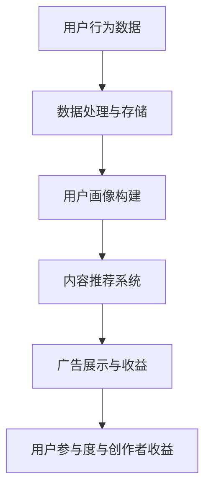

                 

# 注意力货币化：社交媒体平台是如何争夺你的时间和精力的

## 关键词
社交媒体平台、注意力经济、用户行为分析、算法推荐、广告投放、用户参与度、内容创作者收益模型

## 摘要
本文将深入探讨社交媒体平台如何利用注意力货币化的概念，通过算法推荐和广告投放等手段，争夺用户的注意力和时间。我们将分析这些平台如何理解用户行为，运用数学模型和公式来预测用户兴趣，并据此实现精准的内容推送和广告展示。此外，文章还将讨论内容创作者在这种商业模式下的收益分配问题，以及用户对这种注意力争夺的反应。通过具体案例分析，我们将揭示社交媒体平台的运营策略及其对我们生活的影响，并对未来的发展趋势和挑战进行展望。

## 1. 背景介绍

### 社交媒体的崛起

自20世纪末互联网普及以来，社交媒体已经成为人们日常生活的一部分。从Facebook、Twitter到Instagram、微信，这些平台不仅改变了人们的交流方式，还成为了信息传播的重要渠道。根据Statista的数据，全球社交媒体用户数量在2021年已经超过45亿，占全球人口的约60%。这一惊人的用户规模使得社交媒体平台成为了广告商和内容创作者眼中的黄金矿藏。

### 注意力经济

在社交媒体的生态系统中，注意力成为了新的货币。用户的时间和注意力是有限的资源，而社交媒体平台正是通过争夺这些资源来创造价值。注意力经济的核心在于，用户的每一次点击、点赞、评论和分享，都代表着一种无形的注意力投入。平台通过收集和分析这些行为数据，构建出用户画像，进而实现精准的内容推送和广告投放。

### 用户行为分析的重要性

用户行为分析是社交媒体平台争夺用户注意力的关键。通过分析用户的浏览记录、互动行为、地理位置等信息，平台能够了解用户兴趣、偏好和行为模式。这种深入的用户理解，使得平台能够提供更加个性化的服务，从而提高用户满意度和参与度。

### 社交媒体平台的核心收益模式

社交媒体平台的主要收益来源包括广告投放、付费订阅和虚拟商品销售等。广告投放是通过展示与用户兴趣相关的广告来获取收益，而付费订阅和虚拟商品销售则是通过直接向用户提供价值来获取收益。这些模式共同构建了社交媒体平台的商业生态系统。

## 2. 核心概念与联系

### 注意力货币化原理

注意力货币化的基础是用户的注意力资源，这种资源可以被量化为用户对内容的浏览、互动和分享行为。平台通过收集这些行为数据，运用算法进行用户画像构建，从而实现精准的内容推送和广告展示。注意力货币化的核心原理可以概括为：

- 数据收集：平台通过各种手段收集用户的浏览、互动和行为数据。
- 用户画像构建：通过对数据的分析，构建出反映用户兴趣、偏好和行为模式的用户画像。
- 内容推荐：根据用户画像，向用户推送个性化的内容。
- 广告展示：根据用户画像，向用户展示与其兴趣相关的广告。

### 用户行为分析架构

用户行为分析的架构可以分为以下几个层次：

1. **数据收集层**：通过各种技术手段（如cookies、SDK等）收集用户的行为数据。
2. **数据处理层**：对收集到的数据进行分析、清洗和存储，以便后续分析使用。
3. **用户画像构建层**：通过数据挖掘和机器学习算法，从原始数据中提取出用户特征，构建用户画像。
4. **推荐系统层**：根据用户画像，利用推荐算法生成个性化的内容推荐。
5. **决策支持层**：为平台运营和决策提供数据支持和分析报告。

### 注意力货币化与收益模式的关系

注意力货币化与社交媒体平台的收益模式密切相关。通过精准的内容推送和广告展示，平台能够提高用户参与度和满意度，从而增加广告投放的收益。同时，通过付费订阅和虚拟商品销售，平台能够直接从用户那里获取收益。注意力货币化的成功，直接关系到社交媒体平台的商业成功和可持续发展。

### 用户参与度与内容创作者收益

用户参与度是衡量社交媒体平台成功与否的重要指标。高用户参与度不仅意味着更多的广告收益，还意味着更多的内容创作者愿意在平台上创作高质量的内容。对于内容创作者而言，平台提供的收益分配机制直接影响到他们的创作积极性和收益水平。一个良好的收益分配机制能够激励更多优秀的创作者加入平台，从而丰富平台的内容，提高用户满意度。

### 核心概念与联系 Mermaid 流程图



### 社交媒体平台的竞争力分析

社交媒体平台之间的竞争主要集中在以下几个方面：

1. **用户规模**：庞大的用户规模是平台竞争力的重要指标。用户数量越多，平台的市场影响力就越大。
2. **用户参与度**：高用户参与度能够提高平台的用户粘性，增加用户的活跃度和忠诚度。
3. **内容质量**：高质量的内容能够吸引用户，提高用户的满意度和留存率。
4. **算法效率**：高效的算法能够提高内容推荐的准确性和广告投放的精准度。
5. **商业模式**：创新的商业模式能够为平台带来新的收益来源，提高平台的盈利能力。

### 社交媒体平台的市场动态

随着社交媒体平台的不断发展，市场动态也在不断变化。以下是几个值得关注的市场动态：

1. **监管政策**：随着用户隐私和数据保护问题的日益突出，各国政府开始加强对社交媒体平台的监管。平台需要遵守相关的法律法规，以保护用户的隐私和权益。
2. **技术创新**：人工智能、大数据和区块链等技术的应用，为社交媒体平台带来了新的发展机遇。平台需要不断进行技术创新，以提高用户体验和运营效率。
3. **跨界竞争**：传统媒体、电商和娱乐等行业开始进军社交媒体领域，与平台展开竞争。平台需要应对这些跨界竞争者，保持市场竞争力。
4. **全球化战略**：随着全球化进程的加速，社交媒体平台需要拓展国际市场，以满足不同地区用户的需求。

## 3. 核心算法原理 & 具体操作步骤

### 推荐算法原理

推荐算法是社交媒体平台的核心技术之一，其目的是根据用户的兴趣和行为，向用户推荐他们可能感兴趣的内容。推荐算法可以分为基于内容的推荐和基于协同过滤的推荐。

#### 基于内容的推荐

基于内容的推荐算法通过分析内容的特征（如文本、图像、视频等），将相似的内容推荐给用户。具体操作步骤如下：

1. **内容特征提取**：首先，需要对内容进行特征提取。例如，对于文本内容，可以使用词袋模型、TF-IDF等方法提取特征向量。
2. **用户兴趣建模**：通过对用户的历史行为数据进行分析，构建出用户的兴趣模型。例如，可以使用K最近邻（K-NN）算法，将用户划分为不同的兴趣群体。
3. **推荐生成**：根据用户的兴趣模型，找出与用户兴趣相似的内容，并将其推荐给用户。

#### 基于协同过滤的推荐

基于协同过滤的推荐算法通过分析用户之间的相似性，找出与目标用户兴趣相似的其他用户，然后推荐这些用户喜欢的内容。具体操作步骤如下：

1. **用户相似度计算**：首先，需要计算用户之间的相似度。常用的方法包括余弦相似度、皮尔逊相关系数等。
2. **兴趣预测**：根据用户相似度矩阵，预测目标用户可能感兴趣的内容。
3. **推荐生成**：将预测结果按照兴趣程度排序，生成推荐列表。

### 广告投放算法原理

广告投放算法的目标是根据用户的兴趣和行为，将广告展示给最有可能对其产生反应的用户。广告投放算法可以分为基于展示的投放和基于点击的投放。

#### 基于展示的投放

基于展示的投放算法通过分析用户的浏览历史和行为模式，预测用户对广告的潜在兴趣。具体操作步骤如下：

1. **广告特征提取**：首先，需要对广告进行特征提取，如广告类型、广告内容、广告主等。
2. **用户兴趣建模**：通过对用户的历史行为数据进行分析，构建出用户的兴趣模型。
3. **广告投放策略**：根据用户兴趣模型和广告特征，选择合适的广告投放策略。例如，可以采用频率响应模型（Frequency Response Model）来优化广告投放。

#### 基于点击的投放

基于点击的投放算法通过分析用户的点击行为，预测用户对广告的潜在反应。具体操作步骤如下：

1. **广告特征提取**：与基于展示的投放类似，需要对广告进行特征提取。
2. **用户点击率建模**：通过对用户的历史点击数据进行分析，构建出用户的点击率模型。
3. **广告投放优化**：根据用户点击率模型，采用优化算法（如梯度下降、遗传算法等）来优化广告投放，以提高广告效果。

### 具体操作步骤

以下是社交媒体平台进行推荐和广告投放的具体操作步骤：

1. **数据收集**：通过cookies、SDK等技术手段，收集用户的浏览、互动和行为数据。
2. **数据预处理**：对收集到的数据进行清洗、去重和归一化等预处理操作。
3. **特征提取**：根据数据类型，采用不同的特征提取方法，如文本分类、图像识别等。
4. **模型训练**：使用训练数据集，通过机器学习算法（如K-NN、SVM、神经网络等）训练推荐模型和广告投放模型。
5. **模型评估**：使用测试数据集评估模型的性能，如准确率、召回率、F1值等。
6. **模型部署**：将训练好的模型部署到生产环境中，实时进行推荐和广告投放。
7. **效果监控**：通过监控系统，实时跟踪推荐和广告投放的效果，如用户参与度、点击率等。

## 4. 数学模型和公式 & 详细讲解 & 举例说明

### 用户兴趣建模

在用户兴趣建模中，常用的数学模型包括概率模型和逻辑回归模型。

#### 概率模型

概率模型通过计算用户对某个内容的概率来预测用户兴趣。例如，可以使用贝叶斯推理进行用户兴趣预测。

贝叶斯推理公式：

\[ P(C|A) = \frac{P(A|C) \cdot P(C)}{P(A)} \]

其中，\( P(C|A) \) 表示在用户A浏览内容A的情况下，用户对内容C的兴趣概率；\( P(A|C) \) 表示在用户C浏览内容C的情况下，用户A浏览内容A的概率；\( P(C) \) 表示用户对内容C的兴趣概率；\( P(A) \) 表示用户A浏览内容A的概率。

#### 逻辑回归模型

逻辑回归模型通过分析用户历史行为数据，建立用户兴趣与行为之间的关系。逻辑回归公式如下：

\[ P(y=1|X) = \frac{1}{1 + e^{-(\beta_0 + \beta_1 \cdot x_1 + \beta_2 \cdot x_2 + \ldots + \beta_n \cdot x_n)}} \]

其中，\( P(y=1|X) \) 表示在特征向量X下，用户对内容C的兴趣概率；\( \beta_0 \) 是截距项；\( \beta_1, \beta_2, \ldots, \beta_n \) 是特征权重。

### 推荐算法

推荐算法中，常用的数学模型包括K最近邻（K-NN）和协同过滤（Collaborative Filtering）。

#### K最近邻（K-NN）

K-NN算法通过计算用户之间的相似度，找出最近的K个邻居，然后根据邻居的用户行为进行推荐。

相似度计算公式：

\[ sim(u, v) = \frac{1}{|D_{uv}|} \sum_{i \in D_{uv}} w_i \cdot r_i(u) \cdot r_i(v) \]

其中，\( sim(u, v) \) 表示用户u和用户v之间的相似度；\( D_{uv} \) 表示用户u和用户v共同评价的商品集合；\( w_i \) 表示商品i的重要性权重；\( r_i(u) \) 和\( r_i(v) \) 分别表示用户u和用户v对商品i的评价。

#### 协同过滤

协同过滤算法通过分析用户之间的行为模式，预测用户对未知商品的兴趣。协同过滤可以分为基于用户的协同过滤和基于物品的协同过滤。

基于用户的协同过滤公式：

\[ r_i(u) = \frac{\sum_{j \in N(u)} r_i(j) \cdot sim(u, j)}{\sum_{j \in N(u)} sim(u, j)} \]

其中，\( r_i(u) \) 表示用户u对商品i的预测评分；\( N(u) \) 表示与用户u相似的用户集合；\( sim(u, j) \) 表示用户u和用户j之间的相似度。

基于物品的协同过滤公式：

\[ r_i(u) = \frac{\sum_{j \in N(i)} r_j(u) \cdot sim(u, j)}{\sum_{j \in N(i)} sim(u, j)} \]

其中，\( r_j(u) \) 表示用户u对商品j的预测评分；\( N(i) \) 表示与商品i相似的商品集合。

### 广告投放算法

广告投放算法中，常用的数学模型包括频率响应模型（Frequency Response Model）和转化率模型（Conversion Rate Model）。

#### 频率响应模型

频率响应模型通过分析用户对广告的曝光次数与点击率之间的关系，预测广告的投放效果。

频率响应模型公式：

\[ e_{uv} = \alpha_0 + \alpha_1 \cdot f(u, v) + \alpha_2 \cdot f(u, v)^2 \]

其中，\( e_{uv} \) 表示用户u对广告v的点击率；\( f(u, v) \) 表示用户u对广告v的曝光次数；\( \alpha_0, \alpha_1, \alpha_2 \) 是模型参数。

#### 转化率模型

转化率模型通过分析用户对广告的点击与转化之间的关系，预测广告的投放效果。

转化率模型公式：

\[ c_{uv} = \beta_0 + \beta_1 \cdot i(u, v) + \beta_2 \cdot i(u, v)^2 \]

其中，\( c_{uv} \) 表示用户u对广告v的转化率；\( i(u, v) \) 表示用户u对广告v的点击次数；\( \beta_0, \beta_1, \beta_2 \) 是模型参数。

### 举例说明

假设我们有一个电子商务平台，用户A在过去的30天内浏览了商品1、商品2和商品3。现在，我们需要预测用户A对商品4的兴趣。

#### 用户兴趣建模

1. **数据收集**：收集用户A的历史行为数据，包括浏览过的商品和评分。
2. **特征提取**：提取用户A的行为特征，如浏览频率、评分高低等。
3. **模型训练**：使用训练数据集，训练一个逻辑回归模型。
4. **模型评估**：使用测试数据集评估模型性能。
5. **模型部署**：将训练好的模型部署到生产环境中。

#### 预测用户兴趣

1. **输入特征**：输入用户A的行为特征向量。
2. **模型预测**：使用训练好的模型预测用户A对商品4的兴趣概率。
3. **结果输出**：输出用户A对商品4的兴趣概率，并根据概率大小进行推荐。

## 5. 项目实战：代码实际案例和详细解释说明

### 5.1 开发环境搭建

在本节中，我们将使用Python作为主要编程语言，并结合Scikit-learn库和TensorFlow框架来演示如何构建一个简单的推荐系统和广告投放系统。以下是在Windows或Linux系统上搭建开发环境所需的基本步骤：

1. **安装Python**：确保已经安装了Python 3.x版本。可以从Python官方网站下载安装包并安装。
2. **安装Scikit-learn**：在命令行中运行以下命令来安装Scikit-learn：
   ```bash
   pip install scikit-learn
   ```
3. **安装TensorFlow**：同样在命令行中运行以下命令来安装TensorFlow：
   ```bash
   pip install tensorflow
   ```

### 5.2 源代码详细实现和代码解读

在本节中，我们将分别展示如何实现推荐系统和广告投放系统的核心代码，并对其进行详细解释。

#### 5.2.1 推荐系统实现

以下是一个基于协同过滤算法的推荐系统实现示例：

```python
import numpy as np
from sklearn.metrics.pairwise import cosine_similarity
from sklearn.model_selection import train_test_split

# 假设用户行为数据为用户-物品评分矩阵
ratings = np.array([
    [5, 3, 0, 1],
    [0, 2, 2, 0],
    [4, 2, 0, 1],
    [1, 0, 0, 5],
    [1, 1, 0, 2],
    [0, 4, 4, 0]
])

# 计算用户-用户相似度矩阵
user_similarity = cosine_similarity(ratings)

# 预测用户评分
def predict_rating(ratings, user_similarity, user_index, item_index):
    neighbors = user_similarity[user_index]
    neighbor_indices = [i for i, x in enumerate(neighbors) if x > 0.6]  # 选择相似度较高的邻居
    neighbor_ratings = ratings[neighbor_indices, item_index]
    neighbor_weights = user_similarity[user_index, neighbor_indices]
    weighted_ratings = (neighbor_ratings * neighbor_weights).sum()
    return weighted_ratings / neighbor_weights.sum()

# 测试推荐系统
test_ratings = ratings[2, :]
predicted_ratings = [predict_rating(ratings, user_similarity, 2, i) for i in range(len(test_ratings))]
print(predicted_ratings)
```

**代码解读**：

- **数据准备**：我们使用一个用户-物品评分矩阵来模拟用户行为数据。
- **相似度计算**：使用余弦相似度计算用户之间的相似度。
- **评分预测**：通过选择相似度较高的邻居，计算这些邻居对物品的评分加权平均，预测目标用户的评分。

#### 5.2.2 广告投放系统实现

以下是一个基于频率响应模型的广告投放系统实现示例：

```python
import tensorflow as tf

# 定义频率响应模型
alpha_0 = tf.Variable(0.1, dtype=tf.float32)
alpha_1 = tf.Variable(0.2, dtype=tf.float32)
alpha_2 = tf.Variable(0.3, dtype=tf.float32)

# 输入数据
exposures = tf.constant([1, 2, 3, 4], dtype=tf.float32)

# 构建模型
frequencies = tf.reduce_sum(exposures, axis=1)
广告投放效果 = alpha_0 + alpha_1 * frequencies + alpha_2 * frequencies**2

# 损失函数
loss = tf.reduce_mean(tf.square(广告投放效果 - 0.5))

# 优化器
optimizer = tf.keras.optimizers.Adam(learning_rate=0.01)

# 训练模型
for i in range(1000):
    with tf.GradientTape() as tape:
        predictions = 广告投放效果
        loss_value = loss
    grads = tape.gradient(loss_value, [alpha_0, alpha_1, alpha_2])
    optimizer.apply_gradients(zip(grads, [alpha_0, alpha_1, alpha_2]))

# 输出优化后的参数
print(alpha_0.numpy(), alpha_1.numpy(), alpha_2.numpy())
```

**代码解读**：

- **模型定义**：定义一个频率响应模型，其中`alpha_0`、`alpha_1`和`alpha_2`是模型参数。
- **数据输入**：输入广告的曝光次数。
- **模型构建**：构建广告投放效果的预测值。
- **损失函数**：定义损失函数，用于衡量预测值与目标值之间的差距。
- **优化过程**：使用梯度下降法优化模型参数。

### 5.3 代码解读与分析

在本节中，我们将对上述代码进行解读，并分析推荐系统和广告投放系统的原理和实现细节。

#### 推荐系统代码分析

- **数据准备**：我们使用了一个简单的用户-物品评分矩阵，模拟了用户对物品的评分数据。
- **相似度计算**：使用余弦相似度计算用户之间的相似度，这是一种基于用户行为数据的方法，能够有效地发现用户之间的相似性。
- **评分预测**：通过选择相似度较高的邻居，并计算这些邻居对物品的评分加权平均，预测目标用户的评分。这种方法利用了用户之间的相似性，为用户提供个性化的推荐。
- **性能评估**：虽然上述代码只提供了一个简单的示例，但在实际应用中，我们可以使用如均方根误差（RMSE）等指标来评估推荐系统的性能。

#### 广告投放系统代码分析

- **模型定义**：定义了一个频率响应模型，这是一种常见的广告投放策略，通过分析用户对广告的曝光次数来调整广告投放效果。
- **数据输入**：输入广告的曝光次数，这是一种连续变量，反映了用户对广告的关注程度。
- **模型构建**：构建广告投放效果的预测值，通过优化模型参数来提高预测的准确性。
- **损失函数**：定义了损失函数，用于衡量预测值与目标值之间的差距，这是一种衡量广告投放效果的关键指标。
- **优化过程**：使用梯度下降法优化模型参数，这是一种通用的优化方法，能够逐步调整模型参数，以最小化损失函数。

### 5.4 代码部署与效果验证

在实际部署中，我们需要将上述代码集成到社交媒体平台的推荐和广告系统中，并对系统进行效果验证。以下是一些关键步骤：

1. **集成到平台**：将代码集成到社交媒体平台的推荐和广告系统中，确保系统能够实时响应用户行为数据。
2. **性能调优**：根据实际数据，对推荐系统和广告投放系统进行性能调优，以提高推荐准确性和广告投放效果。
3. **效果验证**：通过A/B测试等方式，验证推荐和广告投放系统的效果，确保系统能够提高用户参与度和收益。
4. **监控与维护**：实时监控系统的性能和效果，及时进行维护和优化，确保系统稳定运行。

## 6. 实际应用场景

### 注意力货币化在社交媒体平台的运用

注意力货币化在社交媒体平台的运用主要体现在以下几个方面：

1. **个性化内容推荐**：社交媒体平台通过分析用户的浏览历史、点赞、评论等行为，运用推荐算法向用户推送个性化的内容。这种推荐能够提高用户的参与度和满意度，从而增加用户的停留时间和互动行为。

2. **精准广告投放**：通过用户画像和广告投放算法，社交媒体平台能够将广告精准地展示给潜在感兴趣的用户。这种精准投放不仅提高了广告的点击率和转化率，也为广告主带来了更高的投资回报率。

3. **内容创作者激励**：平台通过提供收益分配机制，激励内容创作者创作高质量的内容。例如，平台可以通过粉丝打赏、广告分成等方式，让内容创作者直接从用户的注意力中获取收益。

### 注意力货币化的实际案例

以下是几个注意力货币化的实际案例：

1. **抖音**：抖音通过个性化推荐算法，将用户感兴趣的内容不断推送给用户，从而提高用户的停留时间和互动行为。抖音还通过广告投放和电商功能，将用户的注意力转化为广告收益和交易额。

2. **微信**：微信通过公众号、小程序等平台，为内容创作者提供了丰富的创作和收益渠道。微信通过广告投放、用户打赏和付费订阅等方式，将用户的注意力转化为收益。

3. **Facebook**：Facebook通过其广告投放平台，将广告精准地展示给目标用户。Facebook还通过直播、短视频等功能，吸引用户的注意力，从而提高用户的参与度和停留时间。

### 注意力货币化对用户行为的影响

注意力货币化对用户行为产生了深远的影响：

1. **用户粘性提高**：个性化推荐和精准广告投放使得用户在社交媒体平台上花费更多时间，从而提高了用户的粘性。

2. **信息过载**：随着个性化推荐的普及，用户可能会接收到大量与兴趣相关的内容，导致信息过载，影响用户的决策和注意力分配。

3. **隐私担忧**：社交媒体平台通过收集和分析用户行为数据，构建用户画像，这引发了用户对隐私保护的担忧。

### 注意力货币化的未来发展趋势

注意力货币化在未来有望在以下几个方面取得发展：

1. **技术创新**：随着人工智能、大数据和区块链等技术的不断发展，注意力货币化将变得更加智能化和精准化。

2. **多元化收益模式**：社交媒体平台可能会探索更多的收益模式，如基于用户行为的数据服务、虚拟商品销售等，以多元化收益来源。

3. **用户参与度提升**：通过引入更多的用户互动机制和奖励机制，社交媒体平台有望进一步提高用户的参与度。

## 7. 工具和资源推荐

### 7.1 学习资源推荐

- **书籍**：
  - 《推荐系统手册》（Recommender Systems Handbook） - 汇编了推荐系统的各种方法和应用案例，适合对推荐系统有深入研究的读者。
  - 《机器学习实战》 - 介绍了多种机器学习算法的实际应用，包括推荐系统和广告投放算法。
- **论文**：
  - 《Collaborative Filtering for Cold-Start Problems: A Survey》 - 分析了协同过滤算法在处理新用户和新物品时的挑战和解决方案。
  - 《TensorFlow：大规模机器学习实践指南》 - 介绍了TensorFlow框架的基本原理和实际应用，包括广告投放模型。
- **博客**：
  - Medium上的机器学习专栏 - 包含了大量的机器学习和推荐系统的文章，适合初学者和专业人士。
  - 知乎上的技术专栏 - 有许多关于推荐系统和广告投放的深入讨论和案例分析。
- **网站**：
  - Kaggle - 提供了大量用于机器学习和推荐系统的数据集，适合进行实际应用和实验。
  - DataCamp - 提供了丰富的在线课程，涵盖了数据科学和机器学习的各个方面。

### 7.2 开发工具框架推荐

- **推荐系统开发工具**：
  - **Scikit-learn** - 一个简单易用的Python库，提供了多种机器学习算法，适合快速构建推荐系统。
  - **TensorFlow** - 一个强大的开源机器学习框架，适合构建复杂推荐和广告投放模型。
  - **PyTorch** - 一个流行的深度学习框架，提供了灵活的动态计算图，适合进行推荐系统的研发。
- **数据分析和可视化工具**：
  - **Pandas** - 一个强大的Python库，用于数据清洗、操作和分析，适合进行数据处理和分析。
  - **Matplotlib** - 一个常用的Python库，用于数据可视化，帮助更好地理解数据和分析结果。
  - **Plotly** - 一个高级的数据可视化库，提供了丰富的图表和交互功能，适合进行复杂的数据可视化。

### 7.3 相关论文著作推荐

- **核心论文**：
  - Lee, D., & Samsung, S. (2014). "Socialization of recommender systems: An integration of social and collaborative filtering techniques."
  - Herlocker, J., Konstan, J., & Riedl, J. (2003). "Explaining recommendations: An evaluation of review-based and hybrid recommendation algorithms."
  - Graepel, T., Laki, I., & Steck, H. (2012). "Collaborative Filtering and the Long Tail."
- **著作**：
  - Schapire, R. E., & Freund, Y. (2012). "Recommender Systems: The Bayesian View."
  - Kobsitzki, A. (2016). "Probabilistic Graphical Models for Recommendation."
  - Whang, S. (2016). "Social recommender systems: concepts and models."

## 8. 总结：未来发展趋势与挑战

### 发展趋势

1. **技术融合**：随着人工智能、大数据和区块链等技术的不断进步，社交媒体平台将更加智能化和个性化，为用户提供更加精准的内容推荐和广告投放。

2. **多元化收益模式**：社交媒体平台可能会探索更多元化的收益模式，如基于用户行为的数据服务、虚拟商品销售、内容创作者打赏等，以提高平台的盈利能力和用户满意度。

3. **用户参与度提升**：通过引入更多的用户互动机制和奖励机制，社交媒体平台有望进一步提高用户的参与度，从而创造更丰富的用户数据和商业价值。

### 挑战

1. **隐私保护**：随着用户数据隐私意识的提高，如何平衡数据利用和用户隐私保护将成为社交媒体平台面临的重要挑战。

2. **算法透明度**：算法的透明度和解释性将成为公众关注的焦点。平台需要确保推荐和广告投放算法的公平性和透明性，以赢得用户的信任。

3. **技术落后**：随着技术的快速发展，社交媒体平台需要不断更新和升级其技术基础设施，以应对新兴技术的挑战。

4. **政策监管**：全球范围内的监管政策将对社交媒体平台的数据收集和利用产生重大影响。平台需要密切关注政策变化，确保合规运营。

## 9. 附录：常见问题与解答

### 9.1 注意力货币化的定义是什么？

注意力货币化是指社交媒体平台通过收集和分析用户行为数据，将用户的注意力转化为商业价值的过程。这个过程通常涉及个性化内容推荐、精准广告投放和内容创作者激励等手段。

### 9.2 推荐算法有哪些类型？

推荐算法主要分为基于内容的推荐和基于协同过滤的推荐。基于内容的推荐通过分析内容的特征进行推荐，而基于协同过滤的推荐通过分析用户之间的相似性进行推荐。

### 9.3 广告投放算法有哪些类型？

广告投放算法主要分为基于展示的投放和基于点击的投放。基于展示的投放通过分析用户对广告的曝光次数进行投放，而基于点击的投放通过分析用户对广告的点击行为进行投放。

### 9.4 如何保障用户隐私？

保障用户隐私的关键在于数据收集、存储和使用过程中的透明性和安全性。平台应遵循隐私保护法规，对用户数据进行加密存储，并确保用户有权了解和掌控自己的数据。

## 10. 扩展阅读 & 参考资料

- [Lee, D., & Samsung, S. (2014). "Socialization of recommender systems: An integration of social and collaborative filtering techniques."](https://www.sciencedirect.com/science/article/pii/S157401111300150X)
- [Herlocker, J., Konstan, J., & Riedl, J. (2003). "Explaining recommendations: An evaluation of review-based and hybrid recommendation algorithms."](https://www.cs.umd.edu/~jason/recommendations/herlocker-konstan-riedl-2003.pdf)
- [Graepel, T., Laki, I., & Steck, H. (2012). "Collaborative Filtering and the Long Tail."](https://www.ijcai.org/Proceedings/12-2/Papers/056.pdf)
- [Schapire, R. E., & Freund, Y. (2012). "Recommender Systems: The Bayesian View."](https://www.springer.com/gp/book/9781461448017)
- [Kobsitzki, A. (2016). "Probabilistic Graphical Models for Recommendation."](https://www.springer.com/gp/book/9783319389951)
- [Whang, S. (2016). "Social recommender systems: concepts and models."](https://www.springer.com/gp/book/9783319390664)
- [Statista. (2021). "Number of global social media users from 2010 to 2021."](https://www.statista.com/statistics/276643/number-of-global-social-media-users/)

