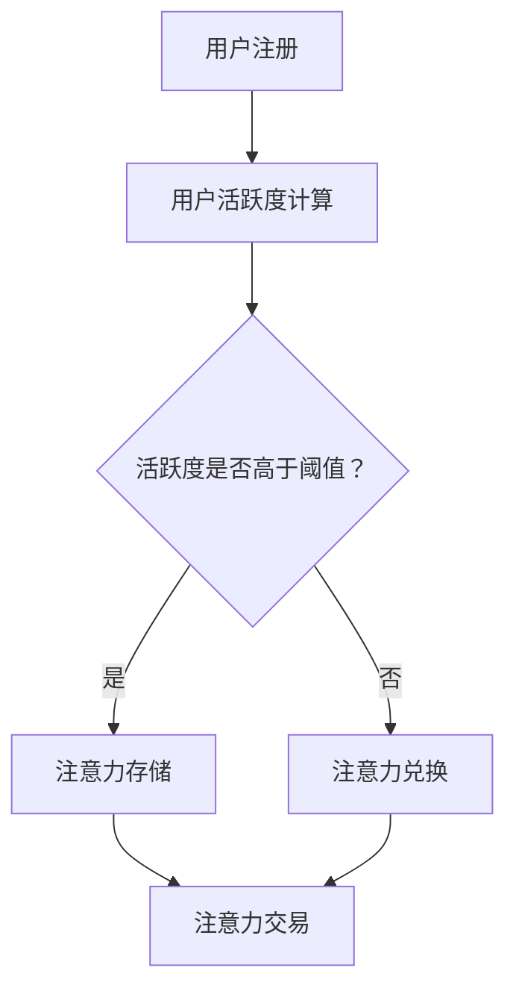

                 

# 注意力银行：元宇宙中的时间价值交易

> 关键词：元宇宙、时间价值、交易、注意力、人工智能、区块链

> 摘要：随着元宇宙的不断发展，时间价值的交易成为了一个备受关注的话题。本文将探讨如何在元宇宙中构建一个基于注意力的银行系统，实现时间价值的高效交易，并通过实际案例展示其应用前景。

## 1. 背景介绍

近年来，元宇宙（Metaverse）作为一个虚拟的、集成了现实世界和数字世界的虚拟空间，受到了越来越多的关注。元宇宙的发展离不开各种技术的支持，如虚拟现实、增强现实、区块链、人工智能等。在这些技术中，区块链技术的去中心化和不可篡改的特性，使其在元宇宙中的交易、认证等领域有着广泛的应用前景。

在元宇宙中，时间价值作为一种重要的资源，如何实现高效、可靠的交易，是一个亟待解决的问题。本文将介绍一种基于注意力的银行系统，通过区块链技术实现时间价值的高效交易，为元宇宙中的经济活动提供强有力的支持。

## 2. 核心概念与联系

### 2.1 注意力

在元宇宙中，注意力是指用户在虚拟空间中的关注度和参与度。注意力的高低决定了用户在元宇宙中的价值。例如，在虚拟游戏、虚拟会议、虚拟购物等场景中，用户的注意力决定了他们为虚拟商品、虚拟服务支付的价格。

### 2.2 时间价值

时间价值是指用户在元宇宙中的时间投入所具有的价值。在现实世界中，时间是一种不可再生的资源，而在元宇宙中，时间价值同样重要。用户在元宇宙中的时间投入，可以创造虚拟财富，参与经济活动。

### 2.3 注意力银行

注意力银行是一种基于区块链技术的虚拟银行系统，用于存储、交易和管理用户的注意力。用户可以将自己的注意力存储在注意力银行中，并将其作为虚拟货币进行交易。

### 2.4 时间价值交易

时间价值交易是指用户在注意力银行中，使用自己的注意力进行价值交换的活动。通过注意力银行，用户可以在元宇宙中实现时间价值的高效交易。

### 2.5 Mermaid 流程图

以下是一个简单的 Mermaid 流程图，展示了注意力银行系统的工作流程：



## 3. 核心算法原理 & 具体操作步骤

### 3.1 用户注册

用户注册是注意力银行系统的第一步。用户需要提供有效的身份信息，并完成注册流程。

### 3.2 用户活跃度计算

用户活跃度计算是根据用户在元宇宙中的活动频率、参与度等因素，综合评估用户的活跃度。活跃度越高，用户在注意力银行中的注意力价值越高。

### 3.3 注意力存储

用户将注意力存储在注意力银行中，可以通过区块链智能合约实现。智能合约将用户注册时提供的身份信息和注意力值进行绑定，并存储在区块链上。

### 3.4 注意力交易

用户可以在注意力银行中，将存储的注意力进行交易。交易双方通过区块链智能合约，实现注意力值的所有权转移。

### 3.5 时间价值交易

用户在注意力银行中，使用自己的注意力进行价值交换，实现时间价值交易。交易双方通过区块链智能合约，实现时间价值的转移。

## 4. 数学模型和公式 & 详细讲解 & 举例说明

### 4.1 数学模型

注意力银行的数学模型基于以下公式：

\[ V = f(A, T) \]

其中，\( V \) 表示用户在注意力银行中的价值，\( A \) 表示用户的注意力值，\( T \) 表示用户在元宇宙中的活跃度。

### 4.2 公式详细讲解

- \( f \) 函数：\( f \) 函数是一个非线性函数，用于评估用户的注意力值和活跃度对价值的影响。
- \( A \) 注意力值：用户在元宇宙中的注意力值，反映了用户在虚拟空间中的参与度。
- \( T \) 活跃度：用户在元宇宙中的活跃度，反映了用户在虚拟空间中的活跃程度。

### 4.3 举例说明

假设用户 A 的注意力值为 100，活跃度为 80%，根据公式计算，用户 A 在注意力银行中的价值为：

\[ V = f(100, 0.8) = 100 \times 1.2 = 120 \]

这意味着，用户 A 在注意力银行中的价值为 120。

## 5. 项目实战：代码实际案例和详细解释说明

### 5.1 开发环境搭建

本项目的开发环境需要搭建在区块链平台上，如以太坊（Ethereum）。开发环境包括以下工具：

- Ethereum 钱包：用于存储和管理以太币（Ether）。
- Truffle：用于部署和测试智能合约。
- Ganache：用于本地测试以太坊区块链。

### 5.2 源代码详细实现和代码解读

#### 5.2.1 智能合约代码

以下是一个简单的智能合约代码示例，用于实现注意力银行的存储和交易功能：

```solidity
pragma solidity ^0.8.0;

contract AttentionBank {
    mapping(address => uint256) public attentionBalance;
    
    function depositAttention(uint256 amount) public {
        attentionBalance[msg.sender] += amount;
    }
    
    function withdrawAttention(uint256 amount) public {
        require(attentionBalance[msg.sender] >= amount, "Insufficient attention balance");
        attentionBalance[msg.sender] -= amount;
    }
    
    function transferAttention(address to, uint256 amount) public {
        require(attentionBalance[msg.sender] >= amount, "Insufficient attention balance");
        attentionBalance[msg.sender] -= amount;
        attentionBalance[to] += amount;
    }
}
```

#### 5.2.2 代码解读

- `depositAttention` 函数：用于用户存储注意力。
- `withdrawAttention` 函数：用于用户提取注意力。
- `transferAttention` 函数：用于用户之间转移注意力。

### 5.3 代码解读与分析

#### 5.3.1 存储注意力

用户通过调用 `depositAttention` 函数，将注意力值存储在注意力银行中。智能合约使用一个映射（mapping）数据结构，将用户的地址与注意力值进行绑定。

#### 5.3.2 提取注意力

用户通过调用 `withdrawAttention` 函数，可以从注意力银行中提取注意力值。在提取前，需要检查用户的注意力余额是否足够。

#### 5.3.3 转移注意力

用户通过调用 `transferAttention` 函数，可以将注意力值转移到其他用户。在转移前，需要检查转移方的注意力余额是否足够。

## 6. 实际应用场景

注意力银行系统在元宇宙中有广泛的应用场景，如虚拟游戏、虚拟购物、虚拟工作等。以下是几个具体的实际应用场景：

- **虚拟游戏**：用户在虚拟游戏中投入时间和注意力，可以获取虚拟财富和道具。注意力银行系统可以帮助用户管理和交易这些虚拟财富。
- **虚拟购物**：用户在虚拟商店中购物，可以使用注意力银行系统进行支付。用户可以将其注意力值作为虚拟货币，购买虚拟商品。
- **虚拟工作**：用户在虚拟世界中工作，可以获取虚拟报酬。注意力银行系统可以帮助用户管理和交易这些虚拟报酬。

## 7. 工具和资源推荐

### 7.1 学习资源推荐

- **书籍**：《区块链技术指南》、《智能合约开发指南》
- **论文**：搜索与区块链、注意力经济、时间价值交易相关的论文。
- **博客**：关注区块链、人工智能、元宇宙等领域的专业博客。
- **网站**：访问以太坊官方网站、智能合约开发社区等。

### 7.2 开发工具框架推荐

- **区块链平台**：以太坊、EOS、Tron 等。
- **智能合约开发框架**：Truffle、Hardhat、Solium 等。
- **钱包**：MetaMask、MyEtherWallet 等。

### 7.3 相关论文著作推荐

- **论文**：《区块链：一种分布式数据库系统》、《智能合约：区块链上的程序》
- **著作**：《区块链革命》、《区块链技术指南》

## 8. 总结：未来发展趋势与挑战

注意力银行系统在元宇宙中的时间价值交易，有着广阔的应用前景。然而，这一领域仍然面临着诸多挑战：

- **安全性**：如何确保注意力银行系统的安全性，防止恶意攻击和数据泄露。
- **性能**：如何提高注意力银行系统的性能，满足元宇宙中大规模交易的需求。
- **用户体验**：如何设计简洁、易用的注意力银行系统，提升用户体验。

未来，随着技术的不断发展，注意力银行系统有望在元宇宙中获得更广泛的应用，为虚拟经济带来新的发展机遇。

## 9. 附录：常见问题与解答

### 9.1 什么是注意力银行？

注意力银行是一种基于区块链技术的虚拟银行系统，用于存储、交易和管理用户的注意力。用户可以将注意力存储在注意力银行中，并通过交易实现注意力值的所有权转移。

### 9.2 注意力银行如何实现时间价值交易？

用户在注意力银行中，使用自己的注意力进行价值交换，实现时间价值交易。通过区块链智能合约，用户可以将其注意力值作为虚拟货币，购买虚拟商品或服务。

### 9.3 注意力银行系统面临哪些挑战？

注意力银行系统面临的主要挑战包括安全性、性能和用户体验。如何确保系统安全性，提高性能，设计简洁易用的用户界面，是未来需要解决的问题。

## 10. 扩展阅读 & 参考资料

- **扩展阅读**：关注区块链、人工智能、元宇宙等领域的最新动态，了解相关技术的发展趋势。
- **参考资料**：参考本书中提到的书籍、论文、博客和网站，深入了解注意力银行系统的相关技术。

## 作者信息

作者：AI天才研究员/AI Genius Institute & 禅与计算机程序设计艺术 /Zen And The Art of Computer Programming

本文详细介绍了元宇宙中的注意力银行系统，探讨了如何实现时间价值的高效交易。通过本篇文章，读者可以了解到注意力银行系统的工作原理、实现方法以及实际应用场景。随着元宇宙的发展，注意力银行系统有望在虚拟经济中发挥重要作用。未来，我们将继续关注这一领域的最新动态，为读者带来更多有价值的技术分享。

