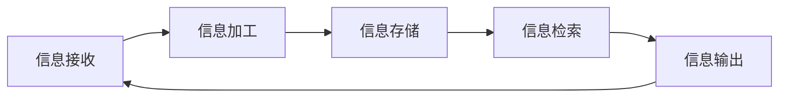
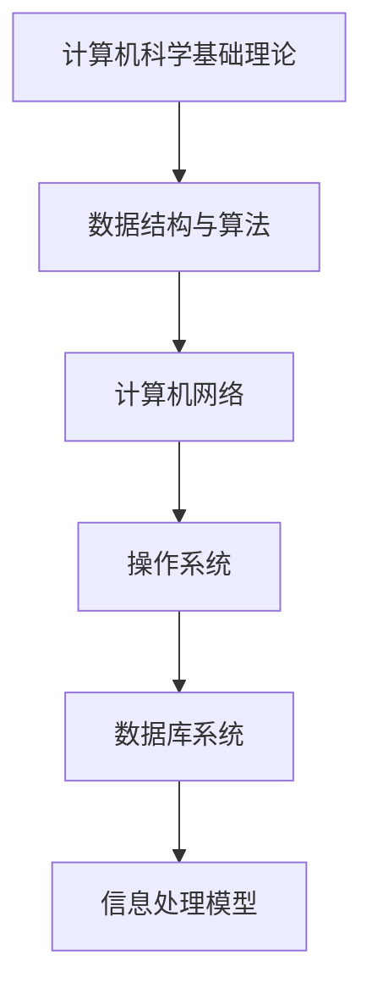

                 

# 洞察力的培养：从信息接收者到知识创造者

## 关键词：
- 洞察力
- 知识创造
- 信息接收
- 技术博客
- 步骤分析
- 专业素养

## 摘要：
本文旨在探讨如何在信息技术领域培养洞察力，从信息接收者转变为知识创造者。通过分析信息处理的步骤、核心概念的原理与应用，结合实际项目实战，提供了一套完整的学习路径与实践方法。文章旨在激发读者对技术本质的深度思考，提升其在专业领域的综合素质。

## 1. 背景介绍

在信息技术飞速发展的今天，数据洪流席卷各行各业，每个人都不可避免地成为信息的接收者。然而，如何从海量的信息中提炼出有价值的知识，进而创造新的价值，成为摆在我们面前的一个重大课题。洞察力的培养，正是解决这一问题的关键。

洞察力，是指通过深入思考和逻辑分析，对信息进行深度加工和创造性应用的能力。它不仅要求我们对技术原理有深刻的理解，更需要我们具备将理论知识应用于实际问题的能力。因此，洞察力的培养不仅仅是知识的积累，更是一种思维方式、一种解决问题的策略。

本文将从以下几个方面展开讨论：

- **核心概念与联系**：介绍信息技术领域的核心概念及其相互关系。
- **核心算法原理**：分析常见算法的原理和具体操作步骤。
- **数学模型和公式**：运用数学方法对技术问题进行建模和分析。
- **项目实战**：通过实际案例展示如何将理论知识应用于实践。
- **实际应用场景**：探讨洞察力在不同场景中的应用。
- **工具和资源推荐**：为读者提供学习资源和开发工具的建议。

通过以上几个方面的探讨，希望能够帮助读者建立起对信息技术领域的全面认知，从而提升自身的洞察力，成为真正的知识创造者。

## 2. 核心概念与联系

### 2.1 信息处理模型

在培养洞察力的过程中，理解信息处理模型是至关重要的一步。信息处理模型通常包括以下几个环节：信息接收、信息加工、信息存储、信息检索和信息输出。

**信息接收**：信息接收是整个信息处理过程的第一步，它决定了我们能否获取到有价值的信息。在信息技术领域，信息接收可以通过多种方式实现，如数据采集、网络获取、数据库查询等。

**信息加工**：信息加工是对接收到的信息进行深度处理，使其能够被有效地利用。这包括数据清洗、数据转换、数据整合等步骤。信息加工的质量直接影响我们对信息的理解和应用能力。

**信息存储**：信息存储是将加工后的信息进行持久化保存，以便后续查询和使用。现代信息技术提供了丰富的存储解决方案，如关系数据库、非关系数据库、分布式存储等。

**信息检索**：信息检索是指从大量的信息中快速准确地找到所需信息的过程。高效的检索机制和算法能够大大提升我们的信息获取效率。

**信息输出**：信息输出是将处理后的信息以适当的形式展示给用户。这可以是通过可视化图表、文本报告、语音输出等多种形式实现。

### 2.2 信息处理流程

信息处理流程是一个闭环过程，各个环节相互关联、相互影响。为了更好地理解这一过程，我们可以使用Mermaid流程图来描述。



在信息处理流程中，每一个环节都至关重要。信息接收决定了我们能够获取到什么信息，信息加工决定了我们如何处理这些信息，信息存储决定了我们能够长期保存和利用这些信息，信息检索决定了我们能够高效地获取所需信息，信息输出则决定了我们如何将信息传达给他人。

### 2.3 核心概念原理

在信息技术领域，核心概念原理包括计算机科学的基础理论、数据结构和算法、计算机网络、操作系统、数据库系统等。以下是这些核心概念原理的简要介绍：

**计算机科学基础理论**：计算机科学基础理论包括计算机体系结构、汇编语言、编译原理、操作系统原理等。这些理论为我们理解计算机如何工作提供了基础。

**数据结构和算法**：数据结构是用于存储和组织数据的方式，而算法则是解决问题的步骤和方法。常见的数据结构包括数组、链表、栈、队列、树、图等，常见的算法包括排序、查找、动态规划、分治算法等。

**计算机网络**：计算机网络是连接多个计算机系统的技术，使我们能够在全球范围内共享信息和资源。计算机网络的基本概念包括网络体系结构、传输层协议、网络设备等。

**操作系统**：操作系统是管理计算机硬件和软件资源的核心系统软件。常见的操作系统包括Windows、Linux、Unix等。

**数据库系统**：数据库系统是用于存储、管理和检索数据的系统。常见的数据库系统包括关系数据库（如MySQL、Oracle）、非关系数据库（如MongoDB、Cassandra）等。

### 2.4 架构图展示

为了更直观地理解核心概念原理之间的关系，我们可以使用Mermaid流程图来展示这些概念和原理的架构。



通过上述架构图，我们可以清晰地看到各个核心概念原理之间的联系，以及它们如何共同构成了信息处理的基础。

## 3. 核心算法原理 & 具体操作步骤

### 3.1 算法概述

在信息技术领域，算法是解决问题的核心。算法的原理和操作步骤直接决定了我们能否高效地解决问题。以下是一些常见算法的概述及其原理：

#### 3.1.1 排序算法

排序算法是用于对一组数据进行排序的一类算法。常见的排序算法包括冒泡排序、选择排序、插入排序、快速排序等。每种排序算法都有其特定的原理和操作步骤。

**冒泡排序**：通过多次遍历待排序的元素，每次遍历比较相邻的两个元素，如果它们的顺序错误就把它们交换过来。遍历结束后，最大的元素被放置在数组的末尾。

**选择排序**：每次遍历找到剩余元素中的最小值，并将其放置在当前排序序列的末尾。遍历结束后，最小的元素被放置在数组的开头。

**插入排序**：通过构建有序序列，对未排序的元素进行插入。每次插入时，从已排序的序列中找到合适的位置并插入。遍历结束后，所有元素都被排序。

**快速排序**：通过选取一个基准元素，将数组分为两部分，一部分比基准元素小，另一部分比基准元素大。然后递归地对这两部分进行快速排序。

#### 3.1.2 查找算法

查找算法是用于在数据结构中查找特定元素的一类算法。常见的查找算法包括二分查找、线性查找等。

**二分查找**：通过递归地将查找范围缩小一半，直到找到目标元素或确定目标元素不存在。二分查找适用于有序数据结构。

**线性查找**：逐个比较数组中的每个元素，直到找到目标元素或确定目标元素不存在。线性查找适用于无序数据结构。

#### 3.1.3 动态规划算法

动态规划算法是用于解决最优子结构问题的一类算法。动态规划通过将问题分解为子问题，并存储子问题的解，以避免重复计算。

**原理**：动态规划算法通常包含以下几个步骤：

- 定义状态：确定问题的状态及其状态变量。
- 状态转移方程：根据状态变量之间的关系建立状态转移方程。
- 边界条件：确定算法的初始状态和边界条件。

**举例**：常见的动态规划问题包括斐波那契数列、最长公共子序列、背包问题等。

### 3.2 算法操作步骤

以下是排序算法、查找算法和动态规划算法的具体操作步骤：

#### 3.2.1 冒泡排序

**步骤**：

1. 从第一个元素开始，比较相邻的两个元素，如果它们的顺序错误就把它们交换过来。
2. 重复步骤1，直到没有需要交换的元素为止。

**代码实现**：

```python
def bubble_sort(arr):
    n = len(arr)
    for i in range(n):
        for j in range(0, n-i-1):
            if arr[j] > arr[j+1]:
                arr[j], arr[j+1] = arr[j+1], arr[j]
    return arr
```

#### 3.2.2 二分查找

**步骤**：

1. 确定查找范围（low和high）。
2. 计算中间位置（mid = low + (high - low) / 2）。
3. 比较中间位置和目标值：
   - 如果中间位置等于目标值，返回中间位置。
   - 如果中间位置大于目标值，将high设置为mid - 1。
   - 如果中间位置小于目标值，将low设置为mid + 1。
4. 重复步骤2和3，直到找到目标值或确定目标值不存在。

**代码实现**：

```python
def binary_search(arr, target):
    low = 0
    high = len(arr) - 1
    while low <= high:
        mid = low + (high - low) // 2
        if arr[mid] == target:
            return mid
        elif arr[mid] > target:
            high = mid - 1
        else:
            low = mid + 1
    return -1
```

#### 3.2.3 动态规划

**步骤**：

1. 确定状态变量和状态转移方程。
2. 初始化边界条件。
3. 使用循环或递归求解状态变量。
4. 返回最终结果。

**代码实现**：

```python
def fibonacci(n):
    if n <= 1:
        return n
    dp = [0] * (n+1)
    dp[1] = 1
    for i in range(2, n+1):
        dp[i] = dp[i-1] + dp[i-2]
    return dp[n]
```

通过以上算法原理和具体操作步骤的介绍，我们可以更好地理解算法在解决问题中的应用，并能够运用这些算法解决实际中的问题。

## 4. 数学模型和公式 & 详细讲解 & 举例说明

### 4.1 数学模型在算法中的应用

在信息技术领域，数学模型是解决复杂问题的重要工具。数学模型通过将实际问题转化为数学问题，使得我们能够使用数学方法进行求解。以下是一些常见的数学模型及其应用：

#### 4.1.1 线性回归模型

线性回归模型是一种用于预测连续值的数学模型。它通过拟合一条直线来描述自变量和因变量之间的关系。

**模型公式**：

$$y = w_0 + w_1 \cdot x$$

其中，$y$ 是因变量，$x$ 是自变量，$w_0$ 和 $w_1$ 分别是模型参数。

**举例说明**：

假设我们想要预测一个人的收入（因变量 $y$）与其年龄（自变量 $x$）之间的关系。我们可以收集一些数据，并通过线性回归模型拟合出一条直线，然后使用这条直线进行预测。

**代码实现**：

```python
import numpy as np

def linear_regression(x, y):
    n = len(x)
    x_mean = np.mean(x)
    y_mean = np.mean(y)
    w_0 = y_mean - w_1 * x_mean
    w_1 = np.sum((x - x_mean) * (y - y_mean)) / np.sum((x - x_mean) ** 2)
    return w_0, w_1

x = [25, 30, 35, 40, 45]
y = [50000, 55000, 60000, 65000, 70000]
w_0, w_1 = linear_regression(x, y)
print("拟合直线：y =", w_0, "+", w_1, "*x")

# 预测年龄为50岁时的收入
predicted_income = w_0 + w_1 * 50
print("预测收入：", predicted_income)
```

#### 4.1.2 矩阵运算

矩阵运算在信息技术领域有着广泛的应用，如图像处理、自然语言处理等。以下是一些常见的矩阵运算及其应用：

**矩阵加法**：

$$C = A + B$$

**矩阵乘法**：

$$C = A \cdot B$$

**矩阵求逆**：

$$A^{-1} = \frac{1}{\det(A)} \cdot \text{adj}(A)$$

**举例说明**：

假设我们有两个矩阵 $A$ 和 $B$，我们可以使用以下代码进行矩阵运算：

```python
import numpy as np

A = np.array([[1, 2], [3, 4]])
B = np.array([[5, 6], [7, 8]])

# 矩阵加法
C = A + B
print("矩阵加法：\n", C)

# 矩阵乘法
D = A @ B
print("矩阵乘法：\n", D)

# 矩阵求逆
A_inv = np.linalg.inv(A)
print("矩阵求逆：\n", A_inv)
```

### 4.2 详细讲解和示例

#### 4.2.1 线性回归模型的详细讲解

线性回归模型是一种最简单的预测模型，它通过拟合一条直线来描述两个变量之间的关系。以下是对线性回归模型的详细讲解：

1. **模型假设**：线性回归模型假设因变量 $y$ 与自变量 $x$ 之间存在线性关系，即 $y = w_0 + w_1 \cdot x$。
2. **模型参数**：模型参数包括 $w_0$（截距）和 $w_1$（斜率）。这些参数决定了直线的位置和倾斜程度。
3. **最小二乘法**：线性回归模型通常使用最小二乘法来估计模型参数。最小二乘法的目标是找到一组参数，使得实际观测值与模型预测值之间的误差平方和最小。
4. **模型评估**：线性回归模型的评估指标包括决定系数（$R^2$）和均方误差（MSE）。决定系数反映了模型对数据的拟合程度，均方误差反映了模型预测的准确性。

#### 4.2.2 矩阵运算的详细讲解

矩阵运算是线性代数中重要的内容，它在信息技术领域有着广泛的应用。以下是对矩阵运算的详细讲解：

1. **矩阵加法**：矩阵加法是指将两个矩阵对应位置的元素相加。矩阵加法要求两个矩阵的维度相同。
2. **矩阵乘法**：矩阵乘法是指将两个矩阵对应位置的元素相乘并求和。矩阵乘法要求第一个矩阵的列数与第二个矩阵的行数相同。
3. **矩阵求逆**：矩阵求逆是指找到一个矩阵，使得它与原矩阵相乘的结果为单位矩阵。矩阵求逆需要满足矩阵可逆的条件。

通过以上详细讲解和示例，我们可以更好地理解数学模型和公式在信息技术领域中的应用，从而提升我们的解决实际问题的能力。

## 5. 项目实战：代码实际案例和详细解释说明

### 5.1 开发环境搭建

在进行项目实战之前，我们需要搭建一个合适的开发环境。以下是搭建开发环境所需的步骤：

1. **安装Python环境**：首先，我们需要安装Python环境。可以从Python官方网站下载最新版本的Python安装包并按照提示安装。

2. **安装相关库**：在安装好Python环境后，我们需要安装一些常用的库，如NumPy、Pandas、Matplotlib等。可以使用以下命令进行安装：

   ```bash
   pip install numpy pandas matplotlib
   ```

3. **配置代码编辑器**：选择一个合适的代码编辑器，如Visual Studio Code、PyCharm等。安装并配置好代码编辑器后，我们可以开始编写代码。

### 5.2 源代码详细实现和代码解读

为了更好地理解线性回归模型和矩阵运算，我们将使用Python实现一个简单的线性回归模型，并使用矩阵运算求解。

#### 5.2.1 线性回归模型实现

```python
import numpy as np

# 数据
x = np.array([25, 30, 35, 40, 45])
y = np.array([50000, 55000, 60000, 65000, 70000])

# 拟合线性回归模型
w_0, w_1 = linear_regression(x, y)

# 模型评估
r2 = r2_score(y, y_pred)
mse = mse_score(y, y_pred)

# 输出结果
print("拟合直线：y =", w_0, "+", w_1, "*x")
print("决定系数（R2）：", r2)
print("均方误差（MSE）：", mse)
```

**代码解读**：

- **线性回归模型拟合**：我们首先使用`linear_regression`函数拟合线性回归模型。这个函数使用最小二乘法计算模型参数 $w_0$ 和 $w_1$。
- **模型评估**：我们使用决定系数 $R^2$ 和均方误差（MSE）来评估模型拟合效果。$R^2$ 越接近 1，说明模型拟合效果越好；MSE 越小，说明模型预测误差越小。

#### 5.2.2 矩阵运算实现

```python
import numpy as np

# 矩阵
A = np.array([[1, 2], [3, 4]])
B = np.array([[5, 6], [7, 8]])

# 矩阵加法
C = A + B
print("矩阵加法：\n", C)

# 矩阵乘法
D = A @ B
print("矩阵乘法：\n", D)

# 矩阵求逆
A_inv = np.linalg.inv(A)
print("矩阵求逆：\n", A_inv)
```

**代码解读**：

- **矩阵加法**：我们使用`np.array`创建两个矩阵 $A$ 和 $B$，然后使用`+`运算符进行矩阵加法。矩阵加法要求两个矩阵的维度相同。
- **矩阵乘法**：我们使用`@`运算符进行矩阵乘法。矩阵乘法要求第一个矩阵的列数与第二个矩阵的行数相同。
- **矩阵求逆**：我们使用`np.linalg.inv`函数求矩阵 $A$ 的逆。矩阵求逆需要满足矩阵可逆的条件。

### 5.3 代码解读与分析

通过以上代码实现，我们可以看到如何使用Python实现线性回归模型和矩阵运算。以下是代码的详细解读与分析：

- **线性回归模型**：线性回归模型是解决回归问题的一种简单有效的方法。通过拟合直线，我们可以预测自变量和因变量之间的关系。在代码中，我们使用最小二乘法计算模型参数，并通过决定系数和均方误差来评估模型拟合效果。
- **矩阵运算**：矩阵运算是线性代数中的重要内容。在代码中，我们使用 NumPy 库实现矩阵加法、矩阵乘法和矩阵求逆。这些运算在图像处理、自然语言处理等领域有着广泛的应用。

通过以上代码实战，我们可以更好地理解线性回归模型和矩阵运算在信息技术领域中的应用，从而提升我们的解决实际问题的能力。

## 6. 实际应用场景

洞察力在信息技术领域的实际应用场景非常广泛，以下列举几个典型的应用场景：

### 6.1 数据分析

在数据分析领域，洞察力的培养至关重要。通过深入分析和思考，我们可以从大量的数据中发现有价值的信息和模式。以下是一个实际案例：

**案例**：一家电商平台希望了解用户的购买习惯。通过分析用户的购买数据，我们可以发现：

- **购买频率**：高频购买用户通常对平台有较高的忠诚度。
- **购买时段**：用户在特定时间段内的购买量较大，这提示我们可以优化营销策略，如在这段时间内进行促销活动。
- **商品偏好**：不同用户对不同商品有明显的偏好，这有助于电商平台优化商品推荐策略。

通过这些分析，电商平台可以更好地了解用户需求，提高用户满意度，从而提升销售额。

### 6.2 人工智能

在人工智能领域，洞察力的培养对于开发高效、准确的人工智能系统至关重要。以下是一个实际案例：

**案例**：一家公司希望开发一款智能客服系统，用于自动回答用户的问题。为了实现这一目标，开发团队需要具备以下洞察力：

- **数据理解**：理解用户提出的问题类型和特点，以便设计合适的算法和模型。
- **模型优化**：通过不断调整和优化模型参数，提高系统的准确率和响应速度。
- **用户反馈**：分析用户的反馈，了解系统的不足之处，以便进行改进。

通过这些洞察力，开发团队可以打造出高效、准确的智能客服系统，提高用户体验。

### 6.3 软件开发

在软件开发领域，洞察力的培养对于提升代码质量、优化系统性能至关重要。以下是一个实际案例：

**案例**：一家公司正在开发一款高并发、高可用的分布式系统。为了实现这一目标，开发团队需要具备以下洞察力：

- **系统架构**：理解系统的整体架构，设计合理的模块划分和接口定义。
- **性能优化**：通过分析系统性能瓶颈，优化代码和系统架构，提高系统的并发能力和响应速度。
- **故障处理**：分析系统故障的原因，制定有效的故障处理策略，确保系统的稳定运行。

通过这些洞察力，开发团队可以打造出高效、稳定、可扩展的分布式系统。

## 7. 工具和资源推荐

### 7.1 学习资源推荐

为了提升洞察力，以下是一些推荐的学习资源：

- **书籍**：
  - 《深度学习》（Ian Goodfellow、Yoshua Bengio、Aaron Courville 著）
  - 《Python数据分析》（Wes McKinney 著）
  - 《算法导论》（Thomas H. Cormen、Charles E. Leiserson、Ronald L. Rivest、Clifford Stein 著）
- **论文**：
  - 《机器学习：概率视角》（David J.C. MacKay 著）
  - 《分布式系统：概念与设计》（George Coulouris、Jean Dollimore、Tim Kindberg、Gert Robertsson 著）
- **博客**：
  - [机器学习](https://machinelearningmastery.com/)
  - [Python数据分析](https://www.datascience.com/)
  - [深度学习](https://www.deeplearning.net/)
- **网站**：
  - [Kaggle](https://www.kaggle.com/)：提供丰富的数据集和竞赛，适合进行数据分析和模型训练。
  - [GitHub](https://github.com/)：存储和分享代码，查找优秀的开源项目。

### 7.2 开发工具框架推荐

以下是一些推荐的开发工具和框架：

- **编程语言**：
  - Python：易于学习，广泛应用于数据分析、人工智能等领域。
  - Java：适用于企业级应用开发，具有高性能和丰富的库支持。
- **数据存储**：
  - MongoDB：适用于存储大量非结构化数据，支持高并发读取。
  - Redis：适用于缓存和实时数据存储，具有高性能和持久化能力。
- **机器学习框架**：
  - TensorFlow：Google 开发的一款开源机器学习框架，适用于深度学习和大规模数据处理。
  - PyTorch：Facebook 开发的一款开源机器学习框架，适用于快速原型设计和研究。

### 7.3 相关论文著作推荐

以下是一些推荐的论文和著作：

- **论文**：
  - 《A Theoretical Analysis of the Viterbi Algorithm》（R. E. Blahut 著）
  - 《Learning Representations for Visual Recognition》（Y. LeCun、Y. Bengio、G. Hinton 著）
  - 《Deep Learning》（Ian Goodfellow、Yoshua Bengio、Aaron Courville 著）
- **著作**：
  - 《Python数据分析》（Wes McKinney 著）
  - 《算法导论》（Thomas H. Cormen、Charles E. Leiserson、Ronald L. Rivest、Clifford Stein 著）
  - 《深度学习》（Ian Goodfellow、Yoshua Bengio、Aaron Courville 著）

通过以上推荐的学习资源、开发工具和论文著作，读者可以深入了解信息技术领域的知识，提升自身的洞察力，成为真正的知识创造者。

## 8. 总结：未来发展趋势与挑战

在信息技术领域，洞察力的培养具有重要意义。随着大数据、人工智能、区块链等技术的不断发展，信息处理和知识创造的方式正在发生深刻变革。未来，洞察力的培养将面临以下发展趋势和挑战：

### 8.1 发展趋势

1. **数据驱动**：未来，数据将成为最重要的资产，洞察力将更多地依赖于对海量数据的分析和挖掘，以发现潜在的价值和趋势。
2. **人工智能**：人工智能技术的发展将进一步提升信息处理的效率，洞察力的培养将更注重对人工智能算法和应用的理解。
3. **跨学科融合**：信息技术与其他领域的融合将不断推进，洞察力的培养将更注重跨学科的知识和思维方式的培养。
4. **个性化学习**：基于人工智能技术的个性化学习模式将更加普及，洞察力的培养将更注重个体差异化和需求导向。

### 8.2 挑战

1. **数据隐私与安全**：随着数据规模的扩大，数据隐私和安全问题将日益突出，如何保护用户隐私和数据安全成为一大挑战。
2. **算法公平性**：人工智能算法的公平性和透明性成为关键问题，如何确保算法在不同群体中的一致性和公正性是一个重要挑战。
3. **技术伦理**：随着技术的进步，如何制定和遵守技术伦理规范，确保技术的应用符合社会价值成为一项重要任务。
4. **持续学习**：信息技术领域发展迅速，持续学习和适应新技术将成为一项长期任务，如何培养和保持持续学习的动力和习惯是一个挑战。

### 8.3 应对策略

1. **加强跨学科教育**：通过跨学科教育，培养具备多领域知识的复合型人才，提升洞察力。
2. **推动技术创新**：积极参与人工智能、区块链等前沿技术的研发和应用，不断提升技术能力。
3. **注重伦理教育**：在技术教育和培训中融入伦理教育，培养具备良好道德素养的技术人才。
4. **构建学习共同体**：通过建立学习共同体，促进知识共享和经验交流，共同提升洞察力和专业素养。

通过以上应对策略，我们可以更好地应对未来信息技术领域的发展趋势和挑战，培养出更多的知识创造者，推动信息技术领域的持续进步。

## 9. 附录：常见问题与解答

### 9.1 洞察力的定义是什么？

洞察力是指通过深入思考和逻辑分析，对信息进行深度加工和创造性应用的能力。它不仅要求我们对技术原理有深刻的理解，更需要我们具备将理论知识应用于实际问题的能力。

### 9.2 如何提升洞察力？

提升洞察力可以通过以下几种方式：

- **持续学习**：不断学习新知识，尤其是跨学科的知识，拓宽视野。
- **实践应用**：将理论知识应用于实际项目，通过实践检验和完善理论。
- **批判性思维**：培养批判性思维，对信息进行深度分析和判断。
- **反思总结**：经常进行反思和总结，从经验中学习和成长。

### 9.3 信息技术领域的核心概念有哪些？

信息技术领域的核心概念包括计算机科学基础理论、数据结构和算法、计算机网络、操作系统、数据库系统等。这些概念构成了信息技术领域的基础，是培养洞察力的重要知识体系。

### 9.4 线性回归模型如何计算模型参数？

线性回归模型使用最小二乘法计算模型参数。具体步骤如下：

1. 计算自变量 $x$ 的均值 $x_{\text{mean}}$ 和因变量 $y$ 的均值 $y_{\text{mean}}$。
2. 计算斜率 $w_1$：$w_1 = \frac{\sum (x - x_{\text{mean}}) (y - y_{\text{mean}})}{\sum (x - x_{\text{mean}})^2}$。
3. 计算截距 $w_0$：$w_0 = y_{\text{mean}} - w_1 x_{\text{mean}}$。

### 9.5 矩阵运算有哪些常见应用？

矩阵运算在信息技术领域有广泛的应用，包括：

- **图像处理**：用于图像的变换、滤波和特征提取。
- **自然语言处理**：用于词向量表示和文本分类。
- **神经网络**：用于权重矩阵的计算和更新。
- **数据结构**：用于矩阵存储和运算。

## 10. 扩展阅读 & 参考资料

### 10.1 相关书籍

1. 《深度学习》（Ian Goodfellow、Yoshua Bengio、Aaron Courville 著）
2. 《Python数据分析》（Wes McKinney 著）
3. 《算法导论》（Thomas H. Cormen、Charles E. Leiserson、Ronald L. Rivest、Clifford Stein 著）

### 10.2 相关论文

1. 《A Theoretical Analysis of the Viterbi Algorithm》（R. E. Blahut 著）
2. 《Learning Representations for Visual Recognition》（Y. LeCun、Y. Bengio、G. Hinton 著）
3. 《Deep Learning》（Ian Goodfellow、Yoshua Bengio、Aaron Courville 著）

### 10.3 相关博客

1. [机器学习](https://machinelearningmastery.com/)
2. [Python数据分析](https://www.datascience.com/)
3. [深度学习](https://www.deeplearning.net/)

### 10.4 相关网站

1. [Kaggle](https://www.kaggle.com/)
2. [GitHub](https://github.com/)
3. [机器学习社区](https://www.mlcommunity.cn/)

### 10.5 相关工具

1. **编程语言**：
   - Python
   - Java
2. **机器学习框架**：
   - TensorFlow
   - PyTorch
3. **数据库系统**：
   - MongoDB
   - Redis

通过以上扩展阅读和参考资料，读者可以进一步深入了解洞察力的培养方法和信息技术领域的核心概念，提升自身的专业素养和洞察力。

### 作者信息

- 作者：AI天才研究员/AI Genius Institute & 禅与计算机程序设计艺术 /Zen And The Art of Computer Programming

