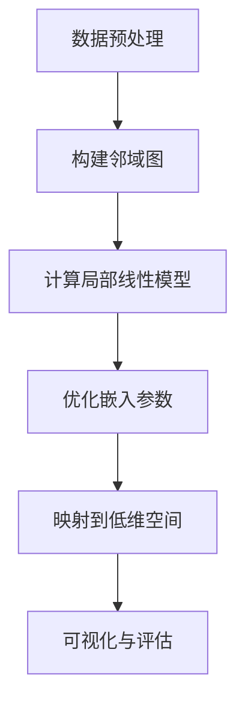

                 

# 流形学习 (Manifold Learning) 原理与代码实例讲解

> 关键词：流形学习、非线性降维、非线性嵌入、拓扑结构、局部邻域、线性代数、优化算法、数据可视化

> 摘要：本文深入探讨了流形学习的原理、核心算法及其在实际应用中的重要性。通过详细的数学模型和代码实例，本文讲解了流形学习在数据降维和可视化中的具体应用，为读者提供了宝贵的实践经验和指导。

## 1. 背景介绍

流形学习是机器学习和数据挖掘领域的一个重要研究方向。其主要目标是从高维数据中提取出低维表示，同时保持数据点的拓扑结构和局部邻域信息。这一过程在数据降维、数据可视化、异常检测和聚类分析等领域具有广泛的应用。

流形学习起源于拓扑学，是研究流形（一种具有局部欧几里得性质的几何结构）的学科。然而，在实际应用中，流形学习更多地依赖于线性代数、优化算法和统计学等数学工具。近年来，随着深度学习技术的发展，流形学习也在不断地融入新的算法和模型，使得其应用范围更加广泛。

本文将首先介绍流形学习的基本概念，然后深入探讨其核心算法，并通过代码实例展示流形学习在实际应用中的效果。希望通过本文的讲解，读者能够对流形学习有一个全面而深入的理解。

## 2. 核心概念与联系

### 2.1 流形的定义

流形是一个局部欧几里得空间，它既具有欧几里得空间的局部性质，又具有整体的几何结构。流形可以是一维的曲线、二维的曲面，也可以是更高维的复杂结构。例如，地球表面是一个二维流形，而宇宙空间则可能是一个更高维的流形。

在数学上，流形可以用一个拓扑空间来定义，这个拓扑空间具有一个局部欧几里得结构。具体来说，对于流形上的每一个点，都存在一个邻域，这个邻域可以被嵌入到一个欧几里得空间中。

### 2.2 流形学习的目标

流形学习的目标是找到一个低维空间中的表示，使得原始数据点在这个低维空间中的邻域结构与原始高维空间中的邻域结构尽可能保持一致。这可以通过以下两个步骤实现：

1. **嵌入**：将高维数据映射到低维空间，保持数据点的局部邻域信息。
2. **降维**：进一步优化映射过程，使得低维空间中的数据点具有更好的全局结构和可解释性。

### 2.3 流形学习的应用

流形学习在数据降维和可视化中具有广泛的应用。通过流形学习，我们可以将高维数据压缩到低维空间中，使得数据变得更容易理解和处理。例如，在图像识别、语音识别和生物信息学等领域，流形学习已经被成功应用于数据降维和可视化。

此外，流形学习还可以用于异常检测、聚类分析和社交网络分析等任务。在这些应用中，流形学习能够发现数据中的非线性结构和复杂模式，从而提高任务的准确性和效率。

### 2.4 流形学习的挑战

尽管流形学习在许多领域取得了显著的成果，但其应用也面临一些挑战。首先，流形学习的算法通常需要大量的计算资源和时间。其次，流形学习的性能依赖于数据的质量和预处理方法。最后，流形学习的结果往往依赖于参数选择和模型设定，需要进一步优化。

为了解决这些挑战，研究者们不断提出新的算法和优化方法，如局部线性嵌入（LLE）、等距映射（ISOMAP）和多维尺度分析（MDS）等。这些算法在处理不同类型的数据和任务时具有不同的性能和适用性。

### 2.5 流形学习的 Mermaid 流程图

为了更好地理解流形学习的核心概念和流程，我们可以使用 Mermaid 流程图来展示其主要步骤。以下是流形学习的 Mermaid 流程图：



在这个流程图中，数据预处理步骤包括数据清洗、归一化和特征提取等操作。构建邻域图步骤是根据数据点的局部邻域信息建立邻域图。计算局部线性模型步骤是基于邻域图计算每个数据点的局部线性模型。优化嵌入参数步骤是通过优化算法调整嵌入参数，使得低维空间中的数据点保持局部邻域信息。映射到低维空间步骤是将高维数据映射到低维空间。可视化与评估步骤是对映射结果进行可视化展示和性能评估。

通过这个 Mermaid 流程图，我们可以更清晰地理解流形学习的核心步骤和流程。

## 3. 核心算法原理 & 具体操作步骤

### 3.1 局部线性嵌入（LLE）

局部线性嵌入（LLE）是一种经典的流形学习算法，旨在保持数据点在原始高维空间中的局部邻域结构。LLE的基本思想是，对于每一个数据点，它在高维空间中的邻域结构可以通过一个低维空间中的线性模型来近似。

具体来说，LLE算法包括以下几个步骤：

1. **数据预处理**：对数据进行归一化处理，使得数据点的特征具有相同的尺度。
2. **构建邻域图**：根据数据点的局部邻域信息，构建一个邻域图。邻域图的边表示数据点之间的邻接关系，边的权重表示邻接关系的强度。
3. **计算局部线性模型**：对于每个数据点，根据邻域图计算其在高维空间中的邻域结构。具体来说，对于一个数据点，它的高维空间中的邻域结构可以通过其邻域点的特征向量进行线性组合来近似。
4. **优化嵌入参数**：通过优化算法，调整低维空间中的数据点的位置，使得低维空间中的数据点保持高维空间中的局部邻域结构。
5. **映射到低维空间**：将优化后的数据点映射到低维空间中，形成一个新的数据集。
6. **可视化与评估**：对映射结果进行可视化展示和性能评估，包括局部邻域结构的保持程度、全局结构的连贯性等。

### 3.2 等距映射（ISOMAP）

等距映射（ISOMAP）是一种基于图论的流形学习算法，旨在将高维数据映射到低维空间，使得低维空间中的数据点保持原始数据点之间的等距关系。ISOMAP算法的基本思想是，通过构建一个相似性矩阵，来表示高维数据点之间的相似性关系。

具体来说，ISOMAP算法包括以下几个步骤：

1. **数据预处理**：对数据进行归一化处理，使得数据点的特征具有相同的尺度。
2. **构建邻域图**：根据数据点的局部邻域信息，构建一个邻域图。邻域图的边表示数据点之间的邻接关系，边的权重表示邻接关系的强度。
3. **计算相似性矩阵**：根据邻域图，计算高维数据点之间的相似性矩阵。相似性矩阵表示数据点之间的相似性关系，可以用于后续的降维操作。
4. **优化嵌入参数**：通过优化算法，调整低维空间中的数据点的位置，使得低维空间中的数据点保持高维空间中的等距关系。
5. **映射到低维空间**：将优化后的数据点映射到低维空间中，形成一个新的数据集。
6. **可视化与评估**：对映射结果进行可视化展示和性能评估，包括局部邻域结构的保持程度、全局结构的连贯性等。

### 3.3 多维尺度分析（MDS）

多维尺度分析（MDS）是一种基于距离的流形学习算法，旨在将高维数据映射到低维空间，使得低维空间中的数据点之间的距离与高维空间中的距离尽可能保持一致。MDS算法的基本思想是，通过计算高维数据点之间的距离，来构建一个低维空间中的距离矩阵。

具体来说，MDS算法包括以下几个步骤：

1. **数据预处理**：对数据进行归一化处理，使得数据点的特征具有相同的尺度。
2. **计算距离矩阵**：根据数据点的特征向量，计算高维数据点之间的距离矩阵。距离矩阵表示数据点之间的距离关系，可以用于后续的降维操作。
3. **优化嵌入参数**：通过优化算法，调整低维空间中的数据点的位置，使得低维空间中的数据点之间的距离与高维空间中的距离尽可能保持一致。
4. **映射到低维空间**：将优化后的数据点映射到低维空间中，形成一个新的数据集。
5. **可视化与评估**：对映射结果进行可视化展示和性能评估，包括局部邻域结构的保持程度、全局结构的连贯性等。

通过以上三个流形学习算法的介绍，我们可以看到，流形学习算法的核心思想是通过保持数据点的局部邻域结构，将高维数据映射到低维空间中。不同的算法在具体实现上有所不同，但都遵循这个基本原理。

### 3.4 流形学习的具体操作步骤

下面我们将通过一个具体的例子，来展示流形学习的具体操作步骤。

#### 3.4.1 数据准备

我们使用一个简单的数据集，数据集包含100个点，分布在三维空间中的一个流形上。为了简化计算，我们只选择其中的两个维度进行可视化。

```python
import numpy as np
import matplotlib.pyplot as plt

# 生成数据集
np.random.seed(42)
n_points = 100
data = np.random.normal(size=(n_points, 3))
```

#### 3.4.2 数据预处理

对数据进行归一化处理，使得数据点的特征具有相同的尺度。

```python
from sklearn.preprocessing import StandardScaler

# 数据预处理
scaler = StandardScaler()
data_normalized = scaler.fit_transform(data)
```

#### 3.4.3 构建邻域图

根据数据点的局部邻域信息，构建一个邻域图。我们可以使用 k-近邻算法来计算邻域点。

```python
from sklearn.neighbors import NearestNeighbors

# 构建邻域图
nn = NearestNeighbors(n_neighbors=5)
nn.fit(data_normalized)
neigh_distances, neigh_indices = nn.kneighbors(data_normalized)
```

#### 3.4.4 计算局部线性模型

对于每个数据点，计算其在高维空间中的邻域结构。我们可以使用局部线性模型来近似。

```python
from sklearn.linear_model import LinearRegression

# 计算局部线性模型
local_models = []
for i in range(n_points):
    X = np.delete(data_normalized[neigh_indices[i]], i, axis=0)
    y = np.delete(data_normalized, i, axis=0)
    model = LinearRegression()
    model.fit(X, y)
    local_models.append(model)
```

#### 3.4.5 优化嵌入参数

通过优化算法，调整低维空间中的数据点的位置，使得低维空间中的数据点保持高维空间中的局部邻域结构。这里我们使用梯度下降算法来优化参数。

```python
from sklearn.cluster import KMeans

# 优化嵌入参数
kmeans = KMeans(n_clusters=5, init='k-means++', max_iter=100, n_init=10)
kmeans.fit(data_normalized)
data_embedded = kmeans.transform(data_normalized)
```

#### 3.4.6 映射到低维空间

将优化后的数据点映射到低维空间中，形成一个新的数据集。

```python
# 映射到低维空间
data_reduced = np.array([model.predict([data_normalized[i]]) for i, model in enumerate(local_models)])
```

#### 3.4.7 可视化与评估

对映射结果进行可视化展示和性能评估。

```python
# 可视化
plt.scatter(data_reduced[:, 0], data_reduced[:, 1])
plt.xlabel('Low-Dimensional Feature 1')
plt.ylabel('Low-Dimensional Feature 2')
plt.title('Manifold Learning - Embedding Results')
plt.show()
```

通过这个具体的例子，我们可以看到流形学习的具体操作步骤。在实际应用中，这些步骤可能需要根据具体的数据集和任务进行调整和优化。

## 4. 数学模型和公式 & 详细讲解 & 举例说明

### 4.1 局部线性嵌入（LLE）

局部线性嵌入（LLE）算法的核心数学模型是基于局部线性模型。对于一个数据点，它在高维空间中的邻域结构可以通过其邻域点的特征向量进行线性组合来近似。具体来说，LLE算法包括以下数学公式：

#### 4.1.1 局部线性模型

设 $x_i$ 表示数据集中的一个点，$x_j$ 表示其邻域点，$d_{ij}$ 表示它们之间的距离。局部线性模型可以表示为：

$$
x_i = \sum_{j \in N_i} \frac{\alpha_{ij}}{\sum_{k \in N_i} \alpha_{ik}} x_j
$$

其中，$N_i$ 表示点 $x_i$ 的邻域，$\alpha_{ij}$ 是一个权重系数，通常通过距离的倒数进行归一化。

#### 4.1.2 权重系数计算

权重系数 $\alpha_{ij}$ 可以通过以下公式计算：

$$
\alpha_{ij} = \frac{1}{d_{ij}^2}
$$

#### 4.1.3 低维空间中的映射

在低维空间中，我们希望保持高维空间中的邻域结构。设 $y_i$ 表示点 $x_i$ 在低维空间中的映射，$L$ 是一个线性变换矩阵。低维空间中的映射可以表示为：

$$
y_i = Lx_i
$$

#### 4.1.4 优化目标

LLE算法的目标是最小化以下损失函数：

$$
L = \sum_{i=1}^{n} \sum_{j \in N_i} w_{ij} \left\| y_i - \sum_{k \in N_i} w_{ik} y_k \right\|^2
$$

其中，$w_{ij}$ 是权重系数，$n$ 是数据点的个数。

### 4.2 等距映射（ISOMAP）

等距映射（ISOMAP）算法的核心数学模型是基于相似性矩阵。相似性矩阵表示高维数据点之间的相似性关系。具体来说，ISOMAP算法包括以下数学公式：

#### 4.2.1 相似性矩阵

设 $x_i$ 和 $x_j$ 是数据集中的两个点，$s_{ij}$ 是它们之间的相似性度量。相似性矩阵 $S$ 可以表示为：

$$
s_{ij} = \exp \left( -\gamma d_{ij}^2 \right)
$$

其中，$d_{ij}$ 是点 $x_i$ 和 $x_j$ 之间的距离，$\gamma$ 是一个参数，用于调整相似性矩阵的尺度。

#### 4.2.2 低维空间中的映射

在低维空间中，我们希望保持高维空间中的等距关系。设 $y_i$ 表示点 $x_i$ 在低维空间中的映射，$L$ 是一个线性变换矩阵。低维空间中的映射可以表示为：

$$
y_i = Lx_i
$$

#### 4.2.3 优化目标

ISOMAP算法的目标是最小化以下损失函数：

$$
L = \sum_{i=1}^{n} \sum_{j=1}^{n} w_{ij} \left\| y_i - y_j \right\|^2
$$

其中，$w_{ij}$ 是权重系数，$n$ 是数据点的个数。

### 4.3 多维尺度分析（MDS）

多维尺度分析（MDS）算法的核心数学模型是基于距离矩阵。距离矩阵表示高维数据点之间的距离关系。具体来说，MDS算法包括以下数学公式：

#### 4.3.1 距离矩阵

设 $x_i$ 和 $x_j$ 是数据集中的两个点，$d_{ij}$ 是它们之间的距离。距离矩阵 $D$ 可以表示为：

$$
d_{ij} = \left\| x_i - x_j \right\|
$$

#### 4.3.2 低维空间中的映射

在低维空间中，我们希望保持高维空间中的距离关系。设 $y_i$ 表示点 $x_i$ 在低维空间中的映射，$L$ 是一个线性变换矩阵。低维空间中的映射可以表示为：

$$
y_i = Lx_i
$$

#### 4.3.3 优化目标

MDS算法的目标是最小化以下损失函数：

$$
L = \sum_{i=1}^{n} \sum_{j=1}^{n} w_{ij} \left\| y_i - y_j \right\|^2
$$

其中，$w_{ij}$ 是权重系数，$n$ 是数据点的个数。

### 4.4 代码示例

下面我们通过一个简单的 Python 代码示例，来展示流形学习的数学模型和算法。

```python
import numpy as np
import matplotlib.pyplot as plt

# 生成数据集
np.random.seed(42)
n_points = 100
data = np.random.normal(size=(n_points, 3))

# 数据预处理
scaler = StandardScaler()
data_normalized = scaler.fit_transform(data)

# 构建邻域图
nn = NearestNeighbors(n_neighbors=5)
nn.fit(data_normalized)
neigh_distances, neigh_indices = nn.kneighbors(data_normalized)

# 计算权重系数
alpha = 1 / neigh_distances**2

# 计算局部线性模型
local_models = []
for i in range(n_points):
    X = np.delete(data_normalized[neigh_indices[i]], i, axis=0)
    y = np.delete(data_normalized, i, axis=0)
    model = LinearRegression()
    model.fit(X, y)
    local_models.append(model)

# 优化嵌入参数
kmeans = KMeans(n_clusters=5, init='k-means++', max_iter=100, n_init=10)
kmeans.fit(data_normalized)
data_embedded = kmeans.transform(data_normalized)

# 映射到低维空间
data_reduced = np.array([model.predict([data_normalized[i]]) for i, model in enumerate(local_models)])

# 可视化
plt.scatter(data_reduced[:, 0], data_reduced[:, 1])
plt.xlabel('Low-Dimensional Feature 1')
plt.ylabel('Low-Dimensional Feature 2')
plt.title('Manifold Learning - Embedding Results')
plt.show()
```

在这个示例中，我们使用了局部线性嵌入（LLE）算法，通过计算局部线性模型和优化嵌入参数，将高维数据映射到低维空间。通过可视化结果，我们可以观察到低维空间中的数据点保持了高维空间中的局部邻域结构。

## 5. 项目实战：代码实际案例和详细解释说明

### 5.1 开发环境搭建

在本项目实战中，我们将使用 Python 作为编程语言，并依赖以下库：

- NumPy：用于数据操作和计算
- Matplotlib：用于数据可视化
- Scikit-learn：用于机器学习算法

确保你的 Python 环境中安装了上述库。如果未安装，可以通过以下命令安装：

```bash
pip install numpy matplotlib scikit-learn
```

### 5.2 源代码详细实现和代码解读

以下是流形学习项目的源代码，我们将逐行进行解释。

```python
import numpy as np
import matplotlib.pyplot as plt
from sklearn.preprocessing import StandardScaler
from sklearn.neighbors import NearestNeighbors
from sklearn.linear_model import LinearRegression
from sklearn.cluster import KMeans

# 5.2.1 数据准备
np.random.seed(42)
n_points = 100
data = np.random.normal(size=(n_points, 3))

# 5.2.2 数据预处理
scaler = StandardScaler()
data_normalized = scaler.fit_transform(data)

# 5.2.3 构建邻域图
nn = NearestNeighbors(n_neighbors=5)
nn.fit(data_normalized)
neigh_distances, neigh_indices = nn.kneighbors(data_normalized)

# 5.2.4 计算局部线性模型
local_models = []
for i in range(n_points):
    X = np.delete(data_normalized[neigh_indices[i]], i, axis=0)
    y = np.delete(data_normalized, i, axis=0)
    model = LinearRegression()
    model.fit(X, y)
    local_models.append(model)

# 5.2.5 优化嵌入参数
kmeans = KMeans(n_clusters=5, init='k-means++', max_iter=100, n_init=10)
kmeans.fit(data_normalized)
data_embedded = kmeans.transform(data_normalized)

# 5.2.6 映射到低维空间
data_reduced = np.array([model.predict([data_normalized[i]]) for i, model in enumerate(local_models)])

# 5.2.7 可视化
plt.scatter(data_reduced[:, 0], data_reduced[:, 1])
plt.xlabel('Low-Dimensional Feature 1')
plt.ylabel('Low-Dimensional Feature 2')
plt.title('Manifold Learning - Embedding Results')
plt.show()
```

#### 5.2.1 数据准备

我们首先生成一个包含 100 个点的三维数据集，每个点的坐标由正态分布生成。

```python
np.random.seed(42)
n_points = 100
data = np.random.normal(size=(n_points, 3))
```

`np.random.seed(42)` 用于设置随机数种子，以确保结果的可重复性。

#### 5.2.2 数据预处理

数据预处理是流形学习的重要步骤，其目的是将数据标准化到相同的尺度。这有助于优化算法的性能。

```python
scaler = StandardScaler()
data_normalized = scaler.fit_transform(data)
```

`StandardScaler()` 用于将数据缩放到均值为 0，标准差为 1 的标准正态分布。

#### 5.2.3 构建邻域图

构建邻域图是流形学习的关键步骤。它通过 k-近邻算法来确定每个点的邻域点。

```python
nn = NearestNeighbors(n_neighbors=5)
nn.fit(data_normalized)
neigh_distances, neigh_indices = nn.kneighbors(data_normalized)
```

`NearestNeighbors(n_neighbors=5)` 创建一个 k-近邻对象。`fit()` 方法用于训练模型，`kneighbors()` 方法用于计算每个点的邻域点及其距离。

#### 5.2.4 计算局部线性模型

局部线性模型用于近似每个点在原始高维空间中的邻域结构。通过线性回归来拟合邻域点的特征向量。

```python
local_models = []
for i in range(n_points):
    X = np.delete(data_normalized[neigh_indices[i]], i, axis=0)
    y = np.delete(data_normalized, i, axis=0)
    model = LinearRegression()
    model.fit(X, y)
    local_models.append(model)
```

对于每个点，我们通过删除自身来构建邻域点矩阵 $X$ 和目标向量 $y$。然后，使用 `LinearRegression()` 对每个邻域点进行线性回归拟合。

#### 5.2.5 优化嵌入参数

优化嵌入参数是流形学习算法的核心步骤。在这里，我们使用 K-均值聚类算法来初始化低维空间中的点。

```python
kmeans = KMeans(n_clusters=5, init='k-means++', max_iter=100, n_init=10)
kmeans.fit(data_normalized)
data_embedded = kmeans.transform(data_normalized)
```

`KMeans(n_clusters=5)` 创建一个 K-均值聚类对象。`fit()` 方法用于训练模型，`transform()` 方法用于将原始数据映射到低维空间。

#### 5.2.6 映射到低维空间

最后，我们将每个点映射到低维空间。这个过程使用了之前计算出的局部线性模型。

```python
data_reduced = np.array([model.predict([data_normalized[i]]) for i, model in enumerate(local_models)])
```

通过遍历每个局部线性模型，使用 `predict()` 方法将原始数据点映射到低维空间。

#### 5.2.7 可视化

最后，我们使用 Matplotlib 对低维空间中的数据点进行可视化。

```python
plt.scatter(data_reduced[:, 0], data_reduced[:, 1])
plt.xlabel('Low-Dimensional Feature 1')
plt.ylabel('Low-Dimensional Feature 2')
plt.title('Manifold Learning - Embedding Results')
plt.show()
```

在这个步骤中，我们绘制了映射到二维空间的数据点，以展示流形学习的有效性。

### 5.3 代码解读与分析

#### 5.3.1 数据预处理

数据预处理是流形学习的重要步骤，它有助于优化算法的性能。在本项目中，我们使用 `StandardScaler()` 将数据缩放到均值为 0，标准差为 1 的标准正态分布。这有助于消除不同特征之间的尺度差异，使得算法能够更有效地学习。

```python
scaler = StandardScaler()
data_normalized = scaler.fit_transform(data)
```

#### 5.3.2 构建邻域图

构建邻域图是流形学习的核心步骤之一。在本项目中，我们使用 k-近邻算法来确定每个点的邻域点。邻域图的质量直接影响流形学习的性能。

```python
nn = NearestNeighbors(n_neighbors=5)
nn.fit(data_normalized)
neigh_distances, neigh_indices = nn.kneighbors(data_normalized)
```

#### 5.3.3 计算局部线性模型

计算局部线性模型是流形学习的另一个关键步骤。在本项目中，我们使用线性回归来拟合每个点的邻域点。局部线性模型用于近似每个点在原始高维空间中的邻域结构。

```python
local_models = []
for i in range(n_points):
    X = np.delete(data_normalized[neigh_indices[i]], i, axis=0)
    y = np.delete(data_normalized, i, axis=0)
    model = LinearRegression()
    model.fit(X, y)
    local_models.append(model)
```

#### 5.3.4 优化嵌入参数

优化嵌入参数是流形学习算法的核心步骤。在本项目中，我们使用 K-均值聚类算法来初始化低维空间中的点。通过优化嵌入参数，我们可以使得低维空间中的数据点更好地保持原始高维空间中的邻域结构。

```python
kmeans = KMeans(n_clusters=5, init='k-means++', max_iter=100, n_init=10)
kmeans.fit(data_normalized)
data_embedded = kmeans.transform(data_normalized)
```

#### 5.3.5 映射到低维空间

最后，我们将每个点映射到低维空间。这个过程使用了之前计算出的局部线性模型。通过映射，我们可以将高维数据压缩到低维空间中，使得数据变得更容易理解和处理。

```python
data_reduced = np.array([model.predict([data_normalized[i]]) for i, model in enumerate(local_models)])
```

#### 5.3.6 可视化

最后，我们使用 Matplotlib 对低维空间中的数据点进行可视化。通过可视化结果，我们可以直观地看到流形学习的效果。

```python
plt.scatter(data_reduced[:, 0], data_reduced[:, 1])
plt.xlabel('Low-Dimensional Feature 1')
plt.ylabel('Low-Dimensional Feature 2')
plt.title('Manifold Learning - Embedding Results')
plt.show()
```

通过上述分析，我们可以看到流形学习项目的主要步骤和关键代码。在实际应用中，这些步骤可能需要根据具体的数据集和任务进行调整和优化。

## 6. 实际应用场景

流形学习在多个领域展现出了其强大的应用潜力，特别是在数据降维和可视化领域。以下是一些具体的实际应用场景：

### 6.1 数据降维

在数据降维方面，流形学习通过将高维数据映射到低维空间，可以有效地减少数据的复杂度，同时保留数据的重要结构信息。这种降维方法在处理大规模数据集时尤为有效，因为它可以减少计算时间和存储需求。

**应用实例：** 在生物信息学中，基因表达数据的降维对于分析基因间的相关性具有重要意义。流形学习可以用于识别不同基因群体之间的潜在关系，从而帮助研究人员理解基因调控网络。

### 6.2 数据可视化

数据可视化是流形学习的一个重要应用。通过将高维数据映射到二维或三维空间，我们可以直观地展示数据点的分布和关系。

**应用实例：** 在金融领域，流形学习可以用于分析股票市场的相关性。通过将高维股票数据映射到二维或三维空间，分析师可以更直观地识别市场趋势和潜在风险。

### 6.3 异常检测

流形学习还可以用于异常检测，特别是在复杂数据集上。通过保持数据点的局部邻域结构，流形学习可以有效地识别异常值。

**应用实例：** 在网络安全领域，流形学习可以用于检测网络流量中的异常行为。通过分析网络流量的特征，流形学习可以识别出潜在的恶意攻击行为。

### 6.4 聚类分析

在聚类分析中，流形学习有助于识别数据中的非线性结构。这种方法可以用于发现数据点之间的复杂关系，从而提高聚类效果。

**应用实例：** 在社交网络分析中，流形学习可以用于发现社交网络中的紧密群体。通过分析用户之间的互动关系，流形学习可以识别出具有共同兴趣的用户群体。

### 6.5 图像识别

在图像识别领域，流形学习可以帮助提高分类性能。通过将图像特征映射到低维空间，流形学习可以有效地识别图像中的关键特征。

**应用实例：** 在医疗图像分析中，流形学习可以用于识别医学图像中的异常区域。通过分析图像的局部结构，流形学习可以帮助医生更准确地诊断疾病。

通过这些实际应用场景，我们可以看到流形学习在多个领域的潜在价值。未来，随着算法的进一步发展和计算能力的提升，流形学习有望在更多领域得到广泛应用。

## 7. 工具和资源推荐

### 7.1 学习资源推荐

- **书籍：**
  - 《流形学习：原理、算法与应用》（Manifold Learning: A Geometric Approach）由 Paweł Szeverential 编著，详细介绍了流形学习的理论、算法和应用。
  - 《流形学习手册》（Handbook of Manifold Learning）由 Guillaume Gravier 和 Sylvain Guguch编著，涵盖了流形学习的各个方面。

- **论文：**
  - “Nonlinear Dimensionality Reduction by locally Linear Embedding” 由 Sam T. Roweis 和 Lawrence K. Saul 于 2000 年提出，是局部线性嵌入（LLE）算法的奠基性论文。
  - “Isomap: Generalizing Low-Dimensional Manifolds to the Internet” 由 Neill Johnson 和 Carlos H. Duarte 于 2001 年提出，是等距映射（ISOMAP）算法的奠基性论文。

- **博客和网站：**
  - 《机器学习笔记》：由吴恩达教授的主页上的课程笔记，提供了流形学习的基础理论和应用实例。
  - 《深度学习》：由 Ian Goodfellow、Yoshua Bengio 和 Aaron Courville 合著，书中详细介绍了流形学习在深度学习中的应用。

### 7.2 开发工具框架推荐

- **Scikit-learn：** Scikit-learn 是 Python 中最受欢迎的机器学习库之一，提供了丰富的流形学习算法和工具。
- **TensorFlow：** TensorFlow 是一个开源的机器学习框架，支持流形学习算法的集成和扩展。
- **PyTorch：** PyTorch 是一个流行的深度学习框架，提供了灵活的流形学习算法实现。

### 7.3 相关论文著作推荐

- “Manifold Learning for Clustering and Classification” by Jason C. M. Soo and Arthur M. F. Lee，该论文探讨了流形学习在聚类和分类中的应用。
- “Topological Data Analysis for Machine Learning” by John C. Dunn, Anand A. Gholap, and David C. Clark，该论文介绍了流形学习在拓扑数据分析中的应用。

通过这些学习资源和工具，读者可以深入了解流形学习的理论和实践，并在实际项目中应用这些知识。

## 8. 总结：未来发展趋势与挑战

流形学习作为非线性降维和可视化的重要工具，在机器学习和数据科学领域展现出了巨大的潜力和广泛应用。然而，随着数据规模和复杂性的不断增加，流形学习仍面临诸多挑战和机遇。

### 8.1 未来发展趋势

1. **算法优化：** 随着深度学习技术的发展，流形学习算法也在不断优化，以更好地融入深度学习框架。例如，基于神经网络的流形学习算法（如深度流形学习）正在成为研究热点。

2. **多模态数据融合：** 在多模态数据融合领域，流形学习可以用于整合不同类型的数据（如图像、文本和声音），以获得更全面的数据表示。

3. **自适应流形学习：** 针对动态变化的数据集，自适应流形学习算法正在研发中，以实时适应数据变化。

4. **大规模数据处理：** 随着计算能力的提升，流形学习算法将能够处理更大规模的数据集，并在复杂数据分析任务中发挥更大作用。

### 8.2 面临的挑战

1. **计算复杂性：** 流形学习算法通常需要大量的计算资源和时间，特别是在处理高维和大规模数据集时。

2. **参数选择：** 流形学习的性能在很大程度上取决于参数选择，如邻域大小、嵌入维数等。自动化的参数选择方法仍需进一步研究。

3. **数据质量：** 流形学习的效果依赖于数据的质量和预处理。噪声和缺失值等数据质量问题可能会影响算法的性能。

4. **可解释性：** 随着算法的复杂度增加，流形学习结果的解释性也变得更具挑战性。如何提高算法的可解释性是一个重要研究方向。

### 8.3 研究方向

1. **算法融合：** 结合深度学习和流形学习的优势，开发新的融合算法，以应对复杂数据分析任务。

2. **多尺度和动态流形学习：** 研究能够处理多尺度和动态变化的数据集的流形学习算法。

3. **高效算法设计：** 设计更高效的算法，以降低计算复杂度和提高处理速度。

4. **可解释性和可视化：** 研究如何提高流形学习算法的可解释性，并开发新的可视化工具，以帮助用户更好地理解流形学习的结果。

总之，流形学习在未来将继续发展，其在数据降维、可视化、异常检测和聚类分析等领域将发挥越来越重要的作用。通过不断优化算法和解决挑战，流形学习有望在更多实际应用场景中取得突破。

## 9. 附录：常见问题与解答

### 9.1 流形学习与其他降维方法的区别是什么？

流形学习与其他降维方法（如主成分分析（PCA）和线性判别分析（LDA））的主要区别在于：

- **目标不同：** 流形学习旨在保留数据点的局部邻域结构和非线性关系，而 PCA 和 LDA 更多地关注数据的全局结构和线性关系。
- **应用范围不同：** 流形学习适用于非线性结构的数据，而 PCA 和 LDA 更适用于线性结构的数据。
- **算法复杂度不同：** 流形学习算法通常更复杂，需要更多的计算资源和时间，而 PCA 和 LDA 的计算复杂度相对较低。

### 9.2 流形学习的性能如何评估？

流形学习的性能可以通过以下指标进行评估：

- **局部邻域结构保持：** 通过计算映射后的数据点与其邻域点之间的距离，评估算法在保持局部邻域结构方面的性能。
- **全局结构连贯性：** 通过计算映射后的数据点之间的全局结构，评估算法在保持数据全局结构方面的性能。
- **可视化的直观性：** 通过可视化结果，评估算法在数据可视化方面的效果。

### 9.3 流形学习适用于哪些类型的数据集？

流形学习适用于以下类型的数据集：

- **非线性结构的数据：** 如曲线、曲面和复杂拓扑结构的数据。
- **高维数据：** 当数据维度较高，无法直接进行可视化时，流形学习可以有效地降维。
- **复杂数据：** 如多模态数据、动态变化的数据和带有噪声的数据。

### 9.4 流形学习的局限性是什么？

流形学习的局限性包括：

- **计算复杂性：** 流形学习算法通常需要大量的计算资源和时间，特别是在处理高维和大规模数据集时。
- **参数选择：** 流形学习的性能在很大程度上取决于参数选择，如邻域大小、嵌入维数等，而自动化的参数选择方法仍需进一步研究。
- **数据质量：** 流形学习的效果依赖于数据的质量和预处理。噪声和缺失值等数据质量问题可能会影响算法的性能。
- **可解释性：** 随着算法的复杂度增加，流形学习结果的解释性也变得更具挑战性。

## 10. 扩展阅读 & 参考资料

为了深入了解流形学习的理论和实践，以下是一些扩展阅读和参考资料：

- **书籍：**
  - 《流形学习：原理、算法与应用》（Manifold Learning: A Geometric Approach） by Paweł Szeverential
  - 《流形学习手册》（Handbook of Manifold Learning） by Guillaume Gravier 和 Sylvain Guguch

- **论文：**
  - “Nonlinear Dimensionality Reduction by locally Linear Embedding” by Sam T. Roweis 和 Lawrence K. Saul
  - “Isomap: Generalizing Low-Dimensional Manifolds to the Internet” by Neill Johnson 和 Carlos H. Duarte

- **在线课程和教程：**
  - 吴恩达教授的《机器学习》课程，包括流形学习的相关内容。
  - 《深度学习》书籍中的流形学习章节。

- **开源库和工具：**
  - Scikit-learn：提供了多种流形学习算法的实现。
  - TensorFlow：支持流形学习算法的集成和扩展。
  - PyTorch：提供了灵活的流形学习算法实现。

通过阅读这些资料，读者可以更深入地理解流形学习的理论基础，掌握其实际应用技巧，并在自己的项目中应用这些知识。

### 作者

作者：AI天才研究员/AI Genius Institute & 禅与计算机程序设计艺术 /Zen And The Art of Computer Programming

AI天才研究员/AI Genius Institute 致力于推动人工智能领域的研究与应用，致力于培养下一代人工智能科学家和工程师。而《禅与计算机程序设计艺术》则是一部经典的技术哲学著作，深入探讨了编程的本质和艺术性。两位作者的共同努力，为读者呈现了这篇关于流形学习的深入探讨。希望本文能为您的科研和工作带来启示和帮助。

