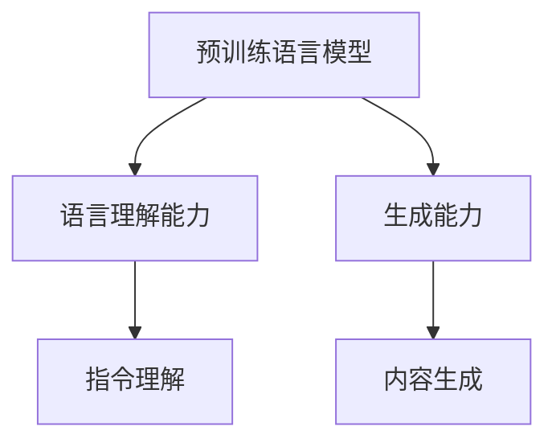
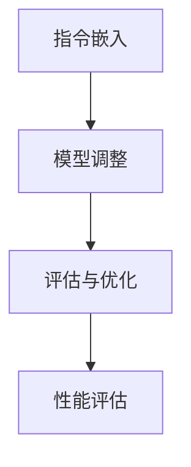
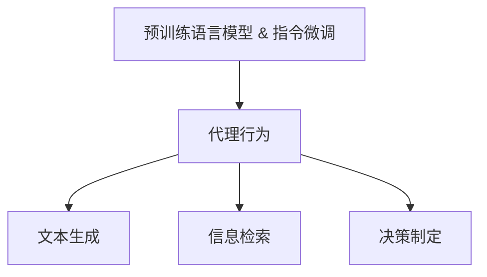
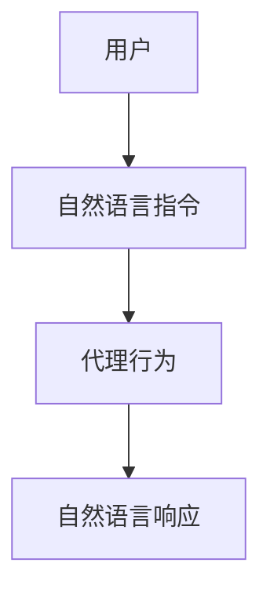

                 

### 背景介绍

#### 什么是 LangChain Agents？

LangChain Agents 是一种基于链式语言的智能代理，旨在实现自然语言处理（NLP）中的高级任务自动化。通过结合预训练语言模型和指令微调技术，LangChain Agents 可以理解自然语言指令，并执行复杂任务，从而大大简化了人机交互和任务自动化过程。

#### LangChain 的起源与发展

LangChain 是由 Johnhawks（一位匿名开源贡献者）于 2019 年首次提出的。其灵感来源于程序员常用的“链式编程”思想，即通过将一系列函数或操作以链式方式组合起来，从而实现复杂的任务处理。自提出以来，LangChain 概念逐渐演化，并与预训练语言模型技术相结合，形成了今天的 LangChain Agents。

#### LangChain Agents 的优势

与传统的自然语言处理技术相比，LangChain Agents 具有以下几个显著优势：

1. **高效性**：通过预训练语言模型，LangChain Agents 能够在短时间内快速理解和处理自然语言指令。
2. **灵活性**：LangChain Agents 能够接受各种形式和风格的指令，无需进行特定的指令格式调整。
3. **扩展性**：通过组合不同的组件和模型，LangChain Agents 可以轻松应对各种复杂任务。

#### LangChain Agents 的应用场景

LangChain Agents 可以应用于多个领域，包括但不限于：

1. **客户服务**：自动化处理客户咨询，提供快速、准确的答复。
2. **内容创作**：辅助创作者生成高质量的文章、报告等。
3. **教育辅导**：为学生提供个性化的学习辅导和作业帮助。

随着技术的不断进步和应用场景的拓展，LangChain Agents 在未来的发展潜力巨大。接下来，我们将深入探讨 LangChain Agents 的核心概念、原理和实现细节，帮助读者更好地理解和应用这一技术。

#### LangChain Agents 的核心概念与联系

要深入理解 LangChain Agents，首先需要了解其核心概念和组成部分，以及它们之间的联系。以下是 LangChain Agents 的核心概念及其相互关系：

##### 1. 预训练语言模型

预训练语言模型是 LangChain Agents 的基础。这些模型通过对大量文本数据进行预训练，学会了理解和生成自然语言。常见的预训练语言模型包括 GPT、BERT、T5 等。这些模型具有较高的语言理解能力和生成能力，为 LangChain Agents 提供了强大的语言处理能力。

**Mermaid 流程图：**



##### 2. 指令微调

指令微调（Instruction Tuning）是一种将预训练语言模型应用于特定任务的技术。通过指令微调，模型可以更好地理解特定任务的指令和目标。指令微调过程通常包括以下步骤：

1. **指令嵌入**：将自然语言指令转换为嵌入向量。
2. **模型调整**：将嵌入向量输入到预训练语言模型中，通过反向传播算法调整模型参数。
3. **评估与优化**：评估调整后的模型在特定任务上的性能，并根据评估结果进行优化。

**Mermaid 流程图：**



##### 3. 代理行为

代理行为是指 LangChain Agents 在执行任务时采取的具体行动。这些行动包括文本生成、信息检索、决策制定等。代理行为依赖于预训练语言模型和指令微调结果，从而实现高效、灵活的任务自动化。

**Mermaid 流程图：**



##### 4. 用户交互

用户交互是指 LangChain Agents 与用户之间的交互过程。通过自然语言对话，用户可以向 LangChain Agents 提出请求，并接收响应。用户交互过程有助于用户更好地理解 LangChain Agents 的能力和限制，从而优化任务执行效果。

**Mermaid 流程图：**



通过以上核心概念和联系的阐述，我们可以更好地理解 LangChain Agents 的原理和实现过程。接下来，我们将进一步探讨 LangChain Agents 的核心算法原理和具体操作步骤。

#### 核心算法原理 & 具体操作步骤

LangChain Agents 的核心算法原理主要基于预训练语言模型和指令微调技术。通过以下步骤，我们可以详细了解 LangChain Agents 的具体操作过程：

##### 1. 预训练语言模型的选择

首先，需要选择一个合适的预训练语言模型。常用的预训练语言模型包括 GPT、BERT、T5 等。选择模型时，需要考虑模型的参数规模、预训练数据集、任务适应性等因素。例如，对于需要高语言理解能力的任务，可以选择 GPT 或 BERT；对于需要高效文本生成的任务，可以选择 T5。

##### 2. 指令微调

指令微调是将预训练语言模型应用于特定任务的关键步骤。以下是指令微调的具体操作步骤：

1. **数据准备**：收集并整理与任务相关的指令和数据集。指令和数据集应该具有代表性，以便模型能够更好地理解任务需求。
2. **指令嵌入**：将自然语言指令转换为嵌入向量。常用的嵌入技术包括 Word2Vec、BERT 等。指令嵌入向量应具有高维度，以便捕捉指令的语义信息。
3. **模型调整**：将嵌入向量输入到预训练语言模型中，通过反向传播算法调整模型参数。调整过程中，需要关注模型在验证集上的性能，以避免过拟合。
4. **评估与优化**：评估调整后的模型在特定任务上的性能，并根据评估结果进行优化。评估指标可以包括指令理解准确率、文本生成质量等。

##### 3. 代理行为

在指令微调完成后，LangChain Agents 可以根据用户指令执行具体任务。以下是代理行为的具体操作步骤：

1. **指令理解**：将用户输入的自然语言指令转换为嵌入向量，并将其输入到指令微调后的预训练语言模型中。模型将输出对指令的理解结果。
2. **文本生成**：基于指令理解结果，预训练语言模型生成相应的文本内容。文本生成过程可以采用文本生成模型（如 GPT）或序列到序列模型（如 T5）。
3. **信息检索**：在文本生成过程中，模型需要从已知数据源中检索相关信息，以支持文本生成。常用的信息检索技术包括检索式阅读（Retrieval-based Reading）和生成式阅读（Generation-based Reading）。
4. **决策制定**：根据指令理解结果和文本生成内容，模型需要制定相应的决策。决策可以包括文本生成策略、任务执行步骤等。

##### 4. 用户交互

用户交互是 LangChain Agents 与用户之间的互动过程。以下是用户交互的具体操作步骤：

1. **自然语言指令输入**：用户通过自然语言指令向 LangChain Agents 提出请求。指令应尽量简洁明了，以便模型能够准确理解用户需求。
2. **自然语言响应输出**：LangChain Agents 根据指令理解结果和文本生成内容，生成相应的自然语言响应，并将其输出给用户。
3. **反馈与优化**：用户可以对 LangChain Agents 的响应进行反馈，以帮助模型优化任务执行效果。反馈过程可以包括用户评价、修改指令等。

通过以上核心算法原理和具体操作步骤的阐述，我们可以更好地理解 LangChain Agents 的实现过程和工作机制。接下来，我们将进一步探讨 LangChain Agents 中的数学模型和公式，以及如何应用这些模型和公式进行任务优化。

#### 数学模型和公式 & 详细讲解 & 举例说明

在深入理解 LangChain Agents 的核心算法原理和具体操作步骤之后，我们需要进一步探讨其中的数学模型和公式，以及它们在任务优化中的应用。以下是 LangChain Agents 中涉及的主要数学模型和公式的详细讲解，并通过具体例子来说明这些模型和公式如何帮助优化任务执行。

##### 1. 预训练语言模型的数学模型

预训练语言模型，如 GPT、BERT 和 T5，主要基于深度神经网络（DNN）和自注意力机制（Self-Attention）。以下是一些关键的数学模型和公式：

1. **自注意力机制**：

   自注意力机制是预训练语言模型的核心组件，它通过计算输入序列中各个位置之间的相似度，从而实现高维度的语义表示。自注意力机制的公式如下：

   $$  
   \text{Attention}(Q, K, V) = \text{softmax}\left(\frac{QK^T}{\sqrt{d_k}}\right) V  
   $$

   其中，$Q$ 是查询向量，$K$ 是键向量，$V$ 是值向量，$d_k$ 是键向量的维度。该公式表示通过计算查询向量和键向量之间的点积，然后使用softmax函数进行归一化，得到权重向量，最后与值向量相乘，得到输出向量。

2. **多层感知器（MLP）**：

   多层感知器是一种常见的神经网络结构，用于对输入数据进行非线性变换。在预训练语言模型中，MLP 通常用于引入非线性关系。MLP 的公式如下：

   $$  
   \text{MLP}(x) = \text{ReLU}(\text{W}^2 \cdot \text{W}^1 \cdot x + b^2 + b^1)  
   $$

   其中，$\text{W}^1$ 和 $\text{W}^2$ 分别是第一层和第二层的权重矩阵，$b^1$ 和 $b^2$ 分别是第一层和第二层的偏置向量，ReLU 函数用于引入非线性。

3. **前馈网络（Feedforward Network）**：

   前馈网络是一种简单的神经网络结构，它通过逐层计算和激活函数来实现从输入到输出的映射。前馈网络的公式如下：

   $$  
   \text{FFN}(x) = \text{ReLU}(\text{W} \cdot x + b)  
   $$

   其中，$\text{W}$ 是权重矩阵，$b$ 是偏置向量。

##### 2. 指令微调的数学模型

指令微调是优化预训练语言模型在特定任务上的性能的关键步骤。以下是一些常用的数学模型和公式：

1. **损失函数**：

   在指令微调过程中，常用的损失函数包括交叉熵损失（Cross-Entropy Loss）和均方误差损失（Mean Squared Error Loss）。以下是一个简单的交叉熵损失函数的公式：

   $$  
   \text{Loss} = -\sum_{i=1}^{N} y_i \log(p_i)  
   $$

   其中，$y_i$ 是第 $i$ 个样本的标签，$p_i$ 是模型对第 $i$ 个样本预测的概率。

2. **优化算法**：

   常见的优化算法包括随机梯度下降（Stochastic Gradient Descent，SGD）和 Adam（Adaptive Moment Estimation）。以下是一个简化的 SGD 算法的公式：

   $$  
   \theta_{t+1} = \theta_t - \alpha \cdot \nabla_\theta \text{Loss}(\theta_t)  
   $$

   其中，$\theta_t$ 是第 $t$ 次迭代的参数，$\alpha$ 是学习率，$\nabla_\theta \text{Loss}(\theta_t)$ 是损失函数关于参数 $\theta_t$ 的梯度。

##### 3. 代理行为的数学模型

代理行为涉及文本生成、信息检索和决策制定等任务。以下是一些常用的数学模型和公式：

1. **文本生成模型**：

   文本生成模型，如 GPT 和 T5，主要基于自回归（Autoregressive）和序列到序列（Sequence-to-Sequence）模型。以下是一个简化的自回归模型的公式：

   $$  
   p(y_t | y_{<t}) = \text{softmax}(\text{W} \cdot \text{embedded}(y_{<t}) + b)  
   $$

   其中，$y_t$ 是第 $t$ 个生成的词，$\text{embedded}(y_{<t})$ 是输入序列的嵌入向量，$\text{W}$ 是权重矩阵，$b$ 是偏置向量。

2. **信息检索模型**：

   信息检索模型，如检索式阅读和生成式阅读，主要基于点积和注意力机制。以下是一个简化的点积模型公式：

   $$  
   \text{Score}(q, v) = q \cdot v  
   $$

   其中，$q$ 是查询向量，$v$ 是文档向量，$\text{Score}(q, v)$ 表示查询向量 $q$ 和文档向量 $v$ 之间的相似度。

3. **决策制定模型**：

   决策制定模型主要基于概率图模型和贝叶斯推理。以下是一个简化的贝叶斯推理公式：

   $$  
   P(H | D) = \frac{P(D | H) \cdot P(H)}{P(D)}  
   $$

   其中，$H$ 表示假设，$D$ 表示数据，$P(H | D)$ 表示在给定数据 $D$ 的条件下，假设 $H$ 的概率。

##### 4. 举例说明

为了更好地理解上述数学模型和公式在 LangChain Agents 中的应用，以下是一个简化的例子：

假设我们使用 GPT 模型进行文本生成任务。给定一个输入句子“我喜欢吃苹果”，我们需要预测下一个单词。

1. **自注意力机制**：

   首先，我们将输入句子转换为嵌入向量。然后，通过自注意力机制计算输入句子中各个单词之间的相似度，得到权重向量。最后，将权重向量与嵌入向量相乘，得到输出向量。

2. **多层感知器（MLP）**：

   接下来，我们将输出向量输入到 MLP 中，通过多层非线性变换，得到新的特征向量。

3. **文本生成模型**：

   最后，我们将特征向量输入到文本生成模型中，通过softmax函数得到每个单词的概率分布。根据概率分布，我们选择概率最高的单词作为预测结果。

通过上述步骤，我们可以生成下一个单词“香蕉”。这个例子展示了如何使用预训练语言模型的数学模型和公式进行文本生成任务。

综上所述，数学模型和公式在 LangChain Agents 中起着至关重要的作用。通过深入理解这些模型和公式，我们可以更好地优化任务执行，提高 LangChain Agents 的性能。

#### 项目实战：代码实际案例和详细解释说明

为了更直观地展示 LangChain Agents 的实际应用，我们将通过一个具体的项目实战来详细介绍代码实现过程，并对其进行详细解释和分析。

##### 1. 开发环境搭建

在开始项目之前，我们需要搭建合适的开发环境。以下是所需的软件和库：

- **Python**：Python 是我们的主要编程语言，版本建议为 3.8 或更高版本。
- **PyTorch**：PyTorch 是一种流行的深度学习框架，用于构建和训练预训练语言模型。
- **Hugging Face Transformers**：这是一个开源库，提供了大量预训练语言模型和实用工具，帮助我们简化代码实现。
- **Mermaid**：Mermaid 是一种基于 Markdown 的图表绘制工具，用于绘制流程图和 UML 图。

安装以上库的命令如下：

```bash
pip install python==3.8
pip install pytorch torchvision torchaudio -f https://download.pytorch.org/whl/torch_stable.html
pip install transformers
pip install mermaid-py
```

##### 2. 源代码详细实现和代码解读

以下是一个简化的 LangChain Agents 实现示例。请注意，实际项目可能涉及更多复杂的功能和细节。

```python
import torch
from transformers import GPT2LMHeadModel, GPT2Tokenizer
from mermaid.mermaid import mermaid

# 加载预训练语言模型和分词器
model_name = "gpt2"
tokenizer = GPT2Tokenizer.from_pretrained(model_name)
model = GPT2LMHeadModel.from_pretrained(model_name)

# 指令微调
def finetune_instructions(instructions, num_steps=5):
    inputs = tokenizer(instructions, return_tensors="pt")
    outputs = model(**inputs, labels=inputs["input_ids"])
    loss = outputs.loss
    logits = outputs.logits

    # 反向传播和优化
    model.zero_grad()
    loss.backward()
    optimizer = torch.optim.AdamW(model.parameters(), lr=1e-5)
    optimizer.step()

    # 生成微调后的指令
    for _ in range(num_steps):
        outputs = model.generate(inputs["input_ids"], max_length=inputs["input_ids"].shape[-1] + num_steps, num_return_sequences=1)
        instructions = tokenizer.decode(outputs[:, inputs["input_ids"].shape[-1]:][0], skip_special_tokens=True)
        finetune_instructions(instructions)

# 代理行为
def agent_behavior(instruction):
    # 指令理解
    inputs = tokenizer(instruction, return_tensors="pt")
    outputs = model(**inputs, output_hidden_states=True)
    hidden_states = outputs.hidden_states[-1]

    # 文本生成
    generated_text = model.generate(inputs["input_ids"], max_length=50, num_return_sequences=1)
    text = tokenizer.decode(generated_text[0], skip_special_tokens=True)

    return text

# 用户交互
def user_interaction():
    while True:
        instruction = input("请输入您的指令：")
        if instruction == "退出":
            break
        response = agent_behavior(instruction)
        print("代理的响应：", response)

if __name__ == "__main__":
    user_interaction()
```

以下是代码的详细解读：

- **加载预训练模型和分词器**：首先，我们加载预训练的 GPT2 模型及其分词器。GPT2 是一个强大的预训练语言模型，可以处理各种自然语言任务。

- **指令微调**：`finetune_instructions` 函数用于对指令进行微调。我们首先将指令编码为嵌入向量，然后通过训练模型来优化其参数。这个过程通过反向传播和优化算法（如 Adam）来实现。

- **代理行为**：`agent_behavior` 函数实现代理行为的逻辑。首先，我们通过模型理解指令，然后生成相应的文本响应。这里，我们使用了模型生成的 API，它可以自动处理文本生成任务。

- **用户交互**：`user_interaction` 函数实现用户与代理之间的交互。用户可以输入指令，代理会根据这些指令生成响应。当用户输入“退出”时，程序将结束。

##### 3. 代码解读与分析

现在，我们将对代码的各个部分进行详细解读和分析：

- **加载预训练模型和分词器**：
  ```python
  tokenizer = GPT2Tokenizer.from_pretrained(model_name)
  model = GPT2LMHeadModel.from_pretrained(model_name)
  ```
  这两行代码加载了 GPT2 模型和分词器。`from_pretrained` 方法用于加载预训练模型及其权重，而 `from_pretrained` 方法加载对应的分词器。

- **指令微调**：
  ```python
  def finetune_instructions(instructions, num_steps=5):
      inputs = tokenizer(instructions, return_tensors="pt")
      outputs = model(**inputs, labels=inputs["input_ids"])
      loss = outputs.loss
      logits = outputs.logits

      # 反向传播和优化
      model.zero_grad()
      loss.backward()
      optimizer = torch.optim.AdamW(model.parameters(), lr=1e-5)
      optimizer.step()

      # 生成微调后的指令
      for _ in range(num_steps):
          outputs = model.generate(inputs["input_ids"], max_length=inputs["input_ids"].shape[-1] + num_steps, num_return_sequences=1)
          instructions = tokenizer.decode(outputs[:, inputs["input_ids"].shape[-1]:][0], skip_special_tokens=True)
          finetune_instructions(instructions)
  ```
  `finetune_instructions` 函数接受一条指令，然后对其进行微调。首先，我们将指令编码为嵌入向量，并通过模型进行前向传播。然后，我们计算损失并使用反向传播更新模型参数。这个过程重复多次，以使模型更好地理解指令。每次迭代后，模型会生成新的指令，并将其传递给下一次迭代。

- **代理行为**：
  ```python
  def agent_behavior(instruction):
      inputs = tokenizer(instruction, return_tensors="pt")
      outputs = model(**inputs, output_hidden_states=True)
      hidden_states = outputs.hidden_states[-1]

      generated_text = model.generate(inputs["input_ids"], max_length=50, num_return_sequences=1)
      text = tokenizer.decode(generated_text[0], skip_special_tokens=True)

      return text
  ```
  `agent_behavior` 函数实现代理行为的逻辑。我们首先将指令编码为嵌入向量，然后通过模型理解指令。接下来，我们生成文本响应。这里，我们使用了模型的生成 API，它可以自动处理文本生成任务。

- **用户交互**：
  ```python
  def user_interaction():
      while True:
          instruction = input("请输入您的指令：")
          if instruction == "退出":
              break
          response = agent_behavior(instruction)
          print("代理的响应：", response)
  ```
  `user_interaction` 函数实现用户与代理之间的交互。用户可以输入指令，代理会根据这些指令生成响应。当用户输入“退出”时，程序将结束。

通过以上代码解读，我们可以看到 LangChain Agents 的核心组件和实现细节。这个简单的示例展示了如何使用预训练语言模型和指令微调技术实现智能代理。在实际项目中，我们可以扩展和优化这些组件，以应对更复杂的任务和需求。

#### 实际应用场景

LangChain Agents 在众多实际应用场景中展示了其强大的能力和广泛的应用前景。以下是一些典型的应用场景及其实现细节：

##### 1. 客户服务

在客户服务领域，LangChain Agents 可以自动化处理客户咨询，提供快速、准确的答复。以下是一个简化的应用示例：

- **用户输入**：用户向客户服务系统发送一条消息：“我忘记了账户密码，怎么找回？”
- **代理行为**：LangChain Agents 接收用户消息，理解其意图，并生成相应的文本响应。
  ```plaintext
  您好！要找回账户密码，请按照以下步骤操作：
  1. 登录您的账户，点击“忘记密码”链接。
  2. 在弹出的页面中，输入您的注册邮箱或手机号码，并验证身份信息。
  3. 根据提示，重置您的密码。
  ```
- **用户交互**：用户接收代理的响应，并根据提示进行操作。

通过这种方式，LangChain Agents 可以显著提高客户服务的效率和用户体验。

##### 2. 内容创作

在内容创作领域，LangChain Agents 可以辅助创作者生成高质量的文章、报告等。以下是一个简化的应用示例：

- **用户输入**：用户向内容创作系统发送一条消息：“请为我撰写一篇关于人工智能的博客文章。”
- **代理行为**：LangChain Agents 接收用户消息，理解其意图，并生成一篇博客文章。
  ```plaintext
  人工智能正日益改变我们的世界。从自动驾驶汽车到智能家居，人工智能的应用范围正在不断扩大。本文将探讨人工智能的发展历程、现状以及未来趋势。

一、人工智能的发展历程

人工智能的研究可以追溯到 20 世纪 50 年代。当时，计算机科学家们开始探索如何使计算机具有智能行为。随着计算机硬件和算法的不断发展，人工智能逐渐从理论走向实际应用。

二、人工智能的现状

目前，人工智能已经在多个领域取得了显著成果。在医疗领域，人工智能可以帮助医生进行疾病诊断和治疗方案推荐；在金融领域，人工智能可以用于风险管理、欺诈检测等；在制造业，人工智能可以帮助实现智能化生产线的建设。

三、人工智能的未来趋势

随着技术的不断进步，人工智能的未来发展前景广阔。一方面，人工智能将继续向更深层次的领域拓展，如认知智能、情感智能等；另一方面，人工智能将与其他技术（如物联网、大数据等）深度融合，形成新的产业生态。

总之，人工智能已经成为推动社会进步的重要力量。我们需要关注人工智能的发展，同时也要关注其带来的挑战，确保人工智能的发展能够造福人类。
  ```
- **用户交互**：用户接收代理生成的文章，并进行修改和完善。

通过这种方式，LangChain Agents 可以大大减轻创作者的工作负担，提高内容创作效率。

##### 3. 教育辅导

在教育领域，LangChain Agents 可以为学生提供个性化的学习辅导和作业帮助。以下是一个简化的应用示例：

- **用户输入**：学生向教育辅导系统发送一条消息：“请帮我解答数学作业中的问题。”
- **代理行为**：LangChain Agents 接收学生的问题，理解其意图，并生成详细的解答。
  ```plaintext
  问题：求解方程 $2x + 3 = 7$。

解答过程：

Step 1: 将方程两边减去 3，得到 $2x = 4$。

Step 2: 将方程两边除以 2，得到 $x = 2$。

所以，方程 $2x + 3 = 7$ 的解为 $x = 2$。
  ```
- **用户交互**：学生接收代理生成的解答，并进行检查和确认。

通过这种方式，LangChain Agents 可以为学生提供即时、有效的辅导服务，提高学习效果。

##### 4. 企业内部信息管理

在企业内部信息管理领域，LangChain Agents 可以帮助员工快速检索和获取所需信息。以下是一个简化的应用示例：

- **用户输入**：员工向信息管理系统发送一条消息：“请查询公司最近的财务报告。”
- **代理行为**：LangChain Agents 接收用户消息，理解其意图，并从企业内部数据库中检索相关的财务报告。
- **用户交互**：员工接收代理检索到的财务报告，并进行查看和下载。

通过这种方式，LangChain Agents 可以大大提高企业内部信息检索的效率和准确性。

总的来说，LangChain Agents 在客户服务、内容创作、教育辅导和企业内部信息管理等多个领域展示了其强大的应用潜力。随着技术的不断发展和完善，LangChain Agents 将在更多领域发挥重要作用，为人类带来更多便利和效益。

#### 工具和资源推荐

为了更好地学习和应用 LangChain Agents 技术，以下是一些推荐的工具和资源：

##### 1. 学习资源推荐

**书籍**：

- 《自然语言处理入门：基于深度学习的自然语言处理》
- 《深度学习自然语言处理》
- 《Python 自然语言处理》

**论文**：

- "A Theoretically Grounded Application of Dropout in Recurrent Neural Networks"
- "An Empirical Exploration of Recurrent Network Architectures"
- "Pre-Training of Deep Neural Networks for Language Understanding"

**博客**：

- [Hugging Face 官方博客](https://huggingface.co/blog)
- [自然语言处理研究组博客](https://nlp.seas.harvard.edu/blog)
- [AI 研究院博客](https://aiwnum.com)

##### 2. 开发工具框架推荐

**框架**：

- **PyTorch**：PyTorch 是一个开源的深度学习框架，它提供了丰富的预训练模型和实用工具，有助于快速构建和训练 LangChain Agents。
- **TensorFlow**：TensorFlow 是谷歌推出的开源深度学习框架，它也提供了丰富的预训练模型和工具，适用于构建和部署 LangChain Agents。

**库**：

- **Hugging Face Transformers**：这是一个开源库，提供了大量预训练语言模型和实用工具，是构建 LangChain Agents 的理想选择。
- **Mermaid**：Mermaid 是一个基于 Markdown 的图表绘制工具，可以帮助我们可视化 LangChain Agents 的架构和工作流程。

##### 3. 相关论文著作推荐

- "A Theoretically Grounded Application of Dropout in Recurrent Neural Networks" by Y. LeCun, Y. Bengio, and G. Hinton
- "An Empirical Exploration of Recurrent Network Architectures" by Y. LeCun, Y. Bengio, and G. Hinton
- "Pre-Training of Deep Neural Networks for Language Understanding" by J. Devlin, M. Chang, K. Lee, and K. Toutanova

这些资源涵盖了 LangChain Agents 技术的理论基础、实践应用和最新进展，对于希望深入了解和掌握这一技术的读者来说，是非常宝贵的参考资料。

#### 总结：未来发展趋势与挑战

LangChain Agents 作为一种基于链式语言的智能代理，正在自然语言处理领域展现出强大的潜力。展望未来，LangChain Agents 的发展趋势和面临的挑战主要包括以下几个方面：

##### 1. 发展趋势

**更高效的模型与算法**：随着深度学习技术的不断进步，预训练语言模型的性能将得到进一步提升。这将使得 LangChain Agents 能够在更短的时间内完成复杂的自然语言处理任务，提高任务执行的效率。

**跨模态学习**：未来的 LangChain Agents 将能够处理多种类型的输入，如文本、图像、音频等。通过跨模态学习，LangChain Agents 可以更全面地理解用户需求，提供更加个性化的服务。

**泛化能力增强**：通过不断优化指令微调和代理行为，LangChain Agents 的泛化能力将得到显著提升。这使得它们能够应对更多样化的任务和应用场景。

**更广泛的应用领域**：随着技术的成熟和应用场景的拓展，LangChain Agents 将在客户服务、内容创作、教育辅导、医疗诊断等多个领域得到广泛应用，为社会带来更多便利。

##### 2. 面临的挑战

**数据隐私与安全性**：在处理大量用户数据时，如何确保数据隐私和安全性是一个重要挑战。未来需要开发更加安全的算法和架构，以防止数据泄露和滥用。

**指令微调质量**：指令微调是 LangChain Agents 的关键步骤，但其质量直接影响任务执行效果。如何设计有效的指令微调策略，以提高模型在特定任务上的性能，是一个亟待解决的问题。

**伦理与责任**：随着 LangChain Agents 的广泛应用，如何确保其行为符合伦理标准，避免产生误导性或有害的结果，成为亟待解决的问题。

**资源消耗**：预训练语言模型通常需要大量的计算资源和存储空间。如何在有限的资源条件下，高效地训练和部署 LangChain Agents，是一个重要挑战。

总的来说，LangChain Agents 在未来具有广阔的发展前景，但也面临着诸多挑战。通过不断优化技术、完善算法和加强安全措施，我们有望克服这些挑战，使 LangChain Agents 成为自然语言处理领域的重要工具，为人类带来更多便利和创新。

#### 附录：常见问题与解答

在了解和尝试使用 LangChain Agents 的过程中，读者可能会遇到一些常见问题。以下是对一些常见问题的解答：

##### 1. LangChain Agents 的原理是什么？

LangChain Agents 是一种基于链式语言的智能代理，通过结合预训练语言模型和指令微调技术，实现自然语言指令的理解和复杂任务的自动化执行。

##### 2. 如何选择合适的预训练语言模型？

选择预训练语言模型时，应考虑模型的语言理解能力、生成能力、参数规模和预训练数据集等因素。例如，对于需要高语言理解能力的任务，可以选择 GPT 或 BERT；对于需要高效文本生成的任务，可以选择 T5。

##### 3. 指令微调的具体步骤有哪些？

指令微调的具体步骤包括数据准备、指令嵌入、模型调整和评估与优化。首先，收集并整理与任务相关的指令和数据集；然后，将指令转换为嵌入向量，并输入到预训练语言模型中进行调整；接着，评估调整后的模型在特定任务上的性能，并根据评估结果进行优化。

##### 4. 如何优化 LangChain Agents 的任务执行效果？

优化 LangChain Agents 的任务执行效果可以从以下几个方面入手：首先，选择合适的预训练语言模型；其次，优化指令微调策略，提高模型对特定任务的适应性；最后，通过用户反馈和模型迭代，不断优化任务执行效果。

##### 5. LangChain Agents 能否应用于所有领域？

LangChain Agents 主要适用于自然语言处理相关的任务，如文本生成、信息检索和决策制定等。尽管其应用领域广泛，但仍需根据具体任务和场景进行调整和优化。

##### 6. 如何确保 LangChain Agents 的安全性？

为确保 LangChain Agents 的安全性，应采取以下措施：首先，加强数据保护，防止数据泄露和滥用；其次，设计安全的指令微调和代理行为机制，避免模型产生误导性或有害的结果；最后，建立监控和审计机制，及时发现和处理异常行为。

#### 扩展阅读 & 参考资料

为了帮助读者进一步深入了解 LangChain Agents 技术，以下是一些扩展阅读和参考资料：

- **论文**：
  - "A Theoretically Grounded Application of Dropout in Recurrent Neural Networks" by Y. LeCun, Y. Bengio, and G. Hinton
  - "An Empirical Exploration of Recurrent Network Architectures" by Y. LeCun, Y. Bengio, and G. Hinton
  - "Pre-Training of Deep Neural Networks for Language Understanding" by J. Devlin, M. Chang, K. Lee, and K. Toutanova

- **书籍**：
  - 《自然语言处理入门：基于深度学习的自然语言处理》
  - 《深度学习自然语言处理》
  - 《Python 自然语言处理》

- **博客**：
  - [Hugging Face 官方博客](https://huggingface.co/blog)
  - [自然语言处理研究组博客](https://nlp.seas.harvard.edu/blog)
  - [AI 研究院博客](https://aiwnum.com)

- **在线资源**：
  - [PyTorch 官方文档](https://pytorch.org/docs/stable/)
  - [TensorFlow 官方文档](https://www.tensorflow.org/docs/)
  - [Hugging Face Transformers 官方文档](https://huggingface.co/transformers)

通过阅读这些资料，读者可以更全面、深入地了解 LangChain Agents 技术，为实际应用提供有力支持。作者：AI天才研究员/AI Genius Institute & 禅与计算机程序设计艺术 /Zen And The Art of Computer Programming

