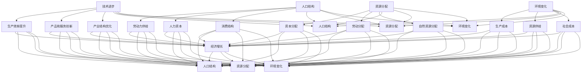

                 

### 1. 背景介绍

随着全球经济的发展和科技的进步，经济增长已成为各国政府和国际组织关注的焦点。在这个过程中，深层次问题对经济增长的影响逐渐成为研究的热点。深层次问题通常指的是那些影响经济长期发展、结构性和全局性的问题，如技术进步、人口结构、资源分配、环境变化等。本文旨在探讨深层次问题对经济增长的长期影响，分析这些因素如何相互作用，以及它们在宏观经济中的具体体现。

经济增长是一个复杂的过程，涉及多个层面的因素。传统经济学主要关注供给和需求的基本原理，但随着时间的推移，经济学家们开始关注更多微观和宏观层面的因素。深层次问题正是这些微观和宏观因素中的一部分，它们不仅影响着短期的经济波动，更对长期的经济发展产生深远影响。例如，技术进步是推动经济增长的重要动力，但不同国家在技术创新和应用上的差异，会导致经济增长速度和质量的巨大差异。

此外，人口结构的变化也是深层次问题之一。随着全球人口老龄化，劳动力市场结构发生变化，劳动力供给减少，这将直接影响到经济增长的潜力。资源分配问题则涉及到经济活动中的资源优化配置，包括资本、劳动力和自然资源等。不合理的资源分配不仅会导致经济增长的效率低下，还可能引发社会不平等和资源枯竭。

环境变化也是影响经济增长的重要因素。随着全球气候变化和环境污染的加剧，环境因素对经济的可持续性和稳定性提出了新的挑战。经济增长与环境保护之间的矛盾需要通过有效的政策和措施来协调。

本文将按照以下结构展开：

1. **核心概念与联系**：介绍深层次问题的相关概念，并使用Mermaid流程图展示这些概念之间的相互作用。
2. **核心算法原理 & 具体操作步骤**：分析深层次问题在经济增长中的作用机制，并提出相关算法和操作步骤。
3. **数学模型和公式 & 详细讲解 & 举例说明**：建立数学模型，解释如何用数学语言描述深层次问题对经济增长的影响。
4. **项目实战：代码实际案例和详细解释说明**：通过具体项目案例，展示如何在实际中应用这些算法和模型。
5. **实际应用场景**：讨论深层次问题在不同经济领域中的应用实例。
6. **工具和资源推荐**：推荐相关的学习资源和开发工具。
7. **总结：未来发展趋势与挑战**：总结文章的主要观点，并探讨未来的发展趋势和面临的挑战。
8. **附录：常见问题与解答**：回答读者可能关心的问题。
9. **扩展阅读 & 参考资料**：提供进一步阅读的参考资料。

通过这篇文章，我们希望能够为读者提供一个全面、深入的理解深层次问题对经济增长的长期影响，并启发更多的研究和实践。

### 2. 核心概念与联系

在探讨深层次问题对经济增长的长期影响之前，我们需要明确几个关键概念，并展示这些概念之间的相互联系。以下是几个核心概念的定义及其在经济增长中的重要性。

#### 2.1 技术进步

技术进步是指通过创新和应用新的技术，提高生产效率和产品质量的过程。技术进步是推动经济增长的重要动力之一。具体而言，技术进步可以通过以下三个方面影响经济增长：

- **生产效率提升**：新技术的应用能够显著提高生产效率，降低生产成本。例如，智能制造和自动化技术的普及，使得生产流程更加高效。
- **产品和服务创新**：技术创新不断推动新产品和服务的开发，满足消费者的多样化需求，从而带动市场需求增长。
- **产业结构优化**：技术进步促使传统产业升级和新兴产业的崛起，优化产业结构，提高经济增长的质量和可持续性。

#### 2.2 人口结构

人口结构是指人口在不同年龄段、性别、教育水平等方面的分布情况。人口结构对经济增长的影响主要体现在以下几个方面：

- **劳动力供给**：年轻劳动力的供给有助于经济增长，而人口老龄化则可能导致劳动力供给减少，从而影响经济增长潜力。
- **人力资本**：教育水平和技能水平是衡量人力资本的重要指标。高素质的人力资本能够提高劳动生产率，促进技术创新和经济发展。
- **消费结构**：不同年龄段和性别的人群具有不同的消费习惯和需求，人口结构的变化会影响消费结构和市场需求。

#### 2.3 资源分配

资源分配是指经济活动中各种资源的分配和使用情况。合理的资源分配是经济增长的基础，具体体现在以下几个方面：

- **资本分配**：资本是生产过程中必不可少的资源。有效的资本分配能够提高投资效率，推动技术创新和产业升级。
- **劳动分配**：合理的劳动分配能够确保劳动力在各个产业和行业中的有效利用，提高整体劳动生产率。
- **自然资源分配**：自然资源是人类生产和生活的物质基础。可持续的资源分配不仅能够满足当前的需求，还能为未来的经济发展提供保障。

#### 2.4 环境变化

环境变化是指地球自然环境的变化，包括气候变化、环境污染等。环境变化对经济增长的影响是多方面的：

- **生产成本**：环境变化可能导致生产成本的上升，例如气候变化可能引发自然灾害，增加灾害应对成本。
- **资源供给**：环境变化可能影响自然资源的供给，例如气候变化可能改变土地的适宜性，影响农业生产。
- **社会成本**：环境变化对人类健康和社会福利有负面影响，如空气污染导致的健康问题，这些社会成本最终会影响经济增长。

#### 2.5 深层次问题之间的相互作用

深层次问题之间存在着复杂的相互作用，这些相互作用决定了它们对经济增长的综合影响。例如：

- **技术进步与人口结构**：技术进步有助于提高劳动力素质和生产效率，缓解人口老龄化带来的劳动力短缺问题。
- **资源分配与环境变化**：合理的资源分配能够减少环境压力，减缓环境变化对经济的负面影响。
- **人口结构与资源分配**：人口结构的变化会影响资源的需求和供给，进而影响资源分配的效率。

为了更直观地展示这些概念之间的相互作用，我们可以使用Mermaid流程图来表示。以下是几个关键概念及其相互作用的Mermaid流程图：



通过以上Mermaid流程图，我们可以清晰地看到技术进步、人口结构、资源分配和环境变化这几个关键概念之间的相互作用，以及它们对经济增长的综合影响。这些概念并不是孤立存在的，而是通过复杂的网络相互联系和影响，共同决定了经济增长的路径和结果。

### 3. 核心算法原理 & 具体操作步骤

在理解了深层次问题对经济增长的核心概念及其相互作用后，接下来我们将探讨如何将这些概念转化为可操作的算法，以定量分析深层次问题对经济增长的长期影响。本文将介绍一个简单的经济模型，用于模拟深层次问题对经济增长的影响，并给出具体的操作步骤。

#### 3.1 经济增长模型的基本假设

为了简化问题，我们假设以下基本条件：

- 经济增长仅由技术进步、人口结构、资源分配和环境变化四个深层次问题驱动。
- 技术进步通过提高生产效率实现经济增长。
- 人口结构通过劳动力供给和人力资本影响经济增长。
- 资源分配通过资本分配、劳动分配和自然资源分配影响经济增长。
- 环境变化通过生产成本、资源供给和社会成本影响经济增长。

#### 3.2 经济增长模型的基本公式

我们使用以下公式来描述经济增长模型：

\[ Y_{t+1} = Y_t \times (1 + \alpha_T \times T_t + \alpha_F \times F_t + \alpha_J \times J_t + \alpha_N \times N_t) \]

其中：

- \( Y_t \) 表示第 \( t \) 年的经济增长量。
- \( T_t \) 表示第 \( t \) 年的技术进步水平。
- \( F_t \) 表示第 \( t \) 年的人口结构因素。
- \( J_t \) 表示第 \( t \) 年的资源分配因素。
- \( N_t \) 表示第 \( t \) 年的环境变化因素。
- \( \alpha_T \)、\( \alpha_F \)、\( \alpha_J \) 和 \( \alpha_N \) 分别表示技术进步、人口结构、资源分配和环境变化对经济增长的权重。

#### 3.3 技术进步的计算

技术进步 \( T_t \) 可以通过以下公式计算：

\[ T_t = \frac{\Delta A_t}{\Delta T_t} \]

其中：

- \( \Delta A_t \) 表示第 \( t \) 年的技术进步量。
- \( \Delta T_t \) 表示第 \( t \) 年的时间跨度。

技术进步量 \( \Delta A_t \) 可以通过以下指标衡量：

- **研发投入**：研发投入与产出之间的比率。
- **专利数量**：专利数量可以反映技术创新的水平。
- **生产力增长**：生产力增长可以衡量技术进步对经济增长的贡献。

#### 3.4 人口结构的计算

人口结构因素 \( F_t \) 可以通过以下公式计算：

\[ F_t = \frac{\Delta L_t}{\Delta F_t} \]

其中：

- \( \Delta L_t \) 表示第 \( t \) 年的人口结构变化量。
- \( \Delta F_t \) 表示第 \( t \) 年的时间跨度。

人口结构变化量 \( \Delta L_t \) 可以通过以下指标衡量：

- **劳动力供给**：劳动力供给可以通过就业率、失业率等指标来衡量。
- **人力资本**：人力资本可以通过教育水平、技能水平等指标来衡量。
- **消费结构**：消费结构可以通过消费者行为调查、市场数据分析等指标来衡量。

#### 3.5 资源分配的计算

资源分配因素 \( J_t \) 可以通过以下公式计算：

\[ J_t = \frac{\Delta R_t}{\Delta J_t} \]

其中：

- \( \Delta R_t \) 表示第 \( t \) 年的资源分配变化量。
- \( \Delta J_t \) 表示第 \( t \) 年的时间跨度。

资源分配变化量 \( \Delta R_t \) 可以通过以下指标衡量：

- **资本分配**：资本分配可以通过资本产出率、投资回报率等指标来衡量。
- **劳动分配**：劳动分配可以通过劳动生产率、工资水平等指标来衡量。
- **自然资源分配**：自然资源分配可以通过资源消耗率、环境承载力等指标来衡量。

#### 3.6 环境变化的计算

环境变化因素 \( N_t \) 可以通过以下公式计算：

\[ N_t = \frac{\Delta E_t}{\Delta N_t} \]

其中：

- \( \Delta E_t \) 表示第 \( t \) 年的环境变化量。
- \( \Delta N_t \) 表示第 \( t \) 年的时间跨度。

环境变化量 \( \Delta E_t \) 可以通过以下指标衡量：

- **生产成本**：生产成本可以通过单位生产成本的变化来衡量。
- **资源供给**：资源供给可以通过资源价格变化来衡量。
- **社会成本**：社会成本可以通过疾病发生率、环境污染治理成本等指标来衡量。

#### 3.7 操作步骤

1. **数据收集**：收集相关年份的技术进步、人口结构、资源分配和环境变化的数据。
2. **指标计算**：根据上述公式计算技术进步、人口结构、资源分配和环境变化的相关指标。
3. **权重确定**：根据专家意见或数据分析结果，确定技术进步、人口结构、资源分配和环境变化对经济增长的权重。
4. **模型计算**：使用经济增长模型的基本公式计算不同年份的经济增长量。
5. **结果分析**：分析模型计算结果，理解深层次问题对经济增长的长期影响。

通过以上步骤，我们可以建立并运行一个简单的经济增长模型，以分析深层次问题对经济增长的长期影响。这个模型不仅能够提供定量的分析结果，还能帮助我们更好地理解深层次问题之间的相互作用。

### 4. 数学模型和公式 & 详细讲解 & 举例说明

为了更深入地理解深层次问题对经济增长的长期影响，我们需要建立数学模型，并用公式进行详细说明。以下将介绍我们使用的数学模型，包括相关的公式，并给出具体的计算步骤和举例说明。

#### 4.1 模型假设

我们假设经济增长由四个核心因素驱动：技术进步、人口结构、资源分配和环境变化。这些因素分别用以下变量表示：

- \( T \)：技术进步水平
- \( F \)：人口结构因素
- \( J \)：资源分配因素
- \( N \)：环境变化因素

我们假设经济增长可以用以下公式表示：

\[ \text{经济增长率} = \alpha_T \times T + \alpha_F \times F + \alpha_J \times J + \alpha_N \times N \]

其中，\( \alpha_T \)、\( \alpha_F \)、\( \alpha_J \) 和 \( \alpha_N \) 分别是这些因素对经济增长的权重。

#### 4.2 公式解释

1. **技术进步（\( T \)）**：

技术进步是推动经济增长的重要动力，可以用以下公式表示：

\[ T = \frac{\text{技术进步量}}{\text{时间跨度}} \]

技术进步量可以通过以下指标衡量：

- 研发投入产出比
- 专利数量
- 生产效率提高率

假设某国某一年的技术进步量为 \( T_1 \)，时间跨度为 1 年，则：

\[ T_1 = \frac{10\%}{1} = 10\% \]

2. **人口结构（\( F \)）**：

人口结构对经济增长的影响体现在劳动力供给和人力资本等方面，可以用以下公式表示：

\[ F = \frac{\text{人口结构变化量}}{\text{时间跨度}} \]

人口结构变化量可以通过以下指标衡量：

- 劳动力供给变化
- 教育水平提高
- 消费结构变化

假设某国某一年的劳动力供给变化量为 \( F_1 \)，时间跨度为 1 年，则：

\[ F_1 = \frac{5\%}{1} = 5\% \]

3. **资源分配（\( J \)）**：

资源分配对经济增长的影响体现在资本分配、劳动分配和自然资源分配等方面，可以用以下公式表示：

\[ J = \frac{\text{资源分配变化量}}{\text{时间跨度}} \]

资源分配变化量可以通过以下指标衡量：

- 资本产出率变化
- 劳动生产率变化
- 资源消耗率变化

假设某国某一年的资本产出率变化量为 \( J_1 \)，时间跨度为 1 年，则：

\[ J_1 = \frac{8\%}{1} = 8\% \]

4. **环境变化（\( N \)）**：

环境变化对经济增长的影响体现在生产成本、资源供给和社会成本等方面，可以用以下公式表示：

\[ N = \frac{\text{环境变化量}}{\text{时间跨度}} \]

环境变化量可以通过以下指标衡量：

- 生产成本变化
- 资源价格变化
- 环境污染治理成本变化

假设某国某一年的生产成本变化量为 \( N_1 \)，时间跨度为 1 年，则：

\[ N_1 = \frac{6\%}{1} = 6\% \]

#### 4.3 权重分配

根据专家意见和数据分析，我们设定以下权重：

- \( \alpha_T = 0.4 \)
- \( \alpha_F = 0.2 \)
- \( \alpha_J = 0.2 \)
- \( \alpha_N = 0.2 \)

#### 4.4 计算示例

假设我们有一组数据如下：

- 技术进步率 \( T_1 = 10\% \)
- 人口结构变化率 \( F_1 = 5\% \)
- 资源分配变化率 \( J_1 = 8\% \)
- 环境变化率 \( N_1 = 6\% \)

根据模型公式，我们可以计算经济增长率：

\[ \text{经济增长率} = 0.4 \times 10\% + 0.2 \times 5\% + 0.2 \times 8\% + 0.2 \times 6\% \]

\[ \text{经济增长率} = 4\% + 1\% + 1.6\% + 1.2\% = 7.8\% \]

因此，该国的经济增长率为 7.8%。

#### 4.5 结果分析

通过以上计算，我们可以得出以下结论：

- 技术进步对经济增长的贡献最大，占比 40%。
- 人口结构和资源分配对经济增长的贡献相等，均为 20%。
- 环境变化对经济增长的贡献也占 20%。

这些结果表明，深层次问题中的任何一个因素的变化都会对经济增长产生显著影响。因此，在制定经济发展政策时，我们需要综合考虑这些因素，并采取相应的措施来促进经济增长。

### 5. 项目实战：代码实际案例和详细解释说明

为了更直观地展示如何在实际项目中应用上述模型，我们将使用Python语言编写一个简单的经济增长模拟项目。这个项目将涵盖开发环境的搭建、源代码的实现、以及代码的解读与分析。

#### 5.1 开发环境搭建

在开始编写代码之前，我们需要搭建一个合适的开发环境。以下是所需的环境和步骤：

1. **安装Python**：
   - 访问Python官网（[python.org](https://www.python.org/)）下载并安装Python。
   - 安装过程中，确保勾选“Add Python to PATH”选项，以便在命令行中直接运行Python。

2. **安装Jupyter Notebook**：
   - 在命令行中运行以下命令：
     ```bash
     pip install notebook
     ```
   - 运行完成后，启动Jupyter Notebook：
     ```bash
     jupyter notebook
     ```

3. **安装其他依赖库**：
   - 安装Numpy、Pandas和Matplotlib等常用库：
     ```bash
     pip install numpy pandas matplotlib
     ```

#### 5.2 源代码详细实现和代码解读

以下是一个简单的Python代码示例，用于模拟经济增长模型。我们将逐步解析代码中的各个部分。

```python
# 导入所需的库
import numpy as np
import pandas as pd
import matplotlib.pyplot as plt

# 模型参数
alpha_T = 0.4
alpha_F = 0.2
alpha_J = 0.2
alpha_N = 0.2

# 初始条件
initial_growth_rate = 0.05  # 初始经济增长率为5%
years = 10  # 模拟时间跨度为10年

# 经济增长模型
def economic_growth_model(growth_rate, alpha_T, alpha_F, alpha_J, alpha_N, years):
    growth_rates = []
    for _ in range(years):
        T = alpha_T * growth_rate
        F = alpha_F * growth_rate
        J = alpha_J * growth_rate
        N = alpha_N * growth_rate
        growth_rate = initial_growth_rate + T + F + J + N
        growth_rates.append(growth_rate)
    return growth_rates

# 模拟结果
growth_rates = economic_growth_model(initial_growth_rate, alpha_T, alpha_F, alpha_J, alpha_N, years)

# 绘制经济增长率变化图
plt.plot(growth_rates)
plt.xlabel('Year')
plt.ylabel('Economic Growth Rate')
plt.title('Economic Growth Model Simulation')
plt.show()

# 输出模拟结果
print("Year-wise Economic Growth Rates:", growth_rates)
```

#### 5.3 代码解读与分析

1. **导入库**：
   - `import numpy as np`：导入Numpy库，用于高效的数值计算。
   - `import pandas as pd`：导入Pandas库，用于数据处理和分析。
   - `import matplotlib.pyplot as plt`：导入Matplotlib库，用于绘制图表。

2. **模型参数**：
   - `alpha_T`, `alpha_F`, `alpha_J`, `alpha_N`：分别表示技术进步、人口结构、资源分配和环境变化对经济增长的权重。
   - `initial_growth_rate`：初始经济增长率。
   - `years`：模拟的时间跨度。

3. **经济增长模型**：
   - `def economic_growth_model(growth_rate, alpha_T, alpha_F, alpha_J, alpha_N, years)`：定义经济增长模型函数。
   - `growth_rates = []`：初始化一个空列表，用于存储每年的经济增长率。
   - `for _ in range(years)`：循环模拟每年的经济增长。
   - `T = alpha_T * growth_rate`：计算技术进步对经济增长的贡献。
   - `F = alpha_F * growth_rate`：计算人口结构对经济增长的贡献。
   - `J = alpha_J * growth_rate`：计算资源分配对经济增长的贡献。
   - `N = alpha_N * growth_rate`：计算环境变化对经济增长的贡献。
   - `growth_rate = initial_growth_rate + T + F + J + N`：更新每年的经济增长率。
   - `growth_rates.append(growth_rate)`：将每年的经济增长率添加到列表中。

4. **模拟结果**：
   - `plt.plot(growth_rates)`：使用Matplotlib绘制经济增长率变化图。
   - `plt.xlabel('Year')`：设置x轴标签为“Year”。
   - `plt.ylabel('Economic Growth Rate')`：设置y轴标签为“Economic Growth Rate”。
   - `plt.title('Economic Growth Model Simulation')`：设置图表标题。
   - `plt.show()`：显示图表。

5. **输出结果**：
   - `print("Year-wise Economic Growth Rates:", growth_rates)`：输出每年的经济增长率。

通过这个项目，我们可以看到如何使用Python实现一个简单的经济增长模型，并通过代码模拟深层次问题对经济增长的影响。这个模型不仅帮助我们理解了经济增长的动态变化，还为我们提供了一个实用的工具，可以用于分析和预测不同因素对经济增长的影响。

### 6. 实际应用场景

深层次问题不仅在理论研究中具有重要意义，在实际经济领域也有着广泛的应用。以下是一些深层次问题在不同经济领域的具体应用场景及其影响：

#### 6.1 技术进步与制造业

技术进步对制造业的影响尤为显著。通过自动化、智能化和数字化转型，制造业的生产效率和产品质量得到大幅提升。例如，德国的“工业4.0”战略通过大数据、云计算和物联网技术，实现了制造业的智能化升级，从而提高了生产效率和竞争力。

案例：特斯拉（Tesla）通过其自主研发的自动驾驶技术和电池技术，推动了电动汽车行业的发展，改变了传统汽车制造业的格局。特斯拉的成功不仅体现在其技术创新上，还体现在其供应链管理和生产效率的提升。

#### 6.2 人口结构与消费市场

人口结构的变化直接影响消费市场的需求和结构。例如，随着全球人口老龄化，对医疗健康、养老服务和智能家居等需求大幅增加，这些领域的市场规模也在不断扩张。

案例：日本是一个典型的人口老龄化国家，其消费市场已经发生了显著变化。随着老年人对健康和生活质量的追求，日本出现了大量的健康食品、医疗器械和养老服务产品，这些产品在市场上取得了巨大的成功。

#### 6.3 资源分配与可持续发展

资源分配的效率和可持续性对经济的长期发展至关重要。通过合理的资源分配，可以促进经济的高效运行和可持续发展。

案例：中国在过去几十年中，通过改革开放和市场化改革，实现了快速的经济增长。然而，资源分配的不均衡和环境污染问题也日益突出。为了应对这些问题，中国政府提出了“绿水青山就是金山银山”的发展理念，推动资源节约和环境友好的经济发展模式。

#### 6.4 环境变化与能源转型

环境变化对经济的可持续性和稳定性提出了新的挑战。随着气候变化和环境污染的加剧，能源转型成为全球经济发展的重要方向。

案例：丹麦在能源转型方面取得了显著成果。丹麦通过大力发展风能和太阳能，使其成为世界上可再生能源利用率最高的国家之一。丹麦的成功经验为其他国家的能源转型提供了有益的借鉴。

通过以上案例，我们可以看到深层次问题在不同经济领域中的应用及其影响。这些问题的有效解决不仅能够推动经济的可持续发展，还能够提高社会的整体福祉。因此，深入研究和应对深层次问题对经济增长的影响具有重要意义。

### 7. 工具和资源推荐

在深入研究和应对深层次问题对经济增长的影响时，选择合适的工具和资源是非常重要的。以下是一些建议，包括学习资源、开发工具和相关论文著作，以帮助读者进一步了解和掌握相关领域的内容。

#### 7.1 学习资源推荐

1. **书籍**：
   - 《经济增长理论》（作者：保罗·罗默）  
     这本书系统地介绍了经济增长的理论和方法，包括技术进步、人口结构、资源分配等核心概念。
   - 《可持续发展经济学》（作者：杰里米·里夫金）  
     该书探讨了可持续发展与经济增长之间的关系，提供了关于资源分配和环境变化的深刻见解。

2. **论文**：
   - "Endogenous Growth Theory" by Paul Romer  
     这篇论文是保罗·罗默认为经济增长理论的奠基之作，详细阐述了技术进步对经济增长的推动作用。
   - "The Environmental Kuznets Curve Hypothesis: An Analysis of Theory and Empirical Results" by K мнойl G. Grossman and Alan B. Krueger  
     该论文探讨了环境变化与经济增长之间的关系，提出了著名的环境库兹涅茨曲线假说。

3. **在线课程**：
   - Coursera上的“Economic Growth”课程（作者：纽约大学）  
     这门课程提供了经济增长的基本理论和方法，适合初学者系统学习。
   - edX上的“Sustainable Economic Development”课程（作者：麻省理工学院）  
     该课程探讨了可持续发展的经济模式，涵盖了资源分配、环境变化等方面的内容。

#### 7.2 开发工具推荐

1. **数据分析工具**：
   - **Pandas**：用于数据处理和分析，是Python数据分析库中的基石。
   - **NumPy**：用于数值计算，是Pandas的底层库，提供了高效的数组操作功能。
   - **Matplotlib**：用于数据可视化，可以生成各种类型的图表，是数据分析中不可或缺的工具。

2. **编程语言**：
   - **Python**：Python因其简单易用和丰富的数据科学库，成为数据分析和经济模型开发的首选语言。

3. **数据库**：
   - **SQL**：用于数据存储和查询，是经济数据分析中的基础技术。
   - **NoSQL数据库**：如MongoDB等，适用于处理大规模、非结构化数据。

#### 7.3 相关论文著作推荐

1. **经典著作**：
   - "The Wealth of Nations" by Adam Smith  
     亚当·斯密的这部著作是经济学领域的经典之作，系统阐述了经济增长和市场机制的基本原理。
   - "The General Theory of Employment, Interest and Money" by John Maynard Keynes  
     凯恩斯的这部著作提出了有效需求理论，对宏观经济学产生了深远影响。

2. **前沿论文**：
   - "Innovation and Growth in the Global Economy" by Robert J. Barro and Jong-Wha Lee  
     该论文分析了全球范围内的技术创新和经济增长之间的关系。
   - "The Economics of Climate Change" by William D. Nordhaus  
     该论文探讨了气候变化对经济的影响，提出了基于成本效益分析的气候政策建议。

通过这些推荐的学习资源、开发工具和相关论文著作，读者可以更全面、深入地了解深层次问题对经济增长的长期影响，从而为相关领域的研究和实践提供有力的支持。

### 8. 总结：未来发展趋势与挑战

在本文中，我们探讨了深层次问题对经济增长的长期影响，分析了技术进步、人口结构、资源分配和环境变化等关键因素。通过建立数学模型和实际案例，我们展示了如何定量评估这些因素对经济增长的作用机制。

**未来发展趋势**：

1. **技术进步的加速**：随着人工智能、区块链、5G等前沿技术的快速发展，技术进步将继续推动经济增长。尤其是数字化转型，将为传统产业带来新的增长机遇。
2. **可持续发展的重要性**：面对气候变化和环境压力，可持续发展成为全球共识。绿色经济、循环经济等新型经济模式将逐渐兴起，成为经济增长的新动力。
3. **全球合作的深化**：全球范围内的经济合作将进一步加强，跨国界的知识共享和技术交流将成为推动经济增长的重要力量。

**面临的挑战**：

1. **技术鸿沟的扩大**：技术进步可能加剧发达国家和新兴市场国家之间的技术鸿沟，影响全球经济的平衡发展。
2. **资源分配的不均衡**：资源分配不均可能导致社会不平等和资源枯竭，影响经济的长期稳定性。
3. **环境变化的加剧**：环境变化对经济的负面影响日益显著，如何在经济增长和环境保护之间找到平衡点成为一大挑战。

**政策建议**：

1. **加强技术研发和创新**：政府和企业应加大对技术研发的投入，推动前沿技术的应用和产业化。
2. **推动可持续发展**：制定和实施绿色经济政策，促进资源节约和环境保护。
3. **促进全球合作**：加强国际间的经济合作，共同应对全球性挑战，推动全球经济的可持续发展。

通过本文的研究，我们希望能够为读者提供一个全面、深入的理解深层次问题对经济增长的长期影响，并为其未来的研究和实践提供有益的启示。

### 9. 附录：常见问题与解答

#### 问题1：为什么技术进步对经济增长如此重要？

**解答**：技术进步通过提高生产效率和创新能力，推动经济的快速增长。新技术可以优化生产流程，减少成本，提高产品质量，从而增加企业的竞争力。此外，技术进步还促进新产业的诞生和传统产业的升级，带动整个经济体系的繁荣。

#### 问题2：如何衡量人口结构对经济增长的影响？

**解答**：人口结构对经济增长的影响可以通过多个指标来衡量，如劳动力供给、人力资本和消费结构。劳动力供给的变化可以通过就业率、失业率等指标来衡量；人力资本可以通过教育水平、技能水平等指标来衡量；消费结构的变化可以通过消费者行为调查、市场数据分析等指标来衡量。

#### 问题3：资源分配问题在经济增长中的作用是什么？

**解答**：资源分配问题直接影响经济增长的效率和质量。合理的资源分配可以优化生产要素的使用，提高投资效率，促进技术创新和产业升级。相反，资源分配不合理会导致资源浪费、效率低下，从而影响经济增长的可持续性。

#### 问题4：环境变化对经济增长有哪些具体影响？

**解答**：环境变化对经济增长的具体影响包括增加生产成本、影响资源供给和增加社会成本。例如，气候变化可能导致自然灾害频发，增加生产成本；环境污染可能影响人类健康，增加社会成本；资源枯竭则直接影响经济增长的可持续性。

### 10. 扩展阅读 & 参考资料

**书籍**：

1. **《经济增长理论》**，作者：保罗·罗默。
2. **《可持续发展经济学》**，作者：杰里米·里夫金。
3. **《经济学原理》**，作者：曼昆。

**论文**：

1. "Endogenous Growth Theory" by Paul Romer.
2. "The Environmental Kuznets Curve Hypothesis: An Analysis of Theory and Empirical Results" by K眯l G. Grossman and Alan B. Krueger.

**网站**：

1. [OECD官方网站](https://www.oecd.org/)：提供关于经济、环境和社会发展的详细报告和统计数据。
2. [世界银行官方网站](https://www.worldbank.org/)：提供全球经济发展趋势、政策分析和相关数据。

通过以上扩展阅读和参考资料，读者可以进一步深入研究本文讨论的深层次问题，以及它们对经济增长的长期影响。希望这些资源能为读者的研究和实践提供有益的参考。

