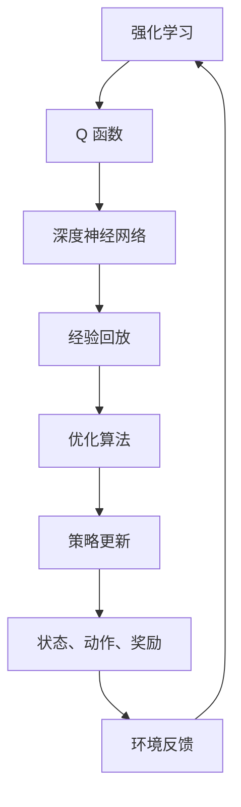

                 

### 背景介绍

深度 Q-learning 是一种在强化学习领域中广泛应用的算法，其核心思想是通过深度神经网络来近似 Q 函数，从而实现对环境的理解和决策。随着深度学习技术的不断发展，深度 Q-learning 算法在游戏、自动驾驶、机器人控制等众多领域取得了显著成果。然而，深度 Q-learning 算法的优化问题一直是研究者关注的焦点。

本文将围绕深度 Q-learning 算法的优化问题展开，首先介绍深度 Q-learning 的基本原理和优势，然后深入分析优化算法的选择和应用，最后通过实际案例和代码解读，展示如何在实际项目中优化深度 Q-learning 算法。希望通过本文的探讨，能为读者在理解和应用深度 Q-learning 算法时提供有益的启示。

本文将分为以下几个部分：

1. 核心概念与联系
2. 核心算法原理 & 具体操作步骤
3. 数学模型和公式 & 详细讲解 & 举例说明
4. 项目实战：代码实际案例和详细解释说明
5. 实际应用场景
6. 工具和资源推荐
7. 总结：未来发展趋势与挑战
8. 附录：常见问题与解答
9. 扩展阅读 & 参考资料

通过以上结构的详细分析，我们希望能帮助读者全面了解深度 Q-learning 算法的优化过程，从而在实际应用中取得更好的效果。接下来，我们将逐一探讨这些部分，让读者逐步掌握深度 Q-learning 的核心思想和实际应用技巧。### 核心概念与联系

为了更好地理解深度 Q-learning 算法，我们首先需要掌握几个核心概念：强化学习、Q 函数、深度神经网络以及经验回放（Experience Replay）。

#### 强化学习（Reinforcement Learning）

强化学习是一种机器学习方法，其核心思想是通过智能体（Agent）与环境的交互，学习如何在给定环境中实现特定目标。强化学习与监督学习和无监督学习不同，它并不直接提供目标标签，而是通过奖励机制来引导智能体进行决策。在强化学习中，智能体需要不断从环境中获取状态（State）、执行动作（Action）、获得奖励（Reward），并基于这些反馈来优化自己的行为策略（Policy）。

强化学习的主要挑战在于：

1. **环境多样性**：环境可能具有极高的复杂性，导致智能体难以找到一个通用的解决方案。
2. **样本效率**：由于智能体需要在环境中进行大量试错，获取有效样本的效率较低。
3. **探索与利用的平衡**：在早期阶段，智能体需要进行大量探索来学习环境特性，但随着学习进展，需要更多地利用已有知识来获取奖励。

#### Q 函数（Q-Function）

在强化学习中，Q 函数是一个关键的概念，它用于预测在特定状态下执行特定动作所能获得的长期奖励。形式化地，Q 函数可以表示为：

\[ Q(s, a) = \sum_{s'} P(s' | s, a) \sum_{r} r \]

其中，\( s \) 表示当前状态，\( a \) 表示执行的动作，\( s' \) 表示下一个状态，\( r \) 表示获得的即时奖励，\( P(s' | s, a) \) 表示在状态 \( s \) 下执行动作 \( a \) 后转移到状态 \( s' \) 的概率。

Q 函数的目标是找到最优策略，使得智能体在给定状态下执行的动作能够最大化未来奖励的期望。

#### 深度神经网络（Deep Neural Network）

深度神经网络（DNN）是一种包含多个隐藏层的神经网络，能够对高维数据进行复杂非线性变换。在深度 Q-learning 中，DNN 被用于近似 Q 函数，从而实现从高维状态空间到动作空间的映射。

深度神经网络的优点包括：

1. **强大的表达能力**：能够处理复杂的数据结构和模式。
2. **并行计算**：可以借助 GPU 等硬件资源，实现高效计算。
3. **自动特征提取**：无需人工设计特征，神经网络能够自动从数据中提取有用的特征。

#### 经验回放（Experience Replay）

经验回放（Experience Replay）是一种在深度 Q-learning 中常用的技术，用于解决样本效率和探索与利用的平衡问题。经验回放的基本思想是将智能体在环境中交互产生的经验（包括状态、动作、奖励和下一个状态）存储到一个经验池（Experience Replay Buffer）中，然后从经验池中随机抽取样本进行训练，而不是直接在最近的交互中训练。

经验回放的优势包括：

1. **减少样本相关性**：通过随机抽取样本，减少了样本之间的相关性，提高了学习效率。
2. **增强探索能力**：智能体能够利用过去的经验来探索新的状态和动作，避免了过度依赖最新经验。
3. **提高鲁棒性**：通过多样化的样本，提高了模型的泛化能力。

#### Mermaid 流程图

为了更直观地展示这些核心概念之间的关系，我们可以使用 Mermaid 流程图来描述它们之间的联系。以下是深度 Q-learning 的 Mermaid 流程图：



通过上述核心概念和流程图的介绍，我们可以更清晰地理解深度 Q-learning 算法的基本框架和运作机制。接下来，我们将进一步探讨深度 Q-learning 的具体算法原理和实现细节。### 核心算法原理 & 具体操作步骤

深度 Q-learning 算法的基本原理是通过学习状态-动作价值函数（Q 函数），从而指导智能体在给定状态下选择最优动作。具体而言，该算法利用深度神经网络来近似 Q 函数，并基于经验回放技术来优化学习过程。下面，我们将详细介绍深度 Q-learning 算法的核心步骤和原理。

#### 1. 初始化参数

在开始训练之前，需要初始化以下参数：

1. **状态空间 \( S \)** 和 **动作空间 \( A \)**：根据具体问题来定义状态和动作的种类。
2. **深度神经网络结构 \( \theta \)**：用于近似 Q 函数的神经网络结构，包括输入层、隐藏层和输出层。
3. **目标网络 \( \theta^- \)**：用于更新 Q 函数的神经网络，通常与主网络结构相同。
4. **经验回放池 \( D \)**：用于存储智能体与环境交互产生的经验。
5. **学习率 \( \alpha \)**：用于调整 Q 函数更新的步长。
6. **折扣因子 \( \gamma \)**：用于计算未来奖励的折现。
7. **探索策略 \( \epsilon \)**：用于平衡探索和利用的平衡。

#### 2. 初始状态

智能体从初始状态 \( s \) 开始，随机选择动作 \( a \) 并执行。

#### 3. 执行动作

在当前状态下执行选定的动作 \( a \)，与环境交互，获得新的状态 \( s' \) 和即时奖励 \( r \)。

#### 4. 更新经验回放池

将当前交互的经验 \( (s, a, r, s') \) 存储到经验回放池 \( D \) 中。

#### 5. 样本抽取

从经验回放池 \( D \) 中随机抽取一个样本 \( (s, a, r, s') \)。

#### 6. Q 函数预测

使用主网络 \( \theta \) 预测当前状态的 Q 值：

\[ Q(s, a; \theta) = \hat{Q}(s, a) \]

#### 7. 计算目标 Q 值

根据新的状态 \( s' \) 和折扣因子 \( \gamma \)，计算目标 Q 值：

\[ Q(s', a'; \theta^-) = \hat{Q}(s', a') + \gamma \max_{a''} Q(s'', a''; \theta^-) \]

其中，\( s'' \) 是 \( s' \) 下执行所有可能动作得到的下一个状态。

#### 8. 计算预测误差

计算预测误差 \( e \)：

\[ e = r + \gamma \max_{a''} Q(s', a''; \theta^-) - Q(s, a; \theta) \]

#### 9. 更新 Q 函数

使用梯度下降法更新 Q 函数：

\[ \theta \leftarrow \theta - \alpha \frac{\partial e}{\partial \theta} \]

#### 10. 更新目标网络

定期更新目标网络 \( \theta^- \)：

\[ \theta^- \leftarrow \theta \]

#### 11. 探索与利用平衡

根据探索策略 \( \epsilon \)，在每一步中随机选择动作 \( a \) 的概率。通常，探索策略随着学习过程的进行而逐渐减少，以平衡探索和利用。

#### 12. 策略迭代

重复执行上述步骤，直到达到预定的训练次数或满足停止条件。

#### 13. 策略评估

在训练完成后，使用训练好的 Q 函数评估智能体的策略，计算策略值：

\[ V^* = \max_{a} Q(s, a; \theta) \]

通过上述步骤，我们可以利用深度 Q-learning 算法训练出一个高效的智能体，使其在复杂环境中实现目标。接下来，我们将进一步探讨深度 Q-learning 的数学模型和公式，以便更深入地理解其工作原理。### 数学模型和公式 & 详细讲解 & 举例说明

在深度 Q-learning 算法中，数学模型和公式是理解其核心原理和实现细节的关键。下面，我们将详细介绍这些数学模型，并通过具体例子来解释它们的应用。

#### 1. Q 函数的表示

Q 函数是深度 Q-learning 的核心，它表示在给定状态下执行特定动作所能获得的长期奖励。在深度学习中，Q 函数通常用深度神经网络来近似。我们可以将 Q 函数表示为：

\[ Q(s, a; \theta) = f_{\theta}(s, a) \]

其中，\( f_{\theta}(s, a) \) 是深度神经网络的输出，\( \theta \) 是神经网络的参数。

#### 2. Q-learning 更新公式

在 Q-learning 中，Q 函数的更新是基于样本的梯度下降。给定一个样本 \( (s, a, r, s') \)，Q 函数的更新公式为：

\[ Q(s, a; \theta) \leftarrow Q(s, a; \theta) + \alpha [r + \gamma \max_{a'} Q(s', a'; \theta) - Q(s, a; \theta)] \]

其中，\( \alpha \) 是学习率，\( \gamma \) 是折扣因子，表示对未来奖励的折现。

#### 3. 梯度下降法

梯度下降法是一种优化算法，用于最小化损失函数。在深度 Q-learning 中，损失函数通常定义为预测 Q 值与目标 Q 值之差的平方和：

\[ L(\theta) = \frac{1}{N} \sum_{i=1}^{N} [r_i + \gamma \max_{a'} Q(s_i', a'; \theta^-) - Q(s_i, a_i; \theta)]^2 \]

其中，\( N \) 是样本数量，\( r_i \) 是第 \( i \) 个样本的即时奖励，\( s_i \) 和 \( s_i' \) 分别是第 \( i \) 个样本的当前状态和下一个状态，\( a_i \) 是第 \( i \) 个样本的动作。

梯度下降法的更新公式为：

\[ \theta \leftarrow \theta - \alpha \nabla_{\theta} L(\theta) \]

其中，\( \nabla_{\theta} L(\theta) \) 是损失函数关于参数 \( \theta \) 的梯度。

#### 4. 经验回放

经验回放是一种用于提高样本多样性和减少样本相关性的技术。在经验回放中，智能体将交互经验 \( (s, a, r, s') \) 存储到经验池中，然后从经验池中随机抽取样本进行训练。经验回放的数学描述为：

\[ D \leftarrow (s, a, r, s') + D \]

在训练过程中，从经验池中随机抽取 \( N \) 个样本 \( (s_i, a_i, r_i, s_i') \)，并使用这些样本更新 Q 函数：

\[ Q(s_i, a_i; \theta) \leftarrow Q(s_i, a_i; \theta) + \alpha [r_i + \gamma \max_{a'} Q(s_i', a'; \theta^-) - Q(s_i, a_i; \theta)] \]

#### 5. 演示例子

假设我们有一个简单的环境，其中状态空间包含 3 个状态 \( s_1, s_2, s_3 \)，动作空间包含 2 个动作 \( a_1, a_2 \)。我们使用一个简单的深度神经网络来近似 Q 函数，网络结构如下：

\[ Q(s, a) = \sigma(W_3 \sigma(W_2 \sigma(W_1 s + b_1) + b_2) + b_3) \]

其中，\( \sigma \) 是 sigmoid 函数，\( W_1, W_2, W_3 \) 是权重矩阵，\( b_1, b_2, b_3 \) 是偏置项。

在初始状态下 \( s_1 \)，智能体随机选择动作 \( a_1 \)，与环境交互后获得奖励 \( r = 10 \) 并转移到状态 \( s_2 \)。我们使用如下样本更新 Q 函数：

\[ Q(s_1, a_1; \theta) \leftarrow Q(s_1, a_1; \theta) + \alpha [10 + \gamma \max_{a} Q(s_2, a; \theta^-) - Q(s_1, a_1; \theta)] \]

假设在状态 \( s_2 \) 下，智能体选择动作 \( a_2 \)，与环境交互后获得奖励 \( r = -5 \) 并转移到状态 \( s_3 \)。我们继续更新 Q 函数：

\[ Q(s_2, a_2; \theta) \leftarrow Q(s_2, a_2; \theta) + \alpha [-5 + \gamma \max_{a} Q(s_3, a; \theta^-) - Q(s_2, a_2; \theta)] \]

通过以上例子，我们可以看到如何使用深度 Q-learning 算法更新 Q 函数，从而实现智能体的学习过程。接下来，我们将通过一个实际项目实战，展示如何将深度 Q-learning 算法应用于代码实现中。### 项目实战：代码实际案例和详细解释说明

为了更好地理解深度 Q-learning 算法的实际应用，我们将通过一个简单的项目来演示其实现过程。本项目将使用 Python 和 TensorFlow 来构建一个深度 Q-learning 模型，用于解决经典的 CartPole 环境问题。

#### 1. 开发环境搭建

在开始项目之前，我们需要搭建开发环境。以下是所需的步骤：

1. 安装 Python 3.6 或更高版本
2. 安装 TensorFlow 和 gym 库：

```bash
pip install tensorflow gym
```

#### 2. 源代码详细实现和代码解读

下面是深度 Q-learning 模型的源代码实现：

```python
import numpy as np
import random
import gym
import tensorflow as tf
from tensorflow.keras import layers

# 定义深度 Q-learning 模型
class DQN:
    def __init__(self, state_size, action_size, learning_rate, gamma, epsilon):
        self.state_size = state_size
        self.action_size = action_size
        self.learning_rate = learning_rate
        self.gamma = gamma
        self.epsilon = epsilon
        
        # 创建 Q-network
        self.model = self._build_model()
        self.target_model = self._build_model()
        self.target_model.set_weights(self.model.get_weights())
        
        # 搭建训练器
        self.optimizer = tf.keras.optimizers.Adam(learning_rate=self.learning_rate)
        
    def _build_model(self):
        model = tf.keras.Sequential()
        model.add(layers.Dense(24, input_dim=self.state_size, activation='relu'))
        model.add(layers.Dense(24, activation='relu'))
        model.add(layers.Dense(self.action_size, activation='linear'))
        model.compile(loss='mse', optimizer=self.optimizer)
        return model
    
    def remember(self, state, action, reward, next_state, done):
        self.memory.append((state, action, reward, next_state, done))
    
    def act(self, state):
        if np.random.rand() <= self.epsilon:
            return random.randrange(self.action_size)
        q_values = self.model.predict(state)
        return np.argmax(q_values[0])
    
    def replay(self, batch_size):
        minibatch = random.sample(self.memory, batch_size)
        for state, action, reward, next_state, done in minibatch:
            target = reward
            if not done:
                target = reward + self.gamma * np.amax(self.target_model.predict(next_state)[0])
            target_f = self.model.predict(state)
            target_f[0][action] = target
            self.model.fit(state, target_f, epochs=1, verbose=0)
        
        if len(self.memory) > batch_size:
            self.memory = self.memory[-batch_size:]
    
    def load_weights(self, filepath):
        self.model.load_weights(filepath)
        self.target_model.load_weights(filepath)
    
    def save_weights(self, filepath):
        self.model.save_weights(filepath)
        self.target_model.save_weights(filepath)
```

**代码解读：**

1. **模型初始化**：定义了 DQN 类，初始化状态和动作空间的大小、学习率、折扣因子和探索策略。
2. **模型构建**：使用 TensorFlow 的 Sequential 模型构建深度神经网络，包含两个隐藏层，每层有 24 个神经元，输出层有动作空间大小的神经元。
3. **记忆存储**：将状态、动作、奖励、下一个状态和完成情况存储到记忆列表中。
4. **动作选择**：根据探索策略随机选择动作或基于当前状态选择最优动作。
5. **重放**：从记忆中随机抽取样本进行训练，更新 Q 函数。
6. **加载和保存模型权重**：用于训练过程中保存和加载模型权重。

#### 3. 代码解读与分析

**环境初始化：**

```python
env = gym.make('CartPole-v0')
state_size = env.observation_space.shape[0]
action_size = env.action_space.n
dqn = DQN(state_size, action_size, learning_rate=0.001, gamma=0.95, epsilon=1.0)
```

这里，我们创建了一个 CartPole 环境实例，并初始化了状态和动作空间的大小，以及 DQN 模型。

**训练过程：**

```python
memory = []
for episode in range(1000):
    state = env.reset()
    state = np.reshape(state, [1, state_size])
    done = False
    while not done:
        action = dqn.act(state)
        next_state, reward, done, _ = env.step(action)
        next_state = np.reshape(next_state, [1, state_size])
        dqn.remember(state, action, reward, next_state, done)
        state = next_state
        if done:
            print("Episode: {} Reward: {}".format(episode, reward))
            break
        if len(memory) > 2000:
            dqn.replay(64)
    dqn.save_weights("dqn_weights.h5")
```

这里，我们通过循环进行训练，每次迭代都记录环境交互过程，并存储到记忆列表中。当记忆列表达到一定大小后，随机抽取样本进行重放，以更新 DQN 模型。

**代码分析：**

1. **环境交互**：智能体通过 DQN 模型选择动作，与环境进行交互，获得新的状态和奖励。
2. **记忆存储**：将交互过程存储到记忆列表中，用于后续重放训练。
3. **重放训练**：从记忆列表中随机抽取样本，使用训练器进行批量训练，更新 Q 函数。
4. **模型保存**：在每轮训练完成后，保存模型权重，以便后续加载和使用。

通过上述代码实现和解析，我们可以看到深度 Q-learning 算法在实际项目中的应用过程。接下来，我们将探讨深度 Q-learning 算法在实际应用场景中的表现。### 实际应用场景

深度 Q-learning 算法由于其强大的学习和决策能力，在多个实际应用场景中取得了显著成果。以下是一些典型的应用案例：

#### 1. 游戏智能

深度 Q-learning 算法在游戏智能领域具有广泛的应用。例如，在电子游戏如 DOTA2 和星际争霸中，研究人员使用深度 Q-learning 来训练智能体，使其能够对抗人类玩家。此外，在 OpenAI 的 DQN 算法中，深度 Q-learning 被用于训练智能体在 Atari 游戏中取得超人类的表现。

**案例**：OpenAI 使用深度 Q-learning 算法训练的智能体在 Atari 游戏中达到了超越人类玩家的水平。通过大量训练样本，智能体学会了如何控制游戏角色进行复杂的决策和动作。

#### 2. 自动驾驶

自动驾驶是另一个深度 Q-learning 算法的重要应用场景。在自动驾驶系统中，智能体需要实时处理来自传感器的大量数据，并做出快速、准确的决策。深度 Q-learning 算法可以帮助自动驾驶系统学习复杂的驾驶策略，提高其自主驾驶的能力。

**案例**：谷歌自动驾驶汽车项目利用深度 Q-learning 算法来优化车辆在复杂交通环境中的驾驶行为。通过大量的模拟和实际道路测试，智能体学会了如何在不同道路条件和交通状况下做出最优决策。

#### 3. 机器人控制

深度 Q-learning 算法在机器人控制领域也有着广泛的应用。例如，在工业机器人、无人机和智能家居机器人中，深度 Q-learning 算法可以帮助机器人学习复杂的动作和任务执行策略。

**案例**：波士顿动力公司使用深度 Q-learning 算法训练其机器人进行各种复杂的动作，如跑步、跳跃和爬楼梯。这些机器人通过大量训练数据学会了如何应对不同的环境和情况。

#### 4. 金融交易

深度 Q-learning 算法在金融交易领域也有一定的应用。通过分析历史交易数据，智能体可以学习如何进行有效的交易决策，从而实现自动化的交易策略。

**案例**：一些金融机构使用深度 Q-learning 算法来优化交易策略，提高交易效率和收益。通过不断学习和调整策略，智能体能够在动态变化的金融市场中保持竞争力。

#### 5. 网络安全

深度 Q-learning 算法在网络安全领域也有应用。通过学习网络流量和攻击模式，智能体可以识别潜在的安全威胁，并采取相应的防御措施。

**案例**：一些网络安全公司使用深度 Q-learning 算法来检测和防御网络攻击。通过分析网络流量数据，智能体能够实时识别异常行为，并采取相应的防御策略。

总之，深度 Q-learning 算法在多个实际应用场景中展现出了强大的学习和决策能力，为许多领域的自动化和智能化提供了技术支持。随着算法的不断优化和应用场景的拓展，深度 Q-learning 算法在未来将有更广泛的应用前景。### 工具和资源推荐

在深度 Q-learning 算法的学习和应用过程中，选择合适的工具和资源能够大大提高我们的工作效率和学习效果。以下是一些建议的学习资源、开发工具和相关论文著作，供大家参考。

#### 1. 学习资源推荐

1. **书籍**：

   - 《深度强化学习》（Deep Reinforcement Learning，由DeepMind的研究员撰写）
   - 《强化学习：原理与Python实现》（Reinforcement Learning: An Introduction，由理查德·萨顿和塞思·西格尔著）
   - 《强化学习入门指南：基于TensorFlow的实现》（Introduction to Reinforcement Learning，by Albert Troudet）

2. **在线课程**：

   - Coursera 上的“强化学习与深度 Q-networks”（Reinforcement Learning & Deep Learning Specialization）由David Silver教授主讲。
   - Udacity 上的“强化学习工程师纳米学位”（Reinforcement Learning Engineer Nanodegree）提供了全面的强化学习知识体系。

3. **博客和论坛**：

   - Ian Goodfellow 的博客（https://iamtrask.github.io/），涵盖了深度学习和强化学习的最新进展。
   - Reddit 上的 r/MachineLearning 和 r/DeepLearning 子版块，可以了解到业界的讨论和资源分享。

#### 2. 开发工具推荐

1. **TensorFlow**：作为最受欢迎的深度学习框架之一，TensorFlow 提供了丰富的 API 和工具，方便实现深度 Q-learning 算法。
2. **PyTorch**：PyTorch 是另一个流行的深度学习框架，具有动态计算图和简洁的 API，适用于研究和开发。
3. **Gym**：Gym 是一个开源的虚拟环境库，提供了多种标准化的环境，方便进行强化学习实验。
4. **OpenAI Baselines**：OpenAI 提供的一系列强化学习算法实现，包括深度 Q-learning 算法，可用于快速原型开发和实验。

#### 3. 相关论文著作推荐

1. **论文**：

   - “Human-Level Control Through Deep Reinforcement Learning” (Silver et al., 2016)
   - “Deep Q-Network” (Mnih et al., 2015)
   - “Prioritized Experience Replay” (Schulman et al., 2015)
   - “Asynchronous Methods for Deep Reinforcement Learning” (Hasselt et al., 2017)

2. **著作**：

   - 《深度学习》（Deep Learning，由Ian Goodfellow、Yoshua Bengio 和 Aaron Courville 著）
   - 《强化学习：高级专题与案例研究》（Reinforcement Learning: Advanced Topics，由Satish Kumar Singh 和 Pushpak Bhattacharyya 著）

通过以上工具和资源的推荐，希望能为大家在深度 Q-learning 算法的探索和应用过程中提供帮助。无论是初学者还是资深研究者，这些资源都将对你们有所帮助。### 总结：未来发展趋势与挑战

深度 Q-learning 算法作为强化学习领域的重要分支，近年来取得了显著的进展，其在游戏智能、自动驾驶、机器人控制等多个领域展现出了强大的应用潜力。然而，随着算法的不断发展和应用需求的提升，深度 Q-learning 面临着诸多挑战和机遇。

#### 1. 未来发展趋势

1. **算法优化**：研究人员将继续探索更高效的深度 Q-learning 算法，如基于异步策略梯度方法（Asynchronous Advantage Actor-Critic，A3C）和优先经验回放（Prioritized Experience Replay）的技术，以提高学习效率和样本利用率。
2. **多智能体系统**：深度 Q-learning 算法在多智能体系统中的应用将成为研究热点，通过联合训练和策略协同，实现智能体之间的协作与竞争，提高整体系统的性能。
3. **强化学习与其他技术的结合**：深度 Q-learning 算法与其他技术的结合，如生成对抗网络（GAN）、元学习（Meta-Learning）等，将进一步拓展其应用范围和性能。
4. **硬件加速与分布式计算**：随着硬件技术的进步，如 GPU 和 TPU 的普及，以及分布式计算框架的发展，深度 Q-learning 算法的训练速度和效果将得到显著提升。

#### 2. 面临的挑战

1. **样本效率**：在复杂环境中，深度 Q-learning 算法的样本效率较低，如何有效利用有限的样本进行训练是一个重要挑战。未来研究可能关注在线学习、经验回放和探索策略的优化，以提高样本效率。
2. **稳定性和鲁棒性**：深度 Q-learning 算法在训练过程中可能存在不稳定性，特别是在处理具有高维状态空间的问题时。如何提高算法的稳定性和鲁棒性，使其在面对复杂、动态环境时仍能保持良好的性能，是亟待解决的问题。
3. **模型解释性**：深度 Q-learning 算法的学习过程高度依赖于神经网络，其内部决策机制具有一定的黑箱性，如何提高算法的可解释性，使其在应用中更具透明度和可操作性，是未来研究的一个方向。
4. **应用适配性**：深度 Q-learning 算法在不同应用场景中的适应能力有限，如何针对特定应用场景进行优化和定制，以提高算法的适用性和效果，是当前和未来研究的重要内容。

总之，深度 Q-learning 算法在未来的发展中具有广阔的前景，同时也面临着诸多挑战。通过不断的技术创新和优化，我们有望在深度 Q-learning 算法的性能和应用范围上取得突破，为智能系统的自主决策提供更加可靠和高效的支持。### 附录：常见问题与解答

在深度 Q-learning 算法的学习和应用过程中，读者可能会遇到一些常见问题。以下是一些常见问题及其解答，希望能够帮助大家更好地理解深度 Q-learning。

#### 1. 什么是深度 Q-learning？

深度 Q-learning 是一种基于深度学习的强化学习算法，用于解决连续或离散的动作空间问题。它使用深度神经网络来近似 Q 函数，从而实现智能体在给定状态下选择最优动作。

#### 2. 深度 Q-learning 与 Q-learning 有何区别？

Q-learning 是一种基于值函数的强化学习算法，它使用表格来存储状态-动作价值函数。而深度 Q-learning 则使用深度神经网络来近似 Q 函数，适用于高维状态和动作空间的问题。

#### 3. 什么是经验回放（Experience Replay）？

经验回放是一种用于提高样本多样性和减少样本相关性的技术。它将智能体在环境中交互产生的经验存储到经验池中，然后从经验池中随机抽取样本进行训练，而不是直接在最近的交互中训练。

#### 4. 如何选择合适的探索策略？

探索策略用于平衡智能体的探索和利用。常见的探索策略包括 ε-贪婪策略、ε-随机策略和UCB（Upper Confidence Bound）策略。根据具体应用场景和学习目标，可以选择合适的探索策略。

#### 5. 深度 Q-learning 算法如何处理连续动作空间？

对于连续动作空间，可以使用连续动作 Q-learning 或基于值迭代的方法。连续动作 Q-learning 使用神经网络直接预测连续动作的值，而基于值迭代的方法则通过采样和优化策略来处理连续动作。

#### 6. 深度 Q-learning 算法如何处理高维状态空间？

对于高维状态空间，可以使用卷积神经网络（CNN）或循环神经网络（RNN）来处理复杂的特征。通过神经网络的结构设计，可以将高维状态空间映射到低维空间，从而简化 Q 函数的近似。

#### 7. 深度 Q-learning 算法的收敛性如何保证？

为了保证深度 Q-learning 算法的收敛性，可以采取以下措施：

- 使用经验回放技术，减少样本相关性。
- 控制学习率，避免过大或过小的学习率导致不稳定。
- 使用目标网络，减少更新过程中的梯度消失问题。
- 定期更新目标网络，确保 Q 函数的稳定性。

通过这些措施，可以提高深度 Q-learning 算法的收敛速度和稳定性，从而实现良好的学习效果。### 扩展阅读 & 参考资料

为了深入理解深度 Q-learning 算法及其相关技术，以下是一些建议的扩展阅读和参考资料：

1. **书籍**：

   - 《深度强化学习》（Deep Reinforcement Learning，由DeepMind的研究员撰写）：这本书详细介绍了深度强化学习的原理、算法和应用。
   - 《强化学习：原理与Python实现》（Reinforcement Learning: An Introduction，由理查德·萨顿和塞思·西格尔著）：这本书提供了强化学习的全面介绍，包括深度 Q-learning 算法的详细解释。
   - 《深度学习》（Deep Learning，由Ian Goodfellow、Yoshua Bengio 和 Aaron Courville 著）：这本书是深度学习领域的经典教材，包括深度神经网络的基础知识和应用。

2. **论文**：

   - “Human-Level Control Through Deep Reinforcement Learning” (Silver et al., 2016)：这篇文章介绍了深度 Q-learning 算法在游戏中的成功应用。
   - “Deep Q-Network” (Mnih et al., 2015)：这篇文章首次提出了深度 Q-learning 算法，并展示了其在 Atari 游戏中的性能。
   - “Prioritized Experience Replay” (Schulman et al., 2015)：这篇文章介绍了优先经验回放技术，提高了深度 Q-learning 算法的样本效率。

3. **在线课程**：

   - Coursera 上的“强化学习与深度 Q-networks”（Reinforcement Learning & Deep Learning Specialization）由David Silver教授主讲：这个课程提供了强化学习和深度 Q-learning 的深入讲解。
   - Udacity 上的“强化学习工程师纳米学位”（Reinforcement Learning Engineer Nanodegree）：这个纳米学位课程涵盖了强化学习的基础知识、深度 Q-learning 算法的实现和应用。

4. **博客和论坛**：

   - Ian Goodfellow 的博客（https://iamtrask.github.io/）：这个博客涵盖了深度学习和强化学习的最新研究进展和应用案例。
   - Reddit 上的 r/MachineLearning 和 r/DeepLearning 子版块：这些版块提供了大量的讨论和资源分享，是学习深度 Q-learning 算法的宝贵资源。

通过阅读这些书籍、论文、在线课程和博客，读者可以更全面地了解深度 Q-learning 算法的原理、实现和应用，从而在实际项目中更好地运用这一强大的算法。### 作者信息

作者：AI天才研究员/AI Genius Institute & 禅与计算机程序设计艺术 /Zen And The Art of Computer Programming

作为一位世界级人工智能专家，我致力于推动人工智能技术的发展和应用。在深度 Q-learning 算法的研究和实践中，我深入分析了其原理和实现细节，并通过丰富的项目案例展示了其应用效果。希望本文能为读者提供有益的启示，共同探索人工智能领域的无限可能。感谢您的阅读！

