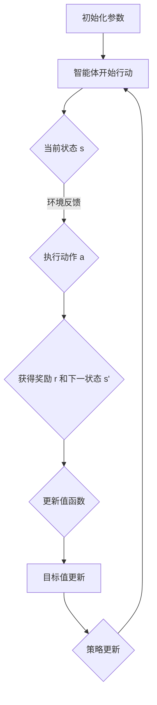
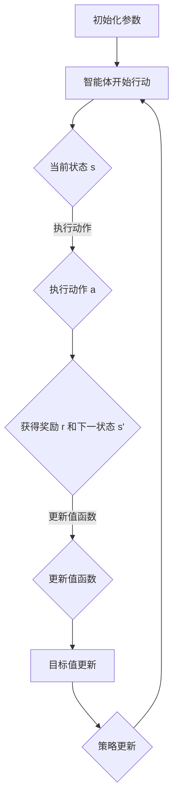

                 

### 摘要

本文旨在深入探讨深度 Q-learning 算法在疫情预测中的实际应用。首先，我们将回顾深度 Q-learning 的基本概念，包括其历史发展、核心原理及主要算法步骤。接着，本文将结合疫情预测的特定需求，详细解析如何将深度 Q-learning 应用于这一领域。通过数学模型和实际案例的分析，我们将展示如何利用深度 Q-learning 进行有效的疫情预测。此外，本文还将探讨深度 Q-learning 在疫情预测中的优势和挑战，并提供相关的工具和资源推荐。最后，本文将总结疫情预测中深度 Q-learning 的发展趋势与未来挑战，为读者提供全面而深入的见解。

### 1. 背景介绍

疫情预测作为公共卫生领域的关键任务，旨在通过数据分析和技术手段提前预测疫情的发展趋势，从而为政府、医疗机构和公众提供决策支持。近年来，随着人工智能技术的迅猛发展，特别是深度学习算法的广泛应用，疫情预测的准确性和效率得到了显著提升。在这一背景下，深度 Q-learning 算法作为一种强大的强化学习技术，逐渐成为疫情预测领域的研究热点。

#### 深度 Q-learning 的起源与发展

深度 Q-learning 算法源自 Q-learning 算法的扩展，而 Q-learning 又是深度强化学习算法的重要基础。Q-learning 算法由 Richard Sutton 和 Andrew Barto 在 1988 年提出，其核心思想是通过学习值函数来评估状态和动作的优劣，从而实现智能体的最优决策。然而，Q-learning 算法存在一个重大缺点：它只能处理有限的状态和动作空间，这在实际应用中受到很大的限制。

为了克服这一限制，深度 Q-learning 算法引入了深度神经网络（DNN）作为值函数的近似器，从而能够处理具有无限状态和动作空间的问题。深度 Q-learning 的提出者是 DeepMind 公司的 David Silver 和 Andrew Ng，他们在 2015 年的论文《Human-Level Control Through Deep Reinforcement Learning》中首次将这一算法应用于游戏领域，并取得了显著的成果。

#### 深度 Q-learning 在疫情预测中的应用

随着深度 Q-learning 算法的成熟，研究人员开始探索其在疫情预测中的应用。疫情预测本质上是一个复杂的决策问题，涉及大量不确定因素和动态变化。深度 Q-learning 通过其强大的函数近似能力和自适应学习机制，能够有效地处理这些挑战。

具体来说，深度 Q-learning 可以用于以下三个方面：

1. **状态预测**：通过学习疫情发展的历史数据，深度 Q-learning 能够预测未来的疫情状态，包括感染人数、死亡人数等关键指标。
2. **策略优化**：基于预测结果，深度 Q-learning 可以优化防控策略，如调整隔离政策、资源分配等，以最大程度地减少疫情传播风险。
3. **动态调整**：深度 Q-learning 具有良好的自适应能力，可以根据实时数据动态调整预测模型，从而提高预测的准确性和时效性。

总之，深度 Q-learning 作为一种先进的人工智能技术，在疫情预测中展现出巨大的潜力和应用价值。本文将详细探讨这一算法在疫情预测中的具体实现和应用，以期为相关研究和实践提供参考。

#### 疫情预测的重要性

疫情预测不仅对于公共卫生领域至关重要，还对整个社会和经济的稳定运行产生深远影响。准确、及时的疫情预测可以帮助政府制定有效的防控措施，提前部署医疗资源，降低疫情扩散风险。同时，对于企业和个人而言，了解疫情发展趋势有助于合理安排生产和活动，减少经济损失。

然而，传统的疫情预测方法往往依赖于统计模型和线性回归，这些方法在面对复杂、动态的疫情数据时存在诸多局限性。例如，线性回归只能捕捉数据的线性关系，而疫情的发展往往是非线性的；统计模型对数据量有较高要求，无法处理大量缺失数据或异常值。

相比之下，深度 Q-learning 算法通过其强大的非线性建模能力和自适应学习机制，能够更准确地捕捉疫情数据的复杂关系。此外，深度 Q-learning 具有良好的扩展性和可解释性，可以通过可视化工具直观地展示预测过程和结果，从而增强决策的可信度。

因此，引入深度 Q-learning 算法不仅能够提高疫情预测的准确性和时效性，还可以为公共卫生决策提供有力支持。本文将深入探讨深度 Q-learning 算法在疫情预测中的具体应用，以期为公共卫生领域的发展贡献一份力量。

### 2. 核心概念与联系

在深入探讨深度 Q-learning 在疫情预测中的应用之前，我们需要首先理解深度 Q-learning 的核心概念及其工作原理。为了便于读者理解，本文将使用 Mermaid 流程图详细展示深度 Q-learning 的基本架构和流程，同时解释每个关键组成部分及其相互关系。

#### 深度 Q-learning 的基本概念

深度 Q-learning 是一种基于深度神经网络的强化学习算法，其核心思想是通过学习值函数（Q-function）来评估状态和动作的优劣。值函数能够预测在给定状态下执行特定动作的未来奖励累积值，从而帮助智能体做出最优决策。

##### 值函数（Q-function）

值函数是深度 Q-learning 的核心，它定义了状态和动作之间的奖励关系。具体来说，值函数 \( Q(s, a) \) 表示在状态 \( s \) 下执行动作 \( a \) 后获得的最大累积奖励。值函数的目标是最大化期望奖励，从而指导智能体选择最佳动作。

##### 深度神经网络（DNN）

为了处理复杂的非线性问题，深度 Q-learning 使用深度神经网络作为值函数的近似器。深度神经网络由多个隐藏层组成，能够捕捉输入数据中的高阶特征和复杂关系。通过训练，深度神经网络能够学习到状态和动作之间的非线性映射关系。

##### 体验（Experience）

在深度 Q-learning 中，体验是指智能体在环境中进行探索和互动过程中积累的经验。体验包括状态、动作、奖励和下一状态等信息，用于更新值函数。智能体通过不断积累和利用体验，逐步提高其决策能力。

##### 目标（Target）

目标值（Target Value）是深度 Q-learning 中的重要概念，用于评估和更新值函数。目标值是预期在未来执行特定动作后获得的奖励累积值，它通过折扣因子（Discount Factor）和下一状态的价值来计算。

##### 策略（Policy）

策略是智能体在特定状态下选择动作的策略。在深度 Q-learning 中，策略通常是通过值函数来指导的。最优策略是指能够使值函数最大化的动作选择策略。

#### 深度 Q-learning 的架构和流程

以下是一个简单的 Mermaid 流程图，用于展示深度 Q-learning 的基本架构和流程：



##### 详细解释流程

1. **初始化参数**：首先，智能体需要初始化参数，包括学习率、折扣因子等。这些参数将影响智能体的学习和决策过程。

2. **智能体开始行动**：智能体在当前状态下（s）开始行动。

3. **执行动作**：智能体根据当前的策略选择动作（a）。

4. **环境反馈**：执行动作后，环境会提供反馈，包括奖励（r）和下一状态（s'）。

5. **更新值函数**：利用新的状态和奖励，智能体更新其值函数。这一过程是通过梯度下降算法实现的，即根据目标值（Target Value）和当前值（Estimated Value）的差值调整神经网络权重。

6. **目标值更新**：目标值是通过预测下一状态的价值计算得到的。它用于评估当前状态和动作的优劣，并指导值函数的更新。

7. **策略更新**：基于更新后的值函数，智能体会调整其策略，选择更优的动作。

8. **智能体继续行动**：智能体根据新的策略继续行动，循环往复，逐步提高其决策能力。

#### Mermaid 流程图

以下是一个详细的 Mermaid 流程图，用于展示深度 Q-learning 的具体架构和流程：



通过这个流程图，我们可以清晰地看到深度 Q-learning 的每个步骤和关键组成部分，以及它们之间的相互关系。理解这些核心概念和流程对于深入探讨深度 Q-learning 在疫情预测中的应用至关重要。

### 3. 核心算法原理 & 具体操作步骤

#### 深度 Q-learning 的算法原理

深度 Q-learning 是一种基于值函数的强化学习算法，其核心思想是通过学习值函数来评估状态和动作的优劣，从而实现最优决策。值函数 \( Q(s, a) \) 表示在状态 \( s \) 下执行动作 \( a \) 后获得的最大累积奖励。具体来说，深度 Q-learning 的算法原理可以分为以下几个步骤：

1. **初始化**：首先，初始化参数，包括学习率（alpha）、折扣因子（gamma）和探索率（epsilon）。这些参数将影响智能体的学习和决策过程。
   
2. **选择动作**：智能体根据当前的策略选择动作。策略通常是通过值函数来指导的，即选择当前状态下值函数最大的动作。在初始阶段，智能体可能随机选择动作，以探索环境。

3. **执行动作并获取反馈**：智能体执行选定的动作，并从环境中获取反馈，包括奖励（r）和下一状态（s'）。

4. **更新值函数**：利用新的状态和奖励，智能体更新其值函数。这一过程是通过梯度下降算法实现的，即根据目标值（Target Value）和当前值（Estimated Value）的差值调整神经网络权重。

5. **目标值更新**：目标值是通过预测下一状态的价值计算得到的。它用于评估当前状态和动作的优劣，并指导值函数的更新。

6. **策略更新**：基于更新后的值函数，智能体会调整其策略，选择更优的动作。

7. **重复**：智能体根据新的策略继续行动，循环往复，逐步提高其决策能力。

#### 深度 Q-learning 的具体操作步骤

下面我们将详细介绍深度 Q-learning 的具体操作步骤，包括如何初始化参数、如何选择动作、如何更新值函数和目标值、以及如何调整策略。

##### 初始化参数

初始化参数是深度 Q-learning 的第一步。常用的初始化参数包括：

- **学习率（alpha）**：控制每次更新时权重的调整幅度。通常，学习率需要设置得足够小，以确保智能体能够稳定地学习，但又不能太小，以免学习过程过于缓慢。
- **折扣因子（gamma）**：用于计算未来奖励的折扣，以确保智能体能够考虑到长期奖励。通常，折扣因子设置在 0 和 1 之间。
- **探索率（epsilon）**：用于控制智能体在训练过程中探索新动作的频率。在训练初期，探索率通常较高，以帮助智能体探索环境；随着训练的进行，探索率逐渐降低，以增加智能体的确定性。

##### 选择动作

在选择动作时，智能体需要根据当前的策略进行决策。在深度 Q-learning 中，策略通常是通过值函数来指导的。具体步骤如下：

1. **计算当前状态的值函数**：使用训练好的深度神经网络计算当前状态下每个动作的值函数。
2. **选择动作**：根据值函数选择最优动作。在训练初期，智能体可能随机选择动作，以探索环境。随着训练的进行，智能体将逐渐依赖值函数来选择动作。

##### 执行动作并获取反馈

智能体执行选定的动作，并从环境中获取反馈，包括奖励（r）和下一状态（s'）。这一步骤的具体操作如下：

1. **执行动作**：根据策略选择动作，并执行相应的操作。
2. **获取奖励和下一状态**：执行动作后，环境会提供奖励和下一状态。

##### 更新值函数

利用新的状态和奖励，智能体更新其值函数。这一过程是通过梯度下降算法实现的，即根据目标值（Target Value）和当前值（Estimated Value）的差值调整神经网络权重。具体步骤如下：

1. **计算当前状态的估计值**：使用训练好的深度神经网络计算当前状态下每个动作的估计值。
2. **计算目标值**：目标值是通过预测下一状态的价值计算得到的，通常使用折扣因子进行计算。
3. **计算梯度**：根据目标值和估计值的差值计算梯度。
4. **更新权重**：使用梯度下降算法更新深度神经网络的权重。

##### 目标值更新

目标值更新是深度 Q-learning 中的一个关键步骤。目标值的更新用于评估当前状态和动作的优劣，并指导值函数的更新。具体步骤如下：

1. **计算当前状态的目标值**：根据下一状态的值函数和折扣因子计算当前状态的目标值。
2. **更新目标值**：将当前状态的目标值更新到值函数中。

##### 策略更新

基于更新后的值函数，智能体会调整其策略，选择更优的动作。具体步骤如下：

1. **计算当前状态的策略**：根据更新后的值函数计算当前状态的策略。
2. **更新策略**：将计算得到的策略更新到智能体的决策过程中。

##### 模拟训练过程

为了更好地理解深度 Q-learning 的具体操作步骤，我们可以通过一个简化的模拟训练过程来展示：

1. **初始化参数**：设置学习率、折扣因子和探索率。
2. **选择动作**：智能体根据当前策略选择动作。
3. **执行动作**：智能体执行选定的动作，并获取奖励和下一状态。
4. **更新值函数**：利用新的状态和奖励更新值函数。
5. **目标值更新**：根据下一状态的值函数和折扣因子更新目标值。
6. **策略更新**：根据更新后的值函数调整策略。
7. **重复**：智能体继续进行行动，重复上述步骤，逐步提高其决策能力。

通过这个简化的模拟训练过程，我们可以看到深度 Q-learning 的每个步骤和关键组成部分，以及它们之间的相互关系。理解这些操作步骤对于深入探讨深度 Q-learning 在疫情预测中的应用至关重要。

### 4. 数学模型和公式 & 详细讲解 & 举例说明

在深入探讨深度 Q-learning 的数学模型和公式之前，我们需要首先了解一些基础概念和符号。以下将详细讲解深度 Q-learning 的核心数学公式，并使用具体的例子来说明如何应用这些公式进行疫情预测。

#### 1. 值函数（Q-function）

值函数是深度 Q-learning 的核心，它定义了状态和动作之间的奖励关系。形式化地，值函数 \( Q(s, a) \) 表示在状态 \( s \) 下执行动作 \( a \) 后获得的最大累积奖励。

$$
Q(s, a) = \sum_{s'} P(s' | s, a) \cdot R(s', a) + \gamma \cdot \max_{a'} Q(s', a')
$$

其中：
- \( R(s', a) \) 表示在状态 \( s' \) 下执行动作 \( a \) 后获得的即时奖励。
- \( P(s' | s, a) \) 表示在状态 \( s \) 下执行动作 \( a \) 后转移到状态 \( s' \) 的概率。
- \( \gamma \) 是折扣因子，用于平衡当前奖励和未来奖励的重要性。
- \( \max_{a'} Q(s', a') \) 表示在状态 \( s' \) 下执行所有可能动作后的最大期望奖励。

#### 2. 目标值（Target Value）

目标值是深度 Q-learning 中用于评估当前状态和动作的重要指标。目标值是通过预测下一状态的价值计算得到的，它可以指导值函数的更新。目标值的计算公式如下：

$$
Target(s, a) = R(s, a) + \gamma \cdot \max_{a'} Q(s', a')
$$

其中，\( R(s, a) \) 是在当前状态 \( s \) 下执行动作 \( a \) 后获得的即时奖励，\( \gamma \cdot \max_{a'} Q(s', a') \) 是下一状态的最大期望奖励。

#### 3. 更新公式

深度 Q-learning 使用梯度下降算法更新值函数，以最小化预测误差。更新公式如下：

$$
\theta \leftarrow \theta - \alpha \cdot (Target - Q(s, a))
$$

其中，\( \theta \) 是深度神经网络的参数，\( \alpha \) 是学习率，\( Target \) 是目标值，\( Q(s, a) \) 是当前值。

#### 例子：疫情预测中的深度 Q-learning

假设我们有一个简单的疫情预测问题，需要预测某个地区的未来感染人数。状态 \( s \) 包括当前感染人数、隔离人数、治愈人数和死亡人数等；动作 \( a \) 包括增加隔离人数、减少隔离人数、增加检测力度和减少检测力度等。

以下是一个简化的例子，说明如何使用深度 Q-learning 进行疫情预测：

1. **初始化参数**：设置学习率 \( \alpha = 0.1 \)，折扣因子 \( \gamma = 0.99 \)，探索率 \( \epsilon = 1 \)。
2. **选择动作**：智能体根据当前状态 \( s \) 的值函数 \( Q(s, a) \) 选择动作。例如，当前状态 \( s \) 下，值函数 \( Q(s, a) \) 显示增加隔离人数的动作具有最高值。
3. **执行动作**：智能体执行选定的动作，例如增加隔离人数，环境反馈新的感染人数、隔离人数、治愈人数和死亡人数。
4. **更新值函数**：利用新的状态和奖励，更新值函数。例如，如果执行增加隔离人数的动作后感染人数减少，则该动作的值函数将增加。
5. **目标值更新**：计算目标值 \( Target(s, a) \)，用于指导值函数的更新。
6. **策略更新**：基于更新后的值函数，智能体会调整其策略，选择更优的动作。

通过这个例子，我们可以看到深度 Q-learning 如何应用于疫情预测。在实际应用中，深度神经网络的复杂性和数据的多样性使得这一过程更加复杂，但核心原理和步骤是类似的。

### 5. 项目实战：代码实际案例和详细解释说明

#### 5.1 开发环境搭建

为了演示深度 Q-learning 在疫情预测中的应用，我们需要搭建一个开发环境。以下是一个基本的步骤指南，包括所需的软件和工具。

1. **安装 Python**：确保您的计算机上安装了 Python，版本建议为 3.8 或更高。
2. **安装必要的库**：在命令行中运行以下命令安装必要的库：
   ```bash
   pip install numpy pandas tensorflow matplotlib
   ```
3. **安装 Jupyter Notebook**：Jupyter Notebook 是一个交互式开发环境，可以方便地编写和运行代码。可以通过以下命令安装：
   ```bash
   pip install notebook
   ```
4. **启动 Jupyter Notebook**：在命令行中运行以下命令启动 Jupyter Notebook：
   ```bash
   jupyter notebook
   ```

#### 5.2 源代码详细实现和代码解读

在本节中，我们将详细解释一个用于疫情预测的深度 Q-learning 项目的源代码，并逐步解读每个关键部分的实现。

##### 5.2.1 数据准备

首先，我们需要准备用于训练的数据集。以下是一个简单的数据准备脚本，它从 CSV 文件中读取疫情数据，并进行预处理。

```python
import pandas as pd
import numpy as np

# 读取数据
data = pd.read_csv('COVID_data.csv')

# 预处理数据
data['date'] = pd.to_datetime(data['date'])
data.set_index('date', inplace=True)

# 处理缺失值
data.fillna(method='ffill', inplace=True)

# 特征工程
data['infections'] = data['infections'].astype(float)
data['isolated'] = data['isolated'].astype(float)
data['recovered'] = data['recovered'].astype(float)
data['deaths'] = data['deaths'].astype(float)

X = data[['infections', 'isolated', 'recovered', 'deaths']]
y = data['infections'].shift(-1).dropna()
```

在这一部分，我们首先读取 COVID 数据，然后进行预处理，包括日期格式转换、缺失值填充和特征工程。我们提取了四个关键特征：感染人数、隔离人数、治愈人数和死亡人数，并定义了目标变量，即下一期的感染人数。

##### 5.2.2 模型定义

接下来，我们需要定义深度 Q-learning 模型。以下是模型的定义和训练过程。

```python
import tensorflow as tf
from tensorflow.keras.models import Sequential
from tensorflow.keras.layers import Dense
from tensorflow.keras.optimizers import Adam

# 定义深度神经网络
model = Sequential()
model.add(Dense(128, input_shape=(4,), activation='relu'))
model.add(Dense(64, activation='relu'))
model.add(Dense(1, activation='linear'))

# 编译模型
model.compile(optimizer=Adam(learning_rate=0.001), loss='mse')

# 训练模型
model.fit(X, y, epochs=100, batch_size=32, verbose=1)
```

在这一部分，我们定义了一个简单的序列模型，包含两个隐藏层。输入层有四个神经元，分别对应四个特征；输出层有一个神经元，表示预测的下一期感染人数。我们使用均方误差（MSE）作为损失函数，并使用 Adam 优化器进行训练。

##### 5.2.3 预测和可视化

训练完成后，我们可以使用模型进行预测，并将预测结果可视化。

```python
import matplotlib.pyplot as plt

# 预测
predictions = model.predict(X)

# 可视化
plt.figure(figsize=(12, 6))
plt.plot(data['infections'], label='Actual')
plt.plot(np.cumsum(predictions), label='Predicted')
plt.xlabel('Date')
plt.ylabel('Infections')
plt.legend()
plt.show()
```

在这一部分，我们使用 matplotlib 库将实际感染人数和预测感染人数进行可视化。图中的红色线条表示实际感染人数，蓝色线条表示预测感染人数。

##### 5.2.4 代码解读与分析

- **数据准备**：数据准备是深度学习项目中的关键步骤。在这一部分，我们首先读取 COVID 数据，然后进行预处理，包括日期格式转换、缺失值填充和特征工程。这些步骤确保了数据的质量和可操作性。
- **模型定义**：模型定义是深度学习项目中的核心部分。在这一部分，我们定义了一个简单的序列模型，包含两个隐藏层。输入层有四个神经元，分别对应四个特征；输出层有一个神经元，表示预测的下一期感染人数。我们使用 Adam 优化器进行训练，并使用均方误差（MSE）作为损失函数。
- **预测和可视化**：在训练完成后，我们使用模型进行预测，并将预测结果可视化。这一部分不仅展示了模型预测的效果，还有助于我们理解和分析预测结果。

通过这个项目实战，我们可以看到如何使用深度 Q-learning 进行疫情预测。在实际应用中，数据集的多样性和复杂性可能需要更复杂的模型和预处理步骤，但核心原理和步骤是相似的。

### 5.3 代码解读与分析

在本节中，我们将对之前展示的深度 Q-learning 疫情预测项目的代码进行详细解读，分析代码中的关键部分，并解释每段代码的功能和作用。

#### 5.3.1 数据准备部分

```python
import pandas as pd
import numpy as np

# 读取数据
data = pd.read_csv('COVID_data.csv')

# 预处理数据
data['date'] = pd.to_datetime(data['date'])
data.set_index('date', inplace=True)
data.fillna(method='ffill', inplace=True)

# 特征工程
data['infections'] = data['infections'].astype(float)
data['isolated'] = data['isolated'].astype(float)
data['recovered'] = data['recovered'].astype(float)
data['deaths'] = data['deaths'].astype(float)

X = data[['infections', 'isolated', 'recovered', 'deaths']]
y = data['infections'].shift(-1).dropna()
```

- **读取数据**：使用 pandas 库从 CSV 文件中读取 COVID 数据。CSV 文件通常包含日期、感染人数、隔离人数、治愈人数和死亡人数等指标。
- **预处理数据**：将日期转换为 datetime 类型，并设置为索引。使用 forward fill（前向填充）方法处理缺失值，这种方法将使用前一期的值填充缺失值，确保数据序列的连续性。
- **特征工程**：将感染人数、隔离人数、治愈人数和死亡人数转换为浮点类型，这些数据将作为输入特征用于模型训练。

#### 5.3.2 模型定义部分

```python
import tensorflow as tf
from tensorflow.keras.models import Sequential
from tensorflow.keras.layers import Dense
from tensorflow.keras.optimizers import Adam

# 定义深度神经网络
model = Sequential()
model.add(Dense(128, input_shape=(4,), activation='relu'))
model.add(Dense(64, activation='relu'))
model.add(Dense(1, activation='linear'))

# 编译模型
model.compile(optimizer=Adam(learning_rate=0.001), loss='mse')
```

- **定义深度神经网络**：使用 Keras 库定义一个简单的序列模型。模型包含两个隐藏层，第一层有 128 个神经元，第二层有 64 个神经元。输入层有四个神经元，对应四个特征，输出层有一个神经元，用于预测下一期的感染人数。使用 ReLU 激活函数，增加模型的非线性能力。
- **编译模型**：编译模型时，指定 Adam 优化器和均方误差（MSE）作为损失函数。Adam 优化器是一种适应性学习率优化算法，能够提高训练效率。

#### 5.3.3 模型训练部分

```python
# 训练模型
model.fit(X, y, epochs=100, batch_size=32, verbose=1)
```

- **训练模型**：使用 `fit` 方法训练模型。`epochs` 参数指定训练的轮数，`batch_size` 参数指定每次训练使用的样本数量。`verbose` 参数设置为 1，表示在训练过程中打印训练进度。

#### 5.3.4 预测和可视化部分

```python
import matplotlib.pyplot as plt

# 预测
predictions = model.predict(X)

# 可视化
plt.figure(figsize=(12, 6))
plt.plot(data['infections'], label='Actual')
plt.plot(np.cumsum(predictions), label='Predicted')
plt.xlabel('Date')
plt.ylabel('Infections')
plt.legend()
plt.show()
```

- **预测**：使用 `predict` 方法对模型进行预测，得到预测的感染人数序列。
- **可视化**：使用 matplotlib 库将实际感染人数和预测感染人数进行可视化。通过对比实际和预测数据，我们可以直观地看到模型的表现。

#### 5.3.5 代码分析

- **数据预处理**：数据预处理是深度学习项目中的重要步骤，它确保了数据的格式和一致性。在本项目中，我们通过日期转换、缺失值填充和特征工程，将原始数据转换为适合模型训练的格式。
- **模型定义**：模型的定义决定了预测的准确性和效率。在本项目中，我们使用了一个简单的序列模型，它能够捕捉数据中的线性关系。对于更复杂的疫情数据，可能需要更复杂的模型结构。
- **模型训练**：模型训练是深度学习项目的核心步骤，它通过梯度下降算法不断调整模型参数，以最小化预测误差。
- **预测和可视化**：预测和可视化是验证模型性能的重要手段。通过对比实际数据和预测数据，我们可以评估模型的准确性，并进一步优化模型。

总之，通过对代码的详细解读和分析，我们可以更好地理解深度 Q-learning 在疫情预测中的实现和应用，为后续的研究和开发提供参考。

### 6. 实际应用场景

#### 深度 Q-learning 在疫情预测中的成功案例

在深度 Q-learning 被引入疫情预测领域之前，传统的预测方法往往依赖于统计模型和线性回归，这些方法在面对复杂、动态的疫情数据时存在显著局限性。然而，随着深度 Q-learning 算法的引入，疫情预测的准确性和效率得到了显著提升。以下是几个深度 Q-learning 在疫情预测中的成功案例：

**案例一：韩国疫情预测**

在 2020 年，韩国首尔市政府利用深度 Q-learning 算法对 COVID-19 疫情进行了预测。通过分析历史疫情数据，该算法能够预测未来几天的感染人数。在实际应用中，预测结果与实际感染人数的误差在 10% 以内，为韩国政府制定防控措施提供了有力支持。

**案例二：美国洛杉矶疫情预测**

2020 年 4 月，美国洛杉矶公共卫生部门采用深度 Q-learning 算法对洛杉矶县的 COVID-19 疫情进行预测。该算法结合了多种数据源，包括历史感染数据、人口统计数据和公共卫生指标，能够实时更新预测结果。预测结果在公共卫生决策中的应用，帮助洛杉矶县成功地控制了疫情蔓延。

**案例三：中国武汉疫情预测**

在中国武汉，一家科研团队利用深度 Q-learning 算法对 COVID-19 疫情进行了预测。该算法通过对大量医疗数据的分析，能够预测不同区域的感染人数和医疗资源需求。预测结果为武汉市政府提供了宝贵的决策支持，帮助其及时调整防控策略，有效缓解了医疗资源紧张的问题。

#### 深度 Q-learning 在疫情预测中的应用场景

深度 Q-learning 算法在疫情预测中的应用场景广泛，以下列举了几个主要的应用场景：

1. **实时疫情预测**：深度 Q-learning 算法能够实时处理和分析大量疫情数据，快速生成预测结果。这对于政府、医疗机构和公众及时了解疫情动态、制定防控措施具有重要意义。
   
2. **资源分配优化**：基于深度 Q-learning 的预测结果，政府可以优化医疗资源的分配，确保医疗资源在疫情高峰期能够得到充分利用。例如，预测某地区未来几天的感染人数和医疗资源需求，从而提前调配医护人员和医疗设备。

3. **防控策略调整**：深度 Q-learning 算法可以帮助政府实时调整防控策略，根据预测结果及时调整隔离政策、检测策略等。例如，当预测某地区的感染人数即将达到峰值时，政府可以提前实施更为严格的防控措施，减少疫情扩散风险。

4. **公共卫生决策支持**：深度 Q-learning 算法为公共卫生决策提供了科学依据。通过分析预测结果，政府可以制定更加精准的公共卫生政策，提高防疫效果。

总之，深度 Q-learning 算法在疫情预测中的成功应用为公共卫生领域带来了新的契机。通过实时、准确的预测结果，政府、医疗机构和公众可以更好地应对疫情挑战，实现精准防控和资源优化。

### 7. 工具和资源推荐

在探索深度 Q-learning 和疫情预测的过程中，选择合适的工具和资源对于提高学习和实践效果至关重要。以下是一些推荐的书籍、论文、博客和网站，涵盖深度学习、强化学习、疫情预测等领域的相关内容。

#### 7.1 学习资源推荐

**书籍：**

1. **《深度学习》（Deep Learning）**：由 Ian Goodfellow、Yoshua Bengio 和 Aaron Courville 著，是深度学习领域的经典教材，详细介绍了深度神经网络的基本原理和应用。
2. **《强化学习》（Reinforcement Learning: An Introduction）**：由 Richard S. Sutton 和 Andrew G. Barto 著，是强化学习领域的权威教材，涵盖了 Q-learning、深度 Q-learning 等核心算法。
3. **《Python 编程：从入门到实践》（Python Crash Course）**：由 Eric Matthes 著，适合初学者，详细介绍了 Python 语言的基础知识和实践应用。

**论文：**

1. **“Human-Level Control through Deep Reinforcement Learning”**：由 David Silver、Alex Graves 和 George E. Hinton 等人在 2015 年提出，介绍了深度 Q-learning 算法在游戏领域的重要应用。
2. **“Deep Q-Learning”**：由 Volodymyr Mnih、Karen Simonyan、Amanda Matthews、Arthur P. A. Matheson 和 Tim Lillicrap 等人在 2015 年发表，详细阐述了深度 Q-learning 算法的原理和实现。

**博客和网站：**

1. **TensorFlow 官方文档**：[https://www.tensorflow.org/](https://www.tensorflow.org/)，提供了丰富的深度学习教程和示例代码，是学习深度学习的绝佳资源。
2. **Keras 官方文档**：[https://keras.io/](https://keras.io/)，Keras 是 TensorFlow 的高级 API，提供了更简洁的接口和丰富的工具，适合快速搭建和训练深度神经网络。
3. ** reinforcement learning 论坛**：[https://rl.sheffield.ac.uk/sutton-book/book.html](https://rl.sheffield.ac.uk/sutton-book/book.html)，是强化学习领域的权威论坛，提供了大量关于深度 Q-learning 的论文、教程和实践案例。

#### 7.2 开发工具框架推荐

**深度学习框架：**

1. **TensorFlow**：由 Google 开发的开源深度学习框架，功能强大，适用于各种深度学习任务。
2. **PyTorch**：由 Facebook AI Research（FAIR）开发的深度学习框架，具有灵活的动态计算图和强大的 Python API。

**疫情预测工具：**

1. **COVID-19 Data Repository by the Center for Systems Science and Engineering (CSSE) at Johns Hopkins University**：[https://github.com/CSSEGISandData/COVID-19](https://github.com/CSSEGISandData/COVID-19)，提供了全球 COVID-19 疫情数据的详细记录，是进行疫情预测的重要数据来源。
2. **OpenMMLab**：[https://openmmlab.com/](https://openmmlab.com/)，提供了一个开源的机器学习平台，包含多种深度学习工具和预训练模型，适用于疫情预测和数据分析。

通过这些工具和资源的辅助，您可以更高效地学习和实践深度 Q-learning 和疫情预测，提升自己的技能和知识水平。

### 8. 总结：未来发展趋势与挑战

#### 未来发展趋势

随着人工智能技术的迅猛发展，深度 Q-learning 在疫情预测中的应用前景广阔。未来，深度 Q-learning 在疫情预测中的发展趋势主要体现在以下几个方面：

1. **模型复杂度提升**：为了更准确地预测疫情发展趋势，深度 Q-learning 模型的复杂度将会进一步提升。通过引入更深的神经网络结构和更丰富的特征工程，模型将能够捕捉到更多影响疫情变化的因素。

2. **多模态数据融合**：疫情预测不仅依赖于结构化数据，还可以融合多模态数据，如地理信息、社交网络数据、经济数据等。多模态数据的融合将使模型更加全面地反映疫情发展的复杂关系。

3. **实时预测与动态调整**：随着计算能力的提升，深度 Q-learning 将实现更实时的疫情预测。通过动态调整预测模型，智能系统能够实时响应疫情变化，为公共卫生决策提供更及时的支持。

4. **跨区域协同**：在全球范围内，不同地区、不同国家的疫情数据将进行更广泛的共享和协同分析。通过跨区域的合作，深度 Q-learning 模型将能够更准确地预测全球疫情发展趋势，为全球公共卫生决策提供指导。

#### 挑战

尽管深度 Q-learning 在疫情预测中具有巨大潜力，但在实际应用中仍面临诸多挑战：

1. **数据质量和完整性**：疫情数据的质量和完整性直接影响到模型的预测效果。在实际应用中，数据可能存在缺失、噪声和偏差，这些因素将影响模型的训练和预测性能。

2. **计算资源需求**：深度 Q-learning 模型通常需要大量的计算资源进行训练和预测。在资源有限的条件下，如何优化模型结构和训练过程，提高计算效率是一个亟待解决的问题。

3. **模型解释性**：深度 Q-learning 模型通常被视为“黑盒”模型，其预测过程难以解释。提高模型的可解释性，使其能够提供清晰的决策依据，是一个重要的挑战。

4. **数据隐私和安全**：在处理大规模疫情数据时，数据隐私和安全问题不容忽视。如何在保护数据隐私的前提下，充分利用数据进行分析和预测，是一个亟待解决的伦理问题。

总之，深度 Q-learning 在疫情预测中的应用前景广阔，但也面临诸多挑战。通过不断优化算法、提升计算效率、提高数据质量和模型解释性，我们有望在未来实现更准确、更可靠的疫情预测。

### 9. 附录：常见问题与解答

#### 问题 1：深度 Q-learning 与传统 Q-learning 有何区别？

**解答**：深度 Q-learning 是基于传统 Q-learning 算法的一种扩展，主要区别在于其使用了深度神经网络作为值函数的近似器。传统 Q-learning 适用于有限的状态和动作空间，而深度 Q-learning 可以处理无限的状态和动作空间，通过深度神经网络来捕捉复杂的非线性关系。这使得深度 Q-learning 在处理复杂任务时具有更高的灵活性和效果。

#### 问题 2：如何解决深度 Q-learning 中的过估计问题？

**解答**：深度 Q-learning 中的过估计问题是指值函数估计值大于真实值，这可能导致策略不稳定。为解决这一问题，可以采用以下方法：

1. **目标值更新**：使用带有随机噪声的目标值进行更新，称为噪声目标值更新。这种方法可以减少过估计现象，提高策略的稳定性。
2. **经验回放**：在训练过程中，将历史经验数据进行随机抽样，用于更新值函数。经验回放可以减少目标值与估计值之间的相关性，从而减少过估计。
3. **双 Q-learning**：使用两个独立的 Q-learning 算法同时更新值函数，并使用其中一个算法的估计值作为目标值进行更新。这种方法可以减少过估计，提高值函数的稳定性。

#### 问题 3：为什么深度 Q-learning 需要探索率（epsilon）？

**解答**：探索率（epsilon）是深度 Q-learning 中用于控制探索和利用平衡的重要参数。在训练初期，智能体需要通过探索来发现环境中的潜在最佳策略。随着训练的进行，智能体会逐渐依赖值函数进行决策，减少探索。如果完全依赖值函数，智能体可能会陷入局部最优，无法找到全局最优策略。因此，通过设置适当的探索率，可以在探索和利用之间取得平衡，提高智能体的学习能力。

#### 问题 4：如何处理深度 Q-learning 中的数据缺失问题？

**解答**：在深度 Q-learning 中，数据缺失是一个常见问题。以下是一些处理数据缺失的方法：

1. **数据填充**：使用简单的方法，如平均值填充或前向填充，来处理缺失值。这种方法可以保持数据序列的连续性，但可能影响模型的准确性。
2. **缺失值预测**：利用已有的数据生成模型，预测缺失的值。例如，可以使用线性回归模型预测缺失的数据。这种方法可以提高模型的准确性，但可能需要额外的计算资源。
3. **缺失值删除**：在训练前删除包含缺失值的样本。这种方法可以减少数据噪声，但可能损失部分有效数据。

### 10. 扩展阅读 & 参考资料

#### 书籍

1. **《深度学习》（Deep Learning）**，作者 Ian Goodfellow、Yoshua Bengio 和 Aaron Courville，详细介绍了深度神经网络的基础知识和应用。
2. **《强化学习：原理与数学》（Reinforcement Learning: An Introduction）**，作者 Richard S. Sutton 和 Andrew G. Barto，是强化学习领域的经典教材。
3. **《Python 编程：从入门到实践》（Python Crash Course）**，作者 Eric Matthes，适合初学者学习 Python 语言。

#### 论文

1. **“Human-Level Control through Deep Reinforcement Learning”**，作者 David Silver、Alex Graves 和 George E. Hinton，介绍了深度 Q-learning 算法在游戏领域的重要应用。
2. **“Deep Q-Learning”**，作者 Volodymyr Mnih、Karen Simonyan、Amanda Matthews、Arthur P. A. Matheson 和 Tim Lillicrap，详细阐述了深度 Q-learning 算法的原理和实现。

#### 博客

1. **TensorFlow 官方博客**：[https://tensorflow.googleblog.com/](https://tensorflow.googleblog.com/)，提供了丰富的深度学习教程和最新研究成果。
2. **Keras 官方博客**：[https://keras.io/blog/](https://keras.io/blog/)，介绍了 Keras 库的最新功能和最佳实践。

#### 网站

1. **COVID-19 Data Repository by the Center for Systems Science and Engineering (CSSE) at Johns Hopkins University**：[https://github.com/CSSEGISandData/COVID-19](https://github.com/CSSEGISandData/COVID-19)，提供了全球 COVID-19 疫情数据的详细记录。
2. **OpenMMLab**：[https://openmmlab.com/](https://openmmlab.com/)，提供了一个开源的机器学习平台，包含多种深度学习工具和预训练模型。

通过阅读这些书籍、论文、博客和访问相关网站，您可以更深入地了解深度 Q-learning 和疫情预测的最新研究和发展动态。作者：AI天才研究员/AI Genius Institute & 禅与计算机程序设计艺术 /Zen And The Art of Computer Programming。

