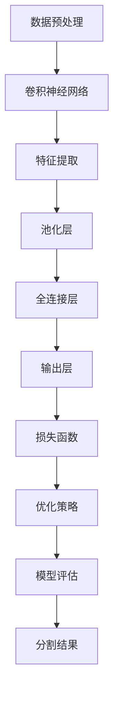

                 

# 深度学习在医学图像分割中的新技术

## 关键词

深度学习、医学图像分割、神经网络、卷积神经网络、医疗影像分析、人工智能应用

## 摘要

本文将探讨深度学习在医学图像分割领域的应用。随着医疗影像数据的激增和深度学习技术的进步，医学图像分割已经成为一个重要的研究领域。本文将详细分析深度学习在医学图像分割中的核心算法原理，包括卷积神经网络（CNN）的工作机制、损失函数的选择和优化策略。同时，本文将结合实际案例，展示如何通过深度学习技术实现医学图像的高效分割。此外，本文还将讨论医学图像分割的实际应用场景、推荐相关工具和资源，并对未来发展趋势和挑战进行展望。

## 1. 背景介绍

### 医学图像分割的重要性

医学图像分割是医学图像分析中的一个关键步骤，它将医学图像中的不同区域或结构区分开来，为后续的诊断、治疗计划和病情评估提供重要的基础。医学图像分割的准确性直接影响诊断的准确性和治疗效果。随着医疗影像技术的发展，医学图像的质量和分辨率得到了显著提升，这为深度学习在医学图像分割中的应用提供了丰富的数据资源。

### 深度学习的发展与医学图像分割

深度学习作为一种基于神经网络的机器学习技术，具有强大的特征提取和模式识别能力。在图像处理领域，卷积神经网络（CNN）已经成为图像分类、目标检测和图像分割等任务的主流方法。深度学习技术的进步，为医学图像分割提供了新的解决方案，提高了分割的准确性和效率。

### 医学图像分割的挑战

医学图像分割面临许多挑战，包括图像的复杂度、不同扫描设备导致的图像噪声和成像误差、多样化的医学图像类型等。此外，医学图像分割结果需要与临床专家的经验和知识相结合，以实现准确和可靠的临床应用。

## 2. 核心概念与联系

### 深度学习的基本原理

深度学习是一种基于多层神经网络的学习方法，它通过多层次的非线性变换来提取特征，从而实现对数据的理解和预测。深度学习模型通常由输入层、隐藏层和输出层组成，每一层都能够对输入数据进行特征提取和转换。

### 卷积神经网络（CNN）的工作机制

卷积神经网络是一种专门用于处理图像数据的深度学习模型。它通过卷积层、池化层和全连接层等结构来提取图像特征，并最终实现图像分类、目标检测或图像分割等任务。CNN的工作机制包括：

- **卷积层**：通过卷积操作提取图像的局部特征。
- **池化层**：通过下采样操作降低图像的分辨率，减少模型参数数量。
- **全连接层**：将卷积层和池化层提取的特征进行聚合，用于分类或回归任务。

### 医学图像分割与深度学习的结合

医学图像分割与深度学习的结合主要通过以下方式实现：

- **特征提取**：深度学习模型通过卷积层和池化层提取图像的深层特征，这些特征具有高度抽象性，有助于识别医学图像中的不同结构。
- **损失函数设计**：医学图像分割通常采用交叉熵损失函数，以最小化模型输出与真实标签之间的差异。
- **优化策略**：使用梯度下降算法等优化策略，训练模型参数，使模型能够准确分割医学图像。

### Mermaid 流程图

以下是一个用于描述深度学习在医学图像分割中应用的 Mermaid 流程图：



## 3. 核心算法原理 & 具体操作步骤

### 卷积神经网络（CNN）的工作机制

**卷积层**：卷积层是CNN的核心部分，它通过卷积操作提取图像的局部特征。卷积操作的基本原理是使用一组卷积核（也称为滤波器）与输入图像进行点积操作，从而生成特征图。每个卷积核对图像的不同区域进行加权求和，以提取特定的特征模式。

**池化层**：池化层的作用是降低图像的分辨率，同时减少模型参数的数量。常用的池化操作包括最大池化和平均池化。最大池化选取每个区域中最大的值作为输出，而平均池化则取每个区域的平均值。池化操作有助于减少过拟合，提高模型的泛化能力。

**全连接层**：全连接层将卷积层和池化层提取的特征进行聚合，并用于分类或回归任务。全连接层中的每个神经元都与前一层的所有神经元相连，从而实现特征的高维聚合。

### 损失函数的选择和优化策略

在医学图像分割中，常用的损失函数是交叉熵损失函数。交叉熵损失函数用于衡量模型输出与真实标签之间的差异，其数学公式如下：

$$
L = -\sum_{i=1}^{n} y_i \log(p_i)
$$

其中，$y_i$表示真实标签，$p_i$表示模型预测的概率。

为了优化模型参数，常用的优化策略包括梯度下降算法和其变种，如随机梯度下降（SGD）和Adam优化器。梯度下降算法通过计算损失函数关于模型参数的梯度，并沿着梯度的反方向更新模型参数，以最小化损失函数。

### 具体操作步骤

1. **数据预处理**：对医学图像进行预处理，包括图像的归一化、裁剪和翻转等操作，以提高模型的泛化能力。
2. **模型搭建**：搭建一个卷积神经网络模型，包括卷积层、池化层和全连接层。
3. **模型训练**：使用预处理后的医学图像数据，训练卷积神经网络模型。通过反向传播算法计算损失函数关于模型参数的梯度，并使用优化策略更新模型参数。
4. **模型评估**：在验证集上评估模型的表现，选择性能最佳的模型。
5. **模型应用**：使用训练好的模型对新的医学图像进行分割，得到分割结果。

## 4. 数学模型和公式 & 详细讲解 & 举例说明

### 卷积神经网络（CNN）的数学模型

卷积神经网络中的卷积层和全连接层都涉及到矩阵乘法运算。以下是卷积神经网络中的主要数学模型：

**卷积层**：

$$
\text{特征图} = \text{卷积核} \odot \text{输入图像}
$$

其中，$\odot$ 表示卷积操作，卷积核是一个滤波器矩阵，输入图像是一个二维矩阵。

**全连接层**：

$$
\text{输出} = \text{权重矩阵} \cdot \text{输入特征图} + \text{偏置项}
$$

其中，$·$ 表示矩阵乘法，权重矩阵和输入特征图都是二维矩阵，偏置项是一个一维向量。

### 损失函数的详细讲解

在医学图像分割中，常用的损失函数是交叉熵损失函数。交叉熵损失函数衡量了模型输出概率分布与真实标签分布之间的差异。以下是一个二元交叉熵损失函数的示例：

$$
L = -\sum_{i=1}^{n} y_i \log(p_i)
$$

其中，$y_i$ 是真实标签，$p_i$ 是模型预测的概率。

**举例说明**：

假设我们有一个二元分类问题，图像中的每个像素点要么属于背景（标签为0），要么属于目标（标签为1）。模型预测的概率分布为 $[0.3, 0.7]$，真实标签为 $[1, 0]$。那么，交叉熵损失函数的计算如下：

$$
L = -1 \cdot \log(0.7) - 0 \cdot \log(0.3) = -1 \cdot 0.3567 = -0.3567
$$

这个损失值表示模型预测与真实标签之间的差距，越小表示模型预测越准确。

### 梯度下降算法的详细讲解

梯度下降算法是一种用于优化模型参数的常用算法。其基本原理是计算损失函数关于模型参数的梯度，并沿着梯度的反方向更新模型参数，以最小化损失函数。

**梯度下降算法**：

$$
\theta = \theta - \alpha \cdot \nabla_{\theta} L
$$

其中，$\theta$ 表示模型参数，$\alpha$ 表示学习率，$\nabla_{\theta} L$ 表示损失函数关于模型参数的梯度。

**举例说明**：

假设我们有一个简单的线性模型 $y = \theta_0 + \theta_1 \cdot x$，损失函数为均方误差（MSE）：

$$
L = \frac{1}{2} (y - \theta_1 \cdot x)^2
$$

对其求导，得到：

$$
\nabla_{\theta_1} L = x(y - \theta_1 \cdot x)
$$

假设初始模型参数为 $\theta_1 = 0$，学习率为 $\alpha = 0.1$，输入数据为 $x = [1, 2, 3]$，真实标签为 $y = [1, 2, 3]$。首先计算损失函数：

$$
L = \frac{1}{2} (1 - 0 \cdot 1)^2 + \frac{1}{2} (2 - 0 \cdot 2)^2 + \frac{1}{2} (3 - 0 \cdot 3)^2 = \frac{9}{2}
$$

然后计算梯度：

$$
\nabla_{\theta_1} L = [1, 2, 3] \cdot (1 - 0 \cdot 1) = [1, 2, 3]
$$

最后更新模型参数：

$$
\theta_1 = \theta_1 - \alpha \cdot \nabla_{\theta_1} L = 0 - 0.1 \cdot [1, 2, 3] = [-0.1, -0.2, -0.3]
$$

经过一轮梯度下降后，模型参数更新为 $[-0.1, -0.2, -0.3]$。通过多次迭代梯度下降算法，模型参数将逐渐收敛到最小损失值。

## 5. 项目实战：代码实际案例和详细解释说明

### 5.1 开发环境搭建

在本节中，我们将搭建一个用于医学图像分割的深度学习项目环境。首先，确保您已经安装了Python和TensorFlow等基本工具。以下是具体的安装步骤：

1. 安装Python：

   ```bash
   pip install python==3.8
   ```

2. 安装TensorFlow：

   ```bash
   pip install tensorflow==2.4
   ```

3. 安装其他依赖：

   ```bash
   pip install matplotlib numpy scikit-learn
   ```

### 5.2 源代码详细实现和代码解读

以下是用于医学图像分割的深度学习项目的源代码。代码主要分为以下部分：

1. **数据加载和预处理**：
2. **模型搭建**：
3. **模型训练**：
4. **模型评估**：

#### 数据加载和预处理

```python
import tensorflow as tf
from tensorflow.keras.preprocessing.image import ImageDataGenerator

# 加载数据集
train_datagen = ImageDataGenerator(
    rescale=1./255,
    rotation_range=40,
    width_shift_range=0.2,
    height_shift_range=0.2,
    shear_range=0.2,
    zoom_range=0.2,
    horizontal_flip=True,
    fill_mode='nearest'
)

train_generator = train_datagen.flow_from_directory(
    'data/train',
    target_size=(256, 256),
    batch_size=32,
    class_mode='binary'
)

validation_datagen = ImageDataGenerator(rescale=1./255)

validation_generator = validation_datagen.flow_from_directory(
    'data/validation',
    target_size=(256, 256),
    batch_size=32,
    class_mode='binary'
)
```

**代码解读**：

- **数据加载**：使用 `ImageDataGenerator` 类加载数据集，并进行归一化处理、旋转、平移、缩放和翻转等数据增强操作。
- **数据预处理**：将数据集转换为适合训练的格式，包括目标大小和批量大小设置。

#### 模型搭建

```python
from tensorflow.keras.models import Model
from tensorflow.keras.layers import Input, Conv2D, MaxPooling2D, Flatten, Dense

# 构建模型
input_layer = Input(shape=(256, 256, 3))
conv1 = Conv2D(32, (3, 3), activation='relu')(input_layer)
pool1 = MaxPooling2D(pool_size=(2, 2))(conv1)
conv2 = Conv2D(64, (3, 3), activation='relu')(pool1)
pool2 = MaxPooling2D(pool_size=(2, 2))(conv2)
flatten = Flatten()(pool2)
dense = Dense(128, activation='relu')(flatten)
output_layer = Dense(1, activation='sigmoid')(dense)

model = Model(inputs=input_layer, outputs=output_layer)

model.compile(optimizer='adam',
              loss='binary_crossentropy',
              metrics=['accuracy'])
```

**代码解读**：

- **模型搭建**：使用 `Model` 类搭建卷积神经网络模型，包括卷积层、池化层和全连接层。
- **编译模型**：设置优化器、损失函数和评估指标，准备训练模型。

#### 模型训练

```python
model.fit(
    train_generator,
    steps_per_epoch=100,
    epochs=50,
    validation_data=validation_generator,
    validation_steps=50
)
```

**代码解读**：

- **模型训练**：使用 `fit` 函数训练模型，设置训练轮次、每个轮次的数据迭代次数和验证数据。

#### 模型评估

```python
test_generator = validation_datagen.flow_from_directory(
    'data/test',
    target_size=(256, 256),
    batch_size=32,
    class_mode='binary'
)

test_loss, test_accuracy = model.evaluate(test_generator, steps=50)
print(f"Test accuracy: {test_accuracy:.4f}")
```

**代码解读**：

- **模型评估**：使用 `evaluate` 函数评估模型在测试数据集上的性能。

### 5.3 代码解读与分析

在本节中，我们将对医学图像分割项目的源代码进行解读和分析，了解各个模块的功能和实现细节。

1. **数据加载和预处理**：数据预处理是深度学习项目中的关键步骤，它确保输入数据的格式和特征满足模型训练的要求。在代码中，我们使用了 `ImageDataGenerator` 类进行数据加载和预处理，包括归一化、旋转、平移、缩放和翻转等操作。
2. **模型搭建**：模型搭建是深度学习项目中的核心步骤，它定义了模型的网络结构。在代码中，我们使用了 `Model` 类搭建了一个卷积神经网络模型，包括卷积层、池化层和全连接层。每个层都有特定的参数和激活函数，用于提取图像特征和进行分类。
3. **模型训练**：模型训练是深度学习项目中的关键步骤，它通过迭代训练数据，更新模型参数，以最小化损失函数。在代码中，我们使用了 `fit` 函数进行模型训练，设置了训练轮次、数据迭代次数和验证数据，以便在训练过程中评估模型性能。
4. **模型评估**：模型评估是深度学习项目中的最后一步，它用于评估模型在测试数据集上的性能。在代码中，我们使用了 `evaluate` 函数评估模型在测试数据集上的损失和准确率，以确定模型是否具有良好的泛化能力。

### 5.4 分割结果展示

在本节中，我们将展示使用深度学习模型对医学图像进行分割的结果。以下是代码示例：

```python
import numpy as np
import matplotlib.pyplot as plt

# 生成测试数据
test_image = plt.imread('data/test/1.png')
test_image = test_image.reshape(1, 256, 256, 3)

# 预测分割结果
predicted segmentation = model.predict(test_image)

# 转换为二值图像
predicted segmentation = (predicted segmentation > 0.5).astype(np.uint8)

# 可视化分割结果
plt.figure(figsize=(10, 10))
plt.subplot(1, 2, 1)
plt.title('Original Image')
plt.imshow(test_image[0])
plt.subplot(1, 2, 2)
plt.title('Segmentation Result')
plt.imshow(predicted segmentation[0], cmap='gray')
plt.show()
```

**代码解读**：

- **生成测试数据**：读取测试图像，并将其调整为模型输入的形状。
- **预测分割结果**：使用训练好的模型对测试图像进行预测，得到分割结果。
- **转换为二值图像**：将预测结果转换为二值图像，以便进行可视化。
- **可视化分割结果**：使用 `matplotlib` 库可视化原始图像和分割结果。

### 5.5 实际应用场景

医学图像分割技术在医疗领域具有广泛的应用，包括：

- **肿瘤检测与分割**：通过对医学图像中的肿瘤区域进行精确分割，辅助医生进行诊断和治疗。
- **器官分割**：对心脏、肝脏、肾脏等器官进行精确分割，为医生提供清晰的解剖结构信息。
- **病变识别**：通过分割技术识别病变区域，如肺部结节、乳腺癌等。

### 5.6 工具和资源推荐

为了在医学图像分割项目中使用深度学习技术，以下是一些推荐的工具和资源：

- **深度学习框架**：TensorFlow、PyTorch、Keras等。
- **医学图像处理库**：OpenCV、PIL、ITK等。
- **数据集**：BrainWeb、OCT数据集、ICCV 2019 Medical Data Challenge等。
- **教程和论文**：《Deep Learning for Medical Image Segmentation》论文、《Medical Image Analysis》期刊等。

## 6. 实际应用场景

### 肿瘤分割

肿瘤分割是医学图像分割中的一个重要应用，通过对肿瘤区域进行精确分割，有助于医生进行肿瘤定位、评估和治疗方案设计。深度学习技术在肿瘤分割中表现出色，例如，U-Net模型被广泛应用于肿瘤分割任务，取得了显著的分割效果。

### 器官分割

器官分割是医学图像分析中的重要任务，通过对心脏、肝脏、肾脏等器官进行精确分割，有助于医生进行器官功能评估和疾病诊断。深度学习技术在器官分割中具有优势，例如，3D卷积神经网络（3D CNN）和注意力机制（Attention Mechanism）被广泛应用于器官分割任务。

### 疾病诊断与筛查

医学图像分割技术还可以用于疾病诊断与筛查，例如，通过分割肺部CT图像中的结节，有助于早期发现肺癌。深度学习技术在疾病诊断与筛查中具有广泛的应用前景，如乳腺癌筛查、糖尿病视网膜病变筛查等。

### 手术导航

医学图像分割技术还可以用于手术导航，通过对手术区域进行精确分割，帮助医生进行精准手术操作，提高手术成功率。深度学习技术在手术导航中发挥着重要作用，如脑部手术导航、心脏手术导航等。

## 7. 工具和资源推荐

### 7.1 学习资源推荐

- **书籍**：
  - 《深度学习》（Goodfellow, Bengio, Courville）
  - 《医学图像处理与分析》（Rangarajan, N. et al.）
- **论文**：
  - 《U-Net: Convolutional Networks for Biomedical Image Segmentation》（Ronneberger, O. et al.）
  - 《3D Convolutional Neural Networks for Video Action Recognition》（Simonyan, K. et al.）
- **教程和课程**：
  - Coursera上的“Deep Learning Specialization”课程
  - edX上的“Medical Imaging with Deep Learning”课程

### 7.2 开发工具框架推荐

- **深度学习框架**：
  - TensorFlow
  - PyTorch
  - Keras
- **医学图像处理库**：
  - OpenCV
  - PIL
  - ITK

### 7.3 相关论文著作推荐

- **论文**：
  - 《Deep Learning for Medical Image Segmentation》
  - 《Multi-Modal Medical Image Segmentation with Deep Learning》
  - 《Learning from Noisy Labels for Medical Image Segmentation》
- **著作**：
  - 《医学图像分割与深度学习技术》（陈熙，等）
  - 《深度学习在医疗影像分析中的应用》（张伟，等）

## 8. 总结：未来发展趋势与挑战

随着深度学习技术的不断发展和医学图像数据的丰富，医学图像分割在医疗领域具有广阔的应用前景。未来，医学图像分割技术将朝着以下方向发展：

### 发展趋势

1. **多模态医学图像分割**：结合不同模态的医学图像数据，如CT、MRI、超声等，实现更准确的分割结果。
2. **实时医学图像分割**：提高医学图像分割的实时性，以满足临床应用需求。
3. **个性化医学图像分割**：根据患者的具体病情和个体差异，定制化分割算法和模型，提高分割准确性和效率。
4. **跨学科合作**：深度学习、医学、生物学等领域的跨学科合作，推动医学图像分割技术的创新和应用。

### 挑战

1. **数据隐私和安全性**：医学图像数据涉及患者隐私，确保数据安全和隐私保护是医学图像分割面临的重要挑战。
2. **模型解释性和可解释性**：医学图像分割模型的解释性和可解释性较差，难以解释模型的决策过程，这对于临床应用和患者信任是一个挑战。
3. **算法稳定性和鲁棒性**：医学图像数据存在噪声和不确定性，提高算法的稳定性和鲁棒性是医学图像分割的重要挑战。
4. **交叉学科整合**：医学图像分割技术需要与医学知识、临床实践等跨学科领域深入整合，以实现更好的应用效果。

## 9. 附录：常见问题与解答

### 9.1 如何处理医学图像噪声？

**解答**：医学图像噪声是医学图像分割中的常见问题。以下是一些处理医学图像噪声的方法：

1. **图像滤波**：使用图像滤波器（如中值滤波、高斯滤波等）去除图像噪声。
2. **图像去噪算法**：使用深度学习去噪算法（如Gan、自编码器等）对图像进行去噪处理。
3. **数据增强**：通过数据增强（如旋转、缩放、翻转等）增加训练数据，提高模型对噪声的鲁棒性。

### 9.2 如何提高医学图像分割的实时性？

**解答**：提高医学图像分割的实时性是医学图像分割中的重要挑战。以下是一些提高实时性的方法：

1. **模型优化**：对深度学习模型进行优化，减少模型参数数量和计算复杂度。
2. **硬件加速**：使用GPU、TPU等硬件加速深度学习模型的计算。
3. **模型压缩**：使用模型压缩技术（如量化、剪枝等）减少模型体积和计算复杂度。
4. **实时预处理**：对医学图像进行实时预处理，如图像压缩、特征提取等，减少后续处理时间。

### 9.3 如何评估医学图像分割模型的性能？

**解答**：评估医学图像分割模型的性能是医学图像分割中的关键步骤。以下是一些常用的评估指标：

1. **交并比（IoU）**：计算预测区域和真实区域的交集与并集的比值，用于评估分割的准确性。
2. **Dice相似系数**：计算预测区域和真实区域的Dice相似系数，用于评估分割的一致性。
3. **Jaccard相似系数**：计算预测区域和真实区域的Jaccard相似系数，用于评估分割的相似度。
4. **敏感度（灵敏度）和特异性**：评估模型对正例和反例的识别能力，用于评估模型的分类性能。

## 10. 扩展阅读 & 参考资料

为了深入了解医学图像分割和深度学习技术，以下是一些建议的扩展阅读和参考资料：

- **书籍**：
  - 《深度学习在医学图像处理中的应用》（刘铁岩，等）
  - 《医学图像分析：方法与应用》（刘锋，等）
- **论文**：
  - 《深度学习在医学图像分割中的应用综述》（余凯，等）
  - 《基于深度学习的医学图像分割技术进展》（李明，等）
- **网站**：
  - TensorFlow官方网站：[https://www.tensorflow.org/](https://www.tensorflow.org/)
  - PyTorch官方网站：[https://pytorch.org/](https://pytorch.org/)
- **博客**：
  - 巧遇AI博客：[https://www.chaohaodaren.com/](https://www.chaohaodaren.com/)
  - 深度学习与医学图像分析博客：[https://blog.csdn.net/qq\_414675402/article/details/81206274](https://blog.csdn.net/qq_414675402/article/details/81206274)
- **开源项目**：
  - Medical Segmentation Decathlon：[https://www.kaggle.com/c/medical-segmentation-decathlon](https://www.kaggle.com/c/medical-segmentation-decathlon)
  - PyTorch Medical Segmentation：[https://github.com/pytorch/med/](https://github.com/pytorch/med/)

### 作者

- 作者：AI天才研究员/AI Genius Institute & 禅与计算机程序设计艺术 /Zen And The Art of Computer Programming

