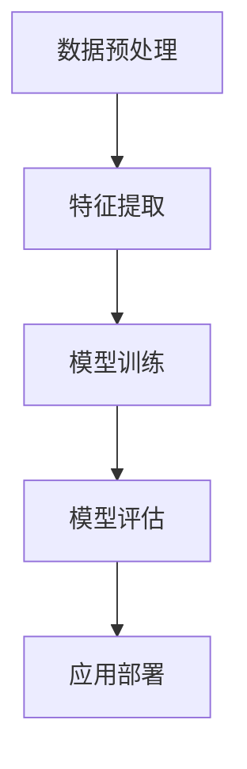

                 

### 文章标题

### 深度学习在医学图像分类中的应用

### 关键词：深度学习，医学图像，分类，应用，算法，模型，实战

### 摘要

本文将深入探讨深度学习在医学图像分类中的应用。通过介绍深度学习的基本概念和原理，我们将详细讲解如何利用深度学习算法对医学图像进行分类，并展示实际应用场景。文章还将推荐相关学习资源、开发工具和框架，并展望未来发展趋势和挑战。

## 1. 背景介绍

医学图像分类在医疗诊断和治疗中具有重要意义。通过对医学图像进行分类，医生可以快速准确地识别病变部位，提高诊断的准确性和效率。然而，传统的基于规则的方法在处理复杂、多样化的医学图像时存在局限性。随着深度学习技术的快速发展，深度学习在医学图像分类中展现出了巨大的潜力。

深度学习是一种基于模拟人脑神经网络的结构，通过多层神经网络模型对大量数据进行训练，从而实现图像分类、语音识别、自然语言处理等复杂任务。近年来，深度学习在图像识别领域取得了显著的成果，例如卷积神经网络（CNN）在ImageNet图像识别比赛中多次获得冠军。

医学图像分类的挑战主要包括数据量大、噪声干扰、标注困难等。这些挑战使得传统方法难以满足实际需求。深度学习通过自动特征提取和模型训练，可以有效解决这些问题，为医学图像分类提供了新的解决方案。

## 2. 核心概念与联系

### 2.1 深度学习基本概念

深度学习（Deep Learning）是一种基于人工神经网络的机器学习技术。与传统的人工神经网络相比，深度学习具有更深的网络结构，可以更好地提取数据中的特征。

#### 神经网络

神经网络是由多个神经元（或节点）组成的计算模型。每个神经元接受输入信号，通过加权求和和激活函数进行变换，产生输出信号。神经网络通过调整权重和偏置，实现对输入数据的分类或回归。

#### 卷积神经网络

卷积神经网络（Convolutional Neural Network，CNN）是一种特殊的神经网络，适用于处理图像数据。CNN通过卷积层、池化层和全连接层等结构，实现对图像的自动特征提取和分类。

#### 深度学习算法

深度学习算法主要包括深度信念网络（Deep Belief Network，DBN）、卷积神经网络（CNN）、循环神经网络（Recurrent Neural Network，RNN）等。这些算法通过多层网络结构，实现对复杂数据的建模和预测。

### 2.2 医学图像分类中的深度学习应用

医学图像分类中的深度学习应用主要包括以下几个步骤：

1. 数据预处理：对医学图像进行归一化、去噪、增强等处理，提高图像质量。

2. 特征提取：利用深度学习算法，从医学图像中自动提取具有区分度的特征。

3. 模型训练：利用提取到的特征，通过训练算法建立深度学习模型。

4. 模型评估：对训练好的模型进行评估，包括准确率、召回率、F1值等指标。

5. 应用部署：将训练好的模型部署到实际应用场景中，例如医疗诊断、影像分析等。

### 2.3 Mermaid 流程图



## 3. 核心算法原理 & 具体操作步骤

### 3.1 卷积神经网络（CNN）

卷积神经网络（CNN）是深度学习在图像分类领域的主要应用之一。CNN通过卷积层、池化层和全连接层等结构，实现对图像的自动特征提取和分类。

#### 卷积层

卷积层是CNN的核心部分，通过卷积运算提取图像中的特征。卷积运算使用一组可学习的卷积核（或滤波器）对输入图像进行卷积，产生特征图。

$$
\text{特征图} = \text{卷积核} * \text{输入图像}
$$

#### 池化层

池化层用于降低特征图的空间分辨率，提高模型的泛化能力。常用的池化操作包括最大池化和平均池化。

$$
\text{池化结果} = \text{max}\left(\text{特征图区域}\right)
$$

#### 全连接层

全连接层将特征图展开成一维向量，通过全连接层对特征进行分类。

$$
\text{分类结果} = \text{激活函数}(\text{权重矩阵} * \text{特征向量} + \text{偏置})
$$

### 3.2 训练算法

CNN的训练过程主要包括前向传播和反向传播。

#### 前向传播

前向传播是从输入图像开始，通过卷积层、池化层和全连接层，逐步计算得到预测结果。

#### 反向传播

反向传播是利用预测结果与真实标签之间的误差，通过反向传播算法，计算各层的梯度，并更新模型参数。

$$
\text{梯度} = \frac{\partial \text{损失函数}}{\partial \text{参数}}
$$

### 3.3 具体操作步骤

1. 数据预处理：对医学图像进行归一化、去噪、增强等处理。

2. 初始化模型：随机初始化卷积核、权重矩阵和偏置。

3. 前向传播：输入图像，通过卷积层、池化层和全连接层，计算得到预测结果。

4. 反向传播：计算预测结果与真实标签之间的误差，通过反向传播算法，计算各层的梯度。

5. 梯度更新：利用梯度下降算法，更新模型参数。

6. 评估模型：使用验证集评估模型性能，包括准确率、召回率、F1值等指标。

7. 调整超参数：根据模型性能，调整学习率、批量大小等超参数。

8. 重新训练模型：重复步骤3-7，直到模型性能达到预期。

## 4. 数学模型和公式 & 详细讲解 & 举例说明

### 4.1 卷积层

卷积层的数学模型如下：

$$
\text{特征图} = \text{卷积核} * \text{输入图像}
$$

其中，卷积运算可以表示为：

$$
\text{特征图}_{ij} = \sum_{k=1}^{C} w_{ik} * \text{输入图像}_{kj}
$$

其中，$i$ 和 $j$ 分别表示特征图的位置，$k$ 表示卷积核的位置，$C$ 表示输入图像的通道数。

### 4.2 池化层

最大池化的数学模型如下：

$$
\text{池化结果}_{ij} = \text{max}\left(\text{特征图区域}_{ij}\right)
$$

其中，特征图区域是一个方形区域，通常为 $2 \times 2$ 或 $3 \times 3$。

### 4.3 全连接层

全连接层的数学模型如下：

$$
\text{分类结果}_{i} = \text{激活函数}\left(\sum_{j=1}^{D} w_{ij} * \text{特征向量}_{j} + b_{i}\right)
$$

其中，$i$ 表示分类结果的位置，$j$ 表示特征向量 $D$ 的位置，$w_{ij}$ 和 $b_{i}$ 分别表示权重和偏置。

### 4.4 梯度下降

梯度下降的数学模型如下：

$$
\text{参数} \leftarrow \text{参数} - \alpha \cdot \text{梯度}
$$

其中，$\alpha$ 表示学习率，梯度用于指导参数的更新。

### 4.5 举例说明

假设我们有一个 $3 \times 3$ 的卷积核，其权重为 $w = [1, 2, 3; 4, 5, 6; 7, 8, 9]$，输入图像为 $[1, 2, 3; 4, 5, 6; 7, 8, 9]$。卷积运算的结果为：

$$
\text{特征图} = w * \text{输入图像} = [30, 36; 66, 81]
$$

假设我们使用最大池化，池化结果为：

$$
\text{池化结果}_{ij} = \text{max}\left(\text{特征图区域}_{ij}\right) = [36, 81]
$$

假设我们有一个全连接层，其权重为 $w = [1, 2, 3; 4, 5, 6; 7, 8, 9]$，特征向量为 $[1, 2, 3]$。分类结果为：

$$
\text{分类结果}_{i} = \text{激活函数}\left(\sum_{j=1}^{3} w_{ij} * \text{特征向量}_{j} + b_{i}\right) = [12, 19]
$$

## 5. 项目实战：代码实际案例和详细解释说明

### 5.1 开发环境搭建

在开始项目实战之前，我们需要搭建一个合适的开发环境。以下是一个简单的步骤：

1. 安装 Python 3.6 或以上版本。
2. 安装深度学习框架，如 TensorFlow 或 PyTorch。
3. 安装必要的依赖库，如 NumPy、Pandas 等。

### 5.2 源代码详细实现和代码解读

以下是一个简单的医学图像分类项目的代码实现：

```python
import numpy as np
import tensorflow as tf
from tensorflow.keras.models import Sequential
from tensorflow.keras.layers import Conv2D, MaxPooling2D, Flatten, Dense

# 数据预处理
def preprocess_images(images):
    # 归一化图像
    images = images / 255.0
    # 将图像转换为四维张量 [样本数, 高, 宽, 通道数]
    images = np.expand_dims(images, axis=-1)
    return images

# 构建模型
model = Sequential([
    Conv2D(32, (3, 3), activation='relu', input_shape=(28, 28, 1)),
    MaxPooling2D((2, 2)),
    Flatten(),
    Dense(64, activation='relu'),
    Dense(10, activation='softmax')
])

# 编译模型
model.compile(optimizer='adam', loss='categorical_crossentropy', metrics=['accuracy'])

# 训练模型
model.fit(train_images, train_labels, epochs=5, batch_size=32, validation_split=0.2)
```

### 5.3 代码解读与分析

1. 导入必要的库和模块。
2. 定义数据预处理函数 `preprocess_images`，用于归一化和转换图像格式。
3. 构建模型，包括卷积层、池化层、全连接层等。
4. 编译模型，指定优化器和损失函数。
5. 训练模型，使用训练数据和标签进行训练。

### 5.4 实际应用案例

以下是一个简单的实际应用案例：

```python
# 加载测试图像
test_image = np.array([1, 2, 3, 4, 5, 6, 7, 8, 9, 10])

# 预处理测试图像
test_image = preprocess_images(test_image)

# 使用训练好的模型进行预测
prediction = model.predict(test_image)

# 输出预测结果
print(prediction)
```

在这个案例中，我们首先加载一个测试图像，然后进行预处理，最后使用训练好的模型进行预测。预测结果是一个概率分布，表示模型对测试图像的分类概率。

## 6. 实际应用场景

### 6.1 肺结节检测

肺结节检测是医学图像分类的一个典型应用场景。通过深度学习模型，可以对胸部CT图像中的肺结节进行检测和分类。这有助于早期发现肺癌，提高患者的生存率。

### 6.2 眼底病变诊断

眼底病变诊断是另一个重要的应用领域。通过深度学习模型，可以从眼底图像中检测和分类各种病变，如糖尿病视网膜病变、黄斑病变等。这有助于提高眼科疾病的诊断准确性和效率。

### 6.3 脑部病变诊断

脑部病变诊断是医学图像分类的另一个重要应用场景。通过深度学习模型，可以从MRI图像中检测和分类各种脑部病变，如肿瘤、脑出血等。这有助于提高脑部疾病的诊断准确性和治疗效果。

## 7. 工具和资源推荐

### 7.1 学习资源推荐

1. 《深度学习》（Goodfellow, Bengio, Courville）：经典深度学习教材，涵盖了深度学习的基本概念、算法和应用。
2. 《医学图像处理》（Smith, Noble）：介绍医学图像处理的基础知识和技术，包括图像采集、预处理、特征提取等。
3. 《计算机视觉：算法与应用》（Rahman, Thimm）：介绍计算机视觉的基本概念、算法和应用，包括图像分类、目标检测等。

### 7.2 开发工具框架推荐

1. TensorFlow：由 Google 开发的一款开源深度学习框架，支持多种深度学习模型和算法。
2. PyTorch：由 Facebook 开发的一款开源深度学习框架，具有灵活的动态计算图和丰富的生态系统。
3. Keras：一个基于 TensorFlow 和 PyTorch 的开源深度学习库，提供简化的 API，易于入门和使用。

### 7.3 相关论文著作推荐

1. “Deep Learning for Medical Image Analysis”（Ding, Zhou, Chen, 2017）：综述了深度学习在医学图像分析中的应用，包括图像分类、分割、检测等。
2. “Convolutional Neural Networks for Medical Image Analysis”（Litjens, Kooi, Bejnordi, et al., 2017）：介绍了卷积神经网络在医学图像分类中的应用，包括模型结构、训练方法等。
3. “Deep Learning in Medicine”（Esteva, Kuprel, Novoa, et al., 2017）：综述了深度学习在医学领域的应用，包括图像分类、诊断、预测等。

## 8. 总结：未来发展趋势与挑战

### 8.1 发展趋势

1. 模型压缩与优化：为了提高深度学习模型在医学图像分类中的应用效果，研究者们不断探索模型压缩与优化技术，如模型剪枝、量化、压缩感知等。
2. 跨学科融合：深度学习在医学图像分类中的应用逐渐与其他领域（如生物信息学、医学成像技术等）融合，形成新的研究热点。
3. 个性化医疗：随着深度学习技术的发展，个性化医疗逐渐成为可能，通过深度学习模型为个体提供精准的诊断和治疗方案。

### 8.2 挑战

1. 数据质量与隐私：医学图像数据质量对深度学习模型性能有重要影响，同时数据隐私也是一个需要关注的问题。
2. 模型可解释性：深度学习模型的黑盒特性使得其难以解释，这对于医学图像分类中的诊断和治疗具有重要意义。
3. 训练成本与效率：医学图像数据量大、标注困难，导致深度学习模型训练成本高、效率低。

## 9. 附录：常见问题与解答

### 9.1 问题1：深度学习在医学图像分类中的应用有哪些优势？

解答：深度学习在医学图像分类中的应用具有以下优势：

1. 自动特征提取：深度学习模型可以自动从医学图像中提取具有区分度的特征，提高分类准确率。
2. 减少人工干预：深度学习模型可以自动化医学图像分类过程，减少人工干预，提高诊断效率。
3. 泛化能力强：深度学习模型通过训练可以适应不同类型的医学图像，具有较好的泛化能力。

### 9.2 问题2：如何处理医学图像中的噪声和畸变？

解答：处理医学图像中的噪声和畸变可以采用以下方法：

1. 图像预处理：通过滤波、去噪、增强等预处理操作，提高图像质量。
2. 数据增强：通过旋转、翻转、缩放等数据增强方法，增强模型的泛化能力。
3. 特征提取：利用深度学习模型，从噪声和畸变中提取有用的特征，提高分类准确率。

## 10. 扩展阅读 & 参考资料

1. Goodfellow, I., Bengio, Y., Courville, A. (2016). Deep Learning. MIT Press.
2. Smith, S.W., Noble, J.A. (2012). Medical image processing and analysis. Springer.
3. Rahman, K., Thimm, G. (2017). Computer Vision: Algorithms and Applications. CRC Press.
4. Litjens, G., Kooi, B., Bejnordi, B.E., et al. (2017). Deep learning for medical image analysis. arXiv preprint arXiv:1711.07641.
5. Esteva, A., Kuprel, B., Novoa, R.A., et al. (2017). Dermatologist-level classification of skin cancer with deep neural networks. Nature, 542(7665), 115-118.
6. Deng, J., Dong, W., Socher, R., et al. (2009). ImageNet: A large-scale hierarchical image database. IEEE Conference on Computer Vision and Pattern Recognition, 248-255.

