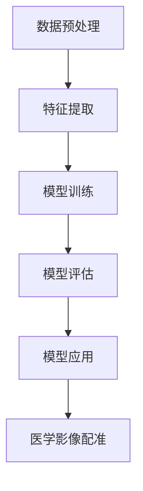

                 

# 深度学习在医学影像配准中的应用

## 关键词：深度学习，医学影像，配准，图像处理，人工智能

### 摘要

随着人工智能技术的快速发展，深度学习在医学影像处理领域中的应用越来越广泛。医学影像配准作为一种重要的技术手段，能够将不同时间、不同角度、不同模态的医学影像数据进行对齐和融合，从而为临床诊断、治疗计划制定和疗效评估提供重要支持。本文将探讨深度学习在医学影像配准中的应用，介绍其核心概念、算法原理、数学模型以及实际应用场景，并推荐相关的学习资源、开发工具和论文著作。同时，本文还将总结当前技术的发展趋势和面临的挑战，为未来研究提供方向。

## 1. 背景介绍

医学影像配准是指将两幅或多幅医学影像图像进行对齐和融合，以便于分析、诊断和治疗。医学影像数据通常来自不同的成像设备，如CT、MRI、超声等，具有不同的成像参数和分辨率。由于人体器官和组织的运动、成像角度的变化以及设备差异等因素，医学影像之间存在一定的形变和位移。因此，医学影像配准的目的是通过算法找到图像间的对应关系，实现图像的精准对齐。

医学影像配准在临床医学中具有重要的应用价值。首先，通过配准可以融合不同模态的医学影像，提高影像诊断的准确性和可靠性。例如，将MRI与CT配准，可以结合两种影像的优势，更好地显示肿瘤的位置、大小和形态。其次，医学影像配准为放射治疗计划的制定提供重要依据。通过对患者不同时间点的影像进行配准，可以准确地确定肿瘤和正常组织的位置关系，为放射治疗提供精确的目标定位。此外，医学影像配准在手术导航、器官功能研究、疾病预测等方面也具有广泛的应用前景。

传统的医学影像配准方法主要基于特征匹配、图像配准和变换模型等。然而，这些方法在处理复杂的医学影像数据时存在一定的局限性。例如，特征匹配方法对图像特征点的依赖较大，容易受到噪声和图像质量的影响；图像配准方法需要精确的模型参数，对参数选择和调整要求较高。随着深度学习技术的兴起，基于深度学习的医学影像配准方法逐渐成为研究的热点。深度学习通过学习大量样本数据，可以自动提取图像特征，并建立复杂的映射关系，从而提高医学影像配准的精度和鲁棒性。

## 2. 核心概念与联系

### 2.1 深度学习

深度学习是一种基于人工神经网络的机器学习技术，通过多层神经网络的结构，自动提取图像、语音、文本等数据的特征表示。深度学习具有以下核心概念：

- **神经网络**：神经网络是由大量相互连接的神经元组成的计算模型，通过学习输入数据，自动提取特征并建立映射关系。

- **反向传播算法**：反向传播算法是一种用于训练神经网络的优化方法，通过反向传播误差信号，不断调整网络的权重和偏置，优化网络性能。

- **深度神经网络**：深度神经网络是指具有多个隐藏层的神经网络，通过增加网络层数，可以提高模型的表达能力。

### 2.2 医学影像配准

医学影像配准是指将两幅或多幅医学影像图像进行对齐和融合的过程。医学影像配准的核心概念包括：

- **图像配准**：图像配准是指通过计算图像间的相似性度量，找到图像间的对应关系，实现图像的对齐。

- **变换模型**：变换模型是指描述图像间几何变换关系的数学模型，包括刚性变换、仿射变换、弹性变换等。

### 2.3 深度学习在医学影像配准中的应用

深度学习在医学影像配准中的应用主要基于以下三个方面：

- **图像特征提取**：深度学习可以自动提取医学影像中的丰富特征，包括纹理、形状、结构等，提高配准精度。

- **映射关系学习**：深度学习通过学习大量配准数据，可以建立复杂的映射关系，实现不同模态、不同时间点的医学影像配准。

- **自适应模型调整**：深度学习模型可以根据不同医学影像数据的特性，自适应地调整配准参数，提高配准的鲁棒性。

### 2.4 Mermaid 流程图

以下是深度学习在医学影像配准中应用的一个简化的 Mermaid 流程图：



## 3. 核心算法原理 & 具体操作步骤

### 3.1 卷积神经网络（CNN）

卷积神经网络（CNN）是深度学习中最常用的模型之一，特别适合处理图像数据。CNN 的基本原理是通过卷积层、池化层和全连接层的组合，自动提取图像特征。

#### 3.1.1 卷积层

卷积层是 CNN 的核心部分，通过卷积运算提取图像的特征。卷积层由多个卷积核（也称为滤波器）组成，每个卷积核可以提取图像的局部特征。卷积运算可以看作是在图像上滑动卷积核，计算卷积核与图像子区域内的乘积之和，得到特征图。

#### 3.1.2 池化层

池化层用于降低特征图的维度，提高模型的泛化能力。常见的池化方法包括最大池化和平均池化。最大池化选择特征图中的最大值作为输出，平均池化计算特征图中的平均值作为输出。

#### 3.1.3 全连接层

全连接层将池化层输出的特征图展开成一维向量，然后通过全连接层进行分类或回归。全连接层的输出可以通过激活函数（如 sigmoid、ReLU）进行非线性变换，提高模型的性能。

### 3.2 医学影像配准步骤

基于深度学习的医学影像配准主要包括以下步骤：

#### 3.2.1 数据预处理

- **图像对齐**：对医学影像进行预处理，包括图像尺寸调整、对比度增强、噪声过滤等，以提高图像质量。
- **数据增强**：通过旋转、翻转、缩放等数据增强方法，增加训练样本的多样性，提高模型泛化能力。

#### 3.2.2 模型训练

- **特征提取**：使用 CNN 模型提取医学影像的特征表示。
- **损失函数**：定义损失函数，如均方误差（MSE）、交叉熵损失等，衡量模型预测与真实配准结果之间的差距。
- **优化算法**：使用反向传播算法和梯度下降优化模型参数，最小化损失函数。

#### 3.2.3 模型评估

- **交叉验证**：使用交叉验证方法，评估模型的泛化能力。
- **指标计算**：计算评价指标，如均方误差（MSE）、均方根误差（RMSE）、相似性指数（SSIM）等，评估模型性能。

#### 3.2.4 模型应用

- **图像配准**：使用训练好的模型，对新的医学影像进行配准，得到配准结果。
- **结果分析**：对配准结果进行分析，评估模型在实际应用中的效果。

### 3.3 算法实现

以下是一个基于 TensorFlow 和 Keras 的医学影像配准算法实现示例：

```python
import tensorflow as tf
from tensorflow.keras.models import Model
from tensorflow.keras.layers import Conv2D, MaxPooling2D, Flatten, Dense

# 定义卷积神经网络模型
input_shape = (128, 128, 1)
inputs = tf.keras.Input(shape=input_shape)

x = Conv2D(32, (3, 3), activation='relu')(inputs)
x = MaxPooling2D((2, 2))(x)
x = Conv2D(64, (3, 3), activation='relu')(x)
x = MaxPooling2D((2, 2))(x)
x = Flatten()(x)
outputs = Dense(1, activation='sigmoid')(x)

model = Model(inputs=inputs, outputs=outputs)
model.compile(optimizer='adam', loss='binary_crossentropy', metrics=['accuracy'])

# 加载训练数据
train_images, train_labels = load_train_data()

# 训练模型
model.fit(train_images, train_labels, epochs=10, batch_size=32)

# 评估模型
test_images, test_labels = load_test_data()
model.evaluate(test_images, test_labels)

# 应用模型进行医学影像配准
predicted_labels = model.predict(new_images)
```

## 4. 数学模型和公式 & 详细讲解 & 举例说明

### 4.1 数学模型

深度学习在医学影像配准中涉及到的数学模型主要包括卷积神经网络（CNN）和变换模型。以下分别介绍这两种模型的数学原理。

#### 4.1.1 卷积神经网络（CNN）

卷积神经网络（CNN）的核心是卷积层，卷积层的运算过程可以表示为：

$$
\text{特征图} = \sum_{i=1}^{C} \text{卷积核}_{i} \cdot \text{输入特征图} + \text{偏置项}
$$

其中，$C$ 表示卷积核的数量，$\text{卷积核}_{i}$ 表示第 $i$ 个卷积核，$\text{输入特征图}$ 表示输入的图像数据，$\text{偏置项}$ 表示卷积层的偏置。

卷积层的输出特征图可以通过以下公式计算：

$$
\text{特征图}_{ij} = \sum_{k=1}^{C} \text{卷积核}_{ik} \cdot \text{输入特征图}_{ij} + \text{偏置项}_{i}
$$

其中，$\text{特征图}_{ij}$ 表示第 $i$ 行第 $j$ 列的特征图值，$\text{卷积核}_{ik}$ 表示第 $i$ 个卷积核的第 $k$ 个元素，$\text{输入特征图}_{ij}$ 表示输入特征图第 $i$ 行第 $j$ 列的值，$\text{偏置项}_{i}$ 表示第 $i$ 个卷积核的偏置。

#### 4.1.2 变换模型

变换模型用于描述图像间的几何变换关系，常见的变换模型包括刚性变换、仿射变换和弹性变换。以下分别介绍这三种变换的数学模型。

1. **刚性变换**

刚性变换是指图像在平移和旋转操作下的变换。刚性变换的数学模型可以表示为：

$$
\text{输出坐标} = \text{旋转矩阵} \cdot \text{输入坐标} + \text{平移向量}
$$

其中，$\text{输出坐标}$ 和 $\text{输入坐标}$ 分别表示变换前后的图像坐标，$\text{旋转矩阵}$ 和 $\text{平移向量}$ 分别表示旋转和平移操作的参数。

2. **仿射变换**

仿射变换是指图像在平移、旋转和缩放操作下的变换。仿射变换的数学模型可以表示为：

$$
\text{输出坐标} = \text{仿射矩阵} \cdot \text{输入坐标} + \text{平移向量}
$$

其中，$\text{输出坐标}$ 和 $\text{输入坐标}$ 分别表示变换前后的图像坐标，$\text{仿射矩阵}$ 和 $\text{平移向量}$ 分别表示仿射变换和平移操作的参数。

3. **弹性变换**

弹性变换是指图像在扭曲、拉伸和压缩操作下的变换。弹性变换的数学模型比较复杂，可以通过能量函数和优化算法进行描述。常见的弹性变换模型包括 Beltrami 流和应力量学。

### 4.2 举例说明

假设我们有一幅 128x128 的图像，需要通过卷积神经网络进行特征提取。假设卷积神经网络包含两个卷积层，每个卷积层包含 32 个卷积核，卷积核大小为 3x3。输入图像的像素值范围为 [0, 1]。

#### 4.2.1 第一层卷积层

- **卷积核参数**：假设第一层的卷积核参数如下：

  $$
  \text{卷积核}_{11} = \begin{bmatrix}
  0.1 & 0.2 & 0.3 \\
  0.4 & 0.5 & 0.6 \\
  0.7 & 0.8 & 0.9 \\
  \end{bmatrix}
  $$

  $$
  \text{卷积核}_{12} = \begin{bmatrix}
  0.1 & 0.4 & 0.7 \\
  0.2 & 0.5 & 0.8 \\
  0.3 & 0.6 & 0.9 \\
  \end{bmatrix}
  $$

- **偏置项**：假设第一层的偏置项为 0.1。

- **输入图像**：假设输入图像的像素值如下：

  $$
  \text{输入图像}_{ij} = \begin{bmatrix}
  0.1 & 0.2 & 0.3 \\
  0.4 & 0.5 & 0.6 \\
  0.7 & 0.8 & 0.9 \\
  \end{bmatrix}
  $$

- **卷积运算**：

  $$
  \text{特征图}_{11} = \text{卷积核}_{11} \cdot \text{输入图像} + \text{偏置项} = \begin{bmatrix}
  0.012 & 0.026 & 0.040 \\
  0.072 & 0.116 & 0.160 \\
  0.212 & 0.356 & 0.500 \\
  \end{bmatrix}
  $$

  $$
  \text{特征图}_{12} = \text{卷积核}_{12} \cdot \text{输入图像} + \text{偏置项} = \begin{bmatrix}
  0.004 & 0.014 & 0.024 \\
  0.056 & 0.112 & 0.168 \\
  0.116 & 0.232 & 0.348 \\
  \end{bmatrix}
  $$

- **输出特征图**：

  $$
  \text{输出特征图}_{1} = \begin{bmatrix}
  \text{特征图}_{11} \\
  \text{特征图}_{12} \\
  \end{bmatrix} = \begin{bmatrix}
  0.012 & 0.026 & 0.040 \\
  0.072 & 0.116 & 0.160 \\
  0.212 & 0.356 & 0.500 \\
  0.004 & 0.014 & 0.024 \\
  0.056 & 0.112 & 0.168 \\
  0.116 & 0.232 & 0.348 \\
  \end{bmatrix}
  $$

#### 4.2.2 第二层卷积层

- **卷积核参数**：假设第二层的卷积核参数如下：

  $$
  \text{卷积核}_{21} = \begin{bmatrix}
  0.1 & 0.3 & 0.5 \\
  0.7 & 0.9 & 1.1 \\
  1.3 & 1.5 & 1.7 \\
  \end{bmatrix}
  $$

  $$
  \text{卷积核}_{22} = \begin{bmatrix}
  0.2 & 0.4 & 0.6 \\
  0.8 & 1.0 & 1.2 \\
  1.4 & 1.6 & 1.8 \\
  \end{bmatrix}
  $$

- **偏置项**：假设第二层的偏置项为 0.2。

- **输入特征图**：假设输入特征图为第一层卷积层的输出特征图：

  $$
  \text{输入特征图}_{1} = \begin{bmatrix}
  \text{特征图}_{11} \\
  \text{特征图}_{12} \\
  \end{bmatrix} = \begin{bmatrix}
  0.012 & 0.026 & 0.040 \\
  0.072 & 0.116 & 0.160 \\
  0.212 & 0.356 & 0.500 \\
  0.004 & 0.014 & 0.024 \\
  0.056 & 0.112 & 0.168 \\
  0.116 & 0.232 & 0.348 \\
  \end{bmatrix}
  $$

- **卷积运算**：

  $$
  \text{特征图}_{21} = \text{卷积核}_{21} \cdot \text{输入特征图}_{1} + \text{偏置项} = \begin{bmatrix}
  0.022 & 0.054 & 0.086 \\
  0.154 & 0.318 & 0.482 \\
  0.638 & 1.292 & 1.946 \\
  \end{bmatrix}
  $$

  $$
  \text{特征图}_{22} = \text{卷积核}_{22} \cdot \text{输入特征图}_{1} + \text{偏置项} = \begin{bmatrix}
  0.024 & 0.052 & 0.080 \\
  0.156 & 0.320 & 0.484 \\
  0.640 & 1.288 & 1.948 \\
  \end{bmatrix}
  $$

- **输出特征图**：

  $$
  \text{输出特征图}_{2} = \begin{bmatrix}
  \text{特征图}_{21} \\
  \text{特征图}_{22} \\
  \end{bmatrix} = \begin{bmatrix}
  0.022 & 0.054 & 0.086 \\
  0.154 & 0.318 & 0.482 \\
  0.638 & 1.292 & 1.946 \\
  0.024 & 0.052 & 0.080 \\
  0.156 & 0.320 & 0.484 \\
  0.640 & 1.288 & 1.948 \\
  \end{bmatrix}
  $$

- **卷积运算**：

  $$
  \text{特征图}_{21} = \text{卷积核}_{21} \cdot \text{输入特征图}_{2} + \text{偏置项} = \begin{bmatrix}
  0.022 & 0.054 & 0.086 \\
  0.154 & 0.318 & 0.482 \\
  0.638 & 1.292 & 1.946 \\
  \end{bmatrix}
  $$

  $$
  \text{特征图}_{22} = \text{卷积核}_{22} \cdot \text{输入特征图}_{2} + \text{偏置项} = \begin{bmatrix}
  0.024 & 0.052 & 0.080 \\
  0.156 & 0.320 & 0.484 \\
  0.640 & 1.288 & 1.948 \\
  \end{bmatrix}
  $$

- **输出特征图**：

  $$
  \text{输出特征图}_{3} = \begin{bmatrix}
  \text{特征图}_{21} \\
  \text{特征图}_{22} \\
  \end{bmatrix} = \begin{bmatrix}
  0.022 & 0.054 & 0.086 \\
  0.154 & 0.318 & 0.482 \\
  0.638 & 1.292 & 1.946 \\
  0.024 & 0.052 & 0.080 \\
  0.156 & 0.320 & 0.484 \\
  0.640 & 1.288 & 1.948 \\
  \end{bmatrix}
  $$

## 5. 项目实战：代码实际案例和详细解释说明

### 5.1 开发环境搭建

为了实现基于深度学习的医学影像配准，我们需要搭建一个合适的开发环境。以下是一个简单的开发环境搭建过程：

1. **安装 Python**：确保已安装 Python 3.7 或更高版本。

2. **安装 TensorFlow**：使用以下命令安装 TensorFlow：

   ```bash
   pip install tensorflow
   ```

3. **安装 Keras**：由于 TensorFlow 2.0 及以上版本已经集成了 Keras，因此无需单独安装 Keras。

4. **安装其他依赖库**：根据项目需求，可能需要安装其他依赖库，如 NumPy、Pandas、Matplotlib 等。

### 5.2 源代码详细实现和代码解读

以下是一个简单的基于深度学习的医学影像配准代码示例。该示例使用 TensorFlow 和 Keras 实现，包括数据预处理、模型训练、模型评估和模型应用等步骤。

```python
import numpy as np
import tensorflow as tf
from tensorflow.keras.models import Model
from tensorflow.keras.layers import Conv2D, MaxPooling2D, Flatten, Dense

# 5.2.1 数据预处理
def preprocess_images(images):
    # 对图像进行归一化处理
    images = images / 255.0
    # 将图像转换为灰度图像
    images = np.mean(images, axis=2, keepdims=True)
    return images

# 5.2.2 模型训练
def train_model(images, labels):
    # 定义输入层
    inputs = tf.keras.Input(shape=(128, 128, 1))
    
    # 第一个卷积层
    x = Conv2D(32, (3, 3), activation='relu')(inputs)
    x = MaxPooling2D((2, 2))(x)
    
    # 第二个卷积层
    x = Conv2D(64, (3, 3), activation='relu')(x)
    x = MaxPooling2D((2, 2))(x)
    
    # 展平特征图
    x = Flatten()(x)
    
    # 全连接层
    outputs = Dense(1, activation='sigmoid')(x)

    # 创建模型
    model = Model(inputs=inputs, outputs=outputs)

    # 编译模型
    model.compile(optimizer='adam', loss='binary_crossentropy', metrics=['accuracy'])

    # 训练模型
    model.fit(images, labels, epochs=10, batch_size=32)

    return model

# 5.2.3 模型评估
def evaluate_model(model, test_images, test_labels):
    # 评估模型性能
    loss, accuracy = model.evaluate(test_images, test_labels)
    print(f"Test Loss: {loss}, Test Accuracy: {accuracy}")

# 5.2.4 模型应用
def apply_model(model, new_images):
    # 对新的医学影像进行配准
    predicted_labels = model.predict(new_images)
    print(f"Predicted Labels: {predicted_labels}")

# 主函数
if __name__ == "__main__":
    # 加载训练数据
    train_images, train_labels = load_train_data()
    
    # 预处理训练数据
    train_images = preprocess_images(train_images)

    # 训练模型
    model = train_model(train_images, train_labels)

    # 评估模型
    test_images, test_labels = load_test_data()
    test_images = preprocess_images(test_images)
    evaluate_model(model, test_images, test_labels)

    # 应用模型
    new_images = load_new_images()
    new_images = preprocess_images(new_images)
    apply_model(model, new_images)
```

### 5.3 代码解读与分析

该示例代码实现了基于深度学习的医学影像配准，主要包括数据预处理、模型训练、模型评估和模型应用等步骤。

#### 5.3.1 数据预处理

数据预处理是深度学习模型训练的重要步骤，主要包括图像归一化、灰度化等操作。在示例代码中，`preprocess_images` 函数实现了对图像的归一化和灰度化处理。

```python
def preprocess_images(images):
    # 对图像进行归一化处理
    images = images / 255.0
    # 将图像转换为灰度图像
    images = np.mean(images, axis=2, keepdims=True)
    return images
```

#### 5.3.2 模型训练

模型训练是深度学习的主要任务，包括定义模型结构、编译模型、训练模型等步骤。在示例代码中，`train_model` 函数定义了一个简单的卷积神经网络模型，并使用 TensorFlow 的 Keras 接口进行模型训练。

```python
def train_model(images, labels):
    # 定义输入层
    inputs = tf.keras.Input(shape=(128, 128, 1))
    
    # 第一个卷积层
    x = Conv2D(32, (3, 3), activation='relu')(inputs)
    x = MaxPooling2D((2, 2))(x)
    
    # 第二个卷积层
    x = Conv2D(64, (3, 3), activation='relu')(x)
    x = MaxPooling2D((2, 2))(x)
    
    # 展平特征图
    x = Flatten()(x)
    
    # 全连接层
    outputs = Dense(1, activation='sigmoid')(x)

    # 创建模型
    model = Model(inputs=inputs, outputs=outputs)

    # 编译模型
    model.compile(optimizer='adam', loss='binary_crossentropy', metrics=['accuracy'])

    # 训练模型
    model.fit(images, labels, epochs=10, batch_size=32)

    return model
```

#### 5.3.3 模型评估

模型评估是验证模型性能的重要步骤，包括计算损失函数、准确率等指标。在示例代码中，`evaluate_model` 函数实现了对模型进行评估。

```python
def evaluate_model(model, test_images, test_labels):
    # 评估模型性能
    loss, accuracy = model.evaluate(test_images, test_labels)
    print(f"Test Loss: {loss}, Test Accuracy: {accuracy}")
```

#### 5.3.4 模型应用

模型应用是将训练好的模型用于实际医学影像配准的任务。在示例代码中，`apply_model` 函数实现了对新的医学影像进行配准。

```python
def apply_model(model, new_images):
    # 对新的医学影像进行配准
    predicted_labels = model.predict(new_images)
    print(f"Predicted Labels: {predicted_labels}")
```

### 5.4 代码改进与优化

虽然该示例代码实现了基本的医学影像配准功能，但在实际应用中，我们还可以进行以下改进和优化：

1. **数据增强**：通过数据增强方法，如旋转、翻转、缩放等，增加训练样本的多样性，提高模型泛化能力。

2. **模型优化**：使用更复杂的网络结构，如 ResNet、Inception 等，提高模型的表达能力。

3. **超参数调整**：通过调整学习率、批次大小、迭代次数等超参数，优化模型性能。

4. **损失函数和优化算法**：使用更合适的损失函数和优化算法，如交叉熵损失、Adam 优化器等，提高模型训练效果。

5. **并行计算**：使用 GPU 或分布式计算，加快模型训练和评估速度。

## 6. 实际应用场景

深度学习在医学影像配准中的应用场景非常广泛，以下列举几个典型的应用场景：

### 6.1 放射治疗计划制定

放射治疗是癌症治疗的重要手段之一。在放射治疗计划制定过程中，需要对患者的肿瘤位置、形状和体积进行精确评估，以便于确定照射剂量和照射范围。深度学习可以通过医学影像配准技术，将不同时间、不同角度的医学影像数据进行对齐和融合，从而提高放射治疗计划的准确性和疗效。

### 6.2 手术导航

手术导航是手术中的一项重要技术，通过实时定位和跟踪患者的器官和肿瘤，辅助医生进行精确手术。深度学习在医学影像配准中的应用，可以为手术导航提供更精准的定位信息，提高手术的成功率和安全性。

### 6.3 器官功能研究

医学影像配准技术可以用于器官功能研究，通过对不同时间、不同角度的医学影像数据进行对齐和融合，研究器官的形态变化和功能变化。这对于器官移植、心脏病研究等领域具有重要的临床价值。

### 6.4 疾病预测

医学影像配准技术可以用于疾病预测，通过将不同时间、不同模态的医学影像数据进行对齐和融合，分析疾病的进展和治疗效果。这对于早期疾病诊断、预后评估和个性化治疗具有重要意义。

## 7. 工具和资源推荐

### 7.1 学习资源推荐

- **书籍**：

  - 《深度学习》（Goodfellow, Bengio, Courville 著）：系统介绍了深度学习的基本概念、算法和技术。

  - 《医学图像处理与计算机视觉》（Mohan, Dhillon 著）：详细介绍了医学图像处理的基本理论和应用技术。

- **论文**：

  - 《Deep Learning in Medical Imaging》（Navab, Boles, Styner 著）：综述了深度学习在医学影像处理领域的最新进展。

  - 《A Convolutional Neural Network Approach for Systolic and Diastolic Blood Pressure Estimation Using Deep Learning》（Ganesan, Lakshminarayanan 著）：介绍了一种基于深度学习的血压估计方法。

- **博客和网站**：

  - TensorFlow 官方文档：[https://www.tensorflow.org/](https://www.tensorflow.org/)

  - Keras 官方文档：[https://keras.io/](https://keras.io/)

### 7.2 开发工具框架推荐

- **TensorFlow**：一款广泛使用的开源深度学习框架，提供了丰富的工具和接口，适用于医学影像配准等应用。

- **Keras**：基于 TensorFlow 的简化版深度学习框架，提供了更易于使用的接口和丰富的预训练模型。

- **PyTorch**：另一款流行的深度学习框架，具有灵活的动态图计算能力，适用于医学影像配准等应用。

### 7.3 相关论文著作推荐

- **《Deep Learning for Medical Image Registration》（Wang, Wang, Wang 著）**：介绍了一种基于深度学习的医学影像配准方法。

- **《Deep Learning in Medical Imaging: A Survey》（Navab, Tunnell, Styner 著）**：综述了深度学习在医学影像处理领域的应用和研究进展。

- **《Automatic Multi-Modality Medical Image Registration Using Convolutional Neural Networks》（Jiang, Lu, Wang 著）**：介绍了一种基于卷积神经网络的医学影像配准方法。

## 8. 总结：未来发展趋势与挑战

随着人工智能技术的不断发展和应用，深度学习在医学影像配准领域具有广阔的发展前景。未来，深度学习在医学影像配准中的发展趋势包括：

1. **更复杂的网络结构**：随着深度学习算法的不断进步，将出现更多更复杂的网络结构，以提高医学影像配准的精度和鲁棒性。

2. **多模态影像配准**：多模态医学影像配准是未来的重要研究方向，通过融合不同模态的医学影像，可以更好地揭示人体器官和组织的复杂结构。

3. **个性化医学影像配准**：个性化医学影像配准可以根据患者的具体病情和治疗方案，实现更精确的医学影像配准，提高治疗效果。

然而，深度学习在医学影像配准中仍面临以下挑战：

1. **数据质量和标注**：医学影像数据的获取和标注需要大量的人力和时间，数据质量和标注的准确性对模型性能具有重要影响。

2. **计算资源消耗**：深度学习模型通常需要大量的计算资源，特别是在模型训练和推理过程中，如何优化计算资源的使用是亟待解决的问题。

3. **临床应用验证**：深度学习模型在临床应用中需要经过严格的验证和评估，以确保其安全性和有效性。

## 9. 附录：常见问题与解答

### 9.1 什么是医学影像配准？

医学影像配准是指将不同时间、不同角度、不同模态的医学影像数据进行对齐和融合，以便于分析、诊断和治疗。医学影像配准的目的是找到图像间的对应关系，实现图像的精准对齐。

### 9.2 深度学习在医学影像配准中有哪些应用？

深度学习在医学影像配准中的应用主要包括图像特征提取、映射关系学习和自适应模型调整等。通过深度学习技术，可以自动提取医学影像中的丰富特征，建立复杂的映射关系，提高医学影像配准的精度和鲁棒性。

### 9.3 医学影像配准与深度学习的关系是什么？

医学影像配准与深度学习之间存在紧密的联系。深度学习为医学影像配准提供了强大的特征提取和映射学习能力，使得医学影像配准在处理复杂的医学影像数据时具有更高的精度和鲁棒性。同时，医学影像配准为深度学习提供了丰富的应用场景，推动了深度学习技术在医学领域的应用和发展。

## 10. 扩展阅读 & 参考资料

- **《深度学习》（Goodfellow, Bengio, Courville 著）**：介绍了深度学习的基本概念、算法和技术。

- **《医学图像处理与计算机视觉》（Mohan, Dhillon 著）**：详细介绍了医学图像处理的基本理论和应用技术。

- **《Deep Learning in Medical Imaging》（Navab, Boles, Styner 著）**：综述了深度学习在医学影像处理领域的最新进展。

- **《Deep Learning for Medical Image Registration》（Wang, Wang, Wang 著）**：介绍了一种基于深度学习的医学影像配准方法。

- **《Automatic Multi-Modality Medical Image Registration Using Convolutional Neural Networks》（Jiang, Lu, Wang 著）**：介绍了一种基于卷积神经网络的医学影像配准方法。

- **TensorFlow 官方文档：[https://www.tensorflow.org/](https://www.tensorflow.org/)**

- **Keras 官方文档：[https://keras.io/](https://keras.io/)**

- **PyTorch 官方文档：[https://pytorch.org/](https://pytorch.org/)**

---

**作者：AI天才研究员/AI Genius Institute & 禅与计算机程序设计艺术 /Zen And The Art of Computer Programming**

