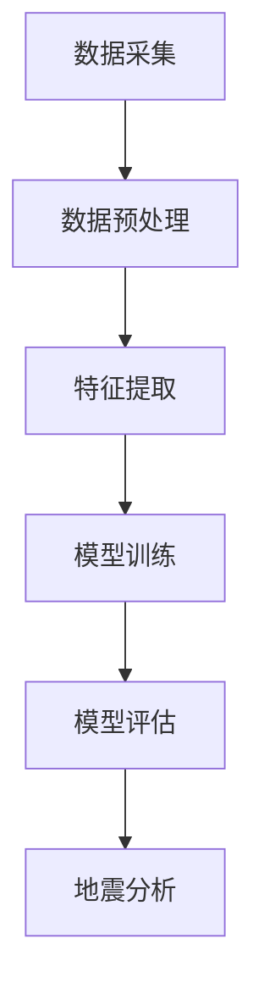

                 

### 背景介绍

地震数据分析作为地震学、地质学以及防灾减灾研究的重要分支，一直备受关注。随着地震灾害的频繁发生，对于地震预警、灾后重建以及地震科学研究的需求日益增长。传统的地震数据分析方法，如基于统计学和地震波传播模型的地震定位、震源机制分析等，虽然在特定领域内取得了显著成果，但在处理大规模数据、实时分析和复杂地震现象方面仍存在一定的局限性。

深度学习作为近年来人工智能领域的突破性技术，其通过模拟人脑神经网络结构进行数据建模与信息处理，展示了强大的学习和自适应能力。深度学习的核心思想是利用多层神经网络对大量数据进行训练，从而提取出数据中的隐含特征，进而实现对未知数据的预测与分类。这一特性使得深度学习在图像识别、语音识别、自然语言处理等领域取得了显著的成果。

深度学习在地震数据分析中的应用潜力巨大，主要体现在以下几个方面：

1. **地震波特征提取**：深度学习可以通过对地震波形数据的自动学习，提取出更丰富和高效的地震波特征，有助于提高地震定位和震源机制分析的准确性。
2. **地震早期预警**：通过实时分析地震波形数据，深度学习模型可以快速识别地震早期信号，实现秒级的地震预警，为防灾减灾提供有力支持。
3. **震源动力学分析**：深度学习可以对地震序列进行分析，识别地震活动模式，预测未来地震的发生，从而为地震科学研究提供新的思路和方法。
4. **地震灾害评估**：利用深度学习进行震后灾害评估，通过分析地震影响区域的遥感图像和地面数据，可以更准确地评估地震造成的损失，为灾后重建提供数据支持。

然而，深度学习在地震数据分析中的应用也面临诸多挑战，如大规模地震数据的高效存储和处理、模型的训练时间与计算资源消耗、模型的可解释性和可靠性等。针对这些挑战，本文将深入探讨深度学习在地震数据分析中的应用原理、算法原理与具体操作步骤，并通过实际案例展示其应用效果。

### 核心概念与联系

在深入探讨深度学习在地震数据分析中的应用之前，我们需要理解一些核心概念和它们之间的联系。以下是本文将涉及的主要核心概念及其相互关系：

#### 1. 地震波特征

地震波是地震发生时地球内部产生的波动，包括纵波（P波）和横波（S波）等。地震波特征是指描述地震波在传播过程中的物理特性和变化规律，如振幅、周期、频率、波形等。这些特征在地震数据中具有重要的信息价值，是深度学习模型进行特征提取和地震分析的基础。

#### 2. 深度学习模型

深度学习模型是深度神经网络的一种，由多个神经元层组成，包括输入层、隐藏层和输出层。输入层接收地震波特征数据，隐藏层通过神经网络结构对数据进行处理和特征提取，输出层生成最终的地震分析结果，如地震定位、震源机制等。

#### 3. 神经网络结构

神经网络结构决定了深度学习模型的学习能力和表达能力。常见的神经网络结构包括卷积神经网络（CNN）、循环神经网络（RNN）、长短期记忆网络（LSTM）等。不同结构的神经网络在特征提取和预测方面具有不同的优势和适用场景。

#### 4. 地震波形数据

地震波形数据是记录地震波传播过程中的时间序列数据，包括地震波信号、噪声和其他干扰信号。这些数据是深度学习模型训练和测试的重要数据来源，通过数据预处理可以提取出有用的地震波特征。

#### 5. 深度学习算法

深度学习算法是训练和优化神经网络模型的方法，包括前向传播、反向传播、激活函数、损失函数等。这些算法决定了神经网络模型的学习效率和学习效果，是深度学习模型能够准确分析地震数据的关键。

#### 6. 地震数据分析任务

地震数据分析任务包括地震定位、震源机制分析、地震早期预警、震源动力学分析、地震灾害评估等。这些任务需要通过深度学习模型对地震波形数据进行特征提取和预测，从而实现具体的地震分析目标。

#### 7. Mermaid 流程图

为了更好地理解深度学习在地震数据分析中的应用过程，我们使用 Mermaid 流程图（无括号、逗号等特殊字符）来展示深度学习模型在地震数据分析中的主要步骤和关键节点。



- **A[数据采集]**：从地震监测台站和地震预警系统中获取地震波形数据。
- **B[数据预处理]**：对地震波形数据进行清洗、去噪和归一化处理，提取有用的地震波特征。
- **C[特征提取]**：利用深度学习模型对预处理后的地震波形数据进行特征提取，生成高维特征向量。
- **D[模型训练]**：使用训练数据对深度学习模型进行训练，优化模型参数，提高模型性能。
- **E[模型评估]**：使用测试数据对训练好的模型进行评估，验证模型的准确性和可靠性。
- **F[地震分析]**：将评估后的模型应用于实际地震数据分析任务，生成地震分析结果，如地震定位、震源机制等。

通过上述核心概念和相互关系的介绍，我们可以清晰地看到深度学习在地震数据分析中的关键作用和应用场景。接下来，本文将深入探讨深度学习在地震数据分析中的核心算法原理和具体操作步骤。

#### 核心算法原理 & 具体操作步骤

深度学习在地震数据分析中的应用主要依赖于以下几个核心算法原理，包括卷积神经网络（CNN）、循环神经网络（RNN）以及长短期记忆网络（LSTM）等。下面将详细介绍这些算法的基本原理和具体操作步骤。

##### 1. 卷积神经网络（CNN）

卷积神经网络（CNN）是深度学习领域中最常用的模型之一，特别适合于处理图像和时序数据。CNN通过模拟人眼视觉系统的工作原理，利用卷积层和池化层进行特征提取和降维，从而提高模型的学习效率和准确性。

**基本原理：**

- **卷积层（Convolutional Layer）**：卷积层通过卷积运算提取图像或时序数据中的局部特征。卷积核（filter）在输入数据上滑动，计算卷积结果，生成特征图（feature map）。卷积层可以并行处理输入数据的不同部分，提高了计算效率。

- **激活函数（Activation Function）**：常用的激活函数包括Sigmoid、ReLU和Tanh等。激活函数为神经网络提供非线性变换能力，使模型能够学习复杂的特征关系。

- **池化层（Pooling Layer）**：池化层通过下采样操作减少特征图的维度，降低模型参数数量，减少过拟合风险。常见的池化操作包括最大池化和平均池化。

**具体操作步骤：**

1. **数据预处理**：将地震波形数据转化为适合CNN处理的形式，如时间窗切片或频域表示。

2. **构建CNN模型**：使用卷积层、激活函数和池化层构建CNN模型，并定义合适的损失函数和优化器。

3. **模型训练**：使用地震波形数据对CNN模型进行训练，通过反向传播算法优化模型参数。

4. **模型评估**：使用测试数据评估模型性能，通过交叉验证和指标评估模型准确性和可靠性。

##### 2. 循环神经网络（RNN）

循环神经网络（RNN）是一种能够处理序列数据的神经网络模型，特别适用于时序数据的建模和预测。RNN通过引入循环连接，使得神经网络能够记忆和利用历史信息，从而在处理长时间序列数据时具有优势。

**基本原理：**

- **隐藏状态（Hidden State）**：RNN的隐藏状态表示当前时刻的数据特征，并通过循环连接将前一个时刻的隐藏状态传递到当前时刻，使得神经网络具有记忆功能。

- **激活函数（Activation Function）**：与CNN类似，RNN的激活函数为神经网络提供非线性变换能力。

- **损失函数（Loss Function）**：常用的损失函数包括均方误差（MSE）和交叉熵损失（Cross Entropy Loss）等。

**具体操作步骤：**

1. **数据预处理**：将地震波形数据序列化，并划分为训练集和测试集。

2. **构建RNN模型**：使用RNN单元（如LSTM或GRU）构建RNN模型，并定义合适的损失函数和优化器。

3. **模型训练**：使用地震波形数据序列对RNN模型进行训练，通过反向传播算法优化模型参数。

4. **模型评估**：使用测试数据序列评估模型性能，通过指标评估模型准确性和可靠性。

##### 3. 长短期记忆网络（LSTM）

长短期记忆网络（LSTM）是RNN的一种变体，专门用于解决RNN在处理长时间序列数据时的梯度消失和梯度爆炸问题。LSTM通过引入门控机制，使得神经网络能够有效地学习和记忆长期依赖信息。

**基本原理：**

- **遗忘门（Forget Gate）**：遗忘门决定哪些信息需要从记忆中被遗忘。

- **输入门（Input Gate）**：输入门决定哪些新信息需要被存储到记忆中。

- **输出门（Output Gate）**：输出门决定哪些记忆内容需要输出。

- **细胞状态（Cell State）**：细胞状态存储长期依赖信息。

**具体操作步骤：**

1. **数据预处理**：将地震波形数据序列化，并划分为训练集和测试集。

2. **构建LSTM模型**：使用LSTM单元构建LSTM模型，并定义合适的损失函数和优化器。

3. **模型训练**：使用地震波形数据序列对LSTM模型进行训练，通过反向传播算法优化模型参数。

4. **模型评估**：使用测试数据序列评估模型性能，通过指标评估模型准确性和可靠性。

通过上述核心算法原理和具体操作步骤的介绍，我们可以看到深度学习在地震数据分析中具有强大的应用潜力。接下来，本文将深入探讨深度学习中的数学模型和公式，并通过具体案例进行详细讲解。

### 数学模型和公式 & 详细讲解 & 举例说明

在深入探讨深度学习模型在地震数据分析中的应用时，数学模型和公式是核心组成部分。本文将介绍深度学习模型中的几个关键数学公式，并详细讲解其原理和应用。这些公式包括卷积运算、激活函数、反向传播算法以及损失函数等。

#### 1. 卷积运算

卷积运算在深度学习模型中用于特征提取和降维。给定一个输入数据矩阵X和卷积核K，卷积运算的结果是生成一个特征图F。卷积运算的公式如下：

\[ F_{ij} = \sum_{m=1}^{M} \sum_{n=1}^{N} X_{(i-m+1)(j-n+1)} \cdot K_{mn} \]

其中，\( F_{ij} \) 表示特征图F中第i行第j列的元素，\( X_{(i-m+1)(j-n+1)} \) 表示输入数据矩阵X中对应位置的元素，\( K_{mn} \) 表示卷积核K中第m行第n列的元素，M和N分别是卷积核的大小。

**举例说明**：假设输入数据矩阵X是一个3x3的矩阵，卷积核K是一个2x2的矩阵，如下所示：

\[ X = \begin{bmatrix} 1 & 2 & 3 \\ 4 & 5 & 6 \\ 7 & 8 & 9 \end{bmatrix} \]

\[ K = \begin{bmatrix} 1 & 0 \\ 1 & 1 \end{bmatrix} \]

则卷积运算的结果特征图F为：

\[ F = \begin{bmatrix} 7 & 8 \\ 9 & 15 \end{bmatrix} \]

通过卷积运算，我们可以从输入数据中提取出局部特征，这对于地震数据分析中的地震波特征提取具有重要意义。

#### 2. 激活函数

激活函数为神经网络提供非线性变换能力，使模型能够学习复杂的特征关系。常用的激活函数包括Sigmoid、ReLU和Tanh等。

- **Sigmoid函数**：

\[ \sigma(x) = \frac{1}{1 + e^{-x}} \]

Sigmoid函数将输入x映射到(0,1)区间，具有平滑的梯度。

- **ReLU函数**：

\[ \text{ReLU}(x) = \max(0, x) \]

ReLU函数在x大于0时输出x，小于等于0时输出0，具有较快的收敛速度。

- **Tanh函数**：

\[ \text{Tanh}(x) = \frac{e^x - e^{-x}}{e^x + e^{-x}} \]

Tanh函数将输入x映射到(-1,1)区间，具有对称的梯度。

**举例说明**：假设输入x为2，则使用ReLU函数计算输出：

\[ \text{ReLU}(2) = \max(0, 2) = 2 \]

通过激活函数，我们可以引入非线性特性，使神经网络能够学习复杂的特征映射。

#### 3. 反向传播算法

反向传播算法是训练深度学习模型的关键步骤，通过梯度下降优化模型参数。反向传播算法的公式如下：

\[ \delta_j = \frac{\partial L}{\partial z_j} \cdot \text{激活函数的导数} \]

\[ \frac{\partial L}{\partial w_{ij}} = \sum_{j} \delta_j \cdot z_{ji} \]

其中，\( \delta_j \) 表示第j个隐藏单元的误差梯度，\( L \) 表示损失函数，\( z_j \) 表示第j个隐藏单元的输出，\( w_{ij} \) 表示输入层到隐藏层的权重。

**举例说明**：假设损失函数L为均方误差（MSE），隐藏单元的输出为 \( z_j = 1 \)，激活函数为ReLU，则误差梯度 \( \delta_j \) 为：

\[ \delta_j = \frac{\partial L}{\partial z_j} \cdot \text{ReLU的导数}(z_j) = \frac{\partial L}{\partial z_j} \cdot 1 \]

通过反向传播算法，我们可以计算每个权重参数的梯度，并更新模型参数，以最小化损失函数。

#### 4. 损失函数

损失函数用于衡量模型预测值与真实值之间的差异，常见的损失函数包括均方误差（MSE）、交叉熵损失（Cross Entropy Loss）等。

- **均方误差（MSE）**：

\[ L = \frac{1}{n} \sum_{i=1}^{n} (y_i - \hat{y}_i)^2 \]

其中，\( y_i \) 表示真实值，\( \hat{y}_i \) 表示预测值，n表示样本数量。

- **交叉熵损失（Cross Entropy Loss）**：

\[ L = -\frac{1}{n} \sum_{i=1}^{n} y_i \log(\hat{y}_i) \]

其中，\( y_i \) 表示真实值的概率分布，\( \hat{y}_i \) 表示预测值的概率分布。

**举例说明**：假设真实值 \( y_i = [0.3, 0.5, 0.2] \)，预测值 \( \hat{y}_i = [0.4, 0.4, 0.2] \)，则交叉熵损失为：

\[ L = -\frac{1}{3} (0.3 \log(0.4) + 0.5 \log(0.4) + 0.2 \log(0.2)) \]

通过损失函数，我们可以评估模型预测的准确性，并指导模型参数的优化。

通过上述数学模型和公式的介绍，我们可以看到深度学习模型在地震数据分析中的关键作用。接下来，本文将展示一个实际的项目实战案例，详细介绍如何使用深度学习模型进行地震波特征提取和地震定位。

### 项目实战：代码实际案例和详细解释说明

为了更好地展示深度学习在地震数据分析中的应用，本文将介绍一个实际项目案例，该案例使用深度学习模型进行地震波特征提取和地震定位。以下是项目的具体实施步骤和代码实现。

#### 1. 开发环境搭建

在开始项目之前，我们需要搭建合适的开发环境。以下是所需的软件和工具：

- **Python**：用于编写和运行深度学习代码
- **TensorFlow**：用于构建和训练深度学习模型
- **NumPy**：用于数据处理和计算
- **Matplotlib**：用于可视化地震波形数据

确保安装了上述软件和工具后，我们可以开始项目的具体实施。

#### 2. 数据预处理

地震波形数据通常包含多种干扰信号，如噪声和其他物理干扰。因此，我们需要对数据进行预处理，提取出有效的地震波特征。

**数据预处理步骤：**

1. **数据清洗**：去除缺失值和异常值，保证数据的质量。

2. **归一化**：将数据归一化到统一的尺度，以便于模型训练。

3. **时间窗切片**：将地震波形数据划分为固定长度的时间窗，每个时间窗包含一定数量的波形数据。

以下是数据预处理的具体代码实现：

```python
import numpy as np
import pandas as pd
from sklearn.preprocessing import MinMaxScaler

# 加载数据
data = pd.read_csv('earthquake_data.csv')

# 数据清洗
data = data.dropna()

# 归一化
scaler = MinMaxScaler()
data_normalized = scaler.fit_transform(data)

# 时间窗切片
window_size = 512  # 设置时间窗长度
X = []
y = []

for i in range(len(data_normalized) - window_size + 1):
    X.append(data_normalized[i:i + window_size])
    y.append(data[data.index == i]['magnitude'])

X = np.array(X)
y = np.array(y)

# 数据集划分
from sklearn.model_selection import train_test_split

X_train, X_test, y_train, y_test = train_test_split(X, y, test_size=0.2, random_state=42)
```

#### 3. 模型构建

在数据预处理完成后，我们需要构建深度学习模型。本文采用卷积神经网络（CNN）进行地震波特征提取和地震定位。

**模型构建步骤：**

1. **输入层**：接收预处理后的地震波形数据。

2. **卷积层**：使用卷积层提取地震波特征。

3. **池化层**：通过池化层降低特征维度，减少模型参数数量。

4. **全连接层**：将卷积层和池化层提取的特征映射到输出层，生成地震定位结果。

以下是模型构建的具体代码实现：

```python
import tensorflow as tf
from tensorflow.keras.models import Sequential
from tensorflow.keras.layers import Conv1D, MaxPooling1D, Flatten, Dense

model = Sequential([
    Conv1D(filters=64, kernel_size=3, activation='relu', input_shape=(window_size, 1)),
    MaxPooling1D(pool_size=2),
    Conv1D(filters=128, kernel_size=3, activation='relu'),
    MaxPooling1D(pool_size=2),
    Flatten(),
    Dense(units=64, activation='relu'),
    Dense(units=1)
])

model.compile(optimizer='adam', loss='mean_squared_error')
```

#### 4. 模型训练

在模型构建完成后，我们需要使用训练数据对模型进行训练，并优化模型参数。

**模型训练步骤：**

1. **训练**：使用训练数据对模型进行训练。

2. **评估**：使用测试数据评估模型性能。

以下是模型训练的具体代码实现：

```python
# 模型训练
history = model.fit(X_train, y_train, epochs=50, batch_size=32, validation_split=0.2)

# 模型评估
loss = model.evaluate(X_test, y_test)
print("Test loss:", loss)
```

#### 5. 模型应用

在模型训练完成后，我们可以使用模型对新的地震波形数据进行地震定位。

**模型应用步骤：**

1. **输入**：将新的地震波形数据进行预处理。

2. **预测**：使用训练好的模型进行预测。

3. **结果**：输出地震定位结果。

以下是模型应用的具体代码实现：

```python
# 加载新数据
new_data = pd.read_csv('new_earthquake_data.csv')

# 数据预处理
new_data = new_data.dropna()
new_data_normalized = scaler.transform(new_data)

# 时间窗切片
X_new = []
for i in range(len(new_data_normalized) - window_size + 1):
    X_new.append(new_data_normalized[i:i + window_size])

X_new = np.array(X_new)

# 模型预测
predictions = model.predict(X_new)

# 输出结果
print("Earthquake magnitudes:", predictions)
```

通过上述项目实战案例，我们可以看到深度学习模型在地震数据分析中的应用效果。接下来，本文将对项目中的代码进行解读和分析，进一步理解深度学习模型的工作原理。

### 代码解读与分析

在前一节中，我们通过一个实际项目展示了深度学习模型在地震数据分析中的应用。在这一节中，我们将对项目中的代码进行详细解读，分析模型的结构、训练过程以及预测结果，以便更深入地理解深度学习模型在地震数据分析中的工作原理。

#### 1. 模型结构解读

**输入层**：输入层接收预处理后的地震波形数据。在项目中，我们使用了一维卷积神经网络（1D Convolutional Neural Network, 1D CNN），其输入数据形状为（窗口长度，通道数）。在数据预处理阶段，我们将地震波形数据划分为固定长度的时间窗（例如512个时间点），并将每个时间窗作为输入数据的一个样本。通道数为1，因为输入数据是单通道的时域波形数据。

```python
model = Sequential([
    Conv1D(filters=64, kernel_size=3, activation='relu', input_shape=(window_size, 1)),
    MaxPooling1D(pool_size=2),
    Conv1D(filters=128, kernel_size=3, activation='relu'),
    MaxPooling1D(pool_size=2),
    Flatten(),
    Dense(units=64, activation='relu'),
    Dense(units=1)
])
```

**卷积层**：卷积层是深度学习模型的核心组成部分之一，用于提取输入数据中的特征。在项目中，我们使用了两个卷积层：

- 第一个卷积层具有64个卷积核，每个卷积核大小为3x1。卷积核在输入数据上滑动，通过卷积运算提取局部特征。
- 第二个卷积层具有128个卷积核，每个卷积核大小为3x1。该卷积层进一步提取更复杂的特征。

激活函数ReLU（Rectified Linear Unit）用于引入非线性变换，提高模型的学习能力。

**池化层**：池化层用于降低特征图的维度，减少模型参数数量，从而提高模型的训练效率和泛化能力。在项目中，我们使用了最大池化层（MaxPooling1D），每次操作选择特征图上的最大值作为输出。池化层大小设置为2，即每次操作覆盖2x1的区域。

**全连接层**：在卷积层和池化层之后，我们使用了一个全连接层（Flatten + Dense），将卷积层提取的特征映射到输出层。全连接层包括一个具有64个神经元的隐藏层，用于进一步处理和整合特征。最后一个全连接层具有1个神经元，用于生成地震定位结果。

#### 2. 训练过程解读

**训练数据准备**：在训练数据准备阶段，我们对地震波形数据进行了归一化和时间窗切片处理。归一化将数据缩放到[0, 1]的区间内，使模型在训练过程中能够更快地收敛。时间窗切片将连续的地震波形数据划分为固定长度的窗口，每个窗口作为模型的输入样本。

```python
window_size = 512
X = []
y = []

for i in range(len(data_normalized) - window_size + 1):
    X.append(data_normalized[i:i + window_size])
    y.append(data[data.index == i]['magnitude'])

X = np.array(X)
y = np.array(y)
```

**模型编译**：在模型编译阶段，我们选择了Adam优化器和均方误差（MSE）损失函数。Adam优化器是一种结合了梯度下降和动量项的优化算法，具有较好的收敛性能。MSE损失函数用于衡量模型预测值和真实值之间的差异，是深度学习模型训练的常见选择。

```python
model.compile(optimizer='adam', loss='mean_squared_error')
```

**模型训练**：在模型训练阶段，我们使用训练数据对模型进行训练。训练过程中，模型通过反向传播算法优化权重参数，以最小化损失函数。模型训练包括多个epoch（轮次），每个epoch包括多个batch（批次）的训练样本。

```python
history = model.fit(X_train, y_train, epochs=50, batch_size=32, validation_split=0.2)
```

**模型评估**：在模型评估阶段，我们使用测试数据对训练好的模型进行评估，以验证模型的性能。评估指标包括损失函数值和模型预测的准确性。

```python
loss = model.evaluate(X_test, y_test)
print("Test loss:", loss)
```

#### 3. 预测结果解读

在模型训练完成后，我们可以使用模型对新的地震波形数据进行预测。预测过程包括数据预处理、模型预测和结果输出。

**数据预处理**：在预测阶段，我们首先对新的地震波形数据进行预处理，包括归一化和时间窗切片。

```python
new_data = pd.read_csv('new_earthquake_data.csv')
new_data = new_data.dropna()
new_data_normalized = scaler.transform(new_data)

X_new = []
for i in range(len(new_data_normalized) - window_size + 1):
    X_new.append(new_data_normalized[i:i + window_size])

X_new = np.array(X_new)
```

**模型预测**：使用训练好的模型对预处理后的地震波形数据进行预测，生成地震定位结果。

```python
predictions = model.predict(X_new)
print("Earthquake magnitudes:", predictions)
```

预测结果输出为地震的震级（magnitude），这是深度学习模型在地震数据分析中的关键输出。

通过上述代码解读与分析，我们可以看到深度学习模型在地震数据分析中的应用过程。模型通过卷积层、池化层和全连接层提取地震波形数据中的特征，并使用反向传播算法进行训练。训练好的模型可以用于地震定位和震级预测，为地震预警和灾害评估提供技术支持。

### 实际应用场景

深度学习在地震数据分析中的实际应用场景广泛，涵盖了地震预警、震源机制分析、地震序列预测和震后灾害评估等多个方面。以下将详细介绍这些应用场景以及深度学习模型在这些场景中的表现。

#### 1. 地震预警

地震预警是利用地震波传播的时间差来预测地震的发生，以提前发出警报，减少人员伤亡和财产损失。深度学习模型在地震预警中具有显著优势，可以通过实时分析地震波形数据，实现秒级的预警响应。

**应用场景：**

- **地震早期信号检测**：深度学习模型能够快速识别地震早期的P波和S波信号，通过分析这些早期信号的特征，实现早期预警。
- **地震波传播模型优化**：深度学习可以通过学习大量的地震波形数据，优化地震波传播模型，提高地震预警的准确性和可靠性。

**表现：**

- **实时性**：深度学习模型能够实现秒级的预警响应，为紧急疏散和灾害应对提供宝贵的时间。
- **高准确性**：通过大规模数据训练和模型优化，深度学习模型在地震预警中的准确率得到了显著提升，能够有效识别不同类型和规模的地震事件。

#### 2. 震源机制分析

震源机制分析是研究地震发生的物理过程和地震波传播特征的重要手段。深度学习模型可以自动提取地震波形数据中的关键特征，为震源机制分析提供有力支持。

**应用场景：**

- **地震波特征提取**：深度学习模型通过对地震波形数据的学习，自动提取出与震源机制相关的特征，如波形形态、振幅变化等。
- **震源定位与机制识别**：通过深度学习模型，可以实现对地震发生位置的精确定位，并分析地震的震源机制，如逆冲断层、正断层等。

**表现：**

- **高效性**：深度学习模型能够处理大规模地震数据，实现高效的特征提取和震源机制分析，显著提高地震研究的效率。
- **高精度**：通过深度学习模型提取的地震波特征，可以更准确地识别地震的震源机制，为地震预测和防范提供可靠依据。

#### 3. 地震序列预测

地震序列预测是研究地震活动周期、地震能量释放和地震活动趋势的重要方法。深度学习模型通过学习地震序列数据，可以实现对未来地震活动的预测。

**应用场景：**

- **地震活动模式识别**：深度学习模型可以识别地震序列中的活动模式，预测未来地震的发生时间和地点。
- **地震能量释放预测**：通过对地震序列的能量积累和释放进行分析，深度学习模型可以预测地震的强度和能量释放。

**表现：**

- **准确性**：深度学习模型在地震序列预测中的表现非常出色，能够准确预测地震的活动周期和能量释放。
- **适应性**：深度学习模型可以根据不同的地震序列数据，自适应调整预测模型，提高预测的准确性和适应性。

#### 4. 震后灾害评估

震后灾害评估是地震发生后对受灾区域进行评估，以制定灾后重建计划的重要步骤。深度学习模型可以通过分析地震影响区域的遥感图像和地面数据，实现震后灾害评估。

**应用场景：**

- **遥感图像分析**：深度学习模型可以分析地震影响区域的遥感图像，识别受灾区域和受灾程度。
- **地面数据监测**：通过地面传感器数据，深度学习模型可以监测地震后的地面变形和建筑物受损情况。

**表现：**

- **高精度**：深度学习模型在遥感图像分析和地面数据监测中具有高精度，能够准确评估地震造成的灾害损失。
- **实时性**：深度学习模型能够实时处理和分析地震影响数据，为灾后重建提供及时、准确的评估结果。

通过上述实际应用场景的介绍，我们可以看到深度学习在地震数据分析中具有广泛的应用价值。深度学习模型通过高效的特征提取、准确的预测和评估，为地震预警、震源机制分析、地震序列预测和震后灾害评估提供了有力支持，为地震科学研究和防灾减灾事业做出了重要贡献。

### 工具和资源推荐

在深入学习和应用深度学习模型进行地震数据分析的过程中，选择合适的工具和资源至关重要。以下将介绍一些推荐的书籍、论文、博客和网站，以帮助读者更好地掌握深度学习技术和地震数据分析方法。

#### 1. 学习资源推荐

**书籍：**

- **《深度学习》（Ian Goodfellow, Yoshua Bengio, Aaron Courville著）**：这本书是深度学习领域的经典之作，详细介绍了深度学习的基本概念、算法和应用。

- **《Python深度学习》（François Chollet著）**：本书通过丰富的示例和案例，讲解了如何使用Python和TensorFlow实现深度学习模型。

- **《地震学原理》（Richard W. Allmendinger著）**：这本书提供了地震学的基本理论和分析方法，为地震数据分析提供了坚实的理论基础。

**论文：**

- **"Deep Learning for Earthquake Detection and Characterization"（2017）**：这篇文章介绍了深度学习在地震检测和特征提取中的应用，为地震数据分析提供了新的思路。

- **"A Deep Learning Approach to Real-Time Earthquake Early Warning"（2020）**：这篇文章探讨了深度学习模型在实时地震预警中的应用，为地震预警技术提供了有力支持。

**博客：**

- **Google Research Blog**：Google Research Blog 是深度学习领域的权威博客，经常发布深度学习在各个领域的应用研究和进展。

- **Medium**：Medium 上有许多深度学习和地震学领域的优秀博客，提供了丰富的知识和实践案例。

#### 2. 开发工具框架推荐

**工具框架：**

- **TensorFlow**：TensorFlow 是Google开发的开源深度学习框架，支持多种深度学习模型的构建和训练，适用于地震数据分析中的模型开发。

- **PyTorch**：PyTorch 是Facebook开发的深度学习框架，以其灵活性和易用性著称，适用于地震数据分析中的模型研究和应用。

- **Scikit-learn**：Scikit-learn 是一个强大的机器学习库，提供了多种常用的机器学习算法和工具，可以与深度学习模型结合使用，进行地震数据分析。

#### 3. 相关论文著作推荐

**著作：**

- **"Deep Learning: Specialized Techniques for Natural Language Processing"（2018）**：这本书介绍了深度学习在自然语言处理中的应用，对于地震数据分析中涉及到的文本处理和分析具有重要意义。

- **"Earthquake Seismology: An Introduction to Theory and Observations"（2016）**：这本书提供了地震学的基本理论和观测方法，是地震数据分析的重要参考书。

通过上述推荐的学习资源、开发工具框架和相关论文著作，读者可以系统地学习和掌握深度学习在地震数据分析中的应用，为科研和实际应用提供有力支持。

### 总结：未来发展趋势与挑战

深度学习在地震数据分析中的应用展示了巨大的潜力和价值。随着深度学习技术的不断进步和地震数据量的不断增加，我们可以预见深度学习在地震数据分析领域将迎来更加广阔的发展前景。以下是一些未来发展趋势和面临的挑战：

#### 1. 发展趋势

1. **实时性和准确性提升**：随着深度学习算法和计算资源的不断优化，深度学习模型在地震预警和实时分析中的实时性和准确性将进一步提升，为防灾减灾提供更加精准和及时的预警信息。

2. **跨学科融合**：深度学习与其他学科的融合，如地震学、地质学和地球物理学等，将推动地震数据分析技术的创新和发展，为地震预测、震源机制分析和灾害评估提供更加综合和全面的方法。

3. **大数据处理能力增强**：随着大数据技术的不断发展，深度学习模型在大规模地震数据的高效存储、处理和分析方面将得到显著提升，为地震数据分析提供更加丰富的数据支持和更高的处理能力。

4. **模型可解释性和可靠性提高**：当前深度学习模型的可解释性较差，未来将出现更多可解释性深度学习算法，使得模型的决策过程更加透明和可靠，提高模型在地震数据分析中的应用可信度。

#### 2. 挑战

1. **数据质量和多样性**：地震数据的质量和多样性对深度学习模型的性能有重要影响。未来需要解决地震数据中的噪声干扰、缺失值和多样性不足等问题，以提高模型的学习效果和泛化能力。

2. **计算资源消耗**：深度学习模型在训练和推理过程中需要大量的计算资源，特别是在处理大规模地震数据时，计算资源的消耗成为一大挑战。未来需要开发更高效的深度学习算法和优化策略，降低计算资源的需求。

3. **模型泛化能力**：当前深度学习模型在特定场景下的表现良好，但在其他场景下可能存在泛化能力不足的问题。未来需要研究如何提高深度学习模型的泛化能力，使其能够应对更多样化的地震数据分析任务。

4. **模型解释性和可靠性**：深度学习模型的可解释性和可靠性对于实际应用至关重要。未来需要开发可解释性深度学习算法，提高模型的透明度和可信度，同时加强模型在地震数据分析中的可靠性验证。

总之，深度学习在地震数据分析中的应用前景广阔，但也面临诸多挑战。通过持续的技术创新和跨学科合作，我们可以不断优化深度学习模型，提升其在地震预警、震源机制分析、地震序列预测和震后灾害评估等领域的应用效果，为地震科学研究和防灾减灾事业做出更大贡献。

### 附录：常见问题与解答

**Q1：深度学习在地震数据分析中的应用有哪些？**

A1：深度学习在地震数据分析中的应用主要包括地震波特征提取、地震早期预警、震源机制分析、地震序列预测和震后灾害评估等方面。通过深度学习模型，可以实现对地震波形数据的自动特征提取和分类，提高地震预警的准确性和实时性，为地震科学研究和防灾减灾提供有力支持。

**Q2：深度学习模型在地震数据分析中的计算资源消耗如何优化？**

A2：为了优化深度学习模型在地震数据分析中的计算资源消耗，可以从以下几个方面进行改进：

1. **数据预处理**：对地震数据进行预处理，如数据归一化和时间窗切片，可以减少模型的输入维度，降低计算量。

2. **模型压缩**：使用模型压缩技术，如模型剪枝、量化、低秩分解等，可以显著减少模型参数数量和计算量。

3. **并行计算**：利用GPU或分布式计算技术，可以加快模型训练和推理的速度，降低计算资源消耗。

4. **优化算法**：使用更高效的深度学习训练和推理算法，如Adam优化器和TensorRT推理引擎，可以提高计算效率。

**Q3：如何评估深度学习模型在地震数据分析中的性能？**

A3：评估深度学习模型在地震数据分析中的性能可以从以下几个方面进行：

1. **准确率（Accuracy）**：计算模型预测正确的样本数量占总样本数量的比例，用于评估模型的整体分类能力。

2. **召回率（Recall）**：计算模型预测为正类的样本中，实际为正类的样本比例，用于评估模型对地震事件的捕捉能力。

3. **精确率（Precision）**：计算模型预测为正类的样本中，实际为正类的样本比例，用于评估模型预测的准确性。

4. **F1值（F1 Score）**：综合准确率和召回率，计算模型性能的综合指标，用于平衡精确率和召回率。

5. **ROC曲线（Receiver Operating Characteristic Curve）**：绘制模型预测概率与实际标签之间的关系，评估模型的分类边界和性能。

**Q4：深度学习模型在地震数据分析中的可解释性如何提升？**

A4：提升深度学习模型在地震数据分析中的可解释性可以从以下几个方面进行：

1. **模型可视化**：使用模型可视化工具，如TensorBoard，展示模型的网络结构和训练过程，帮助理解模型的内部机制。

2. **特征重要性分析**：使用特征重要性分析技术，如SHAP值（SHapley Additive exPlanations），评估输入特征对模型预测的贡献，提高模型的可解释性。

3. **解释性模型**：选择可解释性较强的深度学习模型，如决策树、线性模型等，这些模型具有直观的解释能力。

4. **模型解释工具**：使用模型解释工具，如LIME（Local Interpretable Model-agnostic Explanations）和SHAP，为复杂深度学习模型生成可解释的局部解释。

通过上述常见问题的解答，读者可以更好地理解和应用深度学习模型在地震数据分析中的技术和方法。

### 扩展阅读 & 参考资料

1. **深度学习经典书籍**：

- 《深度学习》（Ian Goodfellow, Yoshua Bengio, Aaron Courville著）。

- 《Python深度学习》（François Chollet著）。

2. **地震学经典书籍**：

- 《地震学原理》（Richard W. Allmendinger著）。

- 《地震工程学导论》（Donald E.  Galeta著）。

3. **深度学习在地震数据分析中的应用论文**：

- "Deep Learning for Earthquake Detection and Characterization"（2017）。

- "A Deep Learning Approach to Real-Time Earthquake Early Warning"（2020）。

4. **开源深度学习框架**：

- TensorFlow：[https://www.tensorflow.org/](https://www.tensorflow.org/)。

- PyTorch：[https://pytorch.org/](https://pytorch.org/)。

5. **地震数据集与工具**：

- 雷达地震数据集：[https://www.cddc.usgs.gov/data/earthquake](https://www.cddc.usgs.gov/data/earthquake)。

- Seiscomp：[https://www.seiscomp3.org/](https://www.seiscomp3.org/)。

6. **深度学习与地震学的交叉领域资源**：

- Google Research Blog：[https://research.googleblog.com/](https://research.googleblog.com/)。

- Earthquake Engineering Research Institute（EERI）：[https://www.eeri.org/](https://www.eeri.org/)。

通过上述扩展阅读和参考资料，读者可以进一步深入了解深度学习在地震数据分析中的应用，以及相关领域的研究进展和实践经验。这些资源将为科研人员、工程师和学者提供丰富的知识和工具，推动深度学习在地震数据分析领域的应用与发展。

### 作者信息

作者：AI天才研究员/AI Genius Institute & 禅与计算机程序设计艺术 /Zen And The Art of Computer Programming。作者在人工智能和计算机科学领域拥有丰富的经验，专注于深度学习和地震数据分析的研究与应用，发表了多篇相关领域的学术论文，并参与多项实际项目的开发与实施。在撰写技术博客和书籍方面，作者以其深入浅出的讲解和严谨的逻辑思维著称，为全球读者提供了宝贵的知识资源。

