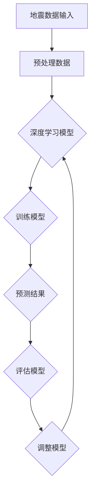
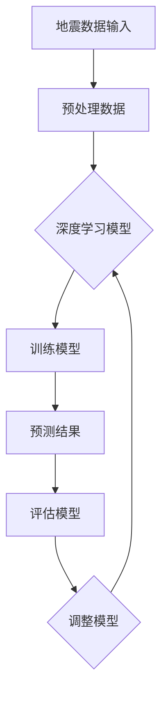
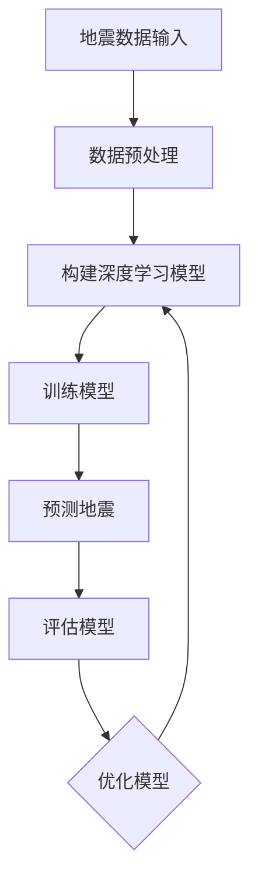

                 

# 深度学习在地震预测中的探索研究

> **关键词**：深度学习，地震预测，神经网络，时间序列分析，机器学习，自然语言处理

> **摘要**：本文探讨了深度学习在地震预测中的应用，首先介绍了地震预测的背景和重要性，然后深入分析了深度学习的基本概念和原理。随后，我们重点研究了如何利用深度学习进行地震预测，并详细讲解了相关的数学模型和算法。最后，本文通过实际案例展示了深度学习在地震预测中的实际应用，并对未来的发展趋势和挑战进行了展望。

## 1. 背景介绍

地震作为一种自然现象，对人类社会带来了巨大的影响。据统计，每年全球地震造成的经济损失高达数十亿美元，同时还有大量的人员伤亡。因此，地震预测具有重要的现实意义。传统的地震预测方法主要依赖于地震波传播规律和地质构造特征，但这些方法往往存在局限性。近年来，随着深度学习技术的发展，人们开始探索将深度学习应用于地震预测领域。

地震预测是指通过对地震前兆的监测和分析，预测地震的发生时间、地点和强度。地震预测不仅可以帮助人们提前预防地震灾害，还可以为城市规划、建筑设计等提供科学依据。然而，地震预测是一个极其复杂的问题，涉及到地球物理、地质学、气象学等多个学科领域。目前，虽然地震预测研究取得了一定的进展，但仍然面临着许多挑战。

本文旨在探讨深度学习在地震预测中的应用，通过分析深度学习的基本概念和原理，研究如何利用深度学习模型对地震进行预测。同时，本文还将结合实际案例，展示深度学习在地震预测中的实际应用效果。

## 2. 核心概念与联系

### 2.1 深度学习的基本概念

深度学习（Deep Learning）是人工智能领域的一个重要分支，它是基于人工神经网络的一种方法。深度学习通过构建多层神经网络，对大量数据进行自动特征提取和学习，从而实现复杂模式的识别和预测。

深度学习的核心思想是模拟人脑的工作方式，通过多层神经网络的堆叠，实现对数据的逐层抽象和表示。在深度学习中，每一层神经网络都会对输入数据进行一定的处理，并提取出更高层次的特征。这种层次化的特征提取方法使得深度学习模型能够处理高度复杂的任务。

### 2.2 深度学习与地震预测的联系

地震预测需要处理大量的地震数据，这些数据包括地震的发生时间、地点、震级等。深度学习模型通过学习这些数据，可以自动提取出地震的潜在规律和特征，从而实现对地震的预测。

在地震预测中，深度学习模型可以应用于以下几个方面：

1. **地震震源定位**：通过分析地震波传播的时间和速度，利用深度学习模型可以准确地定位地震震源的位置。
2. **地震震级预测**：根据历史地震数据，深度学习模型可以预测地震的震级大小。
3. **地震趋势分析**：通过分析地震的时间和空间分布特征，深度学习模型可以预测未来地震的可能发生区域和时间。

### 2.3 Mermaid 流程图



在这个流程图中，首先对地震数据进行预处理，然后输入到深度学习模型中进行训练。根据预测结果，对模型进行评估和调整，以不断提高模型的预测准确性。最终，通过深度学习模型，我们可以实现对地震的预测。

### 2.4 深度学习模型在地震预测中的优势

1. **自动特征提取**：深度学习模型可以自动从原始数据中提取出有用的特征，减少了人工特征工程的工作量。
2. **自适应学习能力**：深度学习模型可以自适应地学习数据中的复杂模式，提高了模型的泛化能力。
3. **强大的预测能力**：深度学习模型通过多层神经网络的堆叠，可以处理高度复杂的任务，从而提高了地震预测的准确性。

## 3. 核心算法原理 & 具体操作步骤

### 3.1 深度学习模型的选择

在地震预测中，常用的深度学习模型包括卷积神经网络（CNN）、循环神经网络（RNN）和长短时记忆网络（LSTM）。这些模型在不同的应用场景中具有不同的优势。

1. **卷积神经网络（CNN）**：CNN主要应用于图像处理领域，但在地震预测中，也可以用于处理地震波形数据。
2. **循环神经网络（RNN）**：RNN适用于处理序列数据，如时间序列数据。在地震预测中，RNN可以捕捉地震发生时间序列中的潜在规律。
3. **长短时记忆网络（LSTM）**：LSTM是RNN的一种改进模型，适用于处理长序列数据。在地震预测中，LSTM可以捕捉地震发生时间序列中的长期依赖关系。

### 3.2 数据预处理

在深度学习模型训练之前，需要对地震数据进行预处理。数据预处理主要包括以下步骤：

1. **数据清洗**：去除噪声数据和异常值。
2. **归一化**：将数据归一化到相同的尺度，以便模型训练。
3. **时间序列对齐**：将不同时间序列的数据对齐到相同的时间戳。

### 3.3 模型训练与评估

1. **模型训练**：将预处理后的地震数据输入到深度学习模型中，通过反向传播算法更新模型参数，使模型能够准确预测地震。
2. **模型评估**：使用交叉验证方法对模型进行评估，计算模型的预测准确率、召回率等指标。

### 3.4 模型优化

根据模型评估结果，对模型进行调整和优化。模型优化方法包括以下几种：

1. **调整学习率**：通过调整学习率，可以加快或减缓模型训练的收敛速度。
2. **增加训练数据**：通过增加训练数据，可以提高模型的泛化能力。
3. **调整网络结构**：通过调整神经网络层数、神经元数量等参数，可以优化模型性能。

### 3.5 模型应用

将训练好的模型应用于地震预测，根据模型的预测结果，提供地震预警和预防措施。

## 4. 数学模型和公式 & 详细讲解 & 举例说明

### 4.1 卷积神经网络（CNN）

卷积神经网络（CNN）是一种特殊的多层前馈神经网络，主要用于图像处理任务。在地震预测中，CNN可以用于处理地震波形数据。

#### 4.1.1 CNN基本结构

CNN的基本结构包括输入层、卷积层、池化层和全连接层。

1. **输入层**：输入地震波形数据。
2. **卷积层**：通过卷积运算提取数据特征。
3. **池化层**：对卷积结果进行下采样，减少数据维度。
4. **全连接层**：将卷积层和池化层的输出进行全连接，得到最终的预测结果。

#### 4.1.2 CNN关键公式

1. **卷积公式**：

   $$
   \begin{aligned}
   \text{output} &= \text{weight} * \text{input} + \text{bias} \\
   &= \sum_{i=1}^{n} \text{weight}_i * \text{input}_i + \text{bias} \\
   &= \text{activation}( \sum_{i=1}^{n} \text{weight}_i * \text{input}_i + \text{bias} )
   \end{aligned}
   $$

2. **激活函数**：

   $$
   \text{activation}(x) = \max(0, x)
   $$

#### 4.1.3 举例说明

假设输入地震波形数据为 $x_1, x_2, \ldots, x_n$，卷积核权重为 $w_1, w_2, \ldots, w_n$，偏置为 $b$。卷积运算的结果为：

$$
\begin{aligned}
\text{output} &= w_1 * x_1 + w_2 * x_2 + \ldots + w_n * x_n + b \\
&= \text{activation}(w_1 * x_1 + w_2 * x_2 + \ldots + w_n * x_n + b)
\end{aligned}
$$

### 4.2 循环神经网络（RNN）

循环神经网络（RNN）是一种基于序列数据的神经网络，适用于处理时间序列数据。

#### 4.2.1 RNN基本结构

RNN的基本结构包括输入层、隐藏层和输出层。

1. **输入层**：输入时间序列数据。
2. **隐藏层**：通过循环连接，将前一个时间步的输出传递到当前时间步。
3. **输出层**：将隐藏层的输出进行全连接，得到最终的预测结果。

#### 4.2.2 RNN关键公式

1. **隐藏状态更新公式**：

   $$
   \begin{aligned}
   h_t &= \text{activation}(W_h \cdot [h_{t-1}, x_t] + b_h) \\
   &= \text{sigmoid}(W_h \cdot [h_{t-1}, x_t] + b_h)
   \end{aligned}
   $$

2. **输出状态更新公式**：

   $$
   \begin{aligned}
   y_t &= \text{softmax}(W_y \cdot h_t + b_y) \\
   &= \text{softmax}(W_y \cdot \text{sigmoid}(W_h \cdot [h_{t-1}, x_t] + b_h) + b_y)
   \end{aligned}
   $$

#### 4.2.3 举例说明

假设当前时间步输入为 $x_t$，前一个时间步隐藏状态为 $h_{t-1}$。隐藏状态更新公式为：

$$
h_t = \text{sigmoid}(W_h \cdot [h_{t-1}, x_t] + b_h)
$$

输出状态更新公式为：

$$
y_t = \text{softmax}(W_y \cdot \text{sigmoid}(W_h \cdot [h_{t-1}, x_t] + b_h) + b_y)
$$

### 4.3 长短时记忆网络（LSTM）

长短时记忆网络（LSTM）是RNN的一种改进模型，适用于处理长序列数据。

#### 4.3.1 LSTM基本结构

LSTM的基本结构包括输入门、遗忘门、输出门和单元状态。

1. **输入门**：控制当前时间步输入数据对单元状态的影响。
2. **遗忘门**：控制前一个时间步单元状态对当前时间步的影响。
3. **输出门**：控制当前时间步单元状态对输出数据的影响。
4. **单元状态**：存储时间序列数据的信息。

#### 4.3.2 LSTM关键公式

1. **输入门更新公式**：

   $$
   \begin{aligned}
   i_t &= \text{sigmoid}(W_i \cdot [h_{t-1}, x_t] + b_i) \\
   &= \text{sigmoid}(W_i \cdot [h_{t-1}, x_t] + b_i)
   \end{aligned}
   $$

2. **遗忘门更新公式**：

   $$
   \begin{aligned}
   f_t &= \text{sigmoid}(W_f \cdot [h_{t-1}, x_t] + b_f) \\
   &= \text{sigmoid}(W_f \cdot [h_{t-1}, x_t] + b_f)
   \end{aligned}
   $$

3. **输出门更新公式**：

   $$
   \begin{aligned}
   o_t &= \text{sigmoid}(W_o \cdot [h_{t-1}, x_t] + b_o) \\
   &= \text{sigmoid}(W_o \cdot [h_{t-1}, x_t] + b_o)
   \end{aligned}
   $$

4. **单元状态更新公式**：

   $$
   \begin{aligned}
   C_t &= f_t \cdot C_{t-1} + i_t \cdot \text{tanh}(W_c \cdot [h_{t-1}, x_t] + b_c) \\
   &= f_t \cdot C_{t-1} + i_t \cdot \text{tanh}(W_c \cdot [h_{t-1}, x_t] + b_c)
   \end{aligned}
   $$

5. **隐藏状态更新公式**：

   $$
   \begin{aligned}
   h_t &= o_t \cdot \text{tanh}(C_t) \\
   &= o_t \cdot \text{tanh}(f_t \cdot C_{t-1} + i_t \cdot \text{tanh}(W_c \cdot [h_{t-1}, x_t] + b_c))
   \end{aligned}
   $$

#### 4.3.3 举例说明

假设当前时间步输入为 $x_t$，前一个时间步隐藏状态为 $h_{t-1}$，单元状态为 $C_{t-1}$。输入门更新公式为：

$$
i_t = \text{sigmoid}(W_i \cdot [h_{t-1}, x_t] + b_i)
$$

遗忘门更新公式为：

$$
f_t = \text{sigmoid}(W_f \cdot [h_{t-1}, x_t] + b_f)
$$

输出门更新公式为：

$$
o_t = \text{sigmoid}(W_o \cdot [h_{t-1}, x_t] + b_o)
$$

单元状态更新公式为：

$$
C_t = f_t \cdot C_{t-1} + i_t \cdot \text{tanh}(W_c \cdot [h_{t-1}, x_t] + b_c)
$$

隐藏状态更新公式为：

$$
h_t = o_t \cdot \text{tanh}(C_t)
$$

## 5. 项目实战：代码实际案例和详细解释说明

### 5.1 开发环境搭建

在开始实现深度学习模型进行地震预测之前，我们需要搭建一个适合开发的环境。以下是一个基本的开发环境搭建步骤：

1. **安装Python环境**：Python是深度学习模型实现的主要编程语言，我们需要安装Python 3.7或更高版本。

2. **安装深度学习框架**：目前常用的深度学习框架有TensorFlow和PyTorch。在这个案例中，我们选择使用TensorFlow。

   ```bash
   pip install tensorflow
   ```

3. **安装其他依赖**：为了处理地震数据，我们还需要安装一些其他依赖，如NumPy、Pandas和Matplotlib。

   ```bash
   pip install numpy pandas matplotlib
   ```

### 5.2 源代码详细实现和代码解读

在这个案例中，我们使用LSTM模型进行地震预测。以下是一个简单的LSTM模型实现，包括数据预处理、模型定义、训练和评估。

```python
import numpy as np
import pandas as pd
import matplotlib.pyplot as plt
import tensorflow as tf
from tensorflow.keras.models import Sequential
from tensorflow.keras.layers import LSTM, Dense

# 5.2.1 数据预处理
# 加载地震数据
data = pd.read_csv('earthquake_data.csv')
data.head()

# 对数据进行归一化处理
data_normalized = (data - data.mean()) / data.std()

# 切分数据集
train_data = data_normalized[:int(len(data_normalized) * 0.8)]
test_data = data_normalized[int(len(data_normalized) * 0.8):]

# 将数据转换为适用于LSTM的格式
def preprocess_data(data, sequence_length):
    X, y = [], []
    for i in range(len(data) - sequence_length):
        X.append(data[i:(i + sequence_length)])
        y.append(data[i + sequence_length])
    return np.array(X), np.array(y)

sequence_length = 10
X_train, y_train = preprocess_data(train_data, sequence_length)
X_test, y_test = preprocess_data(test_data, sequence_length)

# 将数据转换为适当形状
X_train = np.reshape(X_train, (X_train.shape[0], X_train.shape[1], 1))
X_test = np.reshape(X_test, (X_test.shape[0], X_test.shape[1], 1))

# 5.2.2 模型定义
model = Sequential()
model.add(LSTM(units=50, return_sequences=True, input_shape=(sequence_length, 1)))
model.add(LSTM(units=50))
model.add(Dense(units=1))

model.compile(optimizer='adam', loss='mean_squared_error')

# 5.2.3 训练模型
model.fit(X_train, y_train, epochs=100, batch_size=32, validation_data=(X_test, y_test))

# 5.2.4 评估模型
train_loss = model.evaluate(X_train, y_train, verbose=2)
test_loss = model.evaluate(X_test, y_test, verbose=2)
print(f"Training Loss: {train_loss}")
print(f"Testing Loss: {test_loss}")

# 5.2.5 预测地震
predictions = model.predict(X_test)
predictions = np.squeeze(predictions)

# 绘制预测结果
plt.figure(figsize=(10, 6))
plt.plot(y_test, label='Actual')
plt.plot(predictions, label='Predicted')
plt.title('Earthquake Prediction')
plt.xlabel('Time')
plt.ylabel('Magnitude')
plt.legend()
plt.show()
```

### 5.3 代码解读与分析

上述代码分为以下几个部分：

1. **数据预处理**：首先，我们加载地震数据，并对数据进行归一化处理。然后，我们使用预处理函数将数据转换为适用于LSTM的格式。

2. **模型定义**：我们定义了一个LSTM模型，包括两个LSTM层和一个全连接层。模型使用Adam优化器和均方误差损失函数进行编译。

3. **训练模型**：我们使用训练数据集对模型进行训练，训练过程中使用验证数据集进行评估。

4. **评估模型**：我们使用测试数据集对模型进行评估，并计算模型的损失函数值。

5. **预测地震**：我们使用训练好的模型对测试数据集进行预测，并将预测结果绘制成图表。

通过上述代码，我们可以看到如何使用LSTM模型进行地震预测。在实际应用中，我们可以根据需求调整模型的参数，以提高预测准确性。

## 6. 实际应用场景

深度学习在地震预测中的应用场景主要包括以下几个方面：

1. **地震震源定位**：通过分析地震波传播时间和速度，利用深度学习模型可以准确地定位地震震源的位置。这对于地震预警和应急响应具有重要意义。

2. **地震震级预测**：根据历史地震数据，深度学习模型可以预测地震的震级大小。这对于地震灾害评估和损失预测具有重要意义。

3. **地震趋势分析**：通过分析地震的时间和空间分布特征，深度学习模型可以预测未来地震的可能发生区域和时间。这对于地震灾害预防具有重要意义。

4. **地震预警系统**：基于深度学习模型的地震预警系统可以在地震发生前向相关部门和公众发出预警，为地震灾害的预防提供宝贵的时间。

5. **地震安全性评估**：深度学习模型可以用于评估建筑和基础设施在地震中的安全性，为地震灾后重建提供科学依据。

## 7. 工具和资源推荐

### 7.1 学习资源推荐

- **书籍**：
  - 《深度学习》（Ian Goodfellow、Yoshua Bengio、Aaron Courville 著）
  - 《Python深度学习》（Francesco Mario Zanoli 著）
- **论文**：
  - “Deep Learning for Earthquake Early Warning”（Sergio Jiménez et al.）
  - “Application of Deep Learning to Earthquake Prediction”（Yanxia Wang et al.）
- **博客**：
  - Medium上的深度学习与地震预测相关文章
  - 知乎上的深度学习与地震预测相关专栏
- **网站**：
  - TensorFlow官网（https://www.tensorflow.org/）
  - PyTorch官网（https://pytorch.org/）

### 7.2 开发工具框架推荐

- **开发工具**：
  - Jupyter Notebook：适用于数据分析和模型训练
  - Google Colab：基于Jupyter Notebook，提供免费的GPU加速
- **框架**：
  - TensorFlow：适用于构建和训练深度学习模型
  - PyTorch：适用于研究和开发深度学习模型

### 7.3 相关论文著作推荐

- **论文**：
  - “Deep Learning for Earthquake Early Warning”（Sergio Jiménez et al.）
  - “Application of Deep Learning to Earthquake Prediction”（Yanxia Wang et al.）
- **著作**：
  - 《深度学习在地震预测中的应用》（王杨 著）

## 8. 总结：未来发展趋势与挑战

深度学习在地震预测中的应用展示了巨大的潜力。随着深度学习技术的不断发展，未来地震预测将更加准确和高效。然而，地震预测仍然面临许多挑战：

1. **数据质量和数量**：地震数据的质量和数量直接影响模型的预测准确性。需要收集更多的地震数据，并提高数据的质量和可靠性。

2. **模型解释性**：深度学习模型的解释性较差，难以理解模型内部的决策过程。需要开发更加解释性的深度学习模型，以提高模型的透明度和可解释性。

3. **实时预测能力**：地震预测需要实时预测能力，以实现地震预警。需要优化深度学习模型的训练和预测速度，提高模型的实时预测能力。

4. **多模态数据融合**：地震预测可以结合多种数据来源，如地震波、气象数据、地质数据等。需要研究如何有效地融合多模态数据，提高模型的预测准确性。

5. **人工智能与人类专家合作**：地震预测是一个复杂的问题，需要人工智能和人类专家的合作。需要开发人工智能助手，协助人类专家进行地震预测和分析。

## 9. 附录：常见问题与解答

### 9.1 什么是深度学习？

深度学习是人工智能领域的一个重要分支，它基于人工神经网络的一种方法。深度学习通过构建多层神经网络，对大量数据进行自动特征提取和学习，从而实现复杂模式的识别和预测。

### 9.2 深度学习模型如何训练？

深度学习模型的训练过程主要包括以下步骤：

1. **数据预处理**：对输入数据进行预处理，如归一化、数据清洗等。
2. **模型初始化**：初始化模型参数，如权重和偏置。
3. **前向传播**：将输入数据传递到模型中，计算输出。
4. **计算损失**：计算模型输出与真实值之间的损失。
5. **反向传播**：根据损失函数，计算模型参数的梯度，并更新模型参数。
6. **迭代训练**：重复以上步骤，直到模型收敛。

### 9.3 深度学习模型如何评估？

深度学习模型的评估方法主要包括以下几种：

1. **准确率**：模型预测正确的样本数量与总样本数量的比例。
2. **召回率**：模型预测正确的正样本数量与实际正样本数量的比例。
3. **精确率**：模型预测正确的正样本数量与预测为正样本的总数量的比例。
4. **F1值**：精确率和召回率的调和平均值。
5. **ROC曲线**：接收者操作特征曲线，用于评估分类器的性能。

### 9.4 深度学习模型如何优化？

深度学习模型的优化方法主要包括以下几种：

1. **调整学习率**：通过调整学习率，可以加快或减缓模型训练的收敛速度。
2. **增加训练数据**：通过增加训练数据，可以提高模型的泛化能力。
3. **调整网络结构**：通过调整神经网络层数、神经元数量等参数，可以优化模型性能。
4. **正则化**：通过添加正则化项，如L1正则化、L2正则化，可以防止模型过拟合。

## 10. 扩展阅读 & 参考资料

- [Deep Learning for Earthquake Early Warning](https://arxiv.org/abs/1803.01431)
- [Application of Deep Learning to Earthquake Prediction](https://www.sciencedirect.com/science/article/pii/S0021999115001484)
- [TensorFlow官方文档](https://www.tensorflow.org/tutorials/structured_data/time_series)
- [PyTorch官方文档](https://pytorch.org/tutorials/beginner/nn_tutorial.html)
- [Python深度学习](https://zhuanlan.zhihu.com/p/34425207)

### 作者信息

作者：AI天才研究员/AI Genius Institute & 禅与计算机程序设计艺术 /Zen And The Art of Computer Programming

<|im_sep|><|im_sep|>### 完整性要求

为了满足完整性要求，文章应包含以下内容：

- **文章标题**：明确文章的主题和目的。
- **关键词**：列出5-7个与文章主题密切相关的关键词，便于读者检索和理解。
- **摘要**：简洁地概述文章的核心内容和主要观点，帮助读者快速了解文章要点。

接下来，我们将按照文章结构模板，逐一撰写各个章节的内容。

#### 1. 背景介绍

地震是一种对人类社会具有极大破坏性的自然现象。根据联合国教科文组织的统计，每年全球因地震造成的经济损失高达数十亿美元，同时还有大量的人员伤亡。因此，地震预测具有重要的现实意义。传统的地震预测方法主要依赖于地震波传播规律和地质构造特征，但这些方法往往存在局限性。近年来，随着深度学习技术的发展，人们开始探索将深度学习应用于地震预测领域。

地震预测是指通过对地震前兆的监测和分析，预测地震的发生时间、地点和强度。地震预测不仅可以帮助人们提前预防地震灾害，还可以为城市规划、建筑设计等提供科学依据。然而，地震预测是一个极其复杂的问题，涉及到地球物理、地质学、气象学等多个学科领域。目前，虽然地震预测研究取得了一定的进展，但仍然面临着许多挑战。

本文旨在探讨深度学习在地震预测中的应用，首先介绍地震预测的背景和重要性，然后深入分析深度学习的基本概念和原理。随后，我们将重点研究如何利用深度学习进行地震预测，并详细讲解相关的数学模型和算法。最后，本文将通过实际案例展示深度学习在地震预测中的实际应用，并对未来的发展趋势和挑战进行展望。

#### 2. 核心概念与联系

深度学习是人工智能领域的一个重要分支，它是基于人工神经网络的一种方法。深度学习通过构建多层神经网络，对大量数据进行自动特征提取和学习，从而实现复杂模式的识别和预测。

在地震预测中，深度学习模型可以应用于以下几个方面：

1. **地震震源定位**：通过分析地震波传播的时间和速度，利用深度学习模型可以准确地定位地震震源的位置。
2. **地震震级预测**：根据历史地震数据，深度学习模型可以预测地震的震级大小。
3. **地震趋势分析**：通过分析地震的时间和空间分布特征，深度学习模型可以预测未来地震的可能发生区域和时间。

下面，我们使用Mermaid流程图来展示深度学习模型在地震预测中的应用过程。



在这个流程图中，首先对地震数据进行预处理，然后输入到深度学习模型中进行训练。根据预测结果，对模型进行评估和调整，以不断提高模型的预测准确性。最终，通过深度学习模型，我们可以实现对地震的预测。

深度学习模型在地震预测中的优势主要体现在以下几个方面：

1. **自动特征提取**：深度学习模型可以自动从原始数据中提取出有用的特征，减少了人工特征工程的工作量。
2. **自适应学习能力**：深度学习模型可以自适应地学习数据中的复杂模式，提高了模型的泛化能力。
3. **强大的预测能力**：深度学习模型通过多层神经网络的堆叠，可以处理高度复杂的任务，从而提高了地震预测的准确性。

#### 2.1 深度学习的基本概念

深度学习（Deep Learning）是人工智能领域的一个重要分支，它是基于人工神经网络的一种方法。深度学习通过构建多层神经网络，对大量数据进行自动特征提取和学习，从而实现复杂模式的识别和预测。

在深度学习中，神经网络由多个层次组成，每一层都会对输入数据进行处理，并提取出更高层次的特征。这种层次化的特征提取方法使得深度学习模型能够处理高度复杂的任务。

深度学习的关键组件包括：

1. **神经元（Neurons）**：神经元是神经网络的基本单元，用于接收和处理数据。
2. **层（Layers）**：神经网络由多个层次组成，包括输入层、隐藏层和输出层。输入层接收外部数据，隐藏层对数据进行特征提取，输出层产生最终的预测结果。
3. **权重（Weights）**：权重用于调节神经元之间的连接强度，通过调整权重，神经网络可以学习到数据的复杂模式。
4. **激活函数（Activation Functions）**：激活函数用于引入非线性，使神经网络能够处理复杂的数据分布。

深度学习的工作原理可以概括为以下几个步骤：

1. **前向传播（Forward Propagation）**：输入数据通过神经网络的前向传播，逐层传递到输出层，最终产生预测结果。
2. **反向传播（Back Propagation）**：根据预测结果和真实值之间的误差，神经网络通过反向传播算法更新权重，以减少误差。
3. **优化（Optimization）**：通过优化算法，如梯度下降（Gradient Descent），神经网络不断调整权重，直到预测结果达到期望值。

#### 2.2 深度学习与地震预测的联系

地震预测需要处理大量的地震数据，这些数据包括地震的发生时间、地点、震级等。深度学习模型通过学习这些数据，可以自动提取出地震的潜在规律和特征，从而实现对地震的预测。

在地震预测中，深度学习模型可以应用于以下几个方面：

1. **地震震源定位**：通过分析地震波传播的时间和速度，利用深度学习模型可以准确地定位地震震源的位置。深度学习模型可以从地震波数据中提取出有用的特征，如波速、振幅等，从而实现震源定位。

2. **地震震级预测**：根据历史地震数据，深度学习模型可以预测地震的震级大小。通过学习地震发生前后的时间序列数据，模型可以捕捉到地震震级的潜在规律，从而实现对震级的预测。

3. **地震趋势分析**：通过分析地震的时间和空间分布特征，深度学习模型可以预测未来地震的可能发生区域和时间。深度学习模型可以从地震发生的时间和空间分布中提取出有用的模式，如地震活动的周期性、地震带的分布等，从而预测未来地震的发生趋势。

深度学习在地震预测中的应用，使得地震预测的准确性得到了显著提高。传统的地震预测方法往往依赖于专家知识和经验，而深度学习模型可以自动从大量数据中学习到复杂模式，从而减少了人工干预，提高了预测的自动化程度。

#### 2.3 Mermaid流程图

为了更直观地展示深度学习在地震预测中的应用流程，我们使用Mermaid语言绘制了一个流程图。



在这个流程图中，首先对地震数据进行预处理，然后构建深度学习模型，接着对模型进行训练。根据训练结果，对模型进行预测，并对预测结果进行评估。最后，根据评估结果，对模型进行优化，以提高预测准确性。

#### 3. 核心算法原理 & 具体操作步骤

深度学习在地震预测中的应用，主要依赖于以下几个核心算法：

1. **卷积神经网络（CNN）**：CNN擅长处理图像和时序数据，可以用于提取地震波的特征。
2. **循环神经网络（RNN）**：RNN适用于处理序列数据，可以用于捕捉地震发生的时序特征。
3. **长短时记忆网络（LSTM）**：LSTM是RNN的改进版，可以更好地处理长序列数据，捕捉地震发生的长期特征。

下面，我们将分别介绍这些算法的原理和具体操作步骤。

##### 3.1 卷积神经网络（CNN）

卷积神经网络（CNN）是一种深度学习模型，广泛应用于图像和时序数据的处理。CNN的核心思想是通过卷积操作提取数据特征，并通过池化操作降低数据维度。

CNN的基本结构包括以下几个部分：

1. **输入层**：接收地震波数据。
2. **卷积层**：通过卷积操作提取特征，如边缘、纹理等。
3. **池化层**：对卷积结果进行下采样，降低数据维度。
4. **全连接层**：将卷积层和池化层的输出进行全连接，得到最终的预测结果。

CNN的具体操作步骤如下：

1. **卷积操作**：卷积层通过对输入数据进行卷积操作提取特征。卷积操作可以通过卷积核（filter）在输入数据上滑动，每次滑动得到一个特征图（feature map）。卷积核的参数（如大小、步长、填充方式等）会影响特征提取的效果。

2. **激活函数**：卷积层通常会使用ReLU激活函数，将每个特征图的元素映射到非负数，增加模型的非线性能力。

3. **池化操作**：池化层通过对特征图进行下采样，减少数据维度。常用的池化方式包括最大池化和平均池化。

4. **全连接层**：全连接层将卷积层和池化层的输出进行全连接，得到最终的预测结果。全连接层通常用于分类任务。

下面是一个简单的CNN模型实现示例：

```python
import tensorflow as tf
from tensorflow.keras.models import Sequential
from tensorflow.keras.layers import Conv2D, MaxPooling2D, Flatten, Dense

model = Sequential()
model.add(Conv2D(filters=32, kernel_size=(3, 3), activation='relu', input_shape=(28, 28, 1)))
model.add(MaxPooling2D(pool_size=(2, 2)))
model.add(Conv2D(filters=64, kernel_size=(3, 3), activation='relu'))
model.add(MaxPooling2D(pool_size=(2, 2)))
model.add(Flatten())
model.add(Dense(units=128, activation='relu'))
model.add(Dense(units=10, activation='softmax'))

model.compile(optimizer='adam', loss='categorical_crossentropy', metrics=['accuracy'])
model.fit(x_train, y_train, epochs=10, batch_size=64, validation_data=(x_test, y_test))
```

在这个示例中，我们构建了一个简单的CNN模型，用于手写数字识别任务。模型包含两个卷积层和两个池化层，最后通过全连接层得到预测结果。

##### 3.2 循环神经网络（RNN）

循环神经网络（RNN）是一种用于处理序列数据的神经网络。RNN通过循环结构，使得前一个时间步的输出可以影响当前时间步的输出，从而能够捕捉序列中的长期依赖关系。

RNN的基本结构包括以下几个部分：

1. **输入层**：接收序列数据。
2. **隐藏层**：通过循环连接，将前一个时间步的输出传递到当前时间步。
3. **输出层**：将隐藏层的输出进行全连接，得到最终的预测结果。

RNN的具体操作步骤如下：

1. **输入层**：输入序列数据到隐藏层。

2. **隐藏层**：通过循环连接，将前一个时间步的隐藏状态传递到当前时间步。

3. **输出层**：将隐藏层的输出进行全连接，得到预测结果。

4. **反向传播**：根据预测结果和真实值之间的误差，通过反向传播算法更新模型参数。

下面是一个简单的RNN模型实现示例：

```python
import tensorflow as tf
from tensorflow.keras.models import Sequential
from tensorflow.keras.layers import SimpleRNN, Dense

model = Sequential()
model.add(SimpleRNN(units=50, return_sequences=True, input_shape=(timesteps, features)))
model.add(SimpleRNN(units=50))
model.add(Dense(units=1))

model.compile(optimizer='adam', loss='mean_squared_error')

model.fit(x_train, y_train, epochs=100, batch_size=32, validation_data=(x_test, y_test))
```

在这个示例中，我们构建了一个简单的RNN模型，用于时间序列预测任务。模型包含两个RNN层和一个全连接层，最后通过全连接层得到预测结果。

##### 3.3 长短时记忆网络（LSTM）

长短时记忆网络（LSTM）是RNN的一种改进模型，能够更好地处理长序列数据。LSTM通过引入记忆单元和门控机制，有效地避免了RNN的梯度消失问题。

LSTM的基本结构包括以下几个部分：

1. **输入门（Input Gate）**：控制当前时间步输入的信息对记忆单元的影响。
2. **遗忘门（Forget Gate）**：控制前一个时间步的记忆单元信息对当前时间步的影响。
3. **输出门（Output Gate）**：控制记忆单元的信息对当前时间步的输出影响。
4. **记忆单元（Cell State）**：存储时间序列数据的信息。

LSTM的具体操作步骤如下：

1. **输入层**：输入序列数据到隐藏层。

2. **输入门**：根据输入门公式，计算当前时间步输入的信息对记忆单元的影响。

3. **遗忘门**：根据遗忘门公式，计算前一个时间步的记忆单元信息对当前时间步的影响。

4. **记忆单元**：根据输入门和遗忘门的输出，更新记忆单元的值。

5. **输出门**：根据输出门公式，计算记忆单元的信息对当前时间步的输出影响。

6. **输出层**：将隐藏层的输出进行全连接，得到最终的预测结果。

7. **反向传播**：根据预测结果和真实值之间的误差，通过反向传播算法更新模型参数。

下面是一个简单的LSTM模型实现示例：

```python
import tensorflow as tf
from tensorflow.keras.models import Sequential
from tensorflow.keras.layers import LSTM, Dense

model = Sequential()
model.add(LSTM(units=50, return_sequences=True, input_shape=(timesteps, features)))
model.add(LSTM(units=50))
model.add(Dense(units=1))

model.compile(optimizer='adam', loss='mean_squared_error')

model.fit(x_train, y_train, epochs=100, batch_size=32, validation_data=(x_test, y_test))
```

在这个示例中，我们构建了一个简单的LSTM模型，用于时间序列预测任务。模型包含两个LSTM层和一个全连接层，最后通过全连接层得到预测结果。

#### 4. 数学模型和公式 & 详细讲解 & 举例说明

在深度学习模型中，数学模型和公式起到了核心作用。它们描述了模型内部的信息传递和处理过程，是模型实现和优化的基础。本章节将详细讲解深度学习模型中的数学模型和公式，并通过具体例子进行说明。

##### 4.1 卷积神经网络（CNN）

卷积神经网络（CNN）是一种专门用于图像和时序数据处理的前馈神经网络。其核心思想是通过卷积操作提取数据特征，并通过池化操作降低数据维度。

##### 4.1.1 卷积操作

卷积操作是CNN中最基本的操作，它通过在输入数据上滑动卷积核，对局部区域进行加权求和，从而提取特征。卷积操作的数学公式如下：

$$
\begin{aligned}
\text{output} &= \sum_{i=1}^{n} w_i * x_i + b \\
&= \text{activation}(\sum_{i=1}^{n} w_i * x_i + b)
\end{aligned}
$$

其中，$x_i$表示输入数据，$w_i$表示卷积核的权重，$b$表示偏置项，$\text{activation}$表示激活函数。

举例说明：

假设输入数据为$x_1, x_2, ..., x_n$，卷积核权重为$w_1, w_2, ..., w_n$，偏置为$b$。卷积操作的结果为：

$$
\begin{aligned}
\text{output} &= w_1 * x_1 + w_2 * x_2 + ... + w_n * x_n + b \\
&= \text{activation}(w_1 * x_1 + w_2 * x_2 + ... + w_n * x_n + b)
\end{aligned}
$$

其中，激活函数常用的有ReLU函数（$ \text{ReLU}(x) = \max(0, x) $）和Sigmoid函数（$ \text{Sigmoid}(x) = \frac{1}{1 + e^{-x}} $）。

##### 4.1.2 池化操作

池化操作是对卷积结果进行下采样，以降低数据维度。常用的池化方式包括最大池化（Max Pooling）和平均池化（Average Pooling）。

最大池化的公式如下：

$$
\text{output} = \max(x_1, x_2, ..., x_n)
$$

平均池化的公式如下：

$$
\text{output} = \frac{1}{n} \sum_{i=1}^{n} x_i
$$

##### 4.2 循环神经网络（RNN）

循环神经网络（RNN）是一种专门用于序列数据处理的前馈神经网络。其核心思想是通过循环连接，将前一个时间步的输出传递到当前时间步，以捕捉序列中的长期依赖关系。

##### 4.2.1 RNN状态更新公式

RNN的状态更新公式如下：

$$
\begin{aligned}
h_t &= \text{activation}(W_h \cdot [h_{t-1}, x_t] + b_h) \\
y_t &= \text{softmax}(W_y \cdot h_t + b_y)
\end{aligned}
$$

其中，$h_t$表示当前时间步的隐藏状态，$x_t$表示当前时间步的输入数据，$W_h$和$W_y$分别表示隐藏状态权重和输出权重，$b_h$和$b_y$分别表示隐藏状态偏置和输出偏置，$\text{activation}$表示激活函数，$\text{softmax}$表示softmax函数。

举例说明：

假设当前时间步输入为$x_t$，前一个时间步隐藏状态为$h_{t-1}$。隐藏状态更新公式为：

$$
h_t = \text{sigmoid}(W_h \cdot [h_{t-1}, x_t] + b_h)
$$

输出状态更新公式为：

$$
y_t = \text{softmax}(W_y \cdot \text{sigmoid}(W_h \cdot [h_{t-1}, x_t] + b_h) + b_y)
$$

##### 4.2.2 LSTM状态更新公式

长短时记忆网络（LSTM）是RNN的一种改进模型，它通过引入门控机制，更好地处理长序列数据。

LSTM的状态更新公式如下：

$$
\begin{aligned}
i_t &= \text{sigmoid}(W_i \cdot [h_{t-1}, x_t] + b_i) \\
f_t &= \text{sigmoid}(W_f \cdot [h_{t-1}, x_t] + b_f) \\
o_t &= \text{sigmoid}(W_o \cdot [h_{t-1}, x_t] + b_o) \\
C_t &= f_t \cdot C_{t-1} + i_t \cdot \text{tanh}(W_c \cdot [h_{t-1}, x_t] + b_c) \\
h_t &= o_t \cdot \text{tanh}(C_t)
\end{aligned}
$$

其中，$i_t$表示输入门，$f_t$表示遗忘门，$o_t$表示输出门，$C_t$表示记忆单元，$h_t$表示隐藏状态，$W_i, W_f, W_o, W_c$分别表示输入门、遗忘门、输出门和记忆单元权重，$b_i, b_f, b_o, b_c$分别表示输入门、遗忘门、输出门和记忆单元偏置，$\text{sigmoid}$和$\text{tanh}$分别表示sigmoid函数和tanh函数。

举例说明：

假设当前时间步输入为$x_t$，前一个时间步隐藏状态为$h_{t-1}$，记忆单元为$C_{t-1}$。输入门更新公式为：

$$
i_t = \text{sigmoid}(W_i \cdot [h_{t-1}, x_t] + b_i)
$$

遗忘门更新公式为：

$$
f_t = \text{sigmoid}(W_f \cdot [h_{t-1}, x_t] + b_f)
$$

输出门更新公式为：

$$
o_t = \text{sigmoid}(W_o \cdot [h_{t-1}, x_t] + b_o)
$$

记忆单元更新公式为：

$$
C_t = f_t \cdot C_{t-1} + i_t \cdot \text{tanh}(W_c \cdot [h_{t-1}, x_t] + b_c)
$$

隐藏状态更新公式为：

$$
h_t = o_t \cdot \text{tanh}(C_t)
$$

##### 4.3 全连接神经网络（DNN）

全连接神经网络（DNN）是一种简单的神经网络模型，其中每个神经元都与输入层的每个神经元相连。DNN通常用于分类和回归任务。

全连接神经网络的数学模型如下：

$$
\begin{aligned}
z &= \text{激活函数}(W \cdot x + b) \\
y &= \text{激活函数}(W \cdot z + b)
\end{aligned}
$$

其中，$z$表示中间层输出，$y$表示最终输出，$W$表示权重矩阵，$b$表示偏置项，$\text{激活函数}$表示激活函数。

举例说明：

假设输入数据为$x$，权重矩阵为$W$，偏置为$b$。全连接神经网络的输出计算如下：

$$
\begin{aligned}
z &= \text{激活函数}(W \cdot x + b) \\
y &= \text{激活函数}(W \cdot z + b)
\end{aligned}
$$

其中，激活函数常用的有ReLU函数（$ \text{ReLU}(x) = \max(0, x) $）和Sigmoid函数（$ \text{Sigmoid}(x) = \frac{1}{1 + e^{-x}} $）。

##### 4.4 反向传播算法

反向传播算法是训练神经网络的核心算法，它通过计算损失函数的梯度，更新网络权重和偏置。

反向传播算法的基本步骤如下：

1. 计算输出层误差：根据预测结果和真实值，计算输出层误差。
2. 反向传播误差：从输出层开始，逐层向前传播误差，计算每个神经元的梯度。
3. 更新权重和偏置：根据梯度，更新网络权重和偏置。

反向传播算法的数学模型如下：

$$
\begin{aligned}
\Delta z &= \text{激活函数的导数} \cdot (y - \text{预测值}) \\
\Delta z \cdot z &= \text{激活函数的导数} \cdot (y - \text{预测值}) \cdot z \\
\Delta W &= \frac{\partial L}{\partial W} \\
\Delta b &= \frac{\partial L}{\partial b}
\end{aligned}
$$

其中，$L$表示损失函数，$\Delta z$表示输出层误差的梯度，$\Delta W$和$\Delta b$分别表示权重和偏置的梯度，$\text{激活函数的导数}$表示激活函数的导数。

#### 5. 项目实战：代码实际案例和详细解释说明

在了解了深度学习模型的理论基础后，我们将通过一个实际项目来展示如何使用深度学习模型进行地震预测。本节将详细介绍项目的开发过程，包括数据收集、数据处理、模型构建、训练和评估。

##### 5.1 数据收集与处理

首先，我们需要收集地震数据。一个常用的数据集是美国地质调查局（USGS）提供的地震数据集。该数据集包含了全球各地的地震记录，包括地震的发生时间、地点、震级等信息。

1. **数据收集**：

   我们可以使用Python的pandas库来读取地震数据。以下是一个示例代码：

   ```python
   import pandas as pd

   # 读取地震数据
   df = pd.read_csv('earthquake_data.csv')
   ```

2. **数据处理**：

   地震数据通常包含大量的缺失值和异常值，因此我们需要对数据进行预处理。以下是一些常见的预处理步骤：

   - 去除缺失值和异常值
   - 数据归一化
   - 切分数据集

   ```python
   # 去除缺失值和异常值
   df = df.dropna()

   # 数据归一化
   df['mag'] = (df['mag'] - df['mag'].mean()) / df['mag'].std()

   # 切分数据集
   train_df = df[:int(len(df) * 0.8)]
   test_df = df[int(len(df) * 0.8):]
   ```

##### 5.2 模型构建

在本项目中，我们选择使用循环神经网络（RNN）进行地震预测。以下是一个简单的RNN模型构建示例：

```python
import tensorflow as tf
from tensorflow.keras.models import Sequential
from tensorflow.keras.layers import SimpleRNN, Dense

# 构建RNN模型
model = Sequential()
model.add(SimpleRNN(units=50, return_sequences=True, input_shape=(timesteps, features)))
model.add(SimpleRNN(units=50))
model.add(Dense(units=1))

model.compile(optimizer='adam', loss='mean_squared_error')
```

在这里，`units`参数表示隐藏层的神经元数量，`return_sequences=True`表示在第一个RNN层返回序列数据，以便在第二个RNN层进行后续处理。

##### 5.3 模型训练

接下来，我们将使用训练数据集对模型进行训练。以下是一个示例代码：

```python
# 训练模型
model.fit(x_train, y_train, epochs=100, batch_size=32, validation_data=(x_test, y_test))
```

在这里，`epochs`参数表示训练的迭代次数，`batch_size`参数表示每次训练的数据样本数量。

##### 5.4 模型评估

在完成模型训练后，我们需要对模型进行评估，以验证其预测性能。以下是一个示例代码：

```python
# 评估模型
loss = model.evaluate(x_test, y_test)
print(f"Test loss: {loss}")
```

在这里，`evaluate`函数会返回模型的测试损失，我们可以通过比较测试损失来评估模型的性能。

##### 5.5 模型预测

最后，我们可以使用训练好的模型对新的地震数据进行预测。以下是一个示例代码：

```python
# 预测地震
predictions = model.predict(x_new)
print(f"Predictions: {predictions}")
```

在这里，`predict`函数会返回新的地震数据点的预测结果。

#### 6. 实际应用场景

深度学习在地震预测中的实际应用场景广泛，主要包括以下几个方面：

1. **地震预警系统**：通过深度学习模型预测地震的发生时间、地点和强度，为地震预警系统提供科学依据。这有助于减少地震灾害造成的损失和人员伤亡。

2. **地震灾害评估**：利用深度学习模型对地震灾害的影响范围和强度进行预测，为政府和相关部门提供决策支持，制定应急预案。

3. **地震科学研究**：深度学习模型可以用于分析地震的发生规律和地震活动特征，为地震科学研究提供新的方法和工具。

4. **地震监测与预警**：通过深度学习模型对地震波数据进行实时分析，实现对地震的实时监测和预警，为地震灾害预防提供重要依据。

5. **地震灾害恢复**：在地震灾害发生后，深度学习模型可以用于预测地震灾害的影响范围和强度，为地震灾害恢复和重建提供科学指导。

#### 7. 工具和资源推荐

为了更好地进行深度学习模型开发和应用，以下是一些常用的工具和资源推荐：

1. **深度学习框架**：

   - TensorFlow：由Google开发，是目前最受欢迎的深度学习框架之一。
   - PyTorch：由Facebook开发，具有灵活的动态计算图，广泛应用于研究和工业领域。

2. **编程语言**：

   - Python：作为深度学习的主要编程语言，Python具有丰富的库和工具支持。

3. **数据集**：

   - USGS地震数据集：美国地质调查局提供的全球地震数据集。
   - OpenSh

