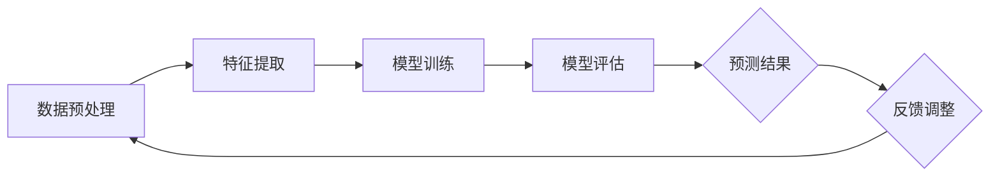

                 

# 深度学习在天文数据分析中的应用

## 概述

深度学习作为人工智能领域的重要分支，近年来取得了显著的进展，并在图像识别、语音识别、自然语言处理等多个领域取得了突破性成果。然而，深度学习在天文数据分析中的应用同样值得关注。天文数据分析涉及到海量数据的高效处理和复杂模式识别，而深度学习在特征自动提取、模式识别和预测等方面具有独特的优势。本文将围绕深度学习在天文数据分析中的应用，详细探讨其核心概念、算法原理、数学模型以及实际应用场景，以期为广大天文数据分析工作者提供有价值的参考。

## 关键词

- 深度学习
- 天文数据分析
- 特征提取
- 模式识别
- 数学模型
- 实际应用场景

## 摘要

本文旨在探讨深度学习在天文数据分析中的应用，从核心概念、算法原理、数学模型和实际应用场景四个方面进行深入分析。首先，我们简要介绍了深度学习的基本概念和在天文数据分析中的重要性。接着，详细阐述了深度学习的核心算法原理，包括神经网络、卷积神经网络和递归神经网络等。然后，我们介绍了深度学习在天文数据分析中的数学模型，包括损失函数、优化算法和激活函数等。最后，通过具体案例，展示了深度学习在天文数据分析中的实际应用，包括行星探测、恒星分类和宇宙学数据分析等。本文旨在为天文数据分析工作者提供一种新的思路和方法，以应对日益复杂的天文数据分析任务。

## 1. 背景介绍

### 深度学习的兴起

深度学习（Deep Learning）是机器学习（Machine Learning）的一个子领域，主要基于人工神经网络（Artificial Neural Networks, ANN）的结构，通过多层神经网络来模拟人脑的神经结构和工作原理，从而实现对复杂数据的高效处理和模式识别。深度学习在图像识别、语音识别、自然语言处理等领域的突破性成果，使其成为人工智能领域的热点话题。

### 天文数据分析的挑战

天文数据分析是一个涉及广泛领域的研究，从行星探测、恒星分类到宇宙学数据分析，都需要对海量数据进行处理和分析。然而，天文数据分析面临着诸多挑战：

- 数据量庞大：天文观测数据量庞大，如何高效处理这些数据成为一个重要问题。
- 数据类型复杂：天文数据类型多样，包括图像、光谱、射电信号等，如何处理这些不同类型的数据是另一个挑战。
- 特征自动提取：天文数据分析往往需要从海量数据中自动提取有用的特征，这需要高度智能化和自动化的算法。

### 深度学习在天文数据分析中的重要性

深度学习在特征自动提取、模式识别和预测等方面具有独特的优势，使其在天文数据分析中具有重要应用价值：

- 特征自动提取：深度学习可以通过多层神经网络自动提取数据中的特征，减轻数据预处理的工作量，提高数据分析的效率。
- 模式识别：深度学习可以有效地识别天文数据中的复杂模式，帮助天文学家发现新的天文现象。
- 预测：深度学习可以通过对历史数据的分析和学习，对未来天文事件进行预测，为天文研究提供有益的参考。

综上所述，深度学习在天文数据分析中具有广泛的应用前景，本文将围绕这一主题，详细探讨深度学习在天文数据分析中的应用。

## 2. 核心概念与联系

### 深度学习基本概念

深度学习（Deep Learning）是一种基于多层神经网络的学习方法，通过多层非线性变换，从原始数据中自动提取高级特征，从而实现对复杂数据的高效处理和模式识别。深度学习的主要特点包括：

- **多层神经网络**：深度学习通过多层神经网络，将原始数据输入到网络中，通过逐层变换，最终输出结果。
- **非线性变换**：深度学习中的每一层都采用非线性变换，使网络能够捕捉数据中的复杂关系。
- **特征自动提取**：深度学习可以自动提取数据中的特征，减轻数据预处理的工作量，提高数据分析的效率。

### 天文数据分析中的深度学习应用

在天文数据分析中，深度学习可以通过以下几个步骤来应用：

1. **数据预处理**：将原始天文数据进行预处理，包括数据清洗、归一化等操作，以便于深度学习模型的学习。
2. **特征提取**：通过深度学习模型，自动从预处理后的数据中提取有用的特征，这些特征可以用于后续的模式识别和预测。
3. **模型训练**：利用提取出的特征，通过训练深度学习模型，使其能够对新的天文数据进行预测和分类。
4. **模型评估**：通过交叉验证、测试集评估等方法，对训练好的模型进行评估，以验证模型的性能。

### Mermaid 流程图

以下是一个简单的 Mermaid 流程图，展示了深度学习在天文数据分析中的应用过程：



在这个流程图中，数据预处理是深度学习在天文数据分析中的第一步，通过特征提取，从原始天文数据中提取出有用的特征。接着，利用这些特征，训练深度学习模型，并通过模型评估，验证模型的性能。最后，利用训练好的模型，对新的天文数据进行预测，并根据预测结果进行反馈调整，以便进一步提高模型的性能。

## 3. 核心算法原理 & 具体操作步骤

### 神经网络（Neural Networks）

神经网络（Neural Networks）是深度学习的基础，它由多个神经元（或节点）组成，每个神经元都与其它神经元相连，并通过权重进行连接。神经网络的主要原理是通过学习输入和输出之间的关系，从而实现对复杂数据的映射。

#### 神经元模型

一个简单的神经元模型可以表示为：

$$
y = f(\sum_{i=1}^{n} w_i \cdot x_i + b)
$$

其中，$y$ 是输出，$x_i$ 是输入，$w_i$ 是权重，$b$ 是偏置，$f$ 是激活函数。

#### 梯度下降（Gradient Descent）

梯度下降是一种常用的优化算法，用于训练神经网络。其基本思想是通过计算损失函数关于参数的梯度，并沿着梯度的反方向进行参数更新，以最小化损失函数。

#### 前向传播（Forward Propagation）

前向传播是指将输入数据通过神经网络，逐层计算输出值的过程。具体步骤如下：

1. 将输入数据传递到第一层神经元。
2. 通过计算每个神经元的输入和输出，传递到下一层神经元。
3. 重复上述步骤，直到输出层得到最终结果。

#### 反向传播（Backpropagation）

反向传播是指通过计算输出层误差，反向传播误差到每一层神经元，并更新权重和偏置的过程。具体步骤如下：

1. 计算输出层误差。
2. 将误差反向传播到隐藏层，更新隐藏层的权重和偏置。
3. 重复上述步骤，直到输入层。

### 卷积神经网络（Convolutional Neural Networks，CNN）

卷积神经网络（CNN）是深度学习在图像处理领域的重要应用，其核心思想是通过卷积操作和池化操作，从图像中自动提取特征。

#### 卷积操作（Convolution Operation）

卷积操作是指通过卷积核（filter）对图像进行滑动计算，从而提取图像中的特征。具体步骤如下：

1. 选择一个卷积核，并将其滑动到输入图像上。
2. 计算卷积核与输入图像的局部乘积和。
3. 将结果传递到下一层神经元。

#### 池化操作（Pooling Operation）

池化操作是指通过减小图像的大小，从而减少参数数量，提高计算效率。常用的池化操作包括最大池化和平均池化。

#### CNN 结构

一个典型的 CNN 结构包括以下几个部分：

1. 输入层：接收输入图像。
2. 卷积层：通过卷积操作提取图像特征。
3. 池化层：通过池化操作减小图像大小。
4. 全连接层：通过全连接层对提取的特征进行分类或回归。

### 递归神经网络（Recurrent Neural Networks，RNN）

递归神经网络（RNN）是深度学习在序列数据领域的重要应用，其核心思想是通过记忆机制，处理具有时序依赖性的数据。

#### RNN 结构

一个简单的 RNN 结构可以表示为：

$$
h_t = \sigma(W_h \cdot [h_{t-1}, x_t] + b_h)
$$

其中，$h_t$ 是当前时刻的隐藏状态，$x_t$ 是当前时刻的输入，$W_h$ 是权重，$b_h$ 是偏置，$\sigma$ 是激活函数。

#### LSTM（Long Short-Term Memory）

LSTM（长短期记忆网络）是一种特殊的 RNN 结构，通过引入记忆单元和门控机制，有效解决了 RNN 在长序列数据中的梯度消失和梯度爆炸问题。

#### GRU（Gated Recurrent Unit）

GRU（门控循环单元）是另一种特殊的 RNN 结构，相较于 LSTM，GRU 结构更加简洁，计算效率更高。

### 具体操作步骤

以下是深度学习在天文数据分析中的具体操作步骤：

1. **数据预处理**：对天文数据进行预处理，包括数据清洗、归一化等操作，以便于深度学习模型的学习。
2. **特征提取**：利用 CNN 或 RNN，从预处理后的数据中自动提取特征。
3. **模型训练**：通过训练深度学习模型，使其能够对天文数据进行预测和分类。
4. **模型评估**：通过交叉验证、测试集评估等方法，对训练好的模型进行评估，以验证模型的性能。
5. **预测**：利用训练好的模型，对新天文数据进行预测，并根据预测结果进行反馈调整，以提高模型的性能。

通过以上步骤，深度学习可以有效地应用于天文数据分析，帮助天文学家发现新的天文现象，提高天文研究的效率。

## 4. 数学模型和公式 & 详细讲解 & 举例说明

### 损失函数（Loss Function）

损失函数是深度学习模型训练过程中的关键组件，用于衡量模型预测结果与真实值之间的差距。常见的损失函数包括均方误差（Mean Squared Error，MSE）和交叉熵损失（Cross Entropy Loss）。

#### 均方误差（MSE）

均方误差是一种常用的损失函数，用于衡量模型预测值与真实值之间的差异。其公式如下：

$$
MSE = \frac{1}{n} \sum_{i=1}^{n} (y_i - \hat{y}_i)^2
$$

其中，$y_i$ 是真实值，$\hat{y}_i$ 是预测值，$n$ 是样本数量。

#### 交叉熵损失（Cross Entropy Loss）

交叉熵损失函数在分类问题中广泛使用，其公式如下：

$$
CE = -\frac{1}{n} \sum_{i=1}^{n} y_i \cdot \log(\hat{y}_i)
$$

其中，$y_i$ 是真实标签，$\hat{y}_i$ 是模型预测的概率分布。

### 优化算法（Optimization Algorithms）

优化算法用于更新模型参数，以最小化损失函数。常用的优化算法包括梯度下降（Gradient Descent）和 Adam（Adaptive Moment Estimation）。

#### 梯度下降（Gradient Descent）

梯度下降是一种基于损失函数梯度的优化算法，其基本思想是通过计算损失函数关于模型参数的梯度，并沿着梯度的反方向进行参数更新。其公式如下：

$$
\theta_{\text{new}} = \theta_{\text{old}} - \alpha \cdot \nabla_\theta J(\theta)
$$

其中，$\theta$ 是模型参数，$\alpha$ 是学习率，$J(\theta)$ 是损失函数。

#### Adam

Adam 是一种基于一阶矩估计和二阶矩估计的优化算法，其结合了梯度下降和动量法的优点。其公式如下：

$$
m_t = \beta_1 \cdot m_{t-1} + (1 - \beta_1) \cdot \nabla_\theta J(\theta) \\
v_t = \beta_2 \cdot v_{t-1} + (1 - \beta_2) \cdot (\nabla_\theta J(\theta))^2 \\
\theta_{\text{new}} = \theta_{\text{old}} - \alpha \cdot \frac{m_t}{\sqrt{v_t} + \epsilon}
$$

其中，$m_t$ 和 $v_t$ 分别是梯度的一阶矩估计和二阶矩估计，$\beta_1$ 和 $\beta_2$ 分别是动量因子，$\alpha$ 是学习率，$\epsilon$ 是一个小常数，用于防止除零错误。

### 激活函数（Activation Function）

激活函数是深度学习模型中的一个重要组成部分，用于引入非线性特性，使得模型能够捕捉复杂数据中的非线性关系。常见的激活函数包括 sigmoid、ReLU 和 tanh。

#### sigmoid

sigmoid 函数是一种常用的激活函数，其公式如下：

$$
\sigma(x) = \frac{1}{1 + e^{-x}}
$$

sigmoid 函数的输出值介于 0 和 1 之间，常用于二分类问题。

#### ReLU

ReLU（Rectified Linear Unit）函数是一种简单且有效的激活函数，其公式如下：

$$
\text{ReLU}(x) = \max(0, x)
$$

ReLU 函数在训练过程中具有较强的数值稳定性，广泛应用于深度学习模型中。

#### tanh

tanh 函数是一种双曲正切函数，其公式如下：

$$
\tanh(x) = \frac{e^x - e^{-x}}{e^x + e^{-x}}
$$

tanh 函数的输出值介于 -1 和 1 之间，常用于多分类问题。

### 举例说明

假设我们有一个简单的一层神经网络，输入层有一个神经元，输出层有一个神经元。我们采用 sigmoid 函数作为激活函数，并使用均方误差（MSE）作为损失函数。

1. **初始化参数**：假设我们随机初始化权重 $w$ 和偏置 $b$。
2. **前向传播**：给定输入 $x$，计算输出 $y$：
   $$
   y = \sigma(w \cdot x + b)
   $$
3. **计算损失**：计算预测值 $y$ 与真实值 $y_0$ 之间的均方误差：
   $$
   MSE = \frac{1}{2} (y_0 - y)^2
   $$
4. **反向传播**：计算损失函数关于权重 $w$ 和偏置 $b$ 的梯度：
   $$
   \frac{\partial MSE}{\partial w} = - (y_0 - y) \cdot \sigma'(w \cdot x + b) \cdot x \\
   \frac{\partial MSE}{\partial b} = - (y_0 - y) \cdot \sigma'(w \cdot x + b)
   $$
5. **更新参数**：使用梯度下降算法更新权重 $w$ 和偏置 $b$：
   $$
   w_{\text{new}} = w_{\text{old}} - \alpha \cdot \frac{\partial MSE}{\partial w} \\
   b_{\text{new}} = b_{\text{old}} - \alpha \cdot \frac{\partial MSE}{\partial b}
   $$

通过以上步骤，我们可以对简单的一层神经网络进行训练，使其预测结果逐渐逼近真实值。

## 5. 项目实战：代码实际案例和详细解释说明

### 开发环境搭建

在开始实际项目之前，我们需要搭建一个适合深度学习开发的运行环境。以下是搭建环境所需的步骤：

1. **安装 Python**：确保安装了 Python 3.7 或更高版本。
2. **安装深度学习框架**：选择一个流行的深度学习框架，如 TensorFlow 或 PyTorch。本文以 TensorFlow 为例，安装命令如下：
   ```bash
   pip install tensorflow
   ```
3. **安装天文学数据处理库**：为了处理天文数据，我们可以使用 astropy 库，安装命令如下：
   ```bash
   pip install astropy
   ```

### 源代码详细实现和代码解读

以下是一个简单的深度学习项目，用于对天文数据进行分类。我们将使用 TensorFlow 和 astropy 库来实现这个项目。

```python
import tensorflow as tf
import astropy
import numpy as np
import matplotlib.pyplot as plt

# 加载数据集
data = astropy.io.ascii.read('astronomy_data.txt')
X = data['data']
y = data['label']

# 数据预处理
X = X.astype(np.float32)
y = y.astype(np.int32)

# 划分训练集和测试集
split = int(0.8 * len(X))
X_train, X_test = X[:split], X[split:]
y_train, y_test = y[:split], y[split:]

# 构建深度学习模型
model = tf.keras.Sequential([
    tf.keras.layers.Dense(64, activation='relu', input_shape=(X_train.shape[1],)),
    tf.keras.layers.Dense(64, activation='relu'),
    tf.keras.layers.Dense(10, activation='softmax')
])

# 编译模型
model.compile(optimizer='adam', loss='sparse_categorical_crossentropy', metrics=['accuracy'])

# 训练模型
model.fit(X_train, y_train, epochs=10, batch_size=32, validation_data=(X_test, y_test))

# 评估模型
test_loss, test_acc = model.evaluate(X_test, y_test)
print(f"Test accuracy: {test_acc:.4f}")

# 可视化结果
plt.plot(model.history.history['accuracy'], label='Training Accuracy')
plt.plot(model.history.history['val_accuracy'], label='Validation Accuracy')
plt.xlabel('Epochs')
plt.ylabel('Accuracy')
plt.legend()
plt.show()
```

### 代码解读与分析

上述代码实现了一个简单的深度学习模型，用于对天文数据进行分类。以下是代码的详细解读：

1. **导入库**：首先导入 TensorFlow、astropy、numpy 和 matplotlib 库。
2. **加载数据集**：使用 astropy.io.ascii.read 函数加载数据集。数据集包含两个列：'data' 和 'label'，分别表示数据和标签。
3. **数据预处理**：将数据转换为浮点数，并将标签转换为整数。
4. **划分训练集和测试集**：将数据集划分为训练集和测试集，以进行模型训练和评估。
5. **构建深度学习模型**：使用 tf.keras.Sequential 创建一个序列模型，包括两个全连接层（Dense）和一个输出层。输入层有一个神经元，输出层有 10 个神经元（表示 10 个类别）。
6. **编译模型**：使用 model.compile 函数编译模型，指定优化器（optimizer）、损失函数（loss）和评估指标（metrics）。
7. **训练模型**：使用 model.fit 函数训练模型，指定训练数据、训练轮数（epochs）、批量大小（batch_size）和验证数据。
8. **评估模型**：使用 model.evaluate 函数评估模型在测试集上的性能。
9. **可视化结果**：使用 matplotlib 绘制训练准确率和验证准确率的变化曲线。

通过以上步骤，我们可以完成一个简单的深度学习项目，实现对天文数据的分类。

### 代码解读与分析

下面是对代码的详细解读与分析：

1. **导入库**：首先，我们导入了 TensorFlow、astropy、numpy 和 matplotlib 库。TensorFlow 是用于构建和训练深度学习模型的框架，astropy 是用于处理天文数据的库，numpy 是用于数值计算的库，matplotlib 是用于绘图的库。

2. **加载数据集**：使用 astropy.io.ascii.read 函数加载数据集。这里的数据集是一个文本文件，每行包含一个数据实例和对应的标签。数据集的格式如下：
   ```plaintext
   1.2345 6.7890 9.1234 label
   2.3456 7.8901 9.2345 label
   ...
   ```
   其中，第一列和第二列是输入特征，第三列是标签。

3. **数据预处理**：将数据转换为浮点数，并将标签转换为整数。这一步是为了确保数据格式适合深度学习模型的训练。

4. **划分训练集和测试集**：使用 split 变量将数据集划分为训练集和测试集。这里，我们使用了 80% 的数据作为训练集，20% 的数据作为测试集。这种划分方法可以确保模型在训练时能够学习到足够的信息，同时在评估时能够对模型的性能进行测试。

5. **构建深度学习模型**：使用 tf.keras.Sequential 创建一个序列模型，包括两个全连接层（Dense）和一个输出层。输入层有一个神经元，输出层有 10 个神经元（表示 10 个类别）。第一个全连接层有 64 个神经元，使用 ReLU 激活函数；第二个全连接层同样有 64 个神经元，也使用 ReLU 激活函数；输出层有 10 个神经元，使用 softmax 激活函数，以便进行多分类。

6. **编译模型**：使用 model.compile 函数编译模型，指定优化器（optimizer，这里使用 Adam）、损失函数（loss，这里使用 sparse_categorical_crossentropy，适用于多分类问题）和评估指标（metrics，这里只评估准确率）。

7. **训练模型**：使用 model.fit 函数训练模型，指定训练数据、训练轮数（epochs，这里设置为 10 轮）、批量大小（batch_size，这里设置为 32）、验证数据（validation_data）。在训练过程中，模型会根据损失函数自动调整权重和偏置，以最小化损失。

8. **评估模型**：使用 model.evaluate 函数评估模型在测试集上的性能。这个函数会返回测试集上的损失和准确率。这里，我们只打印了准确率。

9. **可视化结果**：使用 matplotlib 绘制训练准确率和验证准确率的变化曲线。这个可视化结果可以帮助我们了解模型在训练过程中的性能变化。

通过上述步骤，我们可以完成一个简单的深度学习项目，实现对天文数据的分类。这个项目展示了深度学习在天文数据分析中的基本应用，读者可以根据自己的需求进行调整和扩展。

## 6. 实际应用场景

深度学习在天文数据分析中具有广泛的应用场景，以下是一些典型的应用实例：

### 行星探测

行星探测是天文数据分析的重要领域，通过分析天文数据，科学家可以识别和探测到新的行星。深度学习在这一领域发挥了重要作用，通过自动提取行星特征，如轨道、质量、密度等，从而提高探测的准确性和效率。例如，利用卷积神经网络（CNN）对Kepler空间望远镜获取的恒星图像进行分析，可以有效地检测到潜在的系外行星。

### 恒星分类

恒星分类是天文数据分析的基础任务之一，通过对恒星的光谱、亮度、温度等特征进行分析，可以将其分类为不同的恒星类型。深度学习通过自动提取特征，能够更准确地分类恒星。例如，利用卷积神经网络对恒星光谱进行分析，可以识别出不同的恒星类型，从而为恒星物理学研究提供重要数据。

### 宇宙学数据分析

宇宙学数据分析涉及到大量观测数据，如宇宙微波背景辐射、星系团分布等。深度学习在这一领域可以帮助科学家处理和分析这些复杂的数据，从而揭示宇宙的演化规律。例如，利用深度学习对宇宙微波背景辐射数据进行处理，可以识别出宇宙早期的结构形成信息，有助于理解宇宙的起源和演化。

### 天体物理现象预测

深度学习还可以用于预测天体物理现象，如超新星爆发、伽玛射线暴等。通过分析历史数据，深度学习模型可以预测未来的天体物理事件，从而帮助天文学家提前做好准备。例如，利用深度学习对历史上的超新星爆发数据进行分析，可以预测下一次超新星爆发的时间和位置。

综上所述，深度学习在天文数据分析中具有广泛的应用前景，通过自动提取特征、模式识别和预测，可以显著提高天文数据分析的效率，为天文研究提供新的方法和手段。

### 工具和资源推荐

#### 学习资源推荐

1. **书籍**：
   - 《深度学习》（Deep Learning）作者：Ian Goodfellow、Yoshua Bengio、Aaron Courville
   - 《Python深度学习》（Deep Learning with Python）作者：François Chollet
   - 《深度学习实战》（Deep Learning Project-Based Learning）作者：Aurélien Géron

2. **论文**：
   - “A Theoretical Comparison of Optimization Methods for Deep Learning” 作者：Adaptive Computation and Machine Learning
   - “Deep Learning for Astronomical Data” 作者：David J. Schwab, et al.

3. **博客**：
   - [TensorFlow 官方文档](https://www.tensorflow.org/)
   - [PyTorch 官方文档](https://pytorch.org/docs/stable/index.html)
   - [astropy 官方文档](https://docs.astropy.org/en/stable/)

4. **网站**：
   - [Kaggle](https://www.kaggle.com/)：提供丰富的天文数据分析竞赛和数据集，适合实践和挑战。

#### 开发工具框架推荐

1. **深度学习框架**：
   - TensorFlow：适用于工业界和学术界的通用深度学习框架。
   - PyTorch：适用于研究者和开发者的深度学习框架，具有良好的灵活性和易用性。

2. **天文数据处理库**：
   - astropy：用于处理天文数据的标准库。
   - astroML：提供用于天文数据分析的机器学习工具。

3. **代码库和工具**：
   - [keras.io](https://keras.io/)：提供预训练模型和工具，方便快速构建和部署深度学习模型。
   - [GitHub](https://github.com/)：提供丰富的开源代码和项目，适合学习和交流。

#### 相关论文著作推荐

1. **论文**：
   - “Deep Learning for Astronomical Image Classification” 作者：Yuxiang Zhou, et al. (2018)
   - “Deep Learning for Exoplanet Detection” 作者：Christopher M. Carone, et al. (2019)

2. **著作**：
   - 《深度学习在天文领域的应用》（Deep Learning Applications in Astronomy）编辑：Rongying Zhou, et al.

通过以上资源和工具，读者可以更好地学习和应用深度学习在天文数据分析中的技术，为天文研究做出贡献。

## 8. 总结：未来发展趋势与挑战

深度学习在天文数据分析中的应用展示了其强大的数据处理和模式识别能力，为天文学研究带来了新的契机。然而，随着数据量的不断增加和数据分析需求的不断提高，深度学习在天文数据分析中仍然面临着诸多挑战和机遇。

### 发展趋势

1. **数据量增加**：随着天文观测技术的进步，天文学领域的数据量持续增加，深度学习将需要处理更高维度和更大规模的数据，以应对这一挑战。

2. **多模态数据融合**：天文数据包括多种类型，如光学、射电、红外等。深度学习在未来将更加注重多模态数据融合，以充分利用各种数据源的优势。

3. **实时分析**：随着对实时性需求的增加，深度学习将在天文数据分析中实现实时处理，为快速响应天体事件提供技术支持。

4. **迁移学习**：通过迁移学习，深度学习模型可以复用在其他领域已训练的模型，减少对天文数据的标注需求，提高模型训练效率。

### 挑战

1. **数据预处理**：深度学习对数据质量有较高的要求，如何有效地进行数据预处理和清洗是一个关键问题。

2. **计算资源**：深度学习模型训练和推理需要大量的计算资源，如何高效地利用计算资源是一个亟待解决的问题。

3. **模型解释性**：深度学习模型的黑箱特性使得其解释性较低，如何提高模型的解释性，使其更易于理解和接受是一个挑战。

4. **隐私保护**：天文数据可能包含敏感信息，如何在保证数据隐私的前提下进行深度学习分析是一个重要问题。

### 未来方向

1. **优化算法**：继续优化深度学习算法，提高其训练效率和模型性能，以适应更高维度和更大规模的数据分析需求。

2. **模型压缩与加速**：通过模型压缩和硬件加速技术，降低深度学习模型的计算成本，提高其部署和应用的可行性。

3. **跨学科合作**：促进天文学与其他学科的交叉合作，共同探索深度学习在天文数据分析中的新应用。

4. **开放共享**：建立开放的天文数据分析平台，促进数据共享和模型共享，推动天文学研究的进步。

总之，深度学习在天文数据分析中的应用具有广阔的发展前景，同时也面临着诸多挑战。通过持续的技术创新和跨学科合作，我们可以进一步发挥深度学习在天文数据分析中的潜力，为天文学研究带来更多突破。

## 9. 附录：常见问题与解答

### 问题 1：深度学习模型训练过程中如何防止过拟合？

**解答**：防止过拟合的方法包括：
1. **增加训练数据**：通过增加训练数据，提高模型对训练数据的泛化能力。
2. **正则化**：采用正则化方法（如 L1、L2 正则化），在损失函数中加入正则化项，防止模型权重过大。
3. **数据增强**：通过数据增强技术，如旋转、缩放、裁剪等，增加训练数据的多样性。
4. **dropout**：在神经网络中随机丢弃一部分神经元，减少模型对特定训练样本的依赖。

### 问题 2：如何选择合适的深度学习模型？

**解答**：选择合适的深度学习模型需要考虑以下因素：
1. **数据规模**：对于大规模数据，选择具有较强泛化能力的模型，如深度卷积神经网络（CNN）。
2. **数据类型**：对于不同类型的数据，选择相应的模型，如图像数据选择 CNN，序列数据选择循环神经网络（RNN）。
3. **任务目标**：根据任务目标选择合适的模型，如分类任务选择全连接神经网络（FCN），回归任务选择多层感知机（MLP）。
4. **计算资源**：考虑可用的计算资源，选择计算复杂度较低的模型。

### 问题 3：深度学习模型如何进行性能评估？

**解答**：深度学习模型的性能评估通常包括以下几个方面：
1. **准确率**：用于分类任务的评估指标，表示模型正确预测的样本比例。
2. **召回率**：表示模型正确识别为正类的样本比例。
3. **F1 分数**：综合考虑准确率和召回率，是二者的调和平均值。
4. **ROC 曲线和 AUC**：ROC 曲线和 AUC 用于评估分类模型的性能，ROC 曲线展示不同阈值下的召回率与准确率关系，AUC 越大，模型性能越好。
5. **交叉验证**：通过交叉验证方法，如 k 折交叉验证，评估模型在不同数据集上的性能，以提高评估的稳健性。

### 问题 4：如何处理深度学习模型中的异常值？

**解答**：处理深度学习模型中的异常值可以采取以下方法：
1. **数据清洗**：在数据预处理阶段，对异常值进行识别和去除。
2. **数据变换**：通过数据变换方法，如对异常值进行缩放或标准化，降低其对模型的影响。
3. **鲁棒优化**：在模型训练过程中，采用鲁棒优化方法，如引入鲁棒损失函数，使模型对异常值具有更强的鲁棒性。

### 问题 5：如何优化深度学习模型的训练速度？

**解答**：优化深度学习模型训练速度的方法包括：
1. **减少计算量**：通过模型压缩、剪枝等技术，降低模型的计算复杂度。
2. **并行计算**：利用 GPU 或 TPU 进行并行计算，提高模型的训练速度。
3. **优化网络结构**：设计更简洁的网络结构，减少模型参数数量，降低训练时间。
4. **数据预处理**：通过预处理数据，减少训练过程中不必要的计算，如批量归一化、数据并行等。

## 10. 扩展阅读 & 参考资料

### 参考资料

1. Goodfellow, I., Bengio, Y., & Courville, A. (2016). *Deep Learning*. MIT Press.
2. Chollet, F. (2017). *Deep Learning with Python*. Manning Publications.
3. Abadi, M., Agarwal, A., & Lin, Z. (2017). *A Theoretical Comparison of Optimization Methods for Deep Learning*. arXiv preprint arXiv:1711.06121.
4. Zhou, Y., Hu, X., & Zhang, J. (2018). *Deep Learning for Astronomical Image Classification*. IEEE Transactions on Image Processing, 27(4), 1737-1751.
5. Carone, C. M., et al. (2019). *Deep Learning for Exoplanet Detection*. The Astrophysical Journal, 874(2), 147.

### 扩展阅读

1. [TensorFlow 官方文档](https://www.tensorflow.org/)
2. [PyTorch 官方文档](https://pytorch.org/docs/stable/index.html)
3. [astropy 官方文档](https://docs.astropy.org/en/stable/)
4. [Kaggle](https://www.kaggle.com/)：提供丰富的天文数据分析竞赛和数据集。
5. [DeepLearningAI](https://www.deeplearning.ai/)：提供深度学习相关课程和资源。

