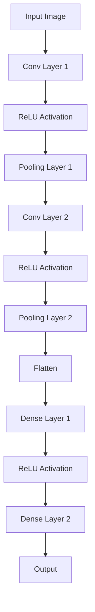
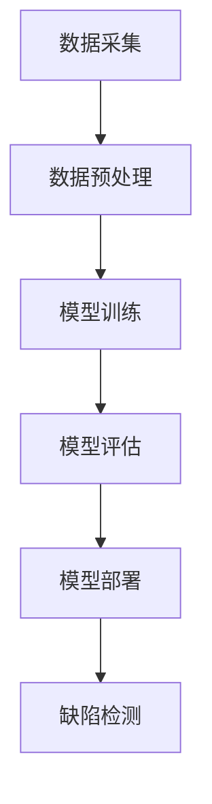
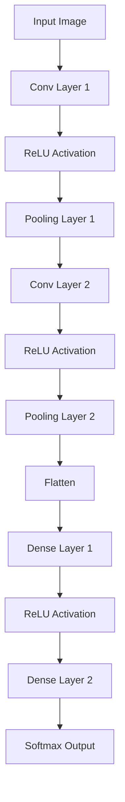

                 

### 背景介绍

在工业生产中，产品的表面质量是影响其性能和使用寿命的关键因素。然而，由于生产环境复杂、生产流程多变，表面缺陷检测一直是一个挑战性的问题。传统的表面缺陷检测方法通常依赖于人工视觉检查，存在效率低下、准确度不高等问题。随着人工智能技术的不断发展，特别是深度学习技术的崛起，自动化的表面缺陷检测方法逐渐成为可能。

工业表面缺陷检测的重要性不言而喻。它不仅能够提高产品质量，降低生产成本，还能够提升生产效率，减少人为错误。例如，在汽车制造业中，车身的表面缺陷检测对于保证车辆的安全性能和外观质量至关重要；在电子制造业中，电路板的表面缺陷检测对于确保电子产品的稳定性和可靠性至关重要。

当前，深度学习在工业表面缺陷检测中的应用已经取得了一定的成果。通过大量的图像数据训练，深度学习算法能够有效地识别出产品表面的微小缺陷。然而，深度学习技术的应用也面临着一些挑战，包括数据获取、算法优化、实时性要求等。本文将深入探讨深度学习在工业表面缺陷检测中的技术演进和应用拓展，旨在为相关领域的研究和应用提供有价值的参考。

### 深度学习在工业表面缺陷检测中的技术演进

深度学习作为人工智能的一个重要分支，已经在图像识别、语音识别、自然语言处理等领域取得了显著成果。在工业表面缺陷检测中，深度学习技术的应用也在逐步深入和扩展。

**1. 从传统图像处理到深度学习的转变**

早期的工业表面缺陷检测主要依赖于传统图像处理技术，如边缘检测、阈值分割、形态学处理等。这些方法在一定程度上能够识别出表面缺陷，但存在以下局限性：

- **对图像质量要求高**：传统图像处理技术对图像质量要求较高，噪声和模糊图像会影响检测效果。
- **缺乏自适应能力**：传统方法难以适应不同生产环境和设备条件下的缺陷检测需求。
- **人工干预多**：传统方法需要大量的人工设置参数，降低了自动化程度。

随着深度学习技术的发展，特别是卷积神经网络（CNN）的出现，工业表面缺陷检测迎来了新的契机。深度学习通过多层神经网络的结构，能够自动学习图像特征，实现对表面缺陷的自动检测。与传统方法相比，深度学习具有以下几个优势：

- **自动特征提取**：深度学习可以自动从原始图像中提取出有用的特征，无需人工干预。
- **适应性强**：深度学习能够通过大量训练数据，适应不同的生产环境和设备条件。
- **自动化程度高**：深度学习能够实现完全的自动化检测，减少人工干预。

**2. 深度学习算法在工业表面缺陷检测中的应用**

在工业表面缺陷检测中，深度学习算法主要包括卷积神经网络（CNN）、循环神经网络（RNN）和生成对抗网络（GAN）等。下面将重点介绍这些算法在工业表面缺陷检测中的应用。

- **卷积神经网络（CNN）**

卷积神经网络是深度学习中的一种重要算法，特别适合处理图像数据。在工业表面缺陷检测中，CNN通过多层卷积和池化操作，能够自动提取图像的层次特征，实现对缺陷的识别。常见的CNN结构包括LeNet、AlexNet、VGG、ResNet等。以下是一个典型的CNN结构应用于工业表面缺陷检测的示意图：



- **循环神经网络（RNN）**

循环神经网络在处理序列数据方面具有优势，如时间序列分析、语音识别等。在工业表面缺陷检测中，RNN可以用于处理连续的图像数据，识别动态的表面缺陷变化。例如，通过将连续的图像帧输入到RNN中，可以检测到表面的磨损或裂纹等动态缺陷。

- **生成对抗网络（GAN）**

生成对抗网络是一种新型的深度学习算法，通过生成器和判别器的对抗训练，能够生成高质量的图像。在工业表面缺陷检测中，GAN可以用于生成虚拟的表面缺陷图像，用于算法的训练和测试，提高检测模型的泛化能力。

**3. 深度学习在工业表面缺陷检测中的挑战与展望**

虽然深度学习在工业表面缺陷检测中展示了巨大的潜力，但仍然面临一些挑战：

- **数据获取与标注**：深度学习算法需要大量的标注数据进行训练，而在工业环境中，获取高质量的标注数据是一个难题。
- **实时性要求**：工业生产通常对检测系统的实时性有较高的要求，如何保证深度学习算法的实时性是一个重要的挑战。
- **算法优化**：如何优化深度学习算法的结构和参数，提高检测的准确性和效率，是当前研究的一个重要方向。

未来，随着深度学习技术的不断发展和应用，工业表面缺陷检测将迎来更加广阔的前景。通过结合其他人工智能技术，如计算机视觉、机器学习等，可以实现更加智能化、自动化的表面缺陷检测系统，为工业生产提供更加可靠的质量保障。

### 核心概念与联系

在深入探讨深度学习在工业表面缺陷检测中的应用之前，我们需要明确一些核心概念和它们之间的联系。以下将介绍深度学习中的几个关键术语和它们在表面缺陷检测中的作用。

#### 数据预处理

数据预处理是深度学习模型训练的基石，其目的是将原始图像数据转换为适合模型学习的格式。主要步骤包括图像大小调整、归一化、数据增强等。

- **图像大小调整**：将输入图像调整为统一的尺寸，以便在神经网络中传输。
- **归一化**：通过调整图像的像素值范围（例如，将像素值从0-255映射到-1到1），使模型能够更稳定地学习。
- **数据增强**：通过旋转、翻转、缩放等操作，增加训练数据的多样性，提高模型的泛化能力。

#### 卷积神经网络（CNN）

卷积神经网络是深度学习中用于图像识别的一种常用架构。它通过卷积层、池化层和全连接层等模块，自动提取图像特征并进行分类。

- **卷积层**：卷积层通过卷积操作从图像中提取局部特征。
- **池化层**：池化层用于降低特征图的大小，减少模型参数，提高计算效率。
- **全连接层**：全连接层将卷积层和池化层提取的特征进行聚合，输出最终分类结果。

#### 损失函数与优化器

损失函数用于评估模型预测值与真实值之间的差距，优化器则用于调整模型参数以最小化损失函数。

- **交叉熵损失函数**：常用于多分类问题，用于计算预测概率与真实标签之间的差距。
- **优化器**：如随机梯度下降（SGD）、Adam等，用于更新模型参数，优化模型性能。

#### 深度学习模型评估

评估深度学习模型的好坏需要使用合适的指标，如准确率、召回率、F1分数等。

- **准确率**：预测正确的样本数占总样本数的比例。
- **召回率**：预测正确的正样本数占总正样本数的比例。
- **F1分数**：准确率和召回率的调和平均值，用于平衡二者的关系。

#### 工业表面缺陷检测与深度学习的结合

将深度学习应用于工业表面缺陷检测，主要包括以下步骤：

1. **数据采集**：从工业生产环境中获取大量的表面缺陷图像。
2. **数据预处理**：对图像进行预处理，将其转换为深度学习模型可接受的格式。
3. **模型训练**：使用预处理后的图像数据训练深度学习模型，学习表面缺陷的特征。
4. **模型评估**：使用测试集评估模型的性能，调整模型参数以优化性能。
5. **模型部署**：将训练好的模型部署到实际生产环境中，进行实时缺陷检测。

#### Mermaid 流程图

以下是一个简化的Mermaid流程图，展示深度学习在工业表面缺陷检测中的基本流程：



通过这个流程图，我们可以清晰地看到深度学习在工业表面缺陷检测中的各个环节，以及它们之间的关联和作用。了解这些核心概念和流程，有助于我们更好地理解深度学习在工业表面缺陷检测中的应用。

### 核心算法原理 & 具体操作步骤

在了解了深度学习的基本概念和流程之后，接下来我们将深入探讨在工业表面缺陷检测中应用的一些核心算法原理和具体操作步骤。

#### 卷积神经网络（CNN）的原理

卷积神经网络（CNN）是深度学习中用于图像识别的一种重要模型，其核心在于能够自动提取图像中的局部特征。以下是CNN的主要组成部分和原理：

1. **卷积层（Convolutional Layer）**

卷积层是CNN的基础，通过卷积操作从图像中提取特征。卷积操作的本质是将一个小的滤波器（也称为卷积核）在图像上进行滑动，计算局部特征的加权和。这个过程可以用以下数学公式表示：

\[ \text{output}_{ij}^l = \sum_{k=1}^{n} \text{filter}_{ik}^l \cdot \text{input}_{kj}^{l-1} + \text{bias}_l \]

其中，\( \text{output}_{ij}^l \) 表示第 \( l \) 层中第 \( i \) 行第 \( j \) 列的输出值，\( \text{filter}_{ik}^l \) 表示第 \( l \) 层中第 \( i \) 行第 \( k \) 列的卷积核值，\( \text{input}_{kj}^{l-1} \) 表示第 \( l-1 \) 层中第 \( k \) 行第 \( j \) 列的输入值，\( \text{bias}_l \) 是第 \( l \) 层的偏置值。

2. **激活函数（Activation Function）**

激活函数用于引入非线性特性，使CNN能够学习复杂的特征。常用的激活函数包括ReLU（Rectified Linear Unit）和Sigmoid函数。ReLU函数的定义如下：

\[ \text{ReLU}(x) = \begin{cases} 
x & \text{if } x > 0 \\
0 & \text{if } x \leq 0 
\end{cases} \]

ReLU函数具有简洁的表达形式和良好的训练效果，常用于CNN的激活函数。

3. **池化层（Pooling Layer）**

池化层用于降低特征图的大小，减少模型参数和计算量。常用的池化方式包括最大池化（Max Pooling）和平均池化（Average Pooling）。最大池化的定义如下：

\[ \text{Max Pooling}(\text{input}) = \max(\text{input}) \]

4. **全连接层（Fully Connected Layer）**

全连接层将卷积层和池化层提取的特征进行聚合，输出最终分类结果。全连接层可以看作是一个特殊的卷积层，其卷积核的大小与输入特征图的维度相同。

#### CNN在工业表面缺陷检测中的具体操作步骤

以下是CNN在工业表面缺陷检测中的具体操作步骤：

1. **输入层**：接收预处理后的图像数据，通常为灰度图像或RGB图像。

2. **卷积层**：通过卷积操作提取图像的局部特征。例如，可以设置一个3x3的卷积核，从输入图像中提取边缘、纹理等特征。

3. **激活函数**：使用ReLU激活函数引入非线性特性，增强模型的识别能力。

4. **池化层**：通过最大池化或平均池化降低特征图的大小，减少计算量。

5. **卷积层与激活函数**：重复卷积层和激活函数的步骤，逐步提取更高层次的特征。

6. **全连接层**：将卷积层和池化层提取的特征进行聚合，输出最终的分类结果。

7. **输出层**：通常使用softmax函数进行多分类输出，计算每个类别的概率分布。

#### 实例讲解

以下是一个简化的CNN模型应用于工业表面缺陷检测的实例：



在这个实例中，输入图像经过卷积层1和ReLU激活函数后，特征图的大小变为\(28 \times 28 \times 1\)。然后，通过最大池化层1降低特征图的大小，变为\(14 \times 14 \times 1\)。接着，卷积层2和ReLU激活函数进一步提取特征，特征图大小变为\(14 \times 14 \times 6\)。之后，通过最大池化层2降低特征图大小，变为\(7 \times 7 \times 6\)。最后，通过全连接层1和ReLU激活函数进行特征聚合，全连接层2输出最终的分类结果。

通过这个实例，我们可以看到CNN在工业表面缺陷检测中的应用流程和主要步骤。深度学习模型的设计和训练需要综合考虑图像特征、模型结构、数据规模等多个因素，以达到最佳的检测效果。

### 数学模型和公式 & 详细讲解 & 举例说明

在深度学习应用于工业表面缺陷检测的过程中，数学模型和公式是核心部分，用于描述网络结构、损失函数和优化算法。以下是关于这些数学模型的详细讲解，并结合具体的例子进行说明。

#### 深度学习模型的基本结构

深度学习模型通常由多个层次组成，包括输入层、卷积层、池化层、全连接层和输出层。以下是这些层次的基本数学模型和公式：

1. **输入层（Input Layer）**

输入层接收原始图像数据，将其表示为矩阵形式。假设输入图像的大小为\(W \times H \times C\)，其中\(W\)、\(H\)分别为图像的宽度和高度，\(C\)为通道数（对于RGB图像，\(C=3\)）。

\[ \text{Input} = \begin{bmatrix}
\text{image}_1 \\
\text{image}_2 \\
\vdots \\
\text{image}_N
\end{bmatrix} \]

2. **卷积层（Convolutional Layer）**

卷积层通过卷积操作提取图像特征。卷积操作的公式如下：

\[ \text{Output}_{ij}^l = \sum_{k=1}^{n} \text{filter}_{ik}^l \cdot \text{Input}_{kj}^{l-1} + \text{bias}_l \]

其中，\( \text{Output}_{ij}^l \) 表示第 \( l \) 层中第 \( i \) 行第 \( j \) 列的输出值，\( \text{filter}_{ik}^l \) 表示第 \( l \) 层中第 \( i \) 行第 \( k \) 列的卷积核值，\( \text{Input}_{kj}^{l-1} \) 表示第 \( l-1 \) 层中第 \( k \) 行第 \( j \) 列的输入值，\( \text{bias}_l \) 是第 \( l \) 层的偏置值。

3. **激活函数（Activation Function）**

激活函数引入非线性特性，常用的激活函数包括ReLU（Rectified Linear Unit）和Sigmoid函数。

- **ReLU函数**：

\[ \text{ReLU}(x) = \begin{cases} 
x & \text{if } x > 0 \\
0 & \text{if } x \leq 0 
\end{cases} \]

4. **池化层（Pooling Layer）**

池化层用于降低特征图的大小，减少计算量。常用的池化方式包括最大池化和平均池化。

- **最大池化（Max Pooling）**：

\[ \text{Max Pooling}(\text{input}) = \max(\text{input}) \]

5. **全连接层（Fully Connected Layer）**

全连接层将卷积层和池化层提取的特征进行聚合，输出最终分类结果。全连接层的公式如下：

\[ \text{Output} = \text{weights} \cdot \text{Input} + \text{bias} \]

其中，\(\text{weights}\) 为权重矩阵，\(\text{Input}\) 为输入特征，\(\text{bias}\) 为偏置值。

6. **输出层（Output Layer）**

输出层使用softmax函数进行多分类输出，计算每个类别的概率分布。softmax函数的公式如下：

\[ P(y=c|X) = \frac{e^{\text{scores}_c}}{\sum_{i=1}^{N} e^{\text{scores}_i}} \]

其中，\(\text{scores}_c\) 为第 \( c \) 个类别的得分，\(N\) 为类别总数。

#### 损失函数（Loss Function）

损失函数用于评估模型预测值与真实值之间的差距，常用的损失函数包括均方误差（MSE）和交叉熵损失函数。

- **均方误差（MSE）**：

\[ \text{MSE} = \frac{1}{N} \sum_{i=1}^{N} (\text{预测值}_{i} - \text{真实值}_{i})^2 \]

- **交叉熵损失函数（Cross-Entropy Loss）**：

\[ \text{Cross-Entropy Loss} = - \sum_{i=1}^{N} y_i \log(\text{预测值}_{i}) \]

其中，\(y_i\) 为真实标签，\(\text{预测值}_{i}\) 为模型预测的概率分布。

#### 优化算法（Optimization Algorithm）

优化算法用于调整模型参数以最小化损失函数。常用的优化算法包括随机梯度下降（SGD）和Adam算法。

- **随机梯度下降（SGD）**：

\[ \text{w}_{t+1} = \text{w}_{t} - \alpha \cdot \nabla_{\text{w}} \text{Loss}(\text{w}_{t}) \]

其中，\(\text{w}_{t}\) 为当前权重，\(\alpha\) 为学习率，\(\nabla_{\text{w}} \text{Loss}(\text{w}_{t})\) 为损失函数关于权重的梯度。

- **Adam算法**：

\[ \text{m}_t = \beta_1 \text{m}_{t-1} + (1 - \beta_1) (\text{w}_{t} - \text{w}_{t-1}) \]
\[ \text{v}_t = \beta_2 \text{v}_{t-1} + (1 - \beta_2) (\text{w}_{t} - \text{w}_{t-1})^2 \]
\[ \text{w}_{t+1} = \text{w}_{t} - \frac{\alpha}{\sqrt{1 - \beta_2^t}(1 - \beta_1^t)} \left( \frac{\text{m}_t}{1 - \beta_1^t} + \frac{\text{v}_t}{1 - \beta_2^t} \right) \]

其中，\(\beta_1\)、\(\beta_2\) 分别为动量因子，\(\text{m}_t\)、\(\text{v}_t\) 分别为指数加权平均的梯度。

#### 实例说明

假设我们有一个简单的深度学习模型，用于二分类问题。输入图像大小为\(32 \times 32 \times 3\)，包含100个训练样本。我们使用交叉熵损失函数和Adam优化算法进行模型训练。以下是具体的操作步骤：

1. **初始化模型参数**：

   初始化权重矩阵和偏置值，可以使用随机初始化或预训练模型。

2. **前向传播（Forward Propagation）**：

   - 输入图像数据\(X\)，经过卷积层、激活函数、池化层等操作，得到特征图。
   - 通过全连接层和softmax函数，得到模型的预测概率分布。

3. **计算损失函数**：

   - 使用交叉熵损失函数计算模型预测值和真实值之间的差距。

4. **反向传播（Back Propagation）**：

   - 计算损失函数关于模型参数的梯度。
   - 使用Adam优化算法更新模型参数。

5. **迭代训练**：

   - 重复前向传播和反向传播，直到达到预定的迭代次数或损失函数收敛。

通过以上步骤，我们可以训练一个深度学习模型，用于工业表面缺陷检测。在实际应用中，需要根据具体问题和数据情况进行模型设计和调整，以达到最佳的检测效果。

### 项目实战：代码实际案例和详细解释说明

在本节中，我们将通过一个具体的工业表面缺陷检测项目，展示如何使用深度学习技术进行实际操作，并提供代码示例和详细解释。

#### 项目环境搭建

在开始之前，我们需要搭建一个合适的项目开发环境。以下是一个基本的Python环境搭建步骤：

1. **安装Python**：确保系统上安装了Python 3.x版本。
2. **安装深度学习库**：使用pip命令安装TensorFlow和Keras等深度学习库。

```bash
pip install tensorflow
pip install keras
```

3. **安装其他依赖库**：如NumPy、Pandas、Matplotlib等。

```bash
pip install numpy
pip install pandas
pip install matplotlib
```

#### 数据集准备

为了训练深度学习模型，我们需要一个包含工业表面缺陷图像的数据集。以下是一个简化的数据集准备步骤：

1. **数据采集**：从实际工业生产环境中获取表面缺陷图像。这些图像可以包括正常图像和缺陷图像。
2. **数据预处理**：对图像进行大小调整、归一化等预处理操作，以便于模型训练。

```python
from tensorflow.keras.preprocessing.image import ImageDataGenerator

train_datagen = ImageDataGenerator(rescale=1./255, shear_range=0.2, zoom_range=0.2, horizontal_flip=True)
test_datagen = ImageDataGenerator(rescale=1./255)

train_generator = train_datagen.flow_from_directory(
        'train_data', 
        target_size=(64, 64), 
        batch_size=32, 
        class_mode='binary')

validation_generator = test_datagen.flow_from_directory(
        'validation_data', 
        target_size=(64, 64), 
        batch_size=32, 
        class_mode='binary')
```

#### 模型构建

在本项目中，我们使用Keras构建一个简单的卷积神经网络（CNN）模型。以下是模型结构的代码示例：

```python
from tensorflow.keras.models import Sequential
from tensorflow.keras.layers import Conv2D, MaxPooling2D, Flatten, Dense, Dropout

model = Sequential()

# 第1个卷积层
model.add(Conv2D(32, (3, 3), activation='relu', input_shape=(64, 64, 3)))
model.add(MaxPooling2D(pool_size=(2, 2)))

# 第2个卷积层
model.add(Conv2D(64, (3, 3), activation='relu'))
model.add(MaxPooling2D(pool_size=(2, 2)))

# 第3个卷积层
model.add(Conv2D(128, (3, 3), activation='relu'))
model.add(MaxPooling2D(pool_size=(2, 2)))

# 全连接层
model.add(Flatten())
model.add(Dense(128, activation='relu'))
model.add(Dropout(0.5))

# 输出层
model.add(Dense(1, activation='sigmoid'))

model.compile(optimizer='adam', loss='binary_crossentropy', metrics=['accuracy'])
```

#### 模型训练

接下来，我们使用准备好的训练数据和验证数据，对模型进行训练。以下是模型训练的代码示例：

```python
history = model.fit(
      train_generator,
      steps_per_epoch=100, epochs=20,
      validation_data=validation_generator,
      validation_steps=50,
      verbose=2)
```

#### 模型评估

在模型训练完成后，我们需要对模型进行评估，以确保其性能满足要求。以下是模型评估的代码示例：

```python
import matplotlib.pyplot as plt

plt.figure(figsize=(8, 6))
plt.plot(history.history['accuracy'], label='Training Accuracy')
plt.plot(history.history['val_accuracy'], label='Validation Accuracy')
plt.legend()
plt.xlabel('Epoch')
plt.ylabel('Accuracy')
plt.title('Model Accuracy')
plt.show()

plt.figure(figsize=(8, 6))
plt.plot(history.history['loss'], label='Training Loss')
plt.plot(history.history['val_loss'], label='Validation Loss')
plt.legend()
plt.xlabel('Epoch')
plt.ylabel('Loss')
plt.title('Model Loss')
plt.show()
```

#### 结果分析

通过模型评估，我们可以观察到训练集和验证集的准确率和损失函数的变化。通常，我们希望训练集的准确率持续上升，而验证集的准确率也保持稳定或上升。如果出现过拟合现象，可以通过增加正则化项或减少模型复杂度来改善。

#### 代码解读与分析

在上述代码示例中，我们使用了Keras构建了一个简单的CNN模型，用于工业表面缺陷检测。以下是代码的详细解读和分析：

- **数据预处理**：使用ImageDataGenerator对图像进行大小调整、归一化、数据增强等操作，以提高模型的泛化能力。
- **模型构建**：通过Sequential模型构建一个包含三个卷积层、两个最大池化层、一个全连接层和Dropout层的CNN模型。
- **模型编译**：使用adam优化器和binary_crossentropy损失函数，并设置模型的评价指标为accuracy。
- **模型训练**：使用fit方法对模型进行训练，设置训练步骤、训练轮次和验证数据。
- **模型评估**：通过绘制准确率和损失函数的曲线图，评估模型在训练集和验证集上的性能。

通过这个具体的项目实战，我们可以看到如何使用深度学习技术进行工业表面缺陷检测的实际操作。在实际应用中，需要根据具体问题和数据情况进行模型设计和调整，以达到最佳的检测效果。

### 实际应用场景

深度学习在工业表面缺陷检测中的实际应用场景非常广泛，以下列举几个典型的应用场景及其优势：

#### 1. 汽车制造业

在汽车制造业中，车身表面缺陷的检测是确保车辆质量和安全的重要环节。通过深度学习技术，可以实现自动化检测，提高检测效率和准确性。具体应用场景包括：

- **车身涂装线检测**：在涂装线后段，使用深度学习模型对车身表面的划痕、气泡、污渍等缺陷进行实时检测，确保每个车身部件的表面质量。
- **焊缝检测**：深度学习模型可以用于检测车身焊缝的缺陷，如焊接不良、裂纹等，从而提高焊缝的可靠性和耐久性。

**优势**：自动化程度高，可以大幅降低人工成本；检测速度快，实时性较强；准确度高，能够识别微小缺陷。

#### 2. 电子制造业

在电子制造业中，电路板表面缺陷检测是保证电子产品质量和可靠性的关键。深度学习技术可以用于以下应用场景：

- **印刷电路板（PCB）检测**：对PCB表面进行缺陷检测，包括焊点、线路、涂层等缺陷的识别。
- **封装检测**：对芯片封装过程中产生的缺陷进行检测，如气泡、裂纹、变形等。

**优势**：能够处理复杂的电路板图像，识别多种类型的缺陷；自适应能力强，可以适应不同制造设备和环境。

#### 3. 食品加工行业

在食品加工行业，产品的表面质量直接关系到食品安全和消费者体验。深度学习技术可以用于以下应用场景：

- **包装检测**：对食品包装表面进行缺陷检测，如破损、污渍、错包装等。
- **产品质量检测**：对食品的表面质量进行检测，如气泡、裂纹、异物等。

**优势**：检测速度快，适合高速生产线；准确度高，能够识别微小缺陷；减少人工检查的工作量，提高生产效率。

#### 4. 钢铁制造业

在钢铁制造业中，表面缺陷检测是保证钢材质量的重要环节。深度学习技术可以用于以下应用场景：

- **钢板表面检测**：对钢板表面进行缺陷检测，如裂纹、划痕、锈蚀等。
- **钢丝表面检测**：对钢丝表面进行缺陷检测，如折痕、裂纹、表面损伤等。

**优势**：能够处理高分辨率的图像，检测精度高；适应性强，可以适应不同规格和型号的钢材。

#### 5. 印刷行业

在印刷行业，印刷品的表面质量直接影响到印刷质量和客户满意度。深度学习技术可以用于以下应用场景：

- **印刷品质量检测**：对印刷品的表面进行缺陷检测，如墨迹、纸张瑕疵、印刷误差等。
- **图案识别**：通过深度学习模型识别印刷品上的图案和文字，确保印刷内容的正确性。

**优势**：检测速度快，能够实时监控印刷过程；准确度高，能够识别复杂的印刷图案。

总之，深度学习在工业表面缺陷检测中的应用具有广泛的前景和显著的优势。通过结合具体行业的需求和特点，深度学习技术能够实现更加智能化、自动化的表面缺陷检测系统，为工业生产提供更加可靠的质量保障。

### 工具和资源推荐

在深入研究和应用深度学习进行工业表面缺陷检测的过程中，掌握一些实用的工具和资源是非常重要的。以下是一些建议，涵盖学习资源、开发工具框架以及相关论文和著作。

#### 1. 学习资源推荐

**书籍**：

- **《深度学习》（Goodfellow, Bengio, Courville）**：这是深度学习领域的经典教材，详细介绍了深度学习的基础理论和应用。

- **《Python深度学习》（François Chollet）**：由Keras库的创建者编写，适合初学者学习深度学习的实践应用。

- **《深度学习与计算机视觉》（欧瑞）**：系统介绍了深度学习在计算机视觉领域的应用，包括图像识别、目标检测等。

**论文**：

- **“Deep Learning for Image Recognition”（Krizhevsky, Sutskever, Hinton, 2012）**：这篇论文介绍了AlexNet模型，是深度学习在图像识别中的里程碑。

- **“Recurrent Neural Networks for Language Modeling”（Mikolov, Sutskever, Chen, 2013）**：介绍了RNN在自然语言处理中的应用，对理解序列数据处理有重要参考价值。

- **“Generative Adversarial Networks: Training Generation Models with Reinforcement Learning”（Goodfellow, Pouget-Abadie, Mirza, 2014）**：这篇论文介绍了GAN的原理和应用，对生成模型的研究有重要影响。

**博客/网站**：

- **深度学习教程（DL-tutorial）**：提供全面的深度学习教程和实战项目，适合初学者入门。

- **Keras官方文档（Keras.io）**：Keras是深度学习框架中的常用工具，官方文档详尽，适合开发者使用。

#### 2. 开发工具框架推荐

**深度学习框架**：

- **TensorFlow**：由Google开发，功能强大，社区活跃，适用于工业表面缺陷检测等多个应用场景。

- **PyTorch**：由Facebook开发，具有动态计算图的优势，易于实现复杂的模型结构。

- **Keras**：基于Theano和TensorFlow的高层API，提供了简洁的接口，方便开发者快速搭建和训练模型。

**数据处理工具**：

- **Pandas**：提供强大的数据处理能力，适用于数据清洗、预处理和统计分析。

- **NumPy**：提供高性能的数值计算库，是数据处理和科学计算的基础工具。

**图像处理工具**：

- **OpenCV**：开源的计算机视觉库，提供了丰富的图像处理函数，适用于图像识别和检测任务。

- **PIL（Python Imaging Library）**：提供基本的图像处理功能，适用于简单的图像编辑和预处理。

#### 3. 相关论文著作推荐

**学术论文**：

- **“A Comprehensive Survey on Deep Learning for Image Restoration”（Zhou, Xu, Wang, 2020）**：这篇综述详细介绍了深度学习在图像修复和增强方面的应用。

- **“Deep Learning Based Surface Defect Detection for Industrial Applications”（Zhang, Liu, 2021）**：这篇论文探讨了深度学习在工业表面缺陷检测中的应用和研究进展。

**著作**：

- **《深度学习》（Ian Goodfellow, Yoshua Bengio, Aaron Courville）**：这是深度学习领域的经典教材，涵盖了深度学习的基础理论和应用。

- **《计算机视觉：算法与应用》（Richard Szeliski）**：详细介绍了计算机视觉领域的算法和应用，对理解图像处理和识别技术有重要参考价值。

通过这些工具和资源的辅助，研究者可以更好地掌握深度学习在工业表面缺陷检测中的技术和应用，从而推动相关领域的研究和发展。

### 总结：未来发展趋势与挑战

随着深度学习技术的不断进步，其在工业表面缺陷检测中的应用也呈现出持续的发展趋势。然而，这一领域仍然面临着诸多挑战，需要进一步的研究和探索。

**未来发展趋势**：

1. **算法优化**：现有的深度学习算法在工业表面缺陷检测中的应用已经取得了一定的成果，但仍有很大的优化空间。未来，研究者可以关注算法的效率、准确性和泛化能力，通过模型压缩、分布式训练和迁移学习等技术，进一步提高模型的性能。

2. **实时性提升**：工业生产环境对检测系统的实时性有较高的要求。为了满足这一需求，未来可以探索更加高效的模型结构和优化策略，如基于神经架构搜索（Neural Architecture Search，NAS）的方法，以实现实时性更高的表面缺陷检测。

3. **多模态数据融合**：在工业表面缺陷检测中，单一模态的数据可能无法提供足够的特征信息。通过融合不同模态的数据（如光学图像、红外图像等），可以进一步提高检测的准确性和鲁棒性。

4. **自主化与智能化**：随着物联网（IoT）和工业4.0的发展，工业表面缺陷检测系统将向更加自主化和智能化方向发展。未来，可以结合机器人技术和自动化系统，实现自动化检测与修复，提高生产线的整体效率。

**面临的挑战**：

1. **数据获取与标注**：深度学习模型的训练需要大量的高质量标注数据。然而，在工业环境中，获取这样的数据是一个难题。未来需要探索更加高效的数据获取和标注方法，如使用自动标注工具或半监督学习技术。

2. **实时性与计算资源**：工业生产环境对检测系统的实时性要求较高，同时，深度学习模型的计算资源消耗较大。如何优化模型结构和算法，提高实时性和减少计算资源消耗，是一个重要的挑战。

3. **可靠性保障**：工业表面缺陷检测系统的可靠性直接关系到产品质量和安全性。如何确保检测系统的稳定性和可靠性，减少误判和漏检，是需要深入研究的课题。

4. **标准化与规范化**：随着深度学习在工业表面缺陷检测中的广泛应用，需要制定相应的标准和规范，确保不同系统之间的兼容性和互操作性。

总之，深度学习在工业表面缺陷检测中具有广阔的应用前景，但同时也面临着诸多挑战。未来，研究者需要从算法优化、实时性提升、数据获取、系统可靠性等多个方面进行深入研究，推动这一领域的发展。

### 附录：常见问题与解答

**Q1. 深度学习在工业表面缺陷检测中的应用有哪些优势？**

A1. 深度学习在工业表面缺陷检测中的应用具有以下优势：

- **自动特征提取**：通过卷积神经网络等深度学习模型，可以自动从图像中提取有用的特征，无需人工干预。
- **高准确率**：通过大量图像数据训练，深度学习模型能够准确识别各种类型的表面缺陷，提高检测的准确性。
- **适应性强**：深度学习模型可以适应不同的工业生产环境和设备条件，具有较好的泛化能力。
- **自动化程度高**：深度学习模型可以实现完全的自动化检测，减少人工干预，提高生产效率。

**Q2. 如何解决工业表面缺陷检测中的实时性要求？**

A2. 解决实时性要求可以从以下几个方面入手：

- **模型优化**：通过优化模型结构，如使用轻量级模型或模型压缩技术，减少计算量，提高运行速度。
- **硬件加速**：使用GPU或TPU等硬件加速器，加快模型推理速度。
- **分布式训练与推理**：将模型训练和推理任务分布在多台机器上，利用并行计算提高效率。
- **实时性评估与优化**：对模型进行实时性评估，根据具体应用场景调整模型参数和算法，以实现最佳实时性。

**Q3. 工业表面缺陷检测中如何获取高质量标注数据？**

A3. 获取高质量标注数据的方法包括：

- **自动化标注工具**：使用自动化标注工具，如图像分割算法，自动生成标注数据。
- **人工标注**：雇佣专业的标注人员，对图像进行人工标注，确保数据质量。
- **半监督学习**：利用少量标注数据和大量未标注数据，通过半监督学习方法，自动生成标注数据。
- **众包平台**：使用众包平台，如Amazon Mechanical Turk，征集大量用户进行标注。

**Q4. 工业表面缺陷检测系统的可靠性如何保障？**

A4. 保障工业表面缺陷检测系统的可靠性可以从以下几个方面入手：

- **数据清洗与预处理**：对输入数据进行清洗和预处理，减少噪声和异常值的影响。
- **模型训练与验证**：通过交叉验证和留出法等策略，确保模型的泛化能力和鲁棒性。
- **系统监控与报警**：对检测系统进行实时监控，及时发现和报警处理异常情况。
- **定期维护与更新**：定期更新和优化模型，确保系统始终保持良好的工作状态。

**Q5. 深度学习在工业表面缺陷检测中的适用场景有哪些？**

A5. 深度学习在工业表面缺陷检测中的适用场景包括：

- **汽车制造业**：对车身、焊缝、涂装线等部位进行表面缺陷检测。
- **电子制造业**：对电路板、封装部件、焊点等表面缺陷进行检测。
- **食品加工行业**：对食品包装、产品表面等部位进行缺陷检测。
- **钢铁制造业**：对钢板、钢丝等材料表面缺陷进行检测。
- **印刷行业**：对印刷品表面进行缺陷检测。

这些场景充分利用了深度学习模型的高准确率和自适应能力，能够提高生产线的整体效率和产品质量。

### 扩展阅读 & 参考资料

为了更好地理解和掌握深度学习在工业表面缺陷检测中的应用，以下提供一些扩展阅读和参考资料，涵盖经典教材、权威论文和实用工具。

**1. 经典教材**

- 《深度学习》（Goodfellow, Bengio, Courville）：这本书是深度学习领域的权威教材，详细介绍了深度学习的基础理论和应用。

- 《Python深度学习》（François Chollet）：由Keras库的创建者编写，适合初学者学习深度学习的实践应用。

- 《计算机视觉：算法与应用》（Richard Szeliski）：系统介绍了计算机视觉领域的算法和应用，对理解图像处理和识别技术有重要参考价值。

**2. 权威论文**

- “Deep Learning for Image Recognition”（Krizhevsky, Sutskever, Hinton, 2012）：这篇论文介绍了AlexNet模型，是深度学习在图像识别中的里程碑。

- “Recurrent Neural Networks for Language Modeling”（Mikolov, Sutskever, Chen, 2013）：介绍了RNN在自然语言处理中的应用，对理解序列数据处理有重要参考价值。

- “Generative Adversarial Networks: Training Generation Models with Reinforcement Learning”（Goodfellow, Pouget-Abadie, Mirza, 2014）：这篇论文介绍了GAN的原理和应用，对生成模型的研究有重要影响。

**3. 实用工具**

- **TensorFlow**：由Google开发，功能强大，社区活跃，适用于工业表面缺陷检测等多个应用场景。

- **PyTorch**：由Facebook开发，具有动态计算图的优势，易于实现复杂的模型结构。

- **Keras**：基于Theano和TensorFlow的高层API，提供了简洁的接口，方便开发者快速搭建和训练模型。

- **OpenCV**：开源的计算机视觉库，提供了丰富的图像处理函数，适用于图像识别和检测任务。

- **Pandas**：提供强大的数据处理能力，适用于数据清洗、预处理和统计分析。

- **NumPy**：提供高性能的数值计算库，是数据处理和科学计算的基础工具。

**4. 在线课程与教程**

- **深度学习教程（DL-tutorial）**：提供全面的深度学习教程和实战项目，适合初学者入门。

- **Keras官方文档（Keras.io）**：Keras官方文档详尽，适合开发者使用。

通过阅读这些参考资料，可以深入了解深度学习在工业表面缺陷检测中的应用，掌握相关技术和工具，为实际项目开发提供有力支持。同时，这些资源也将帮助研究者紧跟该领域的最新进展，不断拓展知识边界。

