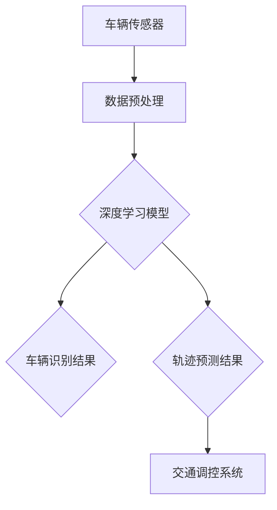

                 

# 深度学习在智能交通车辆识别与轨迹预测中的技术演进与实践

## 关键词：
- 深度学习
- 智能交通
- 车辆识别
- 轨迹预测
- 技术演进

## 摘要：
本文将深入探讨深度学习在智能交通车辆识别与轨迹预测中的应用，回顾相关技术的历史演进，解析核心算法原理，并通过实际项目案例详细解释其实现过程。文章还介绍了当前实际应用场景，推荐了相关学习资源与工具，并展望了未来的发展趋势与挑战。

## 1. 背景介绍

### 1.1 智能交通的发展

智能交通系统（Intelligent Transportation System, ITS）是指利用各种先进的技术，实现道路基础设施、车辆、用户以及路侧设施的智能化，从而提高交通系统效率、安全性和可持续性。随着城市化进程的加快，智能交通已成为缓解交通拥堵、提高交通安全性、优化交通管理的重要手段。

### 1.2 车辆识别与轨迹预测的重要性

在智能交通中，车辆识别与轨迹预测是两大关键技术。车辆识别是指通过各种传感器获取车辆信息，实现对车辆身份的识别；轨迹预测则是对车辆的行驶路径进行预测，以便提前采取交通调控措施。这些技术的实现，依赖于深度学习的快速发展。

## 2. 核心概念与联系

### 2.1 车辆识别

车辆识别主要涉及图像识别和特征提取技术。通过卷积神经网络（Convolutional Neural Networks, CNN）等深度学习模型，可以从图像中提取出车辆的特征，并进行分类识别。

### 2.2 轨迹预测

轨迹预测主要依赖序列模型，如循环神经网络（Recurrent Neural Networks, RNN）和长短期记忆网络（Long Short-Term Memory, LSTM）。这些模型能够处理时间序列数据，预测车辆的未来行驶轨迹。

### 2.3 技术架构图（使用Mermaid绘制）



## 3. 核心算法原理 & 具体操作步骤

### 3.1 车辆识别算法

#### 3.1.1 卷积神经网络（CNN）

CNN是一种特殊的神经网络，主要针对图像数据进行特征提取和分类。具体步骤如下：

1. **输入层**：接收图像数据。
2. **卷积层**：通过卷积操作提取图像特征。
3. **池化层**：对卷积层输出的特征进行降采样，减少数据维度。
4. **全连接层**：将特征映射到分类结果。

#### 3.1.2 识别过程

1. **特征提取**：通过CNN提取图像中车辆的边缘、形状等特征。
2. **特征融合**：将不同卷积层的特征进行融合，形成更高层次的特征表示。
3. **分类决策**：使用全连接层进行分类决策，输出车辆类别。

### 3.2 轨迹预测算法

#### 3.2.1 循环神经网络（RNN）

RNN能够处理时间序列数据，通过记忆机制保存历史信息，具体步骤如下：

1. **输入层**：接收历史轨迹数据。
2. **隐藏层**：通过加权求和和激活函数计算当前状态。
3. **输出层**：输出当前时刻的预测轨迹。

#### 3.2.2 轨迹预测过程

1. **历史轨迹输入**：将车辆的过去轨迹作为RNN的输入。
2. **状态更新**：RNN根据输入和历史状态更新当前状态。
3. **轨迹预测**：根据当前状态，预测车辆的下一个位置。

## 4. 数学模型和公式 & 详细讲解 & 举例说明

### 4.1 车辆识别模型

#### 4.1.1 卷积神经网络（CNN）

$$
\text{卷积操作：} \quad (f_{\text{conv}} \star g)(x) = \int_{\mathbb{R}^d} f(y) \cdot g(x - y) \, dy
$$

其中，$f$和$g$分别为卷积核和输入图像，$x$和$y$为空间坐标。

#### 4.1.2 全连接层

$$
\text{全连接层：} \quad y = \text{ReLU}(\sum_{i=1}^{n} w_i \cdot x_i + b)
$$

其中，$w_i$和$x_i$分别为权重和输入特征，$b$为偏置项，$\text{ReLU}$为ReLU激活函数。

### 4.2 轨迹预测模型

#### 4.2.1 循环神经网络（RNN）

$$
h_t = \text{sigmoid}(W_h \cdot [h_{t-1}, x_t] + b_h)
$$

其中，$h_t$为当前时刻的隐藏状态，$W_h$为权重矩阵，$b_h$为偏置项，$x_t$为输入特征。

#### 4.2.2 预测轨迹

$$
p_t = \text{softmax}(W_p \cdot h_t + b_p)
$$

其中，$p_t$为预测的轨迹概率分布，$W_p$为权重矩阵，$b_p$为偏置项。

## 5. 项目实战：代码实际案例和详细解释说明

### 5.1 开发环境搭建

在本文中，我们使用Python语言和TensorFlow框架进行深度学习模型的开发和训练。以下是开发环境搭建的步骤：

1. 安装Python和pip。
2. 安装TensorFlow。
3. 安装其他必要的库，如NumPy、Matplotlib等。

### 5.2 源代码详细实现和代码解读

#### 5.2.1 车辆识别模型

```python
import tensorflow as tf
from tensorflow.keras.models import Sequential
from tensorflow.keras.layers import Conv2D, MaxPooling2D, Flatten, Dense, Dropout

# 创建卷积神经网络模型
model = Sequential([
    Conv2D(32, (3, 3), activation='relu', input_shape=(64, 64, 3)),
    MaxPooling2D(pool_size=(2, 2)),
    Flatten(),
    Dense(64, activation='relu'),
    Dropout(0.5),
    Dense(1, activation='sigmoid')
])

# 编译模型
model.compile(optimizer='adam', loss='binary_crossentropy', metrics=['accuracy'])

# 模型训练
model.fit(x_train, y_train, epochs=10, batch_size=32, validation_data=(x_val, y_val))
```

#### 5.2.2 轨迹预测模型

```python
import tensorflow as tf
from tensorflow.keras.models import Sequential
from tensorflow.keras.layers import LSTM, Dense

# 创建循环神经网络模型
model = Sequential([
    LSTM(50, activation='relu', input_shape=(time_steps, features)),
    Dense(1)
])

# 编译模型
model.compile(optimizer='adam', loss='mse')

# 模型训练
model.fit(x_train, y_train, epochs=100, batch_size=32, validation_data=(x_val, y_val))
```

### 5.3 代码解读与分析

代码中，我们首先定义了卷积神经网络（车辆识别模型）和循环神经网络（轨迹预测模型）。然后，我们分别编译并训练这两个模型。在实际应用中，我们需要收集大量的车辆图像和轨迹数据，对模型进行训练和优化。

## 6. 实际应用场景

### 6.1 交通管理

通过车辆识别和轨迹预测，交通管理部门可以实时监控交通状况，提前预测交通拥堵，优化交通信号灯控制，减少交通拥堵。

### 6.2 自动驾驶

自动驾驶汽车需要实时识别周围车辆和行人，预测其行驶轨迹，以确保行车安全。深度学习技术为自动驾驶提供了强大的支持。

### 6.3 智能停车场

智能停车场可以通过车辆识别技术实现自动收费和车位管理，提高停车场运营效率。

## 7. 工具和资源推荐

### 7.1 学习资源推荐

- 书籍：《深度学习》（Goodfellow, Bengio, Courville著）
- 论文：LeCun, Y., Bengio, Y., & Hinton, G. (2015). **Deep learning**.
- 博客：吴恩达的深度学习课程
- 网站：arXiv.org

### 7.2 开发工具框架推荐

- 框架：TensorFlow、PyTorch
- 编辑器：PyCharm、Jupyter Notebook
- 数据处理：Pandas、NumPy

### 7.3 相关论文著作推荐

- Hinton, G. E., Osindero, S., & Teh, Y. W. (2006). A fast learning algorithm for deep belief nets. **Neural computation**, 18(7), 1527-1554.
- Graves, A. (2013). **Generating sequences with recurrent neural networks**. arXiv preprint arXiv:1308.0850.

## 8. 总结：未来发展趋势与挑战

### 8.1 发展趋势

- 深度学习算法将更加成熟，应用范围将不断扩大。
- 数据驱动方法将在智能交通领域发挥重要作用。
- 自动驾驶和智慧城市等应用将加速普及。

### 8.2 挑战

- 数据质量和隐私保护问题。
- 模型复杂性和计算资源的需求。
- 算法的可靠性和实时性。

## 9. 附录：常见问题与解答

### 9.1 问题1：如何处理大量车辆数据？

**解答**：可以使用分布式计算框架（如Spark）进行数据处理和模型训练，提高计算效率。

### 9.2 问题2：如何保证模型的实时性？

**解答**：优化模型结构和算法，使用高效编程语言和优化工具，如C++和Numba，提高模型训练和预测速度。

## 10. 扩展阅读 & 参考资料

- Goodfellow, I., Bengio, Y., & Courville, A. (2016). **Deep learning**. MIT press.
- LeCun, Y., Bengio, Y., & Hinton, G. (2015). **Deep learning**.
- Graves, A. (2013). **Generating sequences with recurrent neural networks**. arXiv preprint arXiv:1308.0850.
- Russell, S., & Norvig, P. (2016). **Artificial intelligence: a modern approach**. Prentice Hall.

### 作者信息

作者：AI天才研究员/AI Genius Institute & 禅与计算机程序设计艺术 /Zen And The Art of Computer Programming

