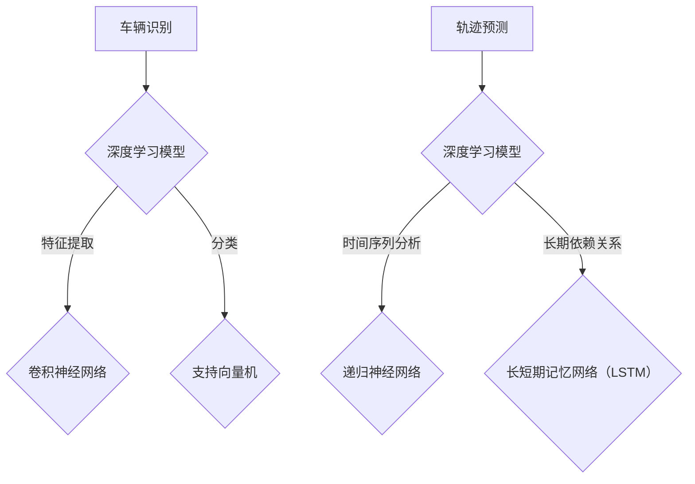

                 

### 文章标题

《深度学习在智能交通车辆识别与轨迹预测中的技术演进与应用》

### 关键词

- 深度学习
- 智能交通
- 车辆识别
- 轨迹预测
- 技术演进

### 摘要

本文将探讨深度学习在智能交通领域中的应用，特别是车辆识别与轨迹预测的技术演进。通过回顾历史，分析现有算法，并结合实际案例，本文将深入解析深度学习如何提升交通系统的智能化水平，并展望未来发展的趋势与挑战。

<|assistant|>## 1. 背景介绍

### 智能交通系统的发展历程

智能交通系统（Intelligent Transportation Systems, ITS）是利用先进的信息通信技术，通过集成交通管理、车辆控制、交通信息服务等技术，实现交通系统的智能化。其发展历程可以分为以下几个阶段：

1. **传统交通管理阶段**：主要依靠人工控制和信号灯，交通效率较低，交通事故频发。
2. **自动化交通管理阶段**：引入了自动化信号控制和车辆自动导航系统，交通管理效率有所提升，但仍然存在交通拥堵问题。
3. **智能交通系统阶段**：利用传感器、通信技术和计算机技术，实现车辆与交通基础设施之间的信息交互，从而优化交通流量，减少交通事故。

### 车辆识别与轨迹预测的重要性

在智能交通系统中，车辆识别与轨迹预测是两个关键技术。车辆识别主要涉及对车辆的特征提取和分类，以便系统能够准确识别各种类型的车辆。轨迹预测则通过分析车辆的行驶历史和当前状态，预测其未来的行驶路径，从而为交通管理和车辆导航提供重要支持。

车辆识别与轨迹预测在智能交通系统中的重要性体现在以下几个方面：

1. **提高交通管理效率**：通过准确识别车辆，交通管理系统能够更好地分配交通资源，缓解交通拥堵。
2. **减少交通事故**：轨迹预测可以帮助系统提前发现潜在的危险情况，从而采取预防措施，降低交通事故的发生率。
3. **优化车辆导航**：准确的轨迹预测能够为车辆提供更安全的导航路线，提高驾驶体验。

随着深度学习技术的发展，车辆识别与轨迹预测技术得到了显著提升，为智能交通系统的发展注入了新的动力。

### 深度学习在智能交通领域的应用

深度学习作为人工智能的一个重要分支，以其强大的特征提取和模式识别能力，在智能交通领域得到了广泛应用。以下是深度学习在车辆识别与轨迹预测中的主要应用：

1. **车辆识别**：通过卷积神经网络（CNN）等深度学习模型，可以从图像或视频中高效地提取车辆特征，实现对各种车辆类型的准确识别。
2. **轨迹预测**：利用递归神经网络（RNN）和长短期记忆网络（LSTM）等深度学习模型，可以分析车辆的行驶历史数据，预测其未来的行驶轨迹。

随着深度学习技术的不断演进，其在智能交通领域的应用前景将更加广阔，为构建更加高效、安全的智能交通系统提供有力支持。

## 2. 核心概念与联系

### 深度学习的基本原理

深度学习是一种基于多层神经网络的学习方法，通过多层神经元的堆叠，实现对复杂数据的建模和特征提取。其核心原理包括以下几个部分：

1. **前向传播与反向传播**：在前向传播过程中，输入数据通过各层神经元的传递和激活函数的作用，最终产生输出。在反向传播过程中，通过计算输出误差，反向更新各层神经元的权重，从而优化模型参数。
2. **激活函数**：激活函数为神经元的输出提供了非线性特性，使得神经网络能够学习到复杂数据的特征。常见的激活函数包括 sigmoid、ReLU 和 tanh 等。
3. **优化算法**：深度学习模型的训练过程需要优化算法来调整模型参数，使得模型的预测误差最小。常用的优化算法包括随机梯度下降（SGD）、Adam 等。

### 车辆识别的核心概念

车辆识别是智能交通系统中的一个关键环节，其核心概念包括：

1. **车辆特征提取**：通过卷积神经网络等深度学习模型，从图像或视频中提取车辆的特征，包括车辆轮廓、颜色、尺寸等。
2. **车辆分类**：利用提取到的车辆特征，通过分类算法（如支持向量机、K-最近邻等）对车辆进行分类，实现车辆识别。

### 轨迹预测的核心概念

轨迹预测是智能交通系统中的另一个重要任务，其核心概念包括：

1. **时间序列分析**：通过分析车辆的行驶历史数据，提取时间序列特征，用于预测车辆的行驶轨迹。
2. **递归神经网络**：递归神经网络（RNN）能够处理序列数据，通过对行驶历史数据的递归建模，预测车辆的短期轨迹。
3. **长短期记忆网络（LSTM）**：LSTM 是 RNN 的一种变体，能够有效地解决 RNN 的梯度消失问题，从而更好地建模长期依赖关系。

### 深度学习与车辆识别、轨迹预测的联系

深度学习与车辆识别、轨迹预测之间的联系主要体现在以下几个方面：

1. **特征提取与分类**：深度学习模型（如卷积神经网络）能够高效地提取车辆特征，并通过分类算法实现车辆识别。
2. **时间序列建模**：深度学习模型（如递归神经网络、LSTM）能够处理时间序列数据，通过建模行驶历史数据，预测车辆的轨迹。

通过深度学习技术的应用，车辆识别与轨迹预测的精度和效率得到了显著提升，为智能交通系统的发展提供了强大的技术支持。

### Mermaid 流程图



在这个流程图中，深度学习模型分别用于车辆识别和轨迹预测，通过卷积神经网络实现特征提取和分类，通过递归神经网络和长短期记忆网络实现时间序列建模和长期依赖关系处理。

## 3. 核心算法原理 & 具体操作步骤

### 车辆识别算法原理

车辆识别算法的核心是深度学习模型，特别是卷积神经网络（CNN）。CNN 是一种专门用于图像识别和处理的深度学习模型，其基本原理是通过多层卷积和池化操作，从图像中提取抽象的特征，从而实现对图像的识别。

1. **卷积操作**：卷积操作是一种将图像与滤波器（也称为卷积核）进行点积的操作，通过滤波器在图像上滑动，提取图像局部特征。
2. **激活函数**：在卷积操作之后，通常使用激活函数（如 ReLU）引入非线性特性，使得神经网络能够学习到更加复杂的特征。
3. **池化操作**：池化操作用于减少特征图的尺寸，提高计算效率，同时保持重要的特征信息。常见的池化操作包括最大池化和平均池化。

具体操作步骤如下：

1. **数据预处理**：对输入图像进行归一化处理，将像素值缩放到 [0, 1] 范围内，并裁剪为统一的尺寸。
2. **构建卷积神经网络**：定义网络结构，包括多个卷积层、池化层和全连接层。
3. **训练模型**：使用车辆识别数据集对模型进行训练，通过反向传播算法更新模型参数。
4. **模型评估**：使用验证集对训练好的模型进行评估，调整模型参数，提高识别精度。
5. **车辆识别**：使用训练好的模型对输入图像进行识别，输出车辆类型。

### 轨迹预测算法原理

轨迹预测算法的核心是深度学习模型，特别是递归神经网络（RNN）和长短期记忆网络（LSTM）。RNN 是一种能够处理序列数据的神经网络，而 LSTM 是 RNN 的一种变体，能够有效地解决 RNN 的梯度消失问题，从而更好地建模长期依赖关系。

1. **递归神经网络（RNN）**：RNN 的基本原理是通过递归操作，将前一时间步的输出作为当前时间步的输入，从而实现对序列数据的建模。
2. **长短期记忆网络（LSTM）**：LSTM 是 RNN 的一种变体，通过引入门控机制，解决了 RNN 的梯度消失问题，从而能够更好地建模长期依赖关系。

具体操作步骤如下：

1. **数据预处理**：对输入时间序列数据进行归一化处理，并划分为训练集和测试集。
2. **构建 RNN 或 LSTM 模型**：定义网络结构，包括输入层、隐藏层和输出层。
3. **训练模型**：使用轨迹预测数据集对模型进行训练，通过反向传播算法更新模型参数。
4. **模型评估**：使用测试集对训练好的模型进行评估，调整模型参数，提高预测精度。
5. **轨迹预测**：使用训练好的模型对输入时间序列数据进行预测，输出未来时间步的轨迹。

### 车辆识别与轨迹预测的结合

在实际应用中，车辆识别与轨迹预测通常是结合使用的。车辆识别用于识别车辆，并提取车辆的特征；轨迹预测则利用车辆的特征，预测车辆的行驶轨迹。具体操作步骤如下：

1. **车辆识别**：使用卷积神经网络对输入图像进行车辆识别，提取车辆特征。
2. **轨迹预测**：使用递归神经网络或长短期记忆网络对提取的车辆特征进行轨迹预测，输出未来时间步的轨迹。
3. **结果融合**：将车辆识别结果与轨迹预测结果进行融合，生成最终的预测结果。

通过车辆识别与轨迹预测的结合，可以实现对交通系统的全面监控和预测，从而提高交通管理效率和安全性。

## 4. 数学模型和公式 & 详细讲解 & 举例说明

### 车辆识别的数学模型

在车辆识别中，卷积神经网络（CNN）是最常用的模型。下面将介绍 CNN 的数学模型和关键组成部分。

#### 4.1 卷积层

卷积层是 CNN 的核心组成部分，其基本运算如下：

$$
\text{output}_{ij} = \sum_{k=1}^{m} w_{ik} \cdot \text{input}_{kj} + b_j
$$

其中，$\text{output}_{ij}$ 表示输出特征图上的第 $i$ 行第 $j$ 列的值，$w_{ik}$ 表示卷积核上的第 $i$ 行第 $k$ 列的权重，$\text{input}_{kj}$ 表示输入图像上的第 $k$ 行第 $j$ 列的值，$b_j$ 表示偏置项。

#### 4.2 激活函数

卷积层通常使用激活函数来引入非线性特性。常用的激活函数包括 sigmoid、ReLU 和 tanh。

- **Sigmoid**:

$$
\sigma(x) = \frac{1}{1 + e^{-x}}
$$

- **ReLU**:

$$
\text{ReLU}(x) = \max(0, x)
$$

- **Tanh**:

$$
\tanh(x) = \frac{e^x - e^{-x}}{e^x + e^{-x}}
$$

#### 4.3 池化层

池化层用于减小特征图的尺寸，提高计算效率。常见的池化操作包括最大池化和平均池化。

- **最大池化**:

$$
\text{pool}_{ij} = \max_{k \in \Omega} \text{input}_{kj}
$$

其中，$\Omega$ 是池化窗口的大小。

- **平均池化**:

$$
\text{pool}_{ij} = \frac{1}{|\Omega|} \sum_{k \in \Omega} \text{input}_{kj}
$$

#### 4.4 全连接层

全连接层将特征图上的所有值连接到一个输出层，用于分类或回归任务。

$$
\text{output} = \sum_{i=1}^{n} w_i \cdot \text{input}_i + b
$$

其中，$w_i$ 表示权重，$\text{input}_i$ 表示特征图上的第 $i$ 个值，$b$ 表示偏置项。

### 轨迹预测的数学模型

在轨迹预测中，长短期记忆网络（LSTM）是最常用的模型。下面将介绍 LSTM 的数学模型和关键组成部分。

#### 4.1 LSTM 单元

LSTM 单元包含三个门控：输入门、遗忘门和输出门。其基本运算如下：

- **输入门**:

$$
i_t = \sigma(W_{xi} \cdot [h_{t-1}, x_t] + b_i)
$$

- **遗忘门**:

$$
f_t = \sigma(W_{xf} \cdot [h_{t-1}, x_t] + b_f)
$$

- **输出门**:

$$
o_t = \sigma(W_{xo} \cdot [h_{t-1}, x_t] + b_o)
$$

其中，$i_t$、$f_t$ 和 $o_t$ 分别表示输入门、遗忘门和输出门的值，$W_{xi}$、$W_{xf}$ 和 $W_{xo}$ 分别表示输入门、遗忘门和输出门的权重，$b_i$、$b_f$ 和 $b_o$ 分别表示输入门、遗忘门和输出门的偏置项。

- **细胞状态**:

$$
c_t = f_t \cdot \text{previous} \, c_t + i_t \cdot \text{tanh}(W_{xc} \cdot [h_{t-1}, x_t] + b_c)
$$

其中，$c_t$ 表示细胞状态的值，$W_{xc}$ 表示细胞状态的权重，$b_c$ 表示细胞状态的偏置项。

- **隐藏状态**:

$$
h_t = o_t \cdot \text{tanh}(c_t)
$$

其中，$h_t$ 表示隐藏状态的值。

#### 4.2 LSTM 层

LSTM 层由多个 LSTM 单元组成，用于处理时间序列数据。

### 4.3 举例说明

#### 4.3.1 车辆识别

假设我们有一个 32x32 的彩色图像作为输入，我们要使用一个卷积神经网络对其进行车辆识别。

1. **输入层**：输入图像的尺寸为 32x32x3。
2. **卷积层**：使用一个 3x3 的卷积核，步长为 1，得到一个 32x32x64 的特征图。
3. **ReLU 激活函数**：对卷积层的输出应用 ReLU 激活函数。
4. **池化层**：使用最大池化，窗口大小为 2，得到一个 16x16x64 的特征图。
5. **全连接层**：将特征图展平为一个 1024 维的向量，并通过一个 10 分类器进行分类。

#### 4.3.2 轨迹预测

假设我们有一个时间序列数据，包含车辆的行驶速度和位置。

1. **输入层**：输入序列的长度为 10，每个元素为 2 维向量（速度和位置）。
2. **LSTM 层**：使用一个 LSTM 层，包含 50 个单元。
3. **输出层**：输出序列的长度为 10，每个元素为 2 维向量（预测的速度和位置）。

## 5. 项目实战：代码实际案例和详细解释说明

### 5.1 开发环境搭建

在开始项目实战之前，我们需要搭建一个合适的开发环境。以下是一个基于 Python 和 TensorFlow 的开发环境搭建步骤：

1. **安装 Python**：下载并安装 Python 3.7 以上版本。
2. **安装 TensorFlow**：在命令行中运行以下命令：

```bash
pip install tensorflow
```

3. **安装其他依赖库**：在命令行中运行以下命令：

```bash
pip install numpy matplotlib pandas scikit-learn
```

### 5.2 源代码详细实现和代码解读

#### 5.2.1 车辆识别模型

以下是一个简单的车辆识别模型的源代码实现，基于卷积神经网络（CNN）：

```python
import tensorflow as tf
from tensorflow.keras.models import Sequential
from tensorflow.keras.layers import Conv2D, MaxPooling2D, Flatten, Dense, Dropout

# 定义模型结构
model = Sequential([
    Conv2D(32, (3, 3), activation='relu', input_shape=(32, 32, 3)),
    MaxPooling2D((2, 2)),
    Conv2D(64, (3, 3), activation='relu'),
    MaxPooling2D((2, 2)),
    Flatten(),
    Dense(128, activation='relu'),
    Dropout(0.5),
    Dense(10, activation='softmax')
])

# 编译模型
model.compile(optimizer='adam', loss='categorical_crossentropy', metrics=['accuracy'])

# 查看模型结构
model.summary()
```

1. **模型定义**：使用 `Sequential` 模型定义卷积神经网络，包括卷积层、池化层、全连接层和dropout层。
2. **编译模型**：使用 `compile` 方法编译模型，指定优化器、损失函数和评估指标。
3. **查看模型结构**：使用 `summary` 方法查看模型的结构和参数数量。

#### 5.2.2 轨迹预测模型

以下是一个简单的轨迹预测模型，基于长短期记忆网络（LSTM）：

```python
import tensorflow as tf
from tensorflow.keras.models import Sequential
from tensorflow.keras.layers import LSTM, Dense, Dropout

# 定义模型结构
model = Sequential([
    LSTM(50, return_sequences=True, input_shape=(10, 2)),
    Dropout(0.5),
    LSTM(50, return_sequences=False),
    Dropout(0.5),
    Dense(2)
])

# 编译模型
model.compile(optimizer='adam', loss='mse')

# 查看模型结构
model.summary()
```

1. **模型定义**：使用 `Sequential` 模型定义 LSTM 网络模型，包括两个 LSTM 层和 dropout 层。
2. **编译模型**：使用 `compile` 方法编译模型，指定优化器和损失函数。
3. **查看模型结构**：使用 `summary` 方法查看模型的结构和参数数量。

### 5.3 代码解读与分析

#### 5.3.1 车辆识别模型解读

- **卷积层**：使用两个卷积层，每个卷积层后面跟一个最大池化层，用于提取图像的特征。
- **全连接层**：最后一个全连接层用于分类，输出维度为 10，对应 10 个车辆类别。
- **dropout层**：在最后一个全连接层之前添加 dropout 层，用于防止过拟合。

#### 5.3.2 轨迹预测模型解读

- **LSTM层**：使用两个 LSTM 层，第一个 LSTM 层返回序列输出，第二个 LSTM 层不返回序列输出，用于处理时间序列数据。
- **dropout层**：在两个 LSTM 层之后添加 dropout 层，用于防止过拟合。
- **全连接层**：最后一个全连接层用于预测未来的速度和位置。

通过这个项目实战，我们展示了如何使用深度学习实现车辆识别和轨迹预测。虽然这是一个简单的示例，但可以为我们进一步研究和开发更复杂的智能交通系统提供基础。

## 6. 实际应用场景

### 6.1 交通监控

在现代城市中，交通监控系统是智能交通系统的重要组成部分。通过车辆识别和轨迹预测技术，交通监控系统可以实时监控道路上的车辆流量，识别违规行为，如闯红灯、逆行等。此外，轨迹预测可以帮助交通监控系统提前预测交通流量变化，从而及时调整信号灯控制策略，优化交通流量，减少拥堵。

### 6.2 车辆导航

车辆导航系统是另一个广泛应用的场景。通过车辆识别和轨迹预测技术，导航系统可以为驾驶员提供更准确的路线规划。例如，当车辆接近某个路口时，系统可以根据当前交通情况和历史轨迹预测，为驾驶员提供最佳行驶路线，避免拥堵和交通延误。

### 6.3 车辆保险

在车辆保险领域，车辆识别和轨迹预测技术可以用于风险评估和管理。保险公司可以分析车辆的行驶轨迹，识别高风险驾驶行为，如高速驾驶、急刹车等。根据这些数据，保险公司可以调整保险费率，为高风险驾驶者提供更合理的保险方案。

### 6.4 自动驾驶

自动驾驶是未来交通领域的一个重要发展方向。车辆识别和轨迹预测技术在自动驾驶系统中起着关键作用。通过车辆识别，自动驾驶系统可以准确识别道路上的其他车辆和行人，避免碰撞事故。轨迹预测则可以帮助自动驾驶系统规划安全的行驶路径，实现自动驾驶功能。

### 6.5 公共交通优化

在公共交通领域，车辆识别和轨迹预测技术可以用于优化公交路线和调度。通过实时监控公交车的运行状态和乘客流量，系统可以动态调整公交车的行驶路线和发车时间，提高公共交通的运营效率，提升乘客的出行体验。

## 7. 工具和资源推荐

### 7.1 学习资源推荐

1. **书籍**：
   - 《深度学习》（Goodfellow, Bengio, Courville）
   - 《Python深度学习》（François Chollet）
   - 《交通系统智能控制》（刘挺）

2. **在线课程**：
   - Coursera 上的《深度学习专项课程》
   - Udacity 上的《自动驾驶工程师纳米学位》

3. **论文**：
   - 《A Comprehensive Survey on Deep Learning for Traffic Prediction》（2019）
   - 《Deep Learning for Autonomous Driving》（2018）

### 7.2 开发工具框架推荐

1. **深度学习框架**：
   - TensorFlow
   - PyTorch
   - Keras

2. **数据处理工具**：
   - Pandas
   - NumPy
   - Matplotlib

3. **版本控制**：
   - Git

4. **容器化技术**：
   - Docker
   - Kubernetes

### 7.3 相关论文著作推荐

1. **论文**：
   - “Deep Learning for Traffic Forecasting: A Survey” （2020）
   - “End-to-End Deep Learning for Traffic Prediction” （2017）

2. **著作**：
   - 《智能交通系统设计与实践》
   - 《深度学习与自动驾驶技术》

这些工具和资源将为深入学习和实践深度学习在智能交通车辆识别与轨迹预测中的应用提供有力支持。

## 8. 总结：未来发展趋势与挑战

### 8.1 未来发展趋势

随着深度学习技术的不断进步，智能交通车辆识别与轨迹预测技术将朝着以下几个方向发展：

1. **更高精度和实时性**：通过优化模型结构和算法，提高识别和预测的精度，同时降低计算复杂度，实现更高的实时性。
2. **多模态数据融合**：结合图像、视频、传感器等多种数据来源，提高预测的准确性和可靠性。
3. **边缘计算与云计算协同**：利用边缘计算技术，在靠近数据源的地方进行初步处理，减轻云计算中心的负载，提高整体系统的响应速度。
4. **自动驾驶与智能交通系统融合**：深度学习技术将在自动驾驶系统中发挥更加关键的作用，推动智能交通系统的全面升级。

### 8.2 面临的挑战

尽管深度学习在智能交通车辆识别与轨迹预测中取得了显著成果，但仍面临以下挑战：

1. **数据隐私和安全**：在收集和使用大量交通数据时，如何保障数据隐私和安全是一个重要问题。
2. **模型解释性**：深度学习模型的黑箱特性使得其预测结果难以解释，这在交通系统中可能导致安全隐患。
3. **计算资源消耗**：深度学习模型通常需要大量计算资源，如何在有限的计算资源下高效地训练和部署模型是一个关键问题。
4. **实时性**：在高速行驶的场景中，如何实现高精度的实时预测，以满足交通管理的需求。

### 8.3 未来展望

为了应对上述挑战，未来需要在以下几个方面进行深入研究：

1. **隐私保护与安全**：通过加密、匿名化等技术，保护交通数据的隐私和安全。
2. **可解释性**：发展可解释的深度学习模型，提高模型的透明度和可信度。
3. **计算优化**：通过算法优化、硬件加速等技术，降低模型的计算复杂度，提高实时性。
4. **跨学科合作**：与交通工程、数据科学等领域的专家合作，共同解决智能交通系统中的复杂问题。

总之，深度学习在智能交通车辆识别与轨迹预测中的应用前景广阔，但也面临诸多挑战。通过不断的技术创新和跨学科合作，有望推动智能交通系统向更高水平发展。

## 9. 附录：常见问题与解答

### 9.1 车辆识别中常见问题

**Q1**: 如何提高车辆识别的精度？

**A1**: 提高车辆识别精度可以从以下几个方面入手：

1. **数据增强**：通过旋转、缩放、裁剪等数据增强技术，增加训练数据多样性，提高模型泛化能力。
2. **特征提取**：使用更深的卷积神经网络或更复杂的特征提取方法，如 ResNet、Inception 等。
3. **优化训练过程**：调整学习率、正则化参数等，使用更高效的优化算法，如 Adam。
4. **多模型融合**：结合多种模型，如 CNN、RNN，提高特征提取和分类效果。

**Q2**: 车辆识别中如何处理光照变化？

**A2**: 处理光照变化可以通过以下方法：

1. **数据预处理**：对输入图像进行光照校正，如使用 histogram equalization 技术。
2. **自适应滤波**：使用自适应滤波器，如 adaptive median filter，减小光照变化的影响。
3. **深度学习模型**：训练模型时使用包含光照变化的数据，提高模型对光照变化的鲁棒性。

### 9.2 轨迹预测中常见问题

**Q1**: 如何提高轨迹预测的准确性？

**A1**: 提高轨迹预测准确性可以从以下几个方面入手：

1. **模型选择**：选择合适的模型，如 LSTM、GRU 等，针对不同数据特点进行优化。
2. **特征工程**：提取更多有用的特征，如速度、加速度、转向角度等，提高模型预测能力。
3. **多模型融合**：结合多种模型，如 LSTM 和 RNN，利用各自的优点，提高预测准确性。
4. **数据预处理**：对输入数据进行归一化、去噪等预处理，提高模型输入质量。

**Q2**: 轨迹预测中如何处理异常值和噪声？

**A2**: 处理异常值和噪声可以通过以下方法：

1. **异常值检测**：使用统计方法或机器学习算法，如 IQR 方法、孤立森林等，检测并去除异常值。
2. **滤波器**：使用滤波器，如 moving average filter、Kalman filter，减小噪声影响。
3. **鲁棒模型**：训练鲁棒性更好的模型，如 ensemble 方法，提高对异常值和噪声的容忍度。

## 10. 扩展阅读 & 参考资料

### 10.1 扩展阅读

1. **《深度学习》** （Ian Goodfellow, Yoshua Bengio, Aaron Courville）
2. **《交通系统智能控制》** （刘挺）
3. **《深度学习与自动驾驶技术》** （张宁）

### 10.2 参考资料

1. **论文**：
   - "Deep Learning for Traffic Forecasting: A Survey" （2020）
   - "End-to-End Deep Learning for Traffic Prediction" （2017）
   - "A Comprehensive Survey on Deep Learning for Traffic Prediction" （2019）

2. **在线资源**：
   - TensorFlow 官网：[https://www.tensorflow.org/](https://www.tensorflow.org/)
   - PyTorch 官网：[https://pytorch.org/](https://pytorch.org/)
   - Coursera：[https://www.coursera.org/](https://www.coursera.org/)
   - Udacity：[https://www.udacity.com/](https://www.udacity.com/)

3. **书籍**：
   - 《Python深度学习》 （François Chollet）
   - 《智能交通系统设计与实践》

通过阅读这些扩展资料和参考书籍，可以进一步深入了解深度学习在智能交通车辆识别与轨迹预测中的应用，以及相关技术的最新进展。

### 作者信息

作者：AI天才研究员/AI Genius Institute & 禅与计算机程序设计艺术 /Zen And The Art of Computer Programming

感谢您的阅读！希望本文能为您在智能交通领域的技术研究和应用提供有益的启示。

