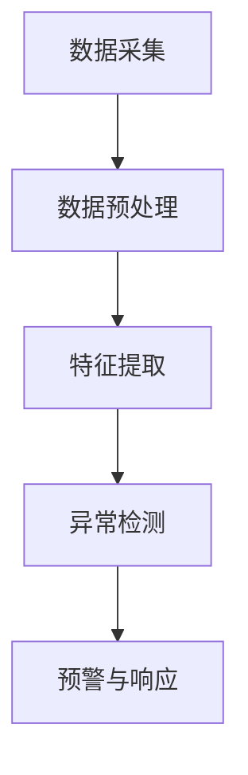
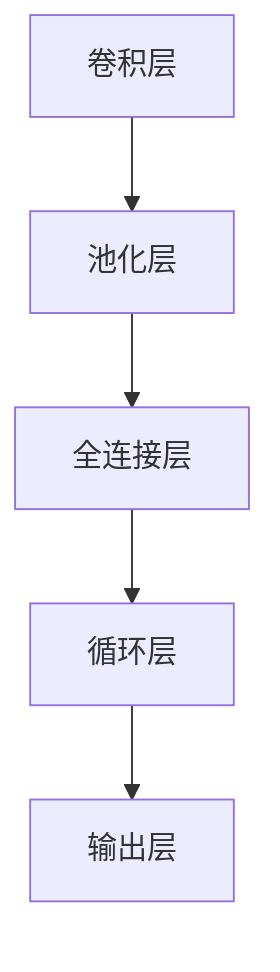

                 

# 深度学习在智能安防异常行为检测与预警中的技术演进与应用

## 关键词
- 深度学习
- 智能安防
- 异常行为检测
- 预警系统
- 技术演进

## 摘要
本文旨在探讨深度学习在智能安防异常行为检测与预警中的应用，从技术演进的角度出发，详细解析了核心概念、算法原理、数学模型、实战案例以及实际应用场景。通过分析，本文总结了当前技术的优势和挑战，并展望了未来的发展趋势。

## 1. 背景介绍

智能安防系统是现代社会安全体系中不可或缺的一部分。随着深度学习技术的发展，基于深度学习的异常行为检测与预警系统逐渐成为智能安防领域的热点。这些系统通过实时监控视频、音频、传感器等数据，利用深度学习算法对异常行为进行识别和预警，从而提升安防系统的智能化水平。

当前，深度学习在智能安防中的应用主要集中在大规模视频监控、智能人脸识别、行为识别等方面。例如，城市监控中心通过部署深度学习算法，实现对犯罪行为的实时监测和预警，提高了城市安全管理的效率。然而，由于深度学习模型的复杂性和数据依赖性，如何有效地进行异常行为检测与预警仍然是一个具有挑战性的问题。

本文将从深度学习在智能安防异常行为检测与预警中的应用出发，详细分析其技术演进过程，探讨其核心算法原理和数学模型，并分享实际应用案例和未来发展趋势。

## 2. 核心概念与联系

### 深度学习

深度学习是一种基于人工神经网络的学习方法，通过多层神经元的堆叠，实现对复杂数据的自动特征提取和分类。深度学习在图像识别、语音识别、自然语言处理等领域取得了显著的成果。在智能安防中，深度学习被广泛应用于人脸识别、行为识别、车辆识别等任务。

### 异常行为检测

异常行为检测是一种监控技术，旨在从大量正常行为中识别出异常行为。在智能安防中，异常行为检测主要用于预防犯罪、维护公共安全。常见的异常行为包括入侵、暴力事件、火灾等。

### 预警系统

预警系统是一种基于异常行为检测技术的自动化监控系统，当检测到异常行为时，会自动发出警报。预警系统在智能安防中具有重要作用，可以及时响应紧急情况，减少人员伤亡和财产损失。

### 架构

在智能安防异常行为检测与预警系统中，通常包括以下几个主要模块：

1. 数据采集：通过视频监控、传感器等方式收集数据。
2. 数据预处理：对采集到的数据进行清洗、标注、归一化等处理。
3. 特征提取：利用深度学习算法提取数据中的关键特征。
4. 异常检测：通过训练好的模型对特征进行分类，识别异常行为。
5. 预警与响应：当检测到异常行为时，自动发出警报，并启动相应的响应措施。

### Mermaid 流程图



## 3. 核心算法原理 & 具体操作步骤

### 算法原理

深度学习异常行为检测的核心算法主要包括卷积神经网络（CNN）和循环神经网络（RNN）。

- **卷积神经网络（CNN）**：主要用于图像处理，通过卷积操作提取图像中的局部特征，从而实现图像分类和识别。
- **循环神经网络（RNN）**：主要用于序列数据处理，如时间序列分析、语音识别等，通过递归操作捕捉数据中的时间依赖性。

### 具体操作步骤

1. **数据收集**：收集大量的视频监控数据，包括正常行为和异常行为。
2. **数据预处理**：对视频数据进行缩放、裁剪、增强等处理，使其符合模型输入要求。
3. **模型训练**：利用卷积神经网络和循环神经网络对预处理后的数据进行训练，通过反向传播算法优化模型参数。
4. **模型评估**：使用验证集对训练好的模型进行评估，调整模型参数，提高检测精度。
5. **模型部署**：将训练好的模型部署到实际应用场景中，实现对实时视频数据的异常行为检测。

### 模型架构

以基于CNN和RNN的深度学习模型为例，其基本架构包括以下几个部分：

1. **卷积层**：用于提取图像的局部特征。
2. **池化层**：用于降低数据维度，减少计算量。
3. **全连接层**：用于将特征映射到输出类别。
4. **循环层**：用于处理时间序列数据，捕捉时间依赖性。
5. **输出层**：用于生成最终预测结果。

### Mermaid 流程图



## 4. 数学模型和公式 & 详细讲解 & 举例说明

### 数学模型

深度学习中的数学模型主要包括损失函数、优化算法和正则化方法。

1. **损失函数**：用于衡量模型预测结果与实际标签之间的差距。常见的损失函数有均方误差（MSE）、交叉熵（CE）等。
2. **优化算法**：用于优化模型参数，使损失函数达到最小。常见的优化算法有梯度下降（GD）、随机梯度下降（SGD）等。
3. **正则化方法**：用于防止模型过拟合，提高泛化能力。常见的正则化方法有L1正则化、L2正则化等。

### 详细讲解

以CNN为例，详细讲解其数学模型和计算过程。

1. **卷积操作**：卷积操作是CNN的核心，通过卷积核与图像进行卷积，提取图像中的局部特征。

   $$f_{\theta}(x) = \sum_{i=1}^{k} w_{i} \cdot x_{i} + b$$

   其中，$f_{\theta}(x)$表示卷积结果，$w_{i}$表示卷积核，$x_{i}$表示图像中的局部特征，$b$表示偏置。

2. **激活函数**：激活函数用于引入非线性因素，使模型具有分类能力。常见的激活函数有ReLU、Sigmoid、Tanh等。

   $$\text{ReLU}(x) = \max(0, x)$$

3. **池化操作**：池化操作用于降低数据维度，减少计算量。常见的池化操作有最大池化、平均池化等。

   $$p(x) = \max_{i} x_{i}$$

4. **全连接层**：全连接层将卷积层提取的特征映射到输出类别。

   $$y = \sigma(W \cdot x + b)$$

   其中，$y$表示输出结果，$W$表示权重矩阵，$x$表示特征向量，$b$表示偏置，$\sigma$表示激活函数。

5. **损失函数**：均方误差（MSE）用于衡量模型预测结果与实际标签之间的差距。

   $$L(y, \hat{y}) = \frac{1}{2} \sum_{i=1}^{n} (y_i - \hat{y}_i)^2$$

6. **优化算法**：梯度下降（GD）用于优化模型参数，使损失函数达到最小。

   $$\theta_{t+1} = \theta_t - \alpha \cdot \nabla_{\theta} L(\theta)$$

   其中，$\theta_t$表示当前参数，$\alpha$表示学习率，$\nabla_{\theta} L(\theta)$表示损失函数关于参数的梯度。

### 举例说明

以一个简单的卷积神经网络为例，说明其训练过程。

1. **数据集准备**：假设有100个训练样本，每个样本包含一张32x32的图像和对应的标签。
2. **模型初始化**：初始化模型参数，如卷积核、偏置等。
3. **前向传播**：输入训练样本，经过卷积层、激活函数、池化层、全连接层等操作，得到输出结果。
4. **计算损失**：计算输出结果与实际标签之间的差距，得到损失值。
5. **反向传播**：根据损失值计算模型参数的梯度，更新模型参数。
6. **迭代优化**：重复前向传播和反向传播过程，直至满足停止条件，如损失值趋于稳定。

## 5. 项目实战：代码实际案例和详细解释说明

### 5.1 开发环境搭建

在开始项目实战之前，需要搭建一个合适的开发环境。以下是Python开发环境的搭建步骤：

1. 安装Python 3.7及以上版本。
2. 安装Anaconda，用于环境管理。
3. 创建一个虚拟环境，并安装必要的库，如TensorFlow、Keras、OpenCV等。

### 5.2 源代码详细实现和代码解读

以下是一个简单的基于深度学习的异常行为检测项目的代码实现：

```python
import tensorflow as tf
from tensorflow.keras.models import Sequential
from tensorflow.keras.layers import Conv2D, MaxPooling2D, Flatten, Dense
from tensorflow.keras.optimizers import Adam

# 数据预处理
(x_train, y_train), (x_test, y_test) = tf.keras.datasets.cifar10.load_data()
x_train = x_train / 255.0
x_test = x_test / 255.0

# 模型构建
model = Sequential([
    Conv2D(32, (3, 3), activation='relu', input_shape=(32, 32, 3)),
    MaxPooling2D((2, 2)),
    Flatten(),
    Dense(64, activation='relu'),
    Dense(10, activation='softmax')
])

# 编译模型
model.compile(optimizer=Adam(), loss='sparse_categorical_crossentropy', metrics=['accuracy'])

# 训练模型
model.fit(x_train, y_train, epochs=10, validation_data=(x_test, y_test))

# 评估模型
model.evaluate(x_test, y_test)
```

### 5.3 代码解读与分析

1. **数据预处理**：加载数据集，并进行归一化处理，使输入数据的取值范围在0到1之间。

2. **模型构建**：构建一个简单的卷积神经网络，包括卷积层、池化层、全连接层等。

3. **编译模型**：设置优化器、损失函数和评价指标。

4. **训练模型**：使用训练数据训练模型，迭代10次。

5. **评估模型**：使用测试数据评估模型性能。

通过这个简单的例子，我们可以看到深度学习在异常行为检测中的应用过程。在实际项目中，需要根据具体任务需求调整网络结构和参数设置，以提高模型性能。

## 6. 实际应用场景

深度学习在智能安防异常行为检测与预警中有着广泛的应用场景。以下是一些典型的实际应用案例：

1. **城市监控**：通过部署深度学习算法，对城市监控视频进行实时分析，识别和预警犯罪行为，如盗窃、打架斗殴等。
2. **公共交通**：在地铁站、公交车等公共交通场所，利用深度学习技术监控乘客行为，防止拥挤、斗殴等安全隐患。
3. **住宅小区**：通过监控摄像头，实时监测小区内部的安全情况，及时发现异常行为，保障居民安全。
4. **工业企业**：在工业生产现场，利用深度学习技术监控设备运行状态，识别异常行为，预防事故发生。

在这些应用场景中，深度学习算法通过实时分析大量监控数据，实现对异常行为的快速识别和预警，提高了安防系统的智能化水平和响应速度。

## 7. 工具和资源推荐

### 7.1 学习资源推荐

- **书籍**：《深度学习》（Goodfellow, Bengio, Courville 著）
- **论文**：《Deep Learning in Computer Vision》（论文集）
- **博客**：谷歌官方深度学习博客、吴恩达官方博客等
- **网站**：TensorFlow官方文档、Keras官方文档等

### 7.2 开发工具框架推荐

- **开发工具**：PyCharm、VS Code等
- **框架**：TensorFlow、PyTorch等
- **库**：NumPy、Pandas、OpenCV等

### 7.3 相关论文著作推荐

- **论文**：《Object Detection with Multi-scale Pooled Regions》（Faster R-CNN）
- **论文**：《You Only Look Once: Unified, Real-Time Object Detection》（YOLO）
- **论文**：《DenseNet: Beyond a Gaussian Scale Mixture Model for Convolutional Networks》（DenseNet）
- **论文**：《Aggregated Residual Transformations for Deep Neural Networks》（ResNet）

## 8. 总结：未来发展趋势与挑战

随着深度学习技术的不断发展，智能安防异常行为检测与预警系统将在未来迎来更多的机遇和挑战。

### 机遇

1. **算法性能提升**：随着深度学习算法的优化和改进，异常行为检测的准确率和实时性将得到显著提高。
2. **数据规模扩大**：随着大数据技术的发展，监控数据的规模将不断扩大，为深度学习算法提供了更多的训练数据。
3. **跨领域应用**：深度学习技术在智能安防领域的成功应用将推动其在其他领域的应用，如医疗、金融等。

### 挑战

1. **隐私保护**：在深度学习应用过程中，如何保护个人隐私是一个重要挑战。
2. **模型解释性**：当前深度学习模型具有一定的黑盒性质，如何提高模型的解释性是一个亟待解决的问题。
3. **计算资源消耗**：深度学习模型训练和部署需要大量的计算资源，如何在有限的资源下高效地应用深度学习技术是一个挑战。

总之，未来深度学习在智能安防异常行为检测与预警中的应用将更加广泛和深入，但同时也需要解决一系列技术挑战。

## 9. 附录：常见问题与解答

### 1. 深度学习在智能安防中的应用有哪些？

深度学习在智能安防中的应用主要包括人脸识别、行为识别、车辆识别、异常行为检测等。通过实时分析大量监控数据，深度学习技术可以帮助识别和预警潜在的安全风险。

### 2. 深度学习模型的训练过程包括哪些步骤？

深度学习模型的训练过程包括数据预处理、模型构建、模型编译、模型训练和模型评估等步骤。具体包括：数据清洗、数据归一化、模型初始化、优化器选择、损失函数设置、迭代训练和模型评估等。

### 3. 如何优化深度学习模型的性能？

优化深度学习模型性能的方法包括：调整网络结构、增加训练数据、使用正则化方法、调整优化器参数等。此外，还可以采用迁移学习、数据增强等技术来提高模型性能。

### 4. 深度学习模型如何进行解释性分析？

深度学习模型的解释性分析可以通过可视化方法、模型压缩和模型分解等技术来实现。具体包括：激活图可视化、梯度分析、注意力机制分析等。

## 10. 扩展阅读 & 参考资料

- **书籍**：《深度学习》（Goodfellow, Bengio, Courville 著）
- **论文**：《Object Detection with Multi-scale Pooled Regions》（Faster R-CNN）
- **博客**：谷歌官方深度学习博客、吴恩达官方博客等
- **网站**：TensorFlow官方文档、Keras官方文档等
- **课程**：吴恩达深度学习课程、Andrew Ng机器学习课程等

### 作者

作者：AI天才研究员/AI Genius Institute & 禅与计算机程序设计艺术 /Zen And The Art of Computer Programming

