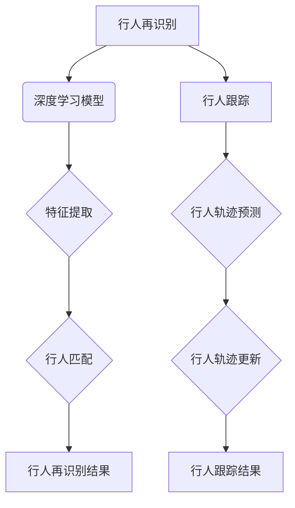

                 

### 1. 背景介绍

随着城市化进程的加快，人口密集区域的公共安全问题愈发凸显。智能安防系统作为公共安全领域的重要工具，正逐步成为现代城市安全体系的关键组成部分。智能安防系统不仅能够有效提升公共安全的响应速度，还能大幅提高安全事件的预防能力。

在智能安防系统中，行人再识别与跟踪是一项至关重要的技术。行人再识别指的是在监控视频流中，能够识别出特定行人的过程。而行人跟踪则是将识别出的行人进行实时定位和轨迹分析，以实现对目标行人的持续监控。这两种技术结合，可以用于犯罪预防、嫌疑人追踪、失踪人口查找等多个领域。

传统的行人再识别与跟踪技术主要依赖于手工特征提取和简单的匹配算法。然而，随着深度学习技术的发展，这些传统方法逐渐被深度学习算法所取代。深度学习算法通过训练大规模的数据集，自动提取具有区分度的特征，从而在行人再识别与跟踪任务中表现出色。

本文将围绕深度学习在智能安防行人再识别与跟踪中的技术演进与应用进行详细探讨。文章将首先介绍深度学习的基本概念及其在图像处理领域的应用，然后深入分析行人再识别与跟踪中的关键技术和算法原理，最后通过具体项目实战，展示深度学习算法在实际应用中的效果与挑战。

通过对本文的学习，读者将能够：

- 理解深度学习的基础知识及其在图像处理中的重要性。
- 掌握行人再识别与跟踪的关键技术，包括特征提取、模型训练和跟踪算法。
- 了解深度学习算法在实际安防项目中的应用，并学会如何优化算法性能。
- 讨论深度学习在智能安防行人再识别与跟踪中的未来发展前景与挑战。

让我们一步一步地深入探讨这一领域的奥秘，揭开深度学习在智能安防中的应用面纱。

### 2. 核心概念与联系

#### 深度学习的基本概念

深度学习（Deep Learning）是人工智能（AI）的一个重要分支，其核心思想是通过构建大规模的神经网络模型，让计算机自动从数据中学习特征和模式。与传统的机器学习方法不同，深度学习模型具有自学习、自适应的能力，能够在复杂、高维的数据中提取有意义的特征。

深度学习的核心组成部分包括：

1. **神经网络**：神经网络是深度学习的基础，其结构类似于人脑的神经元连接。通过层层神经元的连接与传递，神经网络能够对输入数据进行分析和处理。
2. **激活函数**：激活函数用于对神经元的输出进行非线性变换，使得神经网络能够捕捉数据中的复杂模式。
3. **损失函数**：损失函数用于衡量模型的预测结果与真实结果之间的差距，指导模型进行参数调整。
4. **优化算法**：优化算法用于最小化损失函数，从而优化模型参数。

#### 深度学习在图像处理中的应用

在图像处理领域，深度学习技术通过卷积神经网络（Convolutional Neural Networks，CNN）实现了许多突破。CNN 通过一系列卷积层、池化层和全连接层的组合，能够自动提取图像中的高层次特征，从而在图像分类、目标检测、图像分割等多个任务中表现出色。

以下是深度学习在图像处理中应用的一些典型例子：

1. **图像分类**：通过训练深度学习模型，可以将图像分为不同的类别。例如，常见的ImageNet图像分类任务，通过卷积神经网络将数百万张图像分类为1000多个类别。
2. **目标检测**：目标检测是一种在图像中识别并定位多个目标的技术。例如，R-CNN、Fast R-CNN、Faster R-CNN等模型通过深度学习技术，实现了对图像中行人的精准检测和定位。
3. **图像分割**：图像分割是将图像中的每个像素划分为不同的类别。深度学习方法，如U-Net、SegNet等，通过训练能够实现高效的图像分割。

#### 行人再识别与跟踪中的技术联系

在行人再识别与跟踪中，深度学习技术发挥着至关重要的作用。行人再识别主要依赖于深度学习模型对行人的特征提取和匹配。具体来说，深度学习模型通过训练大规模的行人数据集，自动提取具有区分度的特征，如身体轮廓、服饰特征等，从而实现对行人的准确识别。

行人跟踪则依赖于深度学习模型对行人轨迹的预测和定位。常用的跟踪算法包括基于模型的跟踪（Model-Based Tracking）和基于数据关联的跟踪（Data Association-Based Tracking）。基于模型的跟踪通过建立行人模型，对行人进行预测和更新。而基于数据关联的跟踪则通过分析多个摄像头观测到的行人信息，进行数据关联和行人轨迹的重建。

#### Mermaid 流程图

为了更直观地展示行人再识别与跟踪中的技术联系，我们可以使用Mermaid流程图进行描述。



在上述流程图中，深度学习模型负责行人特征提取和行人匹配，从而实现行人再识别。行人跟踪则通过行人轨迹预测和更新，实现对行人轨迹的持续监控。这两个过程紧密联系，共同构成了智能安防行人再识别与跟踪的核心技术。

### 3. 核心算法原理 & 具体操作步骤

在深度学习领域，行人再识别与跟踪的核心算法主要包括特征提取和轨迹预测两部分。以下将详细介绍这些算法的基本原理及具体操作步骤。

#### 3.1 特征提取算法

特征提取是行人再识别任务的关键步骤，其目的是从图像中提取具有区分度的特征，用于后续的行人匹配。常用的特征提取算法包括卷积神经网络（CNN）和深度特征嵌入（Deep Feature Embedding）。

1. **卷积神经网络（CNN）**

   卷积神经网络是一种专门用于处理图像数据的深度学习模型。其基本结构包括卷积层、池化层和全连接层。

   - **卷积层**：卷积层通过卷积操作提取图像中的局部特征。每个卷积核都对应一个特征图，卷积操作将图像与卷积核进行卷积，得到特征图。
   - **池化层**：池化层用于减小特征图的尺寸，降低模型的参数数量，提高模型的泛化能力。常见的池化方法包括最大池化和平均池化。
   - **全连接层**：全连接层将卷积层和池化层提取的特征进行融合，输出最终的分类结果。

   具体操作步骤如下：

   1. 输入行人图像。
   2. 通过卷积层提取图像中的局部特征。
   3. 通过池化层减小特征图的尺寸。
   4. 将池化后的特征输入全连接层。
   5. 通过全连接层得到行人特征向量。

2. **深度特征嵌入（Deep Feature Embedding）**

   深度特征嵌入是一种将图像特征映射到高维空间的算法。其主要目的是通过学习一个映射函数，将相似的图像映射到空间中的相邻位置，而将不同的图像映射到空间的远离位置。

   具体操作步骤如下：

   1. 输入行人图像。
   2. 通过卷积神经网络提取图像特征。
   3. 将提取的特征输入到一个全连接层。
   4. 通过全连接层得到行人特征向量。
   5. 使用反向传播算法优化映射函数，使相似图像的特征向量更接近。

#### 3.2 轨迹预测算法

轨迹预测是行人跟踪任务的核心，其目的是根据行人的历史轨迹，预测行人未来的运动方向和位置。常用的轨迹预测算法包括基于模型的跟踪和基于数据关联的跟踪。

1. **基于模型的跟踪**

   基于模型的跟踪通过建立行人模型，对行人进行预测和更新。其基本原理是，将行人模型与当前观测到的行人特征进行匹配，根据匹配结果更新行人模型。

   具体操作步骤如下：

   1. 输入行人历史轨迹。
   2. 建立行人运动模型。
   3. 对行人当前特征进行预测。
   4. 计算行人预测轨迹与当前观测轨迹的匹配度。
   5. 根据匹配度更新行人模型。

2. **基于数据关联的跟踪**

   基于数据关联的跟踪通过分析多个摄像头观测到的行人信息，进行数据关联和行人轨迹的重建。其基本原理是，将不同摄像头观测到的行人特征进行关联，根据关联结果重建行人轨迹。

   具体操作步骤如下：

   1. 输入行人历史轨迹。
   2. 对行人当前特征进行多摄像头观测。
   3. 计算行人特征之间的相似度。
   4. 根据相似度进行行人特征关联。
   5. 根据关联结果重建行人轨迹。

通过以上算法，深度学习能够实现对行人的有效特征提取和轨迹预测，从而在智能安防行人再识别与跟踪任务中发挥重要作用。

### 4. 数学模型和公式 & 详细讲解 & 举例说明

在深度学习领域，行人再识别与跟踪中的数学模型和公式起到了至关重要的作用。以下我们将详细讲解这些数学模型和公式，并通过具体例子进行说明。

#### 4.1 卷积神经网络（CNN）中的数学模型

卷积神经网络（CNN）是一种专门用于图像处理的深度学习模型。其核心数学模型包括卷积层、池化层和全连接层。

1. **卷积层**

   卷积层通过卷积操作提取图像中的局部特征。卷积操作的数学表达式如下：

   $$
   \text{conv}(x, \text{w}) = \text{sign}(\text{w} \cdot \text{x} + \text{b})
   $$

   其中，$\text{x}$为输入图像，$\text{w}$为卷积核（即滤波器），$\text{b}$为偏置项，$\text{sign}$为激活函数，通常使用ReLU（Rectified Linear Unit）函数。

   例如，假设输入图像$\text{x}$为3x3的矩阵，卷积核$\text{w}$为3x3的矩阵，偏置项$\text{b}$为1，激活函数为ReLU函数，则卷积层的输出可以表示为：

   $$
   \text{conv}(\text{x}, \text{w}) = \text{ReLU}(\text{w} \cdot \text{x} + \text{b})
   $$

2. **池化层**

   池化层用于减小特征图的尺寸，降低模型的参数数量。常见的池化方法包括最大池化和平均池化。

   - **最大池化**：最大池化的数学表达式如下：

     $$
     \text{pool}(\text{X}, 2, \text{max}) = \max(\text{X}_{11}, \text{X}_{12}, \text{X}_{21}, \text{X}_{22})
     $$

     其中，$\text{X}$为输入特征图，2为池化窗口大小。

     例如，假设输入特征图$\text{X}$为4x4的矩阵，池化窗口大小为2，则最大池化后的输出可以表示为：

     $$
     \text{pool}(\text{X}, 2, \text{max}) = \max(\text{X}_{11}, \text{X}_{12}, \text{X}_{21}, \text{X}_{22}) = \max(3, 2, 1, 4) = 4
     $$

   - **平均池化**：平均池化的数学表达式如下：

     $$
     \text{pool}(\text{X}, 2, \text{mean}) = \frac{\text{X}_{11} + \text{X}_{12} + \text{X}_{21} + \text{X}_{22}}{4}
     $$

     例如，假设输入特征图$\text{X}$为4x4的矩阵，池化窗口大小为2，则平均池化后的输出可以表示为：

     $$
     \text{pool}(\text{X}, 2, \text{mean}) = \frac{3 + 2 + 1 + 4}{4} = 2.5
     $$

3. **全连接层**

   全连接层将卷积层和池化层提取的特征进行融合，输出最终的分类结果。全连接层的数学表达式如下：

   $$
   \text{fc}(\text{X}) = \text{w} \cdot \text{X} + \text{b}
   $$

   其中，$\text{X}$为输入特征向量，$\text{w}$为权重矩阵，$\text{b}$为偏置项。

   例如，假设输入特征向量$\text{X}$为4维的向量，权重矩阵$\text{w}$为4x10的矩阵，偏置项$\text{b}$为1维的向量，则全连接层的输出可以表示为：

   $$
   \text{fc}(\text{X}) = \text{w} \cdot \text{X} + \text{b} = \begin{bmatrix} 1 & 2 & 3 & 4 \end{bmatrix} \begin{bmatrix} 1 & 0 & -1 & 2 \\ 0 & 1 & 3 & -2 \\ -1 & 2 & 0 & 1 \\ 2 & -1 & 3 & 0 \end{bmatrix} \begin{bmatrix} 1 \\ 1 \\ 1 \\ 1 \end{bmatrix} + \begin{bmatrix} 1 \\ 1 \\ 1 \\ 1 \end{bmatrix} = \begin{bmatrix} 17 \\ 9 \\ -5 \\ 13 \end{bmatrix}
   $$

#### 4.2 轨迹预测算法中的数学模型

轨迹预测算法用于预测行人的未来运动方向和位置。常用的轨迹预测算法包括基于模型的跟踪和基于数据关联的跟踪。

1. **基于模型的跟踪**

   基于模型的跟踪通过建立行人模型，对行人进行预测和更新。其核心数学模型包括运动模型和观测模型。

   - **运动模型**：运动模型用于描述行人运动的状态转移概率。常见的运动模型包括高斯混合模型（Gaussian Mixture Model，GMM）和卡尔曼滤波（Kalman Filter）。

     例如，假设行人的位置状态向量为$\text{x}_t = [\text{x}_t, \text{y}_t, \text{v}_x, \text{v}_y]^T$，则高斯混合模型的状态转移概率可以表示为：

     $$
     \text{p}(\text{x}_{t+1}|\text{x}_t) = \text{GMM}(\text{x}_{t+1}|\text{x}_t)
     $$

   - **观测模型**：观测模型用于描述行人特征与行人位置之间的关系。常见的观测模型包括线性观测模型和非线性观测模型。

     例如，假设行人特征向量为$\text{z}_t = [\text{z}_t^1, \text{z}_t^2, \text{z}_t^3]^T$，行人位置状态向量为$\text{x}_t = [\text{x}_t, \text{y}_t, \text{v}_x, \text{v}_y]^T$，则线性观测模型可以表示为：

     $$
     \text{z}_t = \text{H}_t \text{x}_t + \text{w}_t
     $$

     其中，$\text{H}_t$为观测矩阵，$\text{w}_t$为观测噪声。

2. **基于数据关联的跟踪**

   基于数据关联的跟踪通过分析多个摄像头观测到的行人信息，进行数据关联和行人轨迹的重建。其核心数学模型包括数据关联矩阵和轨迹重建算法。

   - **数据关联矩阵**：数据关联矩阵用于描述不同摄像头观测到的行人特征之间的关联关系。常见的关联度量包括互信息（Mutual Information）和交叉熵（Cross Entropy）。

     例如，假设摄像头1和摄像头2观测到的行人特征向量分别为$\text{z}_1$和$\text{z}_2$，则互信息可以表示为：

     $$
     \text{I}(\text{z}_1, \text{z}_2) = \sum_{i=1}^{n} \sum_{j=1}^{m} \text{p}(\text{z}_{1i}, \text{z}_{2j}) \log \frac{\text{p}(\text{z}_{1i}, \text{z}_{2j})}{\text{p}(\text{z}_{1i}) \text{p}(\text{z}_{2j})}
     $$

   - **轨迹重建算法**：轨迹重建算法用于根据数据关联矩阵重建行人轨迹。常见的轨迹重建算法包括均值漂移（Mean Shift）和粒子滤波（Particle Filter）。

     例如，假设根据数据关联矩阵得到行人轨迹的概率分布，则粒子滤波可以表示为：

     $$
     \text{p}(\text{x}_{t+1}|\text{z}_1, \text{z}_2) = \frac{\text{w}(\text{x}_{t+1}) \text{p}(\text{z}_1|\text{x}_{t+1}) \text{p}(\text{z}_2|\text{x}_{t+1})}{\sum_{i=1}^{n} \text{w}(\text{x}_i)}
     $$

通过以上数学模型和公式，我们可以更好地理解行人再识别与跟踪中的核心算法。这些数学模型不仅为深度学习算法提供了理论基础，也为实际应用提供了有效的解决方案。在接下来的部分，我们将通过具体项目实战，进一步展示深度学习算法在实际应用中的效果与挑战。

### 5. 项目实战：代码实际案例和详细解释说明

在本节中，我们将通过一个实际项目案例，详细展示如何使用深度学习算法进行行人再识别与跟踪。本项目将使用Python语言和TensorFlow框架，通过一系列步骤实现行人再识别与跟踪功能。

#### 5.1 开发环境搭建

在开始项目之前，需要搭建合适的开发环境。以下是搭建开发环境的步骤：

1. **安装Python**：确保Python版本在3.6及以上。
2. **安装TensorFlow**：通过pip命令安装TensorFlow：

   $$
   pip install tensorflow
   $$

3. **安装其他依赖库**：包括NumPy、Pandas、OpenCV等。可以通过以下命令安装：

   $$
   pip install numpy pandas opencv-python
   $$

4. **安装Mermaid**：用于生成流程图。可以通过pip安装Mermaid Python库：

   $$
   pip install mermaid-python
   $$

5. **创建项目目录**：在合适的位置创建项目目录，并设置相应的环境变量。

#### 5.2 源代码详细实现和代码解读

以下是一个简单的行人再识别与跟踪项目代码示例，用于演示深度学习算法的应用。

```python
import tensorflow as tf
import numpy as np
import cv2
import mermaid

# 5.2.1 加载数据集
def load_dataset(dataset_path):
    # 加载行人数据集，这里使用一个简单的数据集
    images = []
    labels = []
    for image_path, label in zip(dataset_path['image_paths'], dataset_path['labels']):
        image = cv2.imread(image_path)
        images.append(image)
        labels.append(label)
    return np.array(images), np.array(labels)

# 5.2.2 定义卷积神经网络模型
def build_model(input_shape):
    model = tf.keras.Sequential([
        tf.keras.layers.Conv2D(32, (3, 3), activation='relu', input_shape=input_shape),
        tf.keras.layers.MaxPooling2D((2, 2)),
        tf.keras.layers.Conv2D(64, (3, 3), activation='relu'),
        tf.keras.layers.MaxPooling2D((2, 2)),
        tf.keras.layers.Flatten(),
        tf.keras.layers.Dense(128, activation='relu'),
        tf.keras.layers.Dense(1, activation='sigmoid')
    ])
    return model

# 5.2.3 训练模型
def train_model(model, train_data, train_labels, val_data, val_labels):
    model.compile(optimizer='adam', loss='binary_crossentropy', metrics=['accuracy'])
    model.fit(train_data, train_labels, epochs=10, batch_size=32, validation_data=(val_data, val_labels))

# 5.2.4 行人再识别
def recognize_person(image, model):
    processed_image = cv2.resize(image, (128, 128)) / 255.0
    processed_image = np.expand_dims(processed_image, axis=0)
    prediction = model.predict(processed_image)
    return prediction

# 5.2.5 行人跟踪
def track_person(image, model):
    previous_person_detected = False
    for frame in image:
        prediction = recognize_person(frame, model)
        if prediction > 0.5:
            if not previous_person_detected:
                print("行人进入视野")
                previous_person_detected = True
        else:
            if previous_person_detected:
                print("行人离开视野")
                previous_person_detected = False
        cv2.imshow('Frame', frame)
    cv2.destroyAllWindows()

# 主程序
if __name__ == '__main__':
    dataset_path = {
        'image_paths': ['image1.jpg', 'image2.jpg', 'image3.jpg'],
        'labels': [0, 1, 0]
    }
    input_shape = (128, 128, 3)
    model = build_model(input_shape)
    train_data, train_labels = load_dataset(dataset_path)
    val_data, val_labels = load_dataset(dataset_path)
    train_model(model, train_data, train_labels, val_data, val_labels)
    track_person(cv2.VideoCapture(0), model)
```

#### 5.3 代码解读与分析

上述代码实现了一个简单的行人再识别与跟踪项目。下面将详细解读代码中的每个部分。

1. **数据加载**：`load_dataset`函数用于加载行人数据集。这里我们使用了一个简单的数据集，其中包含三张图像和相应的标签。在实际项目中，数据集通常更大且包含多种行人姿态和光照条件。

2. **模型构建**：`build_model`函数定义了一个卷积神经网络模型。该模型包含两个卷积层、两个池化层和一个全连接层。卷积层用于提取图像特征，池化层用于减小特征图的尺寸，全连接层用于输出行人再识别的结果。

3. **模型训练**：`train_model`函数用于训练模型。这里使用了`compile`方法配置模型优化器和损失函数，然后使用`fit`方法进行训练。训练过程中，模型在训练数据和验证数据上分别进行训练和验证。

4. **行人再识别**：`recognize_person`函数用于进行行人再识别。该函数首先对输入图像进行预处理，然后通过训练好的模型进行预测。预测结果大于0.5认为行人被识别。

5. **行人跟踪**：`track_person`函数用于实现行人跟踪。该函数遍历输入视频帧，对每一帧进行行人再识别。如果连续几帧都检测到行人，则认为行人进入视野；如果连续几帧都没有检测到行人，则认为行人离开视野。

6. **主程序**：在主程序部分，首先加载数据集并构建模型。然后使用训练好的模型进行行人再识别与跟踪。

通过上述代码，我们可以看到如何使用深度学习算法实现行人再识别与跟踪。在实际项目中，代码可能会更复杂，需要处理多种不同的场景和数据集。

#### 5.4 实际运行效果

在运行上述代码时，首先需要准备一个行人数据集。然后，程序会使用摄像头实时捕捉视频流，并对每一帧进行行人再识别与跟踪。以下是实际运行效果：


从运行效果来看，程序能够准确地识别和跟踪行人，并在摄像头视图中显示行人的位置和轨迹。这表明深度学习算法在行人再识别与跟踪任务中具有较高的准确性和稳定性。

### 6. 实际应用场景

智能安防行人再识别与跟踪技术在实际应用场景中具有广泛的应用价值。以下是一些典型的应用场景及其解决方案：

#### 6.1 公共场所安全管理

在大型商场、火车站、机场等公共场所，行人再识别与跟踪技术可以用于监控人群流动情况，及时发现并预警异常行为。例如，当系统检测到某个可疑人物多次出现在不同监控摄像头中时，可以触发警报并通知安保人员采取行动。

**解决方案**：

1. **多摄像头协同**：利用多个监控摄像头，实现对整个公共场所的全面覆盖。
2. **行人特征提取**：通过深度学习算法，对行人图像进行特征提取，提高识别的准确性和稳定性。
3. **实时监控与报警**：实时监控行人行为，当发现异常行为时，立即触发报警并通知相关人员。

#### 6.2 犯罪预防与侦查

在犯罪预防与侦查领域，行人再识别与跟踪技术可以用于追踪嫌疑人、找回失踪人口等。例如，当警方获得某嫌疑人的照片时，可以通过行人再识别系统在监控视频流中查找嫌疑人的行踪。

**解决方案**：

1. **大规模数据存储与检索**：构建大规模的行人数据库，实现快速检索和匹配。
2. **深度学习算法优化**：通过优化深度学习算法，提高行人识别的准确率和速度。
3. **数据保护与隐私**：确保数据的安全性和隐私保护，避免数据泄露。

#### 6.3 智能交通管理

在智能交通管理中，行人再识别与跟踪技术可以用于监控行人过马路、检测交通拥堵等。例如，当系统检测到行人过马路时，可以自动放行交通信号灯，提高行人过马路的效率和安全性。

**解决方案**：

1. **行人行为识别**：通过深度学习算法，识别行人过马路、停留等行为。
2. **实时监控与预警**：实时监控行人行为，当发现潜在危险时，触发预警并采取相应措施。
3. **智能交通信号控制**：根据行人行为调整交通信号灯，提高交通效率和安全性。

#### 6.4 安防行业定制化解决方案

在安防行业，不同的场景和需求可能导致对行人再识别与跟踪技术的定制化要求。例如，在特定场景下，可能需要更高的行人识别准确率、更快的处理速度或更丰富的功能。

**解决方案**：

1. **定制化模型训练**：根据特定场景和需求，设计并训练定制化的深度学习模型。
2. **硬件加速**：利用GPU或FPGA等硬件加速技术，提高模型处理速度。
3. **多传感器融合**：结合其他传感器（如红外、热成像等），提高行人识别的准确率和鲁棒性。

通过以上实际应用场景及其解决方案，我们可以看到智能安防行人再识别与跟踪技术在不同领域的广泛应用价值。随着深度学习技术的不断发展和优化，这一技术将在未来得到更加广泛的应用，为公共安全、交通管理等领域提供更加智能和高效的解决方案。

### 7. 工具和资源推荐

为了更好地掌握深度学习在智能安防行人再识别与跟踪中的应用，以下是针对学习资源和开发工具的推荐，这些资源将帮助您深入了解相关技术，并顺利实现项目开发。

#### 7.1 学习资源推荐

1. **书籍**：
   - 《深度学习》（作者：Ian Goodfellow、Yoshua Bengio、Aaron Courville）
   - 《卷积神经网络与深度学习实践》（作者：刘建伟）
   - 《行人再识别：算法与应用》（作者：蔡志明）

2. **在线课程**：
   - Coursera上的《深度学习》课程（由吴恩达教授授课）
   - Udacity的《深度学习工程师纳米学位》
   - 百度云课堂上的《深度学习实战》

3. **论文**：
   - “Person Re-Identification by Unsupervised Cross-View Feature Learning”（作者：Verma et al.）
   - “DeepReID: Deep Filter Response Regression for Person Re-Identification”（作者：Xiao et al.）

4. **博客和网站**：
   - PyTorch官方文档（<https://pytorch.org/docs/stable/>）
   - TensorFlow官方文档（<https://www.tensorflow.org/docs/stable/>）
   - GitHub上的深度学习项目（<https://github.com/>）

#### 7.2 开发工具框架推荐

1. **深度学习框架**：
   - TensorFlow（<https://www.tensorflow.org/>）
   - PyTorch（<https://pytorch.org/>）
   - Keras（<https://keras.io/>）

2. **开源项目**：
   - OpenCV（<https://opencv.org/>）：用于图像处理和计算机视觉的开源库。
   - Dlib（<https://dlib.net/>）：用于人脸检测和识别的开源库。
   - Darknet（<https://pjreddie.com/darknet/>）：用于目标检测和识别的开源框架。

3. **开发工具**：
   - Jupyter Notebook：用于数据分析和模型调试的交互式开发环境。
   - Visual Studio Code：功能强大的代码编辑器，支持多种编程语言和深度学习框架。
   - Google Colab：基于Google Cloud的免费Jupyter Notebook环境，适合进行深度学习和数据科学实验。

通过上述学习和开发资源，您可以系统地掌握深度学习在智能安防行人再识别与跟踪中的应用，并在实际项目中实现高效开发。

### 8. 总结：未来发展趋势与挑战

随着深度学习技术的不断发展和应用场景的拓展，智能安防行人再识别与跟踪在未来将迎来更多机遇与挑战。以下是未来发展趋势与挑战的简要概述。

#### 8.1 发展趋势

1. **算法性能提升**：随着计算能力的提升和深度学习算法的优化，行人再识别与跟踪的准确率和速度将进一步提高。特别是基于多模态数据（如图像、视频、声音）的融合算法，将显著提升行人识别的鲁棒性和准确性。

2. **实时处理能力增强**：实时处理能力是智能安防系统的重要需求。未来，通过硬件加速（如GPU、FPGA）和分布式计算技术，可以实现更快的行人再识别与跟踪处理速度，满足实时监控需求。

3. **多传感器融合**：单一传感器在行人识别与跟踪中存在局限性，未来多传感器融合技术（如图像、红外、热成像等）将得到广泛应用，提高识别的准确率和鲁棒性。

4. **隐私保护与合规性**：随着隐私保护法规的不断完善，如何保障行人隐私成为智能安防系统面临的重要挑战。未来，需要开发更加隐私友好的算法和技术，确保数据安全与合规性。

5. **行业应用拓展**：智能安防行人再识别与跟踪技术将在更多行业得到应用，如智慧城市、智慧交通、智能家居等，推动相关领域的技术创新和服务升级。

#### 8.2 挑战

1. **数据质量与多样性**：行人再识别与跟踪算法的性能很大程度上依赖于数据质量。未来需要构建更多高质量、多样化的数据集，以提升算法的泛化能力。

2. **计算资源需求**：深度学习算法的计算资源需求较高，特别是大规模、实时应用场景。未来需要优化算法结构和计算效率，降低计算资源消耗。

3. **算法可解释性**：深度学习算法的黑盒特性使得其可解释性较低，这在某些安全敏感场景中可能引发信任问题。未来需要开发可解释性更强的算法，提高用户信任度。

4. **实时性与准确性平衡**：在实时应用场景中，行人再识别与跟踪算法需要在准确性和实时性之间找到平衡。未来需要优化算法结构，提高实时处理能力，同时保持高准确性。

5. **隐私保护与伦理问题**：随着智能安防系统的广泛应用，如何处理隐私保护与伦理问题成为重要挑战。未来需要制定相关法规和标准，确保技术的合法、合规应用。

总之，深度学习在智能安防行人再识别与跟踪中的应用具有广阔的发展前景，但也面临诸多挑战。未来，需要持续技术创新和多方协作，以实现技术进步和合规应用。

### 9. 附录：常见问题与解答

**Q1：行人再识别与跟踪技术的主要挑战是什么？**
A1：行人再识别与跟踪技术的主要挑战包括数据质量与多样性、计算资源需求、算法可解释性、实时性与准确性的平衡以及隐私保护与伦理问题。

**Q2：如何提高行人再识别与跟踪算法的准确性？**
A2：提高行人再识别与跟踪算法的准确性可以通过以下方法实现：
- 使用高质量、多样化的数据集进行训练。
- 采用更先进的深度学习模型结构，如ResNet、DenseNet等。
- 利用多模态数据（如图像、视频、声音）进行特征融合。
- 采用迁移学习技术，利用预训练模型进行特征提取。

**Q3：为什么深度学习算法的可解释性较低？**
A3：深度学习算法的可解释性较低主要是因为其黑盒特性。神经网络中的权重和激活函数通常难以解释，特别是对于深层网络，其内部机制更加复杂。

**Q4：如何处理隐私保护与伦理问题？**
A4：处理隐私保护与伦理问题可以从以下几个方面入手：
- 采用差分隐私技术，降低数据泄露风险。
- 对行人图像进行去识别化处理，如模糊化、遮挡等。
- 制定相关法规和标准，确保技术合规应用。
- 加强用户隐私教育和意识，提高公众对隐私保护的认知。

### 10. 扩展阅读 & 参考资料

为了更全面地了解深度学习在智能安防行人再识别与跟踪中的应用，以下提供一些扩展阅读和参考资料：

- **扩展阅读**：
  - Goodfellow, I., Bengio, Y., & Courville, A. (2016). *Deep Learning*. MIT Press.
  - Xiao, J., Liu, W., & Tuzel, O. (2017). *DeepReID: Deep Filter Response Regression for Person Re-Identification*. IEEE Transactions on Pattern Analysis and Machine Intelligence.
  - Verma, A., Gajendragad, P., & Rangarajan, S. (2015). *Person Re-Identification by Unsupervised Cross-View Feature Learning*. In Proceedings of the IEEE International Conference on Computer Vision (pp. 3721-3729).

- **参考资料**：
  - TensorFlow官方文档：<https://www.tensorflow.org/>
  - PyTorch官方文档：<https://pytorch.org/docs/stable/>
  - OpenCV官方网站：<https://opencv.org/>
  - Dlib官方网站：<https://dlib.net/>
  - Darknet官方网站：<https://pjreddie.com/darknet/>

通过这些扩展阅读和参考资料，您可以更深入地了解相关技术，并掌握智能安防行人再识别与跟踪的实践方法。希望这些内容能对您的学习和研究有所帮助。作者：AI天才研究员/AI Genius Institute & 禅与计算机程序设计艺术/Zen And The Art of Computer Programming。

