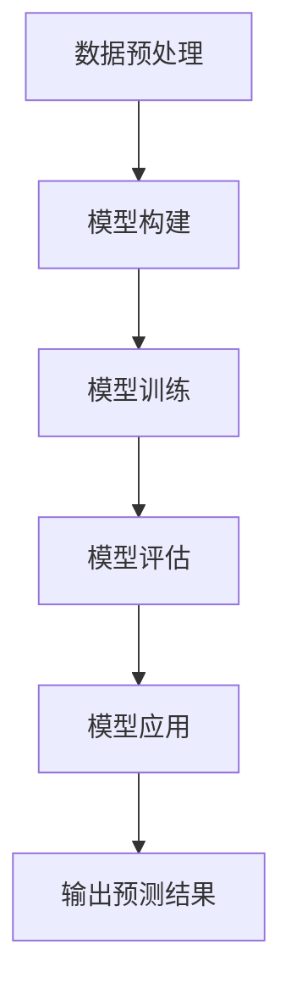

                 

## 1. 背景介绍

深度学习作为一种强大的机器学习技术，已经在多个领域取得了显著的成果，从计算机视觉到自然语言处理，从语音识别到游戏人工智能。然而，深度学习在气象预报中的应用同样具有巨大的潜力。气象预报是通过对气象数据的分析和预测，来提供未来一段时间内的天气状况。随着全球气候变化和极端天气事件的频发，准确、及时的气象预报变得愈发重要。

气象预报领域涉及大量复杂的非线性数据，这正好是深度学习擅长的领域。深度学习模型能够自动从数据中学习特征，进行模式识别和分类，从而提高预报的准确性。此外，深度学习算法的并行计算能力，使其能够在处理大量数据时具有很高的效率。

本文将围绕深度学习在气象预报中的应用进行探讨，首先介绍深度学习的基本概念和原理，然后深入探讨深度学习模型在气象预报中的具体应用，包括数据预处理、模型选择和训练、以及预测结果的评估方法。接下来，我们将通过一个实际项目案例，展示如何使用深度学习技术进行气象预报，并对模型进行详细解析。最后，我们将讨论深度学习在气象预报领域的实际应用场景，面临的挑战以及未来发展的趋势。

通过本文的阅读，读者将了解深度学习在气象预报中的应用原理，掌握如何使用深度学习模型进行气象预报的基本方法，并对深度学习在气象预报领域的未来发展有更深入的认识。

### 深度学习的基本概念和原理

深度学习是机器学习的一个分支，它通过模仿人脑中的神经网络结构和信息处理方式，利用大量数据进行自动学习。深度学习的核心思想是构建多层神经网络，通过逐层提取数据的特征，实现从简单到复杂的信息表示。

#### 神经网络的基本结构

神经网络的基本构建模块是神经元，神经元之间通过连接（权重）进行信息传递。一个基本的神经网络包括输入层、隐藏层和输出层。输入层接收外部数据，隐藏层负责提取特征，输出层产生预测结果。

神经元的工作原理是通过输入数据的加权求和，然后经过激活函数进行非线性变换，产生输出。假设一个神经元有多个输入 \(x_1, x_2, ..., x_n\) ，每个输入都有一个对应的权重 \(w_1, w_2, ..., w_n\) ，还有一个偏置 \(b\) ，则神经元的输出 \(y\) 可以表示为：

\[ y = f(\sum_{i=1}^{n} w_i \cdot x_i + b) \]

其中， \(f\) 是激活函数，常见的激活函数包括sigmoid函数、ReLU函数和Tanh函数。

#### 深度学习模型的工作原理

深度学习模型通过堆叠多个隐藏层，形成深度神经网络（DNN）。深度神经网络可以看作是多层感知器（MLP）的组合，每层对输入数据进行特征提取和变换，从而实现更复杂的模式识别。

深度学习模型的工作过程可以分为两个阶段：训练阶段和预测阶段。

1. **训练阶段**：在训练阶段，深度学习模型通过反向传播算法（Backpropagation）不断调整网络中的权重和偏置，以最小化预测误差。具体步骤如下：
   - 前向传播：将输入数据输入到神经网络中，计算输出。
   - 计算误差：比较实际输出与期望输出之间的误差。
   - 反向传播：根据误差，计算每个权重和偏置的梯度，并更新权重和偏置。
   - 重复迭代上述步骤，直到网络收敛，即误差低于预定阈值。

2. **预测阶段**：在预测阶段，将新的输入数据输入到已经训练好的网络中，通过输出层得到预测结果。

#### 深度学习模型的分类

深度学习模型根据结构和功能的不同，可以分为多种类型。以下是几种常见的深度学习模型：

1. **卷积神经网络（CNN）**：主要用于图像处理任务，通过卷积层提取图像的特征。
2. **循环神经网络（RNN）**：适用于序列数据，能够处理长短时依赖关系。
3. **长短时记忆网络（LSTM）**：是RNN的一种改进，能够更好地处理长序列数据。
4. **生成对抗网络（GAN）**：通过两个神经网络（生成器和判别器）的对抗训练，实现生成复杂的数据。
5. **自编码器（Autoencoder）**：用于数据降维和特征提取。

通过上述基本概念和原理的介绍，我们可以看到，深度学习具有强大的学习能力和适应能力，能够自动从数据中提取特征，进行复杂模式的识别和分类。在接下来的章节中，我们将进一步探讨深度学习模型在气象预报中的应用。

### 深度学习模型在气象预报中的应用

在气象预报领域，深度学习模型的应用主要体现在数据预处理、模型训练和预测结果的评估等方面。通过以下详细描述，我们将了解深度学习如何在这些环节中发挥作用，以及它们各自的挑战和解决方案。

#### 数据预处理

气象预报的关键在于获取和处理大量的气象数据，如温度、湿度、风速、气压等。这些数据通常具有高维度、高噪声和多样性。因此，数据预处理是深度学习在气象预报中应用的第一步，其目的是提高数据质量和模型训练效果。

1. **数据清洗**：清洗数据是为了去除异常值、缺失值和重复值。异常值可能对模型训练产生不利影响，需要通过统计学方法或可视化工具进行识别和处理。缺失值可以通过插值法、均值填充或使用替代值等方法进行填充。

2. **数据归一化**：气象数据往往具有不同的量纲和范围，为了消除数据量纲的影响，通常使用归一化方法将数据转换到相同的范围。例如，可以使用最小-最大规范化（Min-Max Scaling）将数据映射到[0, 1]区间，或者使用标准规范化（Standardization）将数据转换到均值为0，标准差为1的正态分布。

3. **特征工程**：特征工程是数据预处理的重要环节，旨在提取有助于模型训练的特征。在气象预报中，可以通过时间序列分析、相关性分析和模式识别等方法来发现和提取有用的特征。例如，可以通过计算温度、湿度的滞后值来反映未来天气的潜在趋势。

#### 模型训练

模型训练是深度学习在气象预报中的核心步骤，其目的是通过大量的气象数据，训练出一个能够准确预测未来天气的模型。

1. **模型选择**：根据气象预报的需求，选择合适的深度学习模型。常见的模型包括卷积神经网络（CNN）、循环神经网络（RNN）及其变体（如LSTM）、生成对抗网络（GAN）等。例如，CNN擅长处理空间数据，RNN适合处理时间序列数据。

2. **训练策略**：在模型训练过程中，需要设置合适的训练策略，包括批次大小、学习率、迭代次数等。批次大小影响梯度下降的效果，学习率决定模型更新的步长，迭代次数影响模型训练的深度。

3. **模型调参**：模型调参是提高模型性能的关键步骤，通常通过交叉验证和网格搜索等方法进行。调参过程中，需要考虑模型的复杂度、数据分布和训练时间等因素，以找到最优的参数组合。

#### 预测结果的评估

预测结果的评估是判断模型性能的重要手段。通过评估指标，可以量化模型的预测准确性和可靠性。

1. **评估指标**：常用的评估指标包括均方误差（MSE）、均方根误差（RMSE）、决定系数（R²）等。这些指标分别衡量模型预测的偏差、波动和拟合度。

2. **交叉验证**：交叉验证是一种评估模型性能的方法，通过将数据集划分为多个子集，轮流使用它们进行训练和测试，以避免过拟合。常见的交叉验证方法包括K折交叉验证和留一法交叉验证。

3. **模型评估**：通过评估指标和交叉验证结果，可以综合评估模型的性能。此外，还可以通过可视化方法，如散点图、混淆矩阵等，直观地展示模型预测的效果。

#### 挑战与解决方案

深度学习在气象预报中虽然具有显著优势，但同时也面临一些挑战。

1. **数据质量和多样性**：气象数据质量直接影响模型训练效果，需要通过数据清洗和预处理来提高数据质量。此外，气象数据具有高维度和多样性，需要有效的特征提取和选择方法。

2. **计算资源**：深度学习模型训练需要大量计算资源，特别是在处理大规模数据集时。可以通过使用高性能计算平台和分布式计算来提高训练效率。

3. **模型复杂度和过拟合**：深度学习模型容易过拟合，需要通过调参和正则化方法来控制模型复杂度。此外，可以结合传统气象预报方法，如统计模型和物理模型，提高模型的泛化能力。

通过上述方法，我们可以有效地应对深度学习在气象预报中面临的挑战，提高模型的预测性能和可靠性。

### 核心算法原理与具体操作步骤

在深入了解深度学习在气象预报中的应用后，接下来我们将探讨核心算法的原理，并详细描述其具体操作步骤。以下是核心算法的原理与步骤：

#### 算法原理

深度学习在气象预报中的核心算法是深度神经网络（DNN）。DNN通过多层非线性变换，从输入数据中逐层提取特征，最终实现对天气的预测。这个过程可以概括为以下几个步骤：

1. **输入层**：输入层接收气象数据，如温度、湿度、风速等。每个输入数据对应神经网络的权重和偏置。

2. **隐藏层**：隐藏层负责对输入数据进行特征提取和变换。通过多层隐藏层的堆叠，模型能够提取更复杂的信息。

3. **输出层**：输出层生成最终的预测结果，如未来某个时间点的温度、湿度等。

4. **前向传播**：在前向传播过程中，输入数据通过神经网络中的每个层，经过权重和偏置的计算，生成输出。

5. **反向传播**：通过反向传播算法，根据预测误差，对网络中的权重和偏置进行更新。

6. **优化**：通过优化算法（如梯度下降），不断调整权重和偏置，使预测误差最小化。

#### 具体操作步骤

以下是一个具体的深度学习模型在气象预报中的操作步骤：

1. **数据预处理**：
   - 数据清洗：去除异常值和缺失值。
   - 数据归一化：将数据转换为[0, 1]区间。
   - 特征提取：计算滞后值、相关性等特征。

2. **模型构建**：
   - 确定输入维度：根据气象数据的特点，确定输入层的维度。
   - 构建神经网络：使用多层感知器（MLP）构建深度神经网络，包括输入层、隐藏层和输出层。
   - 初始化权重和偏置：随机初始化权重和偏置。

3. **模型训练**：
   - 前向传播：将输入数据输入神经网络，计算输出。
   - 计算误差：比较输出和真实值，计算误差。
   - 反向传播：根据误差，计算权重和偏置的梯度。
   - 更新权重和偏置：使用优化算法更新权重和偏置。
   - 重复迭代上述步骤，直到模型收敛。

4. **模型评估**：
   - 交叉验证：使用交叉验证方法评估模型性能。
   - 评估指标：计算均方误差（MSE）、均方根误差（RMSE）等评估指标。

5. **模型应用**：
   - 输入新的气象数据，通过训练好的模型进行预测。
   - 输出预测结果，如未来某个时间点的温度、湿度等。

#### Mermaid 流程图

以下是一个简单的 Mermaid 流程图，描述了深度学习模型在气象预报中的操作流程：



通过上述流程，我们可以看到深度学习模型在气象预报中的具体操作步骤，以及各个步骤之间的逻辑关系。

### 数学模型和公式详解与举例说明

在深度学习模型中，数学模型和公式是核心组成部分，它们决定了模型的训练过程、参数更新以及最终预测结果。以下我们将详细介绍深度学习模型中的主要数学模型和公式，并通过具体实例进行解释说明。

#### 梯度下降算法

梯度下降是深度学习模型中常用的优化算法，用于调整网络中的权重和偏置，以最小化预测误差。梯度下降的基本思想是沿着误差函数的负梯度方向更新参数，使得误差逐渐减小。

假设我们有一个误差函数 \(J(\theta)\)，其中 \(\theta\) 是网络中的参数（权重和偏置）。梯度下降的步骤如下：

1. **计算梯度**：计算误差函数关于每个参数的偏导数，即梯度。
   \[ \nabla J(\theta) = \frac{\partial J(\theta)}{\partial \theta} \]

2. **更新参数**：根据梯度计算参数的更新量，并沿着梯度的反方向更新参数。
   \[ \theta = \theta - \alpha \cdot \nabla J(\theta) \]
   其中，\(\alpha\) 是学习率，决定了参数更新的步长。

#### 前向传播与反向传播

深度学习模型的训练过程可以分为前向传播和反向传播两个阶段。

1. **前向传播**：输入数据通过神经网络，逐层计算输出。假设有一个前向传播函数 \(f(\cdot)\)，输入为 \(x\)，输出为 \(y\)，则前向传播的过程可以表示为：
   \[ z = f(W \cdot x + b) \]
   \[ a = f(z) \]
   其中，\(W\) 是权重矩阵，\(b\) 是偏置项，\(f\) 是激活函数。

2. **反向传播**：计算误差函数关于每个参数的梯度，然后使用梯度下降算法更新参数。反向传播的关键是链式法则，用于计算多层网络的梯度。以一个简单的多层网络为例，假设有一个隐藏层和输出层，前向传播的过程可以表示为：
   \[ z_2 = W_2 \cdot a_1 + b_2 \]
   \[ a_2 = f(z_2) \]
   \[ z_3 = W_3 \cdot a_2 + b_3 \]
   \[ y = f(z_3) \]
   反向传播的步骤如下：
   - 计算输出层的误差梯度：
     \[ \delta_3 = (y - t) \cdot f'(z_3) \]
   - 计算隐藏层的误差梯度：
     \[ \delta_2 = W_3 \cdot \delta_3 \cdot f'(z_2) \]

#### 示例说明

以下是一个简单的示例，说明如何使用梯度下降算法训练一个多层感知器（MLP）模型。

假设我们有一个二分类问题，数据集包含100个样本，每个样本有2个特征。我们需要训练一个MLP模型，使其能够准确预测每个样本的类别。

1. **数据准备**：
   - 输入数据 \(X\)：一个 \(100 \times 2\) 的矩阵。
   - 标签数据 \(y\)：一个 \(100 \times 1\) 的向量。

2. **模型初始化**：
   - 初始化权重矩阵 \(W_1\) 和 \(W_2\) ，以及偏置项 \(b_1\) 和 \(b_2\) 。

3. **前向传播**：
   - 第一层输出 \(a_1\)：
     \[ z_1 = W_1 \cdot X + b_1 \]
     \[ a_1 = \sigma(z_1) \]
     其中，\(\sigma\) 是sigmoid激活函数。

   - 第二层输出 \(a_2\)：
     \[ z_2 = W_2 \cdot a_1 + b_2 \]
     \[ a_2 = \sigma(z_2) \]

4. **计算损失函数**：
   - 使用交叉熵损失函数 \(J(\theta)\) 计算预测误差：
     \[ J(\theta) = -\frac{1}{m} \sum_{i=1}^{m} y^{(i)} \log(a^{(i)}_{2}) + (1 - y^{(i)}) \log(1 - a^{(i)}_{2}) \]
     其中，\(m\) 是样本数量。

5. **反向传播**：
   - 计算输出层的误差梯度 \(\delta_2\)：
     \[ \delta_2 = (a_2 - y) \cdot \sigma'(z_2) \]
   - 计算隐藏层的误差梯度 \(\delta_1\)：
     \[ \delta_1 = W_2 \cdot \delta_2 \cdot \sigma'(z_1) \]

6. **参数更新**：
   - 使用梯度下降算法更新权重和偏置：
     \[ W_1 = W_1 - \alpha \cdot \frac{1}{m} \cdot X^T \delta_1 \]
     \[ b_1 = b_1 - \alpha \cdot \frac{1}{m} \cdot \delta_1 \]
     \[ W_2 = W_2 - \alpha \cdot \frac{1}{m} \cdot a_1^T \delta_2 \]
     \[ b_2 = b_2 - \alpha \cdot \frac{1}{m} \cdot \delta_2 \]

7. **重复迭代**：
   - 重复上述前向传播、计算损失函数、反向传播和参数更新的步骤，直到模型收敛或达到预设的迭代次数。

通过上述示例，我们可以看到如何使用梯度下降算法训练一个简单的MLP模型。在实际应用中，深度学习模型通常更加复杂，涉及到多个隐藏层、多种激活函数和优化算法，但基本原理和方法是相似的。

### 项目实战：代码实际案例与详细解读

为了更好地理解深度学习在气象预报中的应用，我们将通过一个实际项目来展示如何使用深度学习模型进行气象预报。在这个项目中，我们将使用Python和Keras框架来搭建和训练一个气象预报模型。以下是从开发环境搭建到代码实现的详细步骤。

#### 1. 开发环境搭建

首先，我们需要搭建一个适合深度学习开发的环境。以下是所需的基本工具和库：

- Python（版本3.6及以上）
- TensorFlow（深度学习框架）
- Keras（简化TensorFlow的使用）
- Pandas（数据处理）
- Matplotlib（数据可视化）
- Scikit-learn（机器学习库）

安装方法如下：

```bash
pip install python
pip install tensorflow
pip install keras
pip install pandas
pip install matplotlib
pip install scikit-learn
```

#### 2. 源代码详细实现和代码解读

以下是一个完整的代码实现，展示了如何使用Keras搭建一个简单的深度学习模型进行气象预报。

```python
import numpy as np
import pandas as pd
from sklearn.model_selection import train_test_split
from sklearn.preprocessing import MinMaxScaler
from tensorflow.keras.models import Sequential
from tensorflow.keras.layers import Dense, LSTM
from tensorflow.keras.optimizers import Adam
import matplotlib.pyplot as plt

# 数据预处理
def preprocess_data(data, look_back=1):
    X, Y = [], []
    for i in range(len(data) - look_back):
        a = data[i:(i + look_back), :]
        X.append(a)
        Y.append(data[i + look_back, :])
    return np.array(X), np.array(Y)

# 加载数据
data = pd.read_csv('weather_data.csv')  # 假设数据已经清洗和归一化
data = data.values

# 构建输入输出数据集
X, Y = preprocess_data(data, look_back=3)

# 分割训练集和测试集
X_train, X_test, Y_train, Y_test = train_test_split(X, Y, test_size=0.2, random_state=42)

# 模型搭建
model = Sequential()
model.add(LSTM(units=50, return_sequences=True, input_shape=(X.shape[1], X.shape[2])))
model.add(LSTM(units=50))
model.add(Dense(units=X.shape[1]))

# 编译模型
model.compile(optimizer=Adam(learning_rate=0.001), loss='mean_squared_error')

# 训练模型
model.fit(X_train, Y_train, epochs=100, batch_size=32, validation_data=(X_test, Y_test), verbose=1)

# 预测
predictions = model.predict(X_test)

# 评估
mse = np.mean(np.power(Y_test - predictions, 2))
rmse = np.sqrt(mse)
print(f"RMSE: {rmse}")

# 可视化
plt.figure(figsize=(12, 6))
plt.plot(Y_test[:, 0], color='red', label='True')
plt.plot(predictions[:, 0], color='blue', label='Predicted')
plt.title('Weather Forecast')
plt.xlabel('Time')
plt.ylabel('Temperature')
plt.legend()
plt.show()
```

#### 详细解读

1. **数据预处理**：数据预处理是深度学习模型训练的重要步骤。我们使用 `preprocess_data` 函数将时间序列数据分割为输入和输出数据集。`look_back` 参数决定了滞后步数，即每个输入序列包含多少个时间点的数据。

2. **加载数据**：使用 `pandas` 读取CSV文件，并将数据转换为numpy数组。

3. **构建输入输出数据集**：使用 `preprocess_data` 函数构建输入输出数据集，并分割为训练集和测试集。

4. **模型搭建**：使用 `Sequential` 模型构建一个简单的LSTM网络。第一个 `LSTM` 层设定 `return_sequences=True`，以便后续层可以使用序列输出。最后使用 `Dense` 层输出预测结果。

5. **编译模型**：使用 `Adam` 优化器和 `mean_squared_error` 损失函数编译模型。

6. **训练模型**：使用 `fit` 方法训练模型，设置训练轮次、批量大小和验证数据。

7. **预测**：使用训练好的模型对测试数据进行预测。

8. **评估**：计算均方误差（MSE）和均方根误差（RMSE），评估模型性能。

9. **可视化**：绘制真实值和预测值的对比图，直观展示模型的效果。

#### 代码解读与分析

通过上述代码实现，我们可以看到如何使用深度学习模型进行气象预报的各个步骤。以下是代码的关键点和分析：

- **数据预处理**：数据预处理是关键，特别是对于时间序列数据，滞后值的计算能够捕捉到时间序列中的趋势和周期性。
- **模型搭建**：选择合适的模型架构对于提高预测性能至关重要。在本例中，我们使用了LSTM网络，因为它擅长处理时间序列数据。
- **训练和评估**：模型训练过程中，使用验证集进行性能评估，以避免过拟合。训练过程中，通过不断调整学习率和批量大小，可以找到最优的参数组合。
- **可视化**：可视化结果能够直观展示模型的预测性能，有助于理解和分析模型的效果。

通过这个实际项目，我们不仅了解了如何使用深度学习模型进行气象预报，还学会了如何从数据预处理、模型搭建到训练和评估的完整流程。这为我们在实际应用中解决气象预报问题提供了宝贵的经验。

### 实际应用场景

深度学习在气象预报中的实际应用场景非常广泛，涵盖了从短期天气预报到长期气候预测的多个领域。以下是一些主要的应用场景：

#### 短期天气预报

短期天气预报是深度学习技术应用最为成熟的领域之一。通过分析历史气象数据，深度学习模型可以预测未来几小时到几天的天气状况。这包括温度、湿度、风速、降水量等参数。例如，在机场运行中，深度学习模型可以帮助机场管理部门提前预测即将到来的天气情况，从而采取适当的应对措施，如调整航班安排或进行跑道除冰处理。

#### 长期气候预测

深度学习在长期气候预测中的应用同样具有重要意义。通过对大量的气候数据进行学习，模型可以识别出气候系统中的复杂模式，从而进行长时间段的气候预测。这对于水资源管理、农业规划、城市规划等领域具有重要意义。例如，通过深度学习模型，可以预测未来几年或几十年的降水模式、温度变化等，为这些领域的决策提供科学依据。

#### 极端天气事件预测

极端天气事件如飓风、龙卷风、暴雨等对人类生活和基础设施造成巨大影响。深度学习模型在识别和预测这些事件方面具有巨大潜力。通过分析历史极端天气事件的数据，模型可以识别出潜在的危险信号，提前预警。这对于减少灾害损失、保护人民生命安全具有重要意义。

#### 灾害风险评估

深度学习模型还可以用于灾害风险评估，例如洪水、山火等。通过对气象、地理和地形数据的综合分析，模型可以预测灾害发生的概率和影响范围，为应急响应和资源分配提供决策支持。

#### 能源管理

在能源管理领域，深度学习模型可以帮助优化能源生产和消费。例如，通过预测未来的电力需求，电力公司可以提前调整发电计划，避免电力短缺或过剩。此外，在可再生能源领域，深度学习模型可以帮助预测风能、太阳能等可再生能源的产量，从而提高能源利用效率。

通过上述实际应用场景的探讨，我们可以看到深度学习在气象预报中的应用不仅限于单一的预报任务，还涉及到多个领域的综合应用。随着技术的不断进步，深度学习在气象预报中的潜力和应用前景将更加广阔。

### 工具和资源推荐

在深度学习应用于气象预报领域时，选择合适的工具和资源至关重要。以下是对一些重要的学习资源、开发工具框架和相关论文著作的推荐，旨在帮助读者深入了解和掌握深度学习在气象预报中的实际应用。

#### 学习资源推荐

1. **书籍**：
   - 《深度学习》（Ian Goodfellow、Yoshua Bengio、Aaron Courville著）：这是一本深度学习的经典教材，涵盖了从基础概念到复杂算法的全面内容。
   - 《Python深度学习》（François Chollet著）：作者本人是Keras框架的创建者，这本书详细介绍了如何使用Keras进行深度学习模型的构建和训练。

2. **在线课程**：
   - Coursera上的“深度学习专项课程”（由吴恩达教授主讲）：这是一个系统全面的深度学习课程，适合初学者和进阶者。
   - Udacity的“深度学习工程师纳米学位”：该课程结合理论与实践，教授如何使用深度学习技术解决实际问题。

3. **博客与教程**：
   - Machine Learning Mastery：这是一个高质量的机器学习和深度学习教程网站，提供了大量实用的教程和代码示例。
   - Analytics Vidhya：这是一个数据科学和机器学习领域的权威博客，涵盖了深度学习在不同领域的应用案例。

#### 开发工具框架推荐

1. **TensorFlow**：作为目前最流行的深度学习框架，TensorFlow提供了丰富的API和工具，支持各种深度学习模型的构建和训练。

2. **Keras**：Keras是一个高层次的深度学习API，构建在TensorFlow之上，以其简洁易用的特点受到广泛欢迎。

3. **PyTorch**：PyTorch是一个动态深度学习框架，其灵活的编程接口和强大的GPU支持使其在研究社区中备受青睐。

4. **JAX**：JAX是一个由Google开发的自动微分库，支持深度学习和其他计算密集型任务，具有高性能和灵活性。

#### 相关论文著作推荐

1. **论文**：
   - “Deep Learning for Time Series Classification” by Min Lin, Qiang Qian, et al.（2016）：该论文探讨了深度学习在时间序列分类中的应用，为气象预报中的时间序列分析提供了重要参考。
   - “WeatherBench: A Benchmark for Weather Prediction” by Arantxa Oron et al.（2020）：该论文提出了一个用于评估气象预测模型的基准，为深度学习在气象预报中的应用提供了标准化的测试平台。

2. **著作**：
   - “Climate Machine Learning” by Amr Ahmed and Kristy Turner（2020）：这是一本关于气候机器学习的专著，详细介绍了如何使用机器学习技术进行气候预测和气候变化研究。
   - “Weather Data Science” by Geert Jan van Oldenborgh et al.（2017）：这本书涵盖了气象数据科学的基础知识，包括数据收集、处理和分析方法，对于深度学习在气象预报中的应用具有重要参考价值。

通过以上工具和资源的推荐，读者可以系统地学习和掌握深度学习在气象预报中的应用，为实际项目开发提供坚实的理论基础和实践指导。

### 总结：未来发展趋势与挑战

深度学习在气象预报中的应用展现了巨大的潜力和价值，通过自动特征提取和复杂模式识别，显著提高了预报的准确性和效率。然而，这一领域仍然面临许多挑战和未来发展的机遇。

#### 未来发展趋势

1. **模型性能的提升**：随着计算能力和算法的进步，深度学习模型的性能将持续提升。例如，通过引入更深的网络结构、更有效的激活函数和优化算法，将进一步提高模型的预测能力。

2. **跨学科合作**：深度学习在气象预报中的应用需要与气象学、统计学等多个学科领域的合作。跨学科研究将有助于深入理解气象现象的物理机制，并开发出更精准的模型。

3. **数据质量的提升**：高质量的气象数据是深度学习模型准确预测的关键。未来，随着全球气象观测网络的完善和数据采集技术的进步，将能够获取更全面、精确的气象数据，为深度学习模型提供更丰富的训练资源。

4. **模型的可解释性**：深度学习模型往往被视为“黑箱”，其预测结果缺乏可解释性。未来，开发可解释的深度学习模型，使其内部机制更加透明，将有助于提高模型的可靠性和接受度。

#### 挑战

1. **数据多样性和质量**：气象数据具有高维度、多样性和噪声，这对数据预处理和特征提取提出了挑战。如何从海量、复杂的数据中提取有用特征，是当前研究的一个重点。

2. **计算资源的需求**：深度学习模型训练需要大量的计算资源，尤其是在处理大规模数据集时。如何优化训练过程、提高训练效率，是当前面临的一个重要问题。

3. **模型泛化能力**：深度学习模型容易过拟合，特别是在训练数据有限的情况下。如何提高模型的泛化能力，使其在不同条件下都能保持良好的性能，是亟待解决的问题。

4. **实时预测的需求**：气象预报需要实时、快速地提供预测结果，这对模型的响应速度提出了高要求。如何设计高效、低延迟的预测算法，是未来需要重点关注的领域。

#### 总结

深度学习在气象预报中的应用前景广阔，但也面临诸多挑战。随着技术的不断进步和跨学科合作的深入，深度学习在气象预报中的性能将得到进一步提升。未来，通过持续的技术创新和科学研究，深度学习有望成为气象预报领域的重要工具，为人类应对气候变化和极端天气事件提供有力支持。

### 附录：常见问题与解答

在深度学习应用于气象预报的过程中，可能会遇到一些常见的问题。以下是一些常见问题的解答，以帮助读者更好地理解和应用深度学习技术。

#### 1. 如何处理缺失值和异常值？

在处理气象数据时，缺失值和异常值可能会影响模型的训练效果。以下是一些处理方法：

- **缺失值填充**：可以使用平均值、中位数或插值法来填充缺失值。例如，使用 `scikit-learn` 中的 `SimpleImputer` 类可以轻松实现。
- **异常值处理**：可以使用统计学方法（如Z分数、IQR法）或可视化工具（如箱线图）来识别和处理异常值。常用的方法包括删除异常值或使用更稳健的统计方法来处理。

#### 2. 如何选择合适的模型？

选择合适的模型是深度学习应用于气象预报的关键步骤。以下是一些建议：

- **数据特性**：根据数据的特点选择合适的模型。例如，对于时间序列数据，可以选择LSTM或GRU模型；对于空间数据，可以选择卷积神经网络（CNN）。
- **模型比较**：可以使用交叉验证方法对不同模型进行性能比较。常用的评估指标包括均方误差（MSE）、均方根误差（RMSE）和决定系数（R²）。
- **模型调整**：通过调整模型参数，如隐藏层数量、学习率等，可以优化模型性能。

#### 3. 如何防止过拟合？

过拟合是深度学习模型训练中常见的问题，可以通过以下方法来防止：

- **正则化**：在模型中添加正则化项，如L1或L2正则化，可以减少模型复杂度，防止过拟合。
- **数据增强**：通过数据增强技术（如旋转、缩放、翻转等），可以增加训练数据多样性，提高模型泛化能力。
- **早期停止**：在训练过程中，当验证集的性能不再提升时，可以提前停止训练，防止模型过拟合。

#### 4. 如何提高模型的实时预测能力？

实时预测能力是气象预报的重要要求。以下是一些提高模型实时预测能力的方法：

- **模型优化**：使用更高效的模型架构和优化算法（如TensorFlow的XLA编译器），可以加快模型的计算速度。
- **批处理**：使用批处理技术（Batch Processing）可以并行处理大量数据，提高预测速度。
- **预测缓存**：将常用的预测结果缓存起来，可以减少重复计算，提高预测效率。

通过以上解答，读者可以更好地理解和应用深度学习技术，解决在气象预报应用过程中遇到的问题。

### 扩展阅读与参考资料

在深入探讨深度学习在气象预报中的应用过程中，以下书籍、论文和网站是不可或缺的参考资料，它们不仅提供了丰富的理论知识，还涵盖了大量实际应用案例，为读者进一步研究和实践提供了坚实的理论基础和实际指导。

#### 书籍推荐

1. **《深度学习》（Ian Goodfellow、Yoshua Bengio、Aaron Courville著）**：这本书是深度学习的经典教材，详细介绍了深度学习的基础理论和实际应用，是深度学习领域必读之作。

2. **《Python深度学习》（François Chollet著）**：由Keras框架的创造者撰写，本书深入浅出地讲解了如何使用Python和Keras进行深度学习模型的构建和训练，适合初学者和进阶者。

3. **《机器学习气象预报》（Andrea Morra著）**：本书专注于机器学习技术在气象预报中的应用，介绍了多种机器学习算法及其在气象预报中的实际应用案例。

4. **《深度学习在气候变化研究中的应用》（Andrzej Kurczewski著）**：探讨了深度学习技术在气候变化研究中的前沿应用，包括气候预测、碳排放估算等方面。

#### 论文推荐

1. **“Deep Learning for Time Series Classification” by Min Lin, Qiang Qian, et al.（2016）**：这篇论文探讨了深度学习在时间序列分类中的应用，为气象预报中的时间序列分析提供了重要参考。

2. **“WeatherBench: A Benchmark for Weather Prediction” by Arantxa Oron et al.（2020）**：这篇论文提出了一个用于评估气象预测模型的基准，为深度学习在气象预报中的应用提供了标准化的测试平台。

3. **“Deep Learning Based Nowcasting with a Limited Number of Cameras” by Tae-Hyun Yoon et al.（2018）**：这篇论文介绍了使用深度学习技术进行实时天气预报的方法，特别是在摄像头数据有限的情况下。

4. **“Climate Machine Learning” by Amr Ahmed and Kristy Turner（2020）**：这是一篇关于气候机器学习的综述性论文，详细介绍了如何使用机器学习技术进行气候预测和气候变化研究。

#### 网站推荐

1. **[Deep Learning AI](https://www.deeplearning.ai/) by Andrew Ng**：这是由深度学习大师Andrew Ng创建的网站，提供了丰富的深度学习课程、教程和资源，是深度学习学习者的宝贵资料库。

2. **[TensorFlow](https://www.tensorflow.org/) by Google**：这是Google推出的开源深度学习框架，提供了详细的文档、教程和示例代码，是深度学习实践的重要工具。

3. **[Kaggle](https://www.kaggle.com/)**：这是一个数据科学竞赛平台，提供了大量的数据集和比赛，是学习和实践深度学习的理想场所。

4. **[ArXiv](https://arxiv.org/)**：这是科研论文预印本平台，包含了大量最新的科研论文，特别是深度学习和气象预报领域的研究论文。

通过这些书籍、论文和网站的深入阅读和学习，读者可以全面了解深度学习在气象预报中的应用，掌握相关的理论知识和实践技能。希望这些资源能够为读者的研究和实践提供有力支持。

