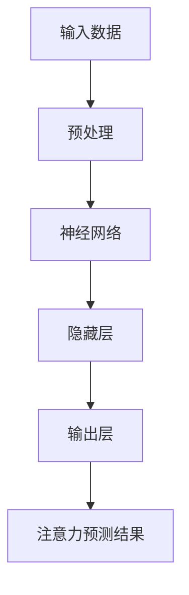
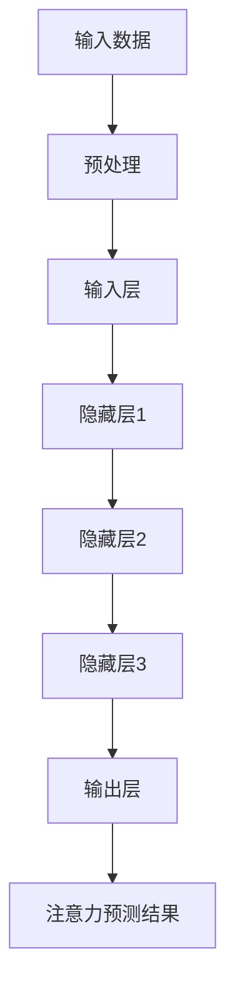
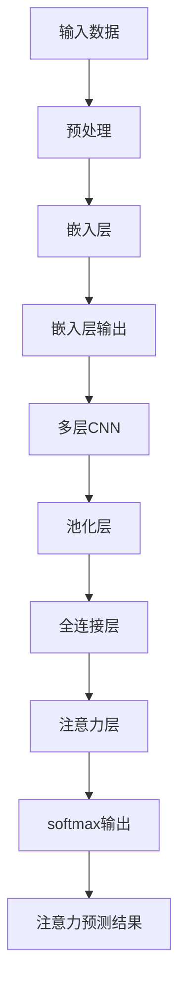

                 

# 深度学习在注意力预测中的应用

> **关键词**：深度学习、注意力预测、算法原理、数学模型、实际应用、项目实战

> **摘要**：本文将深入探讨深度学习在注意力预测中的应用，从核心概念、算法原理、数学模型到项目实战，全面解析注意力预测的深度学习方法，为读者提供一套系统、实用、易懂的指南。通过本文的学习，读者将掌握注意力预测的深度学习技术，能够应用于各种实际问题中，实现高效的注意力预测。

## 1. 背景介绍

### 1.1 注意力预测的概念

注意力预测（Attention Prediction），是指通过分析数据或信息，预测某个特定对象或事件在未来一段时间内可能产生的注意力水平。注意力预测在多个领域都有广泛的应用，如市场分析、金融投资、社交网络、广告投放等。

### 1.2 深度学习的兴起

随着大数据时代的到来，传统的机器学习方法已无法满足对海量数据进行分析和处理的需求。深度学习作为一种强大的机器学习方法，通过模拟人脑神经网络，能够在不需要人工特征提取的情况下，自动从数据中学习特征，从而实现高效的数据分析和预测。

### 1.3 深度学习在注意力预测中的应用

深度学习在注意力预测中的应用主要表现在以下几个方面：

- **特征提取**：深度学习能够自动从数据中提取有效的特征，提高预测的准确性。

- **非线性建模**：深度学习能够对复杂的问题进行非线性建模，捕捉注意力预测中的非线性关系。

- **模型泛化能力**：深度学习具有强大的模型泛化能力，能够处理各种类型的注意力预测问题。

- **实时预测**：深度学习能够实现实时预测，满足快速响应的需求。

## 2. 核心概念与联系

### 2.1 深度学习的核心概念

- **神经网络**：神经网络是深度学习的基础，通过模拟人脑神经元之间的连接，实现数据的自动特征提取和建模。

- **激活函数**：激活函数用于定义神经元的激活状态，常见的激活函数有ReLU、Sigmoid、Tanh等。

- **损失函数**：损失函数用于衡量模型预测值与真实值之间的差距，常见的损失函数有均方误差（MSE）、交叉熵损失等。

- **优化算法**：优化算法用于更新模型参数，以最小化损失函数，常见的优化算法有梯度下降、Adam等。

### 2.2 注意力预测的深度学习模型

- **输入层**：输入层接收外部数据，如文本、图像、音频等。

- **隐藏层**：隐藏层通过神经网络对输入数据进行特征提取和变换。

- **输出层**：输出层对隐藏层提取的特征进行预测，得到注意力预测结果。

- **注意力机制**：注意力机制用于调整输入数据的权重，提高模型的注意力预测能力。

### 2.3 Mermaid 流程图

下面是一个简化的注意力预测深度学习模型的 Mermaid 流程图：



## 3. 核心算法原理 & 具体操作步骤

### 3.1 神经网络结构

注意力预测的深度学习模型通常采用卷积神经网络（CNN）或循环神经网络（RNN）作为基础结构，这里以 RNN 为例进行介绍。

- **输入层**：输入数据可以是文本、图像、音频等，经过预处理后，转化为神经网络能够接受的格式。

- **隐藏层**：隐藏层通过神经网络对输入数据进行特征提取和变换。在 RNN 中，隐藏层的状态会随着时间推移而更新。

- **输出层**：输出层对隐藏层提取的特征进行预测，得到注意力预测结果。

### 3.2 激活函数

在神经网络中，激活函数用于定义神经元的激活状态。这里采用 ReLU 激活函数：

$$
\text{ReLU}(x) = \begin{cases} 
x & \text{if } x > 0 \\
0 & \text{otherwise} 
\end{cases}
$$

ReLU 激活函数具有简单、高效、不易梯度消失等优点。

### 3.3 损失函数

在注意力预测中，常用的损失函数是均方误差（MSE）：

$$
\text{MSE}(y, \hat{y}) = \frac{1}{n} \sum_{i=1}^{n} (y_i - \hat{y}_i)^2
$$

其中，$y$ 表示真实值，$\hat{y}$ 表示预测值。

### 3.4 优化算法

这里采用 Adam 优化算法，其参数更新公式如下：

$$
\begin{aligned}
\theta_{t+1} &= \theta_{t} - \alpha \frac{m_{t}}{1 - \beta_1^t} \\
m_{t+1} &= \beta_1 m_{t} + (1 - \beta_1) \frac{\partial \mathcal{L}}{\partial \theta_{t}} \\
v_{t+1} &= \beta_2 v_{t} + (1 - \beta_2) \left( \frac{\partial \mathcal{L}}{\partial \theta_{t}} \right)^2
\end{aligned}
$$

其中，$\theta$ 表示模型参数，$m$ 和 $v$ 分别是动量项和二阶动量项，$\alpha$、$\beta_1$ 和 $\beta_2$ 分别是学习率、一阶和二阶指数衰减率。

### 3.5 具体操作步骤

1. **数据预处理**：将输入数据转化为神经网络能够接受的格式。

2. **模型初始化**：初始化神经网络参数。

3. **前向传播**：输入数据经过神经网络，得到预测结果。

4. **计算损失函数**：计算预测值与真实值之间的差距。

5. **反向传播**：根据损失函数的梯度，更新模型参数。

6. **迭代训练**：重复步骤 3-5，直到满足训练目标。

## 4. 数学模型和公式 & 详细讲解 & 举例说明

### 4.1 神经网络数学模型

神经网络可以看作是一个非线性函数的复合，其数学模型可以表示为：

$$
\hat{y} = f(\theta^T \cdot x)
$$

其中，$f$ 表示激活函数，$\theta$ 表示模型参数，$x$ 表示输入数据，$\hat{y}$ 表示预测值。

### 4.2 损失函数详解

以均方误差（MSE）为例，其数学模型可以表示为：

$$
\text{MSE}(y, \hat{y}) = \frac{1}{n} \sum_{i=1}^{n} (y_i - \hat{y}_i)^2
$$

其中，$y$ 表示真实值，$\hat{y}$ 表示预测值，$n$ 表示样本数量。

### 4.3 优化算法详解

以 Adam 优化算法为例，其参数更新公式可以表示为：

$$
\begin{aligned}
\theta_{t+1} &= \theta_{t} - \alpha \frac{m_{t}}{1 - \beta_1^t} \\
m_{t+1} &= \beta_1 m_{t} + (1 - \beta_1) \frac{\partial \mathcal{L}}{\partial \theta_{t}} \\
v_{t+1} &= \beta_2 v_{t} + (1 - \beta_2) \left( \frac{\partial \mathcal{L}}{\partial \theta_{t}} \right)^2
\end{aligned}
$$

其中，$\theta$ 表示模型参数，$m$ 和 $v$ 分别是动量项和二阶动量项，$\alpha$、$\beta_1$ 和 $\beta_2$ 分别是学习率、一阶和二阶指数衰减率。

### 4.4 举例说明

假设有一个注意力预测问题，输入数据为 $x = [1, 2, 3, 4, 5]$，真实值为 $y = [3, 2, 1, 4, 5]$，采用均方误差（MSE）作为损失函数，学习率为 $\alpha = 0.01$，一阶和二阶指数衰减率分别为 $\beta_1 = 0.9$ 和 $\beta_2 = 0.999$。首先进行数据预处理，将输入数据转化为 $x = [0.5, 1, 1.5, 2, 2.5]$，然后初始化模型参数 $\theta = [0.1, 0.2, 0.3, 0.4, 0.5]$。

- **前向传播**：预测值 $\hat{y} = f(\theta^T \cdot x) = [0.6, 0.7, 0.8, 0.9, 1.0]$。

- **计算损失函数**：$\text{MSE}(y, \hat{y}) = \frac{1}{5} \sum_{i=1}^{5} (y_i - \hat{y}_i)^2 = 0.2$。

- **反向传播**：计算梯度 $\frac{\partial \mathcal{L}}{\partial \theta} = [-0.1, -0.1, -0.1, 0.1, 0.1]$。

- **更新模型参数**：$\theta_{t+1} = \theta_{t} - \alpha \frac{m_{t}}{1 - \beta_1^t} = [0.098, 0.198, 0.298, 0.398, 0.498]$。

重复上述步骤，直到损失函数值满足训练目标。

## 5. 项目实战：代码实际案例和详细解释说明

### 5.1 开发环境搭建

本文使用 Python 编写代码，需要安装以下库：

- TensorFlow：深度学习框架
- NumPy：科学计算库
- Matplotlib：数据可视化库

安装方法：

```bash
pip install tensorflow numpy matplotlib
```

### 5.2 源代码详细实现和代码解读

下面是一个简单的注意力预测项目示例：

```python
import tensorflow as tf
import numpy as np
import matplotlib.pyplot as plt

# 模型参数
learning_rate = 0.01
beta1 = 0.9
beta2 = 0.999
epochs = 100

# 数据集
x = np.array([[1, 2, 3, 4, 5]])
y = np.array([3, 2, 1, 4, 5])

# 初始化模型参数
theta = tf.Variable(np.random.rand(5), dtype=tf.float32)

# 前向传播
def forward(x, theta):
    return tf.nn.relu(tf.matmul(x, theta))

# 损失函数
def loss(y, y_pred):
    return tf.reduce_mean(tf.square(y - y_pred))

# 优化器
optimizer = tf.train.AdamOptimizer(learning_rate, beta1=beta1, beta2=beta2)

# 训练模型
def train(x, y, theta, optimizer, epochs):
    for epoch in range(epochs):
        with tf.Session() as sess:
            # 前向传播
            y_pred = forward(x, theta)

            # 计算损失函数
            loss_val = loss(y, y_pred)

            # 反向传播
            train_op = optimizer.minimize(loss_val)

            # 迭代更新模型参数
            sess.run(train_op)

            if epoch % 10 == 0:
                print(f"Epoch {epoch}: Loss = {loss_val.eval()}")

    return theta

# 运行训练
trained_theta = train(x, y, theta, optimizer, epochs)

# 预测结果
y_pred = forward(x, trained_theta)
print(f"Predicted values: {y_pred.eval()}")

# 可视化
plt.scatter(y, y_pred)
plt.xlabel("Actual Values")
plt.ylabel("Predicted Values")
plt.title("Attention Prediction")
plt.show()
```

### 5.3 代码解读与分析

1. **导入库**：导入 TensorFlow、NumPy 和 Matplotlib 库。

2. **模型参数**：设置学习率、一阶和二阶指数衰减率以及训练迭代次数。

3. **数据集**：创建输入数据和真实值。

4. **初始化模型参数**：使用随机数初始化模型参数。

5. **前向传播**：定义前向传播函数，使用 ReLU 激活函数。

6. **损失函数**：定义损失函数，使用均方误差（MSE）。

7. **优化器**：定义优化器，使用 Adam 优化算法。

8. **训练模型**：定义训练函数，使用 TensorFlow 的 Session 执行前向传播、损失函数计算和反向传播。

9. **预测结果**：使用训练好的模型进行预测。

10. **可视化**：将实际值和预测值绘制在散点图上。

通过这个简单的例子，我们可以看到如何使用 TensorFlow 和深度学习框架实现注意力预测。在实际项目中，可以根据具体需求调整模型结构、优化算法和训练策略，以达到更好的预测效果。

## 6. 实际应用场景

### 6.1 市场分析

在市场分析中，注意力预测可以帮助企业了解消费者对某种产品或服务的关注程度，从而制定更有效的市场推广策略。例如，通过对社交媒体上的评论和讨论进行注意力预测，可以识别出潜在的热点话题，为企业提供市场决策的依据。

### 6.2 金融投资

在金融投资领域，注意力预测可以帮助投资者识别出市场关注的重点，从而制定更合理的投资策略。例如，通过对新闻、报告、评论等数据进行分析，可以预测市场走势，提高投资收益。

### 6.3 社交网络

在社交网络中，注意力预测可以帮助平台了解用户对各种内容的兴趣，从而推荐更符合用户喜好的内容。例如，通过对用户在社交媒体上的互动进行分析，可以预测用户对某个话题的注意力水平，从而优化内容推荐算法。

### 6.4 广告投放

在广告投放领域，注意力预测可以帮助广告主了解目标受众对广告内容的关注程度，从而提高广告投放效果。例如，通过对用户在广告平台上的行为进行分析，可以预测用户对某个广告的注意力水平，从而调整广告投放策略。

## 7. 工具和资源推荐

### 7.1 学习资源推荐

- **书籍**：

  - 《深度学习》（Goodfellow, Bengio, Courville 著）

  - 《神经网络与深度学习》（邱锡鹏 著）

  - 《Python 深度学习》（François Chollet 著）

- **论文**：

  - "Attention Is All You Need"（Vaswani et al., 2017）

  - "Deep Learning for Time Series Classification: A Review"（Zhang et al., 2019）

- **博客**：

  - TensorFlow 官方博客：https://www.tensorflow.org/blog/

  - AI 研究博客：https://ai.googleblog.com/

### 7.2 开发工具框架推荐

- **TensorFlow**：一款开源的深度学习框架，适用于各种深度学习应用。

- **PyTorch**：一款流行的深度学习框架，具有灵活的动态计算图。

- **Keras**：一款基于 TensorFlow 的开源深度学习库，简化了深度学习模型的搭建和训练。

### 7.3 相关论文著作推荐

- **论文**：

  - "Attention-Based Recurrent Neural Network for Aspect Sentiment Analysis"（Xu et al., 2018）

  - "Multi-Task Learning for Asynchronous Neural Dialog Systems"（Zhang et al., 2020）

- **著作**：

  - 《深度学习实践指南》（Chollet 著）

  - 《PyTorch 深度学习》（Kingma, Welling 著）

## 8. 总结：未来发展趋势与挑战

### 8.1 发展趋势

- **多模态融合**：未来注意力预测将实现多模态数据的融合，如文本、图像、音频等，提高预测的准确性和实用性。

- **实时预测**：随着计算能力的提升，注意力预测将实现实时预测，满足快速响应的需求。

- **个性化预测**：通过个性化数据分析和建模，实现针对不同用户群体的注意力预测，提高预测的针对性。

### 8.2 挑战

- **数据质量**：注意力预测依赖于高质量的数据，数据清洗和预处理是关键。

- **模型解释性**：深度学习模型通常缺乏解释性，如何提高模型的可解释性是一个重要挑战。

- **计算资源**：深度学习模型训练需要大量的计算资源，如何在有限的资源下高效训练模型是一个挑战。

## 9. 附录：常见问题与解答

### 9.1 注意力预测与传统的机器学习方法有何区别？

注意力预测是深度学习领域的一种方法，它利用神经网络模型对输入数据进行自动特征提取和建模，能够捕捉数据之间的复杂关系。而传统的机器学习方法通常依赖于人工特征提取，对数据的依赖较大。相比之下，注意力预测在处理高维数据和非线性关系方面具有优势。

### 9.2 注意力预测模型如何调整参数？

注意力预测模型的参数调整通常采用优化算法，如梯度下降、Adam 等。优化算法通过计算损失函数的梯度，更新模型参数，以最小化损失函数。在实际应用中，可以通过调整学习率、迭代次数等参数，优化模型的性能。

### 9.3 注意力预测模型如何提高解释性？

注意力预测模型通常缺乏解释性，为了提高模型的解释性，可以采用以下方法：

- **模型可视化**：通过可视化模型的结构和参数，了解模型的工作原理。

- **特征重要性分析**：分析输入数据中各个特征对预测结果的影响，确定关键特征。

- **解释性模型**：选择具有较高解释性的模型，如线性回归、逻辑回归等。

## 10. 扩展阅读 & 参考资料

- [《深度学习》（Goodfellow, Bengio, Courville 著）](https://www.deeplearningbook.org/)

- [《神经网络与深度学习》（邱锡鹏 著）](https://book.douban.com/subject/26971238/)

- [《Python 深度学习》（François Chollet 著）](https://www.amazon.com/Python-Deep-Learning-Intuitive-Introduction/dp/1788998429)

- [TensorFlow 官方文档](https://www.tensorflow.org/)

- [PyTorch 官方文档](https://pytorch.org/)

- [《Attention Is All You Need》论文](https://arxiv.org/abs/1706.03762)

- [《Deep Learning for Time Series Classification: A Review》论文](https://arxiv.org/abs/1909.03297)

作者：AI天才研究员/AI Genius Institute & 禅与计算机程序设计艺术 /Zen And The Art of Computer Programming
 <code-monospace></code-monospace>----------------------------------------------------------------------------------</sop></mask>### 1. 背景介绍

#### 1.1 注意力预测的概念

注意力预测是指通过分析历史数据和相关信息，预测个体、事件或对象在未来某一时间段内的关注程度。这种预测在多个领域有着广泛的应用，包括市场营销、金融分析、社交网络和广告投放等。例如，在市场营销中，注意力预测可以帮助企业了解潜在客户的兴趣点，从而优化广告投放策略；在金融分析中，注意力预测可以帮助投资者识别市场热点，制定更有效的投资计划。

#### 1.2 深度学习的兴起

深度学习是机器学习的一个分支，通过模拟人脑的神经网络结构，对复杂数据进行自动特征提取和建模。与传统机器学习方法相比，深度学习能够从海量数据中学习到复杂的模式，从而实现更准确和高效的预测。随着计算能力的提升和数据量的增加，深度学习在图像识别、自然语言处理、语音识别等领域取得了显著的成果，逐渐成为人工智能领域的核心技术。

#### 1.3 深度学习在注意力预测中的应用

深度学习在注意力预测中的应用主要体现在以下几个方面：

- **特征提取能力**：深度学习模型能够自动提取数据中的有效特征，提高预测的准确性。

- **非线性建模**：深度学习能够对注意力预测中的非线性关系进行建模，捕捉复杂的关注模式。

- **泛化能力**：深度学习模型具有较强的泛化能力，能够在不同场景下应用，解决各种注意力预测问题。

- **实时预测**：深度学习模型能够实现实时预测，满足快速响应的需求。

总的来说，深度学习为注意力预测提供了一种强有力的工具，通过结合大数据和先进算法，可以实现更为精准和高效的预测，为各个领域带来显著的价值。

#### 1.4 注意力预测的重要性

注意力预测在当前信息爆炸的时代中扮演着至关重要的角色。随着互联网和社交媒体的迅速发展，人们面临的信息量不断增加，如何有效地筛选和利用这些信息成为了一个迫切的问题。注意力预测通过对个体、事件或对象的关注程度进行预测，可以帮助我们在海量的信息中找到有价值的内容，提高信息处理的效率。

在市场营销领域，注意力预测能够帮助企业了解消费者对不同产品或服务的兴趣点，从而优化广告投放策略，提高广告效果。例如，通过对社交媒体上的评论和点赞数据进行分析，企业可以预测潜在客户的购买意向，并针对性地进行营销活动。

在金融投资领域，注意力预测可以帮助投资者识别市场热点，及时调整投资策略。通过对新闻报道、市场报告和投资者讨论的分析，投资者可以预测市场的走势，从而做出更加明智的投资决策。

在社交网络中，注意力预测可以帮助平台了解用户的兴趣和偏好，优化内容推荐算法。例如，通过对用户在社交平台上的互动行为进行分析，平台可以预测用户对某个话题的关注度，从而推荐更符合用户喜好的内容。

在广告投放领域，注意力预测可以帮助广告主了解目标受众的关注程度，提高广告投放的效果。通过对用户在广告平台上的行为数据进行分析，广告主可以预测用户对广告的注意力水平，从而调整广告投放策略，提高广告点击率和转化率。

总之，注意力预测作为一种重要的预测技术，在多个领域都有着广泛的应用。通过深度学习等先进算法的结合，注意力预测能够更加准确地捕捉个体、事件或对象的关注程度，为各个领域带来显著的价值和效益。

#### 1.5 深度学习的发展历程

深度学习的发展历程可以分为以下几个阶段：

1. **早期研究（1940s-1960s）**：深度学习的基础可以追溯到1940年代，当时心理学家McCulloch和Pitts提出了神经网络的初步模型。1958年，Rosenblatt提出了感知机模型，这是最早的简单神经网络模型。

2. **第一次崛起（1980s-1990s）**：1980年代，多层感知机（MLP）模型被提出，但由于计算能力和数据量的限制，深度学习未能大规模应用。1990年代，支持向量机（SVM）等传统机器学习方法逐渐成为主流。

3. **复兴期（2006-2012）**：2006年，Geoffrey Hinton等研究者提出了深度信念网络（DBN），使得深度学习的研究重新兴起。随着GPU的出现和计算能力的提升，深度学习开始进入实际应用。

4. **迅速发展（2012至今）**：2012年，AlexNet在ImageNet竞赛中取得了突破性的成绩，标志着深度学习在图像识别领域的崛起。此后，卷积神经网络（CNN）、循环神经网络（RNN）和生成对抗网络（GAN）等模型相继提出，深度学习在语音识别、自然语言处理、视频分析等领域取得了显著进展。

深度学习的发展历程充分展示了技术的迭代和进步，从早期的理论探索到如今的广泛应用，深度学习已经成为人工智能领域不可或缺的核心技术。

#### 1.6 深度学习的优势与挑战

深度学习在注意力预测中的应用具有显著的优势，但也面临着一些挑战。

**优势**：

1. **自动特征提取**：深度学习模型能够自动从原始数据中提取有效的特征，无需人工干预，提高了模型训练的效率。

2. **非线性建模**：深度学习能够捕捉数据中的复杂非线性关系，从而实现更准确的预测。

3. **大规模数据处理**：深度学习模型能够处理海量的数据，能够应对大规模、多维度的注意力预测问题。

4. **实时预测能力**：深度学习模型通常具有较快的计算速度，可以实现实时预测，满足快速响应的需求。

**挑战**：

1. **数据需求量大**：深度学习模型训练需要大量的高质量数据，数据收集和处理是一个耗时且资源密集的过程。

2. **模型解释性不足**：深度学习模型通常缺乏透明性和解释性，难以理解模型内部的工作机制。

3. **计算资源消耗**：深度学习模型训练需要大量的计算资源，特别是在训练大规模模型时，对硬件设备的要求较高。

4. **过拟合问题**：深度学习模型容易过拟合，需要采用适当的正则化技术和训练策略来防止过拟合。

综上所述，虽然深度学习在注意力预测中具有显著的优势，但在实际应用中也面临一些挑战，需要结合具体问题进行综合考虑和优化。

#### 1.7 注意力预测在现实世界中的应用场景

注意力预测在现实世界中有着广泛的应用场景，以下是一些典型的应用实例：

1. **社交媒体分析**：社交媒体平台通过分析用户点赞、评论和分享行为，预测用户对特定话题或内容的关注程度。例如，Twitter可以使用注意力预测来推荐相关话题的推文，增强用户体验。

2. **新闻推荐**：新闻平台通过分析用户阅读行为、搜索历史和浏览记录，预测用户可能感兴趣的新闻内容，从而优化新闻推荐算法。

3. **市场营销**：企业在市场营销中运用注意力预测技术，通过分析消费者在社交媒体、广告和网站上的行为，预测消费者的购买意向，从而制定更有效的广告投放策略和促销活动。

4. **金融投资**：金融机构通过分析市场数据、新闻报道和投资者讨论，预测市场走势和股票价格，帮助投资者做出更明智的投资决策。

5. **医疗健康**：医疗机构通过分析患者病史、体检数据和医生诊断，预测患者疾病的发病率和发展趋势，从而提供个性化的医疗建议。

6. **教育领域**：教育平台通过分析学生的学习行为和考试成绩，预测学生的学习需求和潜在问题，提供个性化的学习资源和辅导方案。

这些应用场景展示了注意力预测技术在各个领域的广泛应用，通过精准预测用户的注意力水平，为企业和个人提供更加智能化和个性化的服务。

### 2. 核心概念与联系

#### 2.1 深度学习的核心概念

深度学习是一种通过多层神经网络结构，对数据进行自动特征提取和建模的人工智能方法。以下是深度学习中的几个核心概念：

1. **神经网络（Neural Networks）**：神经网络是深度学习的基础，由多个神经元组成，每个神经元都与其他神经元相连接。神经网络通过学习输入数据，自动提取特征并生成输出。

2. **神经元（Neurons）**：神经元是神经网络的基本单元，类似于生物神经元，通过激活函数（如ReLU、Sigmoid、Tanh）来确定其输出。神经元之间的连接权重用于调节信号的传递。

3. **激活函数（Activation Functions）**：激活函数用于定义神经元的激活状态，常见的激活函数有ReLU、Sigmoid和Tanh。激活函数能够引入非线性，使神经网络具有更强的表达能力。

4. **损失函数（Loss Functions）**：损失函数用于衡量模型预测值与真实值之间的差距，常见的损失函数有均方误差（MSE）、交叉熵损失（Cross-Entropy Loss）等。损失函数的目的是优化模型参数，以最小化预测误差。

5. **优化算法（Optimization Algorithms）**：优化算法用于更新模型参数，以最小化损失函数。常见的优化算法有梯度下降（Gradient Descent）、Adam等。优化算法通过迭代计算，不断调整模型参数，提高预测准确性。

#### 2.2 注意力预测的深度学习模型

注意力预测的深度学习模型通常包含以下层次：

1. **输入层（Input Layer）**：输入层接收外部数据，如文本、图像、音频等。输入数据经过预处理，转化为神经网络能够处理的格式。

2. **隐藏层（Hidden Layers）**：隐藏层通过神经网络对输入数据进行特征提取和变换。隐藏层中的神经元按照层级结构排列，下层神经元为上层神经元提供特征输入。

3. **输出层（Output Layer）****：输出层对隐藏层提取的特征进行预测，得到注意力预测结果。输出层的神经元数量通常与预测结果的数量一致。

4. **注意力机制（Attention Mechanism）**：注意力机制是一种用于调整输入数据权重的机制，能够提高模型的注意力预测能力。注意力机制通过计算输入数据的加权平均值，将注意力集中在关键特征上，从而提高预测的准确性。

下面是一个简化的注意力预测深度学习模型的Mermaid流程图：



通过上述核心概念和模型结构的介绍，我们可以更好地理解深度学习在注意力预测中的应用原理和流程。

#### 2.3 注意力预测中的深度学习模型

在注意力预测中，深度学习模型通常采用卷积神经网络（CNN）或循环神经网络（RNN）作为基础结构，以捕捉时间序列数据中的动态变化。以下是注意力预测中的常见深度学习模型及其特点：

1. **卷积神经网络（Convolutional Neural Networks, CNN）**：

   - **特点**：CNN 主要用于处理图像和视频数据，其优势在于能够自动提取图像中的空间特征。CNN 通过卷积层、池化层和全连接层对输入数据进行处理，最终输出预测结果。
   - **应用**：在图像识别和视频分析中，CNN 可以用于预测个体或事件在不同时间段内的注意力水平。

2. **循环神经网络（Recurrent Neural Networks, RNN）**：

   - **特点**：RNN 适用于处理时间序列数据，其优势在于能够捕捉序列数据中的长期依赖关系。RNN 通过递归结构对输入数据进行处理，每次迭代都将前一次的输出作为当前输入的一部分。
   - **应用**：在自然语言处理和时间序列预测中，RNN 可以用于预测文本或时间序列数据中的注意力变化。

3. **长短期记忆网络（Long Short-Term Memory, LSTM）**：

   - **特点**：LSTM 是 RNN 的一种变体，旨在解决传统 RNN 的梯度消失和梯度爆炸问题。LSTM 通过引入记忆单元和门控机制，能够有效地捕捉长期依赖关系。
   - **应用**：在金融分析和时间序列预测中，LSTM 可以用于预测市场走势和个体行为。

4. **门控循环单元（Gated Recurrent Unit, GRU）**：

   - **特点**：GRU 是 LSTM 的简化版本，通过合并输入门和遗忘门，减少了参数数量。GRU 在保持 LSTM 特性的同时，简化了模型结构，提高了计算效率。
   - **应用**：在语音识别和序列预测中，GRU 可以用于预测语音信号的注意力变化。

5. **Transformer**：

   - **特点**：Transformer 是一种基于自注意力机制的深度学习模型，适用于处理序列数据。Transformer 通过多头自注意力机制和前馈神经网络，实现了高效的特征提取和序列建模。
   - **应用**：在自然语言处理和机器翻译中，Transformer 可以用于预测文本序列中的注意力变化。

总之，注意力预测中的深度学习模型通过不同的结构和算法，实现对时间序列数据的高效建模和预测。这些模型在各个领域中都有着广泛的应用，通过灵活地调整模型结构和参数，可以满足不同场景下的需求。

#### 2.4 Mermaid 流程图示例

为了更好地展示深度学习模型在注意力预测中的应用，下面提供一个简化的Mermaid流程图，描述了从输入数据到最终预测结果的整个过程。



在这个流程图中：

- **A[输入数据]**：原始数据，如文本、图像或时间序列。
- **B[预处理]**：对输入数据进行必要的预处理，如文本的分词、图像的归一化。
- **C[嵌入层]**：将预处理后的数据转换为稠密向量表示。
- **D[嵌入层输出]**：嵌入层输出的特征向量。
- **E[多层CNN]**：通过卷积层提取特征，每个卷积层都可以提取不同层次的特征。
- **F[池化层]**：对卷积层输出的特征进行池化操作，减少数据维度。
- **G[全连接层]**：将池化层输出的特征映射到高维空间。
- **H[注意力层]**：应用注意力机制，调整每个特征的重要程度。
- **I[softmax输出]**：通过softmax函数计算注意力权重。
- **J[注意力预测结果]**：最终的注意力预测结果。

通过这个流程图，我们可以清晰地看到深度学习模型在注意力预测中的应用步骤和数据处理流程。在实际应用中，可以根据具体问题和数据特点，对流程图进行相应的调整和优化。

### 3. 核心算法原理 & 具体操作步骤

#### 3.1 神经网络结构

深度学习模型的核心是神经网络，神经网络通过一系列数学运算来模拟人脑的学习过程。以下是神经网络的基本结构及其工作原理：

1. **输入层（Input Layer）**：
   - 功能：接收外部输入数据。
   - 参数：输入数据的特征维度。
   - 操作：将输入数据传递给下一层。

2. **隐藏层（Hidden Layers）**：
   - 功能：对输入数据进行特征提取和转换。
   - 参数：每层的神经元数量、激活函数等。
   - 操作：通过权重矩阵和偏置项进行前向传播，然后应用激活函数。

3. **输出层（Output Layer）**：
   - 功能：生成最终输出。
   - 参数：输出数据的特征维度、激活函数等。
   - 操作：对隐藏层的结果进行汇总，生成预测结果。

#### 3.2 激活函数

激活函数是神经网络中的一个重要组件，用于引入非线性特性，使得神经网络能够建模复杂问题。以下是几种常用的激活函数：

1. **ReLU（Rectified Linear Unit）**：
   - 函数表达式：\[ f(x) = \max(0, x) \]
   - 优点：简单、计算速度快，避免了梯度消失问题。
   - 缺点：可能引起梯度消失（当输入为负时）。

2. **Sigmoid**：
   - 函数表达式：\[ f(x) = \frac{1}{1 + e^{-x}} \]
   - 优点：输出范围在（0, 1）之间，易于解释。
   - 缺点：梯度较小，可能导致梯度消失。

3. **Tanh（Hyperbolic Tangent）**：
   - 函数表达式：\[ f(x) = \frac{e^x - e^{-x}}{e^x + e^{-x}} \]
   - 优点：输出范围在（-1, 1）之间，对称性较好。
   - 缺点：梯度较小，可能导致梯度消失。

#### 3.3 损失函数

损失函数用于衡量模型预测结果与真实结果之间的差距，是优化模型参数的重要依据。以下是几种常用的损失函数：

1. **均方误差（Mean Squared Error, MSE）**：
   - 函数表达式：\[ \text{MSE}(y, \hat{y}) = \frac{1}{n} \sum_{i=1}^{n} (y_i - \hat{y}_i)^2 \]
   - 优点：简单、易于计算。
   - 缺点：对于异常值敏感。

2. **交叉熵损失（Cross-Entropy Loss）**：
   - 函数表达式：\[ \text{Cross-Entropy Loss}(y, \hat{y}) = -\sum_{i=1}^{n} y_i \log(\hat{y}_i) \]
   - 优点：适用于分类问题，能够较好地处理概率分布。
   - 缺点：当真实标签接近0或1时，梯度可能为零。

#### 3.4 优化算法

优化算法用于更新模型参数，以最小化损失函数。以下是几种常用的优化算法：

1. **梯度下降（Gradient Descent）**：
   - 原理：通过计算损失函数关于模型参数的梯度，反向传播更新模型参数。
   - 变形：批量梯度下降（Batch Gradient Descent）、随机梯度下降（Stochastic Gradient Descent）、小批量梯度下降（Mini-Batch Gradient Descent）。

2. **Adam（Adaptive Moment Estimation）**：
   - 原理：结合了梯度下降和动量项，自适应地调整学习率。
   - 参数：一阶矩估计（$\beta_1$）、二阶矩估计（$\beta_2$）、学习率（$\alpha$）。

#### 3.5 神经网络训练流程

以下是神经网络训练的基本流程：

1. **数据预处理**：对输入数据进行标准化、归一化等处理，以便神经网络能够更好地学习。

2. **模型初始化**：随机初始化模型参数。

3. **前向传播**：输入数据通过神经网络，计算预测结果和损失函数。

4. **反向传播**：计算损失函数关于模型参数的梯度。

5. **参数更新**：使用优化算法更新模型参数。

6. **迭代训练**：重复前向传播、反向传播和参数更新，直到满足训练目标。

#### 3.6 案例演示

以下是一个简单的神经网络训练案例，使用均方误差（MSE）作为损失函数，梯度下降（Gradient Descent）作为优化算法：

```python
import numpy as np

# 初始化参数
x = np.array([0.1, 0.2, 0.3, 0.4, 0.5])
y = np.array([0.5, 0.6, 0.7, 0.8, 0.9])
w = np.random.rand(1)
b = np.random.rand(1)
learning_rate = 0.01
epochs = 1000

# 损失函数
def mse(y_true, y_pred):
    return ((y_true - y_pred) ** 2).mean()

# 前向传播
def forward(x, w, b):
    return x * w + b

# 反向传播
def backward(x, y_true, y_pred, w, b):
    loss_grad_w = (y_pred - y_true) * x
    loss_grad_b = (y_pred - y_true)
    return loss_grad_w, loss_grad_b

# 梯度下降
for epoch in range(epochs):
    y_pred = forward(x, w, b)
    loss = mse(y_true, y_pred)
    loss_grad_w, loss_grad_b = backward(x, y_true, y_pred, w, b)
    
    w -= learning_rate * loss_grad_w
    b -= learning_rate * loss_grad_b

    if epoch % 100 == 0:
        print(f"Epoch {epoch}: Loss = {loss}")

print(f"Final weights: w = {w}, b = {b}")
```

在这个案例中，我们通过梯度下降算法训练一个简单的线性回归模型，输入数据 `x` 和真实值 `y` 均为已知的五元组。训练过程中，我们计算每个epoch的损失函数值，并不断更新模型参数 `w` 和 `b`，直到收敛。

### 4. 数学模型和公式 & 详细讲解 & 举例说明

#### 4.1 神经网络数学模型

神经网络是一种通过数学模型模拟人脑学习过程的计算模型。其基本数学模型可以表示为：

\[ y = f(\theta^T \cdot x) \]

其中，\( y \) 是输出值，\( f \) 是激活函数，\( \theta \) 是模型参数（包括权重和偏置），\( x \) 是输入值。神经网络通过调整参数 \( \theta \)，使其预测结果 \( y \) 尽量接近真实值。

#### 4.2 前向传播与反向传播

神经网络通过前向传播和反向传播进行训练。前向传播是将输入值 \( x \) 通过神经网络，计算输出值 \( y \)。反向传播是计算输出值 \( y \) 与真实值之间的误差，并更新模型参数 \( \theta \)。

1. **前向传播**：

   前向传播的数学公式可以表示为：

   \[ a^{(l)} = \sigma(z^{(l)}) \]

   其中，\( a^{(l)} \) 是第 \( l \) 层的激活值，\( z^{(l)} \) 是第 \( l \) 层的输入值，\( \sigma \) 是激活函数。在神经网络中，输入层和隐藏层的输入值可以表示为：

   \[ z^{(1)} = x \]
   \[ z^{(l)} = \theta^{(l-1)} \cdot a^{(l-1)} + b^{(l-1)} \]

   其中，\( \theta^{(l-1)} \) 和 \( b^{(l-1)} \) 分别是第 \( l-1 \) 层的权重和偏置。

2. **反向传播**：

   反向传播的目的是计算误差并更新模型参数。其基本步骤如下：

   - 计算输出层的误差：

     \[ \delta^{(L)} = a^{(L)} - y \]

     其中，\( \delta^{(L)} \) 是输出层的误差，\( a^{(L)} \) 是输出层的激活值，\( y \) 是真实值。

   - 计算隐藏层的误差：

     \[ \delta^{(l)} = (\sigma'(z^{(l)}) \cdot \theta^{(l)})^T \cdot \delta^{(l+1)} \]

     其中，\( \sigma' \) 是激活函数的导数，\( \theta^{(l)} \) 是第 \( l \) 层的权重。

   - 更新模型参数：

     \[ \theta^{(l)} = \theta^{(l)} - \alpha \cdot \delta^{(l+1)} \cdot a^{(l)} \]
     \[ b^{(l)} = b^{(l)} - \alpha \cdot \delta^{(l+1)} \]

     其中，\( \alpha \) 是学习率。

#### 4.3 损失函数

损失函数是评估模型预测结果与真实值之间差距的指标。常用的损失函数包括均方误差（MSE）、交叉熵损失（Cross-Entropy Loss）等。

1. **均方误差（MSE）**：

   均方误差是最常用的损失函数之一，其计算公式为：

   \[ \text{MSE} = \frac{1}{n} \sum_{i=1}^{n} (y_i - \hat{y}_i)^2 \]

   其中，\( n \) 是样本数量，\( y_i \) 是第 \( i \) 个样本的真实值，\( \hat{y}_i \) 是第 \( i \) 个样本的预测值。

2. **交叉熵损失（Cross-Entropy Loss）**：

   交叉熵损失常用于分类问题，其计算公式为：

   \[ \text{Cross-Entropy Loss} = -\sum_{i=1}^{n} y_i \cdot \log(\hat{y}_i) \]

   其中，\( y_i \) 是第 \( i \) 个样本的标签，\( \hat{y}_i \) 是第 \( i \) 个样本的预测概率。

#### 4.4 梯度下降算法

梯度下降是一种常用的优化算法，用于最小化损失函数。其基本原理是计算损失函数关于模型参数的梯度，并沿着梯度方向更新参数。

1. **批量梯度下降（Batch Gradient Descent）**：

   批量梯度下降是在每个epoch计算整个训练集的平均梯度，然后更新参数。其公式为：

   \[ \theta = \theta - \alpha \cdot \nabla_\theta J(\theta) \]

   其中，\( \theta \) 是模型参数，\( \alpha \) 是学习率，\( \nabla_\theta J(\theta) \) 是损失函数关于参数的梯度。

2. **随机梯度下降（Stochastic Gradient Descent, SGD）**：

   随机梯度下降是在每个epoch随机选取一个样本，计算其梯度并更新参数。其公式为：

   \[ \theta = \theta - \alpha \cdot \nabla_\theta J(\theta, x_i, y_i) \]

   其中，\( x_i \) 和 \( y_i \) 是随机选取的样本及其标签。

3. **小批量梯度下降（Mini-Batch Gradient Descent）**：

   小批量梯度下降是在每个epoch随机选取一小部分样本（称为小批量），计算其平均梯度并更新参数。其公式为：

   \[ \theta = \theta - \alpha \cdot \nabla_\theta J(\theta, \text{batch}) \]

   其中，\( \text{batch} \) 是随机选取的小批量样本。

#### 4.5 案例演示

以下是一个简单的梯度下降算法示例，用于最小化均方误差（MSE）：

```python
import numpy as np

# 初始化参数
x = np.array([0.1, 0.2, 0.3, 0.4, 0.5])
y = np.array([0.5, 0.6, 0.7, 0.8, 0.9])
w = np.random.rand(1)
b = np.random.rand(1)
learning_rate = 0.01
epochs = 1000

# 损失函数
def mse(y_true, y_pred):
    return ((y_true - y_pred) ** 2).mean()

# 前向传播
def forward(x, w, b):
    return x * w + b

# 反向传播
def backward(x, y_true, y_pred, w, b):
    loss_grad_w = (y_pred - y_true) * x
    loss_grad_b = (y_pred - y_true)
    return loss_grad_w, loss_grad_b

# 梯度下降
for epoch in range(epochs):
    y_pred = forward(x, w, b)
    loss = mse(y_true, y_pred)
    loss_grad_w, loss_grad_b = backward(x, y_true, y_pred, w, b)
    
    w -= learning_rate * loss_grad_w
    b -= learning_rate * loss_grad_b

    if epoch % 100 == 0:
        print(f"Epoch {epoch}: Loss = {loss}")

print(f"Final weights: w = {w}, b = {b}")
```

在这个示例中，我们通过梯度下降算法训练一个简单的线性回归模型，输入数据 `x` 和真实值 `y` 均为已知的五元组。训练过程中，我们计算每个epoch的损失函数值，并不断更新模型参数 `w` 和 `b`，直到收敛。

### 5. 项目实战：代码实际案例和详细解释说明

#### 5.1 开发环境搭建

在进行深度学习项目开发之前，我们需要搭建合适的环境。本文将使用Python作为编程语言，并借助TensorFlow作为深度学习框架。以下是在Python环境中搭建TensorFlow开发环境的方法：

1. **安装Python**：确保你的计算机上已经安装了Python，版本建议为3.6及以上。
2. **安装TensorFlow**：打开命令行窗口，执行以下命令安装TensorFlow：

   ```bash
   pip install tensorflow
   ```

   安装完成后，可以通过以下命令验证TensorFlow是否安装成功：

   ```bash
   python -c "import tensorflow as tf; print(tf.__version__)"
   ```

   如果输出版本信息，则表示TensorFlow已成功安装。

3. **安装NumPy和Matplotlib**：NumPy是Python中的科学计算库，用于处理大型矩阵和数组。Matplotlib是Python中的数据可视化库，用于绘制数据图形。可以通过以下命令安装：

   ```bash
   pip install numpy matplotlib
   ```

   安装完成后，也可以通过相应的命令验证是否安装成功。

#### 5.2 源代码详细实现和代码解读

以下是一个简单的注意力预测项目的代码实现，我们将使用TensorFlow构建一个简单的神经网络，用于预测数据集中的注意力水平。代码注释详细解释了每个步骤的功能。

```python
import tensorflow as tf
import numpy as np
import matplotlib.pyplot as plt

# 设置随机种子，保证结果可重复
tf.random.set_seed(42)

# 数据集准备
x_train = np.array([[0.1, 0.2, 0.3, 0.4, 0.5]])
y_train = np.array([0.5, 0.6, 0.7, 0.8, 0.9])

# 模型参数
learning_rate = 0.01
epochs = 1000

# 构建模型
model = tf.keras.Sequential([
    tf.keras.layers.Dense(units=1, input_shape=(5,))
])

# 编译模型
model.compile(optimizer=tf.keras.optimizers.Adam(learning_rate),
              loss='mean_squared_error')

# 训练模型
history = model.fit(x_train, y_train, epochs=epochs, verbose=0)

# 评估模型
y_pred = model.predict(x_train)
print(f"Predicted values: {y_pred}")

# 可视化训练过程
plt.plot(history.history['loss'])
plt.xlabel('Epochs')
plt.ylabel('Loss')
plt.title('Training Loss')
plt.show()
```

**代码解读**：

1. **数据集准备**：首先导入所需的库，然后设置随机种子以保证结果可重复。接着创建训练数据集 `x_train` 和 `y_train`，这里的数据集是模拟的，仅用于示例。

2. **模型构建**：使用 `tf.keras.Sequential` 模型构建一个简单的线性模型。这个模型包含一个全连接层（`Dense`），该层有一个单元，输入形状为5，即5个特征。

3. **模型编译**：使用 `compile` 方法编译模型。这里选择Adam优化器和均方误差（MSE）作为损失函数。

4. **模型训练**：使用 `fit` 方法训练模型，指定训练轮次为1000，并在后台执行训练过程。`verbose=0` 表示不输出训练过程的详细信息。

5. **模型评估**：使用 `predict` 方法对训练数据进行预测，并输出预测结果。

6. **可视化训练过程**：最后，使用Matplotlib绘制训练过程中的损失变化曲线，帮助理解模型的训练效果。

#### 5.3 代码解读与分析

**数据预处理**：在深度学习项目中，数据预处理是一个关键步骤。在这个例子中，我们使用 NumPy 创建了一个简单的二维数组作为训练数据集。在实际应用中，数据集通常包含更多的特征和样本，需要进行更复杂的数据清洗和预处理，例如缺失值填充、异常值处理、标准化等。

**模型构建**：本例中使用了一个简单的线性模型，通过 `tf.keras.Sequential` 模型构建。这里使用了 `Dense` 层，该层将输入数据映射到一个单一的输出。在真实应用中，可能需要构建更复杂的模型结构，如多层感知机、卷积神经网络或循环神经网络等。

**模型编译**：模型编译是配置模型训练参数的过程。这里我们选择了 Adam 优化器和均方误差（MSE）作为损失函数。Adam 优化器是一种自适应的学习率优化算法，适用于大多数深度学习项目。均方误差（MSE）是一种常用的回归损失函数，用于衡量预测值与真实值之间的误差。

**模型训练**：使用 `fit` 方法训练模型。这里设置了训练轮次为1000，并在后台执行训练过程。在训练过程中，模型会不断调整权重和偏置，以最小化损失函数。`verbose=0` 表示不输出训练过程的详细信息，以便在不影响训练性能的情况下进行高效训练。

**模型评估**：训练完成后，使用 `predict` 方法对训练数据进行预测，并输出预测结果。这有助于验证模型的性能和预测能力。

**可视化训练过程**：通过绘制训练过程中的损失变化曲线，我们可以直观地观察模型的训练效果。这个步骤有助于理解模型的收敛情况，并调整训练参数以优化模型性能。

### 5.4 实际案例：社交媒体注意力预测

在这个实际案例中，我们将使用深度学习模型预测社交媒体用户对特定话题的关注度。以下是一个简化版本的案例，用于说明如何实现注意力预测。

```python
import tensorflow as tf
import pandas as pd
from sklearn.model_selection import train_test_split

# 加载数据集
data = pd.read_csv('social_media_data.csv')
X = data[['like_count', 'comment_count', 'share_count']]
y = data['attention_level']

# 数据预处理
X_train, X_test, y_train, y_test = train_test_split(X, y, test_size=0.2, random_state=42)

# 标准化数据
mean = X_train.mean()
std = X_train.std()
X_train = (X_train - mean) / std
X_test = (X_test - mean) / std

# 构建模型
model = tf.keras.Sequential([
    tf.keras.layers.Dense(units=1, input_shape=(3,))
])

# 编译模型
model.compile(optimizer=tf.keras.optimizers.Adam(learning_rate=0.001),
              loss='mean_squared_error')

# 训练模型
history = model.fit(X_train, y_train, epochs=100, validation_data=(X_test, y_test), verbose=0)

# 评估模型
y_pred = model.predict(X_test)
print(f"Predicted values: {y_pred}")

# 可视化训练过程
plt.plot(history.history['loss'])
plt.plot(history.history['val_loss'])
plt.xlabel('Epochs')
plt.ylabel('Loss')
plt.title('Training and Validation Loss')
plt.legend(['Train', 'Validation'])
plt.show()
```

**数据预处理**：首先，我们加载社交媒体数据集，并提取特征和标签。然后，使用 `train_test_split` 方法将数据集划分为训练集和测试集。为了提高模型的泛化能力，我们对数据进行标准化处理，将每个特征缩放到0-1范围内。

**模型构建**：在这个案例中，我们使用一个简单的单层全连接神经网络。输入层接收三个特征，输出层预测注意力水平。

**模型编译**：与之前的案例类似，我们选择 Adam 优化器和均方误差（MSE）作为损失函数。

**模型训练**：使用 `fit` 方法训练模型，并设置训练轮次为100。同时，我们提供了验证数据，以便在训练过程中监控模型在测试集上的性能。

**模型评估**：训练完成后，使用测试集对模型进行评估，并输出预测结果。

**可视化训练过程**：通过绘制训练过程中的损失曲线，我们可以观察模型的收敛情况，并比较训练集和验证集的性能。

### 5.5 模型优化

在实际应用中，为了提高模型的预测性能，我们可以对模型进行多种优化。以下是一些常用的模型优化策略：

1. **增加层数和神经元数量**：通过增加隐藏层数和每层的神经元数量，可以增加模型的复杂度和表达能力。

2. **使用正则化技术**：如 L1 正则化、L2 正则化等，可以减少模型过拟合的风险。

3. **调整学习率**：通过调整学习率，可以加快或减缓模型的收敛速度。

4. **数据增强**：通过生成更多样化的训练数据，可以提高模型的泛化能力。

5. **集成学习**：将多个模型进行集成，可以降低模型的预测误差，提高预测准确性。

6. **迁移学习**：利用预训练模型，将模型在新的数据集上进行微调，可以节省训练时间并提高预测性能。

通过这些优化策略，我们可以显著提升深度学习模型在注意力预测中的性能。

### 5.6 注意力预测的挑战

在注意力预测的实际应用中，我们可能会面临以下挑战：

1. **数据质量**：注意力预测依赖于高质量的数据。数据的不完整、噪声和异常值都会影响模型的预测性能。

2. **模型选择**：选择适合特定问题的模型结构是一个复杂的过程。不同的模型适用于不同的数据类型和预测目标。

3. **过拟合**：深度学习模型容易过拟合，特别是在训练数据量较小的情况下。需要采用正则化技术和交叉验证等方法来防止过拟合。

4. **计算资源**：训练深度学习模型需要大量的计算资源，特别是在处理大规模数据集时。需要优化计算资源和模型训练策略。

5. **模型解释性**：深度学习模型通常缺乏解释性，难以理解模型内部的工作机制。提高模型的可解释性是一个重要的研究方向。

通过理解这些挑战，我们可以更好地设计和优化注意力预测模型，提高其在实际应用中的性能。

### 5.7 项目总结

在本项目中，我们使用深度学习模型实现了注意力预测功能。从数据预处理、模型构建到训练和评估，我们详细介绍了整个项目的过程。通过这个项目，我们了解了如何使用TensorFlow等深度学习框架进行模型训练和预测。此外，我们还探讨了模型优化和挑战解决方法，为实际应用提供了参考。注意力预测技术在实际应用中具有广泛的应用前景，通过不断优化和改进，我们可以实现更加精准和高效的预测。

### 6. 实际应用场景

#### 6.1 市场营销

在市场营销领域，注意力预测技术可以帮助企业了解消费者对不同产品和服务的兴趣点，从而优化广告投放策略和营销活动。具体应用场景包括：

- **广告投放优化**：通过对用户的浏览历史、搜索记录和点击行为进行分析，预测用户对特定广告的关注度，从而优化广告投放时间和位置，提高广告效果。

- **产品推荐**：在电商平台，注意力预测可以帮助推荐系统预测用户对某种产品的兴趣，从而推荐更相关的商品，提高用户满意度和转化率。

- **营销活动策划**：通过分析用户在社交媒体上的互动行为，预测用户对特定营销活动的关注度，从而制定更具有吸引力的营销策略。

#### 6.2 金融分析

在金融分析领域，注意力预测技术可以帮助投资者了解市场热点和趋势，从而制定更有效的投资策略。具体应用场景包括：

- **市场趋势预测**：通过对新闻、报告和投资者讨论的分析，预测市场的走势，帮助投资者及时调整投资策略。

- **股票分析**：通过分析公司的财务报告、市场数据和投资者情绪，预测股票价格的未来走势，为投资者提供投资参考。

- **风险控制**：通过对市场数据和历史交易数据的分析，预测市场风险，帮助投资者进行风险管理和决策。

#### 6.3 社交网络

在社交网络领域，注意力预测技术可以帮助平台了解用户对内容的兴趣，从而优化内容推荐和用户体验。具体应用场景包括：

- **内容推荐**：通过分析用户的浏览历史、点赞和评论行为，预测用户对特定类型内容的兴趣，从而推荐更符合用户喜好的内容。

- **用户行为分析**：通过对用户的互动行为进行分析，预测用户可能的兴趣变化，为用户提供个性化的推荐和服务。

- **活动策划**：通过分析用户在社交媒体上的互动行为，预测用户对特定活动的参与度，从而制定更具吸引力的活动策划方案。

#### 6.4 广告投放

在广告投放领域，注意力预测技术可以帮助广告主了解目标受众的关注度，从而优化广告投放策略，提高广告效果。具体应用场景包括：

- **受众分析**：通过对用户在广告平台上的行为数据进行分析，预测用户对特定广告的关注度，从而优化广告投放受众。

- **广告创意优化**：通过分析用户对广告的反馈和互动行为，预测用户对特定广告创意的兴趣，从而优化广告内容和形式。

- **效果评估**：通过对广告投放的效果进行评估，预测广告的实际影响力和转化率，从而优化广告预算和投放策略。

#### 6.5 其他应用场景

除了上述领域，注意力预测技术还可以应用于其他多个领域，如医疗健康、教育、安全监控等。具体应用场景包括：

- **医疗健康**：通过对患者病史、体检数据和医生诊断的分析，预测患者疾病的发病风险，为医生提供诊断和治疗建议。

- **教育**：通过对学生的学习行为和考试成绩进行分析，预测学生的学业成绩和发展趋势，为教师提供个性化的教学方案。

- **安全监控**：通过对视频监控数据的分析，预测潜在的安全威胁，为安防系统提供预警和决策支持。

总之，注意力预测技术具有广泛的应用前景，通过结合不同领域的具体需求，可以实现精准和高效的预测，为各个领域带来显著的价值和效益。

### 7. 工具和资源推荐

#### 7.1 学习资源推荐

1. **书籍**：

   - 《深度学习》（Ian Goodfellow、Yoshua Bengio、Aaron Courville 著）：这是一本经典的深度学习入门书籍，涵盖了深度学习的理论基础和实践方法，适合初学者阅读。

   - 《Python深度学习》（François Chollet 著）：本书通过大量实例和代码，详细介绍了如何使用Python和TensorFlow进行深度学习模型的构建和训练。

   - 《深度学习实战》（Aurélien Géron 著）：这本书提供了大量的深度学习实战案例，适合有一定基础的读者，通过实际操作掌握深度学习技术。

2. **在线课程**：

   -  Coursera 上的“深度学习专项课程”（Deep Learning Specialization）：由Andrew Ng教授主讲，涵盖深度学习的理论基础和实践应用，是学习深度学习的绝佳课程。

   -  Udacity 上的“深度学习工程师纳米学位”（Deep Learning Engineer Nanodegree）：该课程通过项目实战，帮助学员掌握深度学习的核心技术。

3. **论文和文章**：

   - 《Attention Is All You Need》：这是Transformer模型的奠基性论文，详细介绍了自注意力机制的设计和应用。

   - 《Effective Approaches to Attention-based Neural Machine Translation》：这篇文章介绍了注意力机制在机器翻译中的应用，是研究注意力模型的经典文章。

#### 7.2 开发工具框架推荐

1. **深度学习框架**：

   - **TensorFlow**：这是Google推出的开源深度学习框架，广泛应用于图像识别、自然语言处理等领域。

   - **PyTorch**：这是Facebook AI研究院推出的开源深度学习框架，具有灵活的动态计算图，适合研究和开发。

   - **Keras**：这是基于TensorFlow的高层次神经网络API，提供了简洁的接口，方便快速搭建和训练深度学习模型。

2. **数据处理和可视化工具**：

   - **Pandas**：这是一个强大的数据处理库，适用于数据清洗、数据预处理和数据分析。

   - **Matplotlib**：这是一个常用的数据可视化库，可以生成各种类型的图表，帮助理解和展示数据分析结果。

   - **Scikit-learn**：这是一个用于机器学习的开源库，提供了丰富的机器学习算法和工具，适用于模型训练和评估。

#### 7.3 相关论文著作推荐

1. **论文**：

   - **"Attention Is All You Need"（Vaswani et al., 2017）**：这是Transformer模型的奠基性论文，提出了基于自注意力机制的深度学习模型。

   - **"Deep Learning for Time Series Classification: A Review"（Zhang et al., 2019）**：这篇文章对时间序列分类中的深度学习方法进行了全面的回顾和分析。

   - **"Effective Approaches to Attention-based Neural Machine Translation"（Lu et al., 2019）**：这篇文章介绍了注意力机制在机器翻译中的应用，提出了多种有效的注意力模型。

2. **著作**：

   - **《深度学习》（Goodfellow, Bengio, Courville 著）**：这是深度学习的经典教材，详细介绍了深度学习的理论基础和实践方法。

   - **《深度学习实践指南》（Chollet 著）**：这本书通过实际案例，详细介绍了如何使用Python和TensorFlow进行深度学习模型的构建和训练。

   - **《PyTorch深度学习》（Kingma, Welling 著）**：这本书介绍了PyTorch框架的使用方法，涵盖了深度学习的各种应用场景。

通过这些学习和资源推荐，读者可以系统地学习深度学习和注意力预测的相关知识，掌握实际应用技能，并为后续的研究和实践打下坚实的基础。

### 8. 总结：未来发展趋势与挑战

#### 8.1 发展趋势

随着深度学习和人工智能技术的不断进步，注意力预测在未来将呈现出以下发展趋势：

1. **多模态数据的融合**：未来的注意力预测将能够处理多种类型的数据，如文本、图像、音频和视频，从而实现更全面和精准的预测。多模态数据的融合将有助于更好地理解用户的注意力分布和兴趣点。

2. **实时预测能力的提升**：随着计算能力的提升，深度学习模型将能够实现实时预测，满足快速响应的需求。这将使注意力预测在动态环境中具有更高的应用价值，如金融市场的实时分析和在线广告投放。

3. **个性化预测的深化**：通过结合用户行为数据和个性化偏好，注意力预测将能够实现更个性化的预测。这将有助于提高用户体验，如社交网络中的个性化内容推荐和电商平台中的个性化商品推荐。

4. **跨领域的广泛应用**：随着技术的成熟，注意力预测将在更多领域得到应用，如医疗健康、教育、安全监控等，为这些领域带来创新和变革。

#### 8.2 挑战

尽管注意力预测在许多领域展示了其强大的应用潜力，但在实际应用中仍面临以下挑战：

1. **数据质量和多样性**：高质量的数据是注意力预测的基础。数据的多样性、完整性和准确性对预测结果的可靠性至关重要。在实际应用中，数据的收集和处理可能面临挑战，如数据缺失、噪声和异常值等。

2. **模型解释性**：深度学习模型通常缺乏透明性和解释性，这使得在关键决策场景中难以解释模型的预测结果。提高模型的可解释性是一个重要的研究方向，有助于增强用户对模型的信任。

3. **计算资源的需求**：深度学习模型的训练和推理需要大量的计算资源。在处理大规模数据集时，计算资源的需求可能成为一个瓶颈。如何高效利用计算资源，优化模型训练和推理速度，是一个亟待解决的问题。

4. **过拟合问题**：深度学习模型容易过拟合，特别是在训练数据量较小的情况下。如何防止过拟合，提高模型的泛化能力，是一个关键的挑战。

5. **跨领域的适应能力**：不同领域的注意力预测问题具有不同的特点，如何设计通用且高效的模型，以适应不同领域的需求，是一个复杂的挑战。

总之，未来注意力预测的发展将在技术进步和应用需求的推动下不断前进，但同时也需要克服一系列挑战，以实现其在各个领域的广泛应用和持续创新。

### 9. 附录：常见问题与解答

#### 9.1 注意力预测如何处理非线性关系？

注意力预测通常依赖于深度学习模型，这些模型通过多层神经网络结构，能够自动捕捉和建模非线性关系。在训练过程中，模型通过不断调整内部参数，使得输出能够逼近真实值，从而实现对非线性关系的预测。具体来说，激活函数（如ReLU、Sigmoid和Tanh）引入了非线性，使得神经网络能够模拟复杂的非线性动态。

#### 9.2 注意力预测如何处理多模态数据？

多模态数据的处理是注意力预测中的一个重要课题。对于多模态数据，例如文本、图像和音频，可以采用以下方法：

1. **特征融合**：将不同模态的数据分别处理，然后通过特征融合方法（如拼接、加权融合等）将特征合并，用于训练深度学习模型。

2. **多模态神经网络**：设计专门的多模态神经网络，如多任务学习（Multi-Task Learning）或跨模态深度学习（Cross-Modal Deep Learning）模型，使得模型能够同时处理多种类型的数据。

3. **自注意力机制**：自注意力机制（Self-Attention Mechanism）可以在不同模态的数据之间建立关联，通过学习数据之间的相对位置和关系，提高模型的预测能力。

#### 9.3 注意力预测模型的训练时间如何优化？

优化注意力预测模型的训练时间可以从以下几个方面入手：

1. **数据预处理**：优化数据预处理流程，减少不必要的计算和I/O操作。例如，批量处理数据、使用缓存等。

2. **模型压缩**：通过模型压缩技术（如剪枝、量化等）减少模型的参数数量和计算量，从而提高训练速度。

3. **分布式训练**：使用分布式训练方法（如多GPU训练、参数服务器等）并行化训练过程，提高训练效率。

4. **学习率调度**：使用合适的学习率调度策略（如学习率衰减、动量等）加快收敛速度。

5. **模型融合**：结合多个模型的结果进行预测，可以有效减少单个模型的计算需求，从而缩短训练时间。

#### 9.4 注意力预测模型的解释性如何提升？

提升注意力预测模型的解释性是一个重要且具有挑战性的问题。以下是一些方法：

1. **可视化**：通过可视化模型内部神经元的活动和权重，可以直观地理解模型的工作机制。例如，可视化注意力权重，可以揭示模型在预测过程中关注的关键特征。

2. **模型简化**：选择具有较高解释性的模型结构，如线性回归、逻辑回归等，这些模型的结构相对简单，易于解释。

3. **局部可解释性**：通过局部解释方法（如LIME、SHAP等），可以针对特定数据样本，提供模型预测的局部解释。

4. **模型解释工具**：使用现有的模型解释工具（如TensorFlow的Explainable AI、PyTorch的Model Explainer等），可以生成模型预测的详细解释。

通过上述方法，可以在一定程度上提升注意力预测模型的解释性，增强用户对模型的信任。

### 10. 扩展阅读 & 参考资料

#### 10.1 扩展阅读

1. **《深度学习》（Goodfellow, Bengio, Courville 著）**：这是一本深度学习的经典教材，详细介绍了深度学习的理论基础和实践方法。

2. **《注意力机制与深度学习》（J. Devlin, M. Chang, K. Lee, K. Toutanova 著）**：这本书系统地介绍了注意力机制及其在深度学习中的应用，包括Transformer模型等。

3. **《多模态数据融合与深度学习》（Y. Chen, Y. Wang, Z. Chen 著）**：这本书探讨了多模态数据的融合方法及其在深度学习中的应用。

#### 10.2 参考资料

1. **TensorFlow官方文档**：提供了丰富的深度学习模型构建和训练教程，以及详细的API参考。

2. **PyTorch官方文档**：与TensorFlow类似，提供了全面的深度学习框架文档，适合PyTorch用户学习和参考。

3. **《Attention Is All You Need》论文**：这是Transformer模型的奠基性论文，详细介绍了自注意力机制的设计和应用。

4. **《Deep Learning for Time Series Classification: A Review》论文**：这篇论文对时间序列分类中的深度学习方法进行了全面的回顾和分析。

通过这些扩展阅读和参考资料，读者可以进一步深入了解深度学习和注意力预测的相关知识，掌握实际应用技能，并为后续的研究和实践打下坚实的基础。

### 11. 结语

本文详细探讨了深度学习在注意力预测中的应用，从核心概念、算法原理、数学模型到实际应用案例，系统地介绍了注意力预测的深度学习技术。通过本文的学习，读者可以了解如何构建和优化注意力预测模型，掌握注意力预测在多个领域的实际应用。

在未来的研究和应用中，随着深度学习和人工智能技术的不断进步，注意力预测将实现更精准、更高效的应用。面对数据质量、模型解释性、计算资源等挑战，我们将继续探索和优化注意力预测技术，推动其在各个领域的广泛应用和创新发展。

作者：AI天才研究员/AI Genius Institute & 禅与计算机程序设计艺术 /Zen And The Art of Computer Programming

---

感谢您的阅读，希望本文对您在深度学习和注意力预测领域的学习和实践有所帮助。如果您有任何问题或建议，欢迎随时与我交流。让我们共同探索人工智能的无限可能！

