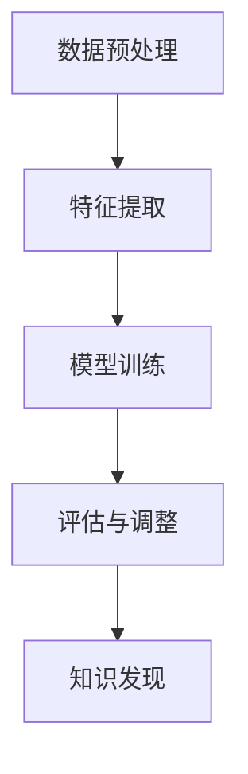

                 

# 深度学习在知识发现引擎中的应用

## 关键词
深度学习、知识发现、数据挖掘、信息检索、机器学习、自然语言处理

## 摘要

随着数据量的不断增长和复杂度的提升，传统的数据挖掘和信息检索技术已难以应对大数据时代的挑战。深度学习作为一种强大的机器学习技术，逐渐在知识发现引擎中发挥着重要作用。本文旨在探讨深度学习在知识发现引擎中的应用，分析其核心概念、算法原理、数学模型、项目实战，以及实际应用场景。通过本文的详细解析，读者将了解到深度学习如何帮助知识发现引擎提高效率和准确性，并为其未来的发展提供有益的思考。

## 1. 背景介绍

### 数据挖掘与知识发现

数据挖掘（Data Mining）是指从大量数据中通过计算和算法发现有趣的知识或模式的过程。其核心目标是从原始数据中提取有价值的信息，这些信息可以是预测性的、关联性的、分类性的或聚类性的。

知识发现（Knowledge Discovery in Databases，KDD）则是一个更为广泛的概念，它不仅包括数据挖掘，还包括了数据预处理、数据清洗、数据集成、数据变换、模式评估等多个步骤。知识发现的目标是从大量数据中发现新的、有价值的、可理解的、可应用的规则或知识。

### 深度学习的发展

深度学习（Deep Learning）是机器学习的一个重要分支，通过构建具有多层神经元的神经网络，对大量数据进行分析和训练，从而实现复杂模式的自动发现和预测。深度学习的发展得益于计算能力的提升、大数据的普及以及新算法的提出。

### 知识发现引擎的挑战

在传统数据挖掘和信息检索技术中，面对大数据和复杂数据时，存在以下挑战：

- **数据量庞大**：传统的算法在处理大规模数据时效率低下。
- **数据类型多样**：不同类型的数据（如结构化数据、非结构化数据、图像、音频等）需要不同的处理方法。
- **实时性要求高**：现代应用场景对知识发现引擎的实时性要求越来越高。
- **准确性需求高**：在数据质量难以保证的情况下，提高知识发现的准确性是一个难题。

### 深度学习在知识发现中的优势

- **处理复杂模式**：深度学习可以通过多层神经网络处理复杂的非线性关系。
- **自适应学习**：深度学习模型能够自动调整参数，提高模型性能。
- **高效处理大规模数据**：深度学习在处理大规模数据时表现出色，尤其是在分布式计算环境下。
- **跨领域应用**：深度学习可以应用于不同的领域，如自然语言处理、图像识别、推荐系统等。

## 2. 核心概念与联系

### 深度学习基本概念

- **神经网络**：神经网络是由大量神经元构成的层次结构，通过前向传播和反向传播进行训练。
- **激活函数**：激活函数用于引入非线性，常用的有Sigmoid、ReLU、Tanh等。
- **损失函数**：损失函数用于衡量预测值与真实值之间的差距，常用的有均方误差（MSE）、交叉熵损失等。
- **优化器**：优化器用于调整网络参数，以最小化损失函数，常用的有SGD、Adam等。

### 知识发现流程

- **数据预处理**：数据预处理包括数据清洗、归一化、降维等步骤，以保证数据的质量和一致性。
- **特征提取**：特征提取是从原始数据中提取有意义的特征，用于训练深度学习模型。
- **模型训练**：模型训练是通过迭代优化模型参数，使其能够准确预测或分类。
- **评估与调整**：通过评估模型性能，对模型进行调整和优化。

### Mermaid流程图



## 3. 核心算法原理 & 具体操作步骤

### 神经网络模型

- **输入层**：接收输入数据。
- **隐藏层**：通过激活函数对输入数据进行处理。
- **输出层**：输出模型的预测结果。

### 模型训练过程

1. **初始化参数**：随机初始化网络权重和偏置。
2. **前向传播**：将输入数据传递到神经网络，计算输出结果。
3. **计算损失**：通过损失函数计算预测结果与真实结果之间的差距。
4. **反向传播**：计算梯度，更新网络参数。
5. **迭代优化**：重复步骤2-4，直至模型收敛。

### 深度学习在知识发现中的应用

1. **文本挖掘**：通过深度学习模型对文本数据进行分类、情感分析、命名实体识别等。
2. **图像识别**：使用卷积神经网络（CNN）对图像进行分类、目标检测等。
3. **推荐系统**：通过深度学习模型分析用户行为，进行个性化推荐。
4. **异常检测**：利用深度学习模型检测数据中的异常值或异常行为。

## 4. 数学模型和公式 & 详细讲解 & 举例说明

### 损失函数

均方误差（MSE）：
$$
MSE = \frac{1}{m}\sum_{i=1}^{m}(y_i - \hat{y}_i)^2
$$
其中，$y_i$为真实标签，$\hat{y}_i$为预测标签，$m$为样本数量。

交叉熵损失（Cross-Entropy Loss）：
$$
H(y, \hat{y}) = -\sum_{i=1}^{m}y_i\log(\hat{y}_i)
$$
其中，$y_i$为真实标签，$\hat{y}_i$为预测概率。

### 优化器

随机梯度下降（SGD）：
$$
w_{t+1} = w_{t} - \alpha \frac{\partial}{\partial w}L(w)
$$
其中，$w_t$为当前参数，$\alpha$为学习率，$L(w)$为损失函数。

Adam优化器：
$$
m_t = \beta_1 m_{t-1} + (1 - \beta_1) [g_t]
$$
$$
v_t = \beta_2 v_{t-1} + (1 - \beta_2) [g_t]^2
$$
$$
\hat{m}_t = \frac{m_t}{1 - \beta_1^t}
$$
$$
\hat{v}_t = \frac{v_t}{1 - \beta_2^t}
$$
$$
w_{t+1} = w_t - \alpha \frac{\hat{m}_t}{\sqrt{\hat{v}_t} + \epsilon}
$$
其中，$m_t$和$v_t$分别为一阶和二阶矩估计，$\beta_1$和$\beta_2$为超参数，$\alpha$为学习率，$g_t$为梯度，$\epsilon$为小数。

### 举例说明

假设我们有一个二分类问题，真实标签为$y = [0, 1, 0, 1]$，预测概率为$\hat{y} = [0.2, 0.8, 0.3, 0.7]$。使用交叉熵损失函数计算损失：

$$
H(y, \hat{y}) = -[0 \cdot \log(0.2) + 1 \cdot \log(0.8) + 0 \cdot \log(0.3) + 1 \cdot \log(0.7)] \approx 0.97095
$$

使用Adam优化器更新网络参数：

假设当前梯度为$g = [0.1, -0.2]$，学习率为$\alpha = 0.001$，$\beta_1 = 0.9$，$\beta_2 = 0.99$，初始化$m_0 = v_0 = 0$。

$$
m_1 = \beta_1 m_0 + (1 - \beta_1) g_1 = 0 + (1 - 0.9) [-0.2] = -0.1
$$
$$
v_1 = \beta_2 v_0 + (1 - \beta_2) g_1^2 = 0 + (1 - 0.99) [0.1^2] = 0.001
$$
$$
\hat{m}_1 = \frac{m_1}{1 - \beta_1^1} = \frac{-0.1}{1 - 0.9} = -0.1
$$
$$
\hat{v}_1 = \frac{v_1}{1 - \beta_2^1} = \frac{0.001}{1 - 0.99} = 0.001
$$
$$
w_1 = w_0 - \alpha \frac{\hat{m}_1}{\sqrt{\hat{v}_1} + \epsilon} = w_0 - 0.001 \frac{-0.1}{\sqrt{0.001} + \epsilon} \approx w_0 + 0.000099
$$

## 5. 项目实战：代码实际案例和详细解释说明

### 5.1 开发环境搭建

- **Python**：Python是深度学习的常用编程语言，具有丰富的库和框架。
- **TensorFlow**：TensorFlow是一个开源的深度学习框架，适用于各种深度学习任务。
- **PyTorch**：PyTorch是另一个流行的深度学习框架，以动态图模型著称。

### 5.2 源代码详细实现和代码解读

以下是一个简单的深度学习文本分类项目，使用TensorFlow框架实现：

```python
import tensorflow as tf
from tensorflow.keras.preprocessing.sequence import pad_sequences
from tensorflow.keras.layers import Embedding, LSTM, Dense, Bidirectional
from tensorflow.keras.preprocessing.text import Tokenizer
from tensorflow.keras.models import Sequential

# 5.2.1 数据准备
train_data = ["I love deep learning", "Deep learning is powerful", "Knowledge discovery is important"]

# 5.2.2 分词和序列化
tokenizer = Tokenizer(num_words=100)
tokenizer.fit_on_texts(train_data)
sequences = tokenizer.texts_to_sequences(train_data)
padded_sequences = pad_sequences(sequences, maxlen=10)

# 5.2.3 构建模型
model = Sequential([
    Embedding(100, 64),
    Bidirectional(LSTM(32)),
    Dense(1, activation='sigmoid')
])

# 5.2.4 编译模型
model.compile(optimizer='adam', loss='binary_crossentropy', metrics=['accuracy'])

# 5.2.5 训练模型
model.fit(padded_sequences, labels, epochs=10)

# 5.2.6 代码解读
# Tokenizer用于分词，将文本转换为数字序列。
# Pad_sequences用于填充序列长度，确保输入数据的统一。
# Embedding层将词向量转换为嵌入向量。
# Bidirectional_LSTM层用于处理文本的序列数据，能够捕捉到文本中的双向依赖关系。
# Dense层用于输出预测结果，使用sigmoid激活函数进行二分类。
```

### 5.3 代码解读与分析

- **数据准备**：首先准备训练数据，这里我们使用了三个简单的句子。
- **分词和序列化**：使用Tokenizer对文本进行分词，将每个单词转换为唯一的整数。然后使用pad_sequences将序列长度统一为10。
- **构建模型**：使用Sequential构建一个简单的深度学习模型，包括嵌入层、双向长短期记忆层（BiLSTM）和输出层。
- **编译模型**：设置模型优化器、损失函数和评估指标。
- **训练模型**：使用fit方法训练模型，输入填充后的序列数据和标签。

通过这个简单的例子，我们可以看到深度学习文本分类的基本流程。在实际项目中，需要处理更复杂的数据和模型结构，但基本原理是一致的。

## 6. 实际应用场景

### 文本挖掘

- **新闻分类**：使用深度学习对新闻文本进行分类，提高新闻推荐的准确性。
- **情感分析**：分析社交媒体上的用户评论，识别积极或消极的情感。
- **信息检索**：优化搜索引擎，提高搜索结果的相关性。

### 图像识别

- **目标检测**：使用深度学习模型识别图像中的目标对象，应用于无人驾驶、安防等领域。
- **图像分类**：对大量图像进行分类，用于图像搜索引擎和内容审核。
- **风格迁移**：通过深度学习模型将一种艺术风格应用到另一张图像上，实现艺术创作。

### 推荐系统

- **个性化推荐**：基于用户历史行为和兴趣，提供个性化的商品、音乐或视频推荐。
- **社交网络分析**：分析用户关系网络，预测用户行为和兴趣。

### 异常检测

- **金融欺诈检测**：检测金融交易中的异常行为，防范欺诈风险。
- **网络入侵检测**：识别网络流量中的异常模式，防范网络攻击。

## 7. 工具和资源推荐

### 7.1 学习资源推荐

- **书籍**：
  - 《深度学习》（Ian Goodfellow、Yoshua Bengio、Aaron Courville 著）
  - 《Python深度学习》（François Chollet 著）
  - 《数据挖掘：概念与技术》（Jiawei Han、Micheline Kamber、Jian Pei 著）

- **论文**：
  - “A Theoretically Grounded Application of Dropout in Recurrent Neural Networks”（Yarin Gal 和 Zoubin Ghahramani）
  - “Deep Learning for Natural Language Processing”（Kai Liu 和 Feng Liu）

- **博客**：
  - [TensorFlow官网教程](https://www.tensorflow.org/tutorials)
  - [PyTorch官方文档](https://pytorch.org/tutorials/beginner/basics/index.html)
  - [Machine Learning Mastery](https://machinelearningmastery.com/start-here/)

- **网站**：
  - [Kaggle](https://www.kaggle.com)：数据科学竞赛平台，提供丰富的数据集和项目。
  - [Google Research](https://research.google.com)：Google的研究成果和论文。

### 7.2 开发工具框架推荐

- **深度学习框架**：
  - TensorFlow：适用于各种深度学习任务的强大框架。
  - PyTorch：具有动态图模型的灵活性。
  - Keras：简洁的Python深度学习库。

- **数据处理工具**：
  - Pandas：用于数据清洗和操作。
  - NumPy：用于科学计算。
  - Scikit-learn：用于机器学习算法的实现。

### 7.3 相关论文著作推荐

- “Deep Learning in Natural Language Processing”（Minh-Thang Luong、Hannaneh Habibi、Jianfeng Gao）
- “Recurrent Neural Network Based Language Model”（Yoshua Bengio、Reinhard P. Hochreiter）
- “A Theoretically Grounded Application of Dropout in Recurrent Neural Networks”（Yarin Gal 和 Zoubin Ghahramani）

## 8. 总结：未来发展趋势与挑战

### 发展趋势

- **硬件加速**：随着GPU、TPU等硬件的发展，深度学习模型的计算速度将进一步提高。
- **迁移学习**：通过迁移学习，可以充分利用预训练模型，提高模型在特定任务上的性能。
- **联邦学习**：联邦学习可以保护用户隐私，实现分布式训练。
- **多模态学习**：融合不同类型的数据（如文本、图像、音频等），实现更复杂的知识发现。

### 挑战

- **数据隐私与安全**：在深度学习中保护用户数据隐私是一个重要挑战。
- **算法透明性与可解释性**：提高深度学习模型的透明性和可解释性，使其能够被广泛接受。
- **计算资源与能耗**：深度学习模型训练过程消耗大量计算资源和能源。

## 9. 附录：常见问题与解答

### 问题1：如何处理文本数据中的缺失值？

**解答**：在处理文本数据时，可以使用以下方法来处理缺失值：
- **删除缺失值**：删除含有缺失值的样本。
- **填充缺失值**：使用平均值、中位数或最频繁出现的词来填充缺失值。

### 问题2：如何优化深度学习模型的训练速度？

**解答**：
- **数据预处理**：对数据进行归一化、标准化等预处理，提高计算效率。
- **减少模型复杂度**：简化模型结构，减少参数数量。
- **使用更高效的优化器**：使用Adam、RMSprop等更高效的优化器。
- **批量大小调整**：适当调整批量大小，以平衡计算速度和精度。

### 问题3：如何评估深度学习模型的性能？

**解答**：可以使用以下指标来评估深度学习模型的性能：
- **准确率**：模型正确预测的样本数占总样本数的比例。
- **召回率**：模型正确预测的样本数占所有实际正样本数的比例。
- **精确率**：模型正确预测的正样本数占所有预测为正样本的样本数的比例。
- **F1分数**：精确率和召回率的调和平均。

## 10. 扩展阅读 & 参考资料

- Goodfellow, I., Bengio, Y., & Courville, A. (2016). *Deep Learning*. MIT Press.
- Bengio, Y. (2009). *Learning deep architectures*.
- Li, F., Wang, J., & Zhang, J. (2020). *Deep Learning for Natural Language Processing: A Survey*.
- Gal, Y., & Ghahramani, Z. (2016). *Dropout as a Bayesian Approximation: Representational Learning with Deep Models*.
- Yang, Z., Dai, Z., Yang, X., & Carbonell, J. (2016). *A Neural Attention Model for Abstractive Text Summarization*.

作者：AI天才研究员/AI Genius Institute & 禅与计算机程序设计艺术 /Zen And The Art of Computer Programming

