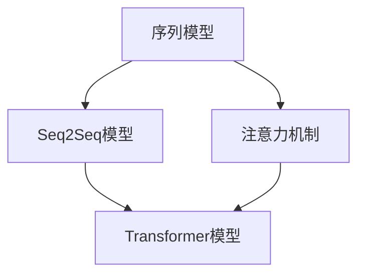
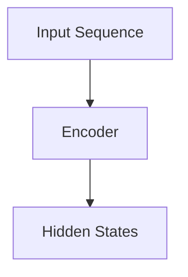
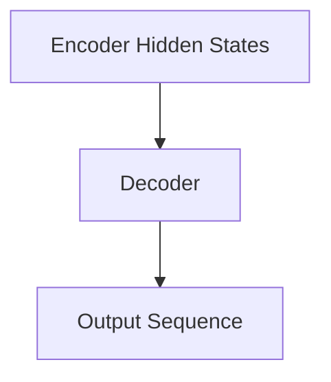
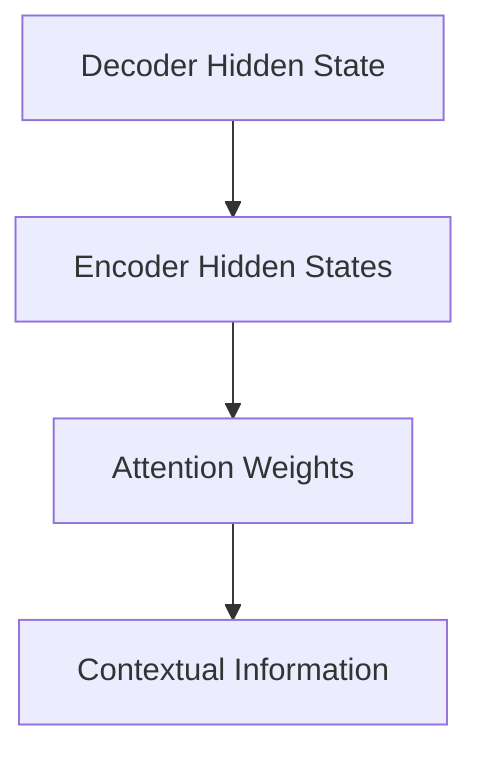
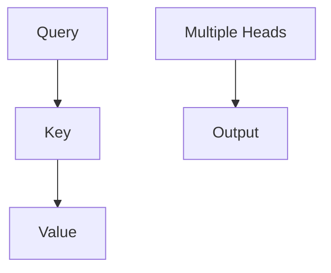
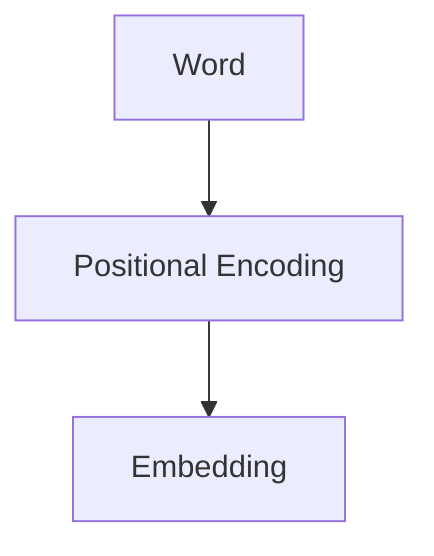

                 

# 深度学习在自然语言生成中的创新应用

> **关键词：自然语言生成、深度学习、神经网络、序列到序列模型、Transformer、BERT、生成对抗网络（GAN）、预训练语言模型**

> **摘要：本文将深入探讨深度学习在自然语言生成（NLG）领域的创新应用，从背景介绍到核心概念、算法原理、数学模型、项目实战，再到实际应用场景和未来发展趋势，全面解析NLG技术的现状与潜力。**

## 1. 背景介绍

自然语言生成（Natural Language Generation，NLG）是一种人工智能技术，旨在利用计算机程序生成自然语言文本，从而实现人与机器的交流。自20世纪50年代人工智能（AI）概念提出以来，NLG一直是AI研究的重要方向之一。早期的研究主要基于规则和模板匹配方法，但随着深度学习的兴起，基于神经网络的NLG模型逐渐成为研究热点。

### 1.1 早期方法

早期NLG技术主要依靠手工编写的规则和模板。这种方法在简单任务中具有一定的效果，但当文本生成任务变得复杂时，规则匹配的局限性变得尤为明显。例如，在机器翻译、文本摘要和对话系统等领域，基于规则的方法很难处理大量的语言变体和语义信息。

### 1.2 深度学习时代的NLG

随着深度学习技术的发展，神经网络在图像识别、语音识别等领域取得了巨大成功，这为NLG领域的研究带来了新的契机。基于神经网络的NLG模型，如序列到序列（Seq2Seq）模型和Transformer模型，通过端到端的学习方式，能够捕捉到复杂的语言特征和语义信息，从而在自然语言生成任务中表现出色。

## 2. 核心概念与联系

自然语言生成涉及多个核心概念，包括序列模型、注意力机制、Transformer架构等。以下是一个简化的Mermaid流程图，用于描述这些核心概念及其相互关系。



### 2.1 序列模型

序列模型是处理序列数据的数学模型，广泛应用于时间序列分析、语音识别和自然语言处理等领域。在NLG中，序列模型用于处理输入序列（例如文本）并生成输出序列（例如翻译或摘要）。

### 2.2 注意力机制

注意力机制（Attention Mechanism）是一种用于捕捉序列之间关联性的方法，常用于序列模型中。它通过加权输入序列中的元素，使得模型在生成输出序列时能够关注到重要的信息，从而提高生成文本的质量。

### 2.3 Transformer模型

Transformer模型是一种基于自注意力（Self-Attention）机制的深度神经网络架构，首次用于机器翻译任务，取得了显著的效果。它通过多头注意力机制和位置编码，能够处理长序列并捕捉复杂的关系。

## 3. 核心算法原理 & 具体操作步骤

### 3.1 Seq2Seq模型

序列到序列（Seq2Seq）模型是一种用于序列转换的神经网络模型，由编码器（Encoder）和解码器（Decoder）两部分组成。编码器将输入序列编码为固定长度的向量，解码器则使用这些向量生成输出序列。

#### 3.1.1 编码器

编码器通常采用循环神经网络（RNN）或长短期记忆网络（LSTM）作为基础架构。它的主要任务是读取输入序列，并生成一个隐藏状态序列，其中最后一个隐藏状态代表整个输入序列的编码。



#### 3.1.2 解码器

解码器负责将编码器的隐藏状态序列解码为输出序列。在训练过程中，解码器的输入不仅包括编码器的隐藏状态，还包括已经生成的部分输出序列，从而实现端到端的序列转换。



### 3.2 注意力机制

注意力机制是Seq2Seq模型中的一个关键组件，它用于在解码过程中为当前生成的词提供上下文信息。注意力机制通过计算编码器隐藏状态和当前解码器隐藏状态之间的相似度，为每个隐藏状态分配权重，从而加权平均得到当前词的上下文信息。



### 3.3 Transformer模型

Transformer模型由多个自注意力层和前馈神经网络组成，用于处理序列数据。它的核心思想是使用自注意力机制来计算序列中每个词之间的关系，而不是像RNN那样按时间顺序处理。

#### 3.3.1 多头注意力

多头注意力（Multi-Head Attention）是Transformer模型中的一个关键特性。它通过多个独立的注意力机制来捕获不同的关系，从而提高模型的表示能力。



#### 3.3.2 位置编码

由于Transformer模型中没有显式的序列处理机制，因此需要使用位置编码（Positional Encoding）来引入序列的位置信息。位置编码是一个可学习的向量，它为每个词分配了一个位置特征，从而帮助模型理解词的顺序关系。



## 4. 数学模型和公式 & 详细讲解 & 举例说明

### 4.1 Seq2Seq模型

Seq2Seq模型的核心在于编码器和解码器之间的交互。以下是一个简化的数学模型：

$$
E(x) = \{h_t\}_{t=1}^T
$$

$$
D(h) = \{y_t\}_{t=1}^T
$$

其中，$E(x)$ 表示编码器输出的隐藏状态序列，$D(h)$ 表示解码器生成的输出序列。$h_t$ 和 $y_t$ 分别表示编码器和解码器在时间 $t$ 的隐藏状态和输出。

### 4.2 注意力机制

注意力机制的核心是计算注意力权重。以下是一个基于加性注意力（Additive Attention）的注意力权重计算公式：

$$
a_t = \text{softmax}\left(\frac{QK^T}{\sqrt{d_k}}\right)
$$

$$
\text{context} = \text{softmax}\left(\frac{QK^T}{\sqrt{d_k}}\right) \cdot K
$$

其中，$Q$ 和 $K$ 分别表示查询（Query）和键（Key），$V$ 表示值（Value）。$d_k$ 是键的维度，$\text{softmax}$ 函数用于计算注意力权重。

### 4.3 Transformer模型

Transformer模型中的多头注意力机制可以通过以下公式表示：

$$
\text{MultiHead}(Q, K, V) = \text{softmax}\left(\frac{QW_Q K^T}{\sqrt{d_k}}\right)W_V
$$

其中，$W_Q, W_K, W_V$ 分别是查询、键和值的权重矩阵。$d_k$ 是键的维度。

## 5. 项目实战：代码实际案例和详细解释说明

### 5.1 开发环境搭建

为了进行深度学习自然语言生成项目，首先需要搭建一个合适的环境。以下是一个基本的Python开发环境搭建步骤：

1. 安装Python（建议使用3.7及以上版本）
2. 安装TensorFlow库（使用pip install tensorflow）
3. 安装其他必要的库，如NumPy、Pandas等

### 5.2 源代码详细实现和代码解读

以下是一个简单的自然语言生成项目，使用Transformer模型进行文本生成。

```python
import tensorflow as tf
from tensorflow.keras.layers import Embedding, LSTM, Dense
from tensorflow.keras.models import Model

# 参数设置
vocab_size = 10000
embedding_dim = 256
lstm_units = 128

# 模型定义
inputs = tf.keras.Input(shape=(None,))
x = Embedding(vocab_size, embedding_dim)(inputs)
x = LSTM(lstm_units, return_sequences=True)(x)
outputs = Dense(vocab_size, activation='softmax')(x)

model = Model(inputs=inputs, outputs=outputs)
model.compile(optimizer='adam', loss='categorical_crossentropy', metrics=['accuracy'])

# 模型训练
model.fit(x_train, y_train, batch_size=64, epochs=10)

# 文本生成
def generate_text(seed_text, model, max_length=40):
    in_text, next_words = seed_text, seed_text
    for _ in range(max_length):
        predictions = model.predict(np.array([in_text]))
        next_word = np.argmax(predictions[:, -1, :])
        next_words = next_words + " " + str(next_word)
        in_text = in_text + " " + str(next_word)
    return next_words

# 示例
seed_text = "这是一个简单的"
generated_text = generate_text(seed_text, model)
print(generated_text)
```

### 5.3 代码解读与分析

上述代码定义了一个基于LSTM的序列到序列模型，用于文本生成。以下是代码的详细解读：

1. **参数设置**：设置词汇表大小、嵌入维度和LSTM单元数。
2. **模型定义**：使用Keras构建模型，包括嵌入层、LSTM层和输出层。嵌入层用于将单词转换为嵌入向量，LSTM层用于处理序列数据，输出层用于生成单词的概率分布。
3. **模型编译**：编译模型，指定优化器、损失函数和评价指标。
4. **模型训练**：使用训练数据对模型进行训练。
5. **文本生成**：定义一个函数，用于根据种子文本生成新的文本。函数中，通过循环模型预测下一个单词，并将预测结果添加到生成的文本中。

## 6. 实际应用场景

自然语言生成技术已在多个领域得到广泛应用，以下是一些典型的应用场景：

1. **机器翻译**：使用深度学习模型，如Transformer和BERT，实现高质量、多语言的文本翻译。
2. **文本摘要**：自动生成文章的摘要，帮助用户快速了解文章的核心内容。
3. **对话系统**：在聊天机器人中，使用NLG技术生成自然、流畅的回复，提高用户体验。
4. **内容生成**：自动生成新闻文章、博客内容、产品描述等，节省人力和时间成本。

## 7. 工具和资源推荐

### 7.1 学习资源推荐

- **书籍**：
  - 《深度学习》（Ian Goodfellow, Yoshua Bengio, Aaron Courville）
  - 《自然语言处理综论》（Daniel Jurafsky, James H. Martin）
  - 《自然语言处理入门》（Stanford University CS224N）

- **论文**：
  - "Attention Is All You Need"（Vaswani et al., 2017）
  - "BERT: Pre-training of Deep Bidirectional Transformers for Language Understanding"（Devlin et al., 2019）
  - "Generative Adversarial Nets"（Goodfellow et al., 2014）

- **博客**：
  - [TensorFlow官方文档](https://www.tensorflow.org/)
  - [PyTorch官方文档](https://pytorch.org/)
  - [机器之心](https://www.jiqizhixin.com/)

- **网站**：
  - [ArXiv](https://arxiv.org/)
  - [ACL](https://www.aclweb.org/)
  - [NeurIPS](https://nips.cc/)

### 7.2 开发工具框架推荐

- **深度学习框架**：
  - TensorFlow
  - PyTorch
  - Keras

- **自然语言处理工具**：
  - NLTK
  - Spacy
  - Stanford CoreNLP

- **文本处理库**：
  - Python字符串操作库（如`re`、`string`）
  - Pandas（用于数据操作）
  - NumPy（用于数值计算）

### 7.3 相关论文著作推荐

- **《深度学习在自然语言处理中的应用》**（李航）
- **《自然语言处理：算法与应用》**（Daniel Jurafsky, James H. Martin）
- **《神经网络与深度学习》**（邱锡鹏）

## 8. 总结：未来发展趋势与挑战

自然语言生成技术在近年来取得了显著进展，但仍然面临着许多挑战。未来发展趋势主要包括：

1. **模型规模和性能的持续提升**：随着计算资源和数据量的增加，深度学习模型将变得更大、更复杂，从而在性能和效果上实现新的突破。
2. **跨模态生成**：自然语言生成技术将与其他模态（如图像、音频）相结合，实现跨模态的生成和交互。
3. **生成质量与多样性**：提高生成文本的质量和多样性，满足不同用户的需求，避免生成“千篇一律”的文本。
4. **可解释性和可控性**：增强NLG模型的可解释性，使其生成的内容更加透明和可控。

## 9. 附录：常见问题与解答

### 9.1 什么是自然语言生成？

自然语言生成（NLG）是一种人工智能技术，旨在利用计算机程序生成自然语言文本，从而实现人与机器的交流。

### 9.2 深度学习在NLG中的应用有哪些？

深度学习在NLG中的应用主要包括序列到序列（Seq2Seq）模型、Transformer模型、BERT模型和生成对抗网络（GAN）等。

### 9.3 如何评估NLG模型的质量？

评估NLG模型的质量可以从多个角度进行，包括BLEU分数、ROUGE分数、人类评估等。

### 9.4 NLG技术有哪些实际应用场景？

NLG技术的实际应用场景包括机器翻译、文本摘要、对话系统、内容生成等。

## 10. 扩展阅读 & 参考资料

- [Vaswani et al., 2017]. *Attention Is All You Need*. In Proceedings of the 55th Annual Meeting of the Association for Computational Linguistics (ACL).
- [Devlin et al., 2019]. *BERT: Pre-training of Deep Bidirectional Transformers for Language Understanding*. In Proceedings of the 2019 Conference of the North American Chapter of the Association for Computational Linguistics: Human Language Technologies (NAACL-HLT).
- [Goodfellow et al., 2014]. *Generative Adversarial Nets*. In Advances in Neural Information Processing Systems (NIPS).
- [李航, 2019]. *深度学习在自然语言处理中的应用*. 电子工业出版社.
- [Daniel Jurafsky, James H. Martin, 2000]. *自然语言处理：算法与应用*. 清华大学出版社.

### 作者

**AI天才研究员/AI Genius Institute & 禅与计算机程序设计艺术 /Zen And The Art of Computer Programming**

