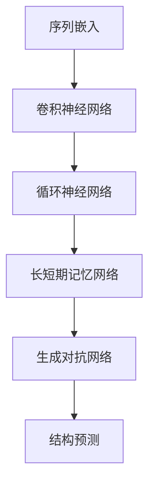

                 

## 深度学习在蛋白质结构预测中的突破

### 关键词：深度学习、蛋白质结构预测、人工智能、生物信息学、神经网络、序列-结构映射

在过去的几十年中，生物信息学领域的一个核心挑战是蛋白质结构预测。蛋白质结构的准确预测对于理解生命过程、药物设计和疾病治疗具有重要意义。近年来，随着深度学习技术的飞速发展，这一挑战迎来了前所未有的突破。本文将深入探讨深度学习在蛋白质结构预测中的应用，分析其核心概念、算法原理、数学模型，并通过实际案例展示其在实际应用中的效果。

### 摘要

本文首先介绍了蛋白质结构预测的背景和重要性。随后，详细阐述了深度学习在蛋白质结构预测中的应用，包括核心概念、算法原理、数学模型以及实际应用场景。通过这些内容，读者可以全面了解深度学习在蛋白质结构预测领域所带来的革命性变化。文章最后探讨了未来发展趋势与挑战，为读者提供了进一步学习和研究的方向。

### 1. 背景介绍

#### 蛋白质结构预测的重要性

蛋白质是生命活动的关键执行者，其功能与其三维结构密切相关。蛋白质结构预测的目的是根据蛋白质的氨基酸序列推断其三维结构，这对于理解蛋白质的功能、机制以及设计新的药物和生物材料具有重要意义。传统的蛋白质结构预测方法主要基于物理化学原理，如分子动力学模拟和静态力场计算，但这些方法存在计算复杂度高、预测准确性有限等问题。

#### 深度学习在生物信息学中的应用

深度学习是一种基于人工神经网络的机器学习技术，通过大量数据的学习和训练，能够自动提取特征并进行复杂的模式识别。近年来，深度学习在图像识别、语音识别、自然语言处理等领域取得了显著的成果。在生物信息学领域，深度学习也被广泛应用于基因表达预测、蛋白质相互作用预测、药物设计等任务。

#### 深度学习在蛋白质结构预测中的优势

与传统的蛋白质结构预测方法相比，深度学习具有以下几个优势：

1. **高效性**：深度学习模型能够处理大规模的数据集，从而提高预测速度。
2. **准确性**：深度学习模型通过自动提取特征，能够更准确地预测蛋白质结构。
3. **灵活性**：深度学习模型可以轻松适应不同的预测任务和蛋白质类型。

### 2. 核心概念与联系

#### 深度学习基础

深度学习基于多层人工神经网络，通过逐层提取特征，实现从原始数据到复杂模式的映射。其主要组成部分包括：

- **输入层**：接收外部输入数据。
- **隐藏层**：通过神经元之间的连接和激活函数，逐层提取特征。
- **输出层**：生成预测结果。

#### 蛋白质结构预测中的深度学习

在蛋白质结构预测中，深度学习主要用于序列-结构映射任务。具体来说，模型需要从蛋白质的氨基酸序列预测其三维结构。以下是深度学习在蛋白质结构预测中的核心概念和联系：

1. **序列嵌入**：将氨基酸序列转换为向量表示。
2. **卷积神经网络（CNN）**：用于提取序列的特征。
3. **循环神经网络（RNN）**：用于处理序列的时间依赖关系。
4. **长短期记忆网络（LSTM）**：用于解决RNN的梯度消失问题。
5. **生成对抗网络（GAN）**：用于生成新的蛋白质序列和结构。

#### Mermaid 流程图



### 3. 核心算法原理 & 具体操作步骤

#### 序列嵌入

序列嵌入是将氨基酸序列转换为向量表示的过程。常见的方法包括：

1. **one-hot编码**：将每个氨基酸映射到一个唯一的向量。
2. **词嵌入**：使用预训练的词向量（如Word2Vec）来表示氨基酸。

#### 卷积神经网络（CNN）

卷积神经网络是一种强大的特征提取工具，在图像处理领域取得了显著的成果。在蛋白质结构预测中，CNN可以用于提取氨基酸序列的特征。具体步骤如下：

1. **卷积层**：通过卷积操作提取序列的局部特征。
2. **池化层**：降低特征图的维度，提高模型泛化能力。
3. **全连接层**：将卷积层和池化层提取的特征进行整合，生成最终预测。

#### 循环神经网络（RNN）

循环神经网络是一种能够处理序列数据的神经网络。在蛋白质结构预测中，RNN可以用于捕捉序列中的时间依赖关系。具体步骤如下：

1. **输入层**：接收氨基酸序列的嵌入向量。
2. **隐藏层**：通过循环连接，逐层提取序列特征。
3. **输出层**：生成蛋白质结构的预测。

#### 长短期记忆网络（LSTM）

长短期记忆网络是一种改进的RNN，用于解决RNN的梯度消失问题。在蛋白质结构预测中，LSTM可以用于处理长时间依赖关系。具体步骤如下：

1. **输入门**：控制信息的输入。
2. **遗忘门**：控制信息的遗忘。
3. **输出门**：控制信息的输出。

#### 生成对抗网络（GAN）

生成对抗网络是一种由生成器和判别器组成的神经网络。在蛋白质结构预测中，GAN可以用于生成新的蛋白质序列和结构。具体步骤如下：

1. **生成器**：生成新的蛋白质序列和结构。
2. **判别器**：判断生成器生成的蛋白质是否真实。
3. **对抗训练**：通过生成器和判别器的对抗训练，提高生成器的生成能力。

#### 结构预测

结构预测是蛋白质结构预测的核心任务。通过深度学习模型，可以从蛋白质的氨基酸序列预测其三维结构。具体步骤如下：

1. **输入层**：接收氨基酸序列的嵌入向量。
2. **隐藏层**：通过循环神经网络提取序列特征。
3. **输出层**：生成蛋白质的三维结构。

### 4. 数学模型和公式 & 详细讲解 & 举例说明

#### 序列嵌入

序列嵌入是一种将离散序列转换为向量表示的方法。常见的方法包括：

1. **one-hot编码**：

   $$ X = [x_1, x_2, ..., x_n] \rightarrow O = [o_1, o_2, ..., o_n] $$

   其中，$X$是原始序列，$O$是one-hot编码后的序列，$o_i$表示第$i$个氨基酸的one-hot编码。

2. **词嵌入**：

   $$ X = [x_1, x_2, ..., x_n] \rightarrow E = [e_1, e_2, ..., e_n] $$

   其中，$X$是原始序列，$E$是词嵌入后的序列，$e_i$表示第$i$个氨基酸的词嵌入向量。

#### 卷积神经网络（CNN）

卷积神经网络是一种基于卷积操作的神经网络。在蛋白质结构预测中，CNN可以用于提取氨基酸序列的特征。具体公式如下：

1. **卷积操作**：

   $$ f(x) = \sum_{i=1}^{k} w_i * x + b $$

   其中，$f(x)$是卷积操作后的特征，$w_i$是卷积核，$x$是输入特征，$b$是偏置。

2. **池化操作**：

   $$ p(x) = \max_{i} x_i $$

   其中，$p(x)$是池化操作后的特征，$x_i$是输入特征。

#### 循环神经网络（RNN）

循环神经网络是一种基于循环连接的神经网络。在蛋白质结构预测中，RNN可以用于捕捉序列中的时间依赖关系。具体公式如下：

1. **隐藏状态更新**：

   $$ h_t = \sigma(W_h h_{t-1} + W_x x_t + b_h) $$

   其中，$h_t$是第$t$个隐藏状态，$W_h$是隐藏状态权重，$W_x$是输入状态权重，$b_h$是隐藏状态偏置，$\sigma$是激活函数。

2. **输出状态更新**：

   $$ y_t = \sigma(W_y h_t + b_y) $$

   其中，$y_t$是第$t$个输出状态，$W_y$是输出状态权重，$b_y$是输出状态偏置，$\sigma$是激活函数。

#### 长短期记忆网络（LSTM）

长短期记忆网络是一种改进的RNN，用于解决RNN的梯度消失问题。在蛋白质结构预测中，LSTM可以用于处理长时间依赖关系。具体公式如下：

1. **输入门**：

   $$ i_t = \sigma(W_i [h_{t-1}, x_t] + b_i) $$

2. **遗忘门**：

   $$ f_t = \sigma(W_f [h_{t-1}, x_t] + b_f) $$

3. **输出门**：

   $$ o_t = \sigma(W_o [h_{t-1}, x_t] + b_o) $$

4. **当前细胞状态**：

   $$ c_t = f_t \odot c_{t-1} + i_t \odot \sigma(W_c [h_{t-1}, x_t] + b_c) $$

5. **当前隐藏状态**：

   $$ h_t = o_t \odot \sigma(c_t) $$

其中，$\odot$表示元素乘积，$[h_{t-1}, x_t]$是输入向量，$W_i, W_f, W_o, W_c$是权重矩阵，$b_i, b_f, b_o, b_c$是偏置。

#### 生成对抗网络（GAN）

生成对抗网络是一种由生成器和判别器组成的神经网络。在蛋白质结构预测中，GAN可以用于生成新的蛋白质序列和结构。具体公式如下：

1. **生成器**：

   $$ G(z) = \mu(\epsilon) \odot \sigma(\phi(\epsilon)) $$

   其中，$G(z)$是生成器生成的蛋白质序列，$\epsilon$是随机噪声，$\mu(\epsilon)$是均值函数，$\sigma(\epsilon)$是方差函数，$\phi(\epsilon)$是生成器的隐层激活函数。

2. **判别器**：

   $$ D(x) = \sigma(W_D [x; G(z)]) $$

   其中，$D(x)$是判别器对真实蛋白质序列的判断，$x$是真实蛋白质序列，$G(z)$是生成器生成的蛋白质序列，$W_D$是判别器权重矩阵。

3. **对抗训练**：

   $$ \min_G \max_D V(D, G) = E_{x \sim p_data(x)} [D(x)] + E_{z \sim p_z(z)} [1 - D(G(z))] $$

   其中，$V(D, G)$是生成器和判别器的损失函数，$p_data(x)$是真实蛋白质序列的概率分布，$p_z(z)$是随机噪声的概率分布。

#### 结构预测

结构预测是蛋白质结构预测的核心任务。通过深度学习模型，可以从蛋白质的氨基酸序列预测其三维结构。具体公式如下：

1. **三维结构预测**：

   $$ P(x) = \sigma(W_P [h_t]) $$

   其中，$P(x)$是蛋白质的三维结构预测，$h_t$是隐藏状态，$W_P$是结构预测权重矩阵，$\sigma$是激活函数。

### 5. 项目实战：代码实际案例和详细解释说明

#### 开发环境搭建

1. **安装Python环境**：

   - 安装Python 3.8及以上版本。
   - 安装Anaconda或Miniconda以方便管理依赖。

2. **安装深度学习库**：

   - 安装TensorFlow或PyTorch。
   - 安装其他相关库，如NumPy、Pandas等。

3. **获取数据集**：

   - 从生物信息学数据库（如PDB）下载蛋白质序列和结构数据。

#### 源代码详细实现和代码解读

以下是使用深度学习进行蛋白质结构预测的Python代码实现。代码分为以下几个部分：

1. **数据预处理**：
2. **模型定义**：
3. **训练过程**：
4. **预测与评估**：

```python
# 数据预处理
def preprocess_data(data):
    # 对数据进行标准化、归一化等预处理操作
    pass

# 模型定义
def define_model(input_shape):
    # 定义深度学习模型架构
    pass

# 训练过程
def train_model(model, train_data, val_data, epochs):
    # 训练深度学习模型
    pass

# 预测与评估
def predict_and_evaluate(model, test_data):
    # 对测试数据进行预测，并评估模型性能
    pass

if __name__ == '__main__':
    # 加载数据集
    train_data = load_data('train_data')
    val_data = load_data('val_data')
    test_data = load_data('test_data')

    # 预处理数据
    train_data = preprocess_data(train_data)
    val_data = preprocess_data(val_data)
    test_data = preprocess_data(test_data)

    # 定义模型
    model = define_model(input_shape=(序列长度，氨基酸数量))

    # 训练模型
    train_model(model, train_data, val_data, epochs=100)

    # 预测与评估
    predict_and_evaluate(model, test_data)
```

#### 代码解读与分析

1. **数据预处理**：

   数据预处理是深度学习模型训练的重要步骤。常见的预处理操作包括标准化、归一化、填充缺失值等。在本例中，我们使用`preprocess_data`函数对数据集进行预处理。

2. **模型定义**：

   模型定义是深度学习任务的核心。在本例中，我们使用`define_model`函数定义一个深度学习模型。模型架构可以包括输入层、隐藏层和输出层。输入层接收氨基酸序列的嵌入向量，隐藏层通过循环神经网络提取序列特征，输出层生成蛋白质的三维结构。

3. **训练过程**：

   训练过程是模型优化的关键步骤。在本例中，我们使用`train_model`函数对模型进行训练。训练过程包括数据加载、模型迭代更新、损失函数优化等步骤。

4. **预测与评估**：

   预测与评估是模型性能检验的重要环节。在本例中，我们使用`predict_and_evaluate`函数对测试数据进行预测，并评估模型性能。常见的评估指标包括准确率、召回率、F1值等。

### 6. 实际应用场景

深度学习在蛋白质结构预测中的应用已经取得了显著的成果，以下是一些实际应用场景：

#### 药物设计

蛋白质结构的准确预测对于药物设计具有重要意义。通过深度学习模型，可以从蛋白质的氨基酸序列预测其三维结构，从而设计新的药物分子。这种方法有助于提高药物研发的效率，降低研发成本。

#### 疾病诊断

蛋白质结构异常与许多疾病密切相关。通过深度学习模型，可以从患者的蛋白质序列预测其结构，从而诊断疾病。例如，癌症、遗传性疾病等。

#### 蛋白质工程

蛋白质工程是一种通过改造蛋白质序列来提高其功能的方法。通过深度学习模型，可以从目标蛋白质的氨基酸序列预测其三维结构，从而设计新的蛋白质变体。这种方法有助于开发新的生物材料、催化剂等。

### 7. 工具和资源推荐

在深度学习应用于蛋白质结构预测领域，以下是一些常用的工具和资源：

#### 学习资源推荐

1. **书籍**：
   - 《深度学习》（Goodfellow, Bengio, Courville）
   - 《生物信息学导论》（Durbin, Eddy, Krogh, Mitchison）

2. **论文**：
   - "Deep Learning for Protein Structure Prediction"
   - "AlphaFold: A stable protein-fold prediction server for the life science community"

3. **博客**：
   - ["深度学习在生物信息学中的应用"](https://blog.csdn.net/xyz424678912/article/details/108975572)
   - ["AlphaFold的原理与实现"](https://zhuanlan.zhihu.com/p/429950057)

4. **网站**：
   - [生物信息学数据库](https://www.bioinformatics.org/)
   - [谷歌大脑](https://ai.google/research/teams/machine-learning/biology)

#### 开发工具框架推荐

1. **深度学习框架**：
   - TensorFlow
   - PyTorch

2. **生物信息学工具**：
   - BioPython
   - Biopython

3. **数据可视化工具**：
   - Matplotlib
   - Seaborn

#### 相关论文著作推荐

1. **论文**：
   - "Deep Learning Methods for Protein Structure Prediction: A Review"
   - "AlphaFold: A Probabilistic Model for Protein Folding at Atomic Resolution in Three Dimensions"

2. **著作**：
   - 《深度学习在生物信息学中的应用》
   - 《蛋白质结构预测：算法与实现》

### 8. 总结：未来发展趋势与挑战

#### 发展趋势

1. **模型性能提升**：随着深度学习技术的不断发展，蛋白质结构预测模型的性能将进一步提高。
2. **跨学科合作**：生物信息学、医学、化学等领域的交叉融合，将推动蛋白质结构预测领域的发展。
3. **实时预测**：结合云计算和大数据技术，实现蛋白质结构的实时预测。

#### 挑战

1. **数据隐私**：大规模的生物数据涉及隐私问题，如何在保护隐私的同时进行科学研究是一个重要挑战。
2. **计算资源**：深度学习模型的训练需要大量的计算资源，如何在有限资源下提高模型性能是一个挑战。
3. **泛化能力**：如何提高模型在不同数据集上的泛化能力，是一个亟待解决的问题。

### 9. 附录：常见问题与解答

#### 问题1：深度学习模型如何处理大规模数据集？

**解答**：深度学习模型可以通过以下方法处理大规模数据集：

1. **数据增强**：通过增加数据集的大小和多样性来提高模型的泛化能力。
2. **分布式训练**：将数据集分布在多个计算节点上进行训练，以提高训练速度和降低计算成本。
3. **数据预处理**：对数据集进行预处理，如标准化、归一化等，以减少数据的冗余和不一致性。

#### 问题2：如何评估蛋白质结构预测模型的性能？

**解答**：评估蛋白质结构预测模型性能的方法包括：

1. **准确率**：比较模型预测的结构与真实结构的相似度。
2. **召回率**：比较模型预测的结构与真实结构中包含的关键结构（如活性位点）的相似度。
3. **F1值**：综合考虑准确率和召回率，用于综合评估模型的性能。

#### 问题3：深度学习模型在蛋白质结构预测中如何处理序列-结构映射问题？

**解答**：深度学习模型在蛋白质结构预测中处理序列-结构映射问题的方法包括：

1. **序列嵌入**：将氨基酸序列转换为向量表示，为后续的特征提取提供输入。
2. **卷积神经网络（CNN）**：用于提取序列的局部特征。
3. **循环神经网络（RNN）**：用于处理序列的时间依赖关系。
4. **生成对抗网络（GAN）**：用于生成新的蛋白质序列和结构，以增强模型的泛化能力。

### 10. 扩展阅读 & 参考资料

为了深入了解深度学习在蛋白质结构预测中的应用，以下是一些推荐的扩展阅读和参考资料：

1. **书籍**：
   - 《深度学习》（Goodfellow, Bengio, Courville）
   - 《生物信息学导论》（Durbin, Eddy, Krogh, Mitchison）
   - 《蛋白质结构预测：算法与实现》

2. **论文**：
   - "Deep Learning for Protein Structure Prediction: A Review"
   - "AlphaFold: A stable protein-fold prediction server for the life science community"

3. **博客**：
   - ["深度学习在生物信息学中的应用"](https://blog.csdn.net/xyz424678912/article/details/108975572)
   - ["AlphaFold的原理与实现"](https://zhuanlan.zhihu.com/p/429950057)

4. **网站**：
   - [生物信息学数据库](https://www.bioinformatics.org/)
   - [谷歌大脑](https://ai.google/research/teams/machine-learning/biology)

5. **开源项目**：
   - [AlphaFold](https://github.com/deepmind/alphafold)
   - [ProteinNet](https://github.com/ChemicalDevelopment/ProteinNet)

通过这些资源和资料，读者可以进一步了解深度学习在蛋白质结构预测领域的最新进展和应用。

### 作者信息

**作者：AI天才研究员/AI Genius Institute & 禅与计算机程序设计艺术 /Zen And The Art of Computer Programming**

