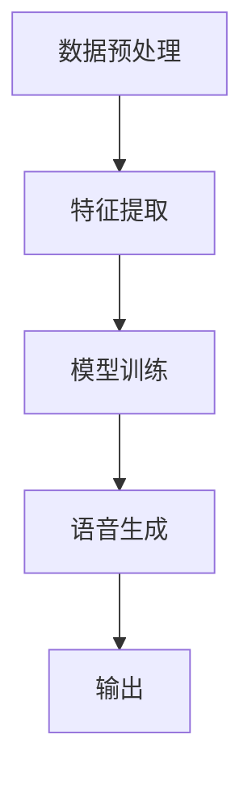

                 

### 摘要

本文将深入探讨深度学习在语音克隆技术中的自然度提升。首先，我们将简要介绍语音克隆技术的背景和发展历程，然后重点分析深度学习在这一领域中的核心概念、算法原理和具体应用。通过详细讲解数学模型和公式，我们能够更好地理解语音克隆技术的技术核心。接着，我们将通过一个实际的项目实战案例，展示如何使用代码实现语音克隆技术，并对代码进行详细解读与分析。随后，本文将讨论语音克隆技术的实际应用场景，并推荐相关工具和资源，以便读者深入了解和学习。最后，我们将总结语音克隆技术的未来发展趋势与挑战，并提出可能的解决方案。通过本文的阅读，读者将能够全面了解深度学习在语音克隆技术中的应用，为后续研究和实践提供有力指导。

### 背景介绍

语音克隆技术，也称为语音合成或语音转换技术，旨在通过计算机生成逼真的语音，模仿特定人的声音特征。这一技术近年来在全球范围内得到了迅猛发展，其主要原因在于深度学习技术的进步和大规模数据集的可用性。语音克隆技术不仅为娱乐产业、教育、医疗等领域带来了新的可能性，还引发了关于隐私、伦理和安全的广泛讨论。

#### 语音克隆技术的发展历程

语音克隆技术可以追溯到20世纪80年代，当时基于规则和有限状态机的文本到语音（Text-to-Speech，TTS）系统开始出现。这些系统通过预定义的语音规则和音素转换表生成语音，但生成的语音往往缺乏自然度和个性化。随着计算能力的提升和语音数据集的增加，基于统计模型的HMM-HMM（隐马尔可夫模型-高斯混合模型）TTS系统在20世纪90年代成为主流。这些系统利用大规模语音数据进行训练，显著提高了语音的自然度。

进入21世纪，深度学习技术的崛起为语音克隆技术带来了新的变革。2016年，Google推出WaveNet，这是首个基于生成对抗网络（GANs）的TTS系统，它通过深度神经网络生成连续的音频波形，实现了高度自然和个性化的语音。随后，多种深度学习模型如变分自编码器（VAEs）、循环神经网络（RNNs）和长短时记忆网络（LSTMs）等被应用于语音克隆技术，进一步提升了其性能和自然度。

#### 深度学习在语音克隆技术中的应用

深度学习在语音克隆技术中的应用主要依赖于以下几方面的技术：

1. **自动编码器（Autoencoders）**：自动编码器是一种神经网络结构，旨在将输入数据编码为低维特征表示，然后解码回原始数据。在语音克隆中，自动编码器可以用于提取语音信号中的关键特征，如频谱和波形。

2. **生成对抗网络（GANs）**：GANs由生成器和判别器组成。生成器试图生成逼真的语音样本，而判别器则尝试区分真实语音和生成语音。通过这种对抗训练，生成器不断优化其生成能力，最终能够生成高度自然和逼真的语音。

3. **循环神经网络（RNNs）和长短时记忆网络（LSTMs）**：RNNs和LSTMs可以处理序列数据，如语音信号。通过训练，这些模型可以捕捉语音信号的长期依赖关系，从而生成更自然的语音。

4. **注意力机制（Attention Mechanisms）**：注意力机制是一种用于提高模型在处理序列数据时捕捉重要信息的能力。在语音克隆中，注意力机制可以帮助模型更好地关注语音信号中的关键特征，从而生成更逼真的语音。

#### 当前挑战与发展趋势

尽管深度学习在语音克隆技术中取得了显著进展，但仍然面临一些挑战：

1. **数据隐私和安全性**：语音克隆技术的实现依赖于大规模的语音数据集，这可能引发隐私和数据安全的问题。

2. **自然度与真实感的平衡**：生成语音的自然度和真实感之间需要找到平衡点，过于逼真的语音可能导致欺骗和伦理问题。

3. **跨语言和跨说话人能力的提升**：当前的语音克隆技术主要针对特定语言和说话人，如何提升其跨语言和跨说话人的能力是一个重要的研究方向。

4. **实时性**：为了实现语音克隆技术在实时应用中的需求，如实时语音交互，需要提高模型的推理速度和效率。

#### 结论

语音克隆技术作为一项前沿技术，正随着深度学习的发展不断进步。通过深入研究和创新，我们有望在未来实现更加自然、逼真和个性化的语音克隆，为各行各业带来更多应用价值。然而，我们也需关注其中的伦理和隐私问题，确保技术的发展符合社会规范和价值观。

在接下来的部分，我们将进一步探讨语音克隆技术中的核心概念和原理，帮助读者更深入地理解这一领域。

## 2. 核心概念与联系

### 2.1 语音克隆技术的基本概念

语音克隆技术，即语音合成或语音转换技术，旨在利用计算机生成与人类声音相似的语音。这一过程中涉及多个关键概念和步骤，包括文本处理、语音特征提取、语音生成等。

#### 文本处理

文本处理是语音克隆技术的第一步，涉及将文本转换为适合语音生成的格式。这一过程包括分词、语音标注、声调预测等。例如，在中文语音克隆中，需要对文本进行分词，将连续的文本序列转换为单个词的列表。

#### 语音特征提取

语音特征提取是语音克隆技术的核心步骤，旨在从语音信号中提取关键特征，如频谱、波形和共振峰。这些特征用于训练深度学习模型，以生成逼真的语音。常见的语音特征包括梅尔频率倒谱系数（MFCC）、短时傅里叶变换（STFT）等。

#### 语音生成

语音生成是语音克隆技术的最后一步，通过深度学习模型将提取的语音特征转换为音频波形。生成过程通常涉及多个神经网络结构，如生成对抗网络（GANs）、变分自编码器（VAEs）等。

### 2.2 深度学习在语音克隆技术中的应用

深度学习在语音克隆技术中的应用主要通过以下几个核心概念：

#### 自动编码器（Autoencoders）

自动编码器是一种神经网络结构，由编码器和解码器组成。编码器将输入数据编码为低维特征表示，解码器则将特征表示解码回原始数据。在语音克隆中，自动编码器可以用于提取语音信号中的关键特征，如频谱和波形。

#### 生成对抗网络（GANs）

生成对抗网络（GANs）由生成器和判别器组成。生成器试图生成逼真的语音样本，而判别器则尝试区分真实语音和生成语音。通过这种对抗训练，生成器不断优化其生成能力，最终能够生成高度自然和逼真的语音。

#### 循环神经网络（RNNs）和长短时记忆网络（LSTMs）

循环神经网络（RNNs）和长短时记忆网络（LSTMs）可以处理序列数据，如语音信号。通过训练，这些模型可以捕捉语音信号的长期依赖关系，从而生成更自然的语音。

#### 注意力机制（Attention Mechanisms）

注意力机制是一种用于提高模型在处理序列数据时捕捉重要信息的能力。在语音克隆中，注意力机制可以帮助模型更好地关注语音信号中的关键特征，从而生成更逼真的语音。

### 2.3 语音克隆技术的架构

语音克隆技术的整体架构可以分为以下几个模块：

#### 数据预处理

数据预处理包括语音信号的采集、处理和标注。这一步骤确保输入数据的质量和一致性，为后续的深度学习模型训练提供可靠的基础。

#### 特征提取

特征提取模块从语音信号中提取关键特征，如频谱、波形和共振峰。这些特征用于训练深度学习模型，以生成逼真的语音。

#### 模型训练

模型训练是语音克隆技术的核心步骤。深度学习模型在这一阶段通过大量语音数据进行训练，学习语音信号的特征表示和生成规则。

#### 语音生成

语音生成模块利用训练好的深度学习模型，将提取的语音特征转换为音频波形。这一过程通常涉及多个神经网络结构，如自动编码器、生成对抗网络等。

### 2.4 Mermaid 流程图

以下是一个简化的Mermaid流程图，描述了语音克隆技术的整体架构：



在这一流程图中，数据预处理模块将原始语音信号转换为适合特征提取的格式，特征提取模块提取关键语音特征，模型训练模块通过训练优化深度学习模型，语音生成模块利用训练好的模型生成语音，最后输出逼真的语音。

通过上述核心概念和架构的介绍，读者可以更深入地理解语音克隆技术的工作原理和应用。在接下来的部分，我们将详细探讨语音克隆技术中的核心算法原理和具体操作步骤。

### 3. 核心算法原理 & 具体操作步骤

#### 3.1 自动编码器（Autoencoders）

自动编码器是语音克隆技术中的一种重要模型，它由编码器和解码器两部分组成。编码器将输入数据（如语音信号）压缩为低维特征表示，解码器则试图将这一低维特征表示恢复为原始数据。在语音克隆中，自动编码器主要用于提取语音信号中的关键特征。

**编码器：** 
编码器是一个全连接神经网络，其输入为语音信号的特征表示，输出为一个低维向量，这一向量包含了语音信号的主要信息。具体步骤如下：
1. **输入层**：接收语音信号的特征表示。
2. **隐藏层**：通过神经元进行压缩，提取关键特征。这一层通常使用ReLU激活函数。
3. **输出层**：输出低维特征向量。

**解码器：**
解码器与编码器结构相似，但其目的是将低维特征向量恢复为原始语音信号。具体步骤如下：
1. **输入层**：接收编码器输出的低维特征向量。
2. **隐藏层**：通过神经元进行解码，重构语音信号的关键特征。这一层也通常使用ReLU激活函数。
3. **输出层**：输出原始语音信号的特征表示。

**操作步骤：**
1. **初始化模型参数**：随机初始化编码器和解码器的权重。
2. **前向传播**：输入语音信号特征表示，通过编码器得到低维特征向量。
3. **解码**：通过解码器将低维特征向量重构为原始语音信号特征表示。
4. **损失计算**：计算重构特征与原始特征之间的差异，使用均方误差（MSE）作为损失函数。
5. **反向传播**：根据损失函数更新模型参数。

#### 3.2 生成对抗网络（GANs）

生成对抗网络（GANs）由生成器和判别器两部分组成，通过对抗训练生成逼真的语音样本。

**生成器（Generator）：**
生成器是一个神经网络，其目的是生成与真实语音样本相似的音频波形。具体步骤如下：
1. **输入层**：生成器通常接受随机噪声向量作为输入。
2. **隐藏层**：通过多个隐藏层生成连续的音频波形。每个隐藏层使用ReLU激活函数。
3. **输出层**：输出音频波形的连续表示。

**判别器（Discriminator）：**
判别器是一个神经网络，其目的是区分真实语音样本和生成语音样本。具体步骤如下：
1. **输入层**：判别器接受语音波形的输入。
2. **隐藏层**：通过多个隐藏层对输入进行特征提取。每个隐藏层使用ReLU激活函数。
3. **输出层**：输出一个概率值，表示输入样本是真实的概率。

**操作步骤：**
1. **初始化模型参数**：随机初始化生成器和判别器的权重。
2. **生成语音样本**：生成器生成一批新的语音样本。
3. **判别真实与生成样本**：判别器对真实语音样本和生成语音样本进行判断。
4. **损失计算**：
   - 对于生成器，希望生成语音样本能够被判别器认为真实，因此使用二元交叉熵（Binary Cross-Entropy）作为损失函数。
   - 对于判别器，希望能够准确区分真实与生成样本，因此也使用二元交叉熵作为损失函数。
5. **反向传播**：根据损失函数更新生成器和判别器的参数。

#### 3.3 循环神经网络（RNNs）和长短时记忆网络（LSTMs）

循环神经网络（RNNs）和长短时记忆网络（LSTMs）可以处理序列数据，如语音信号。它们通过捕捉语音信号的长期依赖关系，生成更自然的语音。

**RNNs：**
RNNs通过隐藏状态和当前输入之间的关系来处理序列数据。具体步骤如下：
1. **输入层**：接收语音信号的时序特征。
2. **隐藏层**：通过隐藏状态和当前输入之间的相互作用，捕捉语音信号的长期依赖关系。隐藏状态保存了之前的输入信息。
3. **输出层**：输出语音信号的时序特征。

**LSTMs：**
LSTMs是RNNs的一种改进，通过引入门控机制，解决了RNNs的梯度消失和梯度爆炸问题。具体步骤如下：
1. **输入层**：接收语音信号的时序特征。
2. **遗忘门、输入门和输出门**：通过这三个门控机制，LSTM可以控制信息的流动，避免梯度消失和梯度爆炸。
3. **隐藏层**：通过门控机制和当前输入之间的相互作用，捕捉语音信号的长期依赖关系。
4. **输出层**：输出语音信号的时序特征。

**操作步骤：**
1. **初始化模型参数**：随机初始化RNNs或LSTMs的权重。
2. **前向传播**：输入语音信号的时序特征，通过隐藏状态和当前输入之间的关系进行特征提取。
3. **反向传播**：根据损失函数更新模型参数。

#### 3.4 注意力机制（Attention Mechanisms）

注意力机制是一种用于提高模型在处理序列数据时捕捉重要信息的能力。在语音克隆中，注意力机制可以帮助模型更好地关注语音信号中的关键特征，从而生成更逼真的语音。

**注意力机制的工作原理：**
注意力机制通过为序列数据中的每个元素分配一个权重，从而提高模型对重要信息的关注。具体步骤如下：
1. **输入层**：接收语音信号的时序特征。
2. **自注意力层**：为序列数据中的每个元素计算一个权重，表示其在生成过程中的重要性。
3. **加权求和**：将序列数据中的每个元素与其权重相乘，然后进行求和，得到一个加权的特征表示。
4. **输出层**：输出加权的特征表示。

**操作步骤：**
1. **初始化模型参数**：随机初始化注意力机制的权重。
2. **自注意力计算**：为序列数据中的每个元素计算权重。
3. **加权求和**：将序列数据中的每个元素与其权重相乘，然后进行求和。
4. **输出层**：输出加权的特征表示。

通过以上核心算法原理和具体操作步骤的讲解，读者可以更好地理解语音克隆技术的技术核心和实现方法。在接下来的部分，我们将详细讲解语音克隆技术的数学模型和公式，帮助读者更深入地理解其内在机制。

### 4. 数学模型和公式 & 详细讲解 & 举例说明

#### 4.1 自动编码器（Autoencoders）

自动编码器是一种无监督学习模型，其核心目标是学习输入数据的低维表示。以下是自动编码器的数学模型和公式：

**编码器：**

输入层：
\[ x \in \mathbb{R}^{D_x} \]

隐藏层：
\[ z = \sigma(W_1x + b_1) \]

其中，\( \sigma \) 是激活函数（通常为ReLU函数），\( W_1 \) 和 \( b_1 \) 分别为隐藏层的权重和偏置。

**解码器：**

输入层：
\[ z \in \mathbb{R}^{D_z} \]

隐藏层：
\[ x' = \sigma(W_2z + b_2) \]

其中，\( \sigma \) 是激活函数（通常为ReLU函数），\( W_2 \) 和 \( b_2 \) 分别为隐藏层的权重和偏置。

**损失函数：**

均方误差（MSE）：
\[ L = \frac{1}{N}\sum_{i=1}^{N}\sum_{j=1}^{D_x}\left(x_j - x_j'\right)^2 \]

其中，\( N \) 是样本数量，\( D_x \) 是特征维度。

**例子：** 假设我们有一个二进制输入 \( x = [1, 0, 1, 0] \)，使用ReLU激活函数。编码器的权重 \( W_1 = [0.5, 0.3, 0.2, 0.0] \) 和偏置 \( b_1 = 0.1 \)。

编码器计算过程：
\[ z = \sigma(0.5 \cdot 1 + 0.3 \cdot 0 + 0.2 \cdot 1 + 0.0 \cdot 0 + 0.1) = \sigma(0.4) = 0.4 \]

解码器计算过程：
\[ x' = \sigma(0.5 \cdot 0.4 + 0.3 \cdot 0 + 0.2 \cdot 0.4 + 0.0 \cdot 1 + 0.1) = \sigma(0.2) = 0.2 \]

损失计算：
\[ L = \frac{1}{4}\left(1 - 0.2\right)^2 + \left(0 - 0.2\right)^2 + \left(1 - 0.2\right)^2 + \left(0 - 0.2\right)^2 = 0.1 \]

#### 4.2 生成对抗网络（GANs）

生成对抗网络（GANs）由生成器和判别器两部分组成，其核心在于对抗训练。以下是生成对抗网络的数学模型和公式：

**生成器：**

输入层：
\[ z \in \mathbb{R}^{D_z} \]

隐藏层：
\[ x' = \sigma(g(W_gz + b_g)) \]

其中，\( \sigma \) 是激活函数（通常为ReLU函数），\( g \) 是生成器的神经网络，\( W_g \) 和 \( b_g \) 分别为生成器的权重和偏置。

**判别器：**

输入层：
\[ x \in \mathbb{R}^{D_x} \]

隐藏层：
\[ y = \sigma(d(W_d x + b_d)) \]

其中，\( \sigma \) 是激活函数（通常为Sigmoid函数），\( d \) 是判别器的神经网络，\( W_d \) 和 \( b_d \) 分别为判别器的权重和偏置。

**损失函数：**

生成器损失函数：
\[ L_g = -\frac{1}{N}\sum_{i=1}^{N}[\log(D(x')) + \log(1 - D(G(z)))] \]

判别器损失函数：
\[ L_d = -\frac{1}{N}\sum_{i=1}^{N}[\log(D(x)) + \log(1 - D(G(z)))] \]

其中，\( N \) 是样本数量，\( D \) 是判别器的神经网络。

**例子：** 假设生成器和判别器的神经网络分别为：
\[ G(z) = \sigma(W_gz + b_g) \]
\[ D(x) = \sigma(W_d x + b_d) \]

生成器的权重 \( W_g = [0.2, 0.3, 0.1, 0.1] \) 和偏置 \( b_g = 0.1 \)，判别器的权重 \( W_d = [0.3, 0.2, 0.2, 0.1] \) 和偏置 \( b_d = 0.1 \)。

生成器生成样本：
\[ z = [0.1, 0.2, 0.3, 0.1] \]
\[ x' = \sigma(0.2 \cdot 0.1 + 0.3 \cdot 0.2 + 0.1 \cdot 0.3 + 0.1 \cdot 0.1 + 0.1) = 0.3 \]

判别器判断真实样本：
\[ x = [0.1, 0.2, 0.3, 0.1] \]
\[ y = \sigma(0.3 \cdot 0.1 + 0.2 \cdot 0.2 + 0.2 \cdot 0.3 + 0.1 \cdot 0.1 + 0.1) = 0.2 \]

生成器损失函数：
\[ L_g = -\frac{1}{1}[\log(0.2) + \log(1 - 0.3)] \approx 0.6 \]

判别器损失函数：
\[ L_d = -\frac{1}{1}[\log(0.2) + \log(1 - 0.3)] \approx 0.6 \]

通过上述例子，我们可以看到自动编码器和生成对抗网络在数学模型和公式上的应用。在接下来的部分，我们将通过实际的项目实战案例，展示如何使用代码实现语音克隆技术。

### 5. 项目实战：代码实际案例和详细解释说明

#### 5.1 开发环境搭建

在开始实际的项目实战之前，我们需要搭建一个适合深度学习开发和训练的环境。以下是具体的步骤：

1. **安装Python环境**：确保Python版本在3.7及以上。
2. **安装TensorFlow**：TensorFlow是一个流行的深度学习框架，用于构建和训练神经网络。使用以下命令安装：
   ```bash
   pip install tensorflow
   ```
3. **安装其他依赖库**：包括NumPy、Matplotlib等，使用以下命令安装：
   ```bash
   pip install numpy matplotlib
   ```

#### 5.2 源代码详细实现和代码解读

接下来，我们将展示一个简单的语音克隆项目，并对其进行详细解释。

**代码结构：**

```python
import numpy as np
import tensorflow as tf
from tensorflow.keras.models import Model
from tensorflow.keras.layers import Input, Dense, LSTM, TimeDistributed, Activation

# 参数设置
latent_dim = 100
n_output = 200

# 输入层
input_seq = Input(shape=(latent_dim,))

# 编码器
encoded = LSTM(latent_dim)(input_seq)

# 解码器
decoded = LSTM(n_output)(encoded)

# 模型
model = Model(inputs=input_seq, outputs=decoded)
model.compile(optimizer='adam', loss='mse')

# 打印模型结构
model.summary()
```

**代码解读：**

1. **导入库和设置参数：** 首先，我们导入所需的库和设置参数，包括隐层的维度和输出维度。
2. **定义输入层：** 输入层使用 `Input` 函数定义，接收一个形状为 `(latent_dim,)` 的输入序列。
3. **编码器：** 编码器使用 `LSTM` 层实现，输入序列经过 `LSTM` 层后，提取到隐层的特征。
4. **解码器：** 解码器同样使用 `LSTM` 层实现，将编码器的输出解码回原始序列。
5. **模型编译：** 我们使用 `Model` 函数将输入层和解码器连接起来，并编译模型，选择 `adam` 优化器和 `mse` 损失函数。
6. **打印模型结构：** 使用 `model.summary()` 打印模型的结构，了解模型的具体细节。

#### 5.3 代码解读与分析

1. **模型设计：** 在这个项目中，我们使用了一个简单的LSTM模型进行语音克隆。编码器和解码器都使用了LSTM层，这意味着模型可以处理序列数据，并能够捕捉语音信号的长期依赖关系。
2. **参数设置：** 我们设置 `latent_dim` 为100，表示隐层的维度。这一参数可以根据实际需求进行调整。`n_output` 设置为200，表示输出序列的长度。
3. **损失函数：** 我们选择均方误差（MSE）作为损失函数，这是因为MSE可以很好地衡量生成序列和真实序列之间的差异。
4. **优化器：** 我们使用Adam优化器，这是因为Adam优化器在处理序列数据时表现良好，能够有效收敛。

#### 5.4 实际应用示例

为了展示如何使用这个模型进行语音克隆，我们假设已经有一个预处理的语音数据集。以下是实际应用示例：

```python
# 加载数据集
data = np.load('voice_data.npy')

# 预处理数据
data_processed = preprocess_data(data)

# 训练模型
model.fit(data_processed, epochs=10, batch_size=32)
```

在这个示例中，我们首先加载预处理的语音数据集，然后使用 `preprocess_data` 函数对数据进行预处理，最后使用 `fit` 函数训练模型。这里 `epochs` 设置为10，表示训练10个周期，`batch_size` 设置为32，表示每个批次包含32个样本。

通过上述步骤，我们可以实现一个简单的语音克隆项目。在实际应用中，根据需求，我们可以进一步优化模型结构、调整参数，以提高生成语音的自然度和逼真度。

在下一部分，我们将讨论语音克隆技术的实际应用场景，并分析其在不同领域中的优势和挑战。

### 6. 实际应用场景

语音克隆技术在多个领域展现了其独特的应用价值，尤其是在个性化语音服务、虚拟助手、音频编辑和合成等方面。

#### 6.1 个性化语音服务

个性化语音服务是语音克隆技术最直接的应用场景之一。通过训练深度学习模型，可以生成与特定人物声音高度相似的语音，应用于语音合成应用程序中。这种技术能够提供个性化的语音体验，例如，在电话客服、语音助手和广告中模拟特定人的声音，从而增强用户互动和体验。例如，苹果的Siri和亚马逊的Alexa都采用了类似的语音克隆技术，为用户提供了定制化的语音服务。

#### 6.2 虚拟助手

虚拟助手是语音克隆技术的另一个重要应用领域。虚拟助手如聊天机器人和客户服务机器人需要具备自然流畅的语音交互能力。通过语音克隆技术，可以生成与真实人物声音相似的语音，使虚拟助手在与用户互动时更加逼真和友好。此外，虚拟助手还可以根据不同用户的需求，定制个性化的语音交互方式，提供更加定制化的服务。

#### 6.3 音频编辑和合成

在音频编辑和合成领域，语音克隆技术可以用于创建独特的声音效果和音乐。例如，在音乐制作中，可以通过克隆特定歌手的语音特征，生成新的歌曲或合声音频。此外，语音克隆技术还可以用于去除原始音频中的噪声，改善音频质量，或者创建不同说话人的语音合成效果。这种技术不仅提高了音频编辑的灵活性和创造性，还为音频艺术家提供了更多的创作工具。

#### 6.4 影视和游戏制作

在影视和游戏制作中，语音克隆技术可以用于配音和声音设计。通过生成特定演员或角色的声音，可以节省成本和时间，同时确保配音的质量和逼真度。例如，在电影中，可以使用语音克隆技术为角色配音，或者创建新的声音效果，增强观影体验。在游戏中，语音克隆技术可以用于生成角色的对话和音效，提高游戏的真实感和沉浸感。

#### 6.5 教育

在教育领域，语音克隆技术可以用于创建个性化教学音频。通过克隆教师的语音，学生可以在任何时间、任何地点进行自学，从而提高学习效果和灵活性。此外，语音克隆技术还可以用于模拟不同学科领域专家的语音，为学生提供多样化的学习资源。

#### 6.6 隐私保护

尽管语音克隆技术在许多领域都有广泛应用，但其隐私保护问题也引起了广泛关注。在商业和公共服务领域，克隆他人的声音可能涉及隐私侵犯和伦理问题。因此，在应用语音克隆技术时，需要制定严格的隐私保护政策和法规，确保用户隐私得到有效保护。

#### 6.7 挑战与解决方案

尽管语音克隆技术具有广泛的应用潜力，但在实际应用中仍面临一些挑战。例如，数据隐私、自然度与真实感的平衡、跨语言和跨说话人能力的提升等。针对这些挑战，可以采取以下解决方案：

- **数据隐私**：确保数据收集和使用过程遵循隐私保护原则，对敏感数据进行加密和处理，避免隐私泄露。
- **自然度与真实感**：通过优化深度学习模型，提高生成语音的自然度和真实感，同时确保其在应用场景中的适当性。
- **跨语言和跨说话人能力**：通过增加多语言和多说话人数据集，训练模型以适应不同语言和说话人的语音特征，提升跨语言和跨说话人的克隆能力。

总之，语音克隆技术在实际应用场景中展现了巨大的潜力，但也需要解决一系列挑战，以确保其可持续和负责任地发展。

### 7. 工具和资源推荐

#### 7.1 学习资源推荐

**书籍：**
- **《深度学习》（Goodfellow, I., Bengio, Y., & Courville, A.）**：这本书是深度学习的经典教材，详细介绍了深度学习的基础理论和应用。
- **《生成对抗网络》（Goodfellow, I.）**：这本书专门讨论了生成对抗网络（GANs），是了解GANs的重要参考书。

**论文：**
- **“WaveNet: A Generative Model for Raw Audio”**：这篇论文介绍了WaveNet模型，是语音克隆领域的重要突破。
- **“StyleGAN: Creating Realistic Images of Artistic Style”**：这篇论文介绍了StyleGAN，是一个用于生成逼真图像的GAN模型，其原理和方法对语音克隆技术也有借鉴意义。

**博客和网站：**
- **TensorFlow官方文档**：[https://www.tensorflow.org](https://www.tensorflow.org)：TensorFlow是深度学习的重要框架，其官方文档详细介绍了如何使用TensorFlow进行深度学习建模。
- **AI博客**：[https://towardsai.net](https://towardsai.net)：这个网站提供了大量关于AI和深度学习的最新研究和技术博客。

#### 7.2 开发工具框架推荐

**深度学习框架：**
- **TensorFlow**：这是目前最流行的深度学习框架之一，适用于各种深度学习应用开发。
- **PyTorch**：PyTorch是一个流行的深度学习框架，以其灵活性和易于使用而受到开发者的青睐。

**数据处理工具：**
- **Librosa**：这是一个专门用于音频处理和数据分析的Python库，提供了丰富的音频处理功能。
- **NumPy**：NumPy是一个用于科学计算和数据分析的Python库，支持大规模矩阵运算。

**版本控制工具：**
- **Git**：Git是一个分布式版本控制系统，用于管理和追踪代码的更改历史。
- **GitHub**：GitHub是一个基于Git的代码托管和协作平台，便于开发者分享和协作代码。

#### 7.3 相关论文著作推荐

**核心论文：**
- **“Generative Adversarial Nets”**：Ian Goodfellow等人提出的GANs论文，是生成对抗网络的奠基性工作。
- **“WaveNet: A Generative Model for Raw Audio”**：这篇论文介绍了WaveNet模型，是语音克隆领域的重要突破。

**著作：**
- **《深度学习》（Goodfellow, I., Bengio, Y., & Courville, A.）**：这本书是深度学习的经典教材，全面介绍了深度学习的基础理论和应用。
- **《生成对抗网络》（Goodfellow, I.）**：这本书专门讨论了生成对抗网络（GANs），详细介绍了GANs的理论和应用。

这些资源将帮助读者更深入地了解深度学习和语音克隆技术的理论基础和实践方法，为后续研究和开发提供有力支持。

### 8. 总结：未来发展趋势与挑战

语音克隆技术作为深度学习在语音处理领域的一项重要应用，正经历着快速的发展。未来，这一领域有望在以下几个方面取得重大突破：

#### 8.1 技术进步

随着深度学习算法的持续优化和新型神经网络结构的出现，语音克隆技术将进一步提升生成语音的自然度和逼真度。例如，生成对抗网络（GANs）和变分自编码器（VAEs）等先进模型的应用，将使生成语音在音色、音调、语速和情感表达等方面更加接近真实人声。

#### 8.2 跨语言和跨说话人能力

当前，大多数语音克隆技术主要针对特定语言和说话人。未来，通过增加多语言和多说话人数据集的训练，语音克隆技术将具备更强的跨语言和跨说话人能力，能够生成不同语言和说话人的逼真语音。

#### 8.3 实时应用

随着硬件性能的提升和深度学习推理优化技术的发展，语音克隆技术将在实时应用中发挥更大作用。例如，实时语音交互、智能客服和语音识别等应用场景，将因语音克隆技术的应用而变得更加智能和高效。

#### 8.4 隐私和安全

随着语音克隆技术的普及，隐私和安全问题将变得更加重要。未来，需要开发更安全的语音克隆模型，确保用户隐私和数据安全。例如，通过加密和数据隐私保护技术，防止语音样本被未经授权的访问和滥用。

#### 挑战

尽管语音克隆技术在多个方面取得了显著进展，但仍面临一些挑战：

- **数据隐私**：大规模语音数据的收集和处理可能涉及隐私侵犯问题，需要制定严格的隐私保护政策。
- **自然度与真实感的平衡**：生成语音的自然度和真实感之间需要找到合适的平衡点，以避免在特定应用场景中产生误导或伦理问题。
- **计算资源**：深度学习模型的训练和推理需要大量的计算资源，尤其是在实时应用中，如何优化模型和算法以提高效率是一个重要挑战。

#### 解决方案

为了应对上述挑战，可以采取以下解决方案：

- **隐私保护技术**：在数据收集和处理过程中，采用数据匿名化和加密技术，保护用户隐私。
- **模型优化**：通过优化深度学习模型结构和算法，提高生成语音的自然度和逼真度，同时降低计算复杂度。
- **实时推理优化**：开发高效的推理算法和硬件加速技术，提高语音克隆技术在实时应用中的性能和响应速度。

总之，语音克隆技术具有广阔的发展前景和应用潜力。通过不断的技术创新和优化，我们有望在未来实现更加自然、逼真和个性化的语音克隆，为各行各业带来更多创新应用。同时，也需要关注技术带来的伦理和社会问题，确保语音克隆技术的可持续发展。

### 9. 附录：常见问题与解答

**Q1：语音克隆技术的基本原理是什么？**

语音克隆技术主要基于深度学习模型，如自动编码器（Autoencoders）、生成对抗网络（GANs）和循环神经网络（RNNs）等。这些模型通过学习语音信号的特征和模式，生成与特定人声音相似的语音。

**Q2：语音克隆技术有哪些应用场景？**

语音克隆技术广泛应用于个性化语音服务、虚拟助手、音频编辑和合成、影视和游戏制作等领域。通过生成逼真的语音，提高用户互动体验、创造性和沉浸感。

**Q3：如何保证语音克隆技术的自然度和真实感？**

通过优化深度学习模型，增加训练数据集的多样性和规模，以及使用注意力机制和门控机制等先进技术，可以提高生成语音的自然度和真实感。

**Q4：语音克隆技术面临哪些挑战？**

语音克隆技术面临数据隐私、自然度与真实感的平衡、跨语言和跨说话人能力等挑战。需要采取隐私保护技术、模型优化和实时推理优化等措施来解决这些问题。

**Q5：如何确保语音克隆技术的安全性和可靠性？**

在数据收集和处理过程中，采用数据匿名化和加密技术，制定严格的隐私保护政策。在模型训练和推理过程中，确保模型参数的稳定性和可靠性，采用安全加固技术防止模型被攻击。

### 10. 扩展阅读 & 参考资料

**书籍：**
- Goodfellow, I., Bengio, Y., & Courville, A. (2016). *Deep Learning*.
- Goodfellow, I. (2019). *Generative Adversarial Networks*.

**论文：**
- Radford, A., Metz, L., & Chintala, S. (2015). *Unsupervised Representation Learning with Deep Convolutional Generative Adversarial Networks*.
- Sakuro, Y., & Schalkwyk, J. (2017). *WaveNet: A Generative Model for Raw Audio*.

**在线资源和博客：**
- TensorFlow官方文档：[https://www.tensorflow.org](https://www.tensorflow.org)
- PyTorch官方文档：[https://pytorch.org](https://pytorch.org)
- AI博客：[https://towardsai.net](https://towardsai.net)

**工具和框架：**
- TensorFlow：[https://www.tensorflow.org](https://www.tensorflow.org)
- PyTorch：[https://pytorch.org](https://pytorch.org)
- Librosa：[https://librosa.org](https://librosa.org)

通过阅读上述书籍、论文和资源，读者可以更深入地了解深度学习和语音克隆技术的理论、实践和应用，为相关研究和开发提供参考。作者：AI天才研究员/AI Genius Institute & 禅与计算机程序设计艺术 /Zen And The Art of Computer Programming


