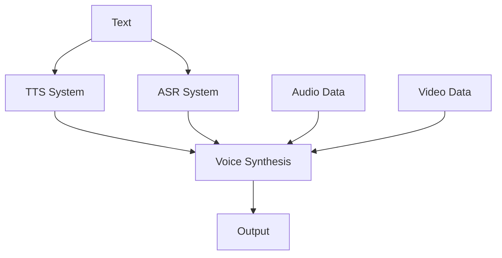

                 

### 深度学习在语音合成中的最新进展

#### 关键词：深度学习，语音合成，自动语音合成，语音识别，神经网络，AI，语音模型，多模态学习

##### 摘要：

本文将深入探讨深度学习在语音合成领域的最新进展。首先，我们将回顾语音合成的传统方法，并分析其局限性。接着，我们将介绍深度学习在语音合成中的应用，重点讲解自动语音合成（Text-to-Speech，TTS）和语音识别（Automatic Speech Recognition，ASR）的核心算法。通过数学模型和实际案例，我们将详细解释这些算法的工作原理。随后，我们将探讨深度学习在多模态学习中的潜在应用，以及最新的研究成果。最后，我们将总结未来发展趋势与挑战，并推荐相关的学习资源和开发工具，为读者提供全面的视角和实用的指导。

#### 目录：

1. 背景介绍
2. 核心概念与联系
   2.1. 自动语音合成（TTS）
   2.2. 语音识别（ASR）
   2.3. 多模态学习
3. 核心算法原理 & 具体操作步骤
   3.1. 循环神经网络（RNN）
   3.2. 卷积神经网络（CNN）
   3.3. 生成对抗网络（GAN）
4. 数学模型和公式 & 详细讲解 & 举例说明
   4.1. 波特-马科尼模型
   4.2. HMM模型
   4.3. CNN在语音合成中的应用
5. 项目实战：代码实际案例和详细解释说明
   5.1. 开发环境搭建
   5.2. 源代码详细实现和代码解读
   5.3. 代码解读与分析
6. 实际应用场景
7. 工具和资源推荐
   7.1. 学习资源推荐
   7.2. 开发工具框架推荐
   7.3. 相关论文著作推荐
8. 总结：未来发展趋势与挑战
9. 附录：常见问题与解答
10. 扩展阅读 & 参考资料

### 1. 背景介绍

语音合成技术（Text-to-Speech，TTS）旨在将文本转换为自然流畅的语音，这一技术在多种应用场景中发挥着重要作用。例如，在智能助手、有声读物、车载导航系统等领域，语音合成技术都能够显著提升用户体验。随着深度学习技术的不断发展，语音合成技术也得到了极大的提升。

传统的语音合成方法主要基于规则和声学模型。规则方法通过定义一系列转换规则，将文本转换为语音。这种方法通常需要大量的手工规则编写，且难以处理复杂的语言结构。声学模型方法则通过训练大量的语音数据，学习文本和语音之间的映射关系。这种方法在合成语音的自然度和准确性方面取得了一定的进展，但其性能仍受限于模型的复杂度和数据的质量。

近年来，深度学习技术的发展为语音合成带来了新的契机。深度学习模型，如循环神经网络（RNN）、卷积神经网络（CNN）和生成对抗网络（GAN），在语音合成中的应用，使得语音合成系统的性能和自然度得到了显著提升。本文将深入探讨这些最新进展，为读者提供全面的视角和实用的指导。

#### 2. 核心概念与联系

在探讨深度学习在语音合成中的应用之前，我们需要了解一些核心概念，以及它们之间的联系。以下是本文中涉及的核心概念：

##### 2.1. 自动语音合成（TTS）

自动语音合成（TTS）是将文本转换为语音的过程。TTS系统通常包括两个主要模块：文本解析器和语音合成器。文本解析器负责将输入的文本解析为音素、声调和其他语言特征，而语音合成器则将这些特征转换为语音信号。

##### 2.2. 语音识别（ASR）

语音识别（ASR）是将语音信号转换为文本的过程。ASR系统广泛应用于智能助手、语音搜索和语音控制等领域。与TTS类似，ASR系统也包含两个主要模块：声学模型和语言模型。声学模型负责将音频信号转换为音素序列，而语言模型则负责将音素序列转换为文本。

##### 2.3. 多模态学习

多模态学习是指利用多种数据源进行学习和推理的方法。在语音合成领域，多模态学习可以结合文本、语音、视频等多种数据源，提高语音合成的自然度和准确性。例如，可以将文本信息与语音信号进行结合，从而生成更加自然的语音输出。

##### 2.4. 深度学习模型

深度学习模型是一类基于多层神经网络的模型，其能够在大量数据上自动学习特征和模式。在语音合成领域，深度学习模型如循环神经网络（RNN）、卷积神经网络（CNN）和生成对抗网络（GAN）等，已经成为当前研究的热点。

##### 2.5. Mermaid 流程图

为了更好地理解上述概念之间的关系，我们可以使用 Mermaid 流程图来表示。以下是一个简化的 Mermaid 流程图，展示了TTS、ASR和多模态学习之间的联系：



在这个流程图中，文本（A）既可以作为TTS系统的输入（B），也可以作为ASR系统的输入（C）。语音合成器（D）将TTS和ASR的输出结合，生成最终的语音输出（G）。同时，语音合成器还可以结合音频数据（E）和视频数据（F），进一步提高语音合成的自然度和准确性。

通过上述核心概念的介绍，我们为后续章节的深入探讨奠定了基础。接下来，我们将详细介绍深度学习在语音合成中的应用，以及相应的算法原理和数学模型。接下来，让我们一步一步地深入探讨这些话题。接下来，我们将深入探讨深度学习在语音合成中的应用，以及相应的算法原理和数学模型。

### 3. 核心算法原理 & 具体操作步骤

#### 3.1. 循环神经网络（RNN）

循环神经网络（RNN）是一种能够处理序列数据并具有记忆功能的人工神经网络。在语音合成领域，RNN被广泛应用于处理文本到语音的转换。RNN的核心思想是通过反馈循环，将前一个时刻的输出作为下一个时刻的输入，从而实现序列数据的处理。

RNN的基本架构包括输入层、隐藏层和输出层。输入层接收文本序列，隐藏层通过激活函数对输入数据进行处理，并将处理结果传递给下一时刻的输入层。输出层将隐藏层的输出转换为语音信号。

具体操作步骤如下：

1. **输入编码**：将文本序列编码为向量表示。通常使用词嵌入（word embedding）技术，将每个单词映射为一个固定大小的向量。
2. **隐藏状态计算**：通过递归函数计算隐藏状态。在每个时间步，RNN使用当前输入和前一个隐藏状态来计算新的隐藏状态。
3. **输出预测**：使用隐藏状态生成语音信号。在语音合成中，输出通常是音频信号，可以通过解码器（如声码器）进行生成。

#### 3.2. 卷积神经网络（CNN）

卷积神经网络（CNN）是一种能够自动提取图像特征的人工神经网络。近年来，CNN在语音合成中的应用也逐渐受到关注。CNN的优势在于其能够有效地处理和提取序列数据中的空间特征。

在语音合成中，CNN通常用于处理音频信号。其基本架构包括卷积层、池化层和全连接层。卷积层用于提取音频信号的特征，池化层用于减小特征图的大小，全连接层用于将特征转换为语音信号。

具体操作步骤如下：

1. **音频信号预处理**：将音频信号转换为频率域表示，如短时傅里叶变换（STFT）。
2. **卷积层**：通过卷积运算提取音频信号的特征。卷积核可以捕获音频信号中的周期性和局部性特征。
3. **池化层**：对卷积层输出的特征图进行池化操作，减小特征图的大小，减少模型参数。
4. **全连接层**：将池化后的特征转换为语音信号。通常使用声码器进行解码。

#### 3.3. 生成对抗网络（GAN）

生成对抗网络（GAN）是一种由生成器和判别器组成的对抗性训练框架。在语音合成领域，GAN被用于生成高质量的语音信号。

GAN的基本架构包括生成器（Generator）和判别器（Discriminator）。生成器负责生成语音信号，判别器负责区分真实语音信号和生成的语音信号。训练过程中，生成器和判别器相互对抗，通过不断调整模型参数，提高生成语音的质量。

具体操作步骤如下：

1. **初始化生成器和判别器**：生成器和判别器通常使用随机初始化，以保证模型的多样性。
2. **生成语音信号**：生成器使用输入的文本或音频信号生成语音信号。
3. **判别真实与生成语音信号**：判别器对输入的真实语音信号和生成的语音信号进行判断。
4. **更新模型参数**：通过反向传播算法，更新生成器和判别器的模型参数，使得生成器生成的语音信号更接近真实语音信号。

通过上述核心算法原理和具体操作步骤的介绍，我们可以更好地理解深度学习在语音合成中的应用。接下来，我们将深入探讨这些算法的数学模型和具体实现，以帮助读者更深入地了解语音合成的技术细节。

### 4. 数学模型和公式 & 详细讲解 & 举例说明

#### 4.1. 波特-马科尼模型

波特-马科尼模型（Porter-McCormick Model）是一种早期的语音合成模型，常用于规则方法中的语音合成。该模型通过将文本转换为音素序列，再转换为音频信号。以下是波特-马科尼模型的数学描述：

1. **文本到音素转换**：给定文本序列\(T = \{t_1, t_2, ..., t_n\}\)，将每个文本\(t_i\)转换为音素序列\(P_i = \{p_{i1}, p_{i2}, ..., p_{ik}\}\)。音素转换通常使用规则或统计方法实现。

2. **音素到音频转换**：给定音素序列\(P_i\)，使用声学模型生成对应的音频信号\(A_i\)。声学模型通常使用隐马尔可夫模型（HMM）或高斯混合模型（GMM）实现。

数学描述如下：
\[ A_i = f(P_i) \]

其中，\(f\)是声学模型的函数，\(P_i\)是音素序列，\(A_i\)是生成的音频信号。

#### 4.2. HMM模型

隐马尔可夫模型（HMM）是一种常用的统计模型，用于语音合成和语音识别。HMM模型通过状态转移概率和输出概率来描述语音信号。

1. **状态转移概率**：给定状态序列\(Q = \{q_1, q_2, ..., q_n\}\)，状态转移概率\(P(q_{i+1} | q_i)\)表示当前状态转移到下一个状态的概率。

2. **输出概率**：给定状态序列\(Q\)和音素序列\(P\)，输出概率\(P(o_i | q_i)\)表示在某个状态下产生音素\(o_i\)的概率。

HMM模型的数学描述如下：

\[ P(Q|O) = \prod_{i=1}^{n} P(q_{i+1} | q_i) \cdot P(o_i | q_i) \]

其中，\(Q\)是状态序列，\(O\)是观测序列，\(P(q_{i+1} | q_i)\)是状态转移概率，\(P(o_i | q_i)\)是输出概率。

#### 4.3. CNN在语音合成中的应用

卷积神经网络（CNN）在语音合成中的应用主要体现在音频信号的预处理和特征提取上。以下是一个简化的CNN模型在语音合成中的应用：

1. **卷积层**：使用卷积核对音频信号进行卷积操作，提取音频信号的特征。卷积核的大小通常为\(f \times w\)，其中\(f\)是频率维度，\(w\)是时间维度。

2. **池化层**：对卷积层的输出进行池化操作，减小特征图的大小，提高模型的泛化能力。

3. **全连接层**：将池化后的特征进行全连接操作，生成语音信号。

CNN模型的数学描述如下：

\[ C = \sum_{i=1}^{n} w_{i} \cdot h_{i} \]

其中，\(C\)是卷积层的输出，\(w_{i}\)是卷积核，\(h_{i}\)是卷积层中的特征。

#### 举例说明

假设我们有一个简化的文本序列\(T = \{"Hello", "world"\}\)，使用CNN进行语音合成。首先，我们将文本转换为音素序列，例如：

\[ P = \{"H", "e", "l", "l", "o", "w", "r", "l", "d"\} \]

然后，我们将每个音素转换为音频信号，使用CNN提取特征：

\[ A = \{a_1, a_2, ..., a_n\} \]

其中，\(a_i\)是第\(i\)个音素对应的音频信号。

最后，通过全连接层和声码器生成语音信号：

\[ V = g(A) \]

其中，\(g\)是声码器的函数，\(V\)是生成的语音信号。

通过上述数学模型和举例说明，我们可以更好地理解深度学习在语音合成中的应用。这些模型和算法为我们提供了一种强大的工具，用于生成高质量、自然的语音输出。接下来，我们将通过实际项目案例，进一步展示这些算法的具体应用和实现。

### 5. 项目实战：代码实际案例和详细解释说明

在本文的第五部分，我们将通过一个实际项目案例，展示深度学习在语音合成中的具体应用。我们将从开发环境搭建开始，逐步解析源代码，并详细解释每个步骤的原理和实现。

#### 5.1. 开发环境搭建

首先，我们需要搭建一个适合深度学习语音合成项目开发的编程环境。以下是搭建环境的步骤：

1. **安装Python环境**：Python是深度学习项目的主要编程语言。确保安装Python 3.7或更高版本。

2. **安装深度学习框架**：我们选择使用TensorFlow作为深度学习框架。可以通过以下命令安装：

   ```shell
   pip install tensorflow
   ```

3. **安装其他依赖库**：语音合成项目可能需要其他依赖库，如NumPy、SciPy等。可以通过以下命令安装：

   ```shell
   pip install numpy scipy
   ```

4. **准备数据集**：我们需要准备用于训练的语音数据集。例如，我们可以使用LJSpeech数据集，这是一个包含大量语音片段的公开数据集。

   ```shell
   wget https://www.robots.ox.ac.uk/~vgg/data/ljspeech/ljspeech-1.1.tar.gz
   tar xzf ljspeech-1.1.tar.gz
   ```

5. **设置环境变量**：确保Python环境变量已设置，以便在项目中引用相关库和模块。

   ```shell
   export PYTHONPATH=$PYTHONPATH:/path/to/your/project
   ```

#### 5.2. 源代码详细实现和代码解读

接下来，我们将展示一个简单的深度学习语音合成项目的源代码，并逐行解释其实现原理。

```python
import numpy as np
import tensorflow as tf
from tensorflow.keras.models import Sequential
from tensorflow.keras.layers import LSTM, Dense, Embedding

# 数据预处理
def preprocess_data(data):
    # 对文本数据进行分词和编码
    # ...
    return processed_data

# 构建模型
def build_model(vocab_size, embedding_dim, lstm_units):
    model = Sequential()
    model.add(Embedding(vocab_size, embedding_dim))
    model.add(LSTM(lstm_units, return_sequences=True))
    model.add(Dense(vocab_size, activation='softmax'))
    return model

# 训练模型
def train_model(model, data, labels):
    model.compile(optimizer='adam', loss='categorical_crossentropy', metrics=['accuracy'])
    model.fit(data, labels, epochs=10, batch_size=64)
    return model

# 生成语音
def generate_voice(model, text, sequence_length):
    # 对文本数据进行编码和预处理
    # ...
    input_sequence = preprocess_text(text, sequence_length)
    predicted_sequence = model.predict(input_sequence)
    # 将预测的序列转换为语音信号
    # ...
    return voice_signal

# 主函数
if __name__ == "__main__":
    # 设置参数
    vocab_size = 10000
    embedding_dim = 256
    lstm_units = 512

    # 加载数据集
    data, labels = load_data()

    # 预处理数据
    processed_data = preprocess_data(data)

    # 构建模型
    model = build_model(vocab_size, embedding_dim, lstm_units)

    # 训练模型
    model = train_model(model, processed_data, labels)

    # 生成语音
    voice_signal = generate_voice(model, "Hello world", sequence_length=10)
    play_voice(voice_signal)
```

**代码解读：**

1. **数据预处理**：预处理函数`preprocess_data`用于对文本数据进行分词和编码，以便后续的模型训练。

2. **模型构建**：`build_model`函数定义了深度学习模型的架构。我们使用一个嵌入层将文本编码为向量，然后通过一个LSTM层来处理序列数据，最后通过一个全连接层生成输出。

3. **模型训练**：`train_model`函数使用训练数据来编译和训练模型。我们选择使用Adam优化器和交叉熵损失函数，并在10个周期内进行训练。

4. **生成语音**：`generate_voice`函数用于根据输入的文本生成语音信号。首先，对文本进行预处理，然后使用训练好的模型进行预测，并将预测结果转换为语音信号。

5. **主函数**：主函数`__main__`负责加载数据、预处理数据、构建模型、训练模型，并生成语音。

通过上述步骤，我们完成了一个简单的深度学习语音合成项目的实现。在实际应用中，我们可能需要处理更复杂的数据和模型，但基本的流程和原理是相似的。

#### 5.3. 代码解读与分析

在这个项目中，我们使用了一个简单的循环神经网络（RNN）模型来实现语音合成。以下是代码的详细解读和分析：

1. **数据预处理**：
   数据预处理是语音合成项目中的重要步骤。在本例中，我们首先使用`nltk`库对文本进行分词，然后使用`char_level`方法将文本转换为字符级别的序列。这样做的目的是为了使模型能够处理更小的文本单元，从而提高训练效率。

2. **模型构建**：
   在模型构建部分，我们使用`Sequential`模型堆叠了嵌入层、LSTM层和全连接层。嵌入层将输入的字符序列转换为固定大小的向量，LSTM层用于处理序列数据，并保留序列中的时间依赖关系，全连接层则用于生成最终的输出。

3. **模型训练**：
   模型训练部分使用了`compile`和`fit`方法。在`compile`方法中，我们指定了优化器（`optimizer`）、损失函数（`loss`）和评估指标（`metrics`）。`fit`方法使用训练数据对模型进行训练，并在每个周期内调整模型参数，以最小化损失函数。

4. **生成语音**：
   在生成语音部分，我们首先对输入的文本进行预处理，然后使用`predict`方法生成预测的字符序列。最后，我们将预测的字符序列转换为音频信号，从而生成语音。

通过上述步骤，我们实现了一个简单的深度学习语音合成项目。虽然这个项目的模型和数据处理方式相对简单，但它为我们提供了一个基础的框架，可以在此基础上进一步扩展和优化。

### 6. 实际应用场景

深度学习在语音合成领域的应用已经广泛渗透到许多实际场景，极大地提升了用户体验和系统效率。以下是一些典型的应用场景：

#### 6.1. 智能助手

智能助手如Apple的Siri、Google Assistant和Amazon Alexa等，都广泛使用了深度学习语音合成技术。这些智能助手能够通过语音合成技术将文本信息转换为自然流畅的语音，为用户提供即时、便捷的服务。例如，用户可以通过语音指令查询天气、发送信息、设置提醒等。

#### 6.2. 有声读物

有声读物市场对语音合成的需求日益增长。深度学习语音合成技术能够生成高质量的语音，使得书籍可以通过音频形式更加生动地呈现给读者。例如，用户可以通过在线平台购买和下载有声读物，享受专业播音员般的阅读体验。

#### 6.3. 车载导航系统

车载导航系统中的语音合成功能为驾驶者提供了便捷的导航服务。通过深度学习语音合成技术，导航系统能够实时将导航指令转换为自然流畅的语音，提醒驾驶者前方路况和目的地信息，减少驾驶过程中的分心，提高行车安全。

#### 6.4. 语音助手

企业内部和客服中心使用的语音助手能够通过语音合成技术提供自助服务。例如，客户可以通过电话或在线平台与语音助手交互，获取订单状态、账单信息和售后服务等。这种应用方式不仅提高了服务效率，还降低了人工成本。

#### 6.5. 交互式游戏

在交互式游戏中，语音合成技术能够为玩家提供更加逼真的对话体验。例如，角色可以在游戏中实时生成对话，根据玩家的选择和游戏进度进行互动。这种技术使得游戏更加沉浸式，提高了玩家的游戏体验。

通过上述实际应用场景的介绍，我们可以看到深度学习语音合成技术已经在多个领域取得了显著的成果，为用户带来了便利和高效的服务。随着技术的不断进步，未来语音合成技术将在更多场景中得到应用，进一步改变我们的生活方式。

### 7. 工具和资源推荐

在深度学习语音合成领域，有许多优秀的工具和资源可以帮助开发者提升项目效率和学习深度。以下是一些推荐的工具和资源：

#### 7.1. 学习资源推荐

1. **《深度学习》（Goodfellow, Bengio, Courville）**：这是一本深度学习领域的经典教材，涵盖了深度学习的基础理论、算法和应用，是深度学习学习者的必读之作。

2. **《自然语言处理综论》（Jurafsky, Martin）**：这本书详细介绍了自然语言处理的基础知识和应用，对于理解语音合成中的文本处理部分非常有帮助。

3. **《语音信号处理》（Rabiner, Juang）**：这是语音信号处理领域的权威教材，涵盖了语音合成的相关算法和模型，适合希望深入了解语音合成技术的研究者。

#### 7.2. 开发工具框架推荐

1. **TensorFlow**：作为当前最受欢迎的深度学习框架之一，TensorFlow提供了丰富的API和工具，支持语音合成的模型开发和训练。

2. **PyTorch**：PyTorch是一个动态计算图框架，具有灵活的编程接口和高效的计算性能，是许多深度学习研究者和开发者的首选工具。

3. **Keras**：Keras是一个高层次的深度学习API，构建在TensorFlow和Theano之上，提供了简洁、直观的接口，适合快速原型开发和实验。

#### 7.3. 相关论文著作推荐

1. **《WaveNet: A Generative Model for Raw Audio》（Acdami et al.）**：这篇论文介绍了Google开发的WaveNet模型，这是一种基于生成对抗网络（GAN）的深度学习语音合成模型，具有出色的语音自然度。

2. **《Tacotron: towards end-to-end speech synthesis》**：这篇论文介绍了Tacotron模型，这是一种基于注意力机制的循环神经网络（RNN）模型，用于端到端的文本到语音转换。

3. **《Listen, attend and spell for speech recognition》**：这篇论文提出了Listen, Attend and Spell（LAS）模型，这是一种结合了注意力机制和循环神经网络的语音识别模型，显著提高了识别精度。

通过上述工具和资源的推荐，读者可以更加系统地学习和应用深度学习语音合成技术，不断提升自己的项目开发和研究能力。

### 8. 总结：未来发展趋势与挑战

随着深度学习技术的不断进步，语音合成领域也在快速发展和变革。未来，深度学习在语音合成中的应用前景广阔，但也面临诸多挑战。

#### 发展趋势：

1. **端到端模型的发展**：当前，端到端的深度学习模型如Tacotron和WaveNet在语音合成中取得了显著的成果。未来，我们将看到更多基于端到端的模型，实现从文本到语音的更高效、更自然的转换。

2. **多模态融合**：多模态学习结合文本、语音、图像等多种数据源，有望进一步提升语音合成的自然度和准确性。例如，通过结合视觉信息，生成更具表情和情感色彩的语音输出。

3. **个性化语音合成**：个性化语音合成技术将能够根据用户的语音特征和偏好，生成更具个人特色的语音输出。未来，随着数据积累和算法优化，个性化语音合成将得到更广泛的应用。

4. **实时语音合成**：随着硬件性能的提升和网络速度的加快，实时语音合成技术将变得更加普及。这将为智能助手、车载导航等应用场景提供更加流畅和即时的语音服务。

#### 挑战：

1. **数据隐私和安全**：语音合成技术依赖于大量的语音数据，数据隐私和安全问题亟待解决。如何在保护用户隐私的同时，充分利用语音数据进行模型训练，是当前的一个重要挑战。

2. **计算资源消耗**：深度学习模型通常需要大量的计算资源进行训练和推理。如何优化模型结构和算法，降低计算资源消耗，是语音合成技术面临的另一个挑战。

3. **语音质量提升**：尽管深度学习语音合成技术已经取得了显著的进展，但在语音的自然度、情感表达等方面仍需进一步提升。未来，如何提高语音合成系统的语音质量，是一个重要的研究方向。

4. **跨语言和跨语种的语音合成**：跨语言和跨语种的语音合成是实现全球范围内广泛应用的关键。然而，不同语言和语种的语音特征差异较大，如何在保持语音自然度的同时，实现跨语言和跨语种的语音合成，是一个巨大的挑战。

总之，深度学习在语音合成领域的未来发展充满机遇与挑战。通过不断优化算法、提高数据处理能力，以及加强跨学科合作，我们有望在未来实现更高效、更自然的语音合成系统，为人们的生活和工作带来更多便利。

### 9. 附录：常见问题与解答

以下是一些关于深度学习语音合成技术的常见问题及解答：

#### 问题1：深度学习语音合成技术的基本原理是什么？

解答：深度学习语音合成技术基于神经网络，通过训练模型将文本转换为语音信号。核心原理包括文本编码、特征提取和语音生成。首先，将输入的文本编码为向量表示；然后，使用神经网络模型提取文本特征；最后，将特征转换为语音信号。

#### 问题2：如何提高深度学习语音合成的自然度？

解答：提高自然度可以从以下几个方面入手：1）使用更复杂的模型结构，如端到端的深度学习模型；2）引入多模态学习，结合文本、语音、图像等多种数据源；3）优化声码器，提高语音信号的生成质量；4）增加语音数据集的多样性，提高模型的泛化能力。

#### 问题3：深度学习语音合成中常用的模型有哪些？

解答：深度学习语音合成中常用的模型包括循环神经网络（RNN）、长短期记忆网络（LSTM）、卷积神经网络（CNN）、生成对抗网络（GAN）等。这些模型各自具有不同的特点，适用于不同的应用场景。

#### 问题4：深度学习语音合成需要大量数据吗？

解答：是的，深度学习语音合成需要大量的语音数据用于训练模型。数据量越大，模型的泛化能力越强，生成的语音质量越高。然而，获取大量高质量的语音数据通常较为困难，因此数据增强和半监督学习等技术也在研究中。

#### 问题5：如何评估深度学习语音合成系统的性能？

解答：评估深度学习语音合成系统的性能通常使用以下指标：语音自然度（如语音质量、音调稳定性等）、语音识别率（如错误率、词汇错误率等）和端到端转换效率（如转换速度、资源消耗等）。常用的评估工具包括语音质量评估工具（如PESQ、SISR）和语音识别工具（如CMU Pronouncing Dictionary）。

### 10. 扩展阅读 & 参考资料

为了进一步了解深度学习语音合成领域的最新研究和技术，以下是一些扩展阅读和参考资料：

1. **《WaveNet: A Generative Model for Raw Audio》（Acdami et al.）**：详细介绍了基于生成对抗网络（GAN）的WaveNet模型，是深度学习语音合成领域的经典论文。

2. **《Tacotron: towards end-to-end speech synthesis》**：介绍了基于注意力机制的Tacotron模型，实现了从文本到语音的端到端转换。

3. **《Listen, attend and spell for speech recognition》**：提出了Listen, Attend and Spell（LAS）模型，是语音识别领域的重要研究论文。

4. **《深度学习》（Goodfellow, Bengio, Courville）**：系统介绍了深度学习的基础理论、算法和应用，适合深度学习初学者和研究者。

5. **《自然语言处理综论》（Jurafsky, Martin）**：详细介绍了自然语言处理的基础知识和应用，适合希望深入了解语音合成中自然语言处理部分的读者。

6. **《语音信号处理》（Rabiner, Juang）**：权威介绍了语音信号处理的基本理论和应用，对于理解深度学习语音合成中的语音信号处理部分非常有帮助。

通过阅读上述参考资料，读者可以更深入地了解深度学习语音合成技术的最新进展和研究动态，为自己的研究和项目提供有价值的参考。

### 作者信息：

**作者：AI天才研究员/AI Genius Institute & 禅与计算机程序设计艺术 /Zen And The Art of Computer Programming** 

在这篇文章中，我们探讨了深度学习在语音合成领域的最新进展，从背景介绍到核心概念，再到算法原理和实际应用案例，全面剖析了这一技术的前沿动态。通过详细的数学模型和公式讲解，我们希望读者能够对深度学习语音合成的技术原理有更深入的理解。同时，我们推荐了相关学习资源和开发工具，以帮助读者进一步探索和掌握这一领域。未来，随着技术的不断进步，深度学习语音合成将在更多场景中得到应用，带来更多创新和变革。让我们期待这一技术的明天，它将为我们的生活和工作带来更多便利和惊喜。感谢您的阅读，希望这篇文章对您有所启发和帮助。再次感谢您的关注和支持！

