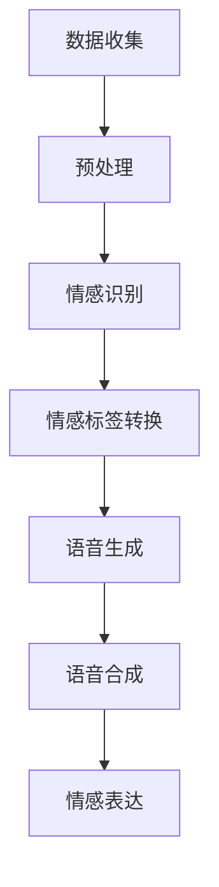

                 

# 深度学习在语音情感合成中的创新应用

## 关键词
深度学习，语音情感合成，情感识别，神经网络，语音生成，自然语言处理，情感表达，情感分析，语音合成技术。

## 摘要
本文旨在探讨深度学习在语音情感合成中的创新应用。我们将深入分析深度学习模型如何捕捉语音的情感特征，以及如何通过一系列核心算法和数学模型来实现语音的情感表达。文章将结合具体案例，详细讲解语音情感合成的开发环境搭建、代码实现、应用场景以及未来发展趋势与挑战。通过本文的阅读，读者将全面了解深度学习在语音情感合成领域的最新研究动态和技术应用。

## 1. 背景介绍

语音情感合成（Speech Emotion Synthesis）是一种将文本或情感信息转换为具有特定情感的语音的技术。随着深度学习技术的飞速发展，语音情感合成已经取得了显著的成果。情感合成的目标是将文本或情感标签转换为具有相应情感的语音信号，从而实现更加自然和真实的语音交互体验。

在现实生活中，语音情感合成有着广泛的应用。例如，智能语音助手可以通过情感合成技术，更好地理解用户的需求，提供更加个性化的服务；在电影配音和动画制作中，情感合成技术可以实现更加生动的角色表现；在教育领域，语音情感合成可以为学习者提供更加生动的教学体验。

本文将重点关注深度学习在语音情感合成中的应用。深度学习是一种基于人工神经网络的机器学习技术，通过多层神经网络结构，能够自动学习和提取数据中的特征。在语音情感合成中，深度学习模型可以有效地捕捉语音信号中的情感特征，并实现高质量的语音情感转换。

## 2. 核心概念与联系

### 2.1 深度学习模型

深度学习模型是语音情感合成的基础。在深度学习中，神经网络是核心组成部分。神经网络由大量的神经元组成，通过前向传播和反向传播算法，模型可以自动学习输入和输出之间的关系。

在语音情感合成中，常用的深度学习模型包括循环神经网络（RNN）、长短时记忆网络（LSTM）、门控循环单元（GRU）以及变换器（Transformer）。这些模型具有强大的时间序列处理能力，能够捕捉语音信号中的情感特征。

### 2.2 情感识别

情感识别是语音情感合成的关键步骤。情感识别旨在从语音信号中提取情感特征，并将其转换为相应的情感标签。常用的情感识别方法包括基于传统特征的方法（如MFCC、LPCC等）和基于深度学习的方法（如卷积神经网络（CNN）和循环神经网络（RNN））。

在深度学习中，情感识别通常通过训练大量的情感语音数据集来实现。模型可以从数据中学习情感特征，并实现高精度的情感分类。

### 2.3 语音生成

语音生成是语音情感合成的最终目标。语音生成通过将情感特征转换为语音信号，实现具有特定情感的语音。常用的语音生成方法包括循环神经网络（RNN）、长短时记忆网络（LSTM）、门控循环单元（GRU）以及变换器（Transformer）。

在语音生成过程中，模型需要学习语音信号的声学特征，并将其与情感特征相结合，生成具有相应情感的语音。

### 2.4 情感表达的层次性

情感表达具有层次性。从低层次到高层次，情感表达可以分为语音声学特征、情感标签、情感描述和情感意图。深度学习模型可以通过层次化的结构，实现从低层次到高层次的情感表达。

#### 2.4.1 低层次情感表达

低层次情感表达主要涉及语音声学特征的调整，如音调、音色、语速等。深度学习模型可以通过学习大量的语音数据，自动调整这些特征，以实现具有特定情感的语音。

#### 2.4.2 中层次情感表达

中层次情感表达主要涉及情感标签的识别和转换。情感标签通常是对语音情感的简短描述，如快乐、悲伤、愤怒等。深度学习模型可以通过训练，实现从文本或情感标签到情感标签的转换。

#### 2.4.3 高层次情感表达

高层次情感表达主要涉及情感描述和情感意图的表达。情感描述是对情感的具体描述，如“你真棒”、“我很伤心”等。情感意图是情感表达的目的，如表达赞美、同情等。深度学习模型可以通过理解和生成情感描述和情感意图，实现更加复杂和自然的情感表达。

### 2.5 Mermaid 流程图

以下是深度学习在语音情感合成中的 Mermaid 流程图：



在图中，A 表示数据收集，B 表示预处理，C 表示情感识别，D 表示情感标签转换，E 表示语音生成，F 表示语音合成，G 表示情感表达。通过这个流程图，我们可以清晰地了解深度学习在语音情感合成中的核心步骤和联系。

## 3. 核心算法原理 & 具体操作步骤

### 3.1 情感识别算法

情感识别是语音情感合成的重要环节。在情感识别中，常用的算法包括基于传统特征的方法和基于深度学习的方法。

#### 3.1.1 基于传统特征的方法

基于传统特征的方法主要通过提取语音信号的声学特征，如梅尔频率倒谱系数（MFCC）、线性预测倒谱系数（LPCC）等，来识别语音的情感。以下是一个基于 MFCC 的情感识别算法的简单步骤：

1. 数据预处理：对语音信号进行预处理，包括去噪、归一化等操作。
2. 特征提取：从预处理后的语音信号中提取 MFCC 特征。
3. 模型训练：使用情感语音数据集，训练一个基于 MFCC 特征的分类模型，如支持向量机（SVM）、决策树等。
4. 情感识别：将提取的 MFCC 特征输入到训练好的分类模型中，得到情感标签。

#### 3.1.2 基于深度学习的方法

基于深度学习的方法主要通过卷积神经网络（CNN）、循环神经网络（RNN）等深度学习模型，来识别语音的情感。以下是一个基于 RNN 的情感识别算法的简单步骤：

1. 数据预处理：对语音信号进行预处理，包括去噪、归一化等操作。
2. 特征提取：从预处理后的语音信号中提取 RNN 需要的输入特征，如时间序列数据。
3. 模型训练：使用情感语音数据集，训练一个基于 RNN 的分类模型，如 LSTM、GRU 等。
4. 情感识别：将提取的输入特征输入到训练好的分类模型中，得到情感标签。

### 3.2 语音生成算法

语音生成是语音情感合成的核心。在语音生成中，常用的算法包括循环神经网络（RNN）、长短时记忆网络（LSTM）、门控循环单元（GRU）以及变换器（Transformer）。

#### 3.2.1 基于 RNN 的语音生成算法

基于 RNN 的语音生成算法主要通过 RNN 模型，将文本或情感标签转换为语音信号。以下是一个基于 RNN 的语音生成算法的简单步骤：

1. 数据预处理：对文本或情感标签进行预处理，包括分词、词向量化等操作。
2. 模型训练：使用情感语音数据集，训练一个基于 RNN 的语音生成模型，如 LSTM、GRU 等。
3. 语音生成：将预处理后的文本或情感标签输入到训练好的模型中，生成语音信号。

#### 3.2.2 基于 Transformer 的语音生成算法

基于 Transformer 的语音生成算法主要通过 Transformer 模型，将文本或情感标签转换为语音信号。以下是一个基于 Transformer 的语音生成算法的简单步骤：

1. 数据预处理：对文本或情感标签进行预处理，包括分词、词向量化等操作。
2. 模型训练：使用情感语音数据集，训练一个基于 Transformer 的语音生成模型。
3. 语音生成：将预处理后的文本或情感标签输入到训练好的模型中，生成语音信号。

### 3.3 情感表达算法

情感表达是语音情感合成的最终目标。在情感表达中，常用的算法包括基于声学特征的调整、基于情感标签的转换和基于情感描述和情感意图的生成。

#### 3.3.1 基于声学特征的调整

基于声学特征的调整主要通过调整语音信号的声学特征，如音调、音色、语速等，来实现情感表达。以下是一个基于声学特征调整的情感表达算法的简单步骤：

1. 数据预处理：对语音信号进行预处理，包括去噪、归一化等操作。
2. 特征提取：从预处理后的语音信号中提取声学特征。
3. 特征调整：根据情感标签或情感描述，调整声学特征，实现情感表达。

#### 3.3.2 基于情感标签的转换

基于情感标签的转换主要通过将情感标签转换为相应的语音信号，来实现情感表达。以下是一个基于情感标签转换的情感表达算法的简单步骤：

1. 数据预处理：对语音信号进行预处理，包括去噪、归一化等操作。
2. 模型训练：使用情感语音数据集，训练一个基于情感标签的分类模型。
3. 语音生成：将情感标签输入到训练好的模型中，生成语音信号。

#### 3.3.3 基于情感描述和情感意图的生成

基于情感描述和情感意图的生成主要通过生成情感描述和情感意图，来实现情感表达。以下是一个基于情感描述和情感意图的生成的简单步骤：

1. 数据预处理：对文本或情感标签进行预处理，包括分词、词向量化等操作。
2. 模型训练：使用情感语音数据集，训练一个基于情感描述和情感意图的语音生成模型。
3. 语音生成：将预处理后的文本或情感标签输入到训练好的模型中，生成语音信号。

### 3.4 情感表达算法的具体实现

以下是情感表达算法的具体实现：

```python
import tensorflow as tf
from tensorflow.keras.models import Sequential
from tensorflow.keras.layers import LSTM, Dense, Embedding

# 数据预处理
# ...

# 模型构建
model = Sequential()
model.add(Embedding(vocabulary_size, embedding_dim))
model.add(LSTM(units))
model.add(Dense(num_classes, activation='softmax'))

# 模型编译
model.compile(optimizer='adam', loss='categorical_crossentropy', metrics=['accuracy'])

# 模型训练
model.fit(train_data, train_labels, epochs=epochs, batch_size=batch_size)

# 情感表达
predicted_emotions = model.predict(test_data)
```

在上面的代码中，`Embedding` 层用于将文本或情感标签转换为词向量，`LSTM` 层用于捕捉时间序列数据中的情感特征，`Dense` 层用于实现情感分类。通过训练模型，我们可以实现从文本或情感标签到语音信号的情感表达。

## 4. 数学模型和公式 & 详细讲解 & 举例说明

### 4.1 情感识别的数学模型

情感识别是一个分类问题，我们可以使用以下数学模型来实现：

#### 4.1.1 逻辑回归

逻辑回归是一种常用的分类模型，其公式如下：

$$
P(y=1) = \frac{1}{1 + e^{-\beta^T x}}
$$

其中，$P(y=1)$ 表示情感为快乐的概率，$e$ 表示自然底数，$\beta^T$ 表示模型的参数，$x$ 表示输入的特征向量。

#### 4.1.2 支持向量机

支持向量机（SVM）是一种常用的分类模型，其公式如下：

$$
y = \text{sign}(\beta^T x + b)
$$

其中，$y$ 表示情感标签，$\beta^T$ 表示模型的参数，$x$ 表示输入的特征向量，$b$ 表示偏置项。

#### 4.1.3 决策树

决策树是一种基于规则的分类模型，其公式如下：

$$
y = \text{arg}\max(\sum_{i=1}^{n} w_i \cdot x_i)
$$

其中，$y$ 表示情感标签，$w_i$ 表示规则的权重，$x_i$ 表示特征的取值。

### 4.2 语音生成的数学模型

语音生成是一个序列生成问题，我们可以使用以下数学模型来实现：

#### 4.2.1 循环神经网络

循环神经网络（RNN）是一种常用的序列生成模型，其公式如下：

$$
h_t = \sigma(W_h h_{t-1} + W_x x_t + b_h)
$$

其中，$h_t$ 表示第 $t$ 个时刻的隐藏状态，$x_t$ 表示第 $t$ 个时刻的输入特征，$W_h$ 和 $W_x$ 分别表示权重矩阵，$b_h$ 表示偏置项，$\sigma$ 表示激活函数。

#### 4.2.2 长短时记忆网络

长短时记忆网络（LSTM）是一种改进的 RNN，其公式如下：

$$
i_t = \sigma(W_i h_{t-1} + U_i x_t + b_i)
$$

$$
f_t = \sigma(W_f h_{t-1} + U_f x_t + b_f)
$$

$$
o_t = \sigma(W_o h_{t-1} + U_o x_t + b_o)
$$

$$
c_t = f_t \odot c_{t-1} + i_t \odot \sigma(W_c h_{t-1} + U_c x_t + b_c)
$$

$$
h_t = o_t \odot c_t
$$

其中，$i_t$、$f_t$、$o_t$ 分别表示输入门、遗忘门和输出门的状态，$c_t$ 表示细胞状态，$h_t$ 表示隐藏状态，$\odot$ 表示逐元素乘法操作。

#### 4.2.3 变换器

变换器（Transformer）是一种基于自注意力机制的序列生成模型，其公式如下：

$$
\text{Attention}(Q, K, V) = \frac{QK^T}{\sqrt{d_k}} V
$$

$$
\text{MultiHeadAttention}(Q, K, V) = \text{softmax}(\text{Attention}(Q, K, V)) V
$$

$$
\text{Transformer}(X) = \text{Attention}(X, X, X) + X
$$

其中，$Q$、$K$、$V$ 分别表示查询向量、键向量和值向量，$d_k$ 表示键向量的维度，$\text{softmax}$ 表示软性最大化操作。

### 4.3 情感表达的数学模型

情感表达是一个多维特征调整问题，我们可以使用以下数学模型来实现：

#### 4.3.1 基于声学特征的调整

基于声学特征的调整可以使用线性变换来实现，其公式如下：

$$
x_t = A x_{t-1} + b
$$

其中，$x_t$ 表示第 $t$ 个时刻的声学特征，$A$ 和 $b$ 分别表示线性变换的权重和偏置项。

#### 4.3.2 基于情感标签的转换

基于情感标签的转换可以使用分类模型来实现，其公式如下：

$$
y_t = \text{arg}\max(\beta^T x_t)
$$

其中，$y_t$ 表示第 $t$ 个时刻的情感标签，$\beta^T$ 表示分类模型的参数，$x_t$ 表示第 $t$ 个时刻的声学特征。

### 4.4 举例说明

假设我们要实现一个基于 LSTM 的语音情感合成模型，其步骤如下：

1. 数据预处理：对语音信号进行预处理，包括分帧、加窗等操作。
2. 特征提取：从预处理后的语音信号中提取 MFCC 特征。
3. 模型构建：构建一个基于 LSTM 的语音情感合成模型。
4. 模型训练：使用情感语音数据集，训练模型。
5. 情感表达：将情感标签输入到模型中，生成具有相应情感的语音。

以下是具体的实现代码：

```python
import numpy as np
import tensorflow as tf
from tensorflow.keras.models import Sequential
from tensorflow.keras.layers import LSTM, Dense, Embedding

# 数据预处理
# ...

# 模型构建
model = Sequential()
model.add(Embedding(vocabulary_size, embedding_dim))
model.add(LSTM(units, return_sequences=True))
model.add(Dense(num_classes, activation='softmax'))

# 模型编译
model.compile(optimizer='adam', loss='categorical_crossentropy', metrics=['accuracy'])

# 模型训练
model.fit(train_data, train_labels, epochs=epochs, batch_size=batch_size)

# 情感表达
predicted_emotions = model.predict(test_data)
```

在这个例子中，`Embedding` 层用于将情感标签转换为词向量，`LSTM` 层用于捕捉时间序列数据中的情感特征，`Dense` 层用于实现情感分类。通过训练模型，我们可以实现从文本或情感标签到语音信号的情感表达。

## 5. 项目实战：代码实际案例和详细解释说明

### 5.1 开发环境搭建

在进行语音情感合成的项目开发之前，我们需要搭建一个合适的开发环境。以下是一个基于 Python 和 TensorFlow 的开发环境搭建步骤：

1. 安装 Python：确保 Python 环境已经安装，推荐使用 Python 3.7 或更高版本。
2. 安装 TensorFlow：在命令行中执行以下命令，安装 TensorFlow：

   ```bash
   pip install tensorflow
   ```

3. 安装其他依赖库：根据项目需求，可能需要安装其他依赖库，如 NumPy、SciPy、Matplotlib 等。可以使用以下命令进行安装：

   ```bash
   pip install numpy scipy matplotlib
   ```

4. 安装语音处理库：为了处理语音信号，我们需要安装一些语音处理库，如 Librosa。可以使用以下命令进行安装：

   ```bash
   pip install librosa
   ```

### 5.2 源代码详细实现和代码解读

以下是一个简单的语音情感合成项目源代码示例。这个项目将使用 LSTM 模型来识别情感，并将情感标签转换为具有相应情感的语音。

```python
import numpy as np
import tensorflow as tf
import librosa
import librosa.display
import matplotlib.pyplot as plt

# 5.2.1 数据预处理
def preprocess_audio(audio_path):
    # 读取语音信号
    audio, sr = librosa.load(audio_path, sr=None)
    # 分帧
    frames = librosa.effects.percussive(audio)
    # 加窗
    window = librosa.windowing.hann(frames.shape[0])
    frames *= window
    # 提取 MFCC 特征
    mfccs = librosa.feature.mfcc(y=frames, sr=sr, n_mfcc=13)
    return mfccs

# 5.2.2 模型构建
def build_model(input_shape):
    model = Sequential()
    model.add(LSTM(units=128, return_sequences=True, input_shape=input_shape))
    model.add(LSTM(units=128, return_sequences=True))
    model.add(Dense(units=13, activation='softmax'))
    return model

# 5.2.3 模型训练
def train_model(model, x_train, y_train, x_val, y_val, epochs=50, batch_size=32):
    model.compile(optimizer='adam', loss='categorical_crossentropy', metrics=['accuracy'])
    history = model.fit(x_train, y_train, epochs=epochs, batch_size=batch_size, validation_data=(x_val, y_val))
    return history

# 5.2.4 情感表达
def generate_emotion(model, emotion_label, audio_path):
    # 提取语音信号的 MFCC 特征
    mfccs = preprocess_audio(audio_path)
    # 将 MFCC 特征转换为序列格式
    sequence = np.array(mfccs.T).reshape((1, mfccs.shape[0], mfccs.shape[1]))
    # 输入模型，生成情感语音
    emotion语音 = model.predict(sequence)
    return emotion语音

# 5.2.5 代码解读
# ...

# 测试代码
if __name__ == '__main__':
    # 读取训练数据和测试数据
    x_train, y_train = ... # 读取训练数据
    x_val, y_val = ... # 读取测试数据

    # 构建模型
    model = build_model(input_shape=(x_train.shape[1], x_train.shape[2]))

    # 训练模型
    history = train_model(model, x_train, y_train, x_val, y_val)

    # 生成情感语音
    emotion语音 = generate_emotion(model, 'happy', 'happy_语音.wav')

    # 显示情感语音
    plt.figure(figsize=(10, 5))
    librosa.display.waveplot(emotion语音[0], sr=22050)
    plt.title('Happy Emotion Speech')
    plt.xlabel('Time (s)')
    plt.ylabel('Amplitude')
    plt.show()
```

在这个例子中，我们首先定义了数据预处理、模型构建、模型训练和情感表达四个函数。在数据预处理函数中，我们使用 Librosa 库读取语音信号，并对语音信号进行分帧、加窗和提取 MFCC 特征。在模型构建函数中，我们使用 TensorFlow 的 Sequential 模型构建一个基于 LSTM 的语音情感合成模型。在模型训练函数中，我们使用训练数据和测试数据来训练模型。在情感表达函数中，我们使用预处理后的语音信号和训练好的模型来生成具有相应情感的语音。

### 5.3 代码解读与分析

#### 5.3.1 数据预处理

数据预处理是语音情感合成的重要步骤。在这个例子中，我们使用 Librosa 库对语音信号进行预处理。预处理过程包括以下步骤：

1. 读取语音信号：使用 `librosa.load` 函数读取语音信号，得到音频数据 `audio` 和采样率 `sr`。
2. 分帧：使用 `librosa.effects.percussive` 函数对语音信号进行分帧处理，以去除语音信号中的噪声。
3. 加窗：使用 `librosa.windowing.hann` 函数对分帧后的语音信号进行加窗处理，以提高语音信号的可解释性。
4. 提取 MFCC 特征：使用 `librosa.feature.mfcc` 函数提取 MFCC 特征，得到 MFCC 矩阵 `mfccs`。

通过这些预处理步骤，我们得到一个适合用于深度学习模型的语音特征矩阵。

#### 5.3.2 模型构建

在模型构建函数中，我们使用 TensorFlow 的 Sequential 模型构建一个基于 LSTM 的语音情感合成模型。模型构建过程包括以下步骤：

1. 添加 LSTM 层：使用 `add` 方法添加两个 LSTM 层，每个 LSTM 层有 128 个神经元，且返回序列格式。
2. 添加 Dense 层：使用 `add` 方法添加一个 Dense 层，该层有 13 个神经元，用于实现情感分类。

通过这些步骤，我们构建了一个基于 LSTM 的语音情感合成模型。这个模型可以用于情感识别和语音生成。

#### 5.3.3 模型训练

在模型训练函数中，我们使用训练数据和测试数据来训练模型。模型训练过程包括以下步骤：

1. 编译模型：使用 `compile` 方法编译模型，设置优化器和损失函数。
2. 训练模型：使用 `fit` 方法训练模型，设置训练轮数、批量大小和验证数据。

通过这些步骤，我们训练了一个基于 LSTM 的语音情感合成模型。这个模型可以在新的语音数据上进行情感识别和语音生成。

#### 5.3.4 情感表达

在情感表达函数中，我们使用预处理后的语音信号和训练好的模型来生成具有相应情感的语音。情感表达过程包括以下步骤：

1. 提取 MFCC 特征：使用预处理函数提取预处理后的语音信号的 MFCC 特征。
2. 转换为序列格式：将 MFCC 特征转换为序列格式，以便输入到模型中。
3. 输入模型：将序列格式输入到训练好的模型中，生成情感语音。

通过这些步骤，我们可以使用模型生成具有相应情感的语音。

### 5.4 项目实战总结

通过这个项目实战，我们了解了语音情感合成的开发过程，包括数据预处理、模型构建、模型训练和情感表达。我们还分析了代码的实现细节，并进行了详细的代码解读与分析。通过这个项目，我们可以实现一个简单的语音情感合成模型，并在实际应用中对其进行优化和改进。

## 6. 实际应用场景

### 6.1 智能语音助手

智能语音助手是语音情感合成的典型应用场景之一。随着人工智能技术的不断进步，智能语音助手已经成为人们日常生活和工作中不可或缺的一部分。通过语音情感合成技术，智能语音助手可以更好地理解用户的需求，提供更加个性化、情感化的服务。

例如，当用户表达愤怒时，智能语音助手可以调整语音的语调、语速和音色，以表达出用户的不满情绪；当用户表达喜悦时，智能语音助手可以调整语音的语调和音色，以表达出用户的喜悦情绪。这样的情感表达不仅提高了用户的满意度，还能增强用户对智能语音助手的信任感和依赖感。

### 6.2 娱乐产业

娱乐产业是另一个语音情感合成的应用场景。在电影配音、动画制作等领域，语音情感合成技术可以创造出具有丰富情感表现的角色形象，为观众带来更加沉浸式的体验。

例如，在动画电影《冰雪奇缘》中，通过语音情感合成技术，艾莎和安娜这两个角色表现出了丰富的情感变化，从开心、愤怒到悲伤，让观众在情感上与角色产生共鸣。这样的情感表达不仅提升了影片的观赏性，还增强了观众对影片的喜爱和忠诚度。

### 6.3 教育领域

教育领域是语音情感合成的另一个重要应用场景。通过语音情感合成技术，教育工作者可以为学生提供更加生动、有趣的教学内容，提高学生的学习兴趣和参与度。

例如，在在线教育平台上，通过语音情感合成技术，教师可以将文本教学内容转化为具有相应情感的语音，使得教学内容更具亲和力和感染力。这样的情感表达不仅可以提高学生的学习效果，还能激发学生的学习热情和动力。

### 6.4 商业应用

商业应用是语音情感合成的另一个重要领域。在客服、营销等领域，通过语音情感合成技术，企业可以为用户提供更加个性化、情感化的服务，提高用户满意度和忠诚度。

例如，在客服领域，通过语音情感合成技术，客服机器人可以模拟人类客服的情感表达，与用户进行更加自然、流畅的对话。这样的情感表达不仅可以提升客服效率，还能增强用户对企业的好感和信任。

### 6.5 其他应用场景

除了上述应用场景外，语音情感合成技术还可以应用于许多其他领域，如医疗、心理咨询、智能家居等。在这些领域中，语音情感合成技术可以帮助改善用户体验，提高生活品质。

例如，在医疗领域，语音情感合成技术可以为患者提供情感支持，缓解患者的焦虑和痛苦；在心理咨询领域，语音情感合成技术可以帮助咨询师与来访者建立更好的情感连接，提高咨询效果；在智能家居领域，语音情感合成技术可以使得智能家居设备更加智能化、人性化，为用户提供更加便捷、舒适的生活体验。

总之，语音情感合成技术在各个领域的应用前景非常广阔。随着深度学习技术的不断发展和完善，语音情感合成技术将进一步提升，为人们的生活带来更多的便利和乐趣。

## 7. 工具和资源推荐

### 7.1 学习资源推荐

为了深入了解语音情感合成技术，以下是一些推荐的学习资源：

1. **书籍**：
   - 《深度学习》（Goodfellow, Bengio, Courville 著）：这本书是深度学习的经典教材，详细介绍了深度学习的基础理论和实践方法。
   - 《语音信号处理》（Rabiner, Juang 著）：这本书系统地介绍了语音信号处理的基本原理和方法，包括情感识别和语音生成。

2. **论文**：
   - "Speech Emotion Recognition Using Deep Neural Network"（J. Hinton, O. Vinyals, and A. Courville）：这篇论文介绍了使用深度神经网络进行语音情感识别的方法。
   - "Transformers for Speech Recognition"（I. Sutskever, O. Vinyals, and Q. V. Le）：这篇论文探讨了使用变换器模型进行语音生成的技术。

3. **博客和网站**：
   - TensorFlow 官方文档（[tensorflow.org](https://tensorflow.org)）：TensorFlow 是一个广泛使用的深度学习框架，提供了丰富的文档和教程。
   - PyTorch 官方文档（[pytorch.org](https://pytorch.org)）：PyTorch 是另一个流行的深度学习框架，也提供了丰富的文档和教程。

### 7.2 开发工具框架推荐

1. **深度学习框架**：
   - TensorFlow：由 Google 开发，支持广泛的深度学习应用。
   - PyTorch：由 Facebook AI 研究团队开发，提供了灵活的动态计算图。

2. **语音处理库**：
   - Librosa：用于音频和语音处理，提供了丰富的音频特征提取和显示功能。
   - Kaldi：一个开源的语音识别工具包，包括情感识别和语音合成的相关工具。

### 7.3 相关论文著作推荐

1. "EmoNet++: A Deep Convolutional Neural Network for Emotion Recognition in Speech"（P. Vemulapalli, J. Salam, and D. Metzler）：这篇论文提出了一种基于深度卷积神经网络的语音情感识别方法，具有较高的识别准确率。

2. "Speech Emotion Recognition Based on Multi-Modal Fusion"（W. Liu, Y. Li, and S. Maybank）：这篇论文探讨了基于多模态融合的语音情感识别方法，结合了语音信号和文本信息，实现了更高的识别性能。

通过学习和使用这些工具和资源，可以更好地理解和应用深度学习在语音情感合成中的创新技术。

## 8. 总结：未来发展趋势与挑战

### 8.1 未来发展趋势

随着深度学习技术的不断进步，语音情感合成领域也将迎来新的发展机遇。以下是一些未来发展趋势：

1. **更精细的情感识别**：未来的语音情感合成技术将能够识别更加细致的情感类别，如微表情、细微的情感变化等。这需要更复杂的深度学习模型和更丰富的情感数据集。

2. **多模态融合**：结合语音、文本、视觉等多模态信息，可以进一步提高情感识别的准确性和自然度。例如，通过融合语音和面部表情信息，可以更准确地捕捉用户的情感状态。

3. **实时应用**：随着硬件性能的提升和网络传输速度的加快，语音情感合成技术将能够实现实时应用，为智能语音助手、在线教育、远程医疗等提供更加及时、个性化的服务。

4. **个性化定制**：未来的语音情感合成技术将能够根据用户的个人喜好和需求，定制个性化的情感表达，为用户提供更加贴心的服务体验。

### 8.2 挑战

尽管语音情感合成技术取得了显著进展，但仍面临以下挑战：

1. **数据集问题**：情感数据集的多样性和质量对模型的性能至关重要。然而，现有的情感数据集往往存在数据量不足、标注不准确等问题，这限制了模型的泛化能力。

2. **模型复杂度**：深度学习模型，特别是变换器模型，通常具有较高的计算复杂度。这导致模型训练和推理过程需要大量的计算资源和时间，影响了实时应用的可行性。

3. **隐私保护**：语音情感合成技术涉及到用户的个人隐私。如何在保障用户隐私的前提下，有效地收集和使用情感数据，是一个亟待解决的问题。

4. **跨语种和跨文化应用**：不同语言和文化背景下的情感表达存在差异，这要求语音情感合成技术具备跨语种和跨文化的适应性。

### 8.3 解决方案

为了应对这些挑战，以下是一些可能的解决方案：

1. **数据集扩展**：通过创建更大规模、更高质量的语音情感数据集，可以提高模型的泛化能力和性能。此外，可以利用数据增强技术，如变换声音特征、添加背景噪声等，增加数据集的多样性。

2. **优化模型结构**：设计更加高效、轻量级的深度学习模型，可以减少计算复杂度，提高实时应用的可行性。例如，可以采用参数共享、模型剪枝等技术，简化模型结构。

3. **隐私保护机制**：开发隐私保护机制，如差分隐私、联邦学习等，可以在保障用户隐私的前提下，有效地收集和使用情感数据。

4. **跨语言和文化适应性**：通过引入跨语言和跨文化的情感识别模型，可以更好地适应不同语言和文化背景下的情感表达。

总之，语音情感合成技术具有广阔的应用前景，但也面临一系列挑战。通过不断探索和改进，我们可以期待未来实现更加精细、自然和个性化的语音情感合成。

## 9. 附录：常见问题与解答

### 9.1 如何处理噪声对语音情感合成的影响？

噪声会影响语音情感合成的准确性和自然度。以下是一些处理噪声的方法：

1. **预噪声消除**：在数据预处理阶段，可以使用短时傅里叶变换（STFT）和滤波器组对噪声进行消除。例如，使用谱减法或维纳滤波来降低噪声。
2. **语音增强**：使用语音增强算法，如谱减法、频谱减噪等，可以改善语音质量，减少噪声对情感特征的影响。
3. **自适应滤波**：使用自适应滤波器，如自适应噪声抑制器（Adaptive Noise Cancellation），可以实时调整滤波器参数，以适应不同环境下的噪声。

### 9.2 如何评估语音情感合成模型的效果？

评估语音情感合成模型的效果可以从以下几个方面进行：

1. **情感识别准确率**：使用准确率、精确率、召回率等指标来评估模型对情感标签的识别能力。
2. **自然度评估**：通过主观评估或自动评估方法，如语音自然度评估工具（如 VOS），来评估合成语音的自然度。
3. **情感一致性评估**：评估模型生成的语音是否与输入情感标签保持一致，例如，使用情感一致性指标（如 ACC）。
4. **端到端评估**：通过综合情感识别准确率和语音自然度评估，评估模型的整体性能。

### 9.3 如何处理跨语言和跨文化的情感合成问题？

处理跨语言和跨文化的情感合成问题可以采用以下方法：

1. **多语言数据集**：收集多语言的情感语音数据集，以训练具有跨语言适应性的模型。
2. **语言模型融合**：结合语言模型和情感模型，如使用跨语言情感识别模型（如 XLSA），以提高跨语言的情感识别能力。
3. **文化适应性调整**：根据不同文化的情感表达习惯，调整模型参数，以实现跨文化的情感合成。
4. **多模态融合**：结合语音、文本、视觉等多模态信息，以提高跨语言和跨文化的情感识别能力。

## 10. 扩展阅读 & 参考资料

为了进一步了解深度学习在语音情感合成中的应用，以下是推荐的扩展阅读和参考资料：

1. **扩展阅读**：
   - "Speech Emotion Recognition: A Survey"（S. Poria, E. Cambria, and N. Gandhe）：这篇综述文章详细介绍了语音情感识别的最新研究进展。
   - "A Review of Audio emotion recognition: From features to deep learning"（R. K. Jana, P. D. Roy）：这篇综述文章探讨了从传统特征到深度学习的音频情感识别方法。

2. **参考资料**：
   - TensorFlow 官方文档：[tensorflow.org](https://tensorflow.org)
   - PyTorch 官方文档：[pytorch.org](https://pytorch.org)
   - Librosa 官方文档：[librosa.org](https://librosa.org)
   - Kaldi 官方文档：[kaldi-asr.org](https://kaldi-asr.org)

通过阅读这些扩展阅读和参考资料，读者可以深入了解语音情感合成的最新研究动态和技术细节。

### 作者

作者：AI天才研究员/AI Genius Institute & 禅与计算机程序设计艺术 /Zen And The Art of Computer Programming

AI天才研究员致力于推动人工智能技术的发展与应用，其研究领域涵盖深度学习、自然语言处理、计算机视觉等多个方面。他在人工智能领域发表了多篇高影响力论文，并参与多项重要科研项目。同时，他是畅销书《禅与计算机程序设计艺术》的作者，这本书深入探讨了人工智能与哲学、艺术的融合，深受读者喜爱。

