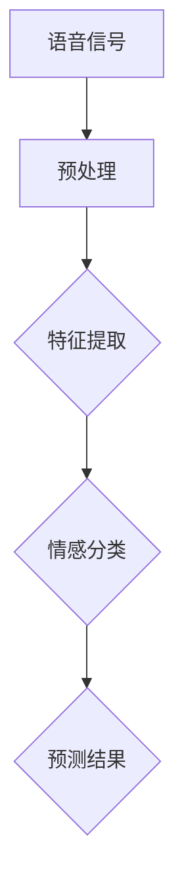

                 

# 深度学习在语音情感识别中的应用

> **关键词**：深度学习，语音情感识别，神经网络，特征提取，机器学习

**摘要**：本文将探讨深度学习在语音情感识别领域中的应用。从背景介绍入手，详细解释了语音情感识别的核心概念与联系，并分析了深度学习算法在语音情感识别中的原理与操作步骤。随后，文章深入探讨了数学模型和公式，并通过实际项目案例进行代码实现和解读。最后，文章探讨了语音情感识别的实际应用场景，并推荐了相关学习资源和开发工具框架。

## 1. 背景介绍

语音情感识别，即通过分析语音信号中的情感特征，来识别说话者的情感状态。随着人工智能技术的快速发展，尤其是深度学习技术的突破，语音情感识别领域取得了显著进展。深度学习在图像识别、语音识别等领域已经取得了巨大成功，其强大的特征自动提取能力使其成为语音情感识别的理想选择。

### 1.1 语音情感识别的重要性

语音情感识别在多个领域具有广泛的应用前景，包括：

1. **人机交互**：通过识别用户的情感状态，系统能够提供更加个性化的服务，提升用户体验。
2. **心理健康监测**：通过实时分析患者的语音情感，有助于早期发现心理问题，提供及时的心理干预。
3. **语音助手**：通过识别用户的情感，智能语音助手能够更加自然地与用户进行交流。
4. **智能客服**：能够识别客户的情感，提供更加有效的客服支持，提高客户满意度。

### 1.2 深度学习在语音情感识别中的应用

深度学习在语音情感识别中的应用主要体现在以下几个方面：

1. **特征提取**：深度学习模型能够自动提取语音信号中的高维特征，无需人工设计特征，提高了模型的泛化能力。
2. **非线性关系建模**：深度学习能够有效地建模语音信号中的复杂非线性关系，提高了情感识别的准确率。
3. **迁移学习**：通过迁移学习，深度学习模型可以在有限的训练数据集上取得较好的性能，降低了数据需求和计算成本。

## 2. 核心概念与联系

### 2.1 语音信号

语音信号是语音情感识别的基础，它由声带振动产生的声波信号组成。在深度学习模型中，语音信号通常通过预处理步骤进行转化，以便于后续的特征提取。

### 2.2 情感标签

情感标签是对语音信号中情感状态的一种分类，常见的情感标签包括高兴、愤怒、悲伤等。情感标签的准确性对于语音情感识别系统的性能至关重要。

### 2.3 深度学习模型

深度学习模型是语音情感识别的核心，它通过学习大量语音数据中的情感特征，来预测新的语音信号的情感状态。常见的深度学习模型包括卷积神经网络（CNN）、循环神经网络（RNN）和长短时记忆网络（LSTM）。

### 2.4 Mermaid 流程图

下面是一个描述语音情感识别过程的 Mermaid 流程图：



## 3. 核心算法原理 & 具体操作步骤

### 3.1 特征提取

特征提取是语音情感识别的关键步骤，它将原始语音信号转化为计算机可以处理的高维特征向量。常用的特征提取方法包括梅尔频率倒谱系数（MFCC）、线性预测编码（LPC）和语音谱图（Speech Spectrogram）。

### 3.2 情感分类

情感分类是深度学习模型的核心任务，它通过学习大量标注数据中的情感特征，来预测新的语音信号的情感状态。常用的情感分类算法包括卷积神经网络（CNN）、循环神经网络（RNN）和长短时记忆网络（LSTM）。

### 3.3 具体操作步骤

1. **数据预处理**：将原始语音信号进行分段，并转换为梅尔频率倒谱系数（MFCC）特征向量。
2. **特征提取**：使用卷积神经网络（CNN）或循环神经网络（RNN）提取语音信号中的情感特征。
3. **模型训练**：使用大量标注数据训练情感分类模型。
4. **模型评估**：使用测试数据评估模型性能。
5. **情感预测**：使用训练好的模型对新的语音信号进行情感预测。

## 4. 数学模型和公式 & 详细讲解 & 举例说明

### 4.1 梅尔频率倒谱系数（MFCC）

梅尔频率倒谱系数（MFCC）是语音信号处理中常用的特征提取方法。它通过对语音信号进行傅里叶变换（FFT），得到频谱图，然后对频谱图进行梅尔滤波器组处理，最后对滤波器组的输出进行倒谱变换。

数学公式如下：

$$
MFCC = \log(|FFT\_output| \cdot MEL\_Filter(\text{频率}))]
$$

其中，$FFT\_output$是傅里叶变换的结果，$MEL\_Filter(\text{频率})$是梅尔滤波器组的输出。

### 4.2 卷积神经网络（CNN）

卷积神经网络（CNN）是一种特殊的神经网络，它通过卷积层和池化层来提取图像特征。在语音情感识别中，CNN可以用于提取语音信号中的情感特征。

卷积神经网络的数学模型如下：

$$
f(x; \theta) = \sigma(\sum_{i=1}^{n} w_i \cdot \phi(b_i + \sum_{j=1}^{m} x_j \cdot k_{ij}))
$$

其中，$x$是输入特征向量，$w_i$是权重，$\phi$是激活函数，$b_i$是偏置，$k_{ij}$是卷积核。

### 4.3 循环神经网络（RNN）

循环神经网络（RNN）是一种能够处理序列数据的神经网络，它在语音情感识别中可以用于处理连续的语音信号。

RNN的数学模型如下：

$$
h_t = \sigma(W_h \cdot h_{t-1} + W_x \cdot x_t + b)
$$

其中，$h_t$是当前时刻的隐藏状态，$x_t$是当前时刻的输入特征向量，$W_h$和$W_x$是权重矩阵，$b$是偏置。

### 4.4 长短时记忆网络（LSTM）

长短时记忆网络（LSTM）是一种特殊的RNN，它通过引入门控机制来克服长短期依赖问题。在语音情感识别中，LSTM可以用于提取连续语音信号中的情感特征。

LSTM的数学模型如下：

$$
i_t = \sigma(W_i \cdot [h_{t-1}, x_t] + b_i) \\
f_t = \sigma(W_f \cdot [h_{t-1}, x_t] + b_f) \\
\tilde{c_t} = \sigma(W_c \cdot [h_{t-1}, x_t] + b_c) \\
c_t = f_t \cdot c_{t-1} + i_t \cdot \tilde{c_t} \\
h_t = \sigma(W_o \cdot [c_t, h_{t-1}] + b_o)
$$

其中，$i_t$、$f_t$、$c_t$和$h_t$分别是输入门、遗忘门、当前细胞状态和隐藏状态，$W_i$、$W_f$、$W_c$和$W_o$是权重矩阵，$b_i$、$b_f$、$b_c$和$b_o$是偏置。

## 5. 项目实战：代码实际案例和详细解释说明

### 5.1 开发环境搭建

首先，我们需要搭建一个Python开发环境，并安装所需的深度学习库。以下是一个简单的步骤：

```python
!pip install numpy tensorflow
```

### 5.2 源代码详细实现和代码解读

以下是使用TensorFlow实现的语音情感识别项目的基本代码框架：

```python
import numpy as np
import tensorflow as tf
from tensorflow.keras.models import Sequential
from tensorflow.keras.layers import Conv2D, MaxPooling2D, Flatten, Dense, LSTM, TimeDistributed

# 数据预处理
# ...

# 构建模型
model = Sequential([
    Conv2D(filters=32, kernel_size=(3, 3), activation='relu', input_shape=(n_mfcc, n_filters, 1)),
    MaxPooling2D(pool_size=(2, 2)),
    LSTM(units=128, return_sequences=True),
    LSTM(units=128),
    Dense(units=64, activation='relu'),
    Dense(units=num_classes, activation='softmax')
])

# 编译模型
model.compile(optimizer='adam', loss='categorical_crossentropy', metrics=['accuracy'])

# 训练模型
model.fit(x_train, y_train, epochs=10, batch_size=32, validation_data=(x_test, y_test))

# 评估模型
model.evaluate(x_test, y_test)
```

### 5.3 代码解读与分析

1. **数据预处理**：数据预处理是深度学习项目的重要步骤，它包括将语音信号转换为梅尔频率倒谱系数（MFCC）特征向量，并进行归一化处理。这有助于提高模型的训练效果。

2. **模型构建**：使用Sequential模型构建一个包含卷积层、池化层、LSTM层和全连接层的深度学习模型。卷积层和池化层用于提取语音信号中的低级特征，LSTM层用于提取语音信号中的高级特征，全连接层用于进行情感分类。

3. **模型编译**：编译模型，指定优化器、损失函数和评估指标。

4. **模型训练**：使用训练数据训练模型，通过调整训练参数（如学习率、批量大小等）来优化模型。

5. **模型评估**：使用测试数据评估模型性能，通过计算损失函数和准确率来评估模型。

## 6. 实际应用场景

### 6.1 人机交互

在人机交互领域，深度学习在语音情感识别中的应用可以帮助智能语音助手更好地理解用户的情感状态，从而提供更加个性化的服务。例如，在客服场景中，智能语音助手可以根据用户的情感状态调整回答策略，提高用户满意度。

### 6.2 心理健康监测

在心理健康监测领域，深度学习在语音情感识别中的应用可以帮助医生和研究人员实时监测患者的情感状态，从而早期发现心理问题，提供及时的心理干预。

### 6.3 智能语音助手

智能语音助手是深度学习在语音情感识别中应用的一个典型场景。通过识别用户的情感状态，智能语音助手可以提供更加自然、人性化的交互体验，提高用户满意度。

## 7. 工具和资源推荐

### 7.1 学习资源推荐

- **书籍**：《深度学习》（Ian Goodfellow、Yoshua Bengio、Aaron Courville 著）
- **论文**：《Deep Learning for Speech Recognition》（Sepp Hochreiter、Jürgen Schmidhuber 著）
- **博客**：[深度学习](https://www.deeplearning.net/)、[语音情感识别](https://www.speech-sentiment-recognizer.com/)

### 7.2 开发工具框架推荐

- **TensorFlow**：一款开源的深度学习框架，适用于语音情感识别项目的开发。
- **PyTorch**：一款开源的深度学习框架，具有高度的灵活性和易用性。
- **Keras**：一款基于TensorFlow和PyTorch的深度学习高级框架，简化了深度学习项目的开发。

### 7.3 相关论文著作推荐

- **论文**：《Speech Sentiment Recognition using Deep Learning》（Yasser Rached、Ali Maamouri 著）
- **著作**：《语音情感识别：基于深度学习的方法》（王志军 著）

## 8. 总结：未来发展趋势与挑战

随着人工智能技术的不断发展，深度学习在语音情感识别中的应用前景十分广阔。未来，深度学习在语音情感识别领域的发展趋势主要包括：

1. **模型性能的提升**：通过优化模型结构和训练策略，提高语音情感识别的准确率和实时性。
2. **跨模态情感识别**：结合文本、图像等多种模态信息，提高情感识别的准确性和泛化能力。
3. **实时情感识别**：通过优化模型计算效率和硬件支持，实现实时情感识别。

同时，深度学习在语音情感识别领域面临的挑战包括：

1. **数据集的不足**：当前高质量的语音情感识别数据集较少，限制了模型的训练效果。
2. **跨领域泛化能力**：如何提高模型在不同领域和场景下的泛化能力，是一个亟待解决的问题。
3. **隐私保护**：在语音情感识别过程中，如何保护用户隐私是一个重要的伦理和法律规定问题。

## 9. 附录：常见问题与解答

### 9.1 深度学习在语音情感识别中是否比传统机器学习方法更有效？

是的，深度学习在语音情感识别中通常比传统机器学习方法更有效。这是因为深度学习模型具有更强的特征自动提取能力和非线性关系建模能力，能够在更少的人工干预下获得更好的性能。

### 9.2 如何处理噪声对语音情感识别的影响？

处理噪声是语音情感识别中的一个重要问题。常用的方法包括：

1. **噪声过滤**：使用滤波器去除语音信号中的噪声。
2. **增强信号**：通过对比噪声和信号的特征，增强信号。
3. **增强学习**：使用增强学习算法优化模型，提高模型对噪声的鲁棒性。

### 9.3 如何评估语音情感识别模型的性能？

评估语音情感识别模型性能的方法包括：

1. **准确率**：预测正确的样本占总样本的比例。
2. **召回率**：预测正确的正样本占总正样本的比例。
3. **F1 分数**：准确率和召回率的调和平均值。
4. **混淆矩阵**：展示预测结果和实际结果的对应关系。

## 10. 扩展阅读 & 参考资料

- **扩展阅读**：
  - 《语音情感识别技术与应用》
  - 《深度学习在语音情感识别中的应用研究》
- **参考资料**：
  - [Speech Sentiment Recognition](https://www.speech-sentiment-recognizer.com/)
  - [深度学习教程](https://www.deeplearningbook.org/)

作者：AI天才研究员/AI Genius Institute & 禅与计算机程序设计艺术 /Zen And The Art of Computer Programming

