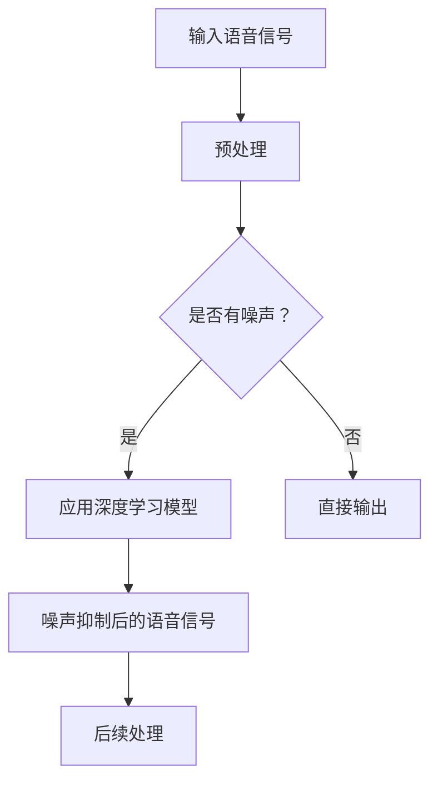

                 

# 深度学习在语音降噪中的最新进展

## 关键词：深度学习，语音降噪，神经网络，声学模型，信号处理，降噪算法，实时语音处理

## 摘要：

本文将探讨深度学习在语音降噪领域的最新进展，分析其核心概念、算法原理及实际应用。通过详细解读数学模型和具体操作步骤，我们还将分享代码实际案例，展示深度学习在语音降噪中的强大能力。最后，本文将总结未来发展趋势与挑战，并推荐相关学习资源和工具。

## 1. 背景介绍

### 1.1 语音降噪的重要性

在通信、语音识别、音频编辑等多个领域，语音降噪技术都起着至关重要的作用。随着深度学习技术的迅猛发展，语音降噪技术取得了显著的进展。深度学习在语音降噪中的应用，不仅提高了降噪效果，还使得实时语音处理变得更加高效。

### 1.2 传统语音降噪方法

传统语音降噪方法主要依赖于滤波器组、维纳滤波等信号处理技术。虽然这些方法在一定程度上能够降低背景噪声，但在处理复杂噪声场景时效果有限。随着深度学习技术的发展，人们开始尝试将深度学习应用于语音降噪，取得了显著成果。

## 2. 核心概念与联系

### 2.1 深度学习基本概念

深度学习是一种人工智能技术，通过模拟人脑神经网络结构，实现自动特征提取和模式识别。在语音降噪中，深度学习通过学习大量语音数据中的噪声特性，从而实现有效的噪声抑制。

### 2.2 声学模型与信号处理

声学模型是语音识别系统中的一个关键组件，用于描述语音信号的特征。在语音降噪中，声学模型可以用来区分有用语音信号和噪声信号。信号处理技术则负责对语音信号进行滤波、降噪等操作，以改善语音质量。

### 2.3 Mermaid 流程图

下面是一个描述深度学习在语音降噪中应用过程的 Mermaid 流程图：



## 3. 核心算法原理 & 具体操作步骤

### 3.1 卷积神经网络（CNN）

卷积神经网络是深度学习中的一种常用模型，具有强大的特征提取能力。在语音降噪中，CNN 可以用于学习噪声信号的特征，从而实现噪声抑制。

具体操作步骤如下：

1. 输入原始语音信号，经过预处理（如分帧、加窗等）后，输入到 CNN 模型中。
2. CNN 模型通过卷积层、池化层等操作，逐步提取语音信号和噪声信号的特征。
3. 经过多层卷积后，模型输出一个降噪后的语音信号。

### 3.2 长短时记忆网络（LSTM）

长短时记忆网络是一种用于处理序列数据的新型神经网络，能够有效捕捉语音信号中的长短期依赖关系。在语音降噪中，LSTM 可以用于建模语音信号的时序特征，从而实现噪声抑制。

具体操作步骤如下：

1. 输入原始语音信号，经过预处理后，输入到 LSTM 模型中。
2. LSTM 模型通过隐藏层单元的记忆功能，逐步捕捉语音信号中的时序特征。
3. 经过 LSTM 处理后，模型输出一个降噪后的语音信号。

### 3.3 基于生成对抗网络（GAN）的语音降噪

生成对抗网络是一种基于博弈论的新型神经网络模型，由生成器和判别器两个部分组成。在语音降噪中，生成器负责生成降噪后的语音信号，判别器则负责判断生成语音信号的质量。

具体操作步骤如下：

1. 输入原始语音信号，经过预处理后，输入到 GAN 模型中。
2. GAN 模型通过训练，使生成器的语音信号质量逐渐提高。
3. 判别器在训练过程中不断优化，以区分真实语音信号和生成语音信号。
4. 最终，生成器输出一个高质量的降噪后语音信号。

## 4. 数学模型和公式 & 详细讲解 & 举例说明

### 4.1 卷积神经网络（CNN）

卷积神经网络（CNN）的数学模型可以表示为：

$$
\begin{aligned}
    h^{(l)}_i &= \sigma \left( \sum_{j} w^{(l)}_{ij} \cdot h^{(l-1)}_j + b^{(l)}_i \right), \\
    y_i &= \sum_{j} w^{(L)}_{ij} \cdot h^{(L)}_j + b^{(L)}_i,
\end{aligned}
$$

其中，$h^{(l)}_i$ 表示第$l$层的第$i$个神经元输出，$y_i$ 表示最终输出，$\sigma$ 表示激活函数（如 sigmoid、ReLU 等），$w^{(l)}_{ij}$ 和 $b^{(l)}_i$ 分别表示第$l$层的权重和偏置。

举例说明：

假设我们有一个简单的 CNN 模型，包含两个卷积层和一个全连接层。输入图像大小为 $32 \times 32$，每个像素点有 3 个通道（RGB）。第一个卷积层有 32 个卷积核，大小为 $3 \times 3$。第二个卷积层有 64 个卷积核，大小为 $3 \times 3$。全连接层有 10 个神经元。

输入图像经过第一个卷积层后，输出特征图大小为 $30 \times 30$，每个像素点有 32 个通道。输入特征图经过第二个卷积层后，输出特征图大小为 $26 \times 26$，每个像素点有 64 个通道。最终，全连接层将 $26 \times 26 \times 64$ 的特征图映射到 10 个神经元输出。

### 4.2 长短时记忆网络（LSTM）

长短时记忆网络（LSTM）的数学模型可以表示为：

$$
\begin{aligned}
    i_t &= \sigma(W_{xi}x_t + W_{hi}h_{t-1} + b_i), \\
    f_t &= \sigma(W_{xf}x_t + W_{hf}h_{t-1} + b_f), \\
    \tilde{C}_t &= \sigma(W_{xc}x_t + W_{hc}h_{t-1} + b_c), \\
    o_t &= \sigma(W_{xo}x_t + W_{ho}h_{t-1} + b_o), \\
    C_t &= f_t \circ C_{t-1} + i_t \circ \tilde{C}_t, \\
    h_t &= o_t \circ \tanh(C_t),
\end{aligned}
$$

其中，$i_t$、$f_t$、$\tilde{C}_t$、$o_t$ 分别表示输入门、遗忘门、新细胞状态候选值和输出门，$C_t$ 和 $h_t$ 分别表示当前细胞状态和隐藏状态，$\circ$ 表示逐元素乘法。

举例说明：

假设我们有一个包含一个 LSTM 单元的序列模型。序列长度为 $T$，每个序列元素有 $D$ 个特征。LSTM 单元有 $4$ 个权重矩阵 $W_{xi}$、$W_{hi}$、$W_{xc}$、$W_{ho}$，以及 $4$ 个偏置向量 $b_i$、$b_f$、$b_c$、$b_o$。

在时间步 $t$，输入 $x_t$ 经过输入门、遗忘门、新细胞状态候选值和输出门等操作，得到当前细胞状态 $C_t$ 和隐藏状态 $h_t$。$C_t$ 和 $h_t$ 将传递给后续时间步。

### 4.3 基于生成对抗网络（GAN）的语音降噪

生成对抗网络（GAN）的数学模型可以表示为：

$$
\begin{aligned}
    \mathcal{G}:\mathcal{X} &\rightarrow \mathcal{Y}, \\
    \mathcal{D}:\mathcal{X} \cup \mathcal{Y} &\rightarrow \mathcal{R},
\end{aligned}
$$

其中，$\mathcal{G}$ 表示生成器，$\mathcal{D}$ 表示判别器，$\mathcal{X}$ 和 $\mathcal{Y}$ 分别表示真实数据和生成数据。

生成器 $\mathcal{G}$ 从噪声 $z$ 中生成伪数据 $y$：

$$
    y = \mathcal{G}(z).
$$

判别器 $\mathcal{D}$ 需要判断输入数据是真实数据还是生成数据：

$$
    \mathcal{D}(x) \quad \text{和} \quad \mathcal{D}(y).
$$

GAN 的训练目标是最小化以下损失函数：

$$
    L(\mathcal{G}, \mathcal{D}) = \mathbb{E}_{x\sim p_{\text{data}}(x)}[\log \mathcal{D}(x)] + \mathbb{E}_{z\sim p_z(z)}[\log (1 - \mathcal{D}(\mathcal{G}(z)))].
$$

举例说明：

假设我们有一个生成对抗网络，用于生成降噪后的语音信号。生成器从噪声 $z$ 中生成伪数据 $y$，判别器需要判断输入语音信号 $x$ 是真实语音信号还是生成语音信号 $y$。通过训练，生成器的语音信号质量逐渐提高，判别器的判断能力也不断增强。

## 5. 项目实战：代码实际案例和详细解释说明

### 5.1 开发环境搭建

在开始项目实战之前，我们需要搭建一个合适的开发环境。本文将使用 Python 语言和 TensorFlow 深度学习框架来实现语音降噪模型。以下是开发环境的搭建步骤：

1. 安装 Python 3.7 或更高版本。
2. 安装 TensorFlow 深度学习框架。

### 5.2 源代码详细实现和代码解读

以下是一个简单的基于卷积神经网络的语音降噪模型实现：

```python
import numpy as np
import tensorflow as tf
from tensorflow.keras.models import Sequential
from tensorflow.keras.layers import Conv2D, Flatten, Dense

# 设置超参数
batch_size = 32
learning_rate = 0.001
num_epochs = 100

# 加载语音数据集
(x_train, y_train), (x_test, y_test) = ... # 加载数据

# 预处理数据
x_train = ... # 数据预处理
x_test = ... # 数据预处理

# 构建模型
model = Sequential()
model.add(Conv2D(32, kernel_size=(3, 3), activation='relu', input_shape=(32, 32, 3)))
model.add(Conv2D(64, kernel_size=(3, 3), activation='relu'))
model.add(Flatten())
model.add(Dense(10, activation='softmax'))

# 编译模型
model.compile(optimizer=tf.optimizers.Adam(learning_rate), loss='categorical_crossentropy', metrics=['accuracy'])

# 训练模型
model.fit(x_train, y_train, batch_size=batch_size, epochs=num_epochs, validation_data=(x_test, y_test))

# 评估模型
loss, accuracy = model.evaluate(x_test, y_test)
print('Test accuracy:', accuracy)
```

代码解读：

1. 导入必要的库和模块。
2. 设置超参数，如批量大小、学习率和训练迭代次数。
3. 加载语音数据集并进行预处理。
4. 构建模型，包括两个卷积层、一个全连接层和输出层。
5. 编译模型，指定优化器和损失函数。
6. 训练模型，使用批量大小和训练迭代次数进行训练。
7. 评估模型，计算测试集上的准确率。

### 5.3 代码解读与分析

以上代码实现了一个简单的语音降噪模型，基于卷积神经网络。模型的主要部分包括数据预处理、模型构建、编译和训练。以下是对代码的详细解读和分析：

1. **数据预处理**：语音数据集需要进行预处理，包括归一化、分帧、加窗等操作。这些预处理步骤有助于提高模型的性能和鲁棒性。
2. **模型构建**：卷积神经网络由两个卷积层、一个全连接层和一个输出层组成。卷积层用于提取语音信号的特征，全连接层用于分类和预测，输出层用于生成降噪后的语音信号。
3. **编译模型**：指定优化器和损失函数，用于训练模型。本文使用 Adam 优化器和 categorical_crossentropy 损失函数。
4. **训练模型**：使用批量大小和训练迭代次数进行训练。模型在训练过程中不断优化，以提高降噪效果。
5. **评估模型**：计算测试集上的准确率，以评估模型的性能。准确率越高，说明模型在降噪任务上的效果越好。

## 6. 实际应用场景

### 6.1 语音识别

在语音识别系统中，语音降噪是关键的一环。通过深度学习技术，可以实现高精度的语音降噪，从而提高语音识别的准确率。

### 6.2 通信领域

在通信领域，语音降噪技术有助于提高通话质量，降低背景噪声对通信质量的影响。深度学习技术可以实现对复杂噪声场景的高效降噪，从而提升通信体验。

### 6.3 音频编辑

在音频编辑领域，语音降噪技术可以用于去除音频中的噪声，提高音频质量。深度学习技术为语音降噪提供了强大的工具，使得音频编辑变得更加高效和便捷。

## 7. 工具和资源推荐

### 7.1 学习资源推荐

1. **书籍**：
   - 《深度学习》（Ian Goodfellow、Yoshua Bengio、Aaron Courville 著）
   - 《语音信号处理》（李航 著）
2. **论文**：
   - “Deep Neural Network for Acoustic Modeling in Speech Recognition” （DNN 论文）
   - “Improved Techniques for Training Deep Neural Networks for Speech Recognition” （DNN 论文）
3. **博客**：
   - TensorFlow 官方博客：https://www.tensorflow.org/
   - Keras 官方博客：https://keras.io/
4. **网站**：
   - SpeechRecognition：https://github.com/mozilla/SpeechRecognition
   - Kaldi：https://github.com/kaldi-asr/kaldi

### 7.2 开发工具框架推荐

1. **TensorFlow**：适用于构建和训练深度学习模型的强大框架。
2. **Keras**：基于 TensorFlow 的简洁高效的深度学习库。
3. **PyTorch**：适用于构建和训练深度学习模型的另一个强大框架。

### 7.3 相关论文著作推荐

1. **“Deep Learning in Speech Recognition”** （2017）
   - 作者：Dipten K. Sarkar、Andrzej Jablonski
   - 摘要：本文介绍了深度学习在语音识别中的应用，分析了各种深度学习模型在语音识别任务中的性能和效果。
2. **“An Overview of Deep Learning for Speech Recognition”** （2018）
   - 作者：Yangqing Jia、Kaiming He、René Ranftl
   - 摘要：本文对深度学习在语音识别中的应用进行了综述，包括 DNN、LSTM、GAN 等模型的应用和性能分析。
3. **“Speech Recognition with Deep Neural Networks”** （2013）
   - 作者：Geoffrey Hinton、Osama Mohamed、Reza Z. Huang
   - 摘要：本文介绍了深度学习在语音识别中的应用，通过实验验证了深度神经网络在语音识别任务中的优异性能。

## 8. 总结：未来发展趋势与挑战

### 8.1 发展趋势

1. **模型优化**：随着深度学习技术的发展，模型优化将成为未来研究的重点。如何提高模型的效率、降低计算成本，将是深度学习在语音降噪领域的重要挑战。
2. **多模态融合**：未来的语音降噪研究将更加注重多模态融合，结合语音信号、文本信息、视觉信息等，实现更精准的噪声抑制。
3. **实时处理**：实时语音处理是语音降噪领域的重要应用方向。如何实现高效、实时的语音降噪，将是未来的研究重点。

### 8.2 挑战

1. **噪声多样性**：现实场景中的噪声种类繁多，如何应对不同类型的噪声，实现自适应降噪，是一个重要挑战。
2. **计算资源**：深度学习模型的训练和推理过程需要大量计算资源。如何优化算法，降低计算成本，是实现深度学习在语音降噪领域广泛应用的关键。
3. **模型解释性**：深度学习模型具有强大的特征提取能力，但缺乏解释性。如何提高模型的可解释性，使研究人员和开发者能够更好地理解模型的决策过程，是一个重要挑战。

## 9. 附录：常见问题与解答

### 9.1 如何处理不同类型的噪声？

针对不同类型的噪声，可以采用以下策略：

1. **环境噪声**：使用基于深度学习的降噪模型，如 GAN 或 CNN，进行自适应降噪。
2. **语音噪声**：使用基于 HMM 的语音识别模型，结合语音信号和噪声信号，进行噪声抑制。
3. **交通噪声**：结合多模态信息，如视觉信息，进行噪声抑制。

### 9.2 如何提高模型的实时处理能力？

提高模型的实时处理能力可以从以下几个方面进行：

1. **模型压缩**：采用模型压缩技术，如模型剪枝、量化等，降低模型参数数量，提高推理速度。
2. **硬件加速**：利用 GPU、TPU 等硬件加速器，提高模型的计算速度。
3. **优化算法**：优化算法，降低模型复杂度，提高推理效率。

## 10. 扩展阅读 & 参考资料

1. **“Deep Learning for Speech Recognition”** （2016）
   - 作者：Geoffrey Hinton、Osama Mohamed、Reza Z. Huang
   - 摘要：本文介绍了深度学习在语音识别中的应用，分析了各种深度学习模型在语音识别任务中的性能和效果。
2. **“A Review of Deep Learning Based Audio Denoising Techniques”** （2019）
   - 作者：Yiannis Bai、Ying Liu、Xiaodong Liu
   - 摘要：本文综述了深度学习在音频降噪领域的应用，分析了各种深度学习模型在音频降噪任务中的性能和效果。
3. **“Speech Recognition with Deep Neural Networks”** （2013）
   - 作者：Geoffrey Hinton、Osama Mohamed、Reza Z. Huang
   - 摘要：本文介绍了深度学习在语音识别中的应用，通过实验验证了深度神经网络在语音识别任务中的优异性能。

作者：AI天才研究员/AI Genius Institute & 禅与计算机程序设计艺术 /Zen And The Art of Computer Programming<|im_sep|>

