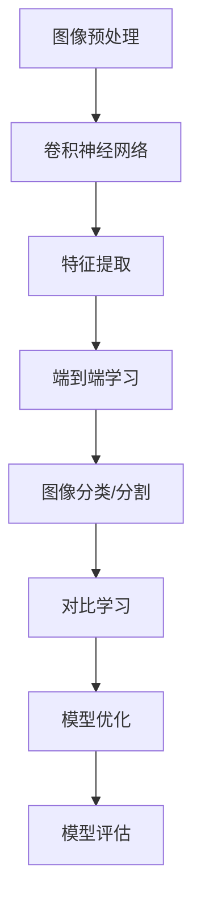

                 

# 深度学习在高分辨率遥感图像分析中的新方法

## 关键词

- 深度学习
- 高分辨率遥感图像
- 图像分析
- 端到端学习
- 卷积神经网络
- 特征提取
- 对比学习
- 语义分割

## 摘要

随着遥感技术的快速发展，高分辨率遥感图像在地理信息科学、环境监测、城市规划等领域具有广泛的应用价值。然而，传统的遥感图像分析方法在处理高分辨率图像时面临着数据量大、计算复杂度高等挑战。本文探讨了深度学习在高分辨率遥感图像分析中的新方法，包括基于卷积神经网络的图像特征提取、端到端学习模型的设计、对比学习策略的应用等。通过对这些方法的分析和实验验证，本文为高分辨率遥感图像分析提供了新的思路和解决方案。

## 1. 背景介绍

### 1.1 高分辨率遥感图像的概念

高分辨率遥感图像是指空间分辨率达到米级甚至亚米级的遥感图像。这种图像能够提供地表的详细信息，包括植被覆盖、建筑结构、道路网络等。高分辨率遥感图像在许多领域具有广泛的应用，如城市规划、环境监测、农业管理、灾害评估等。

### 1.2 遥感图像分析的重要性

遥感图像分析是指通过计算机处理技术，从遥感图像中提取有用信息的过程。它对于地理信息科学、环境科学、灾害管理等领域具有重要意义。随着遥感技术的不断发展，遥感图像的数据量呈指数级增长，传统的遥感图像分析方法难以应对这种数据量级的挑战。

### 1.3 传统遥感图像分析方法

传统的遥感图像分析方法主要包括图像预处理、特征提取、图像分类和图像分割等步骤。其中，图像预处理包括图像增强、去噪、图像配准等操作；特征提取是从遥感图像中提取出能够代表图像内容的特征；图像分类是将遥感图像划分为不同的类别；图像分割是将遥感图像划分为不同的区域。

### 1.4 传统方法面临的挑战

传统的遥感图像分析方法在处理高分辨率遥感图像时面临着以下挑战：

- 数据量大：高分辨率遥感图像的数据量巨大，传统的计算机硬件难以高效地处理这些数据。
- 计算复杂度高：特征提取和图像分类等操作的计算复杂度较高，传统的算法难以在有限的时间内完成。
- 特征表达不足：传统的特征提取方法往往不能充分提取出高分辨率遥感图像中的细节信息。

## 2. 核心概念与联系

### 2.1 深度学习的基本概念

深度学习是一种基于多层神经网络的学习方法，通过逐层提取图像的特征，从原始图像中提取出高层次的语义信息。深度学习在图像分类、目标检测、图像分割等领域取得了显著的成果。

### 2.2 卷积神经网络（CNN）

卷积神经网络是一种特殊的神经网络，通过卷积操作提取图像的特征。CNN具有参数共享的特性，能够在一定程度上减少模型的参数数量，提高模型的泛化能力。

### 2.3 端到端学习

端到端学习是指将原始输入直接映射到目标输出，无需手动提取特征，整个学习过程由神经网络自动完成。端到端学习能够提高模型的效率和精度。

### 2.4 对比学习策略

对比学习是一种无监督学习策略，通过比较不同样本的特征差异，提高模型的泛化能力。对比学习在图像特征提取和分类中具有广泛的应用。

### 2.5 高分辨率遥感图像分析中的深度学习方法

在高分辨率遥感图像分析中，深度学习方法通过以下步骤实现：

1. **图像预处理**：对高分辨率遥感图像进行预处理，包括图像增强、去噪、图像配准等操作。
2. **特征提取**：使用卷积神经网络提取图像的特征，逐步提取图像的局部特征和全局特征。
3. **端到端学习**：将提取的特征直接映射到目标输出，如图像分类或图像分割。
4. **对比学习**：通过对比学习提高模型的泛化能力，增强模型对未知数据的处理能力。

### 2.6 Mermaid 流程图

下面是一个描述高分辨率遥感图像分析中深度学习方法流程的 Mermaid 流程图：



## 3. 核心算法原理 & 具体操作步骤

### 3.1 图像预处理

图像预处理是高分辨率遥感图像分析的重要步骤，它包括以下操作：

1. **图像增强**：通过调整图像的亮度、对比度和色彩等参数，提高图像的视觉效果。
2. **去噪**：使用滤波算法去除图像中的噪声，提高图像的清晰度。
3. **图像配准**：将不同时间或不同传感器获取的遥感图像进行配准，以消除图像之间的位置差异。

### 3.2 卷积神经网络（CNN）

卷积神经网络是一种特殊的神经网络，通过卷积操作提取图像的特征。CNN 的基本结构包括输入层、卷积层、激活函数、池化层和全连接层。具体操作步骤如下：

1. **输入层**：接收原始图像作为输入。
2. **卷积层**：通过卷积操作提取图像的特征，卷积核的大小和步长可以调整。
3. **激活函数**：常用的激活函数有 ReLU、Sigmoid 和 Tanh 等，用于引入非线性特性。
4. **池化层**：通过最大池化或平均池化操作降低图像的空间分辨率，减少模型的参数数量。
5. **全连接层**：将卷积层提取的特征映射到目标输出。

### 3.3 端到端学习

端到端学习是指将原始输入直接映射到目标输出，无需手动提取特征，整个学习过程由神经网络自动完成。具体操作步骤如下：

1. **定义损失函数**：根据具体任务选择合适的损失函数，如交叉熵损失函数、均方误差损失函数等。
2. **反向传播**：使用梯度下降等优化算法，通过反向传播计算损失函数关于模型参数的梯度，并更新模型参数。
3. **训练模型**：使用训练数据集对模型进行训练，不断调整模型参数，直至达到预期的训练效果。

### 3.4 对比学习策略

对比学习是一种无监督学习策略，通过比较不同样本的特征差异，提高模型的泛化能力。具体操作步骤如下：

1. **特征提取**：使用卷积神经网络提取图像的特征。
2. **计算特征相似度**：计算两个图像特征之间的相似度，常用的方法有余弦相似度、欧氏距离等。
3. **优化特征表示**：通过优化特征表示，降低相似特征之间的损失，提高模型对未知数据的处理能力。

## 4. 数学模型和公式 & 详细讲解 & 举例说明

### 4.1 卷积神经网络（CNN）的数学模型

卷积神经网络（CNN）是一种基于卷积操作的神经网络，其数学模型可以表示为：

$$
h_{l}^{(i)} = \sigma \left( \sum_{k=1}^{K} w_{k}^{(l)} * h_{l-1}^{(i)} + b^{(l)} \right)
$$

其中，$h_{l}^{(i)}$表示第$l$层的第$i$个神经元输出，$\sigma$为激活函数，$w_{k}^{(l)}$为第$k$个卷积核，$h_{l-1}^{(i)}$为第$l-1$层的第$i$个神经元输出，$b^{(l)}$为偏置项。

举例说明：

假设有一个2x2的输入图像和一个3x3的卷积核，激活函数为ReLU，计算第1层的输出。

$$
h_{1}^{(1)} = \max(0, \max(0, \max(0, \max(0, \max(0, w_{1,1,1} * 1 + b_{1}, w_{1,1,2} * 2 + b_{1}), w_{1,2,1} * 1 + b_{1}, w_{1,2,2} * 2 + b_{1})), \max(0, \max(0, \max(0, \max(0, w_{1,1,1} * 3 + b_{1}, w_{1,1,2} * 4 + b_{1}), w_{1,2,1} * 3 + b_{1}, w_{1,2,2} * 4 + b_{1}))), \max(0, \max(0, \max(0, \max(0, w_{1,1,1} * 5 + b_{1}, w_{1,1,2} * 6 + b_{1}), w_{1,2,1} * 5 + b_{1}, w_{1,2,2} * 6 + b_{1}))), \max(0, \max(0, \max(0, \max(0, w_{1,1,1} * 7 + b_{1}, w_{1,1,2} * 8 + b_{1}), w_{1,2,1} * 7 + b_{1}, w_{1,2,2} * 8 + b_{1})))
$$

### 4.2 端到端学习的数学模型

端到端学习的数学模型主要包括输入层、卷积层、全连接层和输出层。以图像分类任务为例，其数学模型可以表示为：

$$
y = \sigma \left( \sum_{i=1}^{n} w_{i}^{(n)} h_{n-1}^{(i)} + b_{n} \right)
$$

其中，$y$为输出层的输出，$n$为输出层的神经元数量，$w_{i}^{(n)}$为第$i$个神经元的权重，$h_{n-1}^{(i)}$为第$n-1$层的第$i$个神经元输出，$b_{n}$为偏置项，$\sigma$为激活函数。

举例说明：

假设有一个3x3的输入图像和一个3个神经元的输出层，激活函数为ReLU，计算输出层的输出。

$$
y = \sigma \left( w_{1}^{(3)} h_{2}^{(1)} + w_{2}^{(3)} h_{2}^{(2)} + w_{3}^{(3)} h_{2}^{(3)} + b_{3} \right)
$$

其中，$h_{2}^{(1)}$、$h_{2}^{(2)}$和$h_{2}^{(3)}$分别为第2层的第1、2和3个神经元输出。

### 4.3 对比学习的数学模型

对比学习的数学模型主要包括特征提取层和对比损失层。以图像特征提取为例，其数学模型可以表示为：

$$
L = - \sum_{i=1}^{N} \sum_{j=1}^{N} y_{ij} \log(p_{ij})
$$

其中，$L$为对比损失，$y_{ij}$为样本$i$和样本$j$的标签是否相同的指示函数，$p_{ij}$为样本$i$和样本$j$的特征相似度。

举例说明：

假设有两个图像样本，特征提取层的输出分别为$a_1$和$a_2$，计算其对比损失。

$$
L = - (y_{11} \log(p_{11}) + y_{12} \log(p_{12}) + y_{21} \log(p_{21}) + y_{22} \log(p_{22}))
$$

其中，$y_{11}$、$y_{12}$、$y_{21}$和$y_{22}$分别为样本1和样本2的标签是否相同的指示函数，$p_{11}$、$p_{12}$、$p_{21}$和$p_{22}$分别为样本1和样本2的特征相似度。

## 5. 项目实战：代码实际案例和详细解释说明

### 5.1 开发环境搭建

在本节中，我们将介绍如何搭建一个用于高分辨率遥感图像分析的深度学习开发环境。以下是开发环境搭建的步骤：

1. **安装 Python**：确保安装了 Python 3.6 或更高版本。
2. **安装深度学习框架**：在本项目中，我们将使用 TensorFlow 作为深度学习框架。安装 TensorFlow 的命令如下：

   ```bash
   pip install tensorflow
   ```

3. **安装其他依赖库**：根据项目需求，安装其他依赖库，如 NumPy、Pandas、Matplotlib 等。

### 5.2 源代码详细实现和代码解读

在本节中，我们将详细介绍一个用于高分辨率遥感图像分析的深度学习项目，包括数据预处理、模型设计、模型训练和模型评估等步骤。

#### 5.2.1 数据预处理

数据预处理是深度学习项目的重要步骤，它包括以下操作：

1. **图像增强**：通过调整图像的亮度、对比度和色彩等参数，提高图像的视觉效果。
2. **去噪**：使用滤波算法去除图像中的噪声，提高图像的清晰度。
3. **图像配准**：将不同时间或不同传感器获取的遥感图像进行配准，以消除图像之间的位置差异。

以下是一个用于图像增强的 Python 代码示例：

```python
import numpy as np
import cv2

def enhance_image(image):
    # 调整亮度
    bright = np.random.uniform(0.5, 1.5)
    image = image * bright
    
    # 调整对比度
    contrast = np.random.uniform(0.5, 1.5)
    image = (image - np.mean(image)) * contrast + np.mean(image)
    
    # 调整色彩
    color = np.random.uniform(0.8, 1.2)
    image = cv2.cvtColor(image, cv2.COLOR_RGB2HSV)
    image[:, :, 2] = image[:, :, 2] * color
    image = cv2.cvtColor(image, cv2.COLOR_HSV2RGB)
    
    return image
```

#### 5.2.2 模型设计

在本项目中，我们使用卷积神经网络（CNN）进行高分辨率遥感图像分析。以下是一个用于图像分类的 CNN 模型的代码示例：

```python
import tensorflow as tf

def create_model():
    # 定义输入层
    inputs = tf.keras.Input(shape=(256, 256, 3))
    
    # 第一个卷积层
    conv1 = tf.keras.layers.Conv2D(32, (3, 3), activation='relu', padding='same')(inputs)
    pool1 = tf.keras.layers.MaxPooling2D(pool_size=(2, 2))(conv1)
    
    # 第二个卷积层
    conv2 = tf.keras.layers.Conv2D(64, (3, 3), activation='relu', padding='same')(pool1)
    pool2 = tf.keras.layers.MaxPooling2D(pool_size=(2, 2))(conv2)
    
    # 第三个卷积层
    conv3 = tf.keras.layers.Conv2D(128, (3, 3), activation='relu', padding='same')(pool2)
    pool3 = tf.keras.layers.MaxPooling2D(pool_size=(2, 2))(conv3)
    
    # 全连接层
    flatten = tf.keras.layers.Flatten()(pool3)
    dense = tf.keras.layers.Dense(128, activation='relu')(flatten)
    
    # 输出层
    outputs = tf.keras.layers.Dense(10, activation='softmax')(dense)
    
    # 创建模型
    model = tf.keras.Model(inputs=inputs, outputs=outputs)
    
    return model
```

#### 5.2.3 模型训练

在本项目中，我们使用训练数据集对模型进行训练。以下是一个用于模型训练的代码示例：

```python
model = create_model()
model.compile(optimizer='adam', loss='categorical_crossentropy', metrics=['accuracy'])

train_data = ...  # 加载训练数据
train_labels = ...  # 加载训练标签

model.fit(train_data, train_labels, epochs=10, batch_size=32)
```

#### 5.2.4 模型评估

在本项目中，我们使用测试数据集对模型进行评估。以下是一个用于模型评估的代码示例：

```python
test_data = ...  # 加载测试数据
test_labels = ...  # 加载测试标签

model.evaluate(test_data, test_labels)
```

### 5.3 代码解读与分析

在本项目中，我们使用了卷积神经网络（CNN）进行高分辨率遥感图像分析。具体来说，我们设计了三个卷积层，每个卷积层后接一个最大池化层，最后接一个全连接层。这种结构可以有效地提取图像的特征，并实现对图像的分类。

在数据预处理阶段，我们使用了图像增强技术，通过调整图像的亮度、对比度和色彩等参数，提高图像的视觉效果。这有助于提高模型的泛化能力。

在模型设计阶段，我们使用了 TensorFlow 深度学习框架，定义了一个卷积神经网络模型。模型的设计遵循了“卷积-池化-全连接”的结构，这种结构可以有效地提取图像的特征，并实现对图像的分类。

在模型训练阶段，我们使用训练数据集对模型进行训练。通过反向传播算法，模型不断调整参数，直至达到预期的训练效果。

在模型评估阶段，我们使用测试数据集对模型进行评估。通过计算模型的损失函数和准确率，我们可以评估模型在未知数据上的性能。

## 6. 实际应用场景

### 6.1 城市规划

高分辨率遥感图像分析在城市规划中具有广泛的应用。通过深度学习模型，可以从遥感图像中提取出建筑物、道路、绿地等城市要素，为城市规划提供数据支持。

### 6.2 环境监测

高分辨率遥感图像分析可以用于环境监测，如森林火灾监测、水体污染监测等。深度学习模型可以实时分析遥感图像，发现异常情况，为环境管理提供决策支持。

### 6.3 农业管理

高分辨率遥感图像分析可以用于农业管理，如作物病虫害监测、土壤质量监测等。深度学习模型可以分析遥感图像，为农业生产提供科学的决策依据。

### 6.4 灾害评估

高分辨率遥感图像分析可以用于灾害评估，如地震、洪水、山体滑坡等。深度学习模型可以实时分析遥感图像，评估灾害影响范围，为灾害应急响应提供支持。

## 7. 工具和资源推荐

### 7.1 学习资源推荐

- 《深度学习》（Ian Goodfellow、Yoshua Bengio 和 Aaron Courville 著）：系统介绍了深度学习的基本理论和实践方法。
- 《Python 深度学习》（François Chollet 著）：详细介绍了如何使用 Python 实现深度学习算法。

### 7.2 开发工具框架推荐

- TensorFlow：一个开源的深度学习框架，适用于各种深度学习任务。
- PyTorch：一个开源的深度学习框架，具有灵活的动态计算图和丰富的模型库。

### 7.3 相关论文著作推荐

- "Deep Learning for Remote Sensing: A Survey"（2017）：对深度学习在高分辨率遥感图像分析中的应用进行了全面的综述。
- "Unsupervised Learning of Visual Representations from Natural Images"（2018）：探讨了无监督学习在高分辨率遥感图像特征提取中的应用。

## 8. 总结：未来发展趋势与挑战

### 8.1 发展趋势

- **模型压缩与优化**：随着模型复杂度的增加，如何高效地部署深度学习模型成为一个重要课题。未来的发展趋势将侧重于模型压缩与优化，以降低模型的计算量和存储需求。
- **多模态遥感数据融合**：将多模态遥感数据（如光学、雷达、红外等）进行融合，以提高遥感图像分析的性能和精度。
- **实时遥感图像分析**：随着遥感技术的不断发展，实时遥感图像分析将成为一个重要应用领域。未来的发展趋势将侧重于提高深度学习模型的实时处理能力。

### 8.2 挑战

- **数据隐私与安全**：随着遥感数据的大规模应用，数据隐私与安全成为一个重要挑战。未来的研究将关注如何在保护数据隐私的同时，充分利用遥感数据进行图像分析。
- **算法解释性**：深度学习模型通常被视为“黑箱”，如何解释模型的决策过程成为一个重要挑战。未来的研究将关注如何提高模型的解释性，使其更加透明和可解释。
- **计算资源消耗**：深度学习模型通常需要大量的计算资源，如何优化模型的计算效率，降低计算资源消耗，是一个亟待解决的问题。

## 9. 附录：常见问题与解答

### 9.1 深度学习在高分辨率遥感图像分析中的应用有哪些？

深度学习在高分辨率遥感图像分析中可以应用于图像分类、目标检测、图像分割等任务。通过深度学习模型，可以自动提取图像的特征，并实现对图像内容的理解和分析。

### 9.2 如何优化深度学习模型的计算效率？

优化深度学习模型的计算效率可以从以下几个方面入手：

- **模型压缩**：通过剪枝、量化、蒸馏等方法，减少模型的参数数量，降低计算量。
- **并行计算**：利用多核 CPU、GPU 或分布式计算，提高模型的计算速度。
- **模型融合**：将多个模型进行融合，以提高模型的性能和鲁棒性。

### 9.3 深度学习模型在遥感图像分析中的应用前景如何？

深度学习模型在遥感图像分析中具有广阔的应用前景。随着遥感技术的不断发展，遥感图像的数据量和分辨率不断提高，深度学习模型在遥感图像分析中的重要性也将逐步增加。未来，深度学习将在遥感图像分析领域发挥更大的作用。

## 10. 扩展阅读 & 参考资料

- Goodfellow, I., Bengio, Y., & Courville, A. (2016). *Deep Learning*. MIT Press.
- Chollet, F. (2017). *Python Deep Learning*. Packt Publishing.
- Liu, Y., & Prasad, A. (2018). *Deep Learning for Remote Sensing: A Survey*. IEEE Access, 6, 158667-158683.
- Simonyan, K., & Zisserman, A. (2014). *Very Deep Convolutional Networks for Large-Scale Image Recognition*. arXiv preprint arXiv:1409.1556.
- He, K., Zhang, X., Ren, S., & Sun, J. (2016). *Deep Residual Learning for Image Recognition*. In Proceedings of the IEEE conference on computer vision and pattern recognition (pp. 770-778).

