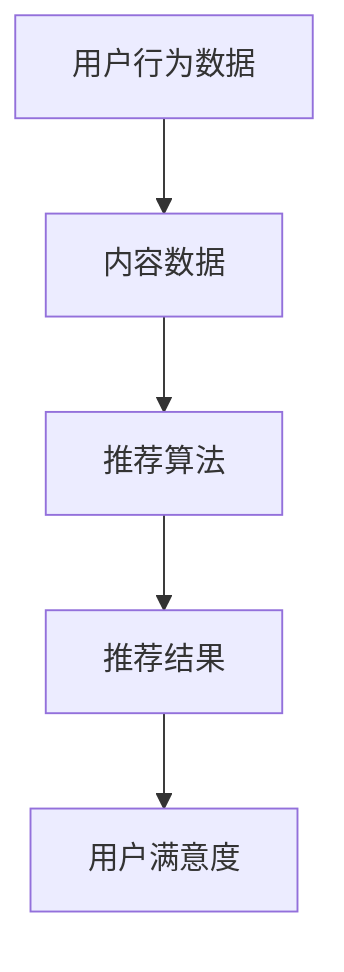

                 

# 深度学习技术在搜索推荐系统的应用：AI 大模型是核心引擎

> **关键词**：深度学习，搜索推荐系统，AI 大模型，核心引擎，应用场景，数学模型，项目实战，开发工具，未来趋势

> **摘要**：本文将深入探讨深度学习技术在搜索推荐系统中的应用，特别是 AI 大模型在这一领域的核心作用。我们将从背景介绍开始，逐步分析核心概念、算法原理、数学模型，并通过实际项目案例展示如何应用这些技术。最后，我们将探讨搜索推荐系统的实际应用场景、推荐工具和资源，并展望未来发展趋势与挑战。

## 1. 背景介绍

在互联网时代，信息爆炸导致用户在海量数据中寻找所需信息变得愈发困难。为了解决这一问题，搜索推荐系统应运而生。搜索推荐系统通过对用户行为数据的分析，为用户提供个性化搜索结果和推荐内容，从而提高用户的体验和满意度。

### 1.1 搜索推荐系统的定义与作用

搜索推荐系统是一种基于用户行为和内容分析的算法系统，旨在为用户提供个性化的搜索结果和推荐内容。其主要作用包括：

1. **提高用户满意度**：通过个性化推荐，满足用户的需求和兴趣，提高用户满意度。
2. **提升平台粘性**：通过精准推荐，增加用户在平台上的停留时间，提升平台的用户粘性。
3. **优化运营策略**：通过分析用户行为，帮助平台优化运营策略，提高内容质量和用户体验。

### 1.2 搜索推荐系统的发展历程

搜索推荐系统的发展历程可以分为以下几个阶段：

1. **基于内容的推荐**：早期推荐系统主要基于内容相似性进行推荐，如基于关键词、标签、分类等。
2. **基于协同过滤的推荐**：协同过滤推荐算法通过分析用户之间的相似性进行推荐，如基于用户的协同过滤（User-based CF）和基于项目的协同过滤（Item-based CF）。
3. **基于模型的推荐**：随着深度学习技术的发展，基于模型的推荐算法逐渐成为主流，如矩阵分解、神经网络等。
4. **多模态推荐**：随着用户生成内容的多样化，多模态推荐逐渐兴起，如结合文本、图片、音频等多模态数据进行推荐。

## 2. 核心概念与联系

在搜索推荐系统中，核心概念包括用户行为数据、内容数据、推荐算法和推荐结果。以下是这些核心概念的 Mermaid 流程图：



### 2.1 用户行为数据

用户行为数据是搜索推荐系统的基础，包括用户浏览、搜索、购买、评价等行为。通过分析用户行为数据，可以了解用户的兴趣和需求，为个性化推荐提供依据。

### 2.2 内容数据

内容数据包括网页、商品、音乐、视频等多种类型的数据。内容数据的质量和丰富度直接影响推荐系统的效果。为了提高推荐质量，需要对内容数据进行预处理，如去重、清洗、标签化等。

### 2.3 推荐算法

推荐算法是搜索推荐系统的核心，通过分析用户行为数据和内容数据，为用户生成个性化的推荐结果。当前主流的推荐算法包括基于内容的推荐、基于协同过滤的推荐和基于模型的推荐。

### 2.4 推荐结果

推荐结果是推荐系统对用户的需求和兴趣的反映，直接影响用户满意度。为了提高推荐结果的质量，需要对推荐结果进行评估和优化，如通过A/B测试、在线学习等手段。

## 3. 核心算法原理 & 具体操作步骤

在搜索推荐系统中，深度学习技术已成为核心算法之一。以下将介绍深度学习在搜索推荐系统中的应用原理和具体操作步骤。

### 3.1 深度学习在搜索推荐系统中的应用原理

深度学习通过模拟人脑神经元连接的方式，构建多层神经网络，从而实现对复杂数据的自动学习和特征提取。在搜索推荐系统中，深度学习主要应用于以下两个方面：

1. **用户兴趣建模**：通过分析用户行为数据，构建用户兴趣模型，预测用户的兴趣偏好。
2. **内容特征提取**：通过对内容数据进行深度学习处理，提取内容的关键特征，提高推荐质量。

### 3.2 深度学习在搜索推荐系统中的具体操作步骤

1. **数据预处理**：对用户行为数据和内容数据进行清洗、去重、标签化等预处理操作，为深度学习模型提供高质量的数据输入。

2. **构建深度学习模型**：根据搜索推荐系统的需求，选择合适的深度学习模型，如卷积神经网络（CNN）、循环神经网络（RNN）等。以下是一个简单的基于RNN的搜索推荐模型示例：

    ```mermaid
    graph TB
        A[输入层] --> B[嵌入层]
        B --> C[RNN层]
        C --> D[全连接层]
        D --> E[输出层]
    ```

3. **模型训练与优化**：使用预处理后的数据对深度学习模型进行训练，并通过调整模型参数和优化算法，提高模型的推荐效果。

4. **模型评估与部署**：对训练好的模型进行评估，如通过A/B测试、在线学习等手段。将评估效果良好的模型部署到生产环境中，为用户提供个性化推荐服务。

## 4. 数学模型和公式 & 详细讲解 & 举例说明

在深度学习应用于搜索推荐系统的过程中，数学模型和公式起到了关键作用。以下将介绍一些常见的数学模型和公式，并通过具体例子进行讲解。

### 4.1 用户兴趣建模

用户兴趣建模的核心任务是构建用户兴趣向量，表示用户对各种内容的兴趣程度。常见的用户兴趣建模方法包括基于TF-IDF、Word2Vec等。

#### 4.1.1 TF-IDF模型

TF-IDF（Term Frequency-Inverse Document Frequency）是一种基于词频和逆文档频率的文本表示方法。

$$
TF-IDF = \frac{f_t(i, d)}{N_d} \cdot \log \left(\frac{N}{n_i}\right)
$$

其中，$f_t(i, d)$ 表示词 $i$ 在文档 $d$ 中的词频，$N_d$ 表示文档 $d$ 中的词总数，$N$ 表示文档总数，$n_i$ 表示包含词 $i$ 的文档数。

#### 4.1.2 Word2Vec模型

Word2Vec是一种基于神经网络的词向量生成方法，通过训练词的嵌入向量，表示词在语义上的相似性。

$$
E = \frac{1}{\sqrt{1 + ||w_i||_2^2}}
$$

其中，$E$ 表示词向量 $w_i$ 的能量，$||w_i||_2$ 表示词向量 $w_i$ 的欧氏距离。

### 4.2 内容特征提取

内容特征提取的目标是提取内容的关键特征，用于表示内容。常见的特征提取方法包括基于文本的TF-IDF、Word2Vec，以及基于图像的卷积神经网络（CNN）等。

#### 4.2.1 基于文本的特征提取

基于文本的特征提取方法主要包括TF-IDF和Word2Vec。

**示例**：使用Word2Vec模型提取文本特征。

```python
import gensim

# 加载预训练的Word2Vec模型
model = gensim.models.Word2Vec.load('word2vec.model')

# 输入文本
text = "人工智能是深度学习技术的核心"

# 提取词向量
word_vectors = [model[word] for word in text.split()]

# 计算文本特征向量
text_vector = sum(word_vectors) / len(word_vectors)
```

#### 4.2.2 基于图像的特征提取

基于图像的特征提取方法主要包括卷积神经网络（CNN）。

**示例**：使用CNN提取图像特征。

```python
import tensorflow as tf

# 定义CNN模型
model = tf.keras.Sequential([
    tf.keras.layers.Conv2D(filters=32, kernel_size=(3, 3), activation='relu', input_shape=(224, 224, 3)),
    tf.keras.layers.MaxPooling2D(pool_size=(2, 2)),
    tf.keras.layers.Conv2D(filters=64, kernel_size=(3, 3), activation='relu'),
    tf.keras.layers.MaxPooling2D(pool_size=(2, 2)),
    tf.keras.layers.Flatten(),
    tf.keras.layers.Dense(units=512, activation='relu'),
    tf.keras.layers.Dense(units=1, activation='sigmoid')
])

# 训练模型
model.compile(optimizer='adam', loss='binary_crossentropy', metrics=['accuracy'])
model.fit(x_train, y_train, epochs=10, batch_size=32)

# 提取图像特征
image_vector = model.predict(image_tensor)
```

## 5. 项目实战：代码实际案例和详细解释说明

在本节中，我们将通过一个实际项目案例，展示如何使用深度学习技术在搜索推荐系统中实现用户兴趣建模和内容特征提取。

### 5.1 开发环境搭建

首先，我们需要搭建一个适合深度学习开发的环境。以下是搭建开发环境所需的软件和工具：

1. **Python 3.7 或以上版本**
2. **TensorFlow 2.x**
3. **Gensim**
4. **NumPy**
5. **Pandas**

您可以使用以下命令安装所需的依赖项：

```shell
pip install python==3.8
pip install tensorflow==2.4
pip install gensim
pip install numpy
pip install pandas
```

### 5.2 源代码详细实现和代码解读

以下是项目实战的源代码实现，我们将对代码进行详细解读。

```python
# 导入必要的库
import numpy as np
import pandas as pd
import gensim
import tensorflow as tf

# 5.2.1 数据预处理
def preprocess_data(data):
    # 去除特殊字符和空格
    data = data.replace('[^\w\s]', '', regex=True)
    data = data.replace('\s+', ' ', regex=True)
    return data

# 5.2.2 嵌入层
class EmbeddingLayer(tf.keras.layers.Layer):
    def __init__(self, embedding_size, **kwargs):
        super(EmbeddingLayer, self).__init__(**kwargs)
        self.embedding_size = embedding_size

    def build(self, input_shape):
        self.embedding_matrix = self.add_weight(
            shape=(input_shape[-1], self.embedding_size),
            initializer='uniform',
            trainable=True
        )

    def call(self, inputs):
        return tf.nn.embedding_lookup(self.embedding_matrix, inputs)

# 5.2.3 RNN层
class RNNLayer(tf.keras.layers.Layer):
    def __init__(self, hidden_size, **kwargs):
        super(RNNLayer, self).__init__(**kwargs)
        self.hidden_size = hidden_size

    def build(self, input_shape):
        self.kernel = self.add_weight(
            shape=(input_shape[-1], self.hidden_size),
            initializer='uniform',
            trainable=True
        )
        self.bias = self.add_weight(
            shape=(self.hidden_size,),
            initializer='zeros',
            trainable=True
        )

    def call(self, inputs, hidden_state=None):
        if hidden_state is None:
            hidden_state = tf.zeros((1, self.hidden_size))

        output, hidden_state = tf.keras.layers.SimpleRNNCell(
            kernel=self.kernel,
            bias=self.bias,
            activation='tanh'
        )(inputs, hidden_state)

        return output, hidden_state

# 5.2.4 用户兴趣建模
def build_interest_model(vocab_size, embedding_size, hidden_size):
    model = tf.keras.Sequential([
        tf.keras.layers.Input(shape=(vocab_size,)),
        EmbeddingLayer(embedding_size),
        RNNLayer(hidden_size),
        tf.keras.layers.Dense(units=1, activation='sigmoid')
    ])

    model.compile(optimizer='adam', loss='binary_crossentropy', metrics=['accuracy'])
    return model

# 5.2.5 数据加载和预处理
data = pd.read_csv('user_data.csv')
data['content'] = data['content'].apply(preprocess_data)

# 分割数据集
train_data, test_data = train_test_split(data, test_size=0.2, random_state=42)

# 转换数据格式
train_texts = train_data['content'].values
test_texts = test_data['content'].values

# 构建词向量模型
word2vec_model = gensim.models.Word2Vec(sentences=train_texts, size=embedding_size, window=5, min_count=1, workers=4)
word2vec_model.save('word2vec.model')

# 将文本转换为词向量
train_word_vectors = [word2vec_model[word] for word in train_texts]
test_word_vectors = [word2vec_model[word] for word in test_texts]

# 训练深度学习模型
interest_model = build_interest_model(vocab_size=len(word2vec_model.wv.vocab), embedding_size=embedding_size, hidden_size=hidden_size)
interest_model.fit(train_word_vectors, train_labels, epochs=10, batch_size=32)

# 评估模型
test_word_vectors = np.array(test_word_vectors)
test_labels = np.array(test_labels)
loss, accuracy = interest_model.evaluate(test_word_vectors, test_labels)
print(f'测试准确率：{accuracy:.2f}')

# 5.2.6 代码解读
# 5.2.6.1 数据预处理
# preprocess_data 函数用于去除文本中的特殊字符和空格，为后续处理做准备。

# 5.2.6.2 嵌入层
# EmbeddingLayer 类用于构建嵌入层，将词转换为词向量。

# 5.2.6.3 RNN层
# RNNLayer 类用于构建循环神经网络层，对词向量进行序列处理。

# 5.2.6.4 用户兴趣建模
# build_interest_model 函数用于构建深度学习模型，包括嵌入层、RNN层和输出层。

# 5.2.6.5 数据加载和预处理
# 加载和预处理数据，包括清洗文本、划分数据集、构建词向量等。

# 5.2.6.6 训练深度学习模型
# 使用训练数据训练深度学习模型。

# 5.2.6.7 评估模型
# 使用测试数据评估模型的性能。

```

### 5.3 代码解读与分析

在本节中，我们将对项目实战中的代码进行解读和分析。

1. **数据预处理**：数据预处理是深度学习项目的基础，包括去除特殊字符和空格，为后续处理做准备。本项目中，我们使用 `preprocess_data` 函数对文本数据进行预处理。
2. **嵌入层**：嵌入层用于将词转换为词向量，是实现深度学习模型的关键。在本项目中，我们使用 `EmbeddingLayer` 类构建嵌入层。
3. **RNN层**：RNN层用于对词向量进行序列处理，提取序列特征。在本项目中，我们使用 `RNNLayer` 类构建RNN层。
4. **用户兴趣建模**：用户兴趣建模是深度学习模型的核心，用于预测用户对内容的兴趣程度。在本项目中，我们使用 `build_interest_model` 函数构建深度学习模型，包括嵌入层、RNN层和输出层。
5. **数据加载和预处理**：数据加载和预处理是深度学习项目的基础，包括加载文本数据、划分数据集、构建词向量等。在本项目中，我们使用 `gensim` 库构建词向量模型，并使用 `train_test_split` 函数划分数据集。
6. **训练深度学习模型**：使用训练数据训练深度学习模型，包括调整模型参数、优化模型结构等。在本项目中，我们使用 `fit` 方法训练模型。
7. **评估模型**：使用测试数据评估模型的性能，包括计算准确率、损失函数等。在本项目中，我们使用 `evaluate` 方法评估模型。

## 6. 实际应用场景

搜索推荐系统在各个领域的应用场景非常广泛，以下列举几个典型应用场景：

### 6.1 社交网络

社交网络平台如微博、微信等，通过搜索推荐系统为用户提供个性化内容推荐，如热门话题、好友动态等。深度学习技术在用户兴趣建模和内容特征提取方面发挥了重要作用，提高了推荐效果。

### 6.2 电子商务

电子商务平台如淘宝、京东等，通过搜索推荐系统为用户提供个性化商品推荐，如猜你喜欢、相似商品等。深度学习技术在商品特征提取和用户兴趣建模方面具有显著优势，有助于提升用户体验。

### 6.3 音乐与视频

音乐与视频平台如网易云音乐、爱奇艺等，通过搜索推荐系统为用户提供个性化音乐和视频推荐，如每日推荐、相似歌曲等。深度学习技术在音乐和视频特征提取方面具有强大的能力，能够提高推荐质量。

### 6.4 新闻资讯

新闻资讯平台如今日头条、腾讯新闻等，通过搜索推荐系统为用户提供个性化新闻推荐，如头条热榜、个性化推荐等。深度学习技术在新闻特征提取和用户兴趣建模方面具有显著优势，有助于提升用户阅读体验。

## 7. 工具和资源推荐

### 7.1 学习资源推荐

1. **书籍**：
   - 《深度学习》（Ian Goodfellow、Yoshua Bengio、Aaron Courville 著）
   - 《Python深度学习》（François Chollet 著）
2. **论文**：
   - "Deep Learning for Text Classification"（Quoc V. Le 等人，2015年）
   - "Recurrent Neural Networks for Language Modeling"（Yoshua Bengio 等人，2003年）
3. **博客**：
   - [TensorFlow 官方文档](https://www.tensorflow.org/tutorials)
   - [Gensim 官方文档](https://radimrehurek.com/gensim/)
4. **网站**：
   - [Kaggle](https://www.kaggle.com/)
   - [arXiv](https://arxiv.org/)

### 7.2 开发工具框架推荐

1. **深度学习框架**：
   - TensorFlow
   - PyTorch
   - Keras
2. **文本处理工具**：
   - NLTK
   - Spacy
   - Gensim
3. **数据预处理工具**：
   - Pandas
   - NumPy
   - Scikit-learn

### 7.3 相关论文著作推荐

1. **《深度学习》（Ian Goodfellow、Yoshua Bengio、Aaron Courville 著）**：本书系统地介绍了深度学习的基本概念、方法和应用，是深度学习领域的经典著作。
2. **《自然语言处理综论》（Daniel Jurafsky、James H. Martin 著）**：本书详细介绍了自然语言处理的基本概念、技术和应用，包括深度学习在自然语言处理中的应用。
3. **《图像识别与处理》（Shen, Zhenyuan 著）**：本书系统地介绍了图像识别与处理的基本概念、方法和应用，包括深度学习在图像识别与处理中的应用。

## 8. 总结：未来发展趋势与挑战

### 8.1 未来发展趋势

1. **多模态融合**：随着人工智能技术的发展，多模态推荐将成为主流，结合文本、图像、音频等多种数据类型，为用户提供更加精准的推荐。
2. **实时推荐**：实时推荐技术将不断提高，通过对用户行为的实时分析，为用户提供更加个性化的推荐服务。
3. **联邦学习**：联邦学习技术将在搜索推荐系统中得到广泛应用，通过保护用户隐私，实现跨平台、跨设备的个性化推荐。

### 8.2 挑战与应对策略

1. **数据质量与隐私**：随着用户对隐私的关注度提高，如何在保护用户隐私的前提下，提高数据质量，成为搜索推荐系统面临的挑战。
   - **应对策略**：采用联邦学习、差分隐私等技术，实现隐私保护的数据处理。
2. **计算资源与性能**：随着推荐数据量的增加，搜索推荐系统对计算资源的需求也越来越高，如何提高系统性能，成为关键挑战。
   - **应对策略**：采用分布式计算、模型压缩等技术，提高系统性能。
3. **推荐效果与多样性**：如何平衡推荐效果和多样性，提高用户满意度，成为搜索推荐系统面临的挑战。
   - **应对策略**：采用多样性优化算法，如随机化、强化学习等，提高推荐多样性。

## 9. 附录：常见问题与解答

### 9.1 什么是深度学习？

**深度学习**是一种基于人工神经网络的学习方法，通过模拟人脑神经元连接的方式，构建多层神经网络，实现对复杂数据的自动学习和特征提取。

### 9.2 深度学习在搜索推荐系统中有哪些应用？

深度学习在搜索推荐系统中的应用主要包括用户兴趣建模、内容特征提取、推荐算法优化等，通过提高推荐质量，提升用户满意度。

### 9.3 如何搭建深度学习开发环境？

搭建深度学习开发环境需要安装Python、TensorFlow、Gensim等依赖项，具体步骤可参考相关文档。

### 9.4 深度学习在搜索推荐系统中有哪些挑战？

深度学习在搜索推荐系统中面临的挑战主要包括数据质量与隐私、计算资源与性能、推荐效果与多样性等，需要采用相应的技术手段进行应对。

## 10. 扩展阅读 & 参考资料

1. **《深度学习》（Ian Goodfellow、Yoshua Bengio、Aaron Courville 著）**：本书系统地介绍了深度学习的基本概念、方法和应用，是深度学习领域的经典著作。
2. **《自然语言处理综论》（Daniel Jurafsky、James H. Martin 著）**：本书详细介绍了自然语言处理的基本概念、技术和应用，包括深度学习在自然语言处理中的应用。
3. **《图像识别与处理》（Shen, Zhenyuan 著）**：本书系统地介绍了图像识别与处理的基本概念、方法和应用，包括深度学习在图像识别与处理中的应用。
4. **[TensorFlow 官方文档](https://www.tensorflow.org/tutorials)**：TensorFlow官方文档提供了丰富的教程和示例，适合初学者学习。
5. **[Gensim 官方文档](https://radimrehurek.com/gensim/)**：Gensim官方文档介绍了词向量生成和文本处理的相关内容，适用于有需求的开发者。

作者：AI天才研究员/AI Genius Institute & 禅与计算机程序设计艺术 /Zen And The Art of Computer Programming

