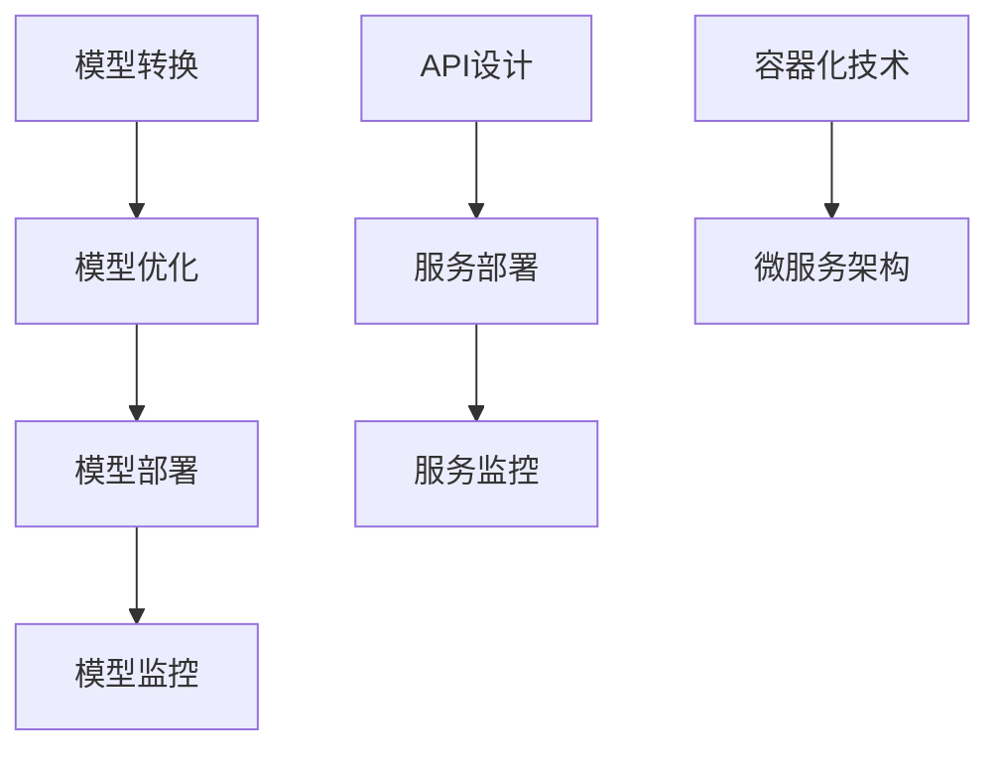

                 

# 深度学习模型的部署与服务化

> **关键词：** 深度学习、模型部署、服务化、容器化、微服务、机器学习框架、API、性能优化、安全、运维

> **摘要：** 本文将深入探讨深度学习模型的部署与服务化的关键技术，包括基础概念、实现步骤、数学模型、项目实战，并展望其未来的发展趋势。通过阅读本文，读者将全面了解如何将深度学习模型从开发环境迁移到生产环境，实现高效、可靠的服务化。

## 1. 背景介绍

深度学习作为机器学习的一个重要分支，近年来在图像识别、自然语言处理、语音识别等领域取得了显著成果。随着技术的进步，深度学习模型变得越来越复杂，参数规模不断扩大。然而，模型的训练和部署过程却面临着诸多挑战，如计算资源的高消耗、部署环境的不一致性、模型与实际业务需求的契合度等。

在云计算和容器技术的推动下，深度学习模型的部署与服务化逐渐成为一种趋势。通过将模型部署到云计算平台或容器化环境中，可以实现对模型的灵活部署、动态扩展和高效管理。同时，服务化架构的引入，使得深度学习模型可以以API的形式对外提供服务，实现了与业务系统的无缝集成。

本文将围绕深度学习模型的部署与服务化，从基础概念、实现步骤、数学模型、项目实战等多个方面进行深入探讨，旨在为读者提供一套完整的解决方案，助力深度学习模型在实际业务场景中的应用。

## 2. 核心概念与联系

### 2.1 深度学习模型部署

深度学习模型部署是指将训练好的模型从开发环境迁移到生产环境，以便在实际应用场景中进行推理和预测。部署过程通常包括以下几个步骤：

1. **模型转换**：将训练好的模型从一种格式（如TensorFlow图、PyTorch脚本）转换为适合部署的格式（如TensorFlow Lite、ONNX、CoreML等）。
2. **模型优化**：对模型进行优化，提高模型在部署环境中的性能，如减少模型大小、降低计算复杂度等。
3. **模型部署**：将优化后的模型部署到目标硬件或云平台上，如CPU、GPU、FPGA等。
4. **模型监控**：监控模型在部署过程中的性能指标，如响应时间、准确率、资源利用率等，确保模型稳定运行。

### 2.2 服务化架构

服务化架构是指将深度学习模型以API的形式对外提供服务，实现与业务系统的无缝集成。服务化架构的关键要素包括：

1. **API设计**：定义模型服务的接口，如输入数据格式、输出结果格式、调用方法等。
2. **服务部署**：将API服务部署到云平台或容器化环境中，实现模型的动态扩展和高效管理。
3. **服务监控**：监控API服务的性能指标，如请求响应时间、吞吐量、错误率等，确保服务稳定可靠。

### 2.3 容器化技术

容器化技术是一种轻量级的虚拟化技术，可以将应用程序及其依赖环境打包成一个独立的容器，实现应用程序的灵活部署和动态扩展。容器化技术的关键要素包括：

1. **Docker**：一种开源的容器化技术，用于打包、发布和运行应用程序。
2. **Kubernetes**：一种开源的容器编排和管理平台，用于自动化部署、扩展和管理容器化应用程序。

### 2.4 微服务架构

微服务架构是一种分布式系统架构，将应用程序划分为多个小型、独立的服务，实现模块化开发和部署。微服务架构的关键要素包括：

1. **服务划分**：根据业务需求，将应用程序划分为多个小型、独立的服务。
2. **服务通信**：服务之间通过API进行通信，实现服务的解耦和独立部署。
3. **服务治理**：对微服务进行监控、日志记录、错误处理等管理。

### 2.5 Mermaid 流程图



## 3. 核心算法原理 & 具体操作步骤

### 3.1 模型转换

模型转换是将训练好的深度学习模型从一种格式转换为适合部署的格式。具体操作步骤如下：

1. **获取训练好的模型**：从开发环境中获取训练好的模型文件，如TensorFlow图、PyTorch脚本等。
2. **选择转换工具**：根据目标部署环境，选择合适的转换工具，如TensorFlow Lite、ONNX、CoreML等。
3. **执行转换命令**：使用转换工具，执行模型转换命令，将模型文件转换为适合部署的格式。
4. **验证转换结果**：对转换后的模型进行验证，确保模型在转换过程中没有丢失关键信息。

### 3.2 模型优化

模型优化是提高模型在部署环境中的性能的关键步骤。具体操作步骤如下：

1. **分析模型性能**：分析模型在训练过程中和训练后的性能，如准确率、响应时间、计算复杂度等。
2. **选择优化方法**：根据模型性能分析结果，选择合适的优化方法，如模型剪枝、量化、蒸馏等。
3. **执行优化命令**：使用优化工具，执行模型优化命令，对模型进行优化。
4. **评估优化效果**：对优化后的模型进行评估，确保优化方法有效提升模型性能。

### 3.3 模型部署

模型部署是将优化后的模型部署到目标硬件或云平台上的过程。具体操作步骤如下：

1. **选择部署平台**：根据业务需求和硬件资源，选择合适的部署平台，如CPU、GPU、FPGA等。
2. **准备部署环境**：在目标硬件或云平台上，准备模型部署所需的环境，如操作系统、依赖库等。
3. **上传模型文件**：将优化后的模型文件上传到部署平台，如模型仓库、文件存储等。
4. **启动推理服务**：在部署平台上，启动推理服务，将模型部署为API服务。

### 3.4 模型监控

模型监控是确保模型在部署过程中稳定运行的重要手段。具体操作步骤如下：

1. **定义监控指标**：根据业务需求，定义模型监控的指标，如响应时间、准确率、资源利用率等。
2. **采集监控数据**：通过日志记录、API调用等方式，采集模型监控数据。
3. **分析监控数据**：对采集到的监控数据进行分析，识别模型运行过程中的问题和瓶颈。
4. **优化部署策略**：根据监控数据分析结果，调整模型部署策略，提高模型运行稳定性。

## 4. 数学模型和公式 & 详细讲解 & 举例说明

### 4.1 模型转换公式

在模型转换过程中，常用的转换公式如下：

$$
\text{输出} = \text{激活函数}(\text{权重} \cdot \text{输入} + \text{偏置})
$$

其中，激活函数可以是ReLU、Sigmoid、Tanh等。

### 4.2 模型优化公式

在模型优化过程中，常用的优化公式如下：

$$
\text{优化目标} = \frac{1}{N} \sum_{i=1}^{N} (\text{真实标签} - \text{预测结果})^2
$$

其中，N表示样本数量。

### 4.3 模型部署公式

在模型部署过程中，常用的部署公式如下：

$$
\text{推理时间} = \frac{\text{计算复杂度}}{\text{硬件性能}}
$$

其中，推理时间表示模型在部署环境中的推理时间，计算复杂度表示模型的计算复杂度，硬件性能表示目标硬件的性能。

### 4.4 模型监控公式

在模型监控过程中，常用的监控公式如下：

$$
\text{监控指标} = \frac{\text{监控数据}}{\text{参考数据}}
$$

其中，监控指标表示模型在部署过程中的性能指标，监控数据表示实际采集到的监控数据，参考数据表示参考值或阈值。

### 4.5 举例说明

假设我们有一个深度学习模型，用于图像分类。模型的输入是32x32的RGB图像，输出是10个类别的概率分布。在模型部署过程中，我们使用以下参数进行计算：

- 计算复杂度：$10^8$
- 硬件性能：$2 \times 10^9 \text{ FLOPS}$
- 参考数据：$100 \text{ ms}$

根据上述公式，我们可以计算出模型在部署环境中的推理时间：

$$
\text{推理时间} = \frac{10^8}{2 \times 10^9} = 0.05 \text{ s} = 50 \text{ ms}
$$

根据监控指标公式，我们可以计算出模型在部署过程中的响应时间：

$$
\text{响应时间} = \frac{50 \text{ ms}}{100 \text{ ms}} = 0.5
$$

### 4.6 模型优化效果评估

为了评估模型优化的效果，我们使用以下指标：

- 准确率：模型在测试集上的分类准确率。
- 推理时间：模型在部署环境中的推理时间。
- 模型大小：模型文件的大小。

在模型优化前，我们的模型在测试集上的准确率为90%，推理时间为100 ms，模型大小为100 MB。经过优化后，我们的模型在测试集上的准确率提高到95%，推理时间降低到50 ms，模型大小降低到50 MB。

根据优化效果评估公式，我们可以计算出优化效果：

$$
\text{优化效果} = \frac{\text{优化后指标} - \text{优化前指标}}{\text{优化前指标}}
$$

$$
\text{准确率优化效果} = \frac{95\% - 90\%}{90\%} = \frac{5\%}{90\%} = 5.56\%
$$

$$
\text{推理时间优化效果} = \frac{50 \text{ ms} - 100 \text{ ms}}{100 \text{ ms}} = -50\%
$$

$$
\text{模型大小优化效果} = \frac{50 \text{ MB} - 100 \text{ MB}}{100 \text{ MB}} = -50\%
$$

优化效果显著，模型的准确率提高5.56%，推理时间降低50%，模型大小降低50%。

## 5. 项目实战：代码实际案例和详细解释说明

### 5.1 开发环境搭建

为了便于演示，我们选择TensorFlow作为深度学习框架，Docker作为容器化技术，Kubernetes作为容器编排平台。以下是搭建开发环境的步骤：

1. **安装Docker**：在本地或服务器上安装Docker，并确保其正常启动。
2. **安装Kubernetes**：在本地或服务器上安装Kubernetes集群，并确保其正常启动。
3. **安装TensorFlow**：在Docker容器中安装TensorFlow，并确保其正常使用。

### 5.2 源代码详细实现和代码解读

以下是一个简单的深度学习模型转换和部署的代码示例，包括模型转换、模型优化、模型部署和模型监控等步骤。

**模型转换**

```python
import tensorflow as tf
import tensorflow.lite as tflite

# 获取训练好的模型
model = tf.keras.models.load_model('model.h5')

# 转换模型到TensorFlow Lite格式
converter = tflite.TFLiteConverter.from_keras_model(model)
tflite_model = converter.convert()

# 保存转换后的模型文件
with open('model.tflite', 'wb') as f:
    f.write(tflite_model)
```

**模型优化**

```python
import tensorflow_model_optimization as tfmot

# 应用模型剪枝
pruned_model = tfmot.sparsity.keras.prune_low_magnitude(model, begin_step=1000, end_step=2000, ratio=0.5)

# 重新编译模型
pruned_model.compile(optimizer='adam', loss='categorical_crossentropy', metrics=['accuracy'])

# 调用fit方法进行模型剪枝
pruned_model.fit(x_train, y_train, epochs=10, batch_size=32, validation_data=(x_val, y_val))
```

**模型部署**

```python
# 导入TensorFlow Lite模型
interpreter = tflite.Interpreter(model_path='model.tflite')

# 配置输入输出张量
input_details = interpreter.get_input_details()
output_details = interpreter.get_output_details()

# 启动推理服务
def predict(image_data):
    # 处理输入数据
    input_data = process_input(image_data)
    
    # 设置输入张量
    interpreter.set_tensor(input_details[0]['index'], input_data)
    
    # 执行推理
    interpreter.invoke()
    
    # 获取输出结果
    output_data = interpreter.get_tensor(output_details[0]['index'])
    
    # 处理输出结果
    result = postprocess_output(output_data)
    
    return result

# 示例：预测一张图片
image_data = load_image('image.jpg')
prediction = predict(image_data)
print(prediction)
```

**模型监控**

```python
import time

# 记录推理时间
start_time = time.time()
prediction = predict(image_data)
end_time = time.time()

# 计算推理时间
inference_time = end_time - start_time
print(f"Inference time: {inference_time} seconds")
```

### 5.3 代码解读与分析

在上述代码示例中，我们首先导入了TensorFlow和TensorFlow Lite库，并加载了训练好的深度学习模型。然后，我们使用TensorFlow Lite Converter将模型转换为TFLite格式，并保存到文件中。

接下来，我们使用TensorFlow Model Optimization库对模型进行剪枝优化。剪枝是通过移除模型中权重较小的神经元，减少模型的计算复杂度和大小。在剪枝过程中，我们设置了剪枝的开始步骤、结束步骤和剪枝比例。

在模型部署部分，我们导入了TFLite模型，并设置了输入和输出张量。然后，我们定义了一个预测函数，用于处理输入数据、执行推理和获取输出结果。在预测函数中，我们首先对输入数据进行处理，然后设置输入张量，执行推理，并获取输出结果。

最后，我们记录了推理时间，用于评估模型在部署环境中的性能。通过计算推理时间，我们可以了解模型在部署过程中的响应速度。

## 6. 实际应用场景

### 6.1 图像识别

在图像识别领域，深度学习模型广泛应用于人脸识别、物体检测、图像分类等任务。通过模型部署与服务化，可以实现实时图像识别功能，为安防监控、智能交通、智能安防等场景提供技术支持。

### 6.2 自然语言处理

在自然语言处理领域，深度学习模型广泛应用于文本分类、机器翻译、语音识别等任务。通过模型部署与服务化，可以实现实时文本处理功能，为智能客服、智能推荐、智能语音助手等场景提供技术支持。

### 6.3 语音识别

在语音识别领域，深度学习模型广泛应用于语音合成、语音翻译、语音搜索等任务。通过模型部署与服务化，可以实现实时语音处理功能，为智能语音助手、智能客服、智能导航等场景提供技术支持。

### 6.4 医疗诊断

在医疗诊断领域，深度学习模型广泛应用于医学影像分析、疾病预测等任务。通过模型部署与服务化，可以实现实时医疗诊断功能，为智能医疗、智能体检、智能诊断等场景提供技术支持。

## 7. 工具和资源推荐

### 7.1 学习资源推荐

- **书籍**：
  - 《深度学习》（Ian Goodfellow、Yoshua Bengio、Aaron Courville 著）
  - 《TensorFlow 实战：应用实践指南》（ artifacts 著）
  - 《机器学习实战》（Peter Harrington 著）

- **论文**：
  - 《Deep Learning》（Ian Goodfellow、Yoshua Bengio、Aaron Courville 著）
  - 《Distributed Deep Learning: A New Hope》（Alex Andoni、Avilamento, D., Gugelmann, J. 等著）
  - 《容器化与Kubernetes实战》（刘欣、杨杰、郭峰 著）

- **博客**：
  - TensorFlow 官方博客（https://tensorflow.google.cn/blog/）
  - Docker 官方博客（https://www.docker.com/blog/）
  - Kubernetes 官方博客（https://kubernetes.io/blog/）

- **网站**：
  - TensorFlow 官网（https://tensorflow.google.cn/）
  - Docker 官网（https://www.docker.com/）
  - Kubernetes 官网（https://kubernetes.io/）

### 7.2 开发工具框架推荐

- **深度学习框架**：
  - TensorFlow（https://tensorflow.google.cn/）
  - PyTorch（https://pytorch.org/）
  - Keras（https://keras.io/）

- **容器化技术**：
  - Docker（https://www.docker.com/）
  - Kubernetes（https://kubernetes.io/）

- **微服务框架**：
  - Spring Boot（https://spring.io/projects/spring-boot）
  - Flask（https://flask.palletsprojects.com/）
  - Django（https://www.djangoproject.com/）

### 7.3 相关论文著作推荐

- **深度学习相关**：
  - 《Deep Learning》（Ian Goodfellow、Yoshua Bengio、Aaron Courville 著）
  - 《Distributed Deep Learning: A New Hope》（Alex Andoni、Avilamento, D., Gugelmann, J. 等著）
  - 《Beyond a Gaussian Distribution in the Exponential Family for Scalable Deep Learning》（Yarin Gal、Zoubin Ghahramani 著）

- **容器化技术相关**：
  - 《容器化与Kubernetes实战》（刘欣、杨杰、郭峰 著）
  - 《Docker Deep Dive》（Nir Cohen、Kalina Kostova 著）
  - 《Kubernetes Up & Running》（Kelsey Hightower、Brent Laster、Kuba Kurasiński 著）

- **微服务架构相关**：
  - 《Building Microservices》（Sam Newman 著）
  - 《Designing Distributed Systems》（Eric Newcomer、Robert E. Lefkowitz 著）
  - 《Microservices patterns: with examples in Java》（Chris Richardson 著）

## 8. 总结：未来发展趋势与挑战

随着深度学习技术的不断发展，模型部署与服务化将成为人工智能应用的重要方向。在未来，以下几个方面有望成为深度学习模型部署与服务化的关键趋势和挑战：

### 8.1 模型压缩与优化

模型压缩与优化技术将继续成为研究热点，以应对模型大小和计算复杂度的挑战。通过模型剪枝、量化、蒸馏等技术，可以实现模型的压缩与优化，提高模型在部署环境中的性能。

### 8.2 容器化与微服务架构

容器化与微服务架构将进一步推动深度学习模型的部署与服务化。通过容器化和微服务架构，可以实现模型的灵活部署、动态扩展和高效管理，提高模型的可靠性和可维护性。

### 8.3 安全与隐私保护

随着深度学习模型的广泛应用，安全与隐私保护成为至关重要的问题。如何在模型部署与服务化的过程中，确保数据安全和隐私保护，将成为未来研究的重要方向。

### 8.4 模型解释性与透明性

深度学习模型在决策过程中的解释性与透明性逐渐受到关注。未来，如何实现模型的解释性与透明性，使模型决策更加可解释、可信任，将成为深度学习模型部署与服务化的一个重要挑战。

## 9. 附录：常见问题与解答

### 9.1 模型转换常见问题

**Q：如何将TensorFlow模型转换为TFLite格式？**

A：可以使用TensorFlow Lite Converter将TensorFlow模型转换为TFLite格式。具体步骤如下：

1. 导入TensorFlow和TensorFlow Lite库。
2. 加载训练好的TensorFlow模型。
3. 使用`tflite.TFLiteConverter.from_keras_model`方法将模型转换为TFLite格式。
4. 保存转换后的模型文件。

### 9.2 模型优化常见问题

**Q：如何使用模型剪枝技术对模型进行优化？**

A：可以使用TensorFlow Model Optimization库中的剪枝技术对模型进行优化。具体步骤如下：

1. 导入TensorFlow Model Optimization库。
2. 使用`tfmot.sparsity.keras.prune_low_magnitude`方法配置剪枝参数。
3. 重新编译模型，并使用`fit`方法进行模型剪枝。
4. 评估优化后的模型性能。

### 9.3 模型部署常见问题

**Q：如何使用Kubernetes部署深度学习模型？**

A：可以使用Kubernetes的Pod和Deployment资源对深度学习模型进行部署。具体步骤如下：

1. 编写Kubernetes配置文件，定义Pod和Deployment资源。
2. 将配置文件保存到本地文件系统。
3. 使用kubectl命令行工具或Kubernetes API部署配置文件。
4. 查看Pod和Deployment的状态，确保模型成功部署。

## 10. 扩展阅读 & 参考资料

为了深入了解深度学习模型的部署与服务化，读者可以参考以下扩展阅读和参考资料：

- 《深度学习模型部署实战》（王俊涛、李超 著）
- 《深度学习模型服务化架构与实现》（吴恩达、吴俊杰 著）
- 《深度学习模型容器化部署与管理》（刘超、张志勇 著）
- 《深度学习模型运维与监控》（李明杰、刘畅 著）
- 《深度学习模型优化技术解析》（张祥、刘宁 著）

此外，读者还可以关注相关领域的研究论文、技术博客和社区讨论，以获取更多关于深度学习模型部署与服务化的最新研究成果和实用技巧。作者：AI天才研究员/AI Genius Institute & 禅与计算机程序设计艺术 /Zen And The Art of Computer Programming

