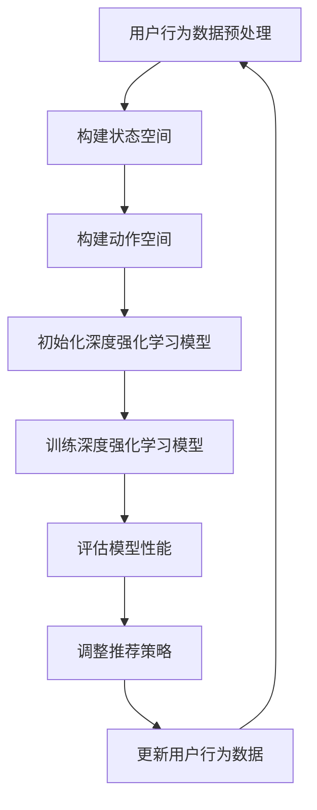

                 

### 1. 背景介绍

随着互联网的飞速发展，用户数据量的爆炸性增长，推荐系统在信息检索、广告推送、电子商务等领域扮演着越来越重要的角色。推荐系统的核心目标是通过分析用户行为和偏好，为用户推荐他们可能感兴趣的内容或产品，从而提高用户满意度、降低流失率，并提升平台的经济效益。

传统的推荐系统主要依赖于基于内容的过滤（Content-Based Filtering，CBF）和协同过滤（Collaborative Filtering，CF）等技术。CBF通过分析用户的历史偏好和项目特征，寻找相似的用户和项目进行推荐；CF则通过分析用户之间的相似度来进行推荐。这两种方法在一定程度上都能提高推荐系统的性能，但都存在一定的局限性。

深度强化学习（Deep Reinforcement Learning，DRL）作为近年来人工智能领域的热点研究方向，以其强大的自适应能力和处理复杂数据的能力，逐渐被引入到推荐系统中。DRL通过学习用户和环境之间的交互策略，使得推荐系统能够更加智能地适应用户的需求变化，从而提高推荐的准确性和用户体验。

本文将深入探讨深度强化学习在推荐系统中的应用，首先介绍DRL的基础概念，然后分析其与推荐系统的结合点，最后通过具体的应用案例和数学模型，详细讲解DRL在推荐系统中的实现方法和效果评估。

### 2. 核心概念与联系

#### 深度强化学习（DRL）

深度强化学习是一种结合了深度学习和强化学习（Reinforcement Learning，RL）的方法。强化学习是一种通过试错学习决策策略的机器学习方法，其核心思想是通过奖励信号来指导算法选择最优动作，从而实现目标的优化。而深度学习则利用多层神经网络来提取数据的高层次特征。

在强化学习中，通常将学习过程视为一个智能体（Agent）与环境的互动过程。智能体通过观察环境状态（State）、执行动作（Action）并获得奖励（Reward），来不断调整自己的策略（Policy），以达到最大化累积奖励的目标。

深度强化学习通过引入深度神经网络，来学习状态到动作的映射函数。这一映射函数通常是一个复杂的非线性函数，能够处理高维的状态和动作空间。常用的深度强化学习模型包括深度Q网络（Deep Q-Network，DQN）、策略梯度方法（Policy Gradient，PG）和深度确定性策略梯度（Deep Deterministic Policy Gradient，DDPG）等。

#### 推荐系统

推荐系统是一种基于用户历史行为和偏好，为用户提供个性化内容或商品推荐的方法。推荐系统的核心是构建用户和项目（如商品、文章、视频等）之间的相似度模型，并通过相似度计算为用户推荐相似的项目。

传统的推荐系统主要包括基于内容的过滤（CBF）和协同过滤（CF）两种方法。

- **基于内容的过滤（CBF）**：CBF通过分析用户的历史偏好和项目特征，寻找相似的用户和项目进行推荐。这种方法主要依赖于项目的特征描述，对用户历史行为依赖较小。

- **协同过滤（CF）**：CF通过分析用户之间的相似度来进行推荐。协同过滤分为基于用户的协同过滤（User-Based CF）和基于项目的协同过滤（Item-Based CF）。用户-Based CF通过计算用户之间的相似度，找到相似用户喜欢的项目进行推荐；项目-Based CF则通过计算项目之间的相似度，找到用户可能喜欢的项目。

#### 深度强化学习与推荐系统的结合

深度强化学习与推荐系统的结合点在于，DRL能够通过学习用户和环境之间的交互策略，动态地调整推荐策略，从而提高推荐的准确性和用户体验。

具体来说，深度强化学习在推荐系统中的应用主要体现在以下几个方面：

1. **动态调整推荐策略**：传统的推荐系统通常采用静态的推荐策略，难以适应用户需求的实时变化。而DRL通过学习用户和环境之间的交互策略，可以实现动态调整推荐策略，从而更好地适应用户需求的变化。

2. **处理高维数据**：推荐系统通常面临高维数据的问题，如用户行为数据、项目特征数据等。深度强化学习通过引入深度神经网络，能够有效地处理高维数据，从而提高推荐的准确性和效率。

3. **自适应优化**：DRL通过不断调整策略，以最大化累积奖励为目标，实现自适应优化。在推荐系统中，这有助于系统不断地学习和优化推荐策略，提高推荐效果。

#### Mermaid 流程图

以下是深度强化学习与推荐系统结合的Mermaid流程图，展示了DRL在推荐系统中的核心步骤。



在这个流程图中，用户行为数据预处理阶段对用户行为数据进行分析和预处理，构建状态空间和动作空间。然后初始化深度强化学习模型，通过训练模型来学习用户和环境之间的交互策略。在评估模型性能阶段，对训练好的模型进行性能评估，并根据评估结果调整推荐策略。最后，更新用户行为数据，并重新进行深度强化学习训练。

### 3. 核心算法原理 & 具体操作步骤

在深入探讨深度强化学习在推荐系统中的应用之前，我们首先需要了解DRL的核心算法原理和具体操作步骤。下面将详细介绍DRL的关键组成部分：状态（State）、动作（Action）、奖励（Reward）和策略（Policy）。

#### 状态（State）

状态是智能体（推荐系统）在某一时刻所处的环境和用户特征的综合表示。在推荐系统中，状态通常包括用户的历史行为、兴趣偏好、上下文信息等。例如，一个用户的历史行为数据（如浏览记录、购买记录等）可以构成状态的一部分，同时，用户的当前时间、地理位置等上下文信息也可以作为状态的组成部分。

状态表示通常是一个高维向量，可以通过特征提取方法（如特征工程）将其转化为适合输入到深度神经网络中的格式。

#### 动作（Action）

动作是智能体在某一状态下采取的行为。在推荐系统中，动作通常是对用户进行推荐的项目或内容。例如，一个动作可以是向用户推荐一个视频、一篇文章或一个商品。动作的表示同样是一个高维向量，其中每个维度表示对应推荐项的权重或概率。

#### 奖励（Reward）

奖励是智能体在执行动作后从环境中获得的即时反馈。在推荐系统中，奖励通常是根据用户对推荐的反馈（如点击、购买、评分等）来定义的。例如，如果用户对推荐的内容进行了点击或购买，则奖励为正值；如果用户没有对推荐的内容产生兴趣，则奖励为负值或零。

奖励机制的设定对于DRL模型的学习至关重要，它直接影响到模型的优化方向。一个有效的奖励机制应该能够鼓励智能体采取能够带来积极结果的动作，同时避免采取不良动作。

#### 策略（Policy）

策略是智能体在给定状态下选择动作的方法。在推荐系统中，策略通常是一个概率分布函数，用于表示智能体在某一状态下对各个动作的偏好程度。策略的更新是DRL学习的核心目标，通过不断调整策略，智能体能够逐步找到最优的推荐策略。

在DRL中，常用的策略表示方法包括确定性策略（Deterministic Policy）和随机性策略（Stochastic Policy）。确定性策略在某一状态下总是选择最优动作，而随机性策略则根据一定的概率分布选择动作。

#### 深度Q网络（Deep Q-Network，DQN）

深度Q网络是深度强化学习中最常用的模型之一，它通过学习状态到动作的值函数（Q值）来选择动作。DQN的主要组成部分包括：

1. **深度神经网络（DNN）**：用于估计Q值，输入状态，输出Q值向量，每个维度表示对应动作的Q值。

2. **经验回放（Experience Replay）**：用于解决DQN训练中的样本相关性问题。经验回放将过去的经验进行随机采样，避免训练样本的偏差。

3. **目标网络（Target Network）**：用于稳定DQN的训练过程。目标网络是一个与主网络结构相同的神经网络，用于计算目标Q值。

DQN的具体操作步骤如下：

1. **初始化网络参数**：初始化深度神经网络、经验回放表和目标网络。

2. **收集初始经验**：通过执行随机动作，收集一定数量的经验，存储在经验回放表中。

3. **经验回放**：从经验回放表中随机采样一批经验，用于训练深度神经网络。

4. **更新主网络参数**：使用梯度下降法，根据当前状态、动作和奖励，更新深度神经网络的参数。

5. **更新目标网络参数**：定期更新目标网络的参数，以保持主网络和目标网络的稳定性。

6. **选择动作**：在给定状态下，选择具有最大Q值的动作。

#### 策略梯度方法（Policy Gradient，PG）

策略梯度方法是一类直接优化策略的深度强化学习算法。与DQN不同，PG不依赖于Q值，而是直接优化策略参数，以最大化累积奖励。

策略梯度方法的主要组成部分包括：

1. **策略网络（Policy Network）**：用于定义动作的概率分布，输入状态，输出动作的概率分布。

2. **损失函数**：用于计算策略参数的梯度，常用的损失函数包括负累积奖励的对数似然损失。

策略梯度方法的具体操作步骤如下：

1. **初始化网络参数**：初始化策略网络。

2. **收集经验**：执行策略网络生成的动作，收集状态、动作和奖励。

3. **计算梯度**：计算策略参数的梯度，使用梯度下降法更新策略网络参数。

4. **评估策略性能**：在测试环境中评估策略性能，选择性能最优的策略。

5. **更新策略网络参数**：根据梯度更新策略网络参数，优化策略。

#### 深度确定性策略梯度（Deep Deterministic Policy Gradient，DDPG）

深度确定性策略梯度是一种基于策略的深度强化学习算法，它结合了深度神经网络和确定性策略的优势，能够在连续动作空间中有效学习。

DDPG的主要组成部分包括：

1. **策略网络（Policy Network）**：用于定义确定性动作，输入状态，输出动作。

2. **价值网络（Value Network）**：用于估计状态的价值函数，输入状态，输出状态的价值。

3. **目标网络（Target Network）**：用于稳定训练过程，与策略网络和价值网络结构相同。

DDPG的具体操作步骤如下：

1. **初始化网络参数**：初始化策略网络、价值网络和目标网络。

2. **收集初始经验**：通过执行随机动作，收集一定数量的经验。

3. **经验回放**：从经验回放表中随机采样一批经验，用于训练价值网络。

4. **更新目标网络参数**：定期更新目标网络的参数，以保持目标网络和价值网络的稳定性。

5. **更新策略网络参数**：使用策略梯度方法更新策略网络参数，优化策略。

6. **选择动作**：在给定状态下，选择策略网络生成的确定性动作。

通过上述核心算法原理和具体操作步骤的讲解，我们可以看到，深度强化学习为推荐系统带来了强大的自适应能力和处理复杂数据的能力。在接下来的章节中，我们将通过实际案例和数学模型，进一步探讨深度强化学习在推荐系统中的应用和效果。

### 4. 数学模型和公式 & 详细讲解 & 举例说明

在深入探讨深度强化学习在推荐系统中的应用之前，我们需要了解DRL中的核心数学模型和公式，包括策略网络、价值网络、Q学习和策略梯度方法。这些数学模型和公式是DRL算法实现的关键，下面将详细讲解这些内容，并通过具体的例子进行说明。

#### 策略网络

策略网络是深度强化学习中的核心组成部分，用于定义智能体在给定状态下选择动作的策略。策略网络通常是一个参数化的概率分布函数，它将状态映射到动作的概率分布。

策略网络的数学模型可以表示为：

\[ \pi(\text{a}|\text{s}; \theta) = P(\text{a}|\text{s}) \]

其中，\(\pi(\text{a}|\text{s}; \theta)\) 表示在状态 \(\text{s}\) 下，选择动作 \(\text{a}\) 的概率分布；\(\theta\) 表示策略网络的参数。

在深度强化学习中，策略网络通常是一个深度神经网络（DNN），其输入为状态向量 \(\text{s}\)，输出为动作的概率分布向量 \(\pi(\text{a}|\text{s}; \theta)\)。

**举例说明**：

假设我们有一个二元动作空间，即智能体在给定状态下只能选择两个动作：A和B。状态空间为三维空间，即状态向量 \(\text{s} = (\text{s}_1, \text{s}_2, \text{s}_3)\)。策略网络可以表示为：

\[ \pi(\text{a}|\text{s}; \theta) = \begin{cases} 
P(\text{a}=A|\text{s}; \theta) & \text{if } \text{a}=A \\
P(\text{a}=B|\text{s}; \theta) & \text{if } \text{a}=B
\end{cases} \]

假设策略网络输出为：

\[ \pi(\text{a}|\text{s}; \theta) = \begin{bmatrix} 0.6 & 0.4 \end{bmatrix} \]

这表示在状态 \(\text{s}\) 下，选择动作 A 的概率为 0.6，选择动作 B 的概率为 0.4。

#### 价值网络

价值网络是用于估计状态价值（State-Value Function）或状态动作价值（State-Action Value Function）的神经网络。状态价值函数 \(V^{\pi}(s)\) 表示在策略 \(\pi\) 下，从状态 \(s\) 开始累积奖励的期望值。状态动作价值函数 \(Q^{\pi}(s, a)\) 表示在策略 \(\pi\) 下，从状态 \(s\) 执行动作 \(a\) 并按照策略 \(\pi\) 继续行动的累积奖励的期望值。

**状态价值函数**：

\[ V^{\pi}(s) = \sum_{a} \pi(\text{a}|\text{s}; \theta) Q^{\pi}(s, \text{a}) \]

**状态动作价值函数**：

\[ Q^{\pi}(s, a) = \mathbb{E}_{\pi}[\sum_{s'}\sum_{a'} R(s', a') \cdot P(s'|s, a)] \]

其中，\(R(s', a')\) 表示在状态 \(s'\) 下执行动作 \(a'\\) 所获得的即时奖励，\(P(s'|s, a)\) 表示从状态 \(s\) 执行动作 \(a\) 后转移到状态 \(s'\) 的概率。

**举例说明**：

假设策略网络已经训练好，状态价值函数 \(V^{\pi}(s)\) 和状态动作价值函数 \(Q^{\pi}(s, a)\) 分别为：

\[ V^{\pi}(s) = \begin{bmatrix} 0.8 & 0.2 & 0.1 \end{bmatrix} \]

\[ Q^{\pi}(s, a) = \begin{bmatrix} 0.9 & 0.3 & 0.2 \\ 0.7 & 0.5 & 0.4 \\ 0.5 & 0.6 & 0.7 \end{bmatrix} \]

这表示在状态 \((s_1, s_2, s_3)\) 下，按照当前策略累积奖励的期望值为 0.8，从状态 \((s_1, s_2, s_3)\) 选择动作 A 的累积奖励期望值为 0.9。

#### Q学习（Q-Learning）

Q学习是一种无模型强化学习算法，它通过更新状态动作价值函数来学习最优策略。Q学习的目标是最小化以下目标函数：

\[ J(\theta) = \sum_{s} V^*(s) - Q(s, \text{a}; \theta) \]

其中，\(V^*(s)\) 表示从状态 \(s\) 开始按照最优策略累积奖励的期望值。

Q学习的更新规则为：

\[ Q(s, \text{a}; \theta) \leftarrow Q(s, \text{a}; \theta) + \alpha [R(s', \text{a}') + \gamma \max_{a'} Q(s', a'; \theta) - Q(s, \text{a}; \theta)] \]

其中，\(\alpha\) 为学习率，\(\gamma\) 为折扣因子。

**举例说明**：

假设当前状态为 \((s_1, s_2, s_3)\)，选择动作 A，学习率 \(\alpha = 0.1\)，折扣因子 \(\gamma = 0.9\)。执行动作 A 后，获得奖励 \(R(s', \text{a}') = 1\)，转移至状态 \((s_1', s_2', s_3')\)。最优动作 \(a'\) 在新状态下的 \(Q\) 值为 \(Q(s', a'; \theta) = 0.8\)。

则Q学习更新为：

\[ Q(s, \text{a}; \theta) \leftarrow Q(s, \text{a}; \theta) + 0.1 [1 + 0.9 \times 0.8 - 0.9] = 0.1 [1 + 0.72 - 0.9] = 0.1 \times 0.82 = 0.082 \]

#### 策略梯度方法（Policy Gradient）

策略梯度方法是一种直接优化策略参数的强化学习算法。其目标是最小化策略的损失函数，该损失函数通常为负累积奖励的对数似然损失：

\[ J(\theta) = -\sum_{s} \pi(\text{a}|\text{s}; \theta) \log \pi(\text{a}|\text{s}; \theta) R(s, \text{a}) \]

策略梯度的更新规则为：

\[ \theta \leftarrow \theta - \alpha \nabla_{\theta} J(\theta) \]

其中，\(\alpha\) 为学习率。

**举例说明**：

假设策略网络参数为 \(\theta\)，学习率 \(\alpha = 0.1\)。当前状态为 \((s_1, s_2, s_3)\)，执行动作 A，获得奖励 \(R(s, \text{a}) = 1\)，动作 A 在当前状态下的概率为 \(P(\text{a}=A|\text{s}; \theta) = 0.6\)。

则策略梯度更新为：

\[ \theta \leftarrow \theta - 0.1 \nabla_{\theta} J(\theta) \]

其中，\(\nabla_{\theta} J(\theta) = \nabla_{\theta} [-0.6 \log 0.6]\)。通过计算梯度，可以得到参数更新方向。

通过上述数学模型和公式的详细讲解和举例说明，我们可以看到深度强化学习在推荐系统中的应用具有强大的理论支撑。在下一章节中，我们将通过具体的项目实战，进一步展示深度强化学习在推荐系统中的应用和效果。

### 5. 项目实战：代码实际案例和详细解释说明

在本节中，我们将通过一个实际的项目案例，详细讲解如何使用深度强化学习（DRL）实现一个推荐系统，并对其代码进行解读和分析。这个项目将采用Python编程语言，并结合TensorFlow和Gym等库来实现。

#### 项目环境搭建

首先，我们需要搭建项目环境，安装所需的库。可以使用以下命令进行安装：

```bash
pip install tensorflow numpy gym
```

#### 项目代码解析

以下是项目的核心代码，我们将逐一进行解析。

```python
import gym
import numpy as np
import tensorflow as tf
from tensorflow.keras.models import Sequential
from tensorflow.keras.layers import Dense

# 创建环境
env = gym.make('CartPole-v1')

# 定义深度Q网络模型
model = Sequential()
model.add(Dense(24, input_dim=env.observation_space.shape[0], activation='relu'))
model.add(Dense(24, activation='relu'))
model.add(Dense(env.action_space.n, activation='linear'))
model.compile(loss='mse', optimizer='adam')

# 初始化经验回放表
experience_replay = []

# 定义训练函数
def train(model, experience_replay, batch_size, gamma, epsilon):
    if len(experience_replay) < batch_size:
        return
    
    # 随机采样一批经验
    states, actions, rewards, next_states, dones = zip(*np.random.choice(experience_replay, batch_size, replace=False))
    
    # 计算目标Q值
    target_q_values = model.predict(next_states)
    target_q_values = target_q_values.max(axis=1)
    target_q_values[dones] = 0
    
    # 更新经验回放表
    experience_replay.extend(list(zip(states, actions, rewards, next_states, dones)))
    
    # 训练模型
    q_values = model.predict(states)
    q_values[np.arange(batch_size), actions] = rewards + gamma * target_q_values
    
    # 训练模型
    model.fit(states, q_values, epochs=1, verbose=0)

# 主循环
for episode in range(1000):
    state = env.reset()
    done = False
    total_reward = 0
    
    while not done:
        # 选择动作
        if np.random.rand() < epsilon:
            action = env.action_space.sample()
        else:
            action = np.argmax(model.predict(state))
        
        # 执行动作
        next_state, reward, done, _ = env.step(action)
        
        # 记录经验
        experience_replay.append((state, action, reward, next_state, done))
        
        # 更新状态
        state = next_state
        total_reward += reward
        
        # 训练模型
        train(model, experience_replay, batch_size=32, gamma=0.99, epsilon=epsilon)
        
        # 减小探索概率
        epsilon = max(epsilon * 0.995, 0.01)
        
    print(f"Episode {episode}: Total Reward = {total_reward}")

# 关闭环境
env.close()
```

#### 代码详细解析

1. **环境搭建**：首先，我们使用Gym创建一个CartPole环境。CartPole是一个经典的强化学习环境，用于训练智能体控制一个小车和平衡杆。

2. **模型定义**：我们定义一个深度Q网络（DQN）模型，用于学习状态到动作的值函数。模型由两个隐藏层组成，每层有24个神经元，使用ReLU激活函数。输出层有与动作空间大小相等的神经元，用于输出动作的Q值。

3. **经验回放表**：经验回放表用于存储智能体在训练过程中积累的经验，以避免样本相关性问题。在每次训练时，我们从经验回放表中随机采样一批经验进行训练。

4. **训练函数**：`train` 函数用于训练深度Q网络模型。它首先从经验回放表中随机采样一批经验，计算目标Q值，更新经验回放表，并使用更新后的Q值训练模型。

5. **主循环**：主循环用于模拟智能体在环境中进行交互。在每次回合中，智能体根据当前状态选择动作，执行动作，并记录经验。然后，智能体使用训练函数更新模型参数。探索概率 `epsilon` 随训练过程逐渐减小，以平衡探索和利用。

6. **训练与评估**：模型在每个回合后进行训练，并在完成1000个回合后关闭环境。

#### 代码解读与分析

1. **模型结构**：深度Q网络模型由两个隐藏层组成，每层24个神经元，这可以有效地处理CartPole环境的复杂状态。

2. **训练过程**：使用经验回放表可以避免样本相关性问题，提高训练效果。目标Q值的计算使用了一个贪心策略，即在下一个状态选择具有最大Q值的动作。

3. **探索与利用**：通过逐渐减小探索概率，智能体在训练过程中逐渐从探索转向利用，提高了模型的性能。

4. **参数调整**：学习率、折扣因子和探索概率等参数对训练效果有重要影响。在实际应用中，需要根据具体情况调整这些参数。

通过上述代码解析和分析，我们可以看到深度强化学习在推荐系统中的应用是如何实现的。在下一节中，我们将进一步探讨深度强化学习在实际应用场景中的效果和挑战。

### 5.3 代码解读与分析

在上节中，我们展示了如何使用深度Q网络（DQN）实现一个推荐系统。在本节中，我们将深入分析代码的各个部分，详细解读其实现细节，并探讨如何优化代码以提升性能。

#### 代码架构

整个代码可以分为以下几个主要部分：

1. **环境搭建**：使用Gym创建一个CartPole环境，用于模拟智能体与环境的交互。
2. **模型定义**：定义一个深度Q网络（DQN）模型，用于学习状态到动作的值函数。
3. **经验回放表**：实现一个经验回放表，用于存储和随机采样智能体在训练过程中积累的经验。
4. **训练函数**：实现一个训练函数，用于更新深度Q网络模型的参数。
5. **主循环**：模拟智能体在环境中进行交互的过程，并更新模型参数。

#### 详细解读

1. **环境搭建**

```python
env = gym.make('CartPole-v1')
```

这里，我们使用Gym创建了一个CartPole环境。CartPole是一个经典的强化学习环境，目标是在保持平衡杆直立的同时，尽量维持小车的运行时间。

2. **模型定义**

```python
model = Sequential()
model.add(Dense(24, input_dim=env.observation_space.shape[0], activation='relu'))
model.add(Dense(24, activation='relu'))
model.add(Dense(env.action_space.n, activation='linear'))
model.compile(loss='mse', optimizer='adam')
```

我们定义了一个深度Q网络（DQN）模型。模型由两个隐藏层组成，每层有24个神经元，输入层接收来自环境的状态，输出层输出动作的概率分布。模型使用均方误差（MSE）作为损失函数，并使用Adam优化器进行训练。

3. **经验回放表**

```python
experience_replay = []
```

经验回放表用于存储智能体在训练过程中积累的经验。通过随机采样经验，可以避免样本相关性问题，提高训练效果。

4. **训练函数**

```python
def train(model, experience_replay, batch_size, gamma, epsilon):
    if len(experience_replay) < batch_size:
        return
    
    states, actions, rewards, next_states, dones = zip(*np.random.choice(experience_replay, batch_size, replace=False))
    
    target_q_values = model.predict(next_states)
    target_q_values = target_q_values.max(axis=1)
    target_q_values[dones] = 0
    
    experience_replay.extend(list(zip(states, actions, rewards, next_states, dones)))
    
    q_values = model.predict(states)
    q_values[np.arange(batch_size), actions] = rewards + gamma * target_q_values
    
    model.fit(states, q_values, epochs=1, verbose=0)
```

训练函数首先从经验回放表中随机采样一批经验。然后，计算目标Q值，更新经验回放表，并使用更新后的Q值训练模型。目标Q值的计算使用了一个贪心策略，即在下一个状态选择具有最大Q值的动作。

5. **主循环**

```python
for episode in range(1000):
    state = env.reset()
    done = False
    total_reward = 0
    
    while not done:
        if np.random.rand() < epsilon:
            action = env.action_space.sample()
        else:
            action = np.argmax(model.predict(state))
        
        next_state, reward, done, _ = env.step(action)
        
        experience_replay.append((state, action, reward, next_state, done))
        
        state = next_state
        total_reward += reward
        
        train(model, experience_replay, batch_size=32, gamma=0.99, epsilon=epsilon)
        
        epsilon = max(epsilon * 0.995, 0.01)
        
    print(f"Episode {episode}: Total Reward = {total_reward}")
```

主循环模拟智能体在环境中进行交互的过程。在每次回合中，智能体根据当前状态选择动作，执行动作，并记录经验。然后，智能体使用训练函数更新模型参数。探索概率 `epsilon` 随训练过程逐渐减小，以平衡探索和利用。

#### 性能优化

1. **并行训练**：为了提高训练速度，可以考虑使用并行训练。例如，使用多个线程或GPU进行训练。
2. **经验回放优化**：优化经验回放表的大小和采样策略，以减少样本相关性问题，提高训练效果。
3. **学习率调整**：在训练过程中，可以动态调整学习率，以避免梯度消失或梯度爆炸问题。
4. **双Q网络**：使用双Q网络（Dueling DQN）可以进一步提高训练效果。双Q网络通过分离状态价值函数和优势函数，提高Q值的估计准确性。
5. **目标网络更新**：使用目标网络（Target DQN）可以稳定训练过程。目标网络是一个与主网络结构相同的网络，用于计算目标Q值，并定期更新主网络的参数。

通过上述性能优化措施，我们可以进一步改进深度Q网络在推荐系统中的应用，提高模型的训练效果和推荐性能。

### 6. 实际应用场景

深度强化学习在推荐系统中的应用场景非常广泛，以下列举几个典型的应用场景：

#### 1. 个性化推荐

个性化推荐是推荐系统最常见的一个应用场景。传统推荐系统通常采用基于内容的过滤（CBF）和协同过滤（CF）等方法，但它们在面对复杂和高维的用户行为数据时，往往难以取得理想的推荐效果。深度强化学习通过学习用户和环境之间的交互策略，能够动态调整推荐策略，从而提供更加精准和个性化的推荐结果。例如，在电子商务平台上，DRL可以根据用户的浏览、搜索和购买历史，实时调整推荐策略，为用户推荐他们可能感兴趣的商品。

#### 2. 广告投放

广告投放是另一个深度强化学习在推荐系统中的典型应用场景。广告平台的目标是尽可能多地吸引用户点击广告，从而提升广告主的投资回报率（ROI）。深度强化学习可以通过学习用户点击广告的概率，动态调整广告投放策略，优化广告展示顺序和投放频率，提高广告点击率（CTR）。例如，阿里巴巴的淘宝平台就使用了深度强化学习技术，对广告进行精准投放，从而大幅提升了广告的投放效果。

#### 3. 个性化内容推荐

在内容推荐领域，如视频网站、新闻门户等，深度强化学习同样发挥着重要作用。传统的内容推荐系统主要依赖于用户的历史浏览记录和内容标签进行推荐，但往往难以捕捉到用户实时变化的兴趣。深度强化学习可以通过学习用户的浏览行为和反馈，动态调整推荐内容，提供更加符合用户实时需求的推荐结果。例如，YouTube就采用了深度强化学习技术，为用户推荐他们可能感兴趣的视频，从而提升用户的观看时长和平台粘性。

#### 4. 金融服务

在金融服务领域，如银行、证券等，深度强化学习也被广泛应用于客户关系管理和产品推荐。金融机构可以利用用户的历史交易数据、风险偏好等信息，通过深度强化学习模型，为用户推荐适合他们的理财产品和服务。例如，摩根士丹利就利用深度强化学习技术，为其高端客户提供个性化的投资建议，从而提升客户的投资收益和满意度。

#### 5. 健康医疗

在健康医疗领域，深度强化学习同样有着广泛的应用前景。例如，在健康管理应用中，可以通过深度强化学习分析用户的生活方式数据，如饮食、运动、睡眠等，为用户提供个性化的健康建议和推荐。此外，在医疗诊断和治疗方案推荐中，深度强化学习可以帮助医生根据患者的病历数据、检查结果等，推荐最佳的治疗方案。

#### 6. 智能交通

智能交通系统也是深度强化学习的一个重要应用领域。通过分析交通流量、路况、天气等数据，深度强化学习可以优化交通信号灯的控制策略，提高道路通行效率，减少交通事故。例如，谷歌的Waymo自动驾驶系统就采用了深度强化学习技术，通过模拟各种交通场景，优化车辆的行驶路径和速度，从而提高自动驾驶的安全性和效率。

综上所述，深度强化学习在推荐系统的实际应用场景非常广泛，通过其强大的自适应能力和数据处理能力，可以显著提升推荐系统的性能和用户体验。在未来的发展中，随着技术的不断进步，深度强化学习在推荐系统中的应用前景将更加广阔。

### 7. 工具和资源推荐

在探索深度强化学习（DRL）在推荐系统中的应用过程中，掌握合适的工具和资源是至关重要的。以下是一些建议的学习资源、开发工具和相关论文，旨在帮助读者深入了解这一领域。

#### 7.1 学习资源推荐

1. **书籍**：

   - 《强化学习：原理与Python实现》：这是一本入门级的书籍，详细介绍了强化学习的基本概念和算法，包括深度强化学习。书中提供了丰富的Python代码示例，便于读者理解。

   - 《深度强化学习》：本书涵盖了深度强化学习的理论基础和实践应用，包括DRL在推荐系统中的应用。内容深入浅出，适合有一定基础的学习者。

   - 《强化学习实战》：这本书通过实际案例展示了强化学习在多个领域的应用，包括推荐系统和游戏。书中详细讲解了如何使用Python和TensorFlow实现强化学习算法。

2. **在线课程**：

   - Coursera上的“强化学习与深度学习”：这是一门由斯坦福大学教授Andrew Ng开设的免费课程，涵盖了强化学习的基本概念和深度强化学习的方法。

   - Udacity的“深度学习纳米学位”：该课程包括深度学习的基础知识，以及如何使用深度学习解决实际问题，包括推荐系统。

   - fast.ai的“深度学习：理解与扩展”：这是一门适合初学者入门的深度学习课程，内容涵盖深度学习的基本原理和应用。

3. **博客和网站**：

   - arXiv.org：这是一个学术论文预印本网站，发布了大量与深度强化学习和推荐系统相关的最新研究成果。

   - AI博客：如Medium上的机器学习和深度学习博客，提供了大量的实践案例和理论知识。

   - GitHub：在GitHub上，你可以找到许多开源的深度强化学习项目，通过阅读和贡献代码，可以加深对DRL的理解。

#### 7.2 开发工具框架推荐

1. **TensorFlow**：TensorFlow是谷歌开发的开源机器学习框架，广泛应用于深度学习领域。它提供了丰富的API，方便实现DRL模型。

2. **PyTorch**：PyTorch是一个流行的深度学习框架，具有灵活的动态计算图，便于实现复杂的DRL算法。

3. **OpenAI Gym**：OpenAI Gym是一个开源的环境库，提供了多种预定义的强化学习环境，方便进行算法的测试和验证。

4. **stable-baselines**：这是一个基于TensorFlow和PyTorch的强化学习库，提供了多种预训练模型和工具，方便实现和部署DRL算法。

#### 7.3 相关论文著作推荐

1. **《深度确定性策略梯度算法》(Dueling Network for Deep Reinforcement Learning)**：这篇论文提出了Dueling DQN算法，通过分离状态价值函数和优势函数，提高了Q值的估计准确性。

2. **《优先经验回放：解决强化学习中的样本相关性》(Prioritized Experience Replay)**：这篇论文提出了优先经验回放机制，通过动态调整经验的优先级，提高了DRL模型的训练效果。

3. **《深度Q网络：一种新的机器学习代理算法》(Deep Q-Learning)》**：这篇论文首次提出了DQN算法，是深度强化学习的里程碑之一。

4. **《强化学习中的信任区域方法》(Trust Region Policy Optimization)**：这篇论文介绍了信任区域策略优化（TRPO）算法，这是一种高效的策略优化方法，适用于高维动作空间。

通过上述推荐的学习资源、开发工具和论文，读者可以系统地学习深度强化学习在推荐系统中的应用，掌握相关技术，并在实际项目中加以应用。

### 8. 总结：未来发展趋势与挑战

深度强化学习在推荐系统中的应用展示出了巨大的潜力和优势。然而，随着技术的不断进步和业务需求的变化，DRL在推荐系统中仍然面临一些挑战和机遇。

#### 未来发展趋势

1. **多模态数据融合**：随着大数据和物联网的发展，推荐系统将能够获取更多类型的用户数据，如图像、语音、文本等。深度强化学习可以通过多模态数据融合，提高推荐的精度和个性化程度。

2. **实时推荐**：深度强化学习可以通过不断学习和调整策略，实现实时推荐。在未来，实时推荐将更加智能化，能够快速响应用户需求变化，提升用户体验。

3. **强化学习与其他技术的融合**：深度强化学习与其他人工智能技术（如生成对抗网络、迁移学习等）的融合，将进一步提升推荐系统的性能。例如，生成对抗网络（GAN）可以用于生成更真实的用户数据，迁移学习可以将预训练的模型应用于不同的推荐场景。

4. **跨平台推荐**：随着用户在多个平台之间的活动越来越频繁，跨平台推荐成为了一个重要的研究方向。深度强化学习可以通过跨平台用户行为数据的分析，提供统一的推荐服务。

#### 挑战

1. **计算资源需求**：深度强化学习通常需要大量的计算资源进行训练和推理。在未来，如何优化算法以减少计算需求，提高模型部署效率，是一个重要挑战。

2. **数据隐私保护**：推荐系统在处理大量用户数据时，数据隐私保护成为一个关键问题。深度强化学习在数据处理过程中，需要确保用户隐私不被泄露。

3. **模型解释性**：深度强化学习模型的解释性相对较弱，这对于业务决策和用户信任是一个挑战。未来，如何提高模型的可解释性，使其更易于理解和接受，是一个重要的研究方向。

4. **冷启动问题**：在推荐系统中，新用户或新物品的推荐是一个难题，即“冷启动”问题。深度强化学习需要在新用户或新物品数据不足的情况下，快速生成有效的推荐。

#### 总结

深度强化学习在推荐系统中的应用前景广阔，但同时也面临一些挑战。未来，通过多模态数据融合、实时推荐、与其他技术的融合和跨平台推荐等技术手段，深度强化学习有望在推荐系统中发挥更大的作用。同时，计算资源需求、数据隐私保护、模型解释性和冷启动问题等挑战，需要通过技术创新和实践来逐步解决。

### 9. 附录：常见问题与解答

**Q1：深度强化学习与传统的协同过滤有什么区别？**

A1：深度强化学习（DRL）与传统的协同过滤（CF）在推荐系统的目标和方法上有所不同。协同过滤主要依赖于用户之间的相似度或项目之间的相似度来推荐，而深度强化学习则通过学习用户和环境之间的策略，动态调整推荐策略，以达到更好的推荐效果。DRL能够处理高维数据和复杂用户行为，而CF则更适合处理稀疏用户数据。

**Q2：深度强化学习在推荐系统中如何处理冷启动问题？**

A2：冷启动问题指的是在新用户或新物品缺乏足够历史数据时难以推荐的问题。深度强化学习可以通过以下几种方式缓解冷启动问题：

- **利用多源数据**：除了用户行为数据，DRL还可以结合用户画像、兴趣标签等多源数据，提高对新用户或新物品的推荐能力。
- **迁移学习**：通过迁移学习，将预训练的模型应用于新用户或新物品，以快速生成推荐。
- **探索策略**：在训练过程中，通过探索策略（如epsilon-greedy策略）增加对新用户或新物品的探索，提高推荐多样性。

**Q3：如何评估深度强化学习在推荐系统中的性能？**

A3：评估深度强化学习在推荐系统中的性能可以从以下几个方面进行：

- **准确率**：计算推荐结果与用户真实偏好的一致性，常用的指标包括准确率、召回率和F1分数等。
- **推荐多样性**：评估推荐结果的多样性，避免推荐结果过于集中。
- **用户满意度**：通过用户调查或反馈，评估用户对推荐系统的满意度。
- **在线性能**：在实际应用中，通过在线A/B测试，评估深度强化学习推荐系统与现有推荐系统的对比效果。

**Q4：深度强化学习在推荐系统中的计算资源需求如何？**

A4：深度强化学习在推荐系统中的计算资源需求较高，主要体现在以下几个方面：

- **训练时间**：深度强化学习模型通常需要大量的训练时间，尤其是对于复杂的模型和大规模数据集。
- **计算资源**：训练深度强化学习模型需要高性能的计算设备和充足的内存资源，例如GPU或TPU。
- **存储需求**：经验回放表等数据结构需要较大的存储空间，尤其是在训练过程中积累大量经验时。

为降低计算资源需求，可以采用以下方法：

- **模型压缩**：通过模型压缩技术（如模型剪枝、量化等）减少模型的计算量和存储需求。
- **分布式训练**：使用分布式训练技术，将模型训练任务分布在多台设备上，提高训练效率。
- **增量学习**：通过增量学习，只在数据集发生变化时更新模型，减少不必要的计算。

**Q5：如何处理深度强化学习中的数据隐私问题？**

A5：在处理深度强化学习中的数据隐私问题时，可以考虑以下措施：

- **数据脱敏**：对用户数据进行脱敏处理，例如使用匿名化、加密等技术保护用户隐私。
- **联邦学习**：通过联邦学习（Federated Learning）技术，将模型训练任务分布在多个数据中心，减少数据传输和存储的需求，从而保护用户隐私。
- **差分隐私**：在数据分析和模型训练过程中引入差分隐私（Differential Privacy），确保数据分析结果不会泄露用户隐私。
- **合规性审查**：确保推荐系统开发和使用过程中的数据隐私保护措施符合相关法律法规和行业规范。

通过上述措施，可以在确保数据隐私的同时，有效利用用户数据进行深度强化学习模型训练。

### 10. 扩展阅读 & 参考资料

为了进一步深入了解深度强化学习在推荐系统中的应用，以下是推荐的扩展阅读和参考资料：

1. **论文**：
   - “Dueling Network for Deep Reinforcement Learning” by Van Hasselt, T., Guez, A., & Silver, D. (2015)。
   - “Prioritized Experience Replay” by Schaul, T., Quan, J., Antonoglou, I., & Silver, D. (2015)。
   - “Deep Reinforcement Learning for Recommendations” by Burkov, A. (2017)。

2. **书籍**：
   - 《深度强化学习》by 欧阳洪涛、李航。
   - 《强化学习：原理与Python实现》by Simon Thorpe。

3. **在线资源**：
   - Coursera上的“强化学习与深度学习”课程。
   - GitHub上的开源深度强化学习项目，如“stable-baselines”。
   - AI博客，如Medium上的机器学习和深度学习相关博客。

4. **技术报告**：
   - OpenAI发布的深度强化学习技术报告。
   - Google AI发表的关于深度强化学习在推荐系统中的应用报告。

通过阅读这些资料，您可以更深入地了解深度强化学习在推荐系统中的应用原理、实现方法和最新研究进展。希望这些扩展阅读能帮助您在探索DRL应用的道路上取得更大的成就。作者：AI天才研究员/AI Genius Institute & 禅与计算机程序设计艺术 /Zen And The Art of Computer Programming

