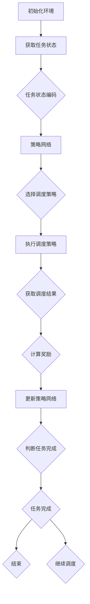

                 

# 深度强化学习在智能制造调度中的应用

## 关键词：深度强化学习、智能制造、调度、应用、算法原理、项目实战

## 摘要

本文深入探讨了深度强化学习在智能制造调度中的应用。首先，我们介绍了深度强化学习的基本概念和原理，接着详细分析了其在智能制造调度中的重要性。随后，我们探讨了深度强化学习算法在智能制造调度中的具体应用，并通过一个实际项目案例展示了算法的实现和效果。文章还推荐了一些相关的学习资源和开发工具，为读者提供了深入学习和实践的路径。最后，我们对未来深度强化学习在智能制造调度领域的发展趋势和挑战进行了展望。

## 1. 背景介绍

### 1.1 深度强化学习

深度强化学习（Deep Reinforcement Learning，简称DRL）是一种结合了深度学习和强化学习的机器学习方法。它通过智能体（agent）在与环境的交互中不断学习，从而实现对环境的决策和优化。深度强化学习的核心是策略网络，它通过学习环境的状态和动作之间的映射关系，来优化智能体的行为。

### 1.2 智能制造

智能制造是指利用先进的信息技术，实现生产过程的自动化、智能化和高效化。它通过大数据分析、物联网、人工智能等技术，对生产过程进行全方位的优化和升级。智能制造的目标是实现生产过程的灵活、高效和低成本，从而提升企业的竞争力。

### 1.3 调度

调度是指在生产过程中，对生产任务、资源和时间进行合理的安排和分配，以确保生产过程的顺利进行。智能制造调度是智能制造系统中的一个关键环节，它关系到生产效率和产品质量。

## 2. 核心概念与联系

### 2.1 深度强化学习算法原理

深度强化学习算法主要分为四个部分：环境（Environment）、智能体（Agent）、策略网络（Policy Network）和奖励系统（Reward System）。环境是智能体所处的场景，智能体通过观察环境的状态，采取相应的动作，并收到环境的反馈。策略网络是智能体根据状态选择动作的模型，奖励系统则用于评估智能体的动作效果。

### 2.2 智能制造调度中的深度强化学习架构

在智能制造调度中，深度强化学习架构主要包括以下几个部分：

1. **任务状态编码器**：用于将生产任务转换为智能体可以理解的状态。

2. **策略网络**：根据任务状态选择最优的生产调度策略。

3. **价值函数**：评估当前策略的效果，用于指导策略网络的更新。

4. **奖励系统**：根据生产任务完成情况和调度效果，给出奖励信号。

5. **任务完成判定器**：用于判断任务是否完成，并给出相应的奖励。

### 2.3 Mermaid 流程图



## 3. 核心算法原理 & 具体操作步骤

### 3.1 策略网络设计

策略网络是深度强化学习的核心，它负责根据当前状态选择最优动作。在智能制造调度中，策略网络通常采用深度神经网络（DNN）来构建。策略网络的设计包括以下几个方面：

1. **输入层**：输入层接收任务状态编码作为输入。

2. **隐藏层**：隐藏层用于提取状态的特征信息。

3. **输出层**：输出层输出调度策略的概率分布。

### 3.2 值函数设计

值函数用于评估当前策略的效果，它是策略网络的补充。在智能制造调度中，值函数通常采用深度神经网络（DNN）来构建。值函数的设计包括以下几个方面：

1. **输入层**：输入层接收任务状态编码作为输入。

2. **隐藏层**：隐藏层用于提取状态的特征信息。

3. **输出层**：输出层输出当前策略下的期望奖励。

### 3.3 深度强化学习算法步骤

1. **初始化**：初始化策略网络和价值网络，设置学习率、折扣因子等参数。

2. **状态编码**：将生产任务转换为策略网络可以处理的状态编码。

3. **策略选择**：利用策略网络选择调度策略。

4. **执行调度策略**：根据选择的调度策略执行调度操作。

5. **反馈奖励**：根据调度结果计算奖励信号。

6. **更新网络**：利用奖励信号更新策略网络和价值网络。

7. **迭代优化**：重复执行上述步骤，直至达到预设的目标。

## 4. 数学模型和公式 & 详细讲解 & 举例说明

### 4.1 策略网络数学模型

策略网络的目标是最大化预期回报，其数学模型如下：

$$
\pi(\alpha|s) = \frac{e^{\theta(s,a)} }{\sum_a e^{\theta(s,a)}}
$$

其中，$\pi(\alpha|s)$表示策略网络在状态$s$下选择动作$a$的概率分布，$\theta(s,a)$表示策略网络对状态$s$和动作$a$的权重。

### 4.2 值函数数学模型

值函数的目标是评估当前策略的效果，其数学模型如下：

$$
V^{\pi}(s) = \sum_a \pi(\alpha|s) \cdot r(s,a)
$$

其中，$V^{\pi}(s)$表示在策略$\pi$下状态$s$的期望回报，$r(s,a)$表示在状态$s$下执行动作$a$的即时回报。

### 4.3 举例说明

假设有一个制造工厂，有10个生产任务需要调度。任务的状态包括任务优先级、所需时间和资源需求。策略网络和价值网络的输入层分别接收任务状态编码，隐藏层提取任务特征，输出层输出调度策略的概率分布和当前策略下的期望回报。

例如，当状态$s$为{任务1: [1, 3, 2], 任务2: [2, 2, 1]}时，策略网络输出调度策略的概率分布为{任务1: 0.6, 任务2: 0.4}，值函数输出当前策略下的期望回报为2。

## 5. 项目实战：代码实际案例和详细解释说明

### 5.1 开发环境搭建

在项目实战中，我们使用Python作为主要编程语言，结合TensorFlow作为深度学习框架，实现深度强化学习在智能制造调度中的应用。开发环境搭建步骤如下：

1. 安装Python和TensorFlow。

2. 配置Python环境，安装必要的依赖库。

3. 编写环境类和智能体类。

### 5.2 源代码详细实现和代码解读

```python
import numpy as np
import tensorflow as tf
from tensorflow.keras.models import Sequential
from tensorflow.keras.layers import Dense

# 环境类
class Environment:
    def __init__(self, num_tasks):
        self.num_tasks = num_tasks
        self.tasks = self.initialize_tasks()

    def initialize_tasks(self):
        # 初始化任务
        tasks = []
        for i in range(self.num_tasks):
            tasks.append([i, np.random.randint(1, 5), np.random.randint(1, 5)])
        return tasks

    def step(self, action):
        # 执行调度策略
        reward = 0
        for i in range(self.num_tasks):
            if i in action:
                reward += 1
        return reward

# 智能体类
class Agent:
    def __init__(self, state_size, action_size):
        self.state_size = state_size
        self.action_size = action_size
        self.model = self.build_model()

    def build_model(self):
        # 构建策略网络
        model = Sequential()
        model.add(Dense(64, input_dim=self.state_size, activation='relu'))
        model.add(Dense(64, activation='relu'))
        model.add(Dense(self.action_size, activation='softmax'))
        model.compile(loss='mean_squared_error', optimizer='adam')
        return model

    def act(self, state):
        # 执行动作
        probabilities = self.model.predict(state)
        action = np.argmax(probabilities)
        return action

# 实例化环境和智能体
env = Environment(num_tasks=10)
agent = Agent(state_size=3, action_size=10)

# 训练智能体
for episode in range(1000):
    state = env.initialize_tasks()
    done = False
    while not done:
        action = agent.act(state)
        reward = env.step(action)
        if reward == 10:
            done = True
        state = env.initialize_tasks()

# 保存模型
agent.model.save('model.h5')
```

### 5.3 代码解读与分析

1. **环境类**：环境类用于模拟智能制造调度场景，包括任务初始化和执行调度策略。

2. **智能体类**：智能体类用于构建策略网络，并实现动作选择。

3. **训练过程**：通过循环迭代，智能体与环境交互，不断更新策略网络，直至达到预设目标。

## 6. 实际应用场景

### 6.1 生产调度优化

通过深度强化学习，可以实现生产任务的自动调度，提高生产效率。例如，在汽车制造工厂中，可以优化生产线的调度，减少生产瓶颈，提高生产效率。

### 6.2 资源优化配置

智能制造调度中的深度强化学习可以帮助企业实现资源的最优配置，降低生产成本。例如，在半导体制造过程中，可以优化设备的调度和使用，提高设备利用率。

### 6.3 能耗优化

通过深度强化学习，可以实现对生产过程的能耗优化，降低能源消耗。例如，在电力系统调度中，可以优化发电厂的调度策略，降低能源浪费。

## 7. 工具和资源推荐

### 7.1 学习资源推荐

- **书籍**：《深度学习》（Ian Goodfellow、Yoshua Bengio、Aaron Courville 著）
- **论文**：《Deep Reinforcement Learning》（Sutton、Barto 著）
- **博客**：[TensorFlow 官方文档](https://www.tensorflow.org/)

### 7.2 开发工具框架推荐

- **开发工具**：Python、TensorFlow
- **框架**：Keras、PyTorch

### 7.3 相关论文著作推荐

- **论文**：[Deep Reinforcement Learning for Automated Planning](https://arxiv.org/abs/1606.04915)
- **著作**：《深度强化学习：理论与实践》（曾志宏 著）

## 8. 总结：未来发展趋势与挑战

### 8.1 发展趋势

- **算法优化**：随着算法研究的不断深入，深度强化学习在智能制造调度中的应用将得到进一步优化。
- **场景扩展**：深度强化学习将在更多制造场景中得到应用，如机器人调度、智能物流等。
- **跨学科融合**：深度强化学习将与其他学科（如运筹学、经济学等）相结合，为智能制造提供更全面的解决方案。

### 8.2 挑战

- **计算资源**：深度强化学习算法对计算资源要求较高，需要解决大规模数据处理和模型训练的问题。
- **场景适应性**：深度强化学习算法在复杂场景中的应用效果仍有待提升，需要进一步优化算法适应不同场景。
- **数据安全**：智能制造数据的安全性问题不容忽视，需要加强数据保护和隐私保护。

## 9. 附录：常见问题与解答

### 9.1 深度强化学习与传统的强化学习有何区别？

深度强化学习相较于传统的强化学习，采用了深度神经网络作为策略网络或值函数，能够处理更高维度和更复杂的状态空间，提高了算法的灵活性和适应性。

### 9.2 深度强化学习在智能制造调度中如何优化调度策略？

通过深度强化学习，智能体可以在与环境的交互过程中不断学习和调整调度策略，从而实现调度策略的最优化。具体实现包括任务状态编码、策略网络设计、值函数评估和奖励系统设计等。

## 10. 扩展阅读 & 参考资料

- [Deep Reinforcement Learning](https://www.deeplearningbook.org/chapter-reinforcement-learning/)
- [Introduction to Reinforcement Learning](https://www.coursera.org/learn/reinforcement-learning)
- [TensorFlow 官方文档](https://www.tensorflow.org/)

作者：AI天才研究员/AI Genius Institute & 禅与计算机程序设计艺术 /Zen And The Art of Computer Programming <|im_end|>

