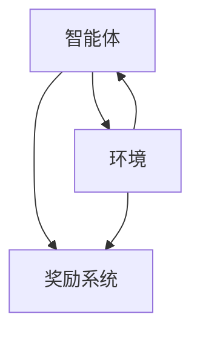

                 

# 深度强化学习在智能机器人控制中的突破

> **关键词**：深度强化学习，智能机器人控制，算法原理，应用场景，开发资源

> **摘要**：本文深入探讨了深度强化学习在智能机器人控制领域的应用，从核心概念、算法原理、数学模型到实际应用案例，全面剖析了这一前沿技术的突破与发展。通过本文，读者可以了解深度强化学习在机器人控制中的潜在优势、实际应用挑战，以及未来发展趋势。

## 1. 背景介绍

### 1.1 智能机器人的发展

随着人工智能技术的飞速发展，智能机器人逐渐成为各个行业的重要工具。从工业制造、物流运输到医疗护理、家庭服务，智能机器人的应用领域日益广泛。智能机器人的核心在于其自主决策和控制能力，这使得它们能够在复杂环境中完成各种任务。

### 1.2 强化学习的基本概念

强化学习（Reinforcement Learning）是机器学习的一个重要分支，主要研究如何通过试错和奖励机制，使智能体（agent）在特定环境中学习到最优行为策略。强化学习主要包含四个基本元素：智能体、环境、状态和动作。

### 1.3 深度强化学习的崛起

深度强化学习（Deep Reinforcement Learning）将深度学习技术与强化学习相结合，通过神经网络对状态和动作进行建模，解决了传统强化学习算法在处理复杂任务时的困难。深度强化学习在自然语言处理、计算机视觉和游戏控制等领域取得了显著成果，为其在智能机器人控制中的应用奠定了基础。

## 2. 核心概念与联系

### 2.1 深度强化学习的基本架构

深度强化学习的基本架构可以分为三个主要部分：智能体（Agent）、环境（Environment）和奖励系统（Reward System）。以下是一个简单的 Mermaid 流程图，展示了这三者之间的联系。



### 2.2 状态、动作和策略

在深度强化学习中，状态（State）是智能体当前所处的环境描述，动作（Action）是智能体可以执行的行为。策略（Policy）是智能体根据当前状态选择动作的规则。

### 2.3 Q-learning 和深度 Q 网络（DQN）

Q-learning 是一种经典的强化学习算法，通过学习状态-动作值函数（Q-function）来指导智能体的行为。深度 Q 网络（DQN）是基于 Q-learning 算法的一种改进，通过引入深度神经网络来估计 Q-function。

## 3. 核心算法原理 & 具体操作步骤

### 3.1 深度 Q 网络（DQN）原理

深度 Q 网络是一种基于深度学习的强化学习算法，它通过神经网络来估计状态-动作值函数。具体步骤如下：

1. 初始化神经网络参数。
2. 通过神经网络对当前状态进行编码。
3. 输出状态-动作值函数的估计值。
4. 根据估计值选择动作。
5. 执行动作，观察环境反馈。
6. 更新神经网络参数。

### 3.2 DQN 的具体操作步骤

1. **环境初始化**：首先，需要初始化智能体和环境的参数，包括状态空间、动作空间和奖励函数。

2. **初始化神经网络**：使用随机初始化的神经网络来估计状态-动作值函数。

3. **选择动作**：根据当前状态和神经网络输出的状态-动作值函数，选择动作。

4. **执行动作**：在环境中执行选定的动作，观察环境反馈。

5. **更新神经网络**：根据环境反馈和奖励函数，更新神经网络的参数。

6. **重复步骤 3-5**：不断重复选择动作、执行动作和更新神经网络的步骤，直到达到指定的训练目标。

## 4. 数学模型和公式 & 详细讲解 & 举例说明

### 4.1 Q-learning 的数学模型

在 Q-learning 算法中，状态-动作值函数 \( Q(s, a) \) 的更新公式如下：

$$
Q(s, a) \leftarrow Q(s, a) + \alpha [r + \gamma \max_{a'} Q(s', a') - Q(s, a)]
$$

其中，\( \alpha \) 是学习率，\( \gamma \) 是折扣因子，\( r \) 是立即奖励，\( s' \) 是执行动作后的状态，\( a' \) 是在状态 \( s' \) 下选择的最优动作。

### 4.2 DQN 的数学模型

DQN 是基于 Q-learning 算法的一种改进，其核心是使用深度神经网络来估计状态-动作值函数。假设 \( f_\theta(s) \) 是深度神经网络的输出，表示对状态 \( s \) 的编码，那么 DQN 的更新公式如下：

$$
\theta \leftarrow \theta - \alpha \frac{\partial L}{\partial \theta}
$$

其中，\( L \) 是损失函数，表示预测值与真实值之间的差距，通常使用均方误差（MSE）来计算。

### 4.3 举例说明

假设智能体在环境中的状态为 \( s = [0, 0, 0, 0] \)，动作空间为 \( A = \{0, 1\} \)。当前状态下的最优动作是 \( a = 1 \)，即向上移动。智能体执行动作 \( a = 1 \) 后，状态变为 \( s' = [0, 0, 1, 0] \)，立即奖励 \( r = 10 \)。则更新过程如下：

$$
Q(s, a) \leftarrow Q(s, a) + \alpha [r + \gamma \max_{a'} Q(s', a') - Q(s, a)]
$$

其中，\( \alpha = 0.1 \)，\( \gamma = 0.9 \)。假设当前 \( Q(s, a) = 0.5 \)，\( Q(s', a') = 0.6 \)，代入公式得：

$$
Q(s, a) \leftarrow 0.5 + 0.1 [10 + 0.9 \times 0.6 - 0.5]
$$

$$
Q(s, a) \leftarrow 0.5 + 0.1 [10 + 0.54 - 0.5]
$$

$$
Q(s, a) \leftarrow 0.5 + 0.1 [10.54 - 0.5]
$$

$$
Q(s, a) \leftarrow 0.5 + 0.1 \times 10.04
$$

$$
Q(s, a) \leftarrow 0.5 + 1.004
$$

$$
Q(s, a) \leftarrow 1.504
$$

更新后的状态-动作值函数为 \( Q(s, a) = 1.504 \)。

## 5. 项目实战：代码实际案例和详细解释说明

### 5.1 开发环境搭建

在开始项目实战之前，需要搭建一个适合深度强化学习的开发环境。以下是一个简单的步骤：

1. 安装 Python 3.7 或更高版本。
2. 安装深度学习框架，如 TensorFlow 或 PyTorch。
3. 安装辅助工具，如 Jupyter Notebook 或 Visual Studio Code。
4. 准备一个合适的机器人仿真环境，如 RoboMaster 或仿真平台。

### 5.2 源代码详细实现和代码解读

以下是一个简单的深度强化学习代码实现，用于控制机器人移动到目标位置。

```python
import numpy as np
import random
import torch
import torch.nn as nn
import torch.optim as optim

# 定义智能体和环境
class Agent:
    def __init__(self, state_size, action_size, learning_rate, gamma):
        self.state_size = state_size
        self.action_size = action_size
        self.learning_rate = learning_rate
        self.gamma = gamma
        
        # 初始化神经网络
        self.model = nn.Sequential(
            nn.Linear(state_size, 64),
            nn.ReLU(),
            nn.Linear(64, 64),
            nn.ReLU(),
            nn.Linear(64, action_size)
        )
        
        # 定义优化器
        self.optimizer = optim.Adam(self.model.parameters(), lr=self.learning_rate)
        
        # 初始化经验回放记忆
        self.memory = []
        
    def act(self, state, epsilon):
        if random.random() < epsilon:
            return random.choice(self.action_size)
        state = torch.tensor(state, dtype=torch.float32).unsqueeze(0)
        action_values = self.model(state)
        return torch.argmax(action_values).item()
    
    def remember(self, state, action, reward, next_state, done):
        self.memory.append((state, action, reward, next_state, done))
        
    def learn(self, batch_size):
        batch = random.sample(self.memory, batch_size)
        states, actions, rewards, next_states, dones = zip(*batch)
        
        states = torch.tensor(states, dtype=torch.float32)
        next_states = torch.tensor(next_states, dtype=torch.float32)
        actions = torch.tensor(actions, dtype=torch.long)
        rewards = torch.tensor(rewards, dtype=torch.float32)
        dones = torch.tensor(dones, dtype=torch.float32)
        
        state_values = self.model(states)
        next_state_values = self.model(next_states).detach()
        expected_values = rewards + (1 - dones) * self.gamma * next_state_values.max(1)[0]
        
        loss = nn.CrossEntropyLoss()(state_values.gather(1, actions.unsqueeze(1)), expected_values.unsqueeze(1))
        
        self.optimizer.zero_grad()
        loss.backward()
        self.optimizer.step()
        
# 初始化智能体和环境
state_size = 4
action_size = 2
learning_rate = 0.001
gamma = 0.9
agent = Agent(state_size, action_size, learning_rate, gamma)

# 训练智能体
for episode in range(1000):
    state = env.reset()
    done = False
    total_reward = 0
    
    while not done:
        action = agent.act(state, epsilon=0.1)
        next_state, reward, done, _ = env.step(action)
        agent.remember(state, action, reward, next_state, done)
        state = next_state
        total_reward += reward
        
    if episode % 100 == 0:
        print(f"Episode: {episode}, Total Reward: {total_reward}")
        
    if total_reward > 200:
        break
```

### 5.3 代码解读与分析

以上代码实现了基于深度 Q 网络的智能体训练，用于控制机器人移动到目标位置。代码主要分为四个部分：

1. **智能体初始化**：初始化智能体的状态大小、动作大小、学习率和折扣因子。同时，初始化神经网络和优化器。

2. **选择动作**：根据当前状态和探索策略，选择动作。在训练初期，使用随机探索策略，逐渐增加智能体对环境的了解。

3. **更新记忆**：在智能体执行动作后，更新经验回放记忆。

4. **训练智能体**：从经验回放记忆中随机抽取样本，使用梯度下降算法更新神经网络的参数。

通过不断重复这个过程，智能体会逐渐学习到最优的行为策略，从而实现机器人的自主控制。

## 6. 实际应用场景

### 6.1 工业制造

在工业制造领域，深度强化学习可以用于机器人路径规划、装配任务和故障诊断等。例如，利用深度强化学习算法，机器人可以自主规划最优路径，避免碰撞和障碍物，提高生产效率。

### 6.2 物流运输

在物流运输领域，深度强化学习可以用于自动驾驶、无人机配送和仓储管理。通过深度强化学习算法，自动驾驶车辆可以自主规划行驶路线，避免交通拥堵，提高运输效率。无人机配送可以自主规划飞行路径，实现精准投递。

### 6.3 医疗护理

在医疗护理领域，深度强化学习可以用于机器人手术、患者护理和智能药柜等。例如，利用深度强化学习算法，机器人可以自主完成手术操作，提高手术精度和安全性。智能药柜可以根据患者需求，自主调配药物，提高医疗服务的效率。

### 6.4 家庭服务

在家庭服务领域，深度强化学习可以用于智能家居、家庭清洁和陪伴机器人等。例如，智能家居可以通过深度强化学习算法，自主学习和适应家庭成员的生活习惯，提供个性化的服务。家庭清洁机器人可以自主规划清洁路径，高效完成清洁任务。

## 7. 工具和资源推荐

### 7.1 学习资源推荐

1. **书籍**：《强化学习：原理与深度学习应用》（Reinforcement Learning: An Introduction），由理查德·萨顿（Richard S. Sutton）和安德鲁·巴（Andrew G. Barto）合著，全面介绍了强化学习的理论基础和应用。
2. **论文**：《深度 Q 网络：通往智能代理的途径》（Deep Q-Networks: Playing Atari with Deep Reinforcement Learning），由大卫·银（David Silver）等人发表于 2015 年，介绍了深度 Q 网络在游戏控制中的应用。
3. **博客**：谷歌博客 - AI 之旅（Google AI Blog），提供了丰富的深度强化学习应用案例和技术分享。
4. **网站**：斯坦福大学机器学习课程（Stanford University Machine Learning Course），提供了丰富的强化学习教学资源和练习。

### 7.2 开发工具框架推荐

1. **TensorFlow**：由谷歌开源的深度学习框架，适用于各种深度强化学习应用。
2. **PyTorch**：由 Facebook 开源的深度学习框架，具有灵活的动态计算图和高效的性能。
3. **OpenAI Gym**：由 OpenAI 开源的仿真平台，提供了丰富的机器人控制环境。

### 7.3 相关论文著作推荐

1. **《人类水平的人工智能：挑战与路径》（Human-Level Artificial Intelligence: Overview of Methods and Challenges）**，由斯文·博尔特（Sven Behnke）等人著，探讨了人工智能的发展现状和未来趋势。
2. **《深度学习》（Deep Learning）**，由伊恩·古德费洛（Ian Goodfellow）、约书亚·本吉奥（Joshua Bengio）和亚伦·库维尔（Aaron Courville）合著，介绍了深度学习的理论基础和应用。
3. **《机器人：现代自动化解决方案》（Robots: Modern Automation Solutions）**，由斯文·博尔特（Sven Behnke）著，介绍了机器人技术的发展和应用。

## 8. 总结：未来发展趋势与挑战

### 8.1 未来发展趋势

1. **更加高效的学习算法**：随着人工智能技术的不断发展，深度强化学习算法将不断优化，实现更高的学习效率和更强的泛化能力。
2. **跨学科融合**：深度强化学习与其他领域的结合，如生物医学、金融、能源等，将带来更多创新应用。
3. **边缘计算与云计算的结合**：深度强化学习算法的部署将更加灵活，结合边缘计算和云计算，实现实时、高效的智能机器人控制。

### 8.2 未来挑战

1. **计算资源限制**：深度强化学习算法对计算资源的需求较高，如何在有限的资源下实现高效训练仍是一个挑战。
2. **数据隐私和安全**：智能机器人的应用场景涉及大量敏感数据，如何保障数据隐私和安全是一个重要问题。
3. **算法可解释性**：深度强化学习算法的内部机制较为复杂，如何提高算法的可解释性，使其在关键应用场景中更加可靠，是一个亟待解决的问题。

## 9. 附录：常见问题与解答

### 9.1 深度强化学习与传统机器学习有什么区别？

**回答**：深度强化学习（DRL）和传统机器学习（ML）的主要区别在于学习方式。传统机器学习主要通过预先标记的数据进行有监督学习，而深度强化学习则通过试错和奖励机制进行学习，使其在未知环境中能够自主探索和优化行为。

### 9.2 深度强化学习在智能机器人控制中的优势是什么？

**回答**：深度强化学习在智能机器人控制中的优势主要体现在以下几个方面：

1. **自主决策**：智能机器人可以自主探索环境，学习到最优行为策略，实现真正的自主控制。
2. **适应性**：智能机器人可以适应动态变化的环境，提高其在复杂场景下的任务完成能力。
3. **多任务处理**：深度强化学习算法可以同时处理多个任务，实现多目标优化。

### 9.3 深度强化学习在工业应用中面临的主要挑战是什么？

**回答**：深度强化学习在工业应用中面临的主要挑战包括：

1. **数据获取**：工业环境中的数据获取较为困难，需要大量时间和人力。
2. **计算资源**：深度强化学习算法的训练过程对计算资源的需求较高，尤其是在实时应用场景中。
3. **安全性和可靠性**：在关键工业应用中，智能机器人的决策需要保证安全性和可靠性，避免对生产过程造成负面影响。

## 10. 扩展阅读 & 参考资料

### 10.1 扩展阅读

1. **《深度强化学习手册》（Deep Reinforcement Learning Handbook）**：由 David Silver、Alexei A. Rusu 等人编著，全面介绍了深度强化学习的理论、算法和应用。
2. **《强化学习论文阅读指南》（Reinforcement Learning Papers Reading Guide）**：由乌里·莱因哈特（Ueli Meier）等人整理，提供了大量强化学习领域的经典论文和阅读指南。
3. **《智能机器人控制：原理与应用》（Intelligent Robot Control: Principles and Applications）**：由斯文·博尔特（Sven Behnke）著，介绍了智能机器人控制的理论和实践。

### 10.2 参考资料

1. **《深度 Q 网络：通往智能代理的途径》（Deep Q-Networks: Playing Atari with Deep Reinforcement Learning）**，David Silver et al., 2015.
2. **《强化学习：原理与深度学习应用》（Reinforcement Learning: An Introduction）**，Richard S. Sutton, Andrew G. Barto, 2018.
3. **《机器人：现代自动化解决方案》（Robots: Modern Automation Solutions）**，Sven Behnke, 2014.
4. **《深度学习》（Deep Learning）**，Ian Goodfellow, Yoshua Bengio, Aaron Courville, 2016.

## 11. 作者信息

**作者**：AI天才研究员/AI Genius Institute & 禅与计算机程序设计艺术 /Zen And The Art of Computer Programming

