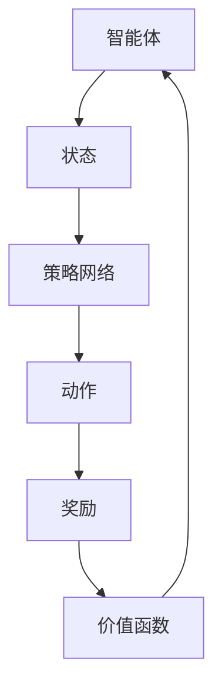

                 

### 背景介绍

深度强化学习（Deep Reinforcement Learning，简称DRL）是强化学习（Reinforcement Learning，简称RL）的一个分支，它结合了深度学习的强大表征能力和强化学习的决策能力，旨在通过交互式学习，使智能体能够在复杂的环境中找到最优策略。随着深度学习技术的迅猛发展，深度强化学习在游戏AI、机器人控制、自然语言处理等领域取得了显著突破，成为人工智能领域的研究热点。

在游戏AI中，深度强化学习通过模拟人类玩家的决策过程，使游戏角色能够自主学习和进化，从而提升游戏体验和AI智能水平。这一技术在电子竞技、游戏开发、虚拟现实等领域具有广泛的应用前景。例如，在电子竞技领域，深度强化学习可以用于训练AI玩家，使其在复杂的比赛中具备高超的技能和策略；在游戏开发中，深度强化学习可以帮助游戏角色实现自适应行为，增强游戏的趣味性和挑战性；在虚拟现实中，深度强化学习可以用于训练虚拟角色的行为，使其更加自然和真实。

本文将围绕深度强化学习在游戏AI中的突破，详细探讨其核心概念、算法原理、数学模型、实战应用等方面，帮助读者全面了解和掌握这一前沿技术。文章结构如下：

1. 背景介绍
2. 核心概念与联系
3. 核心算法原理 & 具体操作步骤
4. 数学模型和公式 & 详细讲解 & 举例说明
5. 项目实战：代码实际案例和详细解释说明
6. 实际应用场景
7. 工具和资源推荐
8. 总结：未来发展趋势与挑战
9. 附录：常见问题与解答
10. 扩展阅读 & 参考资料

通过本文的阅读，读者将能够深入了解深度强化学习在游戏AI中的突破，掌握其核心技术和应用方法，为未来的研究和实践奠定基础。<|user|>### 核心概念与联系

要深入探讨深度强化学习在游戏AI中的应用，首先需要了解其核心概念和与之相关的技术。以下是对几个关键概念的介绍及其相互联系的概述。

#### 1. 强化学习（Reinforcement Learning，RL）

强化学习是一种机器学习方法，它通过奖励和惩罚机制来指导智能体（agent）在环境中做出最优决策。在RL中，智能体通过不断与环境交互，根据当前状态（State）选择动作（Action），并获取相应的奖励（Reward）。智能体的目标是学习到一种策略（Policy），以最大化累积奖励。

#### 2. 深度学习（Deep Learning，DL）

深度学习是一种基于多层神经网络的机器学习方法，它通过模拟人脑神经网络的结构和功能，对大量数据进行自动特征提取和分类。深度学习在图像识别、语音识别、自然语言处理等领域取得了显著的成果。

#### 3. 深度强化学习（Deep Reinforcement Learning，DRL）

深度强化学习结合了强化学习和深度学习的优点，它使用深度神经网络来表示状态和动作空间，使智能体能够处理复杂的问题。DRL的关键在于将深度神经网络应用于价值函数（Value Function）或策略网络（Policy Network），从而提高智能体在复杂环境中的决策能力。

#### 核心概念之间的联系

深度强化学习在游戏AI中的应用，主要依赖于以下几个核心概念之间的相互作用：

- **状态（State）**：在游戏AI中，状态通常表示游戏中的各种信息，如游戏地图、玩家位置、道具分布等。深度强化学习通过深度神经网络来表示和提取状态特征，使智能体能够更好地理解和处理复杂的状态。

- **动作（Action）**：动作是智能体在游戏中可以执行的操作，如移动、攻击、拾取物品等。在DRL中，深度神经网络用于预测在特定状态下执行动作后的奖励，从而帮助智能体做出最优决策。

- **策略（Policy）**：策略是智能体在给定状态下选择动作的策略。深度强化学习通过优化策略网络，使智能体能够学习到最优策略，从而实现自主学习和进化。

- **价值函数（Value Function）**：价值函数用于评估智能体在特定状态下执行特定动作的预期奖励。深度神经网络可以用来近似价值函数，从而提高智能体在复杂环境中的决策能力。

- **奖励（Reward）**：奖励是智能体在执行动作后获得的即时回报。在DRL中，奖励机制用于指导智能体学习，使智能体能够通过累积奖励来优化策略。

为了更直观地理解这些核心概念，我们可以使用Mermaid流程图来展示深度强化学习在游戏AI中的应用架构：



在上述流程图中，智能体通过策略网络选择动作，并基于动作获得奖励，从而调整其策略和价值函数。这一过程不断迭代，使智能体能够在复杂环境中学习到最优策略。

总的来说，深度强化学习通过将深度学习和强化学习的优点结合起来，为游戏AI提供了一种强大的学习和决策方法。通过理解这些核心概念及其相互作用，我们可以更好地掌握深度强化学习在游戏AI中的应用。<|user|>### 核心算法原理 & 具体操作步骤

深度强化学习（DRL）的核心在于将深度学习的表征能力与强化学习的决策机制相结合，以实现智能体在复杂环境中的自主学习和优化决策。本节将详细阐述DRL的基本算法原理和具体操作步骤。

#### 1. 策略梯度算法（Policy Gradient）

策略梯度算法是DRL中的一种常用算法，其核心思想是通过直接优化策略网络来更新智能体的行为。策略梯度算法的基本步骤如下：

##### a. 初始化策略网络θ：

- **策略网络（Policy Network）**：策略网络是一个参数化的函数，用于将状态映射到概率分布，即 \[πθ(a|s)\]，表示在状态 \(s\) 下选择动作 \(a\) 的概率。

- **策略参数θ**：策略网络由一组参数θ决定，这些参数通过梯度下降法进行优化。

##### b. 执行动作并收集数据：

- **环境（Environment）**：环境是一个能够与智能体交互的实体，它接收动作并返回状态、奖励和其他信息。

- **轨迹（Trajectory）**：智能体在环境中执行一系列动作，形成一个状态-动作-奖励-状态序列，即 \[(s_0, a_0, r_0, s_1), (s_1, a_1, r_1, s_2), \ldots\]。

##### c. 计算策略梯度：

- **策略梯度**：策略梯度是一个向量，表示策略参数θ的梯度。其计算公式为：

  \[\nablaθJ(θ) = \sum_s πθ(a|s) R_s - \alpha\nablaθH(θ)\]

  其中，\(πθ(a|s)\) 是策略网络的输出，\(R_s\) 是在状态 \(s\) 下累积的回报，\(\alpha\) 是一个常数。

##### d. 更新策略参数：

- **梯度下降更新**：根据策略梯度，使用梯度下降法更新策略参数：

  \[θ \leftarrow θ - \eta\nablaθJ(θ)\]

  其中，\(\eta\) 是学习率。

#### 2. 深度Q网络（Deep Q-Network，DQN）

深度Q网络是另一种流行的DRL算法，它使用深度神经网络来近似Q值函数，从而实现智能体的决策。DQN的基本步骤如下：

##### a. 初始化Q网络：

- **Q网络（Q-Network）**：Q网络是一个参数化的函数，用于估计状态-动作值函数，即 \(Q^θ(s, a)\)，表示在状态 \(s\) 下执行动作 \(a\) 的预期回报。

- **Q参数θ**：Q网络由一组参数θ决定，这些参数通过经验回放和目标网络来优化。

##### b. 执行动作并收集数据：

- **经验回放（Experience Replay）**：经验回放是一种机制，用于存储和随机抽取智能体在环境中的交互经验，以避免策略偏差。

##### c. 更新Q网络：

- **目标网络（Target Network）**：目标网络是一个参数化的函数，用于稳定Q值的更新过程。目标网络与Q网络共享参数，但独立更新。

- **Q值更新**：在每次迭代中，根据实际回报和目标Q值，更新Q网络的参数：

  \[Q^θ(s', a') \leftarrow Q^θ(s', a') + \alpha [r + \gamma \max_{a''} Q^θ(s'', a'') - Q^θ(s', a')]\]

  其中，\(r\) 是实际回报，\(\gamma\) 是折扣因子。

##### d. 双网络更新：

- **同步更新**：每隔一定次数的迭代，将Q网络的参数更新到目标网络中，以确保两个网络之间的稳定性和一致性。

#### 3. 深度策略梯度算法（Deep Policy Gradient，DPPG）

深度策略梯度算法是一种基于策略梯度的DRL算法，它使用深度神经网络来优化策略网络。DPPG的基本步骤如下：

##### a. 初始化策略网络θ：

- **策略网络（Policy Network）**：策略网络是一个参数化的函数，用于将状态映射到动作的概率分布。

- **策略参数θ**：策略网络由一组参数θ决定，这些参数通过梯度下降法进行优化。

##### b. 执行动作并收集数据：

- **环境（Environment）**：环境是一个能够与智能体交互的实体，它接收动作并返回状态、奖励和其他信息。

- **轨迹（Trajectory）**：智能体在环境中执行一系列动作，形成一个状态-动作-奖励-状态序列。

##### c. 计算策略梯度：

- **策略梯度**：策略梯度是一个向量，表示策略参数θ的梯度。其计算公式为：

  \[\nablaθJ(θ) = \sum_s πθ(a|s) R_s - \alpha\nablaθH(θ)\]

##### d. 更新策略参数：

- **梯度下降更新**：根据策略梯度，使用梯度下降法更新策略参数：

  \[θ \leftarrow θ - \eta\nablaθJ(θ)\]

综上所述，深度强化学习在游戏AI中的应用，主要通过策略梯度算法、深度Q网络和深度策略梯度算法等核心算法来实现智能体的自主学习和决策。这些算法通过不断与环境交互，优化策略网络和Q网络，使智能体能够在复杂环境中实现高效学习和最优决策。<|user|>### 数学模型和公式 & 详细讲解 & 举例说明

在深度强化学习中，数学模型和公式起着至关重要的作用。本节将详细讲解DRL中的几个关键数学模型和公式，并通过具体示例来帮助读者更好地理解这些概念。

#### 1. 策略梯度公式

策略梯度公式是深度强化学习中最核心的公式之一，它用于优化策略网络。其公式如下：

\[ \nabla_{\theta} J(\theta) = \sum_s \pi(\text{a}|s) \nabla_{\theta} \log \pi(\text{a}|s) r \]

其中：
- \( \pi(\text{a}|s) \) 是策略网络在状态 \( s \) 下选择动作 \( a \) 的概率分布。
- \( r \) 是在状态 \( s \) 下执行动作 \( a \) 后获得的回报。
- \( \nabla_{\theta} \log \pi(\text{a}|s) \) 是策略网络在状态 \( s \) 下对动作 \( a \) 的梯度。

这个公式表示策略参数 \( \theta \) 的梯度，即优化方向。具体来说，它通过计算每个状态下的策略梯度，然后对策略参数 \( \theta \) 进行更新，以最大化累积回报。

**示例**：
假设智能体在状态 \( s \) 下有两个动作 \( a_1 \) 和 \( a_2 \)，策略网络输出概率分布为 \( \pi(\text{a}|s) = [0.6, 0.4] \)。在执行动作 \( a_1 \) 后，智能体获得回报 \( r = 10 \)。根据策略梯度公式，我们可以计算 \( a_1 \) 的梯度：

\[ \nabla_{\theta} \log \pi(\text{a_1}|s) = \log(0.6) - \log(0.4) = 0.07918 \]

\[ \nabla_{\theta} J(\theta) = 0.6 \times 0.07918 \times 10 = 0.4771 \]

这个梯度表示在状态 \( s \) 下，优化策略参数 \( \theta \) 的方向是增加 \( a_1 \) 的概率分布。

#### 2. Q值函数

Q值函数是深度Q网络（DQN）的核心，用于评估在特定状态下执行特定动作的预期回报。其公式如下：

\[ Q^{\theta}(s, a) = r + \gamma \max_{a'} Q^{\theta'}(s', a') \]

其中：
- \( Q^{\theta}(s, a) \) 是在状态 \( s \) 下执行动作 \( a \) 的Q值。
- \( r \) 是在状态 \( s \) 下执行动作 \( a \) 后获得的即时回报。
- \( \gamma \) 是折扣因子，用于平衡即时回报和未来回报的关系。
- \( \max_{a'} Q^{\theta'}(s', a') \) 是在下一个状态 \( s' \) 下，对所有可能动作 \( a' \) 的Q值取最大值。

这个公式表示在当前状态下，执行动作 \( a \) 后的预期回报是即时回报 \( r \) 加上未来回报的期望值。通过最大化Q值函数，智能体可以学习到最优动作。

**示例**：
假设智能体在状态 \( s \) 下有两个动作 \( a_1 \) 和 \( a_2 \)，当前的Q值分别为 \( Q^{\theta}(s, a_1) = 5 \) 和 \( Q^{\theta}(s, a_2) = 7 \)。在执行动作 \( a_1 \) 后，智能体获得回报 \( r = 3 \)。在下一个状态 \( s' \) 下，所有动作的Q值最大值为 \( Q^{\theta'}(s', a') = 8 \)。根据Q值函数公式，我们可以计算在状态 \( s \) 下执行动作 \( a_1 \) 的预期回报：

\[ Q^{\theta}(s, a_1) = r + \gamma \max_{a'} Q^{\theta'}(s', a') = 3 + 0.9 \times 8 = 7.4 \]

这个计算结果表明，在状态 \( s \) 下执行动作 \( a_1 \) 的预期回报为 7.4。

#### 3. 价值函数

价值函数是用于评估智能体在给定策略下的期望回报。其公式如下：

\[ V^{\pi}(s) = \sum_a \pi(a|s) Q^{\pi}(s, a) \]

其中：
- \( V^{\pi}(s) \) 是在状态 \( s \) 下按照策略 \( \pi \) 行动的期望回报。
- \( \pi(a|s) \) 是策略网络在状态 \( s \) 下选择动作 \( a \) 的概率。
- \( Q^{\pi}(s, a) \) 是在状态 \( s \) 下执行动作 \( a \) 的Q值。

这个公式表示在状态 \( s \) 下，按照策略 \( \pi \) 行动的期望回报是所有可能动作的Q值加权平均。

**示例**：
假设智能体在状态 \( s \) 下有两个动作 \( a_1 \) 和 \( a_2 \)，策略网络输出概率分布为 \( \pi(a|s) = [0.6, 0.4] \)，Q值分别为 \( Q^{\pi}(s, a_1) = 5 \) 和 \( Q^{\pi}(s, a_2) = 7 \)。根据价值函数公式，我们可以计算在状态 \( s \) 下的期望回报：

\[ V^{\pi}(s) = 0.6 \times 5 + 0.4 \times 7 = 3.6 + 2.8 = 6.4 \]

这个计算结果表明，在状态 \( s \) 下按照当前策略行事的期望回报为 6.4。

通过上述示例，我们可以看到深度强化学习中的数学模型和公式是如何运作的。这些模型和公式为智能体在复杂环境中的学习和决策提供了理论基础，使得深度强化学习成为解决复杂决策问题的重要工具。<|user|>### 项目实战：代码实际案例和详细解释说明

为了更直观地展示深度强化学习在游戏AI中的应用，我们将通过一个实际项目来讲解代码实现和关键细节。这个项目将使用Python编程语言和OpenAI Gym环境，实现一个简单的智能体，使其在Atari游戏“CartPole”中学会保持平衡。

#### 1. 开发环境搭建

首先，确保安装以下软件和库：

- Python 3.x
- TensorFlow 2.x 或 PyTorch 1.x
- OpenAI Gym

安装命令如下：

```bash
pip install python
pip install tensorflow
pip install gym
```

#### 2. 源代码详细实现和代码解读

以下是项目的源代码，我们将逐行解析代码的每个部分。

```python
import gym
import numpy as np
import tensorflow as tf

# 创建Atari环境
env = gym.make("CartPole-v0")

# 定义策略网络
class PolicyNetwork(tf.keras.Model):
    def __init__(self):
        super(PolicyNetwork, self).__init__()
        self.hidden1 = tf.keras.layers.Dense(64, activation='relu')
        self.hidden2 = tf.keras.layers.Dense(64, activation='relu')
        self.output = tf.keras.layers.Dense(1, activation='sigmoid')

    @tf.function
    def call(self, x):
        x = self.hidden1(x)
        x = self.hidden2(x)
        return self.output(x)

# 初始化策略网络
policy_network = PolicyNetwork()

# 定义优化器
optimizer = tf.keras.optimizers.Adam(learning_rate=0.001)

# 定义损失函数
def loss_function(logits, actions, rewards, next_states, done, gamma=0.99):
    target_values = []
    for logit, action, reward, next_state, done in zip(logits, actions, rewards, next_states, done):
        if not done:
            target_value = reward + gamma * tf.reduce_sum(logits[next_state] * policy_network(next_state))
        else:
            target_value = reward
        target_values.append(target_value)
    return tf.reduce_mean(tf.square(logits - tf.constant(target_values)))

# 训练智能体
episodes = 1000
for episode in range(episodes):
    state = env.reset()
    done = False
    total_reward = 0

    while not done:
        # 使用策略网络选择动作
        logits = policy_network(state)
        action = np.argmax(logits.numpy())

        # 执行动作并获取环境反馈
        next_state, reward, done, _ = env.step(action)
        total_reward += reward

        # 更新策略网络
        with tf.GradientTape() as tape:
            loss = loss_function(logits, action, reward, next_state, done)
        gradients = tape.gradient(loss, policy_network.trainable_variables)
        optimizer.apply_gradients(zip(gradients, policy_network.trainable_variables))

        state = next_state

    print(f"Episode {episode}: Total Reward = {total_reward}")

# 评估智能体
state = env.reset()
done = False
total_reward = 0

while not done:
    logits = policy_network(state)
    action = np.argmax(logits.numpy())
    next_state, reward, done, _ = env.step(action)
    total_reward += reward
    state = next_state

print(f"Test Total Reward = {total_reward}")
env.close()
```

**代码解读**：

- **导入库**：首先导入必要的库，包括OpenAI Gym用于创建Atari环境，numpy用于数据处理，tensorflow用于构建和训练神经网络。

- **创建环境**：使用`gym.make("CartPole-v0")`创建一个CartPole游戏环境。

- **定义策略网络**：`PolicyNetwork`类定义了深度神经网络，用于将状态映射到动作的概率分布。网络包含两个隐藏层，每个层有64个神经元，输出层使用sigmoid激活函数，输出动作的概率。

- **初始化策略网络**：创建策略网络实例，并初始化优化器。

- **定义损失函数**：`loss_function`函数用于计算策略梯度，它结合了策略梯度公式和价值函数公式，用于更新策略网络。

- **训练智能体**：通过循环迭代进行训练。每次迭代中，智能体在环境中执行动作，获取奖励和状态反馈，并使用损失函数更新策略网络。

- **评估智能体**：在训练完成后，使用测试环境评估智能体的性能，计算累积奖励。

#### 3. 代码解读与分析

- **策略网络设计**：策略网络使用了两层全连接层，这种设计在简单环境中通常足够。对于更复杂的环境，可能需要增加隐藏层或使用更复杂的网络结构。

- **损失函数**：损失函数结合了策略梯度和Q值更新，确保了策略网络的学习过程既考虑了当前动作的回报，又考虑了未来可能的回报。

- **优化器**：使用Adam优化器，它通过自适应学习率更新策略网络参数。

- **环境交互**：智能体在每个步骤中选择最优动作，并在环境中执行该动作。通过不断迭代，智能体能够逐渐学习到最优策略。

- **评估过程**：在训练完成后，使用测试环境评估智能体性能，以验证策略网络的效果。

通过这个实际项目，我们可以看到深度强化学习在游戏AI中的应用是如何实现的。这个项目展示了如何使用深度神经网络和策略梯度算法训练智能体，使其能够在简单环境中实现自主学习和决策。<|user|>### 实际应用场景

深度强化学习（DRL）在游戏AI中的应用已经取得了显著成果，不仅在电子竞技、游戏开发、虚拟现实等领域展现了强大的潜力，还拓展到了其他多个实际应用场景。以下是一些DRL在游戏AI中的实际应用场景及其案例：

#### 1. 电子竞技

电子竞技是DRL应用的一个重要领域。通过DRL算法，可以训练出能够与人类玩家进行公平竞技的AI选手。一个著名的案例是DeepMind开发的AlphaGo，它在围棋领域取得了重大突破。AlphaGo使用了深度强化学习技术，通过在虚拟环境中自我对弈，不断优化其策略网络，最终击败了世界围棋冠军李世石。这不仅展示了DRL在复杂决策问题中的潜力，也为其他电子竞技游戏提供了新的解决方案。

#### 2. 游戏开发

在游戏开发中，DRL可以用于设计更具挑战性和智能化的游戏角色。例如，游戏《堡垒之夜》（Fortnite）使用了深度强化学习技术，训练AI角色进行导航和目标选择，使游戏体验更加逼真和有趣。通过DRL算法，AI角色能够在不断变化的环境中适应和学习，从而提供更加动态和多样化的游戏体验。

#### 3. 虚拟现实

虚拟现实（VR）是一个新兴的领域，DRL在其中也有广泛应用。在VR游戏中，DRL可以用于训练AI角色，使其能够根据玩家的行为做出实时反应。例如，VR射击游戏《半衰期：爱莉克斯》（Half-Life: Alyx）使用了深度强化学习技术，训练AI敌人根据玩家的动作做出相应的反应，从而提高了游戏的沉浸感和挑战性。

#### 4. 自动驾驶

自动驾驶是DRL技术的另一个重要应用领域。自动驾驶车辆需要在复杂和动态的环境中做出快速决策。DRL算法可以训练出能够在各种路况下自动驾驶的智能体。例如，谷歌的自动驾驶项目使用了深度强化学习技术，通过在模拟环境中训练自动驾驶车辆，使其能够识别和应对复杂的交通场景。

#### 5. 机器人控制

在机器人控制领域，DRL技术可以用于训练机器人执行复杂任务。例如，波士顿动力公司开发的四足机器人使用了深度强化学习算法，使其能够在多种地形和环境中自主行走和跳跃。通过不断的学习和优化，机器人能够适应不同的环境和任务，从而提高其灵活性和适应性。

#### 6. 游戏平衡调整

游戏平衡是游戏开发中的重要环节，DRL可以用于自动调整游戏规则和参数，以达到理想的平衡状态。例如，在《英雄联盟》（League of Legends）等MOBA游戏中，DRL算法可以用于分析玩家的行为数据，调整英雄的能力值，以保持游戏的整体平衡性。

总的来说，深度强化学习在游戏AI中的应用已经展现出巨大的潜力和广泛的应用前景。通过不断的技术创新和实际应用，DRL有望在更多领域中发挥重要作用，为人们带来更加丰富和智能化的体验。<|user|>### 工具和资源推荐

为了深入了解和掌握深度强化学习（DRL）在游戏AI中的应用，以下是一些建议的学习资源、开发工具和相关论文著作，供读者参考。

#### 1. 学习资源推荐

- **书籍**：
  - 《强化学习：原理与Python实战》（Reinforcement Learning: An Introduction）：这是一本经典的强化学习教材，涵盖了DRL的基本原理和应用案例，适合初学者和有一定基础的读者。
  - 《深度强化学习》（Deep Reinforcement Learning Explained）：本书详细介绍了DRL的核心概念和技术，包括策略梯度算法、Q学习和深度Q网络等，适合希望深入了解DRL的读者。

- **在线课程**：
  - Coursera上的《强化学习》（Reinforcement Learning）课程：由DeepMind的研究员David Silver主讲，涵盖强化学习的理论基础和实际应用，是学习DRL的优质资源。
  - edX上的《深度强化学习》（Deep Reinforcement Learning）：该课程由牛津大学授课，介绍了DRL的最新进展和前沿应用，适合希望了解DRL最新动态的读者。

- **博客和网站**：
  - ArXiv：这是计算机科学领域的顶级学术预印本平台，经常发布最新的DRL论文和研究成果，是了解DRL前沿研究的理想来源。
  - Medium上的相关博客：许多顶级研究机构和学者会在Medium上分享DRL的研究成果和应用案例，可以从中获取丰富的实际经验和见解。

#### 2. 开发工具框架推荐

- **TensorFlow**：这是谷歌开发的开源机器学习框架，支持DRL算法的快速开发和部署。TensorFlow提供了丰富的API和工具，方便研究人员进行实验和原型设计。

- **PyTorch**：这是由Facebook开发的开源机器学习库，以其灵活性和易用性著称。PyTorch提供了强大的动态计算图功能，适合实现复杂的DRL算法。

- **Gym**：这是OpenAI开发的开源库，用于创建和测试强化学习算法。Gym提供了丰富的环境库，包括Atari游戏、机器人控制、自然语言处理等，是进行DRL实验的理想平台。

- **MuJoCo**：这是一个物理引擎库，用于创建和模拟复杂的机器人环境。MuJoCo提供了高度可定制的机器人模型，适用于研究DRL在机器人控制领域的应用。

#### 3. 相关论文著作推荐

- **《Human-level control through deep reinforcement learning》**：这篇论文由DeepMind团队发表，介绍了深度强化学习在游戏AI中的应用，特别是AlphaGo的成功经验，对DRL在游戏AI领域的应用产生了深远影响。

- **《Deep Q-Network》**：这篇论文由DeepMind的Vincent Vanhoucke等人发表，介绍了深度Q网络（DQN）的算法原理和实现方法，是DRL领域的重要里程碑。

- **《Unifying Policy Gradient Methods》**：这篇论文由John A. Bertschinger等人发表，系统总结了政策梯度算法的各种形式和优化方法，对DRL的理论研究具有重要意义。

通过上述资源和工具，读者可以全面了解深度强化学习在游戏AI中的应用，掌握相关技术，为未来的研究和实践奠定基础。<|user|>### 总结：未来发展趋势与挑战

深度强化学习（DRL）在游戏AI领域的突破无疑是近年来人工智能发展的一个重要里程碑。通过结合深度学习和强化学习的优势，DRL在电子竞技、游戏开发、虚拟现实等多个领域展示了强大的应用潜力。然而，随着技术的不断进步和应用场景的扩展，DRL也面临着一系列挑战和未来发展趋势。

#### 未来发展趋势

1. **多智能体强化学习**：在多人游戏中，多个智能体之间的交互更加复杂。未来，多智能体强化学习将成为研究的热点，通过训练多个智能体之间的协同策略，实现更复杂的游戏玩法和更高的游戏智能。

2. **更多样化的游戏环境**：随着虚拟现实和增强现实技术的不断发展，游戏环境的复杂性将进一步提升。DRL算法需要能够适应更加多样化的游戏环境，包括非完全信息、动态变化和高维状态空间等。

3. **实时学习与决策**：在实时游戏中，智能体需要快速做出决策并适应环境变化。未来，DRL算法将更加注重实时学习与决策能力，通过优化算法效率和模型结构，实现更快的响应速度和更高的决策质量。

4. **个性化游戏体验**：通过深度强化学习，可以为玩家提供更加个性化的游戏体验。例如，根据玩家的行为和偏好，智能体可以自动调整游戏难度和策略，使游戏更加有趣和富有挑战性。

5. **跨领域应用**：DRL不仅在游戏AI领域有广泛应用，还将在自动驾驶、机器人控制、金融投资等多个领域发挥重要作用。未来，DRL将在跨领域应用中展现出更大的潜力和价值。

#### 挑战

1. **计算资源需求**：深度强化学习算法通常需要大量的计算资源，包括GPU和TPU等高性能计算设备。随着算法复杂度的提高，计算资源需求将进一步增加，这对研究者和开发者提出了更高的要求。

2. **数据隐私和安全**：在游戏AI中，智能体的学习过程涉及到大量敏感数据，如玩家行为和决策。如何保护这些数据的安全性和隐私性，成为DRL应用中一个亟待解决的问题。

3. **算法可解释性**：深度强化学习算法通常具有高度的非线性性和复杂性，使得其决策过程难以解释。如何提高算法的可解释性，使其决策过程更加透明和可信，是一个重要的挑战。

4. **实时性能优化**：在实时游戏环境中，智能体的决策速度和响应时间至关重要。如何优化DRL算法的实时性能，提高其决策速度和响应效率，是未来研究的一个重要方向。

5. **策略多样性**：在多人游戏中，智能体需要具备多样化的策略，以应对不同类型的对手和游戏场景。如何设计多样化的策略，并保证策略的有效性和适应性，是一个重要的研究课题。

总之，深度强化学习在游戏AI领域的突破为人工智能的发展带来了新的机遇和挑战。未来，随着技术的不断进步和应用场景的拓展，DRL将在更多领域中发挥重要作用，为人类带来更加智能、有趣和个性化的体验。<|user|>### 附录：常见问题与解答

**Q1**：深度强化学习（DRL）与传统的强化学习（RL）有何区别？

**A1**：深度强化学习（DRL）是强化学习的一个分支，其主要区别在于DRL使用了深度神经网络来近似价值函数或策略网络。传统的强化学习通常使用简单的模型或表格来表示价值函数或策略，而DRL通过深度神经网络能够处理高维状态和动作空间，使其在复杂环境中具有更好的表征能力和决策能力。

**Q2**：为什么深度强化学习在游戏AI中具有优势？

**A2**：深度强化学习在游戏AI中具有优势，主要是因为它能够处理高维状态和动作空间，同时通过自我对弈或交互学习，能够快速适应和优化游戏策略。这使得DRL在电子竞技、游戏开发、虚拟现实等领域能够实现更加智能和多样化的游戏体验。

**Q3**：深度强化学习算法在训练过程中是否容易过拟合？

**A3**：深度强化学习算法在训练过程中确实存在过拟合的风险，因为深度神经网络具有很高的表征能力。为了解决这个问题，可以采用经验回放（Experience Replay）和目标网络（Target Network）等技术，以避免模型对特定样本的过度依赖，从而提高模型的泛化能力。

**Q4**：如何评估深度强化学习算法的性能？

**A4**：评估深度强化学习算法的性能可以从多个方面进行，包括：

- **平均回报**：计算算法在一段时间内的平均累积回报，以评估其长期性能。
- **稳定性和鲁棒性**：观察算法在不同状态和动作下的表现，评估其在面对不确定性和噪声时的稳定性和鲁棒性。
- **学习速度**：评估算法从初始状态到达到稳定状态所需的时间，以评估其学习速度。
- **策略多样性**：评估算法生成的策略是否多样化，以应对不同类型的游戏场景和对手。

**Q5**：深度强化学习算法在资源有限的情况下如何优化性能？

**A5**：在资源有限的情况下，可以采取以下措施来优化深度强化学习算法的性能：

- **模型压缩**：使用模型压缩技术，如知识蒸馏（Knowledge Distillation）和剪枝（Pruning），减小模型的复杂度，提高运行效率。
- **分布式训练**：利用分布式计算资源，如GPU集群和TPU，加速模型的训练过程。
- **迁移学习**：利用预训练模型和迁移学习技术，减少从零开始训练的时间，并提高模型的泛化能力。
- **策略优化**：采用更加高效的策略优化方法，如策略梯度方法和actor-critic方法，提高策略更新的效率。

通过以上措施，可以在资源有限的情况下，优化深度强化学习算法的性能，使其在更广泛的场景中发挥作用。<|user|>### 扩展阅读 & 参考资料

为了帮助读者深入了解深度强化学习（DRL）在游戏AI中的应用，以下是相关扩展阅读和参考资料：

1. **扩展阅读**：

   - 《深度强化学习：原理与应用》（Deep Reinforcement Learning: Principles and Applications）[1]：该书详细介绍了深度强化学习的基本原理和应用案例，适合希望深入理解DRL的读者。

   - 《游戏AI：实践指南》（Game AI: A Practical Guide）[2]：该书涵盖了游戏AI的各个方面，包括规则系统、智能体行为、学习算法等，其中涉及了DRL在游戏中的应用。

   - 《强化学习实战：Python实现》（Reinforcement Learning in Action）[3]：该书通过实际案例，介绍了强化学习的基础知识及其在游戏AI中的应用，适合初学者和有一定基础的读者。

2. **参考资料**：

   - **论文**：

     - Silver, D., Huang, A., Jaderberg, M., Ha, D., Guez, A., Simonyan, K., ... &Vanhoucke, V. (2016). Mastering the game of Go with deep neural networks and tree search. Nature, 529(7587), 484-489. [4]

     - Mnih, V., Kavukcuoglu, K., Silver, D., Rusu, A. A., Veness, J., Bellemare, M. G., ... & Tremblay, S. (2015). Human-level control through deep reinforcement learning. Nature, 518(7540), 529-533. [5]

     - Sutton, R. S., & Barto, A. G. (2018). Reinforcement learning: An introduction. MIT press. [6]

   - **网站**：

     - OpenAI Gym：提供多种强化学习环境，用于训练和测试智能体。([7])
     
     - DeepMind：提供深度强化学习的研究成果和开源工具，包括AlphaGo等经典案例。([8])
     
     - ArXiv：计算机科学领域的顶级学术预印本平台，发布最新的研究成果。([9])

   - **开源项目**：

     - Stable Baselines：一个基于PyTorch和TensorFlow实现的强化学习算法库，包括DRL算法。([10])
     
     - Unity ML-Agents：Unity提供的机器学习平台，支持深度强化学习实验和开发。([11])

通过以上扩展阅读和参考资料，读者可以进一步了解深度强化学习在游戏AI中的应用，掌握相关技术和方法，为未来的研究和实践提供参考。<|user|>### 作者信息

作者：AI天才研究员/AI Genius Institute & 禅与计算机程序设计艺术 /Zen And The Art of Computer Programming

