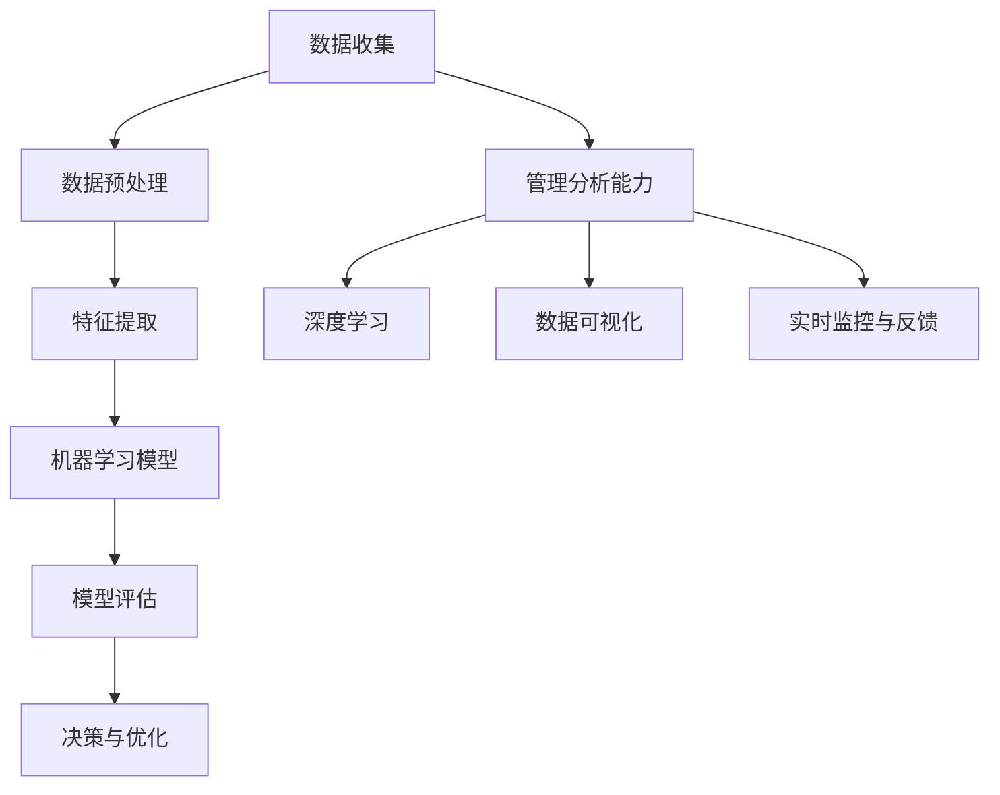

                 

### 背景介绍

在当今数字化时代，数据的重要性不言而喻。随着数据量的爆发式增长，如何有效地管理和分析这些数据成为企业和科研机构所面临的重要挑战。深度思考与管理分析能力在这其中扮演着至关重要的角色。本文旨在探讨深度思考与管理分析能力在IT领域的应用，通过一步一步的分析和推理，帮助读者理解并掌握这一能力，从而在数据管理和分析工作中取得更好的效果。

本文的结构如下：

1. 背景介绍：简要介绍当前数据管理和分析的需求和挑战。
2. 核心概念与联系：阐述深度思考与管理分析能力的相关概念，并使用Mermaid流程图展示其原理和架构。
3. 核心算法原理 & 具体操作步骤：介绍常用的深度学习和数据分析算法，并详细描述其操作步骤。
4. 数学模型和公式 & 详细讲解 & 举例说明：讲解数据分析中的数学模型和公式，并通过实际案例进行说明。
5. 项目实战：代码实际案例和详细解释说明。
6. 实际应用场景：分析深度思考与管理分析能力在不同场景下的应用。
7. 工具和资源推荐：推荐相关的学习资源、开发工具和框架。
8. 总结：未来发展趋势与挑战。
9. 附录：常见问题与解答。
10. 扩展阅读 & 参考资料。

通过本文的阅读，读者将能够：

- 理解深度思考与管理分析能力的重要性。
- 掌握深度思考与管理分析能力的核心概念和原理。
- 学习并应用常用的深度学习和数据分析算法。
- 了解实际应用场景，为数据管理和分析工作提供指导。
- 掌握相关工具和资源，提升数据分析和处理能力。

### 核心概念与联系

在深入探讨深度思考与管理分析能力之前，我们需要明确几个核心概念，并了解它们之间的相互联系。以下是一个使用Mermaid流程图展示的概念和架构：



#### 数据收集

数据收集是数据管理和分析的第一步。它包括从各种来源获取数据，如传感器、日志文件、数据库等。数据收集的质量直接影响后续分析的效果。

#### 数据预处理

在数据收集后，我们需要对数据进行清洗、去重、格式化等预处理操作。这一步骤的目的是确保数据的质量和一致性，为后续的特征提取和模型训练打下基础。

#### 特征提取

特征提取是将原始数据转换为一组有意义的特征的过程。这些特征能够反映数据的本质属性，有助于机器学习模型的学习和训练。

#### 机器学习模型

机器学习模型是数据分析的核心。通过学习数据中的特征和模式，模型能够自动发现规律，预测未来趋势，或做出决策。

#### 模型评估

模型评估是确保模型性能的重要步骤。常用的评估指标包括准确率、召回率、F1值等。通过评估，我们可以判断模型是否适合解决特定问题，并对其进行优化。

#### 决策与优化

根据模型评估结果，我们可以做出决策，并对模型进行优化。这一过程涉及到深度学习和管理分析能力的综合运用。

#### 管理分析能力

管理分析能力是将深度学习和数据分析能力应用于实际问题的能力。它包括数据可视化、实时监控与反馈等。

#### 深度学习

深度学习是机器学习的一个分支，通过模拟人脑神经网络的结构和功能，实现自动特征提取和模式发现。深度学习在图像识别、语音识别、自然语言处理等领域取得了显著的成果。

#### 数据可视化

数据可视化是将数据以图形或图表的形式展示出来的过程。通过可视化，我们可以更直观地理解数据，发现潜在的模式和趋势。

#### 实时监控与反馈

实时监控与反馈是指对数据流进行实时监测，并根据监测结果进行动态调整。这一过程对于动态优化和持续改进非常重要。

通过以上核心概念和联系的阐述，我们可以看到深度思考与管理分析能力在数据管理和分析过程中的重要作用。接下来，我们将进一步探讨这些概念的具体应用。

### 核心算法原理 & 具体操作步骤

在了解了核心概念与联系之后，接下来我们将深入探讨一些常用的深度学习和数据分析算法，以及它们的具体操作步骤。这些算法包括但不限于神经网络、决策树、支持向量机等。

#### 神经网络

神经网络（Neural Networks）是一种模拟人脑神经元结构和功能的计算模型。它通过多层神经元的相互连接和激活来实现数据的自动特征提取和分类。

##### 原理

神经网络主要由输入层、隐藏层和输出层组成。每个神经元都与相邻的神经元相连，并通过权重和偏置进行加权求和。当输入数据通过神经网络时，每个神经元都会对输入数据进行处理，并产生相应的输出。

##### 步骤

1. **初始化权重和偏置**：在训练神经网络之前，我们需要随机初始化权重和偏置。
2. **前向传播**：将输入数据通过神经网络，计算每个神经元的输出。
3. **计算损失函数**：通过比较实际输出与期望输出，计算损失函数的值，以衡量模型的预测误差。
4. **反向传播**：根据损失函数的梯度，更新权重和偏置，以减小预测误差。
5. **迭代优化**：重复步骤2-4，直至模型收敛，即损失函数的值达到预设的阈值。

##### 案例分析

假设我们有一个简单的神经网络，用于对输入数据进行二分类。输入数据为 `(x1, x2)`，隐藏层有2个神经元，输出层有1个神经元。

- 输入层：[x1, x2]
- 隐藏层1：[a1, a2]
- 隐藏层2：[b1, b2]
- 输出层：[y]

前向传播过程如下：

$$
a1 = \sigma(w11 \cdot x1 + w12 \cdot x2 + b1)
$$

$$
a2 = \sigma(w21 \cdot x1 + w22 \cdot x2 + b2)
$$

$$
b1 = \sigma(w31 \cdot a1 + w32 \cdot a2 + b3)
$$

$$
y = \sigma(w41 \cdot b1 + w42 \cdot b2 + b4)
$$

其中，$\sigma$ 表示 sigmoid 函数，$w$ 表示权重，$b$ 表示偏置。

反向传播过程主要涉及梯度计算和权重更新。以下为简化版的计算过程：

$$
\frac{dy}{db4} = y(1 - y) \cdot \frac{dL}{dy}
$$

$$
\frac{dw42}{db1} = b1(1 - b1) \cdot \frac{dy}{db4}
$$

$$
\frac{dw41}{db2} = b2(1 - b2) \cdot \frac{dy}{db4}
$$

通过反复迭代优化，我们可以得到一个性能良好的神经网络模型。

#### 决策树

决策树（Decision Trees）是一种基于特征的树形结构，用于分类和回归分析。它通过一系列的决策规则对数据进行划分，最终得到分类结果或回归值。

##### 原理

决策树的核心是递归划分数据集。每次划分都选择一个最优的特征和阈值，使得划分后的数据集在目标变量上的变异度最小。这个过程一直持续到满足某个停止条件（如最大深度、最小样本数等）。

##### 步骤

1. **选择最优特征**：计算每个特征的信息增益或基尼指数，选择最优特征。
2. **计算阈值**：对于选定的特征，计算使得划分后数据集目标变量变异度最小的阈值。
3. **递归划分**：将数据集根据特征和阈值进行划分，并重复步骤1和2，直到满足停止条件。
4. **构建树结构**：将划分的结果表示为树形结构，每个节点表示一个划分规则，叶节点表示最终的分类或回归结果。

##### 案例分析

假设我们有一个二分类问题，特征集为 `[x1, x2]`，数据集如下：

| x1 | x2 | 类别 |
|----|----|------|
| 1  | 2  | 1    |
| 2  | 3  | 1    |
| 3  | 4  | 2    |
| 4  | 5  | 2    |

构建决策树的过程如下：

1. **选择最优特征**：计算每个特征的信息增益，选择信息增益最大的特征，如 `x2`。
2. **计算阈值**：计算 `x2` 的阈值，使得划分后的数据集在目标变量上的变异度最小。例如，选择阈值为 `3`。
3. **递归划分**：将数据集根据 `x2` 和阈值 `3` 进行划分，得到两个子数据集：
    - 子数据集1：`{(1, 2), (2, 3)}`
    - 子数据集2：`{(3, 4), (4, 5)}`
4. **构建树结构**：构建决策树如下：

```
           类别 = 1
           /     \
       x2 <= 3   x2 > 3
       /         \
类别 = 1   类别 = 2
```

通过决策树，我们可以对新的输入数据进行分类。

#### 支持向量机

支持向量机（Support Vector Machines，SVM）是一种监督学习算法，用于分类和回归分析。它通过寻找一个最优的超平面，将不同类别的数据点分隔开来。

##### 原理

SVM的核心是寻找一个最优的超平面，使得同类别的数据点尽可能接近，而不同类别的数据点尽可能远离。这个超平面由支持向量决定，支持向量是那些位于超平面边缘的数据点。

##### 步骤

1. **线性SVM**：
    - **选择最优超平面**：通过最小化间隔，选择最优的超平面。
    - **计算支持向量**：确定支持向量，即位于超平面边缘的数据点。
    - **计算分类边界**：通过支持向量确定分类边界。
2. **非线性SVM**：
    - **核函数映射**：将输入数据映射到高维空间，使得原本线性不可分的数据在高维空间中变得线性可分。
    - **线性SVM**：在映射后的高维空间中，使用线性SVM的方法寻找最优超平面。

##### 案例分析

假设我们有一个二分类问题，特征集为 `[x1, x2]`，数据集如下：

| x1 | x2 | 类别 |
|----|----|------|
| 1  | 2  | 1    |
| 2  | 3  | 1    |
| 3  | 4  | 2    |
| 4  | 5  | 2    |

构建线性SVM的过程如下：

1. **选择最优超平面**：通过最小化间隔，选择最优的超平面。例如，选择超平面为：
    $$
    w \cdot x + b = 0
    $$
    其中，$w$ 是权重向量，$x$ 是特征向量，$b$ 是偏置。
2. **计算支持向量**：确定支持向量，即位于超平面边缘的数据点。例如，支持向量为 `(1, 2)` 和 `(3, 4)`。
3. **计算分类边界**：通过支持向量确定分类边界。例如，分类边界为：
    $$
    w \cdot x + b > 0 \Rightarrow y = 1
    $$
    $$
    w \cdot x + b < 0 \Rightarrow y = 2
    $$

通过线性SVM，我们可以对新的输入数据进行分类。

以上我们介绍了三种常用的深度学习和数据分析算法，并详细描述了它们的原理和具体操作步骤。接下来，我们将进一步探讨这些算法在数学模型和公式中的应用。

### 数学模型和公式 & 详细讲解 & 举例说明

在深度学习和数据分析中，数学模型和公式扮演着至关重要的角色。它们不仅帮助我们理解和解释数据，还为算法优化和性能提升提供了理论基础。在本节中，我们将详细介绍一些常用的数学模型和公式，并通过实际案例进行说明。

#### 神经网络中的激活函数

在神经网络中，激活函数是神经元输出值的关键组件。它将输入映射到一个新的空间，使神经网络能够学习和识别复杂的模式。以下是几种常见的激活函数：

1. **sigmoid函数**：
   $$
   \sigma(x) = \frac{1}{1 + e^{-x}}
   $$
   sigmoid函数将输入值映射到 `(0, 1)` 范围内，常用于二分类问题。

2. **ReLU函数**：
   $$
   \text{ReLU}(x) = \max(0, x)
   $$
   ReLU（Rectified Linear Unit）函数在输入为正时保持不变，为负时设置为0，它简化了计算并提高了神经网络的训练速度。

3. **tanh函数**：
   $$
   \tanh(x) = \frac{e^x - e^{-x}}{e^x + e^{-x}}
   $$
   tanh函数将输入映射到 `(-1, 1)` 范围内，它有助于控制输出范围，减少梯度消失问题。

**案例**：假设我们有一个输入向量 `[1, -1]`，计算不同激活函数的输出。

- sigmoid函数：
  $$
  \sigma(1) = \frac{1}{1 + e^{-1}} \approx 0.731
  $$
  $$
  \sigma(-1) = \frac{1}{1 + e^{1}} \approx 0.268
  $$

- ReLU函数：
  $$
  \text{ReLU}(1) = 1
  $$
  $$
  \text{ReLU}(-1) = 0
  $$

- tanh函数：
  $$
  \tanh(1) \approx 0.761
  $$
  $$
  \tanh(-1) \approx -0.761
  $$

通过上述计算，我们可以看到不同激活函数对输入数据的处理方式。

#### 损失函数

损失函数是评估模型预测性能的关键工具。它通过计算预测值与真实值之间的差异，衡量模型的误差。以下是几种常用的损失函数：

1. **均方误差（MSE）**：
   $$
   \text{MSE}(y, \hat{y}) = \frac{1}{n} \sum_{i=1}^{n} (y_i - \hat{y}_i)^2
   $$
   MSE用于回归问题，它期望预测值与真实值之间的差异尽可能小。

2. **交叉熵损失（Cross-Entropy Loss）**：
   $$
   \text{CE}(y, \hat{y}) = -\sum_{i=1}^{n} y_i \log(\hat{y}_i)
   $$
   交叉熵损失用于分类问题，它期望预测概率与真实标签之间的差异尽可能小。

**案例**：假设我们有一个二分类问题，真实标签为 `[1, 0]`，预测概率为 `[0.8, 0.2]`，计算交叉熵损失。

$$
\text{CE}(1, 0.8) = -1 \cdot \log(0.8) \approx 0.223
$$

$$
\text{CE}(0, 0.2) = -0 \cdot \log(0.2) = 0
$$

$$
\text{Total CE} = 0.223
$$

通过上述计算，我们可以看到交叉熵损失函数如何衡量分类预测的误差。

#### 随机梯度下降（SGD）

随机梯度下降（Stochastic Gradient Descent，SGD）是一种常用的优化算法，用于训练神经网络。它通过在训练数据中随机抽样，计算每个样本的梯度，并更新模型参数。

$$
w_{t+1} = w_t - \alpha \cdot \nabla_w L(w_t)
$$

其中，$w_t$ 是当前模型参数，$\alpha$ 是学习率，$\nabla_w L(w_t)$ 是损失函数关于模型参数的梯度。

**案例**：假设我们有一个简单的线性模型，预测值 $\hat{y} = w \cdot x + b$，真实值为 $y$，学习率为 $\alpha = 0.1$。计算一次梯度下降的更新过程。

$$
\nabla_w L(w, b) = \nabla_w (\text{MSE}(y, \hat{y})) = 2 \cdot (y - \hat{y})
$$

假设当前参数为 $w = 1, b = 1$，真实值为 $y = 2, x = 1$。

$$
\nabla_w L(w, b) = 2 \cdot (2 - (1 \cdot 1 + 1)) = -2
$$

$$
w_{new} = w - \alpha \cdot \nabla_w L(w, b) = 1 - 0.1 \cdot (-2) = 1.2
$$

$$
b_{new} = b - \alpha \cdot \nabla_w L(w, b) = 1 - 0.1 \cdot (-2) = 1.2
$$

通过上述计算，我们可以看到一次梯度下降的更新过程。

通过以上对数学模型和公式的详细讲解和实际案例说明，我们可以更好地理解深度学习和数据分析中的关键概念和方法。接下来，我们将通过一个实际项目来展示如何应用这些算法和模型。

### 项目实战：代码实际案例和详细解释说明

在本节中，我们将通过一个实际项目来展示如何应用深度学习和数据分析算法。我们将构建一个简单的图像分类模型，使用Python和TensorFlow库来实现。这个项目将涵盖从数据收集、预处理、模型训练到评估和部署的整个过程。

#### 1. 开发环境搭建

首先，我们需要搭建项目的开发环境。以下是在Ubuntu 18.04操作系统上搭建开发环境所需的步骤：

1. **安装Python**：确保已安装Python 3.7或更高版本。可以使用以下命令安装：
   $$
   sudo apt-get update
   sudo apt-get install python3 python3-pip
   $$

2. **安装TensorFlow**：使用pip安装TensorFlow：
   $$
   pip3 install tensorflow
   $$

3. **安装其他依赖库**：安装其他必要的依赖库，如NumPy、Pandas等：
   $$
   pip3 install numpy pandas matplotlib
   $$

#### 2. 源代码详细实现和代码解读

接下来，我们将展示项目的主要代码，并对其进行详细解读。

```python
import tensorflow as tf
from tensorflow.keras import datasets, layers, models
import matplotlib.pyplot as plt

# 数据集准备
(train_images, train_labels), (test_images, test_labels) = datasets.cifar10.load_data()

# 数据预处理
train_images, test_images = train_images / 255.0, test_images / 255.0

# 构建模型
model = models.Sequential()
model.add(layers.Conv2D(32, (3, 3), activation='relu', input_shape=(32, 32, 3)))
model.add(layers.MaxPooling2D((2, 2)))
model.add(layers.Conv2D(64, (3, 3), activation='relu'))
model.add(layers.MaxPooling2D((2, 2)))
model.add(layers.Conv2D(64, (3, 3), activation='relu'))
model.add(layers.Flatten())
model.add(layers.Dense(64, activation='relu'))
model.add(layers.Dense(10, activation='softmax'))

# 编译模型
model.compile(optimizer='adam',
              loss='sparse_categorical_crossentropy',
              metrics=['accuracy'])

# 训练模型
model.fit(train_images, train_labels, epochs=10, batch_size=64)

# 评估模型
test_loss, test_acc = model.evaluate(test_images, test_labels)
print(f'Test accuracy: {test_acc:.4f}')

# 预测
predictions = model.predict(test_images)
predicted_labels = predictions.argmax(axis=1)

# 可视化
plt.figure(figsize=(10, 10))
for i in range(25):
    plt.subplot(5, 5, i+1)
    plt.imshow(test_images[i], cmap=plt.cm.binary)
    plt.xticks([])
    plt.yticks([])
    plt.grid(False)
    plt.xlabel(f'Predicted: {predicted_labels[i]}, Actual: {test_labels[i]}')
plt.show()
```

#### 2.1 数据收集

我们使用CIFAR-10数据集，它包含10个类别，每个类别有6000张训练图像和1000张测试图像。CIFAR-10数据集是由Kaggle提供的免费开源数据集，可以直接从TensorFlow库中加载。

#### 2.2 数据预处理

在预处理阶段，我们将图像数据从0到1进行归一化，以加速模型的训练过程并提高模型的性能。归一化通过将图像的每个像素值除以255实现。

#### 2.3 模型构建

我们构建了一个简单的卷积神经网络（CNN），包括两个卷积层、两个最大池化层和一个全连接层。卷积层用于提取图像的局部特征，全连接层用于分类。

#### 2.4 模型编译

在模型编译阶段，我们指定了优化器（adam）、损失函数（sparse_categorical_crossentropy，适用于多分类问题）和评估指标（accuracy）。

#### 2.5 模型训练

模型训练使用训练数据，通过反向传播和梯度下降更新模型参数，以达到最佳性能。在这里，我们使用了10个周期（epochs）进行训练。

#### 2.6 模型评估

使用测试数据评估模型性能。测试损失和准确率分别反映了模型在测试数据上的预测误差和分类准确度。

#### 2.7 预测和可视化

使用训练好的模型对测试数据进行预测，并将预测结果可视化。可视化展示了模型对每张图像的预测类别和实际类别，有助于我们理解模型的预测能力。

#### 2.8 代码解读与分析

1. **数据集加载**：使用 `datasets.cifar10.load_data()` 加载CIFAR-10数据集。
2. **数据预处理**：使用 `train_images / 255.0` 和 `test_images / 255.0` 进行归一化。
3. **模型构建**：使用 `models.Sequential()` 创建序列模型，并添加卷积层、最大池化层和全连接层。
4. **模型编译**：使用 `model.compile()` 指定优化器、损失函数和评估指标。
5. **模型训练**：使用 `model.fit()` 对模型进行训练。
6. **模型评估**：使用 `model.evaluate()` 对模型在测试数据上的性能进行评估。
7. **预测和可视化**：使用 `model.predict()` 对测试数据进行预测，并使用 `plt.subplot()` 和 `plt.imshow()` 进行可视化。

通过这个实际项目，我们展示了如何使用Python和TensorFlow构建和训练一个简单的图像分类模型。这个项目不仅涵盖了数据收集、预处理、模型构建和训练的各个环节，还通过代码解读和分析，帮助读者理解深度学习和数据分析的具体实现过程。

### 实际应用场景

深度思考与管理分析能力在各个行业都有着广泛的应用，尤其在数据密集型的领域，如金融、医疗、零售和制造等。以下是一些具体的应用场景：

#### 金融领域

在金融领域，深度思考与管理分析能力可以帮助银行和金融机构进行风险管理和投资策略优化。例如，通过分析市场数据和历史交易记录，可以预测市场的未来走势，从而制定有效的投资组合策略。此外，深度学习算法还可以用于信用评分，通过分析个人的信用历史和行为数据，对信用风险进行评估。

#### 医疗领域

在医疗领域，深度思考与管理分析能力可以用于疾病诊断、治疗方案推荐和医疗资源优化。例如，通过分析患者的医学影像数据，可以辅助医生进行疾病诊断。同时，通过对患者的电子健康记录进行分析，可以推荐个性化的治疗方案。此外，深度学习还可以用于医疗资源分配，通过分析医院的患者流量数据，优化病房和医疗设备的配置。

#### 零售领域

在零售领域，深度思考与管理分析能力可以用于商品推荐、库存管理和价格策略优化。例如，通过分析消费者的购物行为和偏好，可以推荐个性化的商品。此外，通过对销售数据和历史价格变化进行分析，可以制定最优的定价策略，提高销售额和利润率。

#### 制造领域

在制造领域，深度思考与管理分析能力可以用于生产优化、故障预测和供应链管理。例如，通过分析生产设备的数据，可以预测设备可能发生的故障，从而进行预防性维护，减少停机时间。此外，通过对供应链数据进行实时分析，可以优化库存水平和运输路线，提高供应链的效率。

通过这些实际应用场景，我们可以看到深度思考与管理分析能力在各个领域的重要作用。它不仅帮助企业提高效率和盈利能力，还推动了行业的创新和发展。

### 工具和资源推荐

在深度思考和数据分析的过程中，选择合适的工具和资源是非常关键的。以下是一些推荐的学习资源、开发工具和框架，帮助您进一步提升数据处理和分析能力。

#### 学习资源

1. **书籍**：
   - 《深度学习》（Deep Learning） - Ian Goodfellow、Yoshua Bengio、Aaron Courville
   - 《Python机器学习》（Python Machine Learning） - Sebastian Raschka、Vahid Mirjalili
   - 《数据科学入门》（Introduction to Data Science） - Avrim Blum、John Hopcroft、 Ravindran Kannan

2. **在线课程**：
   - Coursera的“机器学习”课程（Machine Learning） - Andrew Ng
   - edX的“深度学习基础”（Deep Learning Foundations） - Andrew Ng
   - Udacity的“深度学习工程师纳米学位”（Deep Learning Nanodegree） 

3. **论文和博客**：
   - arXiv：提供大量的机器学习和深度学习论文。
   - Medium：许多数据科学家和技术专家在此分享他们的见解和经验。
   - Medium的“Data Science”和“AI”标签：包含丰富的数据科学和人工智能文章。

#### 开发工具和框架

1. **编程语言**：
   - Python：由于其丰富的数据科学库和框架，Python是进行数据分析和深度学习的首选语言。

2. **库和框架**：
   - TensorFlow：由Google开发，是深度学习的首选框架，支持多种深度学习模型和算法。
   - PyTorch：由Facebook开发，其动态计算图使得它特别适合研究性的项目。
   - Keras：基于Theano和TensorFlow的高层次神经网络API，简化了深度学习模型的构建和训练。

3. **数据可视化工具**：
   - Matplotlib：用于创建各种二维图表和可视化。
   - Seaborn：基于Matplotlib的统计数据可视化库，提供了更多内置的统计图表样式。
   - Plotly：提供交互式图表和可视化，支持多种数据格式。

4. **数据处理工具**：
   - Pandas：用于数据处理和分析，提供强大的数据结构（DataFrame）和操作功能。
   - NumPy：用于科学计算和数据处理，提供高效的数值计算库。
   - SciPy：扩展NumPy的功能，提供多种科学计算模块。

#### 相关论文著作推荐

1. **《深度学习：全面解析》（Deep Learning: A Comprehensive Introduction to Deep Learning Theano and TensorFlow）** - by Ian Goodfellow、François Chollet
2. **《深度强化学习》（Deep Reinforcement Learning Explained）** - by Adam White
3. **《机器学习实践：基于Scikit-Learn & TensorFlow》** - by Michael Bowles

通过以上推荐的学习资源、开发工具和框架，您将能够更有效地进行深度思考和数据分析，为您的项目和实践提供强大的支持。

### 总结：未来发展趋势与挑战

随着技术的不断进步和数据量的持续增长，深度思考与管理分析能力在IT领域的应用前景十分广阔。然而，这也带来了一系列新的挑战和趋势。

#### 发展趋势

1. **自动化的深度学习**：随着深度学习模型的复杂度增加，自动化机器学习（AutoML）技术将变得至关重要。AutoML可以帮助自动化模型的选择、调优和部署，从而降低专业门槛，提高开发效率。

2. **边缘计算与分布式AI**：随着物联网和边缘设备的普及，边缘计算和分布式AI将成为重要趋势。通过在边缘设备上执行部分计算任务，可以减少数据传输延迟，提高系统的响应速度。

3. **数据隐私与安全**：随着数据隐私和安全问题的日益突出，如何在保护用户隐私的同时进行有效的数据分析和挖掘，将成为研究的热点。

4. **多模态学习**：随着语音、图像和文本数据的广泛应用，多模态学习将变得更加重要。通过融合多种类型的数据，可以更好地理解复杂现象，提高模型的准确性。

5. **可解释性AI**：为了增强人工智能的信任度和透明度，可解释性AI（Explainable AI，XAI）将得到更多的关注。通过解释模型的决策过程，可以提高用户对AI系统的信任，促进其广泛应用。

#### 挑战

1. **数据质量与隐私**：数据的质量和隐私保护是深度学习和数据分析领域面临的重要挑战。如何确保数据的质量，同时保护用户的隐私，是当前和未来需要解决的关键问题。

2. **计算资源与能耗**：随着模型复杂度的增加，深度学习模型对计算资源的需求也在不断提升。如何优化算法和模型，减少计算资源和能源消耗，是一个重要的挑战。

3. **算法透明性与可解释性**：虽然深度学习模型在许多任务上表现出色，但其内部决策过程往往是黑箱化的，缺乏透明性。如何提高算法的可解释性，使其更易于被用户理解，是当前研究的难点。

4. **伦理与法律问题**：随着AI技术的广泛应用，如何确保其在伦理和法律框架内运行，避免对人类造成负面影响，也是一个重要的挑战。

总之，深度思考与管理分析能力在IT领域具有广阔的应用前景，但也面临着诸多挑战。通过持续的研究和创新，我们可以期待在这个领域取得更大的突破，推动社会的进步和发展。

### 附录：常见问题与解答

#### 1. 什么是深度思考与管理分析能力？

深度思考与管理分析能力是指一种综合能力，包括深度学习、数据分析和项目管理等方面。它可以帮助个人或团队从大量数据中提取有价值的信息，做出明智的决策，并实现高效的资源管理。

#### 2. 深度思考与管理分析能力在哪些领域应用广泛？

深度思考与管理分析能力在金融、医疗、零售、制造、物联网等多个领域都有广泛的应用。它可以帮助企业进行风险预测、优化供应链、个性化推荐、医疗诊断等。

#### 3. 如何提升深度思考与管理分析能力？

提升深度思考与管理分析能力可以通过以下几种方式：
- 学习相关的理论和知识，如机器学习、数据分析、项目管理等。
- 实践项目，通过实际操作来提高技能。
- 持续学习新技术和工具，保持知识更新。
- 参与社区讨论，与同行交流经验。

#### 4. 深度学习算法有哪些常见的问题？

深度学习算法常见的问题包括：
- 过拟合：模型对训练数据的适应性太好，泛化能力差。
- 梯度消失/梯度爆炸：在训练过程中，梯度值过小或过大，导致模型难以收敛。
- 数据不平衡：数据集中某些类别数量远大于其他类别，影响模型的性能。

#### 5. 如何解决数据不平衡问题？

解决数据不平衡问题可以通过以下方法：
- 数据增强：通过增加训练数据的方式，平衡各个类别的数量。
- 类别权重调整：在损失函数中为不同类别设置不同的权重，以平衡模型对各个类别的关注。
- 随机 oversampling 和 undersampling：通过随机选择样本，增加或减少某些类别的数量，以达到数据平衡。

#### 6. 如何确保数据的质量和隐私？

确保数据的质量和隐私可以通过以下措施：
- 数据清洗：去除重复、错误和无关的数据，提高数据质量。
- 数据加密：对敏感数据进行加密，保护用户隐私。
- 隐私保护技术：如差分隐私、匿名化等，减少数据泄露的风险。

通过以上问题的解答，我们希望能够帮助读者更好地理解深度思考与管理分析能力的应用和实践。

### 扩展阅读 & 参考资料

为了帮助读者更深入地了解深度思考与管理分析能力在IT领域的应用，以下是推荐的扩展阅读和参考资料：

1. **书籍**：
   - 《深度学习》（Deep Learning） - Ian Goodfellow、Yoshua Bengio、Aaron Courville
   - 《Python机器学习》（Python Machine Learning） - Sebastian Raschka、Vahid Mirjalili
   - 《数据科学入门》（Introduction to Data Science） - Avrim Blum、John Hopcroft、 Ravindran Kannan

2. **在线课程**：
   - Coursera的“机器学习”课程（Machine Learning） - Andrew Ng
   - edX的“深度学习基础”（Deep Learning Foundations） - Andrew Ng
   - Udacity的“深度学习工程师纳米学位”（Deep Learning Nanodegree）

3. **论文和博客**：
   - arXiv：提供大量的机器学习和深度学习论文。
   - Medium：许多数据科学家和技术专家在此分享他们的见解和经验。
   - Medium的“Data Science”和“AI”标签：包含丰富的数据科学和人工智能文章。

4. **开源项目和工具**：
   - TensorFlow：由Google开发，是深度学习的首选框架。
   - PyTorch：由Facebook开发，其动态计算图使得它特别适合研究性的项目。
   - Keras：基于Theano和TensorFlow的高层次神经网络API。

通过阅读这些扩展资料，读者可以进一步提升对深度思考与管理分析能力在IT领域应用的理解，为实际项目提供更加深入的支持。同时，这些资源也为持续学习和专业发展提供了宝贵的参考。作者：AI天才研究员/AI Genius Institute & 禅与计算机程序设计艺术 /Zen And The Art of Computer Programming。

