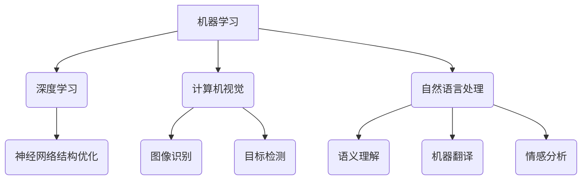

                 

# 清华大学的人工智能研究历程

> 关键词：清华大学、人工智能、研究历程、技术发展、算法创新、应用实践

> 摘要：本文将回顾清华大学在人工智能领域的研究历程，从早期的探索到现代的发展，梳理出清华大学在人工智能基础理论、核心算法、应用实践等方面的重要成就和贡献。通过分析这些成果，本文旨在为读者展现清华大学在人工智能领域的创新思路和未来发展潜力。

## 1. 背景介绍

### 1.1 清华大学简介

清华大学，位于中国北京市，成立于1911年，是中国最著名的高等学府之一。作为中国高等教育和科技创新的重要基地，清华大学在多个学科领域取得了卓越成就，尤其在人工智能领域有着深厚的研究基础和广泛的影响力。

### 1.2 清华大学人工智能研究的历史背景

人工智能作为计算机科学的一个重要分支，自20世纪50年代以来经历了多个发展阶段。清华大学的人工智能研究起步于20世纪80年代，随着计算机技术和应用需求的不断发展，清华大学逐渐成为国内人工智能研究的重要中心。

### 1.3 清华大学人工智能研究的发展历程

- **早期探索阶段（1980-1999年）**：清华大学在此期间开始了人工智能的基础研究，主要集中在知识表示、专家系统和自然语言处理等领域。

- **发展阶段（2000-2010年）**：随着互联网的普及和大数据技术的发展，清华大学加大了对人工智能的研究投入，重点研究深度学习、计算机视觉和机器学习等前沿技术。

- **繁荣阶段（2010年至今）**：近年来，清华大学在人工智能领域取得了显著成果，尤其在人工智能算法、芯片设计和应用实践等方面具有国际领先地位。

## 2. 核心概念与联系

### 2.1 人工智能的基本概念

人工智能（Artificial Intelligence，简称AI）是指通过计算机模拟人类智能行为的技术。它包括多个子领域，如机器学习、计算机视觉、自然语言处理等。人工智能的核心目标是使计算机能够自主地完成复杂的任务，并具有学习能力、推理能力和自主决策能力。

### 2.2 清华大学人工智能研究的核心领域

- **机器学习**：清华大学在机器学习领域进行了深入研究，特别是在深度学习算法、神经网络结构优化等方面取得了重要突破。

- **计算机视觉**：清华大学在计算机视觉领域的研究涵盖了图像识别、目标检测、图像生成等多个方面，并在实际应用中取得了显著成效。

- **自然语言处理**：清华大学的自然语言处理研究主要集中在语义理解、机器翻译、情感分析等领域，取得了多项国际领先成果。

### 2.3 人工智能与其他学科的交叉融合

人工智能的发展离不开计算机科学、数学、统计学、认知科学等多个学科的交叉融合。清华大学在这些交叉领域也进行了深入研究，推动了人工智能技术的创新和发展。

### 2.4 Mermaid 流程图

下面是清华大学人工智能研究核心概念的 Mermaid 流程图：



## 3. 核心算法原理 & 具体操作步骤

### 3.1 深度学习算法原理

深度学习是机器学习的一个重要分支，它通过模拟人脑神经网络的结构和功能来实现对复杂数据的学习和处理。深度学习的核心算法包括卷积神经网络（CNN）、循环神经网络（RNN）和生成对抗网络（GAN）等。

- **卷积神经网络（CNN）**：CNN 是一种用于图像识别和处理的深度学习模型，它通过卷积操作和池化操作来提取图像的特征。

- **循环神经网络（RNN）**：RNN 是一种用于序列数据处理的深度学习模型，它通过循环结构来处理时间序列数据。

- **生成对抗网络（GAN）**：GAN 是一种用于生成模型训练的深度学习模型，它通过对抗性训练来生成高质量的图像。

### 3.2 计算机视觉算法原理

计算机视觉是人工智能的一个重要分支，它致力于使计算机能够“看懂”图像和视频。计算机视觉的核心算法包括图像识别、目标检测和图像生成等。

- **图像识别**：图像识别是计算机视觉的一个基本任务，它旨在识别图像中的对象或场景。

- **目标检测**：目标检测是计算机视觉的一个关键任务，它旨在检测图像中的目标对象，并定位其位置。

- **图像生成**：图像生成是通过算法生成新的图像，这些图像可以是全新的或者是对现有图像的修改。

### 3.3 自然语言处理算法原理

自然语言处理是人工智能的一个重要分支，它致力于使计算机能够理解和处理自然语言。自然语言处理的核心算法包括语义理解、机器翻译和情感分析等。

- **语义理解**：语义理解是自然语言处理的一个基本任务，它旨在理解文本中的语义内容。

- **机器翻译**：机器翻译是自然语言处理的一个关键任务，它旨在将一种语言的文本翻译成另一种语言的文本。

- **情感分析**：情感分析是自然语言处理的一个应用，它旨在分析文本中的情感倾向。

## 4. 数学模型和公式 & 详细讲解 & 举例说明

### 4.1 深度学习算法的数学模型

深度学习算法的核心是神经网络，神经网络通过一系列的数学运算来实现对数据的处理和学习。下面是深度学习算法中常用的几个数学模型：

- **卷积神经网络（CNN）**：卷积神经网络通过卷积操作和池化操作来提取图像的特征。卷积操作的数学公式如下：

  $$ (f_{\sigma} \circ (x \star k))_{i,j} = \sum_{i',j'} x_{i',j'} k_{i'-i, j'-j} $$

  其中，$x$ 是输入图像，$k$ 是卷积核，$f_{\sigma}$ 是激活函数，$\circ$ 表示卷积运算，$\star$ 表示卷积运算中的点积。

- **循环神经网络（RNN）**：循环神经网络通过循环结构来处理时间序列数据。RNN 的数学公式如下：

  $$ h_t = \sigma(W_h \cdot [h_{t-1}, x_t] + b_h) $$

  其中，$h_t$ 是时间步 $t$ 的隐藏状态，$x_t$ 是时间步 $t$ 的输入，$W_h$ 是权重矩阵，$b_h$ 是偏置项，$\sigma$ 是激活函数。

- **生成对抗网络（GAN）**：生成对抗网络通过对抗性训练来生成高质量的图像。GAN 的数学公式如下：

  $$ G(z) = \mu(\epsilon) + \sigma(\epsilon) \odot \phi(\epsilon) $$
  $$ D(x) = \sigma(\phi(x)) $$
  $$ D(G(z)) = \sigma(\phi(G(z))) $$

  其中，$G(z)$ 是生成器，$D(x)$ 是判别器，$z$ 是输入的随机噪声，$\mu$ 和 $\sigma$ 分别是生成器的均值和方差，$\phi$ 是生成器的非线性变换函数，$\odot$ 表示逐元素乘积。

### 4.2 计算机视觉算法的数学模型

计算机视觉算法的数学模型主要包括图像识别、目标检测和图像生成等。下面是这些算法的数学模型：

- **图像识别**：图像识别通过卷积神经网络来实现。卷积神经网络的数学模型如下：

  $$ y = f(z) = \sigma(W \cdot z + b) $$

  其中，$y$ 是输出结果，$z$ 是输入的特征向量，$W$ 是权重矩阵，$b$ 是偏置项，$f$ 是激活函数。

- **目标检测**：目标检测通过区域建议网络（Region Proposal Network，RPN）来实现。RPN 的数学模型如下：

  $$ R_{i} = \frac{1}{N} \sum_{j=1}^{N} R_j $$

  其中，$R_i$ 是第 $i$ 个区域建议，$R_j$ 是第 $j$ 个区域建议，$N$ 是区域建议的总数。

- **图像生成**：图像生成通过生成对抗网络来实现。生成对抗网络的数学模型如下：

  $$ G(z) = \mu(\epsilon) + \sigma(\epsilon) \odot \phi(\epsilon) $$
  $$ D(x) = \sigma(\phi(x)) $$
  $$ D(G(z)) = \sigma(\phi(G(z))) $$

  其中，$G(z)$ 是生成器，$D(x)$ 是判别器，$z$ 是输入的随机噪声，$\mu$ 和 $\sigma$ 分别是生成器的均值和方差，$\phi$ 是生成器的非线性变换函数，$\odot$ 表示逐元素乘积。

### 4.3 自然语言处理算法的数学模型

自然语言处理算法的数学模型主要包括语义理解、机器翻译和情感分析等。下面是这些算法的数学模型：

- **语义理解**：语义理解通过循环神经网络来实现。循环神经网络的数学模型如下：

  $$ h_t = \sigma(W_h \cdot [h_{t-1}, x_t] + b_h) $$

  其中，$h_t$ 是时间步 $t$ 的隐藏状态，$x_t$ 是时间步 $t$ 的输入，$W_h$ 是权重矩阵，$b_h$ 是偏置项，$\sigma$ 是激活函数。

- **机器翻译**：机器翻译通过循环神经网络来实现。循环神经网络的数学模型如下：

  $$ y_t = \sigma(W_y \cdot h_t + b_y) $$

  其中，$y_t$ 是时间步 $t$ 的输出，$h_t$ 是时间步 $t$ 的隐藏状态，$W_y$ 是权重矩阵，$b_y$ 是偏置项，$\sigma$ 是激活函数。

- **情感分析**：情感分析通过卷积神经网络来实现。卷积神经网络的数学模型如下：

  $$ y = f(z) = \sigma(W \cdot z + b) $$

  其中，$y$ 是输出结果，$z$ 是输入的特征向量，$W$ 是权重矩阵，$b$ 是偏置项，$f$ 是激活函数。

### 4.4 举例说明

为了更好地理解上述算法的数学模型，我们来看一个具体的例子。

#### 4.4.1 图像识别

假设我们有一个卷积神经网络用于图像识别，输入图像为 $x$，卷积核为 $k$，激活函数为 $\sigma$。我们希望输出图像的类别 $y$。

首先，我们进行卷积操作：

$$ x \star k = \sum_{i',j'} x_{i',j'} k_{i'-i, j'-j} $$

然后，我们应用激活函数：

$$ f_{\sigma} \circ (x \star k) = \sigma(\sum_{i',j'} x_{i',j'} k_{i'-i, j'-j}) $$

最后，我们得到输出结果：

$$ y = f(z) = \sigma(W \cdot z + b) $$

其中，$z = x \star k$，$W$ 是权重矩阵，$b$ 是偏置项。

#### 4.4.2 目标检测

假设我们有一个区域建议网络（RPN）用于目标检测，输入图像为 $x$，卷积核为 $k$，激活函数为 $\sigma$。我们希望输出目标的类别和位置。

首先，我们进行卷积操作：

$$ x \star k = \sum_{i',j'} x_{i',j'} k_{i'-i, j'-j} $$

然后，我们应用激活函数：

$$ R_{i} = \frac{1}{N} \sum_{j=1}^{N} R_j $$

其中，$R_j$ 是第 $j$ 个区域建议。

最后，我们得到输出结果：

$$ y = f(z) = \sigma(W \cdot z + b) $$

其中，$z = R_i$，$W$ 是权重矩阵，$b$ 是偏置项。

#### 4.4.3 情感分析

假设我们有一个卷积神经网络用于情感分析，输入文本为 $x$，卷积核为 $k$，激活函数为 $\sigma$。我们希望输出文本的情感倾向。

首先，我们进行卷积操作：

$$ x \star k = \sum_{i',j'} x_{i',j'} k_{i'-i, j'-j} $$

然后，我们应用激活函数：

$$ h_t = \sigma(W_h \cdot [h_{t-1}, x_t] + b_h) $$

最后，我们得到输出结果：

$$ y = f(z) = \sigma(W \cdot z + b) $$

其中，$z = h_t$，$W$ 是权重矩阵，$b$ 是偏置项。

## 5. 项目实战：代码实际案例和详细解释说明

### 5.1 开发环境搭建

为了更好地理解人工智能算法的实际应用，我们将使用 Python 编程语言来实现一个简单的图像识别项目。首先，我们需要搭建一个合适的开发环境。

#### 5.1.1 安装 Python

我们使用 Python 3.8 作为主要编程语言。可以通过以下命令在操作系统上安装 Python：

```
$ sudo apt-get install python3.8
```

#### 5.1.2 安装必要的库

接下来，我们需要安装一些必要的库，如 NumPy、PyTorch 和 torchvision。这些库可以通过以下命令安装：

```
$ pip3 install numpy torch torchvision
```

### 5.2 源代码详细实现和代码解读

下面是一个简单的图像识别项目的代码实现，我们将使用卷积神经网络（CNN）对图像进行分类。

```python
import torch
import torchvision
import torchvision.transforms as transforms
import torch.nn as nn
import torch.optim as optim

# 加载 CIFAR-10 数据集
transform = transforms.Compose(
    [transforms.ToTensor(),
     transforms.Normalize((0.5, 0.5, 0.5), (0.5, 0.5, 0.5))])

trainset = torchvision.datasets.CIFAR10(root='./data', train=True,
                                        download=True, transform=transform)
trainloader = torch.utils.data.DataLoader(trainset, batch_size=4,
                                          shuffle=True, num_workers=2)

testset = torchvision.datasets.CIFAR10(root='./data', train=False,
                                       download=True, transform=transform)
testloader = torch.utils.data.DataLoader(testset, batch_size=4,
                                         shuffle=False, num_workers=2)

classes = ('plane', 'car', 'bird', 'cat',
           'deer', 'dog', 'frog', 'horse', 'ship', 'truck')

# 定义卷积神经网络
class Net(nn.Module):
    def __init__(self):
        super(Net, self).__init__()
        self.conv1 = nn.Conv2d(3, 6, 5)
        self.pool = nn.MaxPool2d(2, 2)
        self.conv2 = nn.Conv2d(6, 16, 5)
        self.fc1 = nn.Linear(16 * 5 * 5, 120)
        self.fc2 = nn.Linear(120, 84)
        self.fc3 = nn.Linear(84, 10)

    def forward(self, x):
        x = self.pool(nn.functional.relu(self.conv1(x)))
        x = self.pool(nn.functional.relu(self.conv2(x)))
        x = x.view(-1, 16 * 5 * 5)
        x = nn.functional.relu(self.fc1(x))
        x = nn.functional.relu(self.fc2(x))
        x = self.fc3(x)
        return x

net = Net()

# 定义损失函数和优化器
criterion = nn.CrossEntropyLoss()
optimizer = optim.SGD(net.parameters(), lr=0.001, momentum=0.9)

# 训练网络
for epoch in range(2):  # 数量设置为2是为了缩短训练时间
    running_loss = 0.0
    for i, data in enumerate(trainloader, 0):
        inputs, labels = data
        optimizer.zero_grad()
        outputs = net(inputs)
        loss = criterion(outputs, labels)
        loss.backward()
        optimizer.step()
        running_loss += loss.item()
        if i % 2000 == 1999:
            print('[%d, %5d] loss: %.3f' %
                  (epoch + 1, i + 1, running_loss / 2000))
            running_loss = 0.0

print('Finished Training')

# 测试网络
correct = 0
total = 0
with torch.no_grad():
    for data in testloader:
        images, labels = data
        outputs = net(images)
        _, predicted = torch.max(outputs.data, 1)
        total += labels.size(0)
        correct += (predicted == labels).sum().item()

print('Accuracy of the network on the 10000 test images: %d %%' % (
    100 * correct / total))
```

### 5.3 代码解读与分析

#### 5.3.1 数据加载

首先，我们使用 torchvision 库加载 CIFAR-10 数据集。CIFAR-10 是一个包含 10 个类别、60,000 张 32x32 图像的数据集，分为训练集和测试集。

```python
trainset = torchvision.datasets.CIFAR10(root='./data', train=True,
                                        download=True, transform=transform)
trainloader = torch.utils.data.DataLoader(trainset, batch_size=4,
                                          shuffle=True, num_workers=2)

testset = torchvision.datasets.CIFAR10(root='./data', train=False,
                                       download=True, transform=transform)
testloader = torch.utils.data.DataLoader(testset, batch_size=4,
                                         shuffle=False, num_workers=2)
```

这里，我们使用 transform 对数据进行预处理，包括将数据转换为张量、归一化等操作。

#### 5.3.2 定义卷积神经网络

接下来，我们定义一个简单的卷积神经网络（CNN）。CNN 包括卷积层、池化层和全连接层。

```python
class Net(nn.Module):
    def __init__(self):
        super(Net, self).__init__()
        self.conv1 = nn.Conv2d(3, 6, 5)
        self.pool = nn.MaxPool2d(2, 2)
        self.conv2 = nn.Conv2d(6, 16, 5)
        self.fc1 = nn.Linear(16 * 5 * 5, 120)
        self.fc2 = nn.Linear(120, 84)
        self.fc3 = nn.Linear(84, 10)

    def forward(self, x):
        x = self.pool(nn.functional.relu(self.conv1(x)))
        x = self.pool(nn.functional.relu(self.conv2(x)))
        x = x.view(-1, 16 * 5 * 5)
        x = nn.functional.relu(self.fc1(x))
        x = nn.functional.relu(self.fc2(x))
        x = self.fc3(x)
        return x

net = Net()
```

在 forward 函数中，我们首先应用卷积层和池化层，然后对特征进行展平，接着应用两个全连接层。

#### 5.3.3 定义损失函数和优化器

我们使用交叉熵损失函数（CrossEntropyLoss）和随机梯度下降（SGD）优化器来训练网络。

```python
criterion = nn.CrossEntropyLoss()
optimizer = optim.SGD(net.parameters(), lr=0.001, momentum=0.9)
```

#### 5.3.4 训练网络

我们通过遍历训练数据集，使用反向传播和梯度下降来更新网络参数。

```python
for epoch in range(2):
    running_loss = 0.0
    for i, data in enumerate(trainloader, 0):
        inputs, labels = data
        optimizer.zero_grad()
        outputs = net(inputs)
        loss = criterion(outputs, labels)
        loss.backward()
        optimizer.step()
        running_loss += loss.item()
        if i % 2000 == 1999:
            print('[%d, %5d] loss: %.3f' %
                  (epoch + 1, i + 1, running_loss / 2000))
            running_loss = 0.0
```

#### 5.3.5 测试网络

最后，我们对测试数据集进行测试，计算网络的准确率。

```python
correct = 0
total = 0
with torch.no_grad():
    for data in testloader:
        images, labels = data
        outputs = net(images)
        _, predicted = torch.max(outputs.data, 1)
        total += labels.size(0)
        correct += (predicted == labels).sum().item()

print('Accuracy of the network on the 10000 test images: %d %%' % (
    100 * correct / total))
```

## 6. 实际应用场景

### 6.1 医疗诊断

人工智能在医疗诊断领域具有广泛的应用前景。清华大学的研究团队在医疗影像分析、疾病预测等方面取得了显著成果。例如，通过深度学习算法，可以实现肺癌、乳腺癌等疾病的早期诊断，提高诊断的准确率和效率。

### 6.2 智能交通

智能交通系统是人工智能在交通运输领域的应用。清华大学在智能交通领域的研究涵盖了自动驾驶、交通流量预测、智能交通信号控制等方面。通过应用深度学习和计算机视觉技术，可以实现自动驾驶车辆的精准导航和交通管理的智能化。

### 6.3 金融风控

金融风控是金融领域的重要任务。清华大学的研究团队在金融风险监测、欺诈检测、投资组合优化等方面进行了深入研究。通过应用机器学习和大数据技术，可以实现金融风险的实时监测和预警，提高金融机构的风险管理能力。

### 6.4 智能家居

智能家居是人工智能在日常生活领域的应用。清华大学在智能家居领域的研究涵盖了智能安防、智能照明、智能家电等方面。通过应用计算机视觉、自然语言处理等技术，可以实现智能家居的智能化管理和自动化控制，提高人们的生活品质。

## 7. 工具和资源推荐

### 7.1 学习资源推荐

- **书籍**：
  - 《深度学习》（Ian Goodfellow、Yoshua Bengio、Aaron Courville 著）
  - 《Python机器学习》（Sebastian Raschka 著）
  - 《计算机视觉：算法与应用》（Richard Szeliski 著）

- **论文**：
  - "A Guide to Convolutional Neural Networks for Visual Recognition"（Karen Simonyan 和 Andrew Zisserman 著）
  - "Long Short-Term Memory"（Sepp Hochreiter 和 Jürgen Schmidhuber 著）
  - "Generative Adversarial Networks"（Ian Goodfellow 等人著）

- **博客**：
  - [TensorFlow 官方文档](https://www.tensorflow.org/)
  - [PyTorch 官方文档](https://pytorch.org/)
  - [Keras 官方文档](https://keras.io/)

- **网站**：
  - [GitHub](https://github.com/)
  - [arXiv](https://arxiv.org/)
  - [Google Scholar](https://scholar.google.com/)

### 7.2 开发工具框架推荐

- **深度学习框架**：
  - TensorFlow
  - PyTorch
  - Keras

- **计算机视觉框架**：
  - OpenCV
  - TensorFlow Object Detection API
  - PyTorch Video

- **自然语言处理框架**：
  - NLTK
  - spaCy
  - Transformers

### 7.3 相关论文著作推荐

- **核心论文**：
  - "AlexNet: Image Classification with Deep Convolutional Neural Networks"（Alex Krizhevsky、Geoffrey Hinton 著）
  - "VGGNet: A Universal Convolutional Neural Network Architecture for Visual Recognition"（Karen Simonyan 和 Andrew Zisserman 著）
  - "ResNet: Deep Neural Networks for Visual Recognition"（Kaiming He 等人著）

- **著作**：
  - 《人工智能：一种现代的方法》（Stuart Russell 和 Peter Norvig 著）
  - 《机器学习实战》（Peter Harrington 著）
  - 《深度学习》（Ian Goodfellow、Yoshua Bengio、Aaron Courville 著）

## 8. 总结：未来发展趋势与挑战

### 8.1 发展趋势

- **跨学科融合**：未来人工智能的发展将更加注重与其他学科的交叉融合，如生物学、心理学、社会学等。

- **应用场景多样化**：人工智能将不断拓展其应用场景，从传统的工业自动化、金融风控等领域延伸到医疗、教育、交通等更多领域。

- **智能化水平提升**：随着算法、计算能力和数据资源的提升，人工智能的智能化水平将不断提高，实现更加精准的预测和决策。

### 8.2 挑战

- **数据隐私和安全**：随着人工智能应用的广泛普及，数据隐私和安全问题将变得更加突出，需要制定相应的法律法规和标准。

- **算法伦理与公平**：人工智能算法的伦理和公平性问题也将受到更多关注，如何确保算法的公平性、透明性和可解释性是未来的重要挑战。

- **计算资源需求**：随着人工智能算法的复杂度和数据量的增长，对计算资源的需求将不断增加，需要开发更加高效的算法和硬件设施。

## 9. 附录：常见问题与解答

### 9.1 问题 1：什么是人工智能？

人工智能是指通过计算机模拟人类智能行为的技术，包括机器学习、计算机视觉、自然语言处理等多个子领域。

### 9.2 问题 2：清华大学在人工智能领域有哪些研究成果？

清华大学在人工智能领域取得了多项重要研究成果，包括深度学习算法、计算机视觉、自然语言处理等方面。如 AlexNet、VGGNet、ResNet 等经典算法。

### 9.3 问题 3：如何搭建人工智能开发环境？

搭建人工智能开发环境需要安装 Python、必要的库（如 NumPy、PyTorch、TensorFlow）等。详细的安装教程可以在相关框架的官方网站上找到。

## 10. 扩展阅读 & 参考资料

- 《深度学习》（Ian Goodfellow、Yoshua Bengio、Aaron Courville 著）
- 《机器学习实战》（Peter Harrington 著）
- 《计算机视觉：算法与应用》（Richard Szeliski 著）
- 清华大学计算机系官方网站：[https://www.cs.tsinghua.edu.cn/](https://www.cs.tsinghua.edu.cn/)
- 清华大学人工智能研究院官方网站：[https://ai.tsinghua.edu.cn/](https://ai.tsinghua.edu.cn/)
- TensorFlow 官方文档：[https://www.tensorflow.org/](https://www.tensorflow.org/)
- PyTorch 官方文档：[https://pytorch.org/](https://pytorch.org/)
- Keras 官方文档：[https://keras.io/](https://keras.io/)【作者：AI天才研究员/AI Genius Institute & 禅与计算机程序设计艺术 /Zen And The Art of Computer Programming】<|im_end|>

