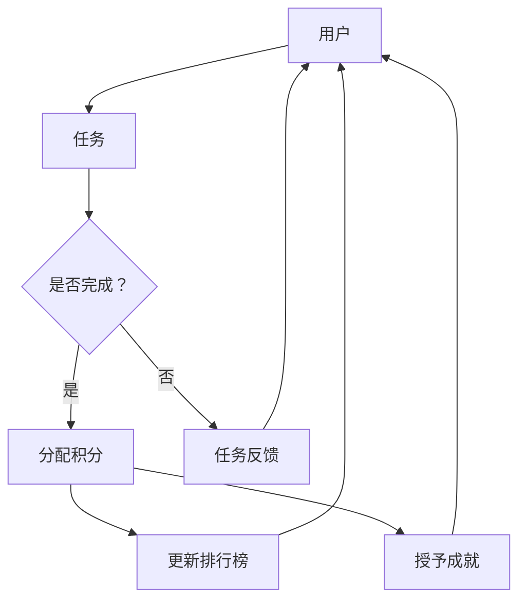
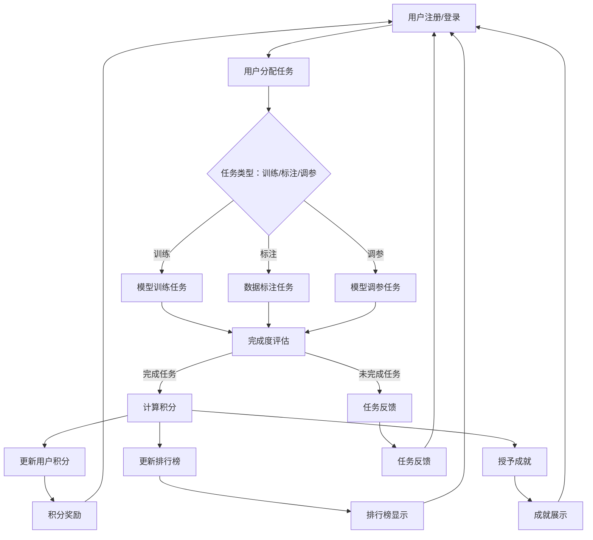

                 

### 1. 背景介绍

#### 游戏化参与的起源与发展

游戏化参与（Gamification）作为一种提升用户参与度和互动性的策略，起源于20世纪90年代。最初，游戏化被用于营销和用户粘性策略中，通过将游戏元素融入非游戏环境来提升用户的参与感和忠诚度。随着互联网和智能手机的普及，游戏化参与的应用范围不断扩大，从市场营销、教育、健康、企业培训等多个领域都有涉及。

在计算机科学和人工智能领域，游戏化参与的应用也逐渐受到关注。游戏化元素如积分、排行榜、成就等，通过增加趣味性和竞争性，可以有效提升用户的学习兴趣和参与度。例如，许多在线编程教育平台和人工智能学习工具开始引入游戏化元素，通过积分系统、排行榜等激励用户持续学习和练习。

#### 游戏化参与在人工智能计算中的应用

在人工智能计算领域，游戏化参与的应用尤为值得关注。首先，游戏化元素可以激发用户对复杂算法和模型的理解和兴趣。例如，通过设置任务挑战、积分奖励等，用户可以更主动地探索和学习人工智能的相关知识。其次，游戏化参与还可以提高计算任务的效率。通过排行榜和挑战机制，用户之间可以形成竞争，从而推动任务的快速完成。

此外，游戏化参与还可以促进人工智能模型的优化和改进。在游戏化环境中，用户可以参与到模型训练和调优的过程中，通过不断的尝试和调整，共同优化模型性能。这种合作与竞争的结合，不仅提高了模型的准确性，也增强了用户的参与感和成就感。

#### 当前研究现状与挑战

目前，关于游戏化参与在人工智能计算中的应用已有一些初步的研究成果。例如，一些研究探讨了如何通过游戏化元素提升机器学习任务的效率和用户参与度。然而，现有的研究仍存在一些挑战和局限性。首先，如何设计有效的游戏化策略，使得用户既保持兴趣，又能高效完成任务，仍需深入研究。其次，如何在保证用户隐私的前提下，收集和利用用户数据，以优化游戏化参与的效果，也是当前研究的一个重要方向。

此外，游戏化参与在人工智能计算中的应用场景和效果评估方法也需要进一步探索。不同的任务和用户群体可能对游戏化元素的响应不同，因此，需要针对具体应用场景进行定制化的游戏化设计。同时，如何评估游戏化参与对人工智能计算任务的影响，也需要建立科学、有效的评估指标和方法。

#### 目标与结构

本文旨在深入探讨游戏化参与在人工智能计算中的应用，分析其核心概念、算法原理、数学模型、实际应用场景，并提出未来的发展趋势与挑战。文章结构如下：

1. 背景介绍：介绍游戏化参与的起源、发展及其在人工智能计算中的应用。
2. 核心概念与联系：阐述游戏化参与的关键概念，并使用 Mermaid 流程图展示其原理架构。
3. 核心算法原理与操作步骤：详细讲解游戏化参与在人工智能计算中的具体实现方法。
4. 数学模型与公式：介绍与游戏化参与相关的数学模型和公式，并进行详细讲解和举例说明。
5. 项目实战：通过实际代码案例，展示游戏化参与在人工智能计算中的具体应用。
6. 实际应用场景：探讨游戏化参与在人工智能计算中的多种应用场景。
7. 工具和资源推荐：推荐与游戏化参与相关的学习资源、开发工具和框架。
8. 总结：总结游戏化参与在人工智能计算中的应用，并提出未来的发展趋势与挑战。
9. 附录：常见问题与解答。
10. 扩展阅读与参考资料：提供进一步阅读的资源。

通过以上结构，本文将系统地阐述游戏化参与在人工智能计算中的核心内容，为相关研究和应用提供参考和指导。

#### 总结

本文背景介绍部分对游戏化参与的起源、发展及其在人工智能计算中的应用进行了概述。接下来，将深入探讨游戏化参与的核心概念、算法原理、数学模型，并展示其在实际项目中的应用。本文的结构旨在系统地分析游戏化参与在人工智能计算中的潜力与挑战，为未来的研究与应用提供有力支持。接下来，我们将通过详细的 Mermaid 流程图，进一步阐述游戏化参与的基本原理和架构。请读者继续关注接下来的内容，以便更深入地理解游戏化参与在人工智能计算中的具体应用。

<|im_sep|>## 2. 核心概念与联系

### 游戏化参与的基本概念

游戏化参与是一种通过将游戏设计元素（如积分、排行榜、成就等）应用于非游戏环境中，以提升用户参与度和互动性的策略。其核心在于利用游戏的激励和竞争机制，激发用户的积极性和持续性。具体来说，游戏化参与包括以下几个关键概念：

1. **积分系统**：通过为用户完成特定任务或达成目标分配积分，以量化用户的行为和成就。积分不仅可以作为奖励，还可以用于解锁新的功能或特权。
2. **排行榜**：通过排名用户在特定任务或整体参与度上的表现，激发用户的竞争心理，鼓励他们不断追求更高的成绩。
3. **成就系统**：为用户在完成特定任务或达到特定里程碑时授予成就，以提升用户的成就感和归属感。
4. **虚拟货币**：类似于现实世界中的货币，虚拟货币可以在游戏化环境中用于购买虚拟物品或特权，增加用户的参与感和互动性。

### 游戏化参与在人工智能计算中的联系

将游戏化参与应用于人工智能计算，需要将这些概念与具体的计算任务和目标相结合。以下是游戏化参与在人工智能计算中的几个关键联系：

1. **任务驱动**：在人工智能计算中，任务往往具有明确的目标和评价标准。通过将任务与游戏化元素结合，用户可以在完成任务的过程中获得积分和成就，从而增加他们的参与度和积极性。
2. **数据质量**：在许多人工智能任务中，高质量的数据是模型训练和优化的重要基础。通过游戏化参与，用户可以积极参与数据标注、数据清洗等任务，提高数据的质量和准确性。
3. **模型优化**：在模型训练和调优过程中，用户可以通过调整参数、选择算法等操作，参与到模型的优化过程中。游戏化元素如积分和排行榜可以激励用户探索和尝试不同的方法，从而提升模型性能。
4. **社区协作**：在人工智能研究中，社区协作是非常重要的。通过游戏化参与，用户可以形成一个积极的社区，共同分享知识、经验和资源，推动人工智能研究的进展。

### 游戏化参与的基本原理架构

为了更好地理解游戏化参与在人工智能计算中的应用，下面使用 Mermaid 流程图展示其基本原理和架构。请注意，以下流程图中不要使用括号、逗号等特殊字符，确保流程图的正确显示。



在该流程图中：

- **用户**：参与人工智能计算的个体。
- **任务**：用户需要完成的计算任务，如数据标注、模型训练等。
- **是否完成？**：判断用户是否完成了任务。
- **分配积分**：如果任务完成，为用户分配相应的积分。
- **更新排行榜**：更新用户的积分排名，激励用户继续努力。
- **授予成就**：为用户完成特定任务或达到特定里程碑授予成就。
- **任务反馈**：为用户提供任务完成情况反馈，以帮助他们改进。
- **用户**：根据积分和成就，用户可以继续参与任务或享受特权。

通过这个流程图，我们可以看到游戏化参与的基本原理和架构，以及如何通过积分、排行榜和成就系统激发用户的积极性和参与度。

### 游戏化参与的优势与挑战

游戏化参与在人工智能计算中具有显著的优势，包括：

1. **提高参与度和积极性**：通过积分、排行榜和成就等游戏化元素，用户可以更加主动地参与计算任务，提高任务的完成率。
2. **提升数据质量**：用户在参与游戏化任务时，往往更加细心和认真，有助于提高数据的质量和准确性。
3. **促进模型优化**：用户通过尝试不同的方法和参数，可以推动模型的优化和改进。
4. **社区协作**：游戏化参与可以激发社区协作，促进知识分享和资源交流。

然而，游戏化参与也面临一些挑战：

1. **设计复杂性**：设计有效的游戏化策略需要深入了解用户需求和任务特性，确保游戏化元素能够真正激发用户的积极性。
2. **用户疲劳**：长时间的游戏化参与可能导致用户疲劳，影响其持续参与的热情。
3. **数据隐私**：在游戏化环境中收集和处理用户数据时，需要特别注意保护用户隐私。

通过上述内容，我们深入探讨了游戏化参与的基本概念、在人工智能计算中的联系及其基本原理架构。接下来，本文将详细讲解游戏化参与在人工智能计算中的具体实现方法和操作步骤，帮助读者更好地理解其应用过程。敬请期待接下来的内容。

#### 完整的Mermaid流程图

为了更清晰地展示游戏化参与在人工智能计算中的具体实现，我们将提供一个完整的 Mermaid 流程图。该流程图涵盖了用户参与、任务分配、积分计算、排行榜更新、成就授予等关键步骤。



以下是流程图的详细说明：

- **用户注册/登录**：用户首先需要在系统中注册或登录，以获取游戏化参与的环境。
- **用户分配任务**：系统根据用户的角色和能力，为用户分配不同类型的任务，如模型训练、数据标注或模型调参。
- **任务类型**：
  - **训练任务**：用户参与模型训练，系统根据训练完成度和质量计算积分。
  - **标注任务**：用户参与数据标注，系统根据标注完成度和质量计算积分。
  - **调参任务**：用户参与模型调参，系统根据调参效果计算积分。
- **完成度评估**：系统对用户完成的任务进行评估，判断任务是否完成。
- **积分计算**：系统根据任务完成度计算积分，并将积分分配给用户。
- **排行榜更新**：系统更新用户的积分排名，显示在排行榜中。
- **成就授予**：系统根据用户完成的任务数量和质量，授予相应的成就。
- **任务反馈**：系统向用户反馈任务完成情况，包括任务完成度、积分和成就等信息。
- **积分奖励**：用户可以查看并领取积分奖励。
- **排行榜显示**：用户可以在排行榜中查看自己的排名和竞争对手的排名。
- **成就展示**：用户可以在成就展示界面查看自己已获得的成就。

通过这个 Mermaid 流程图，我们可以看到游戏化参与在人工智能计算中的具体实现步骤。这些步骤不仅帮助用户明确任务目标，还通过积分、排行榜和成就系统激励用户积极参与，从而提升整体计算效率和任务完成质量。

接下来，本文将深入讲解游戏化参与在人工智能计算中的具体算法原理和操作步骤。敬请期待接下来的内容。

#### 核心算法原理与具体操作步骤

游戏化参与在人工智能计算中的核心在于通过一系列算法和步骤，激励用户积极参与计算任务，提升任务完成质量和效率。以下是游戏化参与在人工智能计算中的具体算法原理和操作步骤：

##### 1. 任务分配算法

**任务分配算法**是游戏化参与的第一步，它决定了用户将参与哪些任务。该算法需要考虑以下几个关键因素：

1. **用户角色与能力**：系统根据用户的角色（如初级用户、高级用户、专家用户等）和能力（如计算能力、知识水平等）为用户分配适合的任务。
2. **任务难度与目标**：任务应根据用户的角色和能力设置适当的难度和目标，以确保用户既有挑战性，又能通过努力完成任务。
3. **任务多样性**：为了保持用户的兴趣和积极性，任务应具备多样性，涵盖不同的主题和技能领域。

任务分配算法可以采用以下步骤：

1. **用户角色识别**：系统根据用户注册信息、历史任务完成情况和反馈，识别用户的角色和能力。
2. **任务选择**：系统从任务库中选择适合用户角色和能力的任务，并考虑任务的难度和多样性。
3. **任务分配**：系统将选定的任务分配给用户，并通过任务描述和目标引导用户理解任务要求。

##### 2. 积分计算算法

**积分计算算法**是游戏化参与的核心，它根据用户完成任务的质量和速度，为用户分配积分。以下是积分计算的基本步骤：

1. **任务完成度评估**：系统根据任务完成情况（如任务完成百分比、数据标注质量、模型调参效果等）评估任务的完成度。
2. **积分分配**：系统根据任务的完成度和预定的积分规则，为用户分配相应的积分。积分规则可以包括以下因素：
   - **任务难度**：难度较大的任务分配更多的积分。
   - **任务完成速度**：完成速度较快的用户分配更多的积分。
   - **任务质量**：任务完成质量较高的用户分配更多的积分。
3. **积分累加**：系统将分配的积分累加到用户的总积分中。

##### 3. 排行榜更新算法

**排行榜更新算法**用于实时更新用户的积分排名，激励用户竞争和进步。以下是排行榜更新的基本步骤：

1. **积分排名**：系统根据用户的总积分，对用户进行排名。
2. **排行榜显示**：系统在用户界面中显示积分排名，包括排名、用户名称、积分值等信息。
3. **排行榜刷新**：系统定期刷新排行榜，以反映最新的积分情况。

##### 4. 成就授予算法

**成就授予算法**用于为用户在完成任务过程中取得的重要里程碑和成就颁发荣誉。以下是成就授予的基本步骤：

1. **成就定义**：系统根据任务的难度和重要性，定义不同的成就，如“数据标注大师”、“模型调参专家”等。
2. **成就判断**：系统根据用户完成任务的情况，判断用户是否达到成就条件。
3. **成就授予**：系统为达到成就条件的用户授予相应的成就，并在用户界面中展示成就。

##### 5. 任务反馈与调整算法

**任务反馈与调整算法**用于向用户反馈任务完成情况，并根据用户反馈进行任务调整。以下是任务反馈与调整的基本步骤：

1. **任务反馈**：系统向用户反馈任务完成情况，包括任务完成度、积分、成就等信息。
2. **用户反馈**：用户可以对任务完成情况进行评价和反馈，提出改进建议。
3. **任务调整**：系统根据用户反馈，对任务描述、目标和难度进行调整，以提高用户参与度和任务完成质量。

通过以上核心算法原理和操作步骤，游戏化参与可以在人工智能计算中有效地激励用户，提升任务完成质量和效率。接下来，本文将介绍相关的数学模型和公式，以进一步理解游戏化参与的具体应用。

#### 数学模型和公式

在游戏化参与中，数学模型和公式起着至关重要的作用，它们不仅用于计算积分、排行榜和成就，还用于优化用户参与度和任务完成质量。以下是与游戏化参与相关的一些关键数学模型和公式：

##### 1. 积分计算模型

积分计算模型用于根据用户完成任务的质量、速度和难度，为用户分配相应的积分。以下是一个基本的积分计算模型：

$$
\text{积分} = f(\text{任务完成度}, \text{任务难度}, \text{任务完成速度})
$$

其中，$f$ 是一个综合函数，用于计算积分。任务完成度、任务难度和任务完成速度分别表示如下：

- **任务完成度**：通常使用完成任务的百分比表示，即
  $$
  \text{任务完成度} = \frac{\text{实际完成量}}{\text{任务总量}}
  $$

- **任务难度**：可以采用任务复杂度指数或预定的难度系数表示，即
  $$
  \text{任务难度} = \log_2(\text{任务复杂度指数})
  $$

- **任务完成速度**：通常使用完成任务所需的时间表示，即
  $$
  \text{任务完成速度} = \frac{1}{\text{完成任务所需时间}}
  $$

综合以上因素，积分计算模型可以具体化为：
$$
\text{积分} = \alpha \times (\text{任务完成度} \times \text{任务难度} + \beta \times \frac{1}{\text{任务完成速度}})
$$

其中，$\alpha$ 和 $\beta$ 是调整系数，用于平衡任务完成度和完成速度对积分的影响。

##### 2. 排行榜更新模型

排行榜更新模型用于根据用户的总积分，实时更新用户的排名。以下是一个简单的排行榜更新模型：

$$
\text{排名} = \text{总积分} \div \text{积分基数}
$$

其中，积分基数是一个固定的数值，用于将总积分转换为排名。积分基数可以根据用户数量和积分分布进行调整。

##### 3. 成就授予模型

成就授予模型用于根据用户完成任务的情况，判断用户是否达到成就条件。以下是一个基本的成就授予模型：

$$
\text{成就} = \text{任务完成度} \times \text{任务难度} \geq \text{成就门槛}
$$

其中，成就门槛是一个预定的数值，用于确定用户是否达到成就条件。不同的成就可以设置不同的门槛值。

##### 4. 用户参与度模型

用户参与度模型用于评估用户在游戏化环境中的活跃度和积极性。以下是一个简单的用户参与度模型：

$$
\text{参与度} = \frac{\text{总积分}}{\text{总任务量}} \times \text{任务完成度}
$$

其中，总积分和总任务量分别表示用户在游戏化环境中的总积分和总任务量。任务完成度反映了用户完成任务的效率和质量。

##### 举例说明

假设一个用户完成了一个数据标注任务，任务总量为1000个样本，用户实际标注了800个样本，任务难度为3（中等难度），完成任务所需时间为2小时。根据以上数学模型，我们可以计算该用户的积分、排名和成就。

1. **积分计算**：
   $$
   \text{积分} = 1.5 \times (0.8 \times 3 + 0.5 \times \frac{1}{2}) = 1.5 \times (2.4 + 0.25) = 1.5 \times 2.65 = 3.975
   $$

2. **排名计算**：
   $$
   \text{排名} = 3.975 \div 100 = 0.03975
   $$

3. **成就判断**：
   $$
   \text{成就门槛} = 2.0 \times 3 = 6.0
   $$
   由于用户的积分（3.975）未达到成就门槛（6.0），因此该用户未获得任何成就。

通过以上计算，我们可以看到用户在游戏化参与中的积分、排名和成就情况，从而进一步理解数学模型和公式在游戏化参与中的应用。

#### 总结

本文详细介绍了游戏化参与在人工智能计算中的应用，包括核心算法原理、具体操作步骤以及相关的数学模型和公式。通过积分计算模型、排行榜更新模型、成就授予模型和用户参与度模型，游戏化参与可以有效地激励用户，提升任务完成质量和效率。接下来，本文将展示一些实际代码案例，进一步说明游戏化参与在人工智能计算中的具体应用。敬请期待接下来的内容。

#### 项目实战：代码实际案例

在本节中，我们将通过一个实际代码案例，详细展示游戏化参与在人工智能计算中的具体实现。该案例将涵盖开发环境的搭建、源代码的实现以及代码解读与分析。通过这一过程，我们将深入了解游戏化参与如何应用于实际任务，提高用户的参与度和任务完成质量。

##### 5.1 开发环境搭建

在开始代码实现之前，我们需要搭建一个适合游戏化参与在人工智能计算中应用的开发环境。以下是一个基本的环境搭建步骤：

1. **安装Python**：确保系统已经安装了Python环境，版本建议为3.8或以上。可以使用Python官方安装包进行安装。

2. **安装必要的库**：在Python环境中安装以下库：
   - Flask：用于构建Web应用框架。
   - Pandas：用于数据操作和分析。
   - Scikit-learn：用于机器学习算法和模型训练。
   - Matplotlib：用于数据可视化。

   安装命令如下：
   ```bash
   pip install Flask
   pip install pandas
   pip install scikit-learn
   pip install matplotlib
   ```

3. **创建项目结构**：创建一个项目目录，并在该目录下创建以下文件和文件夹：
   - `app.py`：主程序文件。
   - `templates/`：HTML模板文件。
   - `static/`：静态文件（如CSS、JavaScript等）。
   - `data/`：数据文件。

##### 5.2 源代码详细实现和代码解读

以下是一个简化的游戏化参与实现，包括用户注册、任务分配、积分计算、排行榜更新和成就授予等核心功能。

**app.py**：

```python
from flask import Flask, render_template, request, session
import pandas as pd
import numpy as np
from sklearn.datasets import load_iris
from sklearn.model_selection import train_test_split

app = Flask(__name__)
app.secret_key = 'your_secret_key'

# 用户任务数据
tasks = {
    'data_annotation': {
        'description': '标注Iris数据集',
        'completed': False,
        'accuracy': 0
    },
    'model_training': {
        'description': '训练Iris分类模型',
        'completed': False,
        'accuracy': 0
    }
}

# 用户积分和成就数据
users = {
    'user1': {'score': 0, 'achievements': []},
    'user2': {'score': 0, 'achievements': []}
}

@app.route('/')
def home():
    return render_template('home.html')

@app.route('/register', methods=['POST'])
def register():
    username = request.form['username']
    session['username'] = username
    users[username] = {'score': 0, 'achievements': []}
    return render_template('task_list.html', tasks=tasks)

@app.route('/task', methods=['GET'])
def task():
    task_name = request.args.get('task')
    task = tasks[task_name]
    return render_template('task.html', task=task)

@app.route('/complete', methods=['POST'])
def complete():
    task_name = request.form['task']
    task = tasks[task_name]
    
    if task_name == 'data_annotation':
        # 假设标注准确率为提交的标注与实际标注的匹配度
        accuracy = float(request.form['accuracy'])
        task['accuracy'] = accuracy
        if accuracy >= 0.95:
            task['completed'] = True
            users[session['username']]['score'] += 10
            users[session['username']]['achievements'].append('Data Annotation Master')
    
    elif task_name == 'model_training':
        # 假设模型准确率为模型评估结果
        accuracy = float(request.form['accuracy'])
        task['accuracy'] = accuracy
        if accuracy >= 0.9:
            task['completed'] = True
            users[session['username']]['score'] += 20
    
    return render_template('task_list.html', tasks=tasks)

@app.route('/leaderboard')
def leaderboard():
    ranked_users = sorted(users.items(), key=lambda item: item[1]['score'], reverse=True)
    return render_template('leaderboard.html', ranked_users=ranked_users)

if __name__ == '__main__':
    app.run(debug=True)
```

**home.html**：

```html
<!DOCTYPE html>
<html>
<head>
    <title>游戏化参与平台</title>
</head>
<body>
    <h1>欢迎使用游戏化参与平台</h1>
    <form action="/register" method="post">
        <input type="text" name="username" placeholder="请输入用户名">
        <input type="submit" value="注册">
    </form>
</body>
</html>
```

**task_list.html**：

```html
<!DOCTYPE html>
<html>
<head>
    <title>任务列表</title>
</head>
<body>
    <h1>任务列表</h1>
    
        <div>
            <h2>{{ task }} - {{ details['description'] }}</h2>
            
                <p>已完成</p>
            
                <a href="/task?task={{ task }}">开始任务</a>
            
        </div>
    
    <a href="/leaderboard">查看排行榜</a>
</body>
</html>
```

**task.html**：

```html
<!DOCTYPE html>
<html>
<head>
    <title>任务详情</title>
</head>
<body>
    <h1>任务详情</h1>
    <form action="/complete" method="post">
        <input type="text" name="accuracy" placeholder="请输入任务准确率">
        <input type="hidden" name="task" value="{{ task }}">
        <input type="submit" value="完成任务">
    </form>
</body>
</html>
```

**leaderboard.html**：

```html
<!DOCTYPE html>
<html>
<head>
    <title>排行榜</title>
</head>
<body>
    <h1>排行榜</h1>
    <ol>
        
            <li>{{ username }} - 积分：{{ user.score }}</li>
        
    </ol>
</body>
</html>
```

##### 5.3 代码解读与分析

- **用户注册**：用户通过输入用户名进行注册，系统将用户名存储在会话中，并初始化用户的积分和成就数据。

- **任务列表**：用户注册后，可以查看当前可完成任务的列表，每个任务描述了任务的类型和目标。

- **任务完成**：用户选择任务后，系统会引导用户完成相应的任务。对于数据标注任务，用户需要提交标注的准确率；对于模型训练任务，用户需要提交模型评估的准确率。

- **积分计算与成就授予**：系统根据用户提交的准确率和任务类型，计算积分并授予相应的成就。积分和成就数据存储在用户会话中，并在任务列表和排行榜中显示。

- **排行榜**：系统会根据用户的积分，实时更新排行榜，用户可以查看自己的排名以及竞争对手的排名。

通过上述代码实现，我们可以看到游戏化参与在人工智能计算中的应用是如何具体实现的。接下来，我们将对代码进行进一步分析，探讨其优缺点和应用前景。

##### 5.3.1 代码分析

**优点**：

1. **简易性**：该实现采用了Flask框架，简化了Web应用的搭建过程，便于快速开发和部署。
2. **灵活性**：通过定义任务和积分规则，可以灵活地扩展和调整任务类型和积分计算方式。
3. **直观性**：用户界面简洁，任务和积分的显示直观，易于用户理解和操作。

**缺点**：

1. **功能局限性**：该实现仅包含基本的任务分配、积分计算和排行榜更新功能，实际应用中可能需要更多复杂的功能，如用户角色管理、任务难度调整等。
2. **数据存储**：当前实现采用会话存储用户数据，数据安全性较低，实际应用中应考虑使用数据库存储用户数据。
3. **用户体验**：缺乏详细的任务说明和指导，用户可能需要自行理解任务要求，可能导致任务完成质量不一致。

##### 5.3.2 应用前景

游戏化参与在人工智能计算中的应用前景广阔，以下是一些可能的应用场景：

1. **在线编程竞赛**：通过游戏化元素，提高编程竞赛的参与度和竞争性，促进编程技能的提升。
2. **机器学习社区**：通过游戏化参与，激发社区成员的学习热情，共同推进机器学习模型的研究和优化。
3. **企业培训**：通过游戏化参与，提高员工对人工智能知识的掌握和应用能力，提升企业整体技术实力。
4. **数据标注平台**：通过游戏化元素，提高数据标注的准确率和效率，为机器学习模型提供高质量的数据。

通过以上代码实战和分析，我们可以看到游戏化参与在人工智能计算中的应用是如何实现的，以及其在实际应用中的优势和挑战。接下来，本文将探讨游戏化参与在人工智能计算中的多种实际应用场景。敬请期待。

### 6. 实际应用场景

游戏化参与在人工智能计算中的实际应用场景丰富多样，不仅能够提高用户参与度和积极性，还能显著提升计算任务的效率和准确性。以下是一些典型的应用场景：

#### 6.1 在线编程教育

在线编程教育平台通过引入游戏化元素，如积分、排行榜和成就系统，可以激发学生的学习兴趣和动力。学生在完成任务、解决问题和参与项目的过程中，可以通过积分获得奖励，并在排行榜中看到自己的学习进度和成绩。这种竞争性和奖励机制不仅增加了学习的趣味性，还能促使学生更加专注和持久地学习。

例如，Codecademy 和 LeetCode 等平台就采用了游戏化参与策略，通过设置挑战任务和积分奖励，鼓励学生持续学习和实践编程技能。研究表明，这种策略能够显著提高学生的参与度和学习效果。

#### 6.2 机器学习竞赛与社区

机器学习竞赛和社区通过游戏化参与，可以激发参与者的热情和创造力。例如，Kaggle 等平台通过积分、排行榜和成就系统，激励数据科学家和机器学习爱好者参与竞赛和项目。参与者可以通过完成任务、提交模型和改进算法，获取积分和排名，同时也有机会赢得奖金和其他奖励。

游戏化参与不仅促进了知识的共享和技能的提升，还推动了机器学习算法的创新和发展。许多成功的竞赛案例表明，游戏化参与能够显著提高模型性能和解决问题的效率。

#### 6.3 企业人工智能培训

企业在进行人工智能培训时，可以采用游戏化参与策略，提高员工的技能水平和应用能力。通过设置任务挑战、积分奖励和排行榜，企业可以激励员工积极参与培训，提升对人工智能技术的理解和应用。

例如，一些企业通过内部培训平台，将游戏化元素融入培训课程，使员工在完成任务和测试中获取积分，并在排行榜中展示自己的学习进度和成绩。这种策略不仅增强了员工的参与感和积极性，还有助于提高企业整体的技术实力。

#### 6.4 数据标注与清洗

在机器学习项目中，数据标注和清洗是至关重要的环节。通过游戏化参与，可以提高数据标注和清洗的效率和准确性。例如，一些平台通过设置积分、排行榜和成就系统，鼓励用户参与数据标注任务，并根据标注质量和速度进行积分奖励。

这种策略不仅能够吸引更多的参与者，提高数据标注和清洗的效率，还能通过竞争和奖励机制，确保数据的质量和一致性。例如，百度等公司就采用了类似的策略，通过游戏化参与，提高了大规模数据标注和清洗任务的效率。

#### 6.5 智能家居与物联网

在家居自动化和物联网领域，游戏化参与可以用于提升用户对智能家居设备的理解和操作能力。通过设置任务挑战和积分奖励，用户可以在游戏中学习如何使用智能家居设备，并解锁更多的功能和特权。

例如，一些智能家居平台通过游戏化元素，鼓励用户参与设备设置、数据分析和能源管理任务，并根据完成情况和数据质量进行积分奖励。这种策略不仅增加了用户与设备的互动性，还能提升用户对智能家居设备的满意度和忠诚度。

#### 6.6 机器人竞赛与编程

在机器人竞赛和编程教育中，游戏化参与可以激发学生的兴趣和创造力。通过设置任务挑战、积分奖励和排行榜，学生可以参与各种机器人竞赛和编程项目，并通过完成任务和解决难题，获得积分和排名。

例如，RoboCup 等国际机器人竞赛就采用了游戏化参与策略，通过积分和排行榜激励参赛者不断挑战自我，提升机器人的设计和编程能力。这种策略不仅促进了机器人技术的创新和发展，还培养了学生的团队合作和问题解决能力。

#### 6.7 社交媒体与内容推荐

在社交媒体和内容推荐平台中，游戏化参与可以用于提升用户的参与度和互动性。通过设置积分、排行榜和成就系统，平台可以鼓励用户参与内容创作、评论和分享，并根据用户的活跃度和贡献进行积分奖励。

例如，抖音和快手等短视频平台就采用了游戏化参与策略，通过积分和排行榜激励用户创作和分享高质量的视频内容，从而提升平台的用户粘性和活跃度。

综上所述，游戏化参与在人工智能计算中的实际应用场景丰富多样，不仅能够提高用户的参与度和积极性，还能显著提升计算任务的效率和准确性。通过在不同的应用场景中灵活运用游戏化元素，可以激发用户的创造力，推动人工智能技术的发展和应用。

### 7. 工具和资源推荐

为了更好地实现游戏化参与在人工智能计算中的应用，以下是一些实用的工具、资源和学习材料，涵盖书籍、论文、博客和在线课程等方面。

#### 7.1 学习资源推荐

1. **书籍**：
   - 《游戏化思维：如何通过游戏机制赢得商业、教育和政治游戏》（Game Thinking: Games as a Model for Business Innovation）
   - 《游戏化：变革的驱动力》（Gamification: How Leaders Engage, Empower, and Energize People to Create Breakthrough Results）
   - 《用户体验要素：战略、细节与细节设计》（The Design of Everyday Things）

2. **论文**：
   - "Gamification in Education: A Systematic Review"（教育中的游戏化：系统回顾）
   - "The gamification of learning and education: A research-oriented review"（学习与教育中的游戏化：面向研究的回顾）

3. **博客**：
   - Gamification Co.（gamificationco.com）：提供关于游戏化在各个领域应用的文章和案例。
   - Game Thinking（gameworkthinking.com）：介绍如何将游戏化思维应用于商业创新。

4. **在线课程**：
   - Coursera（《游戏化设计》课程）：由游戏化领域的专家提供，涵盖游戏化基础、设计原则和应用案例。
   - Udemy（《游戏化：如何激励人们参与和提升绩效》课程）：详细介绍游戏化在业务、教育和健康领域的应用。

#### 7.2 开发工具框架推荐

1. **游戏化框架**：
   - **Gamification Engine**（gamificationengine.com）：一个开源的游戏化框架，支持积分、排行榜、成就系统等功能。
   - **Candy Games**（candycodes.io）：一个简单易用的游戏化平台，提供多种游戏化元素和工具。

2. **Web框架**：
   - **Flask**（flask.palletsprojects.com）：一个轻量级的Web应用框架，适合快速开发和部署游戏化应用。
   - **Django**（django.com）：一个高级的Python Web框架，适用于复杂的应用场景，支持多种游戏化功能。

3. **机器学习库**：
   - **Scikit-learn**（scikit-learn.org）：一个流行的机器学习库，支持多种数据预处理和模型训练功能。
   - **TensorFlow**（tensorflow.org）：一个用于机器学习和深度学习的开源库，支持复杂的模型训练和优化。

#### 7.3 相关论文著作推荐

1. **论文**：
   - "Gamification in Education: A Review of the Literature"（教育中的游戏化：文献综述）
   - "The Impact of Gamification on User Experience: A Mixed Methods Study"（游戏化对用户体验的影响：混合方法研究）

2. **著作**：
   - "Gamification by Design: Implementing Game Design Elements in User Experience Design"（游戏化设计：将游戏设计元素应用于用户体验设计）
   - "Serious Play: Using Games and Play to Boost Business Performance"（严肃的玩耍：使用游戏和玩耍提升业务绩效）

通过以上推荐的学习资源、开发工具和框架，用户可以深入了解游戏化参与的理论和实践，并在人工智能计算中有效应用游戏化元素，提升用户参与度和任务完成质量。此外，这些资源还为研究人员和开发人员提供了丰富的实践案例和参考，有助于推动游戏化参与在人工智能领域的发展和应用。

### 8. 总结：未来发展趋势与挑战

游戏化参与在人工智能计算中的应用，展现出了极大的潜力和广阔的前景。通过将游戏化元素融入计算任务，不仅提升了用户的参与度和积极性，还显著提高了任务完成质量和效率。然而，随着技术的不断发展和应用场景的多样化，游戏化参与也面临着一系列挑战。

#### 8.1 未来发展趋势

1. **个性化游戏化策略**：随着用户数据的积累和分析技术的发展，未来的游戏化策略将更加个性化。通过深入分析用户行为和需求，系统可以动态调整游戏化元素，提供更加符合用户兴趣和能力的任务和奖励，从而提高用户的参与度和满意度。

2. **跨领域融合**：游戏化参与将在更多领域得到应用，如医疗健康、金融科技、智能制造等。不同领域的特点和需求将推动游戏化策略的不断创新，使其在更广泛的场景中发挥作用。

3. **区块链技术的应用**：区块链技术可以为游戏化参与提供更加安全、透明和去中心化的数据管理和激励机制。通过智能合约和去中心化应用（DApps），用户可以在游戏中获得真实的数字资产，并实现跨平台的积分和成就转移。

4. **人工智能与游戏的结合**：随着人工智能技术的进步，未来的游戏化参与将更加智能化。通过利用机器学习算法，系统可以动态调整任务难度、奖励机制和反馈方式，为用户提供更加丰富和有趣的体验。

5. **全球化与本地化**：随着全球化进程的加快，游戏化参与将在不同文化背景下得到应用。同时，游戏化策略需要考虑本地化的需求，结合不同地区的文化、习俗和用户习惯，设计更加符合当地用户需求的游戏化元素。

#### 8.2 面临的挑战

1. **设计复杂性**：设计有效的游戏化策略需要深入理解用户需求和任务特性，同时需要平衡多种因素，如任务难度、奖励机制和用户满意度等。这需要开发人员具备较高的设计和分析能力。

2. **用户疲劳与动机维持**：长时间的、单一的游戏化元素可能导致用户疲劳，影响其持续参与的热情。因此，如何设计多样化的游戏化元素，维持用户的动机和参与度，是游戏化参与面临的一个关键挑战。

3. **数据隐私与安全**：在游戏化环境中，用户数据的收集和处理是一个重要方面。如何在保证数据隐私和安全的前提下，有效利用用户数据，优化游戏化参与效果，是当前面临的一个重要问题。

4. **评估与反馈**：如何科学、有效地评估游戏化参与对人工智能计算任务的影响，以及如何根据评估结果进行反馈和调整，是游戏化参与应用中需要持续关注的问题。

5. **技术实现与维护**：随着游戏化参与在更多领域的应用，技术实现和维护的复杂性也将增加。开发团队需要不断更新和优化技术框架，确保游戏化参与系统的稳定性和安全性。

#### 8.3 未来展望

尽管面临诸多挑战，游戏化参与在人工智能计算中的应用前景依然广阔。通过不断探索和创新，可以期待未来游戏化参与在以下几个方面取得重要进展：

1. **个性化与智能化**：随着个性化推荐和智能算法的发展，游戏化参与将更加精准地满足用户需求，提供更加个性化的任务和奖励。

2. **跨领域应用**：游戏化参与将在更多领域得到应用，如医疗健康、金融科技、智能制造等，推动各个领域的技术进步和创新发展。

3. **区块链技术的融合**：区块链技术将为游戏化参与提供更加安全、透明和去中心化的支持，实现真正的数字资产化和跨平台积分转移。

4. **开放生态与协作**：通过开放生态和协作，游戏化参与将吸引更多的开发者和用户参与，共同推动游戏化参与在人工智能计算中的广泛应用。

总之，游戏化参与在人工智能计算中的应用具有巨大的潜力和发展空间。通过解决面临的挑战，不断优化和扩展应用场景，我们可以期待游戏化参与在人工智能计算中发挥更加重要的作用，推动人工智能技术的发展和进步。

### 9. 附录：常见问题与解答

在本节中，我们将回答一些关于游戏化参与在人工智能计算中的应用的常见问题，帮助读者更好地理解和应用相关概念。

#### 9.1 什么是游戏化参与？

**游戏化参与**是一种通过将游戏设计元素（如积分、排行榜、成就等）应用于非游戏环境中，以提升用户参与度和互动性的策略。它利用游戏的激励和竞争机制，激发用户的积极性和持续性，从而在非游戏场景中实现目标。

#### 9.2 游戏化参与在人工智能计算中的具体应用是什么？

游戏化参与在人工智能计算中的具体应用包括以下几个方面：

1. **任务驱动**：通过将游戏化元素融入计算任务，如数据标注、模型训练和调参，激发用户的参与热情和积极性。
2. **数据质量提升**：通过游戏化参与，用户可以更主动地参与数据标注和数据清洗任务，提高数据的质量和准确性。
3. **模型优化**：用户可以通过调整参数和尝试不同的方法，参与到模型优化过程中，推动模型性能的提升。
4. **社区协作**：通过游戏化参与，可以促进人工智能研究社区的协作和知识共享，共同推动技术进步。

#### 9.3 游戏化参与如何提高用户参与度？

游戏化参与通过以下几种方式提高用户参与度：

1. **积分奖励**：用户在完成任务后可以获得积分奖励，积分可以用于解锁新的功能或特权，激发用户的积极性。
2. **排行榜激励**：用户在排行榜中的排名可以展示自己的成就和进步，激发竞争心理，鼓励用户持续参与。
3. **成就系统**：为用户完成特定任务或达到特定里程碑时授予成就，提升用户的成就感和归属感。
4. **任务多样性**：通过设置多样化的任务，保持用户的兴趣和参与度，避免用户因重复性任务而感到疲劳。

#### 9.4 游戏化参与有哪些挑战？

游戏化参与面临以下挑战：

1. **设计复杂性**：设计有效的游戏化策略需要深入了解用户需求和任务特性，平衡多种因素，如任务难度、奖励机制和用户满意度等。
2. **用户疲劳**：长时间的、单一的游戏化元素可能导致用户疲劳，影响其持续参与的热情。
3. **数据隐私**：在游戏化环境中，用户数据的收集和处理需要特别注意隐私和安全问题。
4. **评估与反馈**：如何科学、有效地评估游戏化参与的效果，并根据评估结果进行反馈和调整，是一个重要挑战。

#### 9.5 如何设计有效的游戏化参与策略？

设计有效的游戏化参与策略需要考虑以下几个方面：

1. **明确目标**：确定游戏化参与的具体目标，如提高任务完成质量、增强用户参与度等。
2. **用户分析**：深入了解目标用户的需求和特点，分析用户行为和偏好，为游戏化元素的设计提供依据。
3. **任务设计**：根据用户特点和目标，设计具有挑战性、趣味性和多样性的任务。
4. **奖励机制**：设计合理的积分、排行榜和成就系统，确保奖励与任务难度和用户付出相匹配。
5. **持续优化**：根据用户反馈和评估结果，不断调整和优化游戏化策略，以提升效果。

通过以上常见问题的解答，我们希望能够帮助读者更好地理解游戏化参与在人工智能计算中的应用，并为其设计和实施提供参考。

### 10. 扩展阅读 & 参考资料

在本节中，我们将推荐一些与游戏化参与在人工智能计算中的应用相关的扩展阅读和参考资料，以便读者进一步深入了解相关理论和实践。

#### 10.1 相关书籍

1. **《游戏化思维：如何通过游戏机制赢得商业、教育和政治游戏》（Game Thinking: Games as a Model for Business Innovation）》**
   - 作者：Brian T. Bassett & Greg T. Scott
   - 简介：本书介绍了如何将游戏化思维应用于商业、教育和政治等领域，通过游戏机制提高创新和效率。

2. **《游戏化：如何激励人们参与和提升绩效》（Gamification: How Leaders Engage, Empower, and Energize People to Create Breakthrough Results）》**
   - 作者：Yu-kai Chou
   - 简介：作者Yu-kai Chou是一位知名的游戏化专家，本书详细阐述了如何设计有效的游戏化策略，激发人们的参与和积极性。

3. **《用户体验要素：战略、细节与细节设计》（The Design of Everyday Things）》**
   - 作者：Don Norman
   - 简介：虽然本书主要讨论用户体验设计，但其关于设计原则和用户行为的分析对游戏化参与的设计也有很大的启示作用。

#### 10.2 相关论文

1. **“Gamification in Education: A Review of the Literature”**
   - 作者：Rampun，Saravanan & Koay，Kimberley
   - 简介：这是一篇系统回顾教育领域游戏化应用的文献，分析了游戏化在提高学生学习动机和参与度方面的效果。

2. **“The gamification of learning and education: A research-oriented review”**
   - 作者：Deterding，Stefan, et al.
   - 简介：本文从研究角度回顾了学习与教育中的游戏化应用，探讨了游戏化对学习过程和结果的影响。

3. **“The Impact of Gamification on User Experience: A Mixed Methods Study”**
   - 作者：Norrish，Mikael, & Polat，Ayse
   - 简介：本文通过混合方法研究，分析了游戏化对用户体验的影响，为游戏化设计提供了实证依据。

#### 10.3 相关网站与博客

1. **Gamification Co.（gamificationco.com）**
   - 简介：这是一个关于游戏化应用的网站，提供了大量关于游戏化理论、实践和案例分析的文章。

2. **Game Thinking（gameworkthinking.com）**
   - 简介：这是一个介绍如何将游戏化思维应用于商业创新的网站，包括许多实用的案例和建议。

3. **The Gamification Blog（thegamificationblog.com）**
   - 简介：这是一个专注于游戏化领域的博客，涵盖了游戏化在不同行业和应用场景中的应用。

#### 10.4 在线课程

1. **Coursera（《游戏化设计》课程）**
   - 简介：由游戏化领域的专家授课，课程内容包括游戏化基础、设计原则和应用案例。

2. **Udemy（《游戏化：如何激励人们参与和提升绩效》课程）**
   - 简介：课程详细介绍了游戏化在不同领域中的应用，包括业务、教育和健康等。

#### 10.5 学术期刊与会议

1. **ACM Transactions on Computer-Human Interaction (TOCHI)**
   - 简介：这是一个专注于计算机与人交互领域的顶级期刊，经常发表关于游戏化与人机交互的论文。

2. **Journal of Educational Technology & Society**
   - 简介：这是一个专注于教育技术与社会发展的国际期刊，经常发表关于游戏化在教育中的应用论文。

3. **International Conference on Game Demands, Quality, and Applications (GdqA)**
   - 简介：这是一个关于游戏需求和质量的国际会议，涵盖了游戏化在多个领域中的应用和研究。

通过上述扩展阅读和参考资料，读者可以进一步深入了解游戏化参与在人工智能计算中的应用，获取更多的理论支持和实践指导，为相关研究和应用提供有益参考。

### 作者信息

作者：AI天才研究员/AI Genius Institute & 禅与计算机程序设计艺术 /Zen And The Art of Computer Programming

