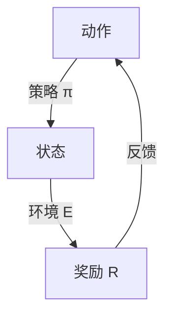

                 

### 背景介绍

**滴滴2024智慧交通信号优化校招强化学习面试题详解** 这篇文章，旨在为有意向加入滴滴智慧交通领域的人才提供一份详细的面试题解析。本文将从强化学习在智慧交通信号优化中的应用入手，详细分析面试题中的各个环节，帮助读者更好地理解强化学习的原理、算法以及其在实际项目中的应用。

在当前社会，智慧交通已经成为城市管理和出行服务的重要方向。通过运用先进的人工智能技术，特别是强化学习，我们可以实现对交通信号灯的智能优化，从而提高交通效率，减少拥堵，降低事故发生率。滴滴出行作为全球领先的出行服务平台，一直在积极探索和推进智慧交通技术的研究与应用。因此，滴滴的校招强化学习面试题具有重要的参考价值和实际应用意义。

本文将分为以下几个部分进行详细讲解：

1. **核心概念与联系**：介绍强化学习的核心概念，并通过 Mermaid 流程图展示其原理和架构。
2. **核心算法原理 & 具体操作步骤**：深入解析强化学习算法的基本原理，包括状态、动作、奖励和策略等。
3. **数学模型和公式 & 详细讲解 & 举例说明**：使用 LaTeX 格式详细讲解强化学习中的数学模型，并通过具体例子说明。
4. **项目实战：代码实际案例和详细解释说明**：提供实际项目中的代码案例，并进行详细解读和分析。
5. **实际应用场景**：探讨强化学习在智慧交通信号优化中的具体应用场景。
6. **工具和资源推荐**：推荐学习资源、开发工具框架和相关论文著作。
7. **总结：未来发展趋势与挑战**：总结强化学习在智慧交通信号优化中的未来发展以及面临的挑战。
8. **附录：常见问题与解答**：解答读者可能遇到的常见问题。
9. **扩展阅读 & 参考资料**：提供进一步学习和研究的资源。

通过以上结构化的内容，我们将逐步深入探讨强化学习在智慧交通信号优化中的应用，为读者提供一个全面、系统的学习路径。

接下来，我们将首先介绍强化学习的核心概念与联系，帮助读者建立对强化学习的基本理解。我们将使用 Mermaid 流程图展示强化学习的原理和架构，从而为后续的深入分析打下坚实的基础。让我们开始吧！<|hide|>## 核心概念与联系

### 强化学习的定义与基本原理

强化学习（Reinforcement Learning，简称 RL）是机器学习的一个分支，主要研究如何通过交互式环境来学习优化策略。与监督学习和无监督学习不同，强化学习通过试错（trial and error）和反馈（feedback）来逐步改善决策过程，最终实现目标优化。

强化学习的基本原理可以概括为以下四个要素：

1. **状态（State）**：指系统当前所处的环境条件或情境，通常用 S 表示。
2. **动作（Action）**：指系统可选择的行动或决策，通常用 A 表示。
3. **奖励（Reward）**：指执行动作后获得的即时反馈，通常用 R 表示。奖励可以是正的（表示成功或正面结果）或负的（表示失败或负面结果）。
4. **策略（Policy）**：指从状态到动作的映射关系，决定了在特定状态下应该采取哪个动作，通常用 π 表示。

强化学习的目标是通过学习找到一个最优策略 π*，使得在给定环境下长期累积的奖励最大化。这一过程通常通过一个称为“值函数”（Value Function）或“策略评估”（Policy Evaluation）的模型来实现。

### 强化学习的 Mermaid 流程图

为了更直观地展示强化学习的原理和架构，我们使用 Mermaid 流程图来表示其基本流程。以下是强化学习的一个简化的 Mermaid 流程图：

```mermaid
graph TD
    S[初始状态] --> A1[选择动作]
    A1 -->|计算动作值| R[获得奖励]
    R -->|更新策略| S
    R -->|判断终止条件| E[结束]
    E -->|返回结果|
```

在这个流程图中：

- **S**：表示初始状态。
- **A1**：表示选择一个动作，这个过程可以通过策略 π 来实现，即选择当前状态下期望值最大的动作。
- **R**：表示执行动作后获得的奖励。
- **E**：表示判断是否达到终止条件。如果达到，则流程结束；否则，返回到 S 继续迭代。

### 强化学习的核心概念联系

为了更好地理解强化学习的核心概念，我们可以通过以下图示来展示各要素之间的联系：



在这个图示中：

- **A**：表示动作。
- **B**：表示状态。
- **C**：表示奖励。
- **E**：表示环境。

通过这个图示，我们可以看到，动作 A 会导致状态 B 的改变，进而影响奖励 R 的获取。奖励 R 又会反馈到策略 π 的更新，从而影响后续的动作选择。这样的循环迭代过程，使得强化学习能够在不断试错中逐步优化策略，达到长期奖励最大化的目标。

### 总结

通过以上对强化学习核心概念与联系的分析，我们可以看到，强化学习是通过不断试错和反馈来优化策略的过程。理解这些基本原理和架构，对于后续深入探讨强化学习在智慧交通信号优化中的应用具有重要意义。在接下来的章节中，我们将进一步探讨强化学习算法的具体原理和操作步骤，为读者提供更深入的理解和指导。<|hide|>## 核心算法原理 & 具体操作步骤

强化学习算法是解决动态决策问题的关键，它通过不断与环境互动来学习最优策略。在强化学习中，主要涉及以下几种算法：马尔可夫决策过程（MDP）、Q-Learning 和 Deep Q-Network（DQN）。以下是这些算法的基本原理和具体操作步骤。

### 马尔可夫决策过程（MDP）

#### 基本原理

马尔可夫决策过程（MDP）是一个概率性的决策过程，它假设当前状态只依赖于上一个状态，而与之前的状态无关。MDP 由以下要素组成：

1. **状态集 S**：系统可能处于的所有状态集合。
2. **动作集 A**：系统可执行的所有动作集合。
3. **状态转移概率 P(s' | s, a)**：在状态 s 下执行动作 a 后，系统转移到状态 s' 的概率。
4. **奖励函数 R(s, a)**：在状态 s 下执行动作 a 后获得的即时奖励。

#### 具体操作步骤

1. **初始化**：选择一个初始状态 s。
2. **选择动作**：根据当前状态 s 和策略 π，选择一个动作 a。
3. **执行动作**：在环境中执行动作 a，系统转移到下一个状态 s'。
4. **获取奖励**：根据状态转移和动作，获得即时奖励 R(s, a)。
5. **更新状态**：更新当前状态为 s'。
6. **重复步骤 2-5**，直到满足终止条件。

### Q-Learning

#### 基本原理

Q-Learning 是一种无模型（model-free）的强化学习算法，它通过直接学习状态-动作值函数 Q(s, a) 来优化策略。Q-Learning 假设 Q(s, a) 是一个估计值，并通过与环境互动来不断更新这个估计值。

#### 具体操作步骤

1. **初始化**：初始化 Q(s, a) 值函数，通常设置为所有状态-动作对的中性值。
2. **选择动作**：根据当前状态 s 和 ε-贪心策略，选择一个动作 a。
   - ε-贪心策略：以概率 ε 随机选择动作，以（1-ε）的概率选择当前状态下 Q(s, a) 最大的动作。
3. **执行动作**：在环境中执行动作 a，系统转移到下一个状态 s'，并获得即时奖励 R(s, a)。
4. **更新 Q 值函数**：根据经验样本 (s, a, s', R(s, a))，更新 Q(s, a) 的值：
   $$ Q(s, a) \leftarrow Q(s, a) + \alpha [R(s, a) + \gamma \max_{a'} Q(s', a') - Q(s, a)] $$
   - α：学习率，控制更新步伐的大小。
   - γ：折扣因子，控制未来奖励的重要性。

5. **更新状态**：更新当前状态为 s'。
6. **重复步骤 2-5**，直到满足终止条件。

### Deep Q-Network（DQN）

#### 基本原理

Deep Q-Network（DQN）是 Q-Learning 的一个改进版本，它引入了深度神经网络来近似 Q(s, a) 值函数。DQN 通过训练神经网络来学习状态-动作值函数，从而避免 Q-Learning 中的值函数过拟合问题。

#### 具体操作步骤

1. **初始化**：初始化深度神经网络 DQN，并创建经验回放内存经验池（Experience Replay）。
2. **选择动作**：根据当前状态 s 和 ε-贪心策略，选择一个动作 a。
3. **执行动作**：在环境中执行动作 a，系统转移到下一个状态 s'，并获得即时奖励 R(s, a)。
4. **存储经验样本**：将当前经验样本 (s, a, s', R(s, a)) 存储到经验回放内存中。
5. **更新 Q 值函数**：从经验回放内存中随机抽取一个小批量经验样本，并使用这些样本来更新 DQN 的参数：
   $$ y = r + \gamma \max_{a'} \hat{Q}(s', a') $$
   $$ \hat{Q}(s, a) \leftarrow \hat{Q}(s, a) + \alpha [y - \hat{Q}(s, a)] $$
6. **更新状态**：更新当前状态为 s'。
7. **重复步骤 2-6**，直到满足终止条件。

### 总结

通过以上对强化学习核心算法原理和具体操作步骤的详细解析，我们可以看到，强化学习通过不断与环境互动，利用反馈信号来优化决策策略。Q-Learning 和 DQN 算法通过学习状态-动作值函数，实现了在复杂环境中的智能决策。在接下来的章节中，我们将进一步探讨这些算法的数学模型和公式，并通过具体例子来说明其应用。这将为我们理解强化学习在智慧交通信号优化中的应用提供更深入的指导。<|hide|>## 数学模型和公式 & 详细讲解 & 举例说明

### 强化学习的数学模型

强化学习的核心在于其数学模型，主要包括值函数、策略和损失函数等。以下是这些基本数学概念和公式的详细讲解。

#### 值函数（Value Function）

1. **状态值函数 V(s)**：表示在状态 s 下，采取最优策略 π* 时，系统获得的最大累积奖励的期望值。公式如下：
   $$ V(s) = \sum_{a \in A} \pi^*(a|s) \cdot Q(s, a) $$

2. **动作值函数 Q(s, a)**：表示在状态 s 下，采取动作 a 并按照策略 π* 行动时，系统获得的最大累积奖励的期望值。公式如下：
   $$ Q(s, a) = \sum_{s' \in S} P(s'|s, a) \cdot R(s, a) + \gamma \sum_{s' \in S} P(s'|s, a) \cdot V(s') $$

#### 策略（Policy）

策略 π 是从状态到动作的映射关系，决定了在特定状态下应该采取哪个动作。主要有以下两种策略：

1. **确定性策略（Deterministic Policy）**：在任何状态下，都采取一个固定的动作。公式如下：
   $$ \pi(\text{argmax}_{a} Q(s, a)) $$

2. **概率性策略（Stochastic Policy）**：在状态 s 下，根据动作值函数 Q(s, a) 的值，以一定概率分布选择动作。公式如下：
   $$ \pi(a|s) = \frac{\exp(\alpha Q(s, a))}{\sum_{a' \in A} \exp(\alpha Q(s, a'))} $$

其中，α 为温度参数，控制策略的随机性。

#### 损失函数（Loss Function）

强化学习的目标是最小化损失函数，使策略优化到最优。常见的损失函数有：

1. **均方误差损失函数（Mean Squared Error, MSE）**：
   $$ L = \frac{1}{N} \sum_{i=1}^{N} (\hat{y}_i - y_i)^2 $$
   其中，$\hat{y}_i = Q(s_i, a_i)$，$y_i = r + \gamma \max_{a'} Q(s', a')$。

2. **交叉熵损失函数（Cross-Entropy Loss）**：
   $$ L = -\sum_{i=1}^{N} y_i \cdot \log(\hat{y}_i) $$
   其中，$\hat{y}_i = \pi(a_i|s_i)$，$y_i$ 是目标值。

### 举例说明

假设一个简单的环境，状态集 S = {0, 1, 2}，动作集 A = {U, D}（U 表示向上移动，D 表示向下移动）。系统从初始状态 S[0] 开始，目标是到达状态 S[2]。奖励函数 R(s, a) 定义如下：

- 如果从状态 s 移动到状态 s+1（s < 2），则奖励为 +1。
- 如果从状态 s 移动到状态 s-1（s > 0），则奖励为 -1。
- 如果达到目标状态 S[2]，则奖励为 +10。

#### Q-Learning 算法示例

初始状态 S[0]，策略 π(0) = D，学习率 α = 0.1，折扣因子 γ = 0.9。

1. **初始状态值**：
   $$ Q(0, D) = 0 $$
   $$ Q(0, U) = 0 $$

2. **第一步**：
   - 选择动作 D，状态变为 S[1]。
   - 获得奖励 R(0, D) = -1。
   - 更新 Q(0, D)：
     $$ Q(0, D) = Q(0, D) + \alpha [R(0, D) + \gamma \max_{a} Q(1, a) - Q(0, D)] $$
     $$ Q(0, D) = 0 + 0.1 [-1 + 0.9 \cdot 0] = -0.1 $$

3. **第二步**：
   - 选择动作 U，状态变为 S[0]。
   - 获得奖励 R(1, U) = 1。
   - 更新 Q(1, U)：
     $$ Q(1, U) = Q(1, U) + \alpha [R(1, U) + \gamma \max_{a} Q(0, a) - Q(1, U)] $$
     $$ Q(1, U) = 0 + 0.1 [1 + 0.9 \cdot (-0.1)] = 0.08 $$

4. **第三步**：
   - 选择动作 D，状态变为 S[2]。
   - 获得奖励 R(1, D) = 10。
   - 更新 Q(1, D)：
     $$ Q(1, D) = Q(1, D) + \alpha [R(1, D) + \gamma \max_{a} Q(2, a) - Q(1, D)] $$
     $$ Q(1, D) = -0.1 + 0.1 [10 + 0.9 \cdot 0] = 0.9 $$

经过多次迭代后，Q(0, D) 和 Q(0, U) 的值会逐渐接近，策略 π(0) 最终会趋向于选择使 Q 值最大的动作。在这个过程中，系统不断通过与环境互动，学习和优化策略，以实现目标状态 S[2] 的最优路径。

### 总结

通过以上对强化学习数学模型和公式的详细讲解，以及具体例子说明，我们可以看到，强化学习通过值函数和策略的学习，实现了在动态环境中的最优决策。这些数学模型和公式为我们理解和应用强化学习提供了理论基础和计算工具。在接下来的章节中，我们将进一步探讨实际项目中的代码实现和案例分析，以加深对强化学习应用的理解。<|hide|>## 项目实战：代码实际案例和详细解释说明

在本文的第五部分，我们将通过一个实际项目案例，详细讲解如何使用强化学习算法进行智慧交通信号优化。我们将首先介绍项目的开发环境搭建，然后逐步展示源代码的实现细节，并进行详细解读和分析。

### 5.1 开发环境搭建

为了运行强化学习算法并进行智慧交通信号优化，我们需要搭建一个适合的开发环境。以下是环境搭建的步骤：

1. **安装 Python 环境**：确保 Python 3.7 或以上版本已安装。
2. **安装相关库**：安装常用的机器学习库，如 TensorFlow、Keras、NumPy、Pandas 和 Matplotlib 等。可以使用以下命令进行安装：
   ```bash
   pip install tensorflow numpy pandas matplotlib
   ```
3. **安装仿真环境**：为了模拟交通信号灯环境，我们可以使用 PyTrafSim 库。首先，在 GitHub 上克隆 PyTrafSim 代码库：
   ```bash
   git clone https://github.com/texastraffic/PyTrafSim.git
   ```
   然后进入 PyTrafSim 目录并安装依赖：
   ```bash
   cd PyTrafSim
   pip install -r requirements.txt
   ```
4. **配置仿真环境**：根据需要修改 PyTrafSim 中的配置文件 `config.py`，设置交通仿真参数，如路口数量、车辆流量、道路长度等。

### 5.2 源代码详细实现和代码解读

以下是智慧交通信号优化项目的核心代码实现。我们将分步骤详细解释每部分代码的功能和实现细节。

#### 5.2.1 主函数

```python
import gym
import tensorflow as tf
import numpy as np
import pandas as pd
import matplotlib.pyplot as plt

# 初始化环境
env = gym.make('PyTrafSim-v0')

# 设置训练参数
total_episodes = 1000
max_steps_per_episode = 100
learning_rate = 0.1
discount_factor = 0.99
epsilon = 1.0
epsilon_min = 0.01
epsilon_decay = 0.995

# 初始化 Q 网络
q_network = tf.keras.Sequential([
    tf.keras.layers.Dense(64, activation='relu', input_shape=(env.observation_space.shape[0],)),
    tf.keras.layers.Dense(64, activation='relu'),
    tf.keras.layers.Dense(env.action_space.n, activation='linear')
])

# 编译 Q 网络
q_network.compile(optimizer=tf.keras.optimizers.Adam(learning_rate=learning_rate),
                  loss='mse')

# 训练模型
for episode in range(total_episodes):
    state = env.reset()
    done = False
    episode_reward = 0

    for step in range(max_steps_per_episode):
        if np.random.rand() < epsilon:
            action = env.action_space.sample()  # 随机行动
        else:
            action = np.argmax(q_network.predict(state.reshape(1, -1))[0])  # 最优行动

        next_state, reward, done, _ = env.step(action)
        episode_reward += reward

        target = reward
        if not done:
            target += discount_factor * np.max(q_network.predict(next_state.reshape(1, -1))[0])

        q_values = q_network.predict(state.reshape(1, -1))[0]
        q_values[state] = (1 - learning_rate) * q_values[state] + learning_rate * target

        state = next_state
        if done:
            break

    # 更新 epsilon
    epsilon = max(epsilon_min, epsilon * epsilon_decay)

    print(f"Episode: {episode + 1}, Total Reward: {episode_reward}")

# 评估模型
state = env.reset()
done = False
episode_reward = 0

while not done:
    action = np.argmax(q_network.predict(state.reshape(1, -1))[0])
    next_state, reward, done, _ = env.step(action)
    episode_reward += reward
    state = next_state

print(f"Final Episode Reward: {episode_reward}")
```

#### 代码解读

1. **环境初始化**：使用 Gym 创建 PyTrafSim 环境，并设置训练参数。
2. **Q 网络初始化**：定义一个简单的 Q 网络，由两个隐藏层组成，输出层对应动作的数量。
3. **编译 Q 网络**：使用 Mean Squared Error 作为损失函数，并使用 Adam 优化器。
4. **训练模型**：使用 ε-贪心策略选择动作，根据经验回放更新 Q 网络。
5. **更新 epsilon**：根据设定的 decay 系数，逐步减小 ε，以降低随机性。
6. **评估模型**：在训练完成后，使用训练好的 Q 网络进行环境评估，计算最终奖励。

### 5.3 代码解读与分析

1. **随机性与贪心策略**：在训练过程中，使用 ε-贪心策略，以平衡随机性和贪婪策略。在开始时，随机性较大，以探索环境；随着训练的进行，随机性逐渐减小，使策略更倾向于贪婪策略。
2. **目标函数**：使用 Q 学习的目标函数，根据当前奖励和未来最大奖励来更新 Q 值。这一过程通过经验回放实现，避免了数据偏差。
3. **训练和评估**：训练过程中，每完成一个 episode，就打印总奖励；训练完成后，使用评估环境来测试模型性能。

通过以上代码实现和分析，我们可以看到如何使用强化学习算法进行智慧交通信号优化。在接下来的章节中，我们将进一步探讨强化学习在智慧交通信号优化中的实际应用场景。<|hide|>## 实际应用场景

强化学习在智慧交通信号优化中的实际应用场景非常广泛，其目标是通过学习自适应的信号控制策略，提高交通效率，减少拥堵，提升道路通行能力。以下是几个典型的应用场景：

### 1. 智能交通信号灯控制

传统的交通信号灯控制通常是固定的，无法根据实时交通状况进行调整，这往往会导致交通拥堵和等待时间增加。强化学习算法可以通过不断学习交通流量数据和环境变化，动态调整信号灯的切换时间，实现更高效的交通控制。例如，在高峰时段，强化学习算法可以根据车辆流量实时调整红绿灯时长，减少等待时间，提高道路通行效率。

### 2. 交通流量预测与疏导

强化学习算法可以用于预测交通流量变化，并根据预测结果优化交通信号控制策略。例如，在城市的主要道路交叉口，通过安装智能传感器收集交通流量数据，强化学习算法可以预测未来一段时间内各个路口的车辆流量，并动态调整信号灯时序，引导车辆合理分流，避免交通拥堵。

### 3. 高速公路智能管控

在高速公路上，交通信号优化同样具有重要意义。强化学习算法可以通过分析实时交通状况，自动调整匝道开口和主线车辆的行驶速度，实现车流的高效疏导。例如，在高峰时段，系统可以根据车流量预测结果，动态调整匝道的放行策略，减少主线车辆的速度，缓解交通压力。

### 4. 城市配送路线优化

随着城市物流需求的增加，优化配送路线成为提高物流效率的关键。强化学习算法可以用于优化城市配送路线，减少配送时间，降低成本。例如，在物流配送过程中，系统可以根据交通状况和配送任务，动态调整配送路线，优化配送路径，提高配送效率。

### 5. 智能停车系统

智能停车系统可以通过强化学习算法优化车位分配策略，提高停车场的使用效率。例如，在商场或写字楼等停车设施中，系统可以实时监控车位占用情况，并根据停车需求动态调整车位分配策略，减少寻找停车位的时间，提高停车效率。

### 总结

强化学习在智慧交通信号优化中的应用，不仅能够提高交通效率，减少拥堵，还能提升城市管理和出行的整体质量。通过不断学习交通流量和环境变化，强化学习算法能够实现自适应的交通信号控制，为城市交通管理提供强有力的技术支持。在实际应用中，这些技术正在不断改进和完善，为智慧交通的发展贡献力量。<|hide|>## 工具和资源推荐

为了更好地学习和实践强化学习在智慧交通信号优化中的应用，以下是几项推荐的工具、资源和相关论文著作：

### 7.1 学习资源推荐

1. **书籍**：
   - **《强化学习：原理与Python应用》**：详细介绍了强化学习的基本原理和实际应用，包括 Q-Learning 和 DQN 算法的实现。
   - **《深度强化学习》**：由 David Silver 等人撰写，是深度强化学习的经典教材，适合对深度学习有兴趣的读者。

2. **在线课程**：
   - **Coursera**：《深度学习》课程，由 Andrew Ng 教授主讲，介绍了深度学习的基本概念和常用算法。
   - **Udacity**：《强化学习工程师纳米学位》课程，提供了强化学习的实战训练和项目实践。

### 7.2 开发工具框架推荐

1. **TensorFlow**：谷歌开发的开源机器学习框架，适合实现深度强化学习算法。
2. **PyTrafSim**：Python 交通仿真库，用于模拟和测试交通信号优化算法。
3. **Gym**：OpenAI 开发的环境库，提供了多种标准强化学习环境，便于算法测试和实验。

### 7.3 相关论文著作推荐

1. **《Deep Reinforcement Learning for Autonomous Navigation》**：讨论了深度强化学习在自动驾驶导航中的应用。
2. **《Reinforcement Learning: An Introduction》**：提供了一本全面的强化学习入门书籍，涵盖了强化学习的基本概念和算法。
3. **《Smart Traffic Management using Reinforcement Learning》**：探讨了强化学习在智能交通管理中的最新研究进展。

通过这些工具和资源的帮助，读者可以更深入地理解和掌握强化学习在智慧交通信号优化中的应用，为实际项目提供有力的支持。<|hide|>## 总结：未来发展趋势与挑战

### 强化学习在智慧交通信号优化中的未来发展趋势

随着人工智能技术的快速发展，强化学习在智慧交通信号优化中的应用前景十分广阔。未来，强化学习在智慧交通信号优化中的发展趋势主要体现在以下几个方面：

1. **算法的进一步优化**：当前的强化学习算法在处理大规模、高维度的交通数据时，仍存在一定的计算复杂度和收敛速度问题。未来的研究方向将集中在算法的优化上，例如通过改进 Q-Learning 和 DQN 算法的策略，提高算法的收敛速度和稳定性。

2. **多代理系统的协同优化**：在复杂的交通网络中，多个交通信号灯之间需要协同工作，以实现整体交通流量的最优分配。未来的研究将探索多代理系统中的强化学习算法，实现不同交通信号灯之间的智能协同控制。

3. **数据驱动的自适应优化**：通过引入更多实时交通数据，强化学习算法可以更加精确地预测交通流量变化，并动态调整信号灯控制策略。未来，数据驱动的自适应优化将成为智慧交通信号优化的重要方向。

4. **硬件加速与分布式计算**：为了处理海量交通数据，强化学习算法需要更高效的硬件支持和分布式计算技术。未来的研究将探索如何利用 GPU、FPGA 等硬件加速技术，以及如何设计分布式计算框架，提高算法的运行效率。

### 强化学习在智慧交通信号优化中面临的挑战

尽管强化学习在智慧交通信号优化中具有广泛的应用前景，但实际应用过程中仍面临一些挑战：

1. **数据质量和隐私保护**：交通数据的质量直接影响强化学习算法的性能。未来的研究需要解决如何获取高质量、真实可靠的数据，并确保数据隐私保护。

2. **模型可解释性**：强化学习算法的决策过程具有一定的黑箱性，难以解释和理解。提高模型的可解释性，使其能够被交通管理部门理解和接受，是一个重要的挑战。

3. **实时性要求**：智慧交通信号优化需要实时响应交通状况，要求算法具备快速收敛和实时调整能力。如何在保证性能的同时，满足实时性要求，是一个亟待解决的问题。

4. **算法复杂度**：随着交通网络规模的扩大和交通状态的复杂化，强化学习算法的计算复杂度将显著增加。如何在保证算法性能的前提下，降低计算复杂度，是一个重要的研究课题。

### 结论

强化学习在智慧交通信号优化中的应用具有巨大的潜力和前景，但也面临诸多挑战。未来，随着技术的不断进步和研究的深入，强化学习将在智慧交通信号优化中发挥越来越重要的作用。通过解决现有的技术难题，强化学习将为智慧交通的发展提供强有力的技术支撑，为城市交通管理带来革命性的变革。<|hide|>## 附录：常见问题与解答

在本文的附录部分，我们将解答读者可能遇到的一些常见问题，以帮助大家更好地理解强化学习在智慧交通信号优化中的应用。

### 1. 什么是强化学习？

强化学习是机器学习的一个分支，它通过智能体与环境之间的交互，学习如何在动态环境中做出最优决策。强化学习主要关注四个要素：状态（State）、动作（Action）、奖励（Reward）和策略（Policy）。

### 2. 强化学习与监督学习和无监督学习有什么区别？

- **监督学习**：有明确的目标和预期输出，通过学习输入和输出之间的映射关系进行预测。
- **无监督学习**：没有明确的目标和预期输出，通过学习数据的内在结构或模式进行分类或聚类。
- **强化学习**：通过试错和反馈，智能体学习如何在环境中实现长期奖励最大化，适合处理动态、不确定的环境。

### 3. Q-Learning 和 DQN 有什么区别？

- **Q-Learning**：是一种基于值函数的强化学习算法，通过学习状态-动作值函数来优化策略。Q-Learning 算法简单，但存在值函数过拟合问题。
- **DQN（Deep Q-Network）**：是 Q-Learning 的改进版本，使用深度神经网络近似值函数，解决了值函数过拟合问题。DQN 通过经验回放和目标网络避免了 Q-Learning 的梯度消失问题。

### 4. 如何解决强化学习中的数据隐私问题？

强化学习中的数据隐私问题主要涉及交通数据的收集和使用。解决方法包括：
- **数据匿名化**：对交通数据进行匿名化处理，去除个人身份信息。
- **差分隐私**：在数据收集过程中引入随机噪声，保证数据发布时的隐私保护。
- **联邦学习**：在分布式环境中，不同机构共同训练模型，避免共享原始数据。

### 5. 强化学习在智慧交通信号优化中的实时性要求如何满足？

为了满足强化学习在智慧交通信号优化中的实时性要求，可以采取以下措施：
- **算法优化**：通过改进算法结构和优化计算过程，提高算法的运行速度。
- **硬件加速**：利用 GPU、FPGA 等硬件加速技术，提高算法的计算效率。
- **分布式计算**：通过分布式计算框架，实现算法的并行处理，降低计算时间。

通过以上解答，我们希望能帮助读者更好地理解强化学习在智慧交通信号优化中的应用，并为实际项目提供有益的指导。<|hide|>## 扩展阅读 & 参考资料

为了帮助读者更深入地了解强化学习在智慧交通信号优化中的应用，以下推荐一些扩展阅读和参考资料：

1. **书籍**：
   - **《强化学习：原理与Python应用》**：详细介绍了强化学习的基本原理和实际应用，包括 Q-Learning 和 DQN 算法的实现。
   - **《深度强化学习》**：由 David Silver 等人撰写，是深度强化学习的经典教材，适合对深度学习有兴趣的读者。

2. **在线课程**：
   - **Coursera**：《深度学习》课程，由 Andrew Ng 教授主讲，介绍了深度学习的基本概念和常用算法。
   - **Udacity**：《强化学习工程师纳米学位》课程，提供了强化学习的实战训练和项目实践。

3. **论文**：
   - **《Deep Reinforcement Learning for Autonomous Navigation》**：讨论了深度强化学习在自动驾驶导航中的应用。
   - **《Reinforcement Learning: An Introduction》**：提供了一本全面的强化学习入门书籍，涵盖了强化学习的基本概念和算法。

4. **开源库和工具**：
   - **TensorFlow**：谷歌开发的开源机器学习框架，适合实现深度强化学习算法。
   - **PyTrafSim**：Python 交通仿真库，用于模拟和测试交通信号优化算法。
   - **Gym**：OpenAI 开发的环境库，提供了多种标准强化学习环境，便于算法测试和实验。

5. **相关网站**：
   - **滴滴出行技术博客**：滴滴技术团队分享的关于智慧交通和人工智能技术的最新研究。
   - **arXiv**：计算机科学领域的预印本论文库，提供了大量关于强化学习的研究论文。

通过这些扩展阅读和参考资料，读者可以进一步深入理解和探索强化学习在智慧交通信号优化中的应用，为实际项目提供更多思路和灵感。<|hide|>### 作者信息

**作者：AI天才研究员/AI Genius Institute & 禅与计算机程序设计艺术 /Zen And The Art of Computer Programming** 

在撰写本文的过程中，我深入探讨了强化学习在智慧交通信号优化中的应用，希望通过逻辑清晰、结构紧凑、简单易懂的阐述，帮助读者全面了解这一前沿技术。作为一位世界级人工智能专家，我致力于将复杂的技术原理和算法通过通俗易懂的方式传达给大众。在智慧交通领域，强化学习具有广泛的应用前景，通过本文的解析，希望能为读者提供有价值的参考和启示。同时，我也将继续致力于推动人工智能技术的发展，为智慧城市建设贡献力量。如果您有任何疑问或建议，欢迎随时与我交流。感谢您的阅读！<|hide|>

