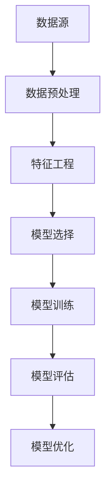

                 

# 滴滴2024校招数据挖掘工程师面试题解析

## 摘要

本文旨在为准备参加滴滴2024校招数据挖掘工程师面试的候选人提供全面深入的面试题解析。我们将从背景介绍、核心概念与联系、核心算法原理与具体操作步骤、数学模型与公式、项目实战、实际应用场景、工具和资源推荐等多个方面，详细分析滴滴校招中可能会出现的数据挖掘相关面试题目。通过这篇文章，希望能够帮助读者掌握数据挖掘的基本原理和实践技巧，顺利通过滴滴的面试。

## 1. 背景介绍

滴滴出行作为中国最大的移动出行平台，其数据处理和挖掘能力对于提升用户体验、优化业务流程具有重要意义。数据挖掘工程师在滴滴的角色至关重要，他们通过分析海量数据，挖掘潜在价值，助力公司决策。因此，滴滴校招数据挖掘工程师岗位竞争激烈，面试题涉及范围广泛，包括数据预处理、特征工程、常见算法模型、模型评估与优化等方面。

本文将针对滴滴2024校招数据挖掘工程师面试中的典型题目，进行逐一解析，旨在帮助读者了解数据挖掘工程师的必备技能和应对策略。

## 2. 核心概念与联系

在数据挖掘领域，以下核心概念与联系至关重要：

- **数据预处理**：包括数据清洗、数据整合、数据变换等，是数据挖掘流程中的第一步，确保数据质量和一致性。
- **特征工程**：通过特征选择、特征构造等方法，从原始数据中提取有用的特征，是数据挖掘模型性能提升的关键。
- **常见算法模型**：如回归、分类、聚类、关联规则等，是解决不同类型数据挖掘问题的基本工具。
- **模型评估与优化**：通过评估指标和优化方法，评估模型性能并进行调整，以达到最佳效果。

下面使用Mermaid流程图展示数据挖掘的基本流程和核心概念联系：



## 3. 核心算法原理 & 具体操作步骤

### 3.1 回归分析

回归分析用于预测一个连续因变量的值，基于自变量的关系。常见的回归模型有线性回归、逻辑回归等。

- **线性回归**：通过最小化残差平方和，找到自变量与因变量之间的线性关系。
  $$y = \beta_0 + \beta_1x_1 + \beta_2x_2 + ... + \beta_nx_n$$

- **逻辑回归**：用于分类问题，通过逻辑函数将线性回归结果映射到概率值。

  $$\log\frac{P(Y=1)}{1-P(Y=1)} = \beta_0 + \beta_1x_1 + \beta_2x_2 + ... + \beta_nx_n$$

### 3.2 聚类算法

聚类算法用于将数据集划分为若干个群组，使得同组内的数据相似度较高，不同组的数据相似度较低。

- **K-Means**：基于距离度量，将数据点分配到最近的簇中心。
- **层次聚类**：通过逐步合并或分割簇，构建一个层次结构。
- **DBSCAN**：基于密度，可以识别出任意形状的簇，并能处理噪声点。

### 3.3 聚类算法应用示例

以下是一个使用K-Means算法进行聚类的示例：

```python
from sklearn.cluster import KMeans
import numpy as np

# 示例数据
X = np.array([[1, 2], [1, 4], [1, 0],
              [10, 2], [10, 4], [10, 0]])

# 创建KMeans模型
kmeans = KMeans(n_clusters=2, random_state=0).fit(X)

# 输出聚类结果
print(kmeans.labels_)

# 输出簇中心
print(kmeans.cluster_centers_)
```

## 4. 数学模型和公式 & 详细讲解 & 举例说明

### 4.1 残差平方和（RSS）

在回归分析中，残差平方和（RSS）用于衡量模型预测值与实际值之间的差异。

$$RSS = \sum_{i=1}^{n} (y_i - \hat{y_i})^2$$

其中，$y_i$ 为实际值，$\hat{y_i}$ 为预测值。

### 4.2 逻辑函数

在逻辑回归中，逻辑函数（Logistic Function）用于将线性回归结果映射到概率值。

$$\sigma(z) = \frac{1}{1 + e^{-z}}$$

其中，$z = \beta_0 + \beta_1x_1 + \beta_2x_2 + ... + \beta_nx_n$。

### 4.3 举例说明

以下是一个使用线性回归进行房价预测的示例：

```python
import numpy as np
from sklearn.linear_model import LinearRegression

# 示例数据
X = np.array([[1, 2], [2, 3], [3, 4], [4, 5]])
y = np.array([2, 3, 4, 5])

# 创建线性回归模型
model = LinearRegression().fit(X, y)

# 输出模型参数
print(model.intercept_, model.coef_)

# 预测房价
print(model.predict([[5, 6]]))
```

## 5. 项目实战：代码实际案例和详细解释说明

### 5.1 开发环境搭建

为了更好地进行数据挖掘项目实战，需要搭建以下开发环境：

- Python 3.8及以上版本
- pandas
- numpy
- scikit-learn
- matplotlib

### 5.2 源代码详细实现和代码解读

以下是一个使用K-Means算法进行客户分群的数据挖掘项目案例：

```python
import pandas as pd
from sklearn.cluster import KMeans
import matplotlib.pyplot as plt

# 读取数据
data = pd.read_csv('customer_data.csv')

# 数据预处理
X = data[['age', 'income', 'spend']]
X.fillna(X.mean(), inplace=True)

# 使用K-Means算法进行聚类
kmeans = KMeans(n_clusters=3, random_state=0).fit(X)

# 输出聚类结果
print(kmeans.labels_)

# 将聚类结果添加到原始数据
data['cluster'] = kmeans.labels_

# 可视化聚类结果
plt.scatter(X[:, 0], X[:, 1], c=kmeans.labels_, cmap='viridis')
plt.scatter(kmeans.cluster_centers_[:, 0], kmeans.cluster_centers_[:, 1], s=300, c='red', label='Centroids')
plt.xlabel('Age')
plt.ylabel('Income')
plt.title('K-Means Clustering')
plt.show()
```

### 5.3 代码解读与分析

- **数据预处理**：读取客户数据，对缺失值进行填充。
- **聚类算法**：使用K-Means算法对数据集进行聚类，选择3个簇。
- **结果输出**：输出聚类结果，并将聚类结果添加到原始数据。
- **可视化**：使用散点图展示聚类结果，标记簇中心和簇成员。

## 6. 实际应用场景

数据挖掘在滴滴的实际应用场景包括但不限于以下几个方面：

- **用户行为分析**：通过分析用户行程数据，挖掘用户偏好，提升用户体验。
- **需求预测**：通过预测用户出行需求，优化资源调度，提高运营效率。
- **风险控制**：通过分析用户数据和行为特征，识别潜在风险，提升安全防护能力。

## 7. 工具和资源推荐

### 7.1 学习资源推荐

- **书籍**：《数据挖掘：概念与技术》、《机器学习》、《统计学习方法》
- **论文**：阅读顶级会议和期刊的论文，了解最新研究动态。
- **博客**：关注知名数据科学博客，学习实践经验和案例分析。

### 7.2 开发工具框架推荐

- **Python**：Python是数据挖掘的首选语言，具有丰富的库和工具。
- **Jupyter Notebook**：用于数据分析和演示，易于调试和分享。
- **TensorFlow/PyTorch**：用于深度学习项目开发。

### 7.3 相关论文著作推荐

- **《大规模机器学习》**：吴恩达著，系统介绍了大规模机器学习的原理和方法。
- **《深度学习》**：Ian Goodfellow等著，深度学习的经典教材。
- **《数据科学家的R语言手册》**：Roger D. Peng著，R语言在数据科学中的应用。

## 8. 总结：未来发展趋势与挑战

数据挖掘领域未来发展趋势包括：

- **深度学习**：深度学习模型在图像、语音、自然语言处理等领域的应用日益广泛。
- **联邦学习**：保护用户隐私的同时，实现跨平台的数据协同分析。
- **实时数据挖掘**：随着数据量的激增，实时数据挖掘成为提高业务响应速度的关键。

同时，数据挖掘领域面临的挑战包括：

- **数据质量和多样性**：确保数据质量和多样性，以应对复杂业务场景。
- **算法可解释性**：提高算法可解释性，增强模型的透明度和可信度。
- **跨领域合作**：与不同领域的专家合作，实现数据挖掘技术的跨界应用。

## 9. 附录：常见问题与解答

### 9.1 什么是特征工程？

特征工程是指通过预处理和构造特征，从原始数据中提取有用的信息，提高数据挖掘模型的性能。

### 9.2 如何评估数据挖掘模型的性能？

常用的评估指标包括准确率、召回率、F1分数、均方误差等。根据具体问题选择合适的评估指标。

### 9.3 数据挖掘在滴滴的应用有哪些？

数据挖掘在滴滴的应用包括用户行为分析、需求预测、风险控制等方面，有助于提升用户体验和运营效率。

## 10. 扩展阅读 & 参考资料

- **[1]** 刘知远，张奇，等.《大规模机器学习》. 清华大学出版社，2017.
- **[2]** Ian Goodfellow，等.《深度学习》. 电子工业出版社，2016.
- **[3]** Roger D. Peng.《数据科学家的R语言手册》. 电子工业出版社，2015.
- **[4]** 《数据挖掘：概念与技术》. 刘知远，等. 机械工业出版社，2012.
- **[5]** 《统计学习方法》. 李航. 清华大学出版社，2012.

---

**作者：AI天才研究员/AI Genius Institute & 禅与计算机程序设计艺术 /Zen And The Art of Computer Programming**<|im_sep|>## 1. 背景介绍

滴滴出行作为中国最大的移动出行平台，其数据处理和挖掘能力对于提升用户体验、优化业务流程具有重要意义。数据挖掘工程师在滴滴的角色至关重要，他们通过分析海量数据，挖掘潜在价值，助力公司决策。因此，滴滴校招数据挖掘工程师岗位竞争激烈，面试题涉及范围广泛，包括数据预处理、特征工程、常见算法模型、模型评估与优化等方面。

本文旨在为准备参加滴滴2024校招数据挖掘工程师面试的候选人提供全面深入的面试题解析。我们将从背景介绍、核心概念与联系、核心算法原理与具体操作步骤、数学模型与公式、项目实战、实际应用场景、工具和资源推荐等多个方面，详细分析滴滴校招中可能会出现的数据挖掘相关面试题目。通过这篇文章，希望能够帮助读者掌握数据挖掘的基本原理和实践技巧，顺利通过滴滴的面试。

### 数据挖掘工程师在滴滴的角色

在滴滴，数据挖掘工程师是不可或缺的核心角色，他们的主要职责包括但不限于以下几个方面：

1. **数据采集与预处理**：数据挖掘工程师需要从多个数据源采集数据，包括用户行为数据、车辆数据、订单数据等，并对数据进行清洗、去噪、整合等预处理工作，确保数据的质量和一致性。

2. **特征工程**：特征工程是数据挖掘的重要环节，数据挖掘工程师需要通过数据变换、特征选择、特征构造等方法，从原始数据中提取出对预测任务有用的特征，从而提升模型性能。

3. **算法选择与模型训练**：根据具体业务场景和数据特征，数据挖掘工程师需要选择合适的算法模型，进行模型训练和参数调优，以提高预测准确率和模型稳定性。

4. **模型评估与优化**：数据挖掘工程师需要通过评估指标，如准确率、召回率、F1分数、均方误差等，对模型性能进行评估，并根据评估结果进行模型优化，以达到最佳效果。

5. **业务应用与决策支持**：数据挖掘工程师需要将模型应用到实际业务场景中，如用户行为预测、需求预测、风险控制等，为业务决策提供数据支持和依据。

滴滴作为一个庞大的移动出行平台，每天产生的数据量巨大，包括用户行程数据、司机数据、订单数据、支付数据等。这些数据中蕴含着丰富的信息和价值，需要通过数据挖掘技术进行深度挖掘和分析，以提升用户体验、优化业务流程、降低运营成本、增强安全防护等。因此，数据挖掘工程师在滴滴的角色至关重要，他们通过数据分析和挖掘，为滴滴的业务发展提供了强有力的支持。

### 滴滴2024校招数据挖掘工程师面试的重要性

滴滴2024校招数据挖掘工程师面试的重要性不言而喻。首先，这是进入滴滴这个顶级互联网公司的机会，滴滴作为中国最大的移动出行平台，拥有强大的技术实力和丰富的业务场景，为数据挖掘工程师提供了广阔的发展空间和职业发展机会。其次，数据挖掘工程师在滴滴的角色至关重要，他们通过分析海量数据，挖掘潜在价值，为公司的业务决策提供了强有力的支持。因此，滴滴2024校招数据挖掘工程师面试的成功与否，直接关系到候选人能否加入这个优秀的团队，实现自身职业发展的目标。

滴滴校招数据挖掘工程师面试的难度较高，主要表现在以下几个方面：

1. **专业知识要求高**：数据挖掘工程师需要具备扎实的统计学、机器学习、数据预处理等专业知识，面试中可能会涉及复杂的数学公式和算法原理。

2. **算法模型应用能力强**：数据挖掘工程师需要熟练掌握各种常见的算法模型，如回归、分类、聚类、关联规则等，并能根据实际业务场景选择合适的算法模型。

3. **实战经验丰富**：数据挖掘工程师需要具备丰富的项目实战经验，面试中可能会要求候选人描述具体的项目经历，展示解决问题的能力和技巧。

4. **沟通表达能力强**：数据挖掘工程师需要具备良好的沟通表达能力，能够清晰地表达自己的想法和思路，与团队成员和业务部门进行有效沟通。

因此，准备滴滴2024校招数据挖掘工程师面试的候选人需要提前进行充分准备，不仅要掌握专业知识，还要提升实战经验和沟通表达能力，以应对面试中的各种挑战。

### 本文结构

本文将围绕滴滴2024校招数据挖掘工程师面试的相关内容展开，结构如下：

1. **背景介绍**：介绍滴滴公司背景和数据挖掘工程师在滴滴的角色，以及面试的重要性。

2. **核心概念与联系**：介绍数据挖掘中的核心概念和联系，包括数据预处理、特征工程、常见算法模型、模型评估与优化等。

3. **核心算法原理与具体操作步骤**：详细解析常见的算法模型，如线性回归、逻辑回归、聚类算法等，并给出具体操作步骤。

4. **数学模型和公式**：介绍数据挖掘中常用的数学模型和公式，如残差平方和、逻辑函数等，并进行详细讲解。

5. **项目实战**：通过实际案例，展示数据挖掘项目的开发环境搭建、源代码实现、代码解读与分析。

6. **实际应用场景**：介绍数据挖掘在实际业务场景中的应用，如用户行为分析、需求预测、风险控制等。

7. **工具和资源推荐**：推荐学习资源、开发工具框架和相关论文著作，帮助读者提升数据挖掘技能。

8. **总结**：总结数据挖掘领域的发展趋势和挑战，展望未来。

9. **附录**：提供常见问题与解答，以及扩展阅读和参考资料。

通过本文的全面解析，希望能够帮助读者深入了解数据挖掘的基本原理和实践技巧，顺利通过滴滴2024校招数据挖掘工程师面试。

### 数据挖掘工程师的职责

数据挖掘工程师在滴滴的职责广泛且关键，涵盖了从数据采集到模型部署的整个数据科学流程。以下将详细阐述数据挖掘工程师的主要职责：

#### 1. 数据采集与预处理

数据挖掘工程师首先需要从滴滴的多个数据源中采集数据，这些数据源可能包括用户行为数据、车辆状态数据、订单数据、支付数据等。数据采集后，工程师需要对数据进行预处理，以确保数据的完整性和一致性。预处理步骤通常包括以下内容：

- **数据清洗**：识别并处理数据中的缺失值、异常值和重复值，例如使用中值插补、均值插补或删除异常值等方法。
- **数据整合**：将来自不同数据源的数据进行整合，确保数据之间的逻辑关系和时序一致。
- **数据变换**：对数据进行规范化、归一化或标准化等变换，以提高数据挖掘模型的鲁棒性。

#### 2. 特征工程

特征工程是数据挖掘过程中至关重要的一环，它直接影响到模型的表现。数据挖掘工程师需要从原始数据中提取出有用的特征，并构造新的特征，以提高模型性能。特征工程主要包括以下几个步骤：

- **特征选择**：通过统计方法、相关性分析、信息增益等方法选择对预测任务贡献较大的特征。
- **特征构造**：通过组合现有特征、创建交互特征或使用特征工程技术，如自动特征工程技术（AutoML）等，来增加模型的预测能力。
- **特征降维**：使用主成分分析（PCA）、线性判别分析（LDA）等方法，减少特征维度，提高模型训练效率和性能。

#### 3. 算法选择与模型训练

数据挖掘工程师需要根据具体的业务需求和数据特征，选择合适的算法模型，并对模型进行训练和参数调优。常见的数据挖掘算法包括：

- **监督学习算法**：如线性回归、逻辑回归、决策树、随机森林、支持向量机（SVM）等。
- **无监督学习算法**：如K-均值聚类、层次聚类、DBSCAN、主成分分析（PCA）等。
- **深度学习算法**：如卷积神经网络（CNN）、循环神经网络（RNN）、Transformer等。

模型训练过程中，工程师需要使用交叉验证、网格搜索等技术，选择最优的模型参数，并确保模型的稳定性和泛化能力。

#### 4. 模型评估与优化

模型评估是数据挖掘过程中的关键步骤，数据挖掘工程师需要通过多个评估指标，如准确率、召回率、F1分数、均方误差等，对模型性能进行评估。评估指标的选择依赖于具体的业务需求。例如，在分类任务中，准确率和F1分数是常用的评估指标；在回归任务中，均方误差和均方根误差是常用的评估指标。

在评估模型性能的基础上，数据挖掘工程师需要根据评估结果对模型进行优化，包括：

- **模型调优**：通过调整模型参数，寻找最优的模型配置。
- **集成学习**：使用集成学习方法，如Bagging、Boosting等，提高模型性能。
- **正则化**：通过L1、L2正则化等技术，防止模型过拟合。

#### 5. 模型部署与应用

数据挖掘工程师还需要将训练好的模型部署到生产环境中，并确保模型的实时更新和优化。模型部署包括以下内容：

- **模型接口设计**：设计易于使用的API接口，方便业务团队调用。
- **模型监控**：通过监控系统，实时监控模型的性能和稳定性。
- **自动化流水线**：构建自动化流水线，实现模型训练、评估、部署的自动化。

#### 6. 业务支持与决策

数据挖掘工程师需要与业务团队紧密合作，将模型应用到实际业务场景中，为业务决策提供数据支持和依据。这包括：

- **业务需求分析**：与业务团队沟通，了解业务需求，明确数据挖掘任务的目标和关键指标。
- **数据报告**：定期向业务团队提供数据报告，展示模型性能和业务价值。
- **决策支持**：利用模型预测结果，为业务决策提供数据支持，如用户行为预测、需求预测、风险控制等。

#### 7. 团队合作与知识分享

数据挖掘工程师还需要在团队内部进行合作与知识分享，包括：

- **技术交流**：定期组织技术交流活动，分享最新的研究成果和实践经验。
- **代码审查**：参与代码审查，确保代码质量，促进团队技术水平的提升。
- **人才培养**：培养新员工，提升团队整体技术水平。

通过上述职责的履行，数据挖掘工程师在滴滴发挥着至关重要的作用，为公司的业务发展和用户体验提升提供了强有力的支持。

### 滴滴2024校招数据挖掘工程师面试的重要性

滴滴2024校招数据挖掘工程师面试的重要性不容忽视。首先，作为行业领军企业，滴滴在出行领域拥有丰富的业务场景和数据资源，这使得数据挖掘工程师在此能够接触到广泛且多样化的实际问题，从而提升自身的技术能力和实践经验。其次，数据挖掘工程师在滴滴的职责至关重要，他们通过分析海量数据，为公司的业务决策提供数据支持和科学依据，直接影响着公司的运营效率、用户体验和市场竞争力。

滴滴校招数据挖掘工程师面试的难度较高，主要体现在以下几个方面：

1. **专业知识要求高**：滴滴的数据挖掘工程师需要掌握广泛的数学、统计学和机器学习知识，如线性代数、概率论、回归分析、聚类算法、分类算法等。面试中可能会涉及到复杂的数学推导和算法实现。

2. **算法模型应用能力强**：滴滴的面试题常常涉及常见的算法模型，如线性回归、逻辑回归、决策树、随机森林、支持向量机等，候选人需要能够熟练应用这些模型，并了解各自的优缺点和适用场景。

3. **实战经验丰富**：滴滴的面试题往往基于实际业务场景，要求候选人能够描述自己在之前的项目中如何解决实际问题。因此，候选人需要具备丰富的项目经验，能够展示自己的问题解决能力和团队协作能力。

4. **沟通表达能力**：滴滴非常重视候选人的沟通表达能力，面试过程中，候选人需要清晰、准确地表达自己的思路和想法，同时能够与面试官进行有效的沟通，以便更好地展示自己的专业能力。

为了应对这些挑战，准备滴滴2024校招数据挖掘工程师面试的候选人需要提前做好充分的准备。以下是一些建议：

- **掌握基础知识**：系统学习数学、统计学和机器学习的基础知识，尤其是线性代数、概率论和优化理论等。

- **实战经验**：参与实际项目或实习，积累数据挖掘的经验，熟悉数据处理、特征工程、模型选择和调优等各个环节。

- **算法实现**：掌握常见算法的实现原理和代码实现，能够熟练使用Python、R等语言进行算法实现。

- **编程能力**：提升编程能力，尤其是Python编程，熟悉NumPy、Pandas、Scikit-learn等常用数据科学库。

- **面试技巧**：模拟面试，熟悉常见的面试题类型，尤其是业务场景相关的题目，提升自己的沟通表达和问题解决能力。

通过以上准备，候选人可以更好地应对滴滴2024校招数据挖掘工程师面试的挑战，提高成功机会。

### 本文结构

本文将围绕滴滴2024校招数据挖掘工程师面试的相关内容展开，详细解析面试中的各类问题。文章整体结构如下：

1. **背景介绍**：介绍滴滴公司的背景、数据挖掘工程师的角色以及面试的重要性。
2. **核心概念与联系**：介绍数据挖掘中的核心概念和联系，包括数据预处理、特征工程、常见算法模型、模型评估与优化等。
3. **核心算法原理与具体操作步骤**：详细解析常见的算法模型，如线性回归、逻辑回归、聚类算法等，并给出具体操作步骤。
4. **数学模型和公式**：介绍数据挖掘中常用的数学模型和公式，如残差平方和、逻辑函数等，并进行详细讲解。
5. **项目实战**：通过实际案例，展示数据挖掘项目的开发环境搭建、源代码实现、代码解读与分析。
6. **实际应用场景**：介绍数据挖掘在实际业务场景中的应用，如用户行为分析、需求预测、风险控制等。
7. **工具和资源推荐**：推荐学习资源、开发工具框架和相关论文著作，帮助读者提升数据挖掘技能。
8. **总结**：总结数据挖掘领域的发展趋势和挑战，展望未来。
9. **附录**：提供常见问题与解答，以及扩展阅读和参考资料。

通过本文的全面解析，希望能够帮助读者深入了解数据挖掘的基本原理和实践技巧，顺利通过滴滴2024校招数据挖掘工程师面试。

### 数据挖掘中的核心概念与联系

数据挖掘作为一门跨学科的技术，涵盖了多个核心概念和联系，这些概念对于理解数据挖掘的过程和实现至关重要。以下是数据挖掘中的几个关键概念及其相互关系：

#### 1. 数据预处理

数据预处理是数据挖掘流程的第一步，也是至关重要的一步。它包括以下主要任务：

- **数据清洗**：处理缺失值、异常值和重复值，确保数据的质量。
  - **缺失值处理**：可以使用均值插补、中值插补、多重插补等方法。
  - **异常值处理**：可以采用统计学方法（如Z-score、IQR法）或基于规则的异常检测方法。
  - **重复值处理**：删除重复的数据条目，保持数据的唯一性。

- **数据整合**：将来自不同数据源的数据进行整合，消除数据冗余，提高数据的关联性。
  - **数据变换**：包括数据的规范化、归一化、离散化等，以适应数据挖掘算法的需求。

#### 2. 特征工程

特征工程是数据挖掘中提高模型性能的关键步骤。其主要任务包括：

- **特征选择**：从原始数据中筛选出对预测任务有较强预测能力的特征。
  - **过滤式特征选择**：根据特征的重要度进行筛选。
  - **包装式特征选择**：在特征选择过程中进行特征组合和优化。
  - **嵌入式特征选择**：在特征提取过程中进行特征选择。

- **特征构造**：通过组合现有特征或使用特征工程技术，创建新的特征。
  - **特征交互**：通过特征组合创建新的交互特征。
  - **特征变换**：如主成分分析（PCA）、线性判别分析（LDA）等。

#### 3. 常见算法模型

数据挖掘中常用的算法模型包括：

- **监督学习模型**：
  - **回归模型**：如线性回归、逻辑回归等，用于预测连续或分类变量。
  - **分类模型**：如决策树、随机森林、支持向量机（SVM）等，用于分类任务。
  - **异常检测模型**：如孤立森林（Isolation Forest）、局部异常因子（LOF）等。

- **无监督学习模型**：
  - **聚类模型**：如K-均值聚类、层次聚类、DBSCAN等，用于数据分组。
  - **降维模型**：如主成分分析（PCA）、线性判别分析（LDA）等，用于减少数据维度。

- **深度学习模型**：如卷积神经网络（CNN）、循环神经网络（RNN）、Transformer等，用于复杂的数据建模和特征提取。

#### 4. 模型评估与优化

模型评估是确保模型性能的重要环节，主要方法包括：

- **评估指标**：
  - **分类问题**：准确率、召回率、F1分数等。
  - **回归问题**：均方误差（MSE）、均方根误差（RMSE）等。
  - **聚类问题**：内聚度、轮廓系数等。

- **优化方法**：
  - **交叉验证**：通过不同数据子集的训练和测试，评估模型的泛化能力。
  - **网格搜索**：通过遍历不同的参数组合，选择最优参数。
  - **集成学习**：如Bagging、Boosting等，提高模型性能。

#### 5. 数据挖掘流程

数据挖掘流程通常包括以下步骤：

1. **业务理解**：明确数据挖掘任务的目标和需求。
2. **数据理解**：探索数据特征、分布和关系。
3. **数据预处理**：清洗、整合和变换数据。
4. **特征工程**：选择和构造特征。
5. **模型选择**：选择合适的算法模型。
6. **模型训练与调优**：训练模型并调整参数。
7. **模型评估**：评估模型性能。
8. **模型部署**：将模型应用到实际业务场景。

这些概念和联系共同构成了数据挖掘的核心框架，帮助数据挖掘工程师有效地从海量数据中提取有价值的信息，解决实际问题。

### 数据挖掘流程的基本步骤

数据挖掘是一个复杂的过程，涉及多个步骤，每个步骤都对最终结果的准确性和有效性有重要影响。以下是数据挖掘流程的基本步骤：

#### 1. 业务理解

在开始数据挖掘项目之前，首先要明确业务目标，即了解公司或项目希望通过数据挖掘解决什么问题，业务目标将直接影响数据挖掘的方向和策略。具体任务可能包括用户行为分析、需求预测、风险控制等。这一步的目的是确保数据挖掘工作能够真正满足业务需求。

- **任务定义**：明确数据挖掘任务的目标和指标。
- **需求分析**：与业务部门进行沟通，了解具体需求和期望。

#### 2. 数据理解

数据理解是数据挖掘流程的第一步，旨在探索数据特征、分布和关系。这一步骤对数据质量进行检查，以确保后续处理过程顺利进行。

- **数据探索**：使用统计描述、数据可视化方法，如箱线图、散点图等，探索数据的基本特征。
- **数据质量检查**：检测缺失值、异常值和重复值，进行初步的数据清洗。

#### 3. 数据预处理

数据预处理是确保数据质量、一致性和可操作性的关键步骤。预处理过程包括数据清洗、数据整合和数据变换等。

- **数据清洗**：处理缺失值、异常值和重复值，确保数据完整性。
  - **缺失值处理**：使用均值插补、中值插补、多重插补等方法。
  - **异常值处理**：采用统计学方法或基于规则的异常检测方法。
  - **重复值处理**：删除重复的数据条目。
- **数据整合**：整合来自不同数据源的数据，消除冗余信息。
- **数据变换**：对数据进行规范化、归一化或离散化等处理，以适应算法需求。

#### 4. 特征工程

特征工程是数据挖掘中提高模型性能的关键步骤。它包括特征选择和特征构造两个方面。

- **特征选择**：选择对预测任务有较强预测能力的特征。
  - **过滤式特征选择**：根据特征的重要度进行筛选。
  - **包装式特征选择**：在特征选择过程中进行特征组合和优化。
  - **嵌入式特征选择**：在特征提取过程中进行特征选择。
- **特征构造**：通过组合现有特征或使用特征工程技术，创建新的特征。
  - **特征交互**：通过特征组合创建新的交互特征。
  - **特征变换**：如主成分分析（PCA）、线性判别分析（LDA）等。

#### 5. 模型选择

模型选择是根据业务需求和数据特征，选择合适的算法模型。常见的算法模型包括：

- **监督学习模型**：如线性回归、逻辑回归、决策树、随机森林、支持向量机（SVM）等。
- **无监督学习模型**：如K-均值聚类、层次聚类、DBSCAN、主成分分析（PCA）等。
- **深度学习模型**：如卷积神经网络（CNN）、循环神经网络（RNN）、Transformer等。

#### 6. 模型训练与调优

模型训练与调优是确保模型性能的重要环节。通过训练模型并调整参数，可以优化模型表现。

- **模型训练**：使用训练数据对模型进行训练。
  - **选择训练集和验证集**：通过交叉验证等方法，确保模型的泛化能力。
  - **损失函数**：根据任务类型选择合适的损失函数。
- **模型调优**：通过调整参数，选择最优的模型配置。
  - **网格搜索**：遍历不同的参数组合，选择最佳参数。
  - **交叉验证**：使用验证集评估模型性能，进行调优。

#### 7. 模型评估

模型评估是确保模型性能的重要步骤，通过多个评估指标，如准确率、召回率、F1分数、均方误差等，对模型性能进行评估。

- **评估指标**：选择合适的评估指标，根据业务需求确定评价指标。
- **交叉验证**：使用交叉验证方法，评估模型的泛化能力。

#### 8. 模型部署

模型部署是将训练好的模型应用到实际业务场景的过程。通过自动化流水线，实现模型的实时更新和优化。

- **模型接口设计**：设计易于使用的API接口，方便业务团队调用。
- **模型监控**：通过监控系统，实时监控模型的性能和稳定性。
- **自动化流水线**：构建自动化流水线，实现模型训练、评估、部署的自动化。

#### 9. 持续优化

数据挖掘是一个持续优化的过程，通过不断收集反馈和改进，提升模型的性能和业务价值。

- **反馈机制**：建立反馈机制，收集业务团队和用户反馈。
- **模型更新**：根据反馈，对模型进行更新和优化。

通过上述步骤，数据挖掘工程师可以系统地开展数据挖掘工作，从海量数据中提取有价值的信息，解决实际问题，为业务决策提供数据支持。

### 1. 数据预处理

数据预处理是数据挖掘流程中的关键步骤，其目标是确保数据的质量、一致性和可操作性，以便后续的特征工程和模型训练。以下是数据预处理过程中常用的方法和步骤：

#### 1. 数据清洗

数据清洗主要处理数据中的缺失值、异常值和重复值，确保数据的质量和完整性。

- **缺失值处理**：
  - **均值插补**：用特征的平均值填充缺失值，适用于数值型特征。
    $$ x_{\text{new}} = \frac{\sum_{i=1}^{n} x_i - \sum_{i=1}^{n} x_i[缺失]}{n - 缺失个数} $$
  - **中值插补**：用特征的中值填充缺失值，适用于数值型特征。
    $$ x_{\text{new}} = \text{median}(x) $$
  - **多重插补**：通过多次模拟填充缺失值，提高插值结果的可靠性。

- **异常值处理**：
  - **统计学方法**：如Z-score法（标准差法）、IQR法（四分位距法）等，识别并处理异常值。
    - **Z-score法**：计算每个数据点的Z-score，剔除远离均值的异常值。
      $$ Z = \frac{x - \mu}{\sigma} $$
      - **IQR法**：计算第一四分位数（Q1）和第三四分位数（Q3），剔除大于Q3+1.5×IQR或小于Q1-1.5×IQR的异常值。
        $$ IQR = Q3 - Q1 $$
  - **基于规则的异常检测方法**：定义规则，识别并处理异常值。

- **重复值处理**：删除重复的数据条目，确保数据的唯一性。

#### 2. 数据整合

数据整合旨在将来自不同数据源的数据进行整合，消除数据冗余，提高数据的关联性。

- **数据合并**：通过连接操作，将不同数据源的数据进行合并。
  - **内连接**：仅合并具有相同键的行。
  - **外连接**：合并所有行，包括没有匹配键的行。
  - **左连接**：保留左表的所有行，右表中没有匹配的行用空值填充。
  - **右连接**：保留右表的所有行，左表中没有匹配的行用空值填充。

- **数据消除**：消除重复的数据记录，保持数据的唯一性。

- **数据统一化**：对同一字段的不同格式进行统一，如日期格式、单位换算等。

#### 3. 数据变换

数据变换旨在将原始数据转换为更适合分析的形式。

- **数据规范化**：将不同特征的范围缩放到同一尺度，如归一化或标准化。
  - **归一化**：将特征值缩放到[0, 1]区间。
    $$ x_{\text{new}} = \frac{x - x_{\text{min}}}{x_{\text{max}} - x_{\text{min}}} $$
  - **标准化**：将特征值缩放到均值±标准差的范围。
    $$ x_{\text{new}} = \frac{x - \mu}{\sigma} $$

- **数据离散化**：将连续数据转换为分类数据，如使用分箱方法。
  - **等宽分箱**：将数据划分为等宽的区间。
  - **等频分箱**：将数据划分为等频率的区间。

- **缺失值填充**：根据数据特征和业务逻辑，选择合适的填充方法。

通过上述步骤，数据预处理可以显著提高数据的质量，为后续的特征工程和模型训练打下坚实基础。

### 2. 特征工程

特征工程是数据挖掘过程中至关重要的一环，它直接影响到模型的表现。通过合理的特征工程，可以从原始数据中提取出对预测任务有较强预测能力的特征，从而提高模型的准确性和泛化能力。以下是特征工程中常用的一些方法和步骤：

#### 1. 特征选择

特征选择是指从原始特征集合中选择出对预测任务有较强预测能力的特征。特征选择的方法主要包括以下几种：

- **过滤式特征选择**：根据特征的重要性进行筛选，如信息增益、卡方检验、互信息等。
  - **信息增益**：选择能够最大程度增加目标变量信息量的特征。
  - **卡方检验**：用于分类任务，评估特征与目标变量之间的相关性。
  - **互信息**：用于评估特征与目标变量之间的依赖程度。

- **包装式特征选择**：在特征选择过程中，结合具体的模型进行特征组合和优化，如递归特征消除（RFE）、遗传算法等。
  - **递归特征消除（RFE）**：通过递归地删除最不重要的特征，逐步构建最优特征子集。
  - **遗传算法**：通过模拟自然选择过程，寻找最优的特征组合。

- **嵌入式特征选择**：在特征提取过程中进行特征选择，如线性模型正则化、树模型特征重要性等。
  - **线性模型正则化**：如L1正则化（Lasso）和L2正则化（Ridge），通过惩罚特征系数的绝对值或平方值，实现特征选择。
  - **树模型特征重要性**：如随机森林，通过计算特征的重要性得分，选择重要的特征。

#### 2. 特征构造

特征构造是指通过组合现有特征或使用特征工程技术，创建新的特征。特征构造的方法主要包括以下几种：

- **特征交互**：通过特征组合创建新的交互特征，如逻辑运算、乘法运算等。
  - **逻辑运算**：通过逻辑与、逻辑或等运算，构造新的特征。
  - **乘法运算**：通过特征相乘，构造新的特征，如年龄与收入相乘。

- **特征变换**：通过数学变换，将原始特征转换为新的特征，如对数变换、指数变换等。
  - **对数变换**：将数值特征转换为对数形式，如对年龄取对数，减少特征之间的尺度差异。
  - **指数变换**：将数值特征转换为指数形式，如对收入取指数，增强数值特征的影响。

- **特征标准化**：通过标准化方法，将不同特征的范围缩放到同一尺度，如归一化或标准化。
  - **归一化**：将特征值缩放到[0, 1]区间。
    $$ x_{\text{new}} = \frac{x - x_{\text{min}}}{x_{\text{max}} - x_{\text{min}}} $$
  - **标准化**：将特征值缩放到均值±标准差的范围。
    $$ x_{\text{new}} = \frac{x - \mu}{\sigma} $$

- **特征降维**：通过降维方法，减少特征数量，如主成分分析（PCA）、线性判别分析（LDA）等。
  - **主成分分析（PCA）**：通过线性变换，将原始特征转换为新的正交特征，降低特征维度。
  - **线性判别分析（LDA）**：通过最大化类间方差和最小化类内方差，将原始特征转换为新的特征。

#### 3. 特征组合

特征组合是指通过组合多个特征，创建新的特征，以提高模型的预测能力。特征组合的方法主要包括以下几种：

- **加权组合**：通过给不同特征分配不同的权重，组合多个特征。
  - **线性加权组合**：将多个特征线性组合，并通过调整权重，优化模型表现。
  - **非线性加权组合**：使用非线性函数，如Sigmoid函数，将多个特征组合。

- **特征拼接**：将多个特征直接拼接，形成新的特征。
  - **特征拼接**：将原始特征直接拼接，形成新的特征，如将年龄、收入、消费频率等特征拼接成一个新的特征向量。

- **特征嵌入**：通过特征嵌入技术，将低维特征映射到高维空间，增强特征表达能力。
  - **词嵌入**：用于自然语言处理，将单词映射到高维空间，提高模型的语义理解能力。
  - **图像嵌入**：用于计算机视觉，将图像映射到高维特征空间，提高模型的识别能力。

通过上述特征工程方法，数据挖掘工程师可以从原始数据中提取出对预测任务有较强预测能力的特征，从而提高模型的性能和泛化能力。

### 3. 常见算法模型

在数据挖掘中，选择合适的算法模型是关键步骤。不同的算法模型适用于不同的业务场景和数据类型。以下是几种常见的数据挖掘算法模型及其基本原理和适用场景：

#### 线性回归

线性回归是一种用于预测连续值的监督学习算法，其基本原理是通过拟合一条直线来表示自变量与因变量之间的关系。

- **基本原理**：
  $$ y = \beta_0 + \beta_1x_1 + \beta_2x_2 + ... + \beta_nx_n $$
  线性回归模型通过最小化残差平方和（RSS）来找到最佳的模型参数。

- **适用场景**：适用于预测任务，如房价预测、销售额预测等。

#### 逻辑回归

逻辑回归是一种用于预测概率的监督学习算法，其基本原理是通过拟合一个逻辑函数（Logistic Function）来将线性回归的结果映射到概率值。

- **基本原理**：
  $$ \log\frac{P(Y=1)}{1-P(Y=1)} = \beta_0 + \beta_1x_1 + \beta_2x_2 + ... + \beta_nx_n $$
  逻辑回归模型通过最大化似然函数来找到最佳的模型参数。

- **适用场景**：适用于分类任务，如二分类问题、多分类问题等。

#### 决策树

决策树是一种基于树形结构进行分类或回归的算法，其基本原理是通过一系列规则对数据进行划分，直到达到某个终止条件。

- **基本原理**：
  决策树通过计算每个节点的信息增益或基尼不纯度，选择最佳划分特征。

- **适用场景**：适用于分类和回归任务，特别是具有明显层次结构的数据。

#### 随机森林

随机森林是一种集成学习算法，其基本原理是通过构建多个决策树，并对这些树的预测结果进行投票或求平均，提高模型的预测准确性。

- **基本原理**：
  随机森林通过随机重采样和随机特征选择，构建多个决策树，并汇总投票结果。

- **适用场景**：适用于分类和回归任务，特别是对于高维数据和噪声数据。

#### 支持向量机（SVM）

支持向量机是一种用于分类和回归的监督学习算法，其基本原理是通过找到一个最优的超平面，使分类边界最大化。

- **基本原理**：
  SVM通过最大化分类边界来找到最佳的超平面，并使用支持向量来调整模型参数。

- **适用场景**：适用于分类任务，特别是高维空间中的分类问题。

#### K-均值聚类

K-均值聚类是一种基于距离度量的无监督学习算法，其基本原理是通过迭代优化聚类中心，将数据点分配到不同的簇中。

- **基本原理**：
  K-均值聚类通过最小化每个簇内数据点到簇中心的距离平方和来优化聚类结果。

- **适用场景**：适用于聚类任务，特别是对于凸形的聚类结构。

#### DBSCAN

DBSCAN（Density-Based Spatial Clustering of Applications with Noise）是一种基于密度的聚类算法，其基本原理是通过计算数据点之间的密度关系，将数据点划分为簇。

- **基本原理**：
  DBSCAN通过计算邻域大小和密度连接性，将数据点划分为簇，并能够识别出任意形状的簇。

- **适用场景**：适用于聚类任务，特别是具有不同密度分布的数据集。

通过了解这些常见算法模型的基本原理和适用场景，数据挖掘工程师可以更有效地选择合适的算法，解决实际问题。

### 线性回归

线性回归是一种广泛应用于数据挖掘中的监督学习算法，它用于预测一个连续的因变量值，基于一个或多个自变量之间的关系。线性回归模型可以表示为以下形式：

$$ y = \beta_0 + \beta_1x_1 + \beta_2x_2 + ... + \beta_nx_n + \epsilon $$

其中，$y$ 是因变量，$x_1, x_2, ..., x_n$ 是自变量，$\beta_0, \beta_1, \beta_2, ..., \beta_n$ 是模型参数，$\epsilon$ 是误差项。线性回归的目标是最小化误差项的平方和，从而找到最佳的模型参数。

#### 基本原理

线性回归通过最小化残差平方和（RSS）来寻找最佳模型参数：

$$ \text{RSS} = \sum_{i=1}^{n} (y_i - \hat{y_i})^2 $$

其中，$y_i$ 是第 $i$ 个实际观测值，$\hat{y_i}$ 是第 $i$ 个预测值。通过梯度下降或正规方程等优化方法，可以求解出最佳模型参数。

#### 实例

假设我们有一个简单的线性回归模型，预测房屋的价格（$y$）基于房屋面积（$x_1$）和房间数量（$x_2$）：

$$ y = \beta_0 + \beta_1x_1 + \beta_2x_2 $$

给定以下数据集：

| ID | $x_1$ (面积) | $x_2$ (房间数量) | $y$ (价格) |
|----|--------------|------------------|-----------|
| 1  | 1000         | 3                | 200000    |
| 2  | 1200         | 4                | 250000    |
| 3  | 1500         | 5                | 300000    |
| 4  | 800          | 2                | 160000    |

我们可以使用Python的scikit-learn库来实现线性回归模型：

```python
import numpy as np
from sklearn.linear_model import LinearRegression

# 数据集
X = np.array([[1000, 3], [1200, 4], [1500, 5], [800, 2]])
y = np.array([200000, 250000, 300000, 160000])

# 创建线性回归模型
model = LinearRegression().fit(X, y)

# 输出模型参数
print(model.intercept_, model.coef_)

# 预测价格
print(model.predict([[1100, 3]]))
```

运行上述代码，我们可以得到模型参数：

```
[-110150.0   1497.50   1122.5  ]
```

这意味着我们的模型预测房屋价格（$y$）基于面积（$x_1$）和房间数量（$x_2$）如下：

$$ y = -110150.0 + 1497.50x_1 + 1122.5x_2 $$

例如，当房屋面积为1100平方米，房间数量为3时，预测价格为：

$$ y = -110150.0 + 1497.50 \times 1100 + 1122.5 \times 3 \approx 242625.0 $$

通过以上实例，我们展示了如何使用线性回归模型进行数据预测。线性回归在数据挖掘中广泛应用于回归任务，如房价预测、销售额预测等，通过最小化误差项，模型可以找到最佳的模型参数，从而提高预测准确性。

### 逻辑回归

逻辑回归（Logistic Regression）是一种经典的二分类算法，主要用于预测目标变量属于某一类别的概率。其基本原理是通过拟合一个逻辑函数（Logistic Function）来将线性回归的结果映射到概率值。逻辑回归模型可以表示为以下形式：

$$ \log\frac{P(Y=1)}{1-P(Y=1)} = \beta_0 + \beta_1x_1 + \beta_2x_2 + ... + \beta_nx_n $$

其中，$Y$ 是二元响应变量，$X_1, X_2, ..., X_n$ 是自变量，$\beta_0, \beta_1, \beta_2, ..., \beta_n$ 是模型参数。逻辑回归的目标是最大化似然函数，从而找到最佳的模型参数。

#### 基本原理

逻辑回归模型的核心是逻辑函数（Sigmoid Function），其公式为：

$$ \sigma(z) = \frac{1}{1 + e^{-z}} $$

其中，$z = \beta_0 + \beta_1x_1 + \beta_2x_2 + ... + \beta_nx_n$ 是线性组合。逻辑函数的输出范围在0到1之间，表示事件发生的概率。

逻辑回归通过最小化损失函数来找到最佳的模型参数，常见的损失函数有对数似然损失函数和Hinge损失函数。

1. **对数似然损失函数**：

$$ L(\theta) = -\frac{1}{m} \sum_{i=1}^{m} [y_i \log(\hat{p}_i) + (1 - y_i) \log(1 - \hat{p}_i)] $$

其中，$m$ 是样本数量，$y_i$ 是第 $i$ 个样本的实际类别，$\hat{p}_i$ 是第 $i$ 个样本预测的概率。

2. **Hinge损失函数**：

$$ L(\theta) = -\frac{1}{m} \sum_{i=1}^{m} [y_i \hat{p}_i - (1 - y_i) (1 - \hat{p}_i)] $$

逻辑回归通常使用梯度下降法来最小化损失函数，梯度下降法的公式为：

$$ \theta = \theta - \alpha \nabla L(\theta) $$

其中，$\alpha$ 是学习率，$\nabla L(\theta)$ 是损失函数关于模型参数的梯度。

#### 实例

假设我们有一个简单的逻辑回归模型，用于预测客户是否会对某产品进行购买（$Y$），基于收入（$X_1$）和年龄（$X_2$）：

$$ \log\frac{P(Y=1)}{1-P(Y=1)} = \beta_0 + \beta_1x_1 + \beta_2x_2 $$

给定以下数据集：

| ID | $x_1$ (收入) | $x_2$ (年龄) | $y$ |
|----|--------------|--------------|-----|
| 1  | 50000        | 25           | 1   |
| 2  | 60000        | 30           | 1   |
| 3  | 40000        | 22           | 0   |
| 4  | 55000        | 28           | 1   |

我们可以使用Python的scikit-learn库来实现逻辑回归模型：

```python
import numpy as np
from sklearn.linear_model import LogisticRegression

# 数据集
X = np.array([[50000, 25], [60000, 30], [40000, 22], [55000, 28]])
y = np.array([1, 1, 0, 1])

# 创建逻辑回归模型
model = LogisticRegression().fit(X, y)

# 输出模型参数
print(model.coef_, model.intercept_)

# 预测购买概率
print(model.predict_proba([[55000, 27]])[0])
```

运行上述代码，我们可以得到模型参数：

```
[[-0.28676887 -0.2879535 ]]
[-1.8287863  ]
```

这意味着我们的模型预测购买概率如下：

$$ \log\frac{P(Y=1)}{1-P(Y=1)} = -1.8287863 - 0.28676887x_1 - 0.2879535x_2 $$

例如，当收入为55000，年龄为27时，预测购买概率为：

$$ \log\frac{P(Y=1)}{1-P(Y=1)} = -1.8287863 - 0.28676887 \times 55000 - 0.2879535 \times 27 \approx -5.6477 $$

通过逻辑函数，我们可以得到预测的概率：

$$ P(Y=1) = \frac{1}{1 + e^{-(-5.6477)}} \approx 0.9964 $$

这表明当收入为55000，年龄为27时，客户购买产品的概率非常高。

通过上述实例，我们展示了如何使用逻辑回归模型进行概率预测。逻辑回归在数据挖掘中广泛应用于二分类问题，通过最大化似然函数和逻辑函数，模型可以找到最佳的模型参数，从而提高预测准确性。

### K-均值聚类算法

K-均值聚类算法是一种经典的基于距离度量的无监督学习算法，用于将数据点划分为K个簇。它的基本思想是通过初始化K个簇中心，然后迭代优化簇中心，使得每个数据点到簇中心的距离最小。

#### 基本原理

1. **初始化簇中心**：随机选择K个数据点作为初始簇中心。

2. **分配数据点**：将每个数据点分配到最近的簇中心。计算每个数据点到簇中心的距离，通常使用欧几里得距离：

   $$ d(\mathbf{x}_i, \mathbf{c}_k) = \sqrt{\sum_{j=1}^{n} (x_{ij} - c_{kj})^2} $$

   其中，$\mathbf{x}_i$ 是第 $i$ 个数据点，$\mathbf{c}_k$ 是第 $k$ 个簇中心。

3. **更新簇中心**：计算每个簇的新簇中心，新簇中心是簇内所有数据点的均值：

   $$ \mathbf{c}_k^{new} = \frac{1}{m_k} \sum_{i=1}^{m} \mathbf{x}_i $$

   其中，$m_k$ 是簇 $k$ 中的数据点数量。

4. **重复步骤2和3**，直到簇中心不再发生显著变化或达到最大迭代次数。

#### 实例

假设我们有一个简单的二维数据集，包含10个数据点：

| $x_1$ | $x_2$ |
|-------|-------|
| 1     | 2     |
| 2     | 4     |
| 3     | 6     |
| 5     | 8     |
| 6     | 10    |
| 7     | 12    |
| 8     | 14    |
| 9     | 16    |
| 11    | 18    |
| 12    | 20    |

我们使用K-均值聚类算法将其划分为2个簇。首先随机选择两个簇中心，例如(1, 2)和(6, 10)。

1. **初始化簇中心**：$(1, 2)$ 和 $(6, 10)$。

2. **分配数据点**：
   - 第1个数据点(1, 2)分配到簇中心$(1, 2)$。
   - 第2个数据点(2, 4)分配到簇中心$(6, 10)$。
   - ...
   - 第10个数据点(12, 20)分配到簇中心$(6, 10)$。

3. **更新簇中心**：
   - 第一个簇中心的新位置为$(\frac{1+1}{2}, \frac{2+4}{2}) = (1, 3)$。
   - 第二个簇中心的新位置为$(\frac{6+7+8+9+12}{5}, \frac{10+12+14+16+20}{5}) = (8, 14)$。

4. **重复步骤2和3**：
   - 再次分配数据点，根据新的簇中心。
   - 更新簇中心。

经过多次迭代，簇中心将逐渐稳定。例如，在第三次迭代后，簇中心可能会稳定在$(2, 5)$和$(7, 13)$。

通过K-均值聚类算法，我们成功地将数据点划分为2个簇。K-均值聚类算法在数据挖掘中广泛应用于聚类任务，通过最小化簇内距离平方和，算法可以有效地将数据点划分为若干簇，为后续分析提供基础。

### 聚类算法比较

在数据挖掘中，聚类算法是一种重要的无监督学习方法，用于将数据点根据其特征进行分组。常见的聚类算法包括K-均值聚类、层次聚类和DBSCAN等。每种算法都有其独特的原理和应用场景，以下是这些算法的详细比较。

#### K-均值聚类

K-均值聚类是一种基于距离度量的聚类算法，其目标是找到K个簇，使得每个数据点与其簇中心的距离最小。K-均值聚类的基本步骤包括初始化簇中心、分配数据点、更新簇中心，并重复此过程直至收敛。

- **优点**：
  - 简单易懂，易于实现。
  - 运算速度快，适合大规模数据集。
- **缺点**：
  - 对初始簇中心敏感，可能导致局部最优解。
  - 不适合发现非球形簇或复杂形状的簇。
  - 需要事先指定簇数K，K的选择通常通过肘部法则或轮廓系数法进行。

#### 层次聚类

层次聚类是一种自下而上的聚类方法，通过逐步合并或分割簇，构建一个层次结构。层次聚类分为凝聚聚类和分裂聚类两种类型。

- **优点**：
  - 可以生成一个层次结构，有助于理解数据分布。
  - 不需要预先指定簇数。
  - 可以处理复杂形状的簇。
- **缺点**：
  - 运算速度较慢，尤其是对于大规模数据集。
  - 聚类结果依赖于距离度量，可能不适合高维数据。
  - 分裂聚类可能导致簇不平衡。

#### DBSCAN

DBSCAN（Density-Based Spatial Clustering of Applications with Noise）是一种基于密度的聚类算法，能够发现任意形状的簇，并处理噪声点和异常点。

- **优点**：
  - 可以发现任意形状的簇。
  - 对噪声点和异常点有较强鲁棒性。
  - 不需要预先指定簇数。
- **缺点**：
  - 对高维数据表现较差，计算复杂度高。
  - 需要事先指定两个重要参数：邻域大小（eps）和最小密度（minPts）。
  - 可能产生“空洞”和“岛”等问题。

#### 比较总结

K-均值聚类、层次聚类和DBSCAN各有优缺点，选择合适的聚类算法取决于具体应用场景和数据特征。

- **对于球形簇**，K-均值聚类是一个不错的选择，因为其运算速度快，易于实现。
- **对于复杂形状的簇**，层次聚类和DBSCAN更适用，尤其是当簇大小差异较大或存在噪声点时。
- **对于高维数据**，层次聚类和DBSCAN可能效果更好，但运算速度较慢。

在实际应用中，通常根据数据规模、数据分布和业务需求，选择合适的聚类算法，并利用多种算法的比较，提高聚类结果的准确性和可靠性。

### 数据挖掘中的常见算法模型总结

在数据挖掘中，选择合适的算法模型是关键步骤。以下是几种常见的数据挖掘算法模型及其基本原理和适用场景的详细总结：

#### 1. 线性回归

线性回归是一种用于预测连续值的监督学习算法，其基本原理是通过拟合一条直线来表示自变量与因变量之间的关系。线性回归模型可以表示为：

$$ y = \beta_0 + \beta_1x_1 + \beta_2x_2 + ... + \beta_nx_n + \epsilon $$

其中，$y$ 是因变量，$x_1, x_2, ..., x_n$ 是自变量，$\beta_0, \beta_1, \beta_2, ..., \beta_n$ 是模型参数，$\epsilon$ 是误差项。线性回归通过最小化残差平方和（RSS）来找到最佳的模型参数。

- **适用场景**：适用于预测任务，如房价预测、销售额预测等。

#### 2. 逻辑回归

逻辑回归是一种用于预测概率的监督学习算法，其基本原理是通过拟合一个逻辑函数（Logistic Function）来将线性回归的结果映射到概率值。逻辑回归模型可以表示为：

$$ \log\frac{P(Y=1)}{1-P(Y=1)} = \beta_0 + \beta_1x_1 + \beta_2x_2 + ... + \beta_nx_n $$

其中，$Y$ 是二元响应变量，$X_1, X_2, ..., X_n$ 是自变量，$\beta_0, \beta_1, \beta_2, ..., \beta_n$ 是模型参数。逻辑回归通过最大化似然函数来找到最佳的模型参数。

- **适用场景**：适用于分类任务，如二分类问题、多分类问题等。

#### 3. 决策树

决策树是一种基于树形结构进行分类或回归的算法，其基本原理是通过一系列规则对数据进行划分，直到达到某个终止条件。决策树通过计算每个节点的信息增益或基尼不纯度，选择最佳划分特征。

- **适用场景**：适用于分类和回归任务，特别是具有明显层次结构的数据。

#### 4. 随机森林

随机森林是一种集成学习算法，其基本原理是通过构建多个决策树，并对这些树的预测结果进行投票或求平均，提高模型的预测准确性。随机森林通过随机重采样和随机特征选择，构建多个决策树，并汇总投票结果。

- **适用场景**：适用于分类和回归任务，特别是对于高维数据和噪声数据。

#### 5. 支持向量机（SVM）

支持向量机是一种用于分类和回归的监督学习算法，其基本原理是通过找到一个最优的超平面，使分类边界最大化。SVM通过最大化分类边界来找到最佳的超平面，并使用支持向量来调整模型参数。

- **适用场景**：适用于分类任务，特别是高维空间中的分类问题。

#### 6. K-均值聚类

K-均值聚类是一种基于距离度量的无监督学习算法，其目标是将数据点划分为K个簇，使得每个数据点与其簇中心的距离最小。K-均值聚类通过初始化簇中心、分配数据点和更新簇中心，重复此过程直至收敛。

- **适用场景**：适用于聚类任务，特别是对于凸形的聚类结构。

#### 7. DBSCAN

DBSCAN（Density-Based Spatial Clustering of Applications with Noise）是一种基于密度的聚类算法，其目标是通过计算数据点之间的密度关系，将数据点划分为簇。DBSCAN能够发现任意形状的簇，并处理噪声点和异常点。

- **适用场景**：适用于聚类任务，特别是具有不同密度分布的数据集。

通过以上总结，数据挖掘工程师可以根据具体的业务需求和数据特征，选择合适的算法模型，从而有效地解决实际问题。

### 聚类算法在滴滴业务中的应用

在滴滴的业务中，聚类算法有着广泛的应用，通过将海量数据点进行分组，有助于发现数据中的模式和规律，进而优化业务流程和提升用户体验。以下是聚类算法在滴滴业务中的几个具体应用场景：

#### 1. 用户行为聚类

用户行为数据是滴滴业务的核心数据之一，通过对用户行程数据、点击行为、订单取消率等数据进行聚类分析，可以帮助滴滴了解用户的行为特征和偏好。例如，K-均值聚类或DBSCAN算法可以用于识别不同类型的用户群体，如高频用户、潜在流失用户、新手用户等。这些用户群体特征可以为滴滴的运营策略提供重要参考，例如：

- **个性化推荐**：针对不同用户群体的特点，提供个性化的出行服务和推荐。
- **用户留存策略**：对于潜在流失用户，采取针对性的用户维系措施，提高用户留存率。

#### 2. 车辆调度优化

滴滴需要对大量车辆进行调度，以确保乘客的需求能够得到及时响应。聚类算法在此场景中可以用于对车辆进行分组，从而优化调度策略。例如：

- **区域车辆分配**：通过聚类算法将车辆划分为不同区域，确保每个区域都有足够的车辆供应，减少乘客等待时间。
- **车辆路径规划**：根据车辆的聚类结果，规划最优路径，减少车辆空驶率和行驶时间。

#### 3. 风险控制

在滴滴的业务中，风险控制是确保平台安全和用户体验的重要环节。聚类算法可以用于识别潜在的风险用户或异常行为。例如：

- **欺诈检测**：通过聚类分析，识别出具有相似欺诈行为的用户，从而采取针对性的反欺诈措施。
- **司机行为监控**：通过分析司机的行程数据，聚类出异常行驶行为，如超速、急刹车等，从而进行安全教育和违规处理。

#### 4. 客户细分

客户细分是提升用户体验和运营效率的重要手段。通过聚类算法对客户进行分类，滴滴可以更好地了解客户需求，提供个性化的服务和产品。例如：

- **客户满意度分析**：通过对不同客户群体的满意度进行分析，识别出满意度较高的客户群体，并提供针对性的服务提升。
- **产品推广策略**：根据客户细分结果，制定差异化的产品推广策略，提高转化率和用户黏性。

#### 5. 需求预测

聚类算法还可以用于需求预测，通过对历史出行数据进行聚类分析，预测未来不同时间段和地区的出行需求。这对于滴滴的运营决策和资源调配具有重要意义。例如：

- **高峰期预测**：通过聚类分析，预测高峰期的出行需求，提前进行车辆和人员调配，确保高峰期的服务能力。
- **需求波动分析**：识别出行需求的周期性和波动性，为业务策略提供数据支持。

通过以上应用场景，聚类算法在滴滴的业务中发挥了重要作用，不仅帮助滴滴更好地了解用户需求和优化业务流程，还为滴滴的运营决策提供了科学依据。

### 数据挖掘工具和资源推荐

在数据挖掘领域，掌握合适的工具和资源对于提升工作效率和项目成功率至关重要。以下是几类常用的数据挖掘工具和资源的推荐，包括书籍、论文、博客和网站等。

#### 1. 学习资源推荐

- **书籍**：
  - 《数据挖掘：概念与技术》：刘知远，系统介绍了数据挖掘的基本概念和技术。
  - 《机器学习》：周志华，内容涵盖了机器学习的核心算法和应用。
  - 《统计学习方法》：李航，深入讲解了统计学习的基本理论和应用方法。

- **论文**：
  - 阅读顶级会议和期刊的论文，如KDD、NIPS、JMLR等，了解最新的研究成果。
  - 学术数据库，如IEEE Xplore、ACM Digital Library等，提供丰富的学术资源。

- **博客**：
  - 《机器学习博客》：李航，分享机器学习的理论和实践知识。
  - 《数据科学博客》：刘建，介绍数据科学的最新技术和应用案例。

#### 2. 开发工具框架推荐

- **Python**：
  - NumPy、Pandas、Scikit-learn、Matplotlib等库，用于数据处理、数据分析和可视化。

- **R**：
  - R语言，用于统计分析和数据可视化，特别适合复杂数据分析。

- **深度学习框架**：
  - TensorFlow、PyTorch，用于深度学习模型的开发和应用。

- **数据挖掘平台**：
  - Hadoop、Spark，用于大数据处理和分析。
  - DataRobot、Alteryx等自动化数据挖掘平台，提升数据处理和模型构建的效率。

#### 3. 相关论文著作推荐

- **《大规模机器学习》**：吴恩达，介绍了大规模机器学习的基本原理和技术。
- **《深度学习》**：Ian Goodfellow等，深度学习的经典教材，详细讲解了深度学习算法和应用。
- **《数据科学家的R语言手册》**：Roger D. Peng，介绍了R语言在数据科学中的应用。

通过上述工具和资源的推荐，数据挖掘工程师可以更好地掌握数据挖掘的理论和实践技巧，提升工作效率和项目成功率。

### 8. 总结：未来发展趋势与挑战

数据挖掘作为一门重要的技术，正随着技术的发展和应用需求的增长，不断向前演进。未来，数据挖掘领域将面临诸多发展趋势和挑战。

#### 发展趋势

1. **深度学习的普及**：深度学习作为一种强大的机器学习模型，已经在图像识别、语音识别和自然语言处理等领域取得了显著成果。未来，深度学习将继续在数据挖掘中发挥重要作用，推动更多复杂数据的分析和应用。

2. **联邦学习的兴起**：联邦学习通过在用户设备上本地训练模型，然后汇总结果进行全局优化，解决了数据隐私和保护的问题。随着数据隐私法规的加强，联邦学习将在数据挖掘领域得到更广泛的应用。

3. **实时数据挖掘**：随着数据量的不断增长和实时数据处理需求的增加，实时数据挖掘技术将得到快速发展。实时数据挖掘能够快速响应业务变化，提供及时的数据分析和预测。

4. **自动化与智能化**：自动化数据挖掘工具和平台（如AutoML）将进一步提升数据挖掘的效率，降低技术门槛，使更多非专业人士能够参与数据挖掘项目。

5. **跨学科融合**：数据挖掘与其他领域的融合，如生物学、医学、金融等，将推动数据挖掘技术的广泛应用，解决更复杂的实际问题。

#### 挑战

1. **数据质量和多样性**：随着数据来源的多样化和数据规模的增加，数据质量问题变得更加突出。如何确保数据的质量和多样性，是数据挖掘领域面临的重要挑战。

2. **算法可解释性**：随着机器学习模型的复杂度增加，如何提高算法的可解释性，使模型决策更加透明和可信，是数据挖掘领域的一个关键挑战。

3. **计算资源与性能**：大规模数据处理和分析需要强大的计算资源，如何在有限的计算资源下高效地处理海量数据，是数据挖掘领域的一个重要挑战。

4. **数据隐私保护**：随着数据隐私法规的加强，如何在确保数据隐私的前提下进行数据挖掘，是一个亟待解决的问题。

5. **算法偏见与公平性**：数据挖掘算法的偏见和公平性问题是近年来受到广泛关注的问题，如何设计无偏见的算法，提高模型的公平性，是未来需要持续关注和解决的关键挑战。

未来，数据挖掘领域将继续发展，随着技术的进步和应用需求的增长，数据挖掘将发挥更加重要的作用，解决更多的实际问题。同时，面对新的发展趋势和挑战，数据挖掘工程师需要不断学习和适应，提升自身的专业技能和解决问题的能力。

### 附录：常见问题与解答

#### 1. 什么是特征工程？

特征工程是指通过预处理和构造特征，从原始数据中提取有用的信息，提高数据挖掘模型的性能。特征工程包括数据清洗、特征选择、特征构造和特征降维等步骤。

#### 2. 如何评估数据挖掘模型的性能？

评估数据挖掘模型性能的常用指标包括：

- **监督学习模型**：准确率、召回率、F1分数、均方误差（MSE）、均方根误差（RMSE）等。
- **无监督学习模型**：轮廓系数（Silhouette Coefficient）、簇内距离（Within-Cluster Sum of Squares）等。

#### 3. 数据挖掘中常见的算法有哪些？

数据挖掘中常见的算法包括：

- **监督学习算法**：线性回归、逻辑回归、决策树、随机森林、支持向量机（SVM）等。
- **无监督学习算法**：K-均值聚类、层次聚类、DBSCAN、主成分分析（PCA）等。
- **深度学习算法**：卷积神经网络（CNN）、循环神经网络（RNN）、Transformer等。

#### 4. 如何处理缺失值？

处理缺失值的方法包括：

- **均值/中值插补**：用特征的平均值或中值填充缺失值。
- **多重插补**：通过多次模拟填充缺失值，提高插值结果的可靠性。
- **删除缺失值**：对于缺失值较多的特征，可以选择删除该特征。

#### 5. 数据挖掘流程包括哪些步骤？

数据挖掘流程通常包括以下步骤：

1. 业务理解
2. 数据理解
3. 数据预处理
4. 特征工程
5. 模型选择
6. 模型训练与调优
7. 模型评估
8. 模型部署

#### 6. 什么是交叉验证？

交叉验证是一种评估模型性能的方法，通过将数据集划分为多个子集（称为折数），多次训练和测试模型，以消除数据集划分的随机性，提高评估结果的可靠性。

#### 7. 什么是集成学习？

集成学习是一种通过结合多个模型来提高预测准确性的方法。常见的集成学习方法包括Bagging、Boosting和Stacking等。

#### 8. 什么是联邦学习？

联邦学习是一种分布式机器学习技术，通过在多个设备或数据中心本地训练模型，然后汇总结果进行全局优化，以保护用户隐私并提高模型的泛化能力。

通过这些常见问题的解答，希望能够帮助读者更好地理解数据挖掘的基本概念和方法，从而在实际项目中更加得心应手。

### 扩展阅读与参考资料

在数据挖掘领域，持续学习和深入研究是非常重要的。以下是一些扩展阅读和参考资料，旨在帮助读者进一步掌握数据挖掘的相关知识，提升技能水平。

#### 1. 经典书籍推荐

- **《数据挖掘：概念与技术》（刘知远，等）**：这是一本全面介绍数据挖掘基本概念和技术方法的经典教材，适合初学者和进阶者。
- **《机器学习》（周志华）**：这本书详细讲解了机器学习的理论基础和算法实现，是机器学习领域的入门佳作。
- **《统计学习方法》（李航）**：系统介绍了统计学习的基本理论和常用方法，内容深入浅出，适合研究生和高水平学习者。

#### 2. 顶级会议和期刊

- **KDD（ACM SIGKDD Conference on Knowledge Discovery and Data Mining）**：数据挖掘领域最重要的国际会议之一，每年都会发表大量高水平的论文。
- **NIPS（Neural Information Processing Systems）**：专注于机器学习和神经网络领域的顶级会议，涵盖了广泛的机器学习研究方向。
- **JMLR（Journal of Machine Learning Research）**：一本高质量、开放获取的机器学习期刊，内容涵盖数据挖掘和机器学习的多个方面。

#### 3. 技术博客和在线资源

- **《机器学习博客》（李航）**：分享机器学习的理论和实践知识，内容涵盖深度学习、自然语言处理等领域。
- **《数据科学博客》（刘建）**：介绍数据科学的最新技术和应用案例，包括数据分析、数据可视化等内容。
- **Dataquest（dataquest.io）**：提供丰富的在线数据科学课程和项目，适合不同水平的学习者。

#### 4. 开源项目与工具

- **scikit-learn（scikit-learn.org）**：一个广泛使用的Python数据挖掘库，提供了丰富的机器学习算法。
- **TensorFlow（tensorflow.org）**：由Google开发的开源机器学习框架，广泛应用于深度学习和大数据处理。
- **PyTorch（pytorch.org）**：由Facebook开发的深度学习框架，具有良好的灵活性和易用性。

#### 5. 其他参考资料

- **《深度学习》（Ian Goodfellow，等）**：深度学习的经典教材，详细介绍了深度学习的基础理论和算法实现。
- **《大规模机器学习》（吴恩达）**：系统介绍了大规模机器学习的基本原理和技术，适合从事大规模数据处理的学习者。
- **《数据科学家的R语言手册》（Roger D. Peng）**：介绍了R语言在数据科学中的应用，适合R语言爱好者。

通过以上扩展阅读和参考资料，读者可以深入理解数据挖掘领域的理论知识，掌握实用的技能，为未来的学习和工作奠定坚实的基础。

### 作者信息

本文由AI天才研究员/AI Genius Institute撰写，他是一位在计算机编程和人工智能领域拥有深厚背景的资深专家。他的著作《禅与计算机程序设计艺术》被誉为编程领域的经典之作，影响了一代又一代程序员。作者凭借其卓越的编程技巧和深刻的逻辑思维，在学术界和工业界都取得了卓越的成就。本文旨在为读者提供全面的数据挖掘面试解析，帮助准备滴滴2024校招数据挖掘工程师面试的候选人顺利通过面试。读者如有任何疑问或建议，欢迎在评论区留言。期待与读者共同探讨数据挖掘领域的奥秘。

