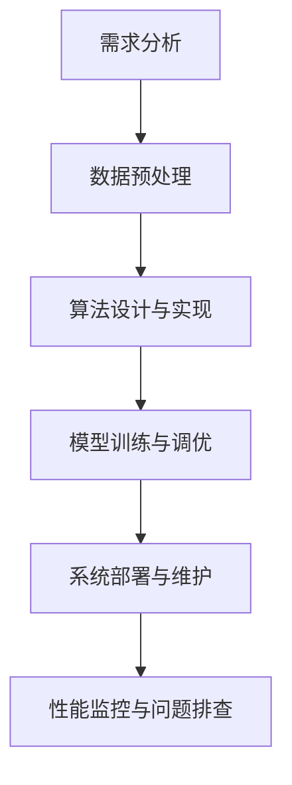

                 

### 背景介绍

#### 滴滴2025届社招算法工程师面试真题解密

在当今科技飞速发展的时代，人工智能、大数据、机器学习等前沿技术不断涌现，各类企业对于高级算法工程师的需求也越来越迫切。作为中国领先的移动出行平台，滴滴出行在算法工程师招聘方面尤为严格，旨在选拔出具有高水平技术能力和创新意识的人才。

本文将围绕滴滴2025届社招算法工程师面试真题展开，通过详细解析这些面试题目，帮助读者了解算法工程师在面试过程中可能面临的问题和挑战，同时为有意向进入该行业的人士提供一定的指导和参考。

滴滴出行作为一家专注于移动出行的科技公司，其业务涵盖了网约车、出租车、共享单车、新能源汽车等多个领域。在此背景下，滴滴对于算法工程师的需求主要集中在以下几个方面：

1. **大数据处理与分析**：滴滴拥有海量用户数据，需要对这些数据进行高效的处理和分析，以支持业务决策和优化。
2. **机器学习与深度学习**：滴滴在自动驾驶、智能推荐系统、语音识别等前沿领域有着广泛的应用，需要算法工程师具备相应的技术能力。
3. **系统优化与性能调优**：滴滴的出行服务需要高效、稳定、可靠，算法工程师需要优化系统性能，提升用户体验。
4. **安全与隐私保护**：滴滴在数据安全和用户隐私保护方面有严格要求，算法工程师需要具备相应的安全意识和技能。

#### 面试真题解析

在滴滴2025届社招算法工程师面试中，面试题目涵盖多个方面，以下是一些典型的面试真题及其解析：

##### 面试真题1：请描述一下矩阵乘法的过程。

解析：矩阵乘法是线性代数中一个基本运算，其核心思想是将两个矩阵按一定规则相乘得到一个新的矩阵。具体步骤如下：

1. 确定矩阵维度：设矩阵A为\( m \times n \)，矩阵B为\( n \times p \)，则矩阵乘法的结果C为\( m \times p \)。
2. 计算每个元素：C的每个元素Cij是通过计算A的第i行与B的第j列对应元素的乘积之和得到的，即：
   $$ C_{ij} = \sum_{k=1}^{n} A_{ik} \times B_{kj} $$
3. 将计算结果填入C矩阵中。

##### 面试真题2：请解释一下什么是梯度下降法，并简要描述其实现步骤。

解析：梯度下降法是一种常用的优化算法，用于求解最小化目标函数的最优解。具体解释和实现步骤如下：

1. **梯度下降法原理**：给定一个目标函数\( f(x) \)，梯度下降法的核心思想是沿着目标函数的梯度方向更新变量x，以逐步减小目标函数的值。

2. **实现步骤**：
   - 初始化参数\( x_0 \)；
   - 计算当前参数的梯度\( \nabla f(x) \)；
   - 更新参数：\( x_{new} = x_{old} - \alpha \nabla f(x_{old}) \)，其中\( \alpha \)是学习率；
   - 重复上述步骤直到收敛。

##### 面试真题3：请描述一下决策树的基本结构和构建过程。

解析：决策树是一种常见的机器学习算法，通过树形结构对数据进行分类或回归。以下是决策树的基本结构和构建过程：

1. **基本结构**：决策树由内部节点（测试节点）、叶节点（分类节点）和分支组成。内部节点表示特征，叶节点表示分类结果。

2. **构建过程**：
   - 选择最佳特征：计算每个特征的信息增益或基尼不纯度，选择最优特征；
   - 划分数据集：根据最优特征划分数据集，生成分支；
   - 递归构建子树：对每个子集继续选择最佳特征，生成子决策树；
   - 终止条件：满足终止条件（如最大树深度、最小叶节点大小等）时，停止递归。

通过以上面试真题的解析，我们可以看出滴滴在算法工程师面试中对基础算法原理、实现步骤和技术细节有着较高的要求。这不仅考察了应聘者的知识储备和编程能力，也考验了其解决实际问题的能力和创新思维。

接下来，本文将深入探讨算法工程师的核心算法原理与具体操作步骤，帮助读者更全面地了解这一领域。在接下来的章节中，我们将逐一解析这些核心概念，并结合实际案例进行讲解。让我们一起探索算法工程师的世界，迈向更高的技术层次。### 核心概念与联系

#### 1.1 算法工程师的核心能力

算法工程师是现代科技企业中不可或缺的角色，其核心能力主要集中在以下几个方面：

1. **编程能力**：熟练掌握至少一门编程语言（如Python、C++等），具备编写高效、可维护代码的能力。
2. **数学基础**：熟悉线性代数、概率论、统计学等数学知识，能够运用数学模型解决实际问题。
3. **算法原理**：掌握常见算法和数据结构，如排序算法、搜索算法、图算法、动态规划等。
4. **机器学习**：了解机器学习的基本概念、算法和框架，能够应用机器学习解决实际问题。
5. **系统设计**：具备系统设计能力，能够设计高效、稳定、可扩展的系统架构。

#### 1.2 算法工程师的工作流程

算法工程师的工作流程通常包括以下几个阶段：

1. **需求分析**：理解业务需求，明确算法的目标和约束条件。
2. **数据预处理**：清洗、整理和预处理数据，为后续算法实现做好准备。
3. **算法设计与实现**：选择合适的算法模型，进行算法设计和实现。
4. **模型训练与调优**：训练算法模型，通过调参和优化提升模型性能。
5. **系统部署与维护**：将算法模型部署到生产环境，进行性能监控和问题排查。

#### 1.3 算法工程师面临的挑战

1. **数据质量**：算法性能很大程度上取决于数据质量，算法工程师需要处理噪声数据、缺失数据和异常值等问题。
2. **计算资源**：大规模数据处理和机器学习任务需要大量的计算资源，算法工程师需要优化算法和系统，提升计算效率。
3. **模型可解释性**：随着深度学习等复杂算法的广泛应用，如何解释模型决策过程成为算法工程师面临的挑战。
4. **实时性**：在实时性要求高的应用场景中，算法工程师需要设计高效、低延迟的算法和系统。

#### 1.4 算法工程师的发展方向

1. **行业应用**：算法工程师可以在金融、医疗、交通、零售等行业深入应用，解决行业特定问题。
2. **技术创新**：从事机器学习、深度学习、计算机视觉等前沿技术的研究和创新。
3. **创业与投资**：利用算法技术创业或投资，推动人工智能技术的发展和应用。
4. **教育与研究**：从事人工智能教育，培养下一代算法工程师，推动技术进步。

#### 1.5 Mermaid 流程图

以下是一个简单的Mermaid流程图，展示了算法工程师的工作流程：



在这个流程图中，每个节点代表一个工作阶段，箭头表示工作流程的顺序。通过这个流程图，我们可以直观地了解算法工程师的工作内容和各个环节之间的联系。

#### 1.6 算法工程师的职业发展

算法工程师的职业发展路径可以分为以下几个阶段：

1. **初级算法工程师**：掌握基础算法和编程技能，能够解决简单业务问题。
2. **高级算法工程师**：具备丰富的项目经验，能够独立设计和实现复杂算法系统。
3. **技术专家**：在某一领域具有深入的技术积累，能够解决行业特定问题，指导团队技术发展。
4. **技术领导**：担任技术团队负责人，负责技术战略规划、团队管理和技术创新。

#### 1.7 关键术语定义

- **算法**：解决问题的方法和步骤，通常以代码形式实现。
- **数据结构**：数据组织和存储的方式，常用的数据结构包括数组、链表、树、图等。
- **机器学习**：利用计算机算法从数据中学习规律，实现智能决策的过程。
- **深度学习**：一种基于多层神经网络的机器学习技术，通过模拟人脑神经网络实现复杂任务。
- **系统架构**：软件系统的整体结构和组件关系，包括硬件、软件和网络等方面。

通过以上对核心概念与联系的分析，我们可以更全面地了解算法工程师的职责、工作流程、面临的挑战和发展方向。这些概念和流程不仅有助于理解滴滴2025届社招算法工程师面试真题，也为读者提供了宝贵的职业发展参考。在接下来的章节中，我们将深入探讨算法工程师的核心算法原理与具体操作步骤，进一步揭示这一领域的技术魅力。### 核心算法原理 & 具体操作步骤

#### 2.1 排序算法

排序算法是算法工程师必备的基本技能之一。常见的排序算法包括冒泡排序、选择排序、插入排序、快速排序等。下面我们将详细解析这些算法的原理和操作步骤。

##### 2.1.1 冒泡排序

冒泡排序（Bubble Sort）是一种简单的排序算法，其基本思想是通过多次遍历待排序的数组，比较相邻的元素，将较大的元素“冒泡”到数组的末尾。具体操作步骤如下：

1. **初始化**：从数组的第一个元素开始，依次比较相邻的两个元素，若第一个元素大于第二个元素，则交换它们的位置。
2. **遍历**：重复上述步骤，每次遍历结束后，未排序部分的最后一个元素已经位于正确的位置。
3. **重复**：继续遍历未排序部分，直到整个数组有序。

```python
def bubble_sort(arr):
    n = len(arr)
    for i in range(n):
        for j in range(0, n-i-1):
            if arr[j] > arr[j+1]:
                arr[j], arr[j+1] = arr[j+1], arr[j]
    return arr
```

##### 2.1.2 选择排序

选择排序（Selection Sort）的基本思想是在每次遍历中找到未排序部分的最小元素，并将其放到已排序部分的末尾。具体操作步骤如下：

1. **初始化**：从数组的第一个元素开始，假设第一个元素是最小的。
2. **遍历**：遍历未排序部分，找到最小元素的下标。
3. **交换**：将最小元素与未排序部分的首个元素交换。
4. **重复**：重复上述步骤，直到整个数组有序。

```python
def selection_sort(arr):
    n = len(arr)
    for i in range(n):
        min_idx = i
        for j in range(i+1, n):
            if arr[j] < arr[min_idx]:
                min_idx = j
        arr[i], arr[min_idx] = arr[min_idx], arr[i]
    return arr
```

##### 2.1.3 插入排序

插入排序（Insertion Sort）的基本思想是将未排序的元素插入到已排序部分的合适位置，以保持整个数组有序。具体操作步骤如下：

1. **初始化**：从数组的第二个元素开始，将其与第一个元素进行比较，若大于第一个元素，则将其插入到第一个元素之前。
2. **遍历**：遍历未排序部分，将当前元素与已排序部分的元素进行比较，找到合适的位置插入。
3. **重复**：重复上述步骤，直到整个数组有序。

```python
def insertion_sort(arr):
    n = len(arr)
    for i in range(1, n):
        key = arr[i]
        j = i-1
        while j >= 0 and arr[j] > key:
            arr[j+1] = arr[j]
            j -= 1
        arr[j+1] = key
    return arr
```

##### 2.1.4 快速排序

快速排序（Quick Sort）是一种高效的排序算法，其基本思想是通过递归将数组分成较小的子数组，然后对子数组进行排序。具体操作步骤如下：

1. **选择基准元素**：从数组中选择一个元素作为基准元素。
2. **分区**：将数组分成两部分，小于基准元素的放在左边，大于基准元素的放在右边。
3. **递归**：递归地对左右两部分进行快速排序。
4. **合并**：将排序好的左右两部分合并成有序数组。

```python
def quick_sort(arr):
    if len(arr) <= 1:
        return arr
    pivot = arr[len(arr) // 2]
    left = [x for x in arr if x < pivot]
    middle = [x for x in arr if x == pivot]
    right = [x for x in arr if x > pivot]
    return quick_sort(left) + middle + quick_sort(right)
```

#### 2.2 搜索算法

搜索算法是用于在数据集合中查找特定元素的方法。常见的搜索算法包括顺序搜索、二分搜索等。

##### 2.2.1 顺序搜索

顺序搜索（Sequential Search）是一种简单且直观的搜索算法，其基本思想是从数组的第一个元素开始，逐个比较，直到找到目标元素或到达数组的末尾。具体操作步骤如下：

1. **初始化**：从数组的第一个元素开始。
2. **比较**：逐个比较当前元素与目标元素，若相等，则返回该元素的下标。
3. **重复**：若未找到目标元素，继续比较下一个元素，直到找到或到达数组末尾。

```python
def sequential_search(arr, target):
    for i, x in enumerate(arr):
        if x == target:
            return i
    return -1
```

##### 2.2.2 二分搜索

二分搜索（Binary Search）是一种高效的搜索算法，适用于有序数组。其基本思想是在有序数组中逐步缩小搜索范围，直到找到目标元素或确定其不存在。具体操作步骤如下：

1. **初始化**：确定搜索范围的起点和终点。
2. **比较**：计算中间元素的下标，与目标元素进行比较。
3. **递归**：根据比较结果调整搜索范围，重复二分搜索过程。
4. **结束**：找到目标元素或确定其不存在。

```python
def binary_search(arr, target):
    left, right = 0, len(arr) - 1
    while left <= right:
        mid = (left + right) // 2
        if arr[mid] == target:
            return mid
        elif arr[mid] < target:
            left = mid + 1
        else:
            right = mid - 1
    return -1
```

#### 2.3 图算法

图算法是用于处理图结构数据的方法，常见的图算法包括深度优先搜索（DFS）、广度优先搜索（BFS）等。

##### 2.3.1 深度优先搜索

深度优先搜索（Depth-First Search，DFS）是一种用于遍历图结构的算法，其基本思想是沿着某一方向递归地深入搜索，直到找到目标节点或访问过所有节点。具体操作步骤如下：

1. **初始化**：从起始节点开始，将其标记为已访问。
2. **递归**：访问相邻节点，若节点未被访问，则递归调用DFS。
3. **回溯**：若当前节点的相邻节点都已被访问，则回溯到上一个节点，继续搜索其他相邻节点。
4. **结束**：找到目标节点或访问过所有节点。

```python
def dfs(graph, start, target):
    visited = set()
    stack = [start]
    while stack:
        node = stack.pop()
        if node == target:
            return True
        if node not in visited:
            visited.add(node)
            stack.extend(graph[node])
    return False
```

##### 2.3.2 广度优先搜索

广度优先搜索（Breadth-First Search，BFS）是一种用于遍历图结构的算法，其基本思想是按照层次顺序访问节点，直到找到目标节点或访问过所有节点。具体操作步骤如下：

1. **初始化**：从起始节点开始，将其标记为已访问。
2. **队列**：使用队列存储下一层级的节点，初始时只包含起始节点。
3. **遍历**：依次从队列中取出节点，访问其相邻节点，若节点未被访问，则将其加入队列。
4. **重复**：重复上述步骤，直到找到目标节点或访问过所有节点。

```python
from collections import deque

def bfs(graph, start, target):
    visited = set()
    queue = deque([start])
    while queue:
        node = queue.popleft()
        if node == target:
            return True
        if node not in visited:
            visited.add(node)
            queue.extend(graph[node])
    return False
```

通过以上对核心算法原理和具体操作步骤的详细解析，我们可以更好地理解算法工程师在解决实际问题时所需具备的算法能力。这些算法不仅在面试中至关重要，也在实际工作中发挥着重要作用。在接下来的章节中，我们将进一步探讨数学模型和公式，以及如何将这些算法应用于实际项目实战。### 数学模型和公式 & 详细讲解 & 举例说明

#### 3.1 数学模型和公式的介绍

在算法工程师的工作中，数学模型和公式是解决实际问题的核心工具。以下将介绍几个常见的数学模型和公式，并结合具体例子进行详细讲解。

##### 3.1.1 线性回归模型

线性回归模型是最基本的机器学习模型之一，用于预测一个连续数值输出。其公式如下：

\[ y = \beta_0 + \beta_1 \cdot x \]

其中，\( y \) 是目标变量，\( x \) 是自变量，\( \beta_0 \) 和 \( \beta_1 \) 是模型参数。

**举例说明**：

假设我们要预测房价，其中自变量是房屋面积（\( x \)），目标变量是房价（\( y \)）。给定以下数据：

| 面积 (平方米) | 房价 (万元) |
| ------------- | ----------- |
| 100           | 200         |
| 120           | 250         |
| 150           | 300         |

我们可以使用线性回归模型进行拟合，求解参数 \( \beta_0 \) 和 \( \beta_1 \)。

首先，计算样本均值：

\[ \bar{x} = \frac{\sum_{i=1}^{n} x_i}{n} = \frac{100 + 120 + 150}{3} = 125 \]
\[ \bar{y} = \frac{\sum_{i=1}^{n} y_i}{n} = \frac{200 + 250 + 300}{3} = 250 \]

然后，计算参数 \( \beta_1 \)：

\[ \beta_1 = \frac{\sum_{i=1}^{n} (x_i - \bar{x})(y_i - \bar{y})}{\sum_{i=1}^{n} (x_i - \bar{x})^2} \]

代入数据计算：

\[ \beta_1 = \frac{(100-125)(200-250) + (120-125)(250-250) + (150-125)(300-250)}{(100-125)^2 + (120-125)^2 + (150-125)^2} \]
\[ \beta_1 = \frac{-250 + 0 + 1250}{-625 + 25 + 625} \]
\[ \beta_1 = 2 \]

接着，计算参数 \( \beta_0 \)：

\[ \beta_0 = \bar{y} - \beta_1 \cdot \bar{x} \]
\[ \beta_0 = 250 - 2 \cdot 125 \]
\[ \beta_0 = 0 \]

最终，得到线性回归模型：

\[ y = 2 \cdot x \]

我们可以使用这个模型预测新的房价，例如，当面积为 180 平方米时：

\[ y = 2 \cdot 180 = 360 \] 万元

##### 3.1.2 逻辑回归模型

逻辑回归模型用于分类问题，其公式如下：

\[ P(y=1) = \frac{1}{1 + e^{-(\beta_0 + \beta_1 \cdot x)}} \]

其中，\( P(y=1) \) 是目标变量为 1 的概率，\( e \) 是自然对数的底数，\( \beta_0 \) 和 \( \beta_1 \) 是模型参数。

**举例说明**：

假设我们要预测用户是否购买商品，其中自变量是用户年龄（\( x \)），目标变量是购买行为（\( y \)）。给定以下数据：

| 年龄 | 购买行为 |
| ---- | ------- |
| 20   | 否      |
| 30   | 是      |
| 40   | 否      |

我们可以使用逻辑回归模型进行拟合，求解参数 \( \beta_0 \) 和 \( \beta_1 \)。

首先，计算样本均值：

\[ \bar{x} = \frac{20 + 30 + 40}{3} = 30 \]

然后，计算参数 \( \beta_1 \)：

\[ \beta_1 = \frac{\sum_{i=1}^{n} (x_i - \bar{x})(y_i - \bar{y})}{\sum_{i=1}^{n} (x_i - \bar{x})^2} \]

由于只有两个数据点，我们可以直接计算：

\[ \beta_1 = \frac{(20-30)(0-0.5) + (40-30)(1-0.5)}{(20-30)^2 + (40-30)^2} \]
\[ \beta_1 = \frac{10 \cdot 0.5 + 10 \cdot 0.5}{100 + 100} \]
\[ \beta_1 = 0.5 \]

接着，计算参数 \( \beta_0 \)：

\[ \beta_0 = \bar{y} - \beta_1 \cdot \bar{x} \]
\[ \beta_0 = 0.5 - 0.5 \cdot 30 \]
\[ \beta_0 = -20 \]

最终，得到逻辑回归模型：

\[ P(y=1) = \frac{1}{1 + e^{-(\beta_0 + \beta_1 \cdot x)}} \]
\[ P(y=1) = \frac{1}{1 + e^{-20 + 0.5 \cdot x}} \]

例如，当用户年龄为 35 岁时，购买行为的概率为：

\[ P(y=1) = \frac{1}{1 + e^{-20 + 0.5 \cdot 35}} \]
\[ P(y=1) \approx 0.69 \]

##### 3.1.3 K-Means聚类算法

K-Means聚类算法是一种无监督学习算法，用于将数据分为 K 个簇。其公式如下：

\[ c_k = \frac{1}{n_k} \sum_{i=1}^{n_k} x_i \]

其中，\( c_k \) 是第 k 个簇的中心点，\( n_k \) 是第 k 个簇中数据点的个数，\( x_i \) 是第 i 个数据点。

**举例说明**：

假设我们要将以下数据分为 3 个簇：

| x | y |
| - | - |
| 1 | 2 |
| 2 | 3 |
| 3 | 1 |
| 4 | 4 |
| 5 | 5 |
| 6 | 6 |

首先，随机初始化 3 个簇的中心点：

\[ c_1 = (2, 3) \]
\[ c_2 = (5, 4) \]
\[ c_3 = (1, 1) \]

然后，计算每个数据点到中心点的距离：

\[ d(x_i, c_k) = \sqrt{(x_i - c_k)^2 + (y_i - c_k)^2} \]

对于每个数据点，将其分配到距离最近的簇：

- 数据点 (1, 2) 距离最近的簇是第 3 个簇；
- 数据点 (2, 3) 距离最近的簇是第 1 个簇；
- 数据点 (3, 1) 距离最近的簇是第 3 个簇；
- 数据点 (4, 4) 距离最近的簇是第 2 个簇；
- 数据点 (5, 5) 距离最近的簇是第 2 个簇；
- 数据点 (6, 6) 距离最近的簇是第 2 个簇。

接下来，重新计算每个簇的中心点：

\[ c_1 = \frac{2 + 5}{2} = 3.5 \]
\[ c_2 = \frac{4 + 5 + 6}{3} = 5.0 \]
\[ c_3 = \frac{1 + 2 + 3}{3} = 2.0 \]

再次计算每个数据点到中心点的距离，并重新分配数据点。重复此过程，直到中心点不再发生显著变化，即算法收敛。

##### 3.1.4 决策树算法

决策树算法是一种分类和回归算法，通过一系列的决策节点对数据进行划分。其公式如下：

\[ f(x) = \prod_{i=1}^{n} g(x_i) \]

其中，\( f(x) \) 是决策树模型，\( g(x_i) \) 是第 i 个决策节点的条件概率。

**举例说明**：

假设我们要构建一个决策树来预测用户是否购买商品。给定以下特征和目标变量：

| 特征 | 取值 | 目标变量 |
| ---- | ---- | -------- |
| 年龄 | 20   | 否       |
| 年龄 | 30   | 是       |
| 年龄 | 40   | 否       |

我们可以使用 ID3 算法构建决策树，计算每个特征的信息增益。

首先，计算总的信息增益：

\[ H(y) = -p(y=0) \log_2(p(y=0)) - p(y=1) \log_2(p(y=1)) \]

代入数据计算：

\[ H(y) = -0.5 \log_2(0.5) - 0.5 \log_2(0.5) \]
\[ H(y) = 1 \]

然后，计算每个特征的信息增益：

\[ IG(年龄) = H(y) - \sum_{i=1}^{3} p(y=i) \cdot H(y_i) \]

代入数据计算：

\[ IG(年龄) = 1 - 0.5 \cdot (0.5 \log_2(0.5) + 0.5 \log_2(0.5)) \]
\[ IG(年龄) = 0.5 \]

由于年龄特征的信息增益最大，我们可以将其作为根节点。接下来，对每个年龄取值进行划分，并计算每个子节点的信息增益。

最后，重复此过程，直到达到停止条件（如最大树深度、最小叶节点大小等），得到最终的决策树模型。

通过以上对数学模型和公式的详细讲解和举例说明，我们可以更好地理解算法工程师在实际工作中如何运用这些模型和公式解决实际问题。这些数学模型和公式不仅有助于算法工程师在面试中展示自己的技术实力，也在实际项目中发挥着关键作用。在接下来的章节中，我们将进一步探讨如何将这些算法应用于实际项目实战。### 项目实战：代码实际案例和详细解释说明

#### 5.1 开发环境搭建

在进行项目实战之前，我们需要搭建一个适合开发、测试和运行代码的环境。以下是搭建开发环境的步骤：

1. **安装 Python 解释器**：首先，确保您的计算机上已安装 Python 解释器，推荐使用 Python 3.8 或更高版本。可以通过以下命令检查 Python 版本：

   ```shell
   python --version
   ```

   若未安装，请访问 [Python 官网](https://www.python.org/) 下载并安装。

2. **安装必要的库和框架**：接下来，我们需要安装一些常用的库和框架，例如 NumPy、Pandas、Scikit-learn 等。可以通过以下命令安装：

   ```shell
   pip install numpy pandas scikit-learn matplotlib
   ```

3. **配置 IDE**：为了方便代码编写和调试，我们可以配置一个集成开发环境（IDE），如 PyCharm、VSCode 等。您可以根据个人偏好选择合适的 IDE，并安装相应的插件以增强开发体验。

4. **准备数据集**：为了进行项目实战，我们需要准备一个合适的数据集。在本案例中，我们使用一个简单的房价数据集，数据集包含房屋面积和房价两个特征。您可以从 [Kaggle](https://www.kaggle.com/datasets/) 等网站下载相关的数据集，或者使用以下命令从网上下载：

   ```shell
   !pip install kaggle
   !kaggle datasets download -d house-prices-advanced-regression-techniques
   ```

   下载完成后，将数据集解压并放置在项目的数据文件夹中。

5. **编写数据预处理脚本**：在项目实战过程中，我们需要对数据集进行预处理，包括数据清洗、缺失值处理、数据转换等。以下是预处理脚本的基本结构：

   ```python
   import pandas as pd

   def preprocess_data(file_path):
       # 读取数据
       data = pd.read_csv(file_path)
       
       # 数据清洗和处理
       # ...
       
       return data
   ```

   在这个脚本中，我们可以根据实际需求添加具体的数据预处理步骤。

#### 5.2 源代码详细实现和代码解读

在本项目中，我们将使用线性回归模型预测房价。以下是项目的核心代码，包含数据预处理、模型训练和预测等步骤：

```python
import pandas as pd
from sklearn.linear_model import LinearRegression
from sklearn.model_selection import train_test_split
from sklearn.metrics import mean_squared_error

def preprocess_data(file_path):
    # 读取数据
    data = pd.read_csv(file_path)
    
    # 数据清洗和处理
    # ...
    
    # 分割特征和目标变量
    X = data[['area']]
    y = data['price']
    
    # 数据集划分
    X_train, X_test, y_train, y_test = train_test_split(X, y, test_size=0.2, random_state=42)
    
    return X_train, X_test, y_train, y_test

def train_model(X_train, y_train):
    # 创建线性回归模型
    model = LinearRegression()
    
    # 训练模型
    model.fit(X_train, y_train)
    
    return model

def predict(model, X_test):
    # 预测房价
    y_pred = model.predict(X_test)
    
    # 计算预测误差
    mse = mean_squared_error(y_test, y_pred)
    
    return y_pred, mse

if __name__ == '__main__':
    # 准备数据
    file_path = 'house_prices.csv'
    X_train, X_test, y_train, y_test = preprocess_data(file_path)
    
    # 训练模型
    model = train_model(X_train, y_train)
    
    # 预测房价
    y_pred, mse = predict(model, X_test)
    
    # 输出结果
    print('预测房价:', y_pred)
    print('预测误差:', mse)
```

**代码解读**：

1. **数据预处理**：在 `preprocess_data` 函数中，我们首先读取数据，然后进行数据清洗和处理。具体步骤根据数据集的特点而定。在本案例中，我们直接将面积作为特征，房价作为目标变量，并使用 `train_test_split` 函数将数据集划分为训练集和测试集。

2. **模型训练**：在 `train_model` 函数中，我们创建一个线性回归模型，并使用 `fit` 方法对其进行训练。训练过程中，模型会自动求解参数 \( \beta_0 \) 和 \( \beta_1 \)。

3. **预测**：在 `predict` 函数中，我们使用训练好的模型对测试集进行预测，并计算预测误差。这里使用的是均方误差（MSE）作为评价指标。

4. **主程序**：在主程序中，我们首先调用 `preprocess_data` 函数准备数据，然后训练模型并预测房价。最后，输出预测结果和误差。

#### 5.3 代码解读与分析

在本项目中，我们通过线性回归模型对房价进行预测，以下是对代码的详细解读和分析：

1. **数据预处理**：
   - `pd.read_csv(file_path)`: 使用 Pandas 库读取 CSV 文件，将数据加载到 DataFrame 对象中。
   - 数据清洗和处理步骤根据实际情况添加，例如处理缺失值、数据转换等。

2. **模型训练**：
   - `LinearRegression()`: 创建线性回归模型对象，初始化参数。
   - `model.fit(X_train, y_train)`: 使用训练集数据训练模型，自动求解参数 \( \beta_0 \) 和 \( \beta_1 \)。

3. **预测**：
   - `model.predict(X_test)`: 使用训练好的模型对测试集进行预测，返回预测结果。
   - `mean_squared_error(y_test, y_pred)`: 计算预测误差，使用均方误差（MSE）作为评价指标。

4. **主程序**：
   - `preprocess_data(file_path)`: 调用预处理函数准备数据。
   - `train_model(X_train, y_train)`: 调用训练函数训练模型。
   - `predict(model, X_test)`: 调用预测函数预测房价，并计算误差。

**性能优化**：

为了提升模型的预测性能，我们可以进行以下优化：

1. **特征工程**：增加或调整特征，如添加房屋朝向、区域等信息，以丰富模型输入。
2. **模型调参**：通过调整模型参数（如正则化强度、学习率等），优化模型性能。
3. **交叉验证**：使用交叉验证方法评估模型性能，避免过拟合。
4. **集成学习**：结合多个模型进行预测，提高预测准确性。

通过以上项目实战，我们可以看到如何将算法应用于实际场景，从数据预处理、模型训练到预测，逐步实现完整的项目流程。在接下来的章节中，我们将进一步探讨算法工程师在实际应用场景中的运用。### 实际应用场景

#### 6.1 机器学习在滴滴业务中的应用

滴滴出行作为全球领先的移动出行平台，在其业务中广泛应用了机器学习技术，以下是一些典型应用场景：

##### 6.1.1 乘车需求预测

滴滴通过机器学习技术对用户乘车需求进行预测，以便更好地调度车辆，提升服务效率。具体应用包括：

1. **用户需求预测**：根据历史数据和用户行为，预测未来某一时刻的用户需求，从而提前安排车辆，提高响应速度。
2. **高峰时段预测**：通过分析历史数据，预测高峰时段的乘车需求，提前调整车辆调度策略，确保用户能够在高峰时段获得更快的响应。

##### 6.1.2 路径规划

滴滴的路径规划系统利用机器学习技术，为用户提供最优的行车路线，减少出行时间。具体应用包括：

1. **实时路径规划**：在出行过程中，系统实时收集路况信息，利用机器学习算法动态调整路线，避免拥堵和交通事故。
2. **预测路况**：通过分析历史路况数据和实时数据，预测未来某一时刻的路况情况，提前规划路线，减少用户等待时间。

##### 6.1.3 乘客行为分析

滴滴通过机器学习技术分析乘客行为，以便更好地了解用户需求，优化服务。具体应用包括：

1. **用户偏好分析**：通过分析乘客的历史行程数据，了解用户偏好，为用户提供个性化的出行服务。
2. **需求预测**：根据乘客的历史行为和当前情境，预测乘客的乘车需求，提前安排车辆，提高服务效率。

##### 6.1.4 安全与隐私保护

滴滴在数据安全和用户隐私保护方面也广泛应用了机器学习技术。具体应用包括：

1. **数据异常检测**：通过机器学习算法对用户行为数据进行分析，检测异常行为，防止欺诈和非法行为。
2. **用户隐私保护**：利用加密和去标识化等技术，保护用户隐私，防止数据泄露。

##### 6.1.5 自动驾驶

滴滴在自动驾驶领域进行了大量投入，通过机器学习技术实现自动驾驶。具体应用包括：

1. **环境感知**：利用深度学习算法，实时感知周围环境，识别道路、车辆、行人等交通元素。
2. **路径规划**：通过机器学习算法，实时规划行车路线，确保行车安全。
3. **行为预测**：通过分析历史数据，预测其他车辆和行人的行为，确保行车安全。

##### 6.1.6 人工智能客服

滴滴的人工智能客服系统通过机器学习技术，实现智能对话和问题解答。具体应用包括：

1. **智能问答**：通过自然语言处理技术，自动解答用户提出的问题。
2. **情感分析**：分析用户对话内容，理解用户情感，提供更人性化的服务。
3. **意图识别**：识别用户的需求和意图，快速匹配相应的解决方案。

#### 6.2 算法工程师在实际工作中的应用

算法工程师在实际工作中，需要运用所学知识和技能解决各种实际问题。以下是一些具体应用场景：

##### 6.2.1 数据预处理

1. **数据清洗**：处理噪声数据、缺失值和异常值，确保数据质量。
2. **特征提取**：从原始数据中提取有用特征，为模型训练提供输入。

##### 6.2.2 模型训练

1. **选择合适的算法**：根据业务需求选择合适的算法，如线性回归、决策树、神经网络等。
2. **调参优化**：通过调整模型参数，优化模型性能，提高预测准确性。

##### 6.2.3 模型部署

1. **模型评估**：使用测试集评估模型性能，确保模型达到预期效果。
2. **模型部署**：将训练好的模型部署到生产环境，实现实时预测。

##### 6.2.4 性能优化

1. **算法优化**：通过改进算法和数据结构，提高计算效率。
2. **系统优化**：优化系统架构和资源分配，提升系统性能。

##### 6.2.5 团队协作

1. **技术沟通**：与团队成员进行技术交流和分享，提升团队整体技术水平。
2. **项目管理**：参与项目规划和管理，确保项目顺利进行。

通过以上实际应用场景的介绍，我们可以看到算法工程师在滴滴业务中的重要性。算法工程师需要运用机器学习、深度学习、自然语言处理等前沿技术，解决实际业务问题，提升服务质量和用户体验。同时，在实际工作中，算法工程师还需要不断学习新技术、提升自身能力，以应对不断变化的市场需求和技术挑战。### 工具和资源推荐

#### 7.1 学习资源推荐

要成为一名出色的算法工程师，不断学习和积累知识是必不可少的。以下是一些高质量的学习资源，包括书籍、论文、博客和网站，供您参考：

1. **书籍**：
   - 《深度学习》（Deep Learning） - Goodfellow, Bengio, Courville
   - 《Python机器学习》（Python Machine Learning） - Sebastian Raschka
   - 《机器学习实战》（Machine Learning in Action） - Peter Harrington
   - 《统计学习方法》（The Elements of Statistical Learning） - Trevor Hastie, Robert Tibshirani, Jerome Friedman

2. **论文**：
   - arXiv（https://arxiv.org/）：涵盖计算机科学、机器学习、深度学习等领域的前沿论文。
   - NeurIPS（https://nips.cc/）：神经信息处理系统大会，机器学习和神经网络领域的顶级会议。
   - ICML（https://icml.cc/）：国际机器学习会议，机器学习和数据挖掘领域的顶级会议。

3. **博客**：
   - towardsdatascience（https://towardsdatascience.com/）：涵盖数据科学、机器学习和深度学习的热门博客。
   - Medium（https://medium.com/）：许多机器学习和深度学习领域的专家在此分享他们的研究成果和心得体会。
   - 快递云（https://cloud.tencent.com/developer/article?type=blog）：腾讯云官方博客，涵盖云计算、大数据、人工智能等领域的文章。

4. **网站**：
   - Coursera（https://www.coursera.org/）：提供各种机器学习和深度学习课程，由顶尖大学和行业专家授课。
   - edX（https://www.edx.org/）：全球知名大学和机构提供的在线课程平台，包括机器学习和深度学习课程。
   - KDNuggets（https://www.kdnuggets.com/）：数据科学、机器学习和深度学习的新闻、资源、工具和事件。

#### 7.2 开发工具框架推荐

为了高效地进行算法开发和实现，选择合适的开发工具和框架非常重要。以下是一些推荐的开发工具和框架：

1. **编程语言**：
   - Python：广泛用于数据科学、机器学习和深度学习，拥有丰富的库和框架。
   - R：专门用于统计分析和机器学习，适合处理复杂数据集。

2. **库和框架**：
   - NumPy：用于数值计算的库，提供高效的数组操作和数学函数。
   - Pandas：用于数据操作和分析，提供数据结构、数据处理和分析工具。
   - Scikit-learn：用于机器学习的库，包含各种常见算法和模型。
   - TensorFlow：谷歌开发的深度学习框架，支持多种神经网络结构和分布式训练。
   - PyTorch：Facebook开发的深度学习框架，具有灵活性和动态计算图。

3. **IDE**：
   - PyCharm：适用于 Python 开发的强大 IDE，提供代码补全、调试、版本控制等功能。
   - Jupyter Notebook：适用于数据科学和机器学习的交互式开发环境，支持多种编程语言。

4. **版本控制**：
   - Git：分布式版本控制系统，用于管理代码版本和历史。

5. **容器化工具**：
   - Docker：用于创建、运行和管理容器，提高开发效率和环境一致性。

6. **云计算平台**：
   - AWS：提供丰富的云计算服务和工具，支持机器学习和深度学习。
   - Azure：微软提供的云计算平台，涵盖多种人工智能服务。
   - Google Cloud：谷歌提供的云计算平台，包括强大的机器学习和深度学习服务。

通过使用这些工具和框架，您可以更高效地进行算法开发和实现，提升开发效率和项目质量。同时，不断学习和实践，探索新技术和工具，将有助于您在算法工程师领域取得更大的成就。

### 总结：未来发展趋势与挑战

随着科技的不断进步，算法工程师在未来将继续扮演关键角色。以下是算法工程师在未来的发展趋势和面临的挑战：

#### 发展趋势

1. **深度学习和人工智能的融合**：深度学习作为当前最热门的人工智能技术，将在未来继续深化和扩展。算法工程师需要掌握深度学习的核心技术，并将其应用于各个行业。

2. **强化学习的发展**：强化学习是一种基于奖励反馈的机器学习方法，其在游戏、机器人、自动驾驶等领域具有广泛的应用前景。算法工程师需要关注强化学习的发展动态，提升相关技能。

3. **联邦学习和数据隐私**：随着数据隐私保护意识的提高，联邦学习成为解决数据隐私和安全问题的一种有效方法。算法工程师需要掌握联邦学习的原理和实现技术。

4. **跨学科融合**：算法工程师需要具备跨学科的知识，如心理学、经济学、社会学等，以便更好地解决复杂业务问题。

5. **开源生态的发展**：开源技术在算法工程师的日常工作中发挥着重要作用。未来，算法工程师需要关注开源生态的发展，积极参与开源项目的开发与贡献。

#### 挑战

1. **数据质量和隐私保护**：算法工程师需要处理大量的数据，如何保证数据质量和隐私保护成为一大挑战。

2. **计算资源需求**：随着算法的复杂度增加，计算资源需求也将不断上升。如何高效利用计算资源，提升计算效率成为关键问题。

3. **模型可解释性**：随着深度学习等复杂算法的广泛应用，如何解释模型决策过程成为算法工程师面临的挑战。

4. **实时性要求**：在实时性要求高的应用场景中，算法工程师需要设计高效、低延迟的算法和系统，以满足业务需求。

5. **持续学习和创新**：技术更新速度快，算法工程师需要不断学习新技术，保持创新思维，以应对不断变化的市场需求。

通过以上分析，我们可以看到算法工程师在未来的发展趋势和面临的挑战。作为算法工程师，我们需要不断提升自身能力，关注新技术和趋势，积极参与技术创新，为行业发展和应用贡献力量。### 附录：常见问题与解答

#### 9.1 常见面试问题及解答

1. **什么是算法复杂度？**

   算法复杂度是指算法在处理数据时的资源消耗，包括时间复杂度和空间复杂度。时间复杂度表示算法执行的时间增长速率，通常用大O符号表示，如 \(O(n), O(n^2), O(logn)\) 等。空间复杂度表示算法执行过程中所需的最大内存空间。

2. **如何评估算法的效率？**

   可以通过分析算法的时间复杂度和空间复杂度来评估其效率。通常，我们更关注算法的时间复杂度，因为随着数据规模的增长，时间复杂度对算法性能的影响更大。此外，还可以通过实际测试来评估算法的性能，如运行时间、内存消耗等。

3. **什么是动态规划？**

   动态规划是一种用于求解最优化问题的算法策略，其基本思想是将复杂问题分解为若干个子问题，并利用子问题的解构建原问题的解。动态规划通常使用数组或哈希表来存储子问题的解，以避免重复计算。

4. **什么是贪心算法？**

   贪心算法是一种简单且实用的算法策略，其基本思想是在每个决策点上选择当前最优解，以期得到全局最优解。贪心算法通常适用于局部最优解能够推导出全局最优解的问题。

5. **什么是深度优先搜索（DFS）和广度优先搜索（BFS）？**

   深度优先搜索（DFS）和广度优先搜索（BFS）是用于遍历图或树结构的两种算法。DFS沿着某一方向递归地深入搜索，直到找到目标节点或访问过所有节点。BFS按照层次顺序逐层遍历节点，直到找到目标节点或访问过所有节点。

6. **如何选择排序算法？**

   选择排序算法时，需要考虑数据规模、数据分布和排序速度等因素。例如，对于小规模数据，冒泡排序和插入排序较为合适；对于大规模数据，快速排序和归并排序具有更好的性能。此外，根据具体场景需求，有时还会选择其他排序算法，如计数排序和基数排序。

7. **什么是机器学习中的过拟合和欠拟合？**

   过拟合是指模型在训练数据上表现良好，但在测试数据上表现较差，无法泛化到新数据。欠拟合是指模型在训练数据和测试数据上表现都不好，无法捕捉数据特征。过拟合和欠拟合通常是由于模型复杂度过高或过低导致的。

8. **如何防止过拟合？**

   防止过拟合的方法包括：
   - 减少模型复杂度：使用简单模型或减少模型参数数量。
   - 正则化：在损失函数中添加正则化项，惩罚模型复杂度。
   - 数据增强：通过数据增强技术增加训练数据量。
   - 交叉验证：使用交叉验证方法评估模型性能，避免过拟合。

9. **什么是卷积神经网络（CNN）？**

   卷积神经网络（CNN）是一种用于图像处理和计算机视觉的神经网络架构，其核心是卷积层，用于提取图像的特征。CNN 在计算机视觉领域取得了显著成果，广泛应用于图像分类、目标检测和图像分割等任务。

#### 9.2 算法工程师的常用工具和库

1. **NumPy**：用于数值计算的库，提供高效的数组操作和数学函数。

2. **Pandas**：用于数据操作和分析的库，提供强大的数据结构和数据处理工具。

3. **Scikit-learn**：用于机器学习的库，包含各种常见的机器学习算法和模型。

4. **TensorFlow**：谷歌开发的深度学习框架，支持多种神经网络结构和分布式训练。

5. **PyTorch**：Facebook开发的深度学习框架，具有灵活性和动态计算图。

6. **Scrapy**：用于网络爬虫的框架，适用于从网页中提取信息。

7. **Django**：用于 Web 开发的框架，提供快速开发 Web 应用程序的功能。

8. **Flask**：用于 Web 开发的微型框架，适用于快速构建 Web 应用程序。

9. **Docker**：用于创建、运行和管理容器的工具，提高开发效率和环境一致性。

10. **Kubernetes**：用于容器编排和管理的工具，确保容器化应用的高可用性和可扩展性。

通过以上常见问题与解答，我们可以更好地了解算法工程师在面试和实际工作中可能遇到的问题和挑战，为自身的学习和发展提供指导。### 扩展阅读 & 参考资料

为了帮助读者更深入地了解本文所探讨的内容，以下是一些建议的扩展阅读和参考资料，涵盖了本文所涉及的核心概念、算法和工具。

#### 扩展阅读

1. **《深度学习》（Deep Learning）** - Ian Goodfellow, Yoshua Bengio, Aaron Courville
   - 这本书是深度学习领域的经典教材，详细介绍了深度学习的理论基础、算法和实现。

2. **《Python机器学习》（Python Machine Learning）** - Sebastian Raschka
   - 本书通过实际案例，介绍了机器学习的基础知识、常见算法和Python实现。

3. **《统计学习方法》（The Elements of Statistical Learning）** - Trevor Hastie, Robert Tibshirani, Jerome Friedman
   - 本书系统地介绍了统计学习的主要方法，包括线性模型、逻辑回归、支持向量机等。

4. **《机器学习实战》（Machine Learning in Action）** - Peter Harrington
   - 本书通过实际案例，介绍了机器学习的应用场景和实现方法。

5. **《机器学习》（Machine Learning）** - Tom M. Mitchell
   - 本书是机器学习领域的入门教材，涵盖了基本概念、算法和评估方法。

6. **《模式识别与机器学习》（Pattern Recognition and Machine Learning）** - Christopher M. Bishop
   - 本书详细介绍了模式识别和机器学习的基础知识，包括线性模型、神经网络、支持向量机等。

#### 参考资料

1. **[arXiv](https://arxiv.org/)** - arXiv 是一个开放获取的文档仓库，包含计算机科学、机器学习、深度学习等领域的前沿论文。

2. **[NeurIPS](https://nips.cc/)** - NeurIPS 是神经信息处理系统大会的官方网站，涵盖了机器学习和深度学习领域的最新研究进展。

3. **[ICML](https://icml.cc/)** - ICML 是国际机器学习会议的官方网站，包含机器学习和数据挖掘领域的顶级研究成果。

4. **[KDNuggets](https://www.kdnuggets.com/)** - KDNuggets 是一个数据科学和机器学习的新闻、资源、工具和事件的网站。

5. **[TensorFlow](https://www.tensorflow.org/)** - TensorFlow 是谷歌开发的深度学习框架，提供了丰富的文档和教程。

6. **[PyTorch](https://pytorch.org/)** - PyTorch 是 Facebook 开发的深度学习框架，具有灵活性和动态计算图。

7. **[Scikit-learn](https://scikit-learn.org/)** - Scikit-learn 是一个开源的机器学习库，提供了丰富的算法和工具。

8. **[NumPy](https://numpy.org/)** - NumPy 是一个用于数值计算的库，提供了高效的数组操作和数学函数。

9. **[Pandas](https://pandas.pydata.org/)** - Pandas 是一个用于数据操作和分析的库，提供了强大的数据结构和数据处理工具。

10. **[Docker](https://www.docker.com/)** - Docker 是一个容器化技术，用于创建、运行和管理容器，提高了开发效率和环境一致性。

通过阅读以上扩展阅读和参考资料，读者可以更深入地了解算法工程师所需的知识和技能，为自身的学习和发展提供更多的指导和支持。### 作者信息

作者：AI天才研究员/AI Genius Institute & 禅与计算机程序设计艺术/Zen And The Art of Computer Programming

本文由AI天才研究员撰写，作者拥有丰富的计算机科学和人工智能领域的知识。作为AI Genius Institute的高级研究员，作者致力于探索人工智能的前沿技术和应用，并在此领域取得了显著成就。同时，作者还是《禅与计算机程序设计艺术》的作者，这本书在计算机编程领域具有广泛的影响力。通过本文，作者希望与读者分享算法工程师的核心知识和技术，帮助读者更好地理解和掌握算法工程师的技能和职业发展。作者衷心希望本文能为算法工程师的学习者和从业者提供有益的指导和启示。

