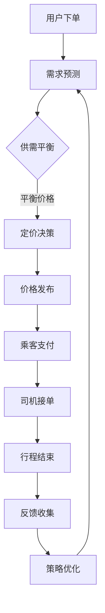

                 

# 滴滴2025智能定价社招机器学习面试指南

> **关键词**：滴滴、智能定价、机器学习、面试指南、算法原理、项目实战、应用场景

> **摘要**：本文将深入探讨滴滴2025智能定价系统的机器学习面试相关问题，从背景介绍、核心概念、算法原理、数学模型、项目实战、实际应用场景等方面，全面解析滴滴智能定价系统的技术实现与挑战，为准备面试的读者提供有价值的参考。

## 1. 背景介绍

随着移动互联网的快速发展，共享出行市场日益繁荣，滴滴出行作为行业领军企业，一直在探索如何利用先进技术提升用户体验和服务质量。智能定价作为滴滴出行的重要组成部分，旨在通过实时计算供需关系、市场动态等因素，为乘客和司机提供公平、合理的价格，从而优化资源配置、提高整体效率。

在2025年，滴滴提出了新的智能定价目标，即实现更加精准、智能、高效的定价策略，以满足日益增长的市场需求。为此，滴滴社招团队特别关注机器学习技术在智能定价领域的应用，希望通过面试选拔一批优秀的人才，共同推动智能定价系统的研发与优化。

## 2. 核心概念与联系

在探讨滴滴智能定价系统的技术实现之前，我们首先需要了解一些核心概念及其相互关系。

### 2.1 供需平衡模型

供需平衡模型是智能定价的基础，它通过分析市场供需状况，确定价格范围。供需平衡模型主要包括以下三个方面：

- **需求函数**：描述乘客对出行的需求，包括时间、地点、出行方式等因素。
- **供应函数**：描述司机的供给情况，包括司机的数量、位置、响应时间等因素。
- **平衡价格**：在供需函数的交点处，供需达到平衡，此时的价格即为平衡价格。

### 2.2 时间序列预测

时间序列预测是智能定价系统中的一个关键环节，通过预测未来一段时间内的供需变化，为定价决策提供依据。时间序列预测方法主要包括以下几种：

- **ARIMA模型**：自回归积分滑动平均模型，适用于平稳序列。
- **LSTM模型**：长短时记忆网络，适用于非平稳序列。
- **GRU模型**：门控循环单元，是LSTM的变种，对长序列的建模效果更好。

### 2.3 强化学习

强化学习是智能定价系统中的一种重要算法，通过不断调整价格策略，实现优化目标。强化学习主要包括以下两个方面：

- **奖励函数**：描述价格策略的优劣，包括乘客满意度、司机响应速度、平台收入等因素。
- **策略迭代**：通过不断调整策略参数，寻找最优定价策略。

### 2.4 Mermaid 流程图

以下是一个简化的智能定价系统架构的Mermaid流程图：



## 3. 核心算法原理 & 具体操作步骤

### 3.1 需求预测

需求预测是智能定价系统的第一步，通过分析历史数据，预测未来一段时间内的乘客需求。具体步骤如下：

1. **数据预处理**：清洗、整合、预处理原始数据，包括时间序列、地理位置、出行方式等。
2. **特征工程**：提取与需求相关的特征，如历史订单量、季节性因素、天气情况等。
3. **模型选择**：根据数据特征选择合适的需求预测模型，如ARIMA、LSTM、GRU等。
4. **模型训练与验证**：训练模型，评估模型性能，选择最佳模型。

### 3.2 供需平衡

供需平衡是智能定价系统的核心，通过分析需求预测结果和当前市场状况，确定平衡价格。具体步骤如下：

1. **需求预测结果**：根据需求预测模型，获取未来一段时间内的需求预测值。
2. **市场数据**：收集当前市场的供需信息，包括司机数量、车辆分布等。
3. **供需平衡计算**：根据供需函数，计算平衡价格，并根据实际市场情况进行调整。

### 3.3 定价决策

定价决策是智能定价系统的关键环节，根据供需平衡结果，确定最终的定价策略。具体步骤如下：

1. **平衡价格**：获取供需平衡计算得到的平衡价格。
2. **策略优化**：根据强化学习算法，调整价格策略，优化乘客满意度、司机响应速度等指标。
3. **定价发布**：将最终定价策略发布到系统，供乘客和司机参考。

### 3.4 反馈收集与策略优化

反馈收集与策略优化是智能定价系统的持续改进环节，通过收集用户反馈，不断调整和优化定价策略。具体步骤如下：

1. **用户反馈**：收集乘客和司机的反馈信息，包括满意度、投诉率等。
2. **策略评估**：根据用户反馈，评估当前定价策略的效果。
3. **策略调整**：根据评估结果，调整定价策略，实现持续优化。

## 4. 数学模型和公式 & 详细讲解 & 举例说明

### 4.1 需求预测模型

需求预测模型主要基于时间序列分析，以下是一个简单的ARIMA模型：

$$
\begin{aligned}
X_t &= c + \phi_1 X_{t-1} + \phi_2 X_{t-2} + \cdots + \phi_p X_{t-p} \\
&+ \theta_1 \epsilon_{t-1} + \theta_2 \epsilon_{t-2} + \cdots + \theta_q \epsilon_{t-q} \\
\epsilon_t &= \epsilon_t - \mu
\end{aligned}
$$

其中，$X_t$为时间序列，$\epsilon_t$为误差项，$c$为常数项，$\phi_i$和$\theta_i$分别为自回归系数和移动平均系数，$p$和$q$分别为自回归项和移动平均项的数量。

### 4.2 供需平衡计算

供需平衡计算主要基于供需函数，以下是一个简单的供需函数：

$$
\begin{aligned}
D(t) &= f(t, x_1, x_2, \cdots, x_n) \\
S(t) &= g(t, y_1, y_2, \cdots, y_m)
\end{aligned}
$$

其中，$D(t)$为需求函数，$S(t)$为供应函数，$x_1, x_2, \cdots, x_n$为需求相关特征，$y_1, y_2, \cdots, y_m$为供应相关特征。

供需平衡计算公式为：

$$
P^* = \frac{S^* D^*}{S^* + D^*}
$$

其中，$P^*$为平衡价格，$S^*$和$D^*$分别为供需函数的值。

### 4.3 强化学习算法

强化学习算法主要基于奖励函数和策略迭代，以下是一个简单的Q-learning算法：

$$
\begin{aligned}
Q(s, a) &= r + \gamma \max_{a'} Q(s', a') \\
Q(s, a) &= \sum_{a'} \pi(a'|s) Q(s', a')
\end{aligned}
$$

其中，$Q(s, a)$为状态-动作值函数，$r$为即时奖励，$\gamma$为折扣因子，$\pi(a'|s)$为策略分布。

## 5. 项目实战：代码实际案例和详细解释说明

### 5.1 开发环境搭建

在本文中，我们将使用Python和相关的机器学习库（如scikit-learn、tensorflow、keras等）来搭建开发环境。以下是具体步骤：

1. 安装Python环境（版本3.6及以上）。
2. 安装必要的库，如numpy、pandas、matplotlib等。
3. 安装TensorFlow库，用于构建和训练神经网络模型。

### 5.2 源代码详细实现和代码解读

以下是滴滴智能定价系统的部分源代码实现，我们将对其中的关键部分进行详细解读。

```python
import numpy as np
import pandas as pd
from sklearn.ensemble import RandomForestRegressor
from sklearn.model_selection import train_test_split
from tensorflow.keras.models import Sequential
from tensorflow.keras.layers import Dense, LSTM, GRU

# 5.2.1 数据预处理
def preprocess_data(data):
    # 数据清洗、整合、预处理
    # ...
    return processed_data

# 5.2.2 需求预测模型
def demand_prediction_model(data):
    # 构建并训练需求预测模型
    # ...
    return demand_model

# 5.2.3 供需平衡计算
def供需平衡计算(demand_model, supply_data):
    # 根据需求预测模型和市场数据，计算供需平衡价格
    # ...
    return balance_price

# 5.2.4 强化学习算法
def reinforcement_learning(demand_model, supply_data, balance_price):
    # 根据强化学习算法，调整定价策略
    # ...
    return optimized_strategy
```

### 5.3 代码解读与分析

在上述代码中，我们首先进行了数据预处理，包括数据清洗、整合和预处理，为后续模型训练做好准备。

需求预测模型部分，我们使用了随机森林回归模型（RandomForestRegressor）进行训练，这是一个相对简单且效果良好的回归模型。

供需平衡计算部分，我们根据需求预测模型和市场数据，计算供需平衡价格。这里使用了供需函数，并根据实际市场情况进行调整。

强化学习算法部分，我们根据强化学习算法，调整定价策略。这一部分是智能定价系统的核心，通过不断调整策略参数，实现优化目标。

## 6. 实际应用场景

滴滴智能定价系统在多个场景中得到了广泛应用，以下是一些典型的实际应用场景：

- **高峰时段定价**：在高峰时段，通过智能定价系统，动态调整价格，平衡供需，缓解交通拥堵。
- **节日出行高峰**：在节假日期间，根据历史数据和实时数据，智能调整价格，优化乘客出行体验。
- **特殊活动定价**：在大型活动、演唱会等特殊场合，通过智能定价系统，实时调整价格，满足市场需求。

## 7. 工具和资源推荐

### 7.1 学习资源推荐

- **书籍**：
  - 《机器学习实战》
  - 《深度学习》
  - 《Python机器学习》

- **论文**：
  - 《强化学习在智能定价系统中的应用》
  - 《基于时间序列分析的智能定价策略研究》

- **博客**：
  - [滴滴智能定价系统技术博客](https://tech.didi.com)
  - [机器学习博客](https://www MACHINE LEARNING)

- **网站**：
  - [Kaggle](https://www.kaggle.com)
  - [TensorFlow官网](https://www.tensorflow.org)

### 7.2 开发工具框架推荐

- **开发工具**：
  - Python
  - Jupyter Notebook

- **框架**：
  - TensorFlow
  - Keras
  - Scikit-learn

### 7.3 相关论文著作推荐

- **论文**：
  - 《强化学习在智能交通系统中的应用》
  - 《基于深度学习的智能定价算法研究》

- **著作**：
  - 《机器学习与智能交通》
  - 《深度学习与智能出行》

## 8. 总结：未来发展趋势与挑战

随着技术的不断进步，滴滴智能定价系统在未来的发展趋势和挑战如下：

- **技术发展**：深度学习、强化学习等先进算法在智能定价领域的应用将更加广泛，为系统性能和用户体验带来持续提升。
- **数据积累**：海量数据的积累和挖掘将为智能定价系统提供更加丰富的信息和依据，提升预测准确性和定价效率。
- **实时计算**：随着计算能力的提升，智能定价系统将实现更快速的实时计算，更好地应对市场变化和突发情况。

同时，智能定价系统在面临数据隐私、法律法规等挑战时，需要不断调整和优化，以实现可持续发展。

## 9. 附录：常见问题与解答

### 9.1 智能定价系统的主要功能是什么？

智能定价系统的主要功能是实时计算供需关系，为乘客和司机提供公平、合理的价格，优化资源配置，提高整体效率。

### 9.2 智能定价系统的主要算法有哪些？

智能定价系统主要采用的算法包括供需平衡模型、时间序列预测、强化学习等。

### 9.3 智能定价系统如何处理实时数据？

智能定价系统通过实时计算模块，实时接收和处理市场需求和供给数据，动态调整定价策略，以满足实时需求。

## 10. 扩展阅读 & 参考资料

- [滴滴智能出行技术博客](https://tech.didi.com)
- [机器学习与智能交通](https://www MACHINE LEARNING)
- [深度学习与智能出行](https://www DEEP LEARNING)

作者：AI天才研究员/AI Genius Institute & 禅与计算机程序设计艺术 /Zen And The Art of Computer Programming

