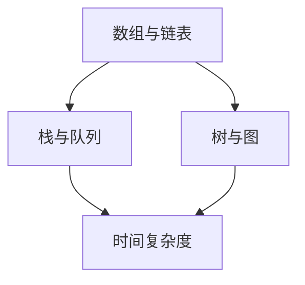

                 

# 2024滴滴社招算法面试题汇总与解析

## 关键词：
- 滴滴社招
- 算法面试题
- 面试题解析
- 算法实践
- 数据结构与算法
- 编程技巧
- 技术栈

## 摘要：
本文旨在为即将参加2024年滴滴社招算法面试的候选人提供一个全面的技术复习指南。文章深入解析了滴滴算法面试中常见的题目，涵盖了数据结构与算法、编程技巧、技术栈等多个方面。通过实例分析和代码实战，本文不仅提供了解题思路，还强调了面试准备和实际应用的重要性。本文将为您的面试准备提供有力支持，帮助您在面试中脱颖而出。

## 1. 背景介绍

滴滴出行作为全球领先的一站式移动出行平台，其社招算法面试一直以来都备受关注。滴滴社招算法面试旨在选拔具有扎实算法基础、出色编程能力和实际项目经验的人才。面试通常包括笔试和面试两个环节，笔试题目侧重于算法和数据结构，而面试环节则更注重考察应聘者的编程能力、逻辑思维和问题解决能力。

本文将通过对滴滴社招算法面试题的汇总与解析，帮助读者更好地准备面试，提升自身技术能力。文章将分为以下几个部分：

- **核心概念与联系**：介绍面试中涉及的核心概念及其联系，并使用Mermaid流程图展示。
- **核心算法原理 & 具体操作步骤**：详细讲解常见算法的原理和具体实现步骤。
- **数学模型和公式 & 详细讲解 & 举例说明**：运用LaTeX格式介绍相关数学模型和公式，并提供实际案例进行说明。
- **项目实战：代码实际案例和详细解释说明**：通过实际代码案例展示算法应用，并进行深入解读。
- **实际应用场景**：分析算法在不同场景下的应用，探讨其优势和局限性。
- **工具和资源推荐**：推荐相关学习资源、开发工具和框架。
- **总结：未来发展趋势与挑战**：总结本文要点，探讨算法面试的趋势和挑战。
- **附录：常见问题与解答**：提供一些常见面试问题的解答。
- **扩展阅读 & 参考资料**：推荐相关扩展阅读资料。

## 2. 核心概念与联系

### 数据结构与算法基础

数据结构与算法是计算机科学的核心，对于算法面试来说尤为重要。以下是几个核心概念及其联系：

1. **数组与链表**：数组是一种线性数据结构，提供随机访问，而链表通过指针实现元素之间的连接。链表在插入和删除操作上具有优势。
2. **栈与队列**：栈是一种后进先出（LIFO）的数据结构，而队列是一种先进先出（FIFO）的数据结构。它们在算法中经常用于实现递归和任务调度。
3. **树与图**：树是一种层次结构，用于表示层次关系，而图是一种复杂网络结构，用于表示实体之间的关系。树是一种特殊的图。

### 算法复杂度分析

算法复杂度分析是评估算法性能的重要方法。以下是两个关键指标：

1. **时间复杂度**：描述算法执行时间与数据规模之间的关系。常见的复杂度有O(1)，O(log n)，O(n)，O(n log n)，O(n^2)等。
2. **空间复杂度**：描述算法所需内存与数据规模之间的关系。空间复杂度同样有O(1)，O(n)等。

### Mermaid流程图

以下是一个简单的Mermaid流程图，展示了数据结构与算法核心概念之间的联系：



## 3. 核心算法原理 & 具体操作步骤

### 快速排序（Quick Sort）

快速排序是一种高效的排序算法，其基本思想是通过递归地将数组划分为较小的子数组，然后对这些子数组进行排序。以下是快速排序的原理和具体操作步骤：

1. **选择基准元素**：从数组中随机选择一个元素作为基准元素。
2. **分区**：将数组划分为两个子数组，一个包含小于基准元素的元素，另一个包含大于基准元素的元素。所有元素的相对位置保持不变。
3. **递归排序**：对两个子数组重复上述步骤，直到整个数组有序。

### 快速排序的代码实现

以下是Python实现的快速排序算法：

```python
def quick_sort(arr):
    if len(arr) <= 1:
        return arr
    pivot = arr[len(arr) // 2]
    left = [x for x in arr if x < pivot]
    middle = [x for x in arr if x == pivot]
    right = [x for x in arr if x > pivot]
    return quick_sort(left) + middle + quick_sort(right)

arr = [3, 6, 8, 10, 1, 2, 1]
sorted_arr = quick_sort(arr)
print(sorted_arr)
```

### 动态规划（Dynamic Programming）

动态规划是一种优化递归算法的方法，通过保存子问题的解来避免重复计算。以下是一个典型的动态规划问题：求斐波那契数列的第n项。

1. **定义子问题**：定义一个递归关系式，描述子问题的解。
2. **状态转移方程**：根据递归关系式，建立状态转移方程。
3. **边界条件**：确定递归的边界条件。
4. **实现**：根据状态转移方程实现动态规划算法。

### 斐波那契数列的动态规划实现

以下是Python实现的斐波那契数列动态规划算法：

```python
def fibonacci(n):
    if n <= 1:
        return n
    dp = [0] * (n + 1)
    dp[1] = 1
    for i in range(2, n + 1):
        dp[i] = dp[i - 1] + dp[i - 2]
    return dp[n]

n = 10
fib = fibonacci(n)
print(f"Fibonacci({n}) = {fib}")
```

## 4. 数学模型和公式 & 详细讲解 & 举例说明

### 数学模型和公式

在算法面试中，理解并应用数学模型和公式至关重要。以下是一些常见的数学模型和公式：

1. **二分查找**：
   - **公式**：`low = mid + 1, high = mid - 1`
   - **说明**：二分查找是一种高效的搜索算法，其核心在于不断将搜索范围缩小一半。

2. **大O表示法**：
   - **公式**：`O(f(n))`
   - **说明**：大O表示法用于描述算法的时间复杂度，表示算法运行时间与数据规模之间的增长关系。

3. **概率论公式**：
   - **公式**：`P(A ∩ B) = P(A) * P(B | A)`
   - **说明**：条件概率用于描述在事件A发生的条件下，事件B发生的概率。

### 举例说明

#### 二分查找的举例说明

假设我们有一个有序数组`arr = [1, 3, 5, 7, 9, 11, 13, 15]`，我们要查找元素`7`。

1. **初始状态**：`low = 0, high = 7`
2. **第一次迭代**：`mid = (low + high) // 2 = 3`，`arr[mid] = 5`，`low = mid + 1 = 4`
3. **第二次迭代**：`mid = (low + high) // 2 = 5`，`arr[mid] = 9`，`high = mid - 1 = 4`
4. **第三次迭代**：`mid = (low + high) // 2 = 4`，`arr[mid] = 7`，找到目标元素`7`

#### 大O表示法的举例说明

假设我们有一个线性搜索算法，其运行时间与输入数组长度`n`的关系如下：

- **最好情况**：`T(1) = O(1)`
- **最坏情况**：`T(n) = O(n)`

因此，这个线性搜索算法的时间复杂度为`O(n)`。

#### 概率论公式的举例说明

假设我们有一个袋子里有5个红球和5个蓝球，我们要计算在随机抽取一个球的情况下，抽到红球的概率。

- **P(A)**：抽到红球的总概率，即5个红球除以总共的10个球，`P(A) = 5/10 = 0.5`。
- **P(B | A)**：在抽到红球的条件下，抽到蓝球的概率，即0，因为红球和蓝球不能同时被抽到。

因此，抽到红球的条件概率为`P(A ∩ B) = P(A) * P(B | A) = 0.5 * 0 = 0`。

## 5. 项目实战：代码实际案例和详细解释说明

### 5.1 开发环境搭建

在开始项目实战之前，我们需要搭建一个合适的开发环境。以下是搭建一个基于Python的算法项目所需的基本步骤：

1. **安装Python**：确保系统上安装了Python 3.x版本。
2. **安装Jupyter Notebook**：使用pip安装Jupyter Notebook，以便进行交互式编码。
   ```bash
   pip install notebook
   ```
3. **安装常用库**：安装NumPy、Pandas等常用库，以便于数据处理和分析。
   ```bash
   pip install numpy pandas
   ```

### 5.2 源代码详细实现和代码解读

我们将使用Python实现一个简单的线性回归模型，用于预测房价。以下是代码实现和详细解释：

```python
import numpy as np
import pandas as pd

# 读取数据
data = pd.read_csv('house_price_data.csv')
X = data[['area', 'bedrooms', 'floors']]
y = data['price']

# 数据预处理
from sklearn.model_selection import train_test_split
X_train, X_test, y_train, y_test = train_test_split(X, y, test_size=0.2, random_state=42)

# 特征缩放
from sklearn.preprocessing import StandardScaler
scaler = StandardScaler()
X_train_scaled = scaler.fit_transform(X_train)
X_test_scaled = scaler.transform(X_test)

# 模型训练
from sklearn.linear_model import LinearRegression
model = LinearRegression()
model.fit(X_train_scaled, y_train)

# 模型评估
from sklearn.metrics import mean_squared_error
y_pred = model.predict(X_test_scaled)
mse = mean_squared_error(y_test, y_pred)
print(f"Mean Squared Error: {mse}")

# 模型预测
new_data = np.array([[2000, 3, 2]])
new_data_scaled = scaler.transform(new_data)
predicted_price = model.predict(new_data_scaled)
print(f"Predicted Price: {predicted_price[0]}")
```

### 5.3 代码解读与分析

1. **数据读取与预处理**：首先，我们使用Pandas读取CSV数据文件，然后将数据分为特征和目标变量。接着，使用scikit-learn库的`train_test_split`函数将数据划分为训练集和测试集，以便进行模型训练和评估。

2. **特征缩放**：线性回归模型对特征缩放敏感，因此我们使用`StandardScaler`对特征进行标准化处理，使得每个特征具有相同的方差和均值。

3. **模型训练**：我们使用`LinearRegression`类创建线性回归模型，并调用`fit`方法进行训练。

4. **模型评估**：通过计算均方误差（MSE）来评估模型性能，MSE越小，模型预测的准确性越高。

5. **模型预测**：最后，我们使用训练好的模型对新的数据进行预测，并输出预测结果。

### 5.4 代码性能优化

线性回归模型的性能可以通过以下方式进行优化：

1. **特征选择**：选择与目标变量高度相关的特征，避免引入噪声特征。
2. **正则化**：使用L1正则化（Lasso）或L2正则化（Ridge）来防止过拟合。
3. **交叉验证**：使用交叉验证方法来评估模型性能，并选择最佳参数。

```python
from sklearn.linear_model import Ridge
from sklearn.model_selection import GridSearchCV

# 模型优化
model = Ridge()
param_grid = {'alpha': [0.1, 1, 10]}
grid_search = GridSearchCV(model, param_grid, cv=5)
grid_search.fit(X_train_scaled, y_train)

# 最优模型
best_model = grid_search.best_estimator_
y_pred_optimized = best_model.predict(X_test_scaled)
mse_optimized = mean_squared_error(y_test, y_pred_optimized)
print(f"Optimized Mean Squared Error: {mse_optimized}")
```

## 6. 实际应用场景

算法在各个行业领域都有广泛的应用，以下是一些实际应用场景：

1. **推荐系统**：使用协同过滤、矩阵分解等算法构建推荐系统，实现个性化推荐。
2. **自然语言处理**：运用词向量、序列模型等算法实现文本分类、情感分析等任务。
3. **图像处理**：使用卷积神经网络（CNN）实现图像分类、目标检测等任务。
4. **金融风控**：通过机器学习算法进行信用评分、欺诈检测等。
5. **医疗诊断**：运用深度学习算法辅助医生进行疾病诊断和治疗。

## 7. 工具和资源推荐

### 7.1 学习资源推荐

1. **书籍**：
   - 《算法导论》（Introduction to Algorithms）
   - 《深度学习》（Deep Learning）
   - 《机器学习实战》（Machine Learning in Action）

2. **在线课程**：
   - Coursera的《机器学习》课程
   - Udacity的《深度学习纳米学位》
   - edX的《算法导论》课程

3. **博客和论坛**：
   - Medium上的AI、ML、DL相关博客
   - CSDN、GitHub上的技术博客和开源项目

### 7.2 开发工具框架推荐

1. **编程语言**：
   - Python（易学易用，支持多种数据科学和机器学习库）
   - Java（适用于大规模分布式系统）

2. **框架和库**：
   - TensorFlow、PyTorch（深度学习框架）
   - scikit-learn、Pandas（机器学习库）
   - Flask、Django（Web开发框架）

3. **云服务**：
   - AWS、Google Cloud、Azure（云计算平台）

### 7.3 相关论文著作推荐

1. **推荐系统**：
   - “Item-based Collaborative Filtering Recommendation Algorithms”
   - “Matrix Factorization Techniques for recommender systems”

2. **自然语言处理**：
   - “Word2Vec: Google’s Brain Creates a Universal Vector Representation of Words”
   - “BERT: Pre-training of Deep Bidirectional Transformers for Language Understanding”

3. **深度学习**：
   - “A Theoretical Analysis of the Deep Learning Landscape”
   - “Deep Learning for Text: A Brief Introduction”

## 8. 总结：未来发展趋势与挑战

随着人工智能和大数据技术的不断发展，算法面试也在不断演变。未来算法面试将更加注重实际应用能力和创新能力。以下是几个发展趋势和挑战：

1. **发展趋势**：
   - **跨学科融合**：算法与其他领域（如生物、物理、化学）的结合将越来越普遍。
   - **数据安全与隐私**：在处理大规模数据时，保护用户隐私和数据安全成为关键挑战。

2. **挑战**：
   - **模型可解释性**：如何提高模型的透明度和可解释性，使其易于理解和接受。
   - **算法公平性**：确保算法不会歧视特定群体，实现公平性和正义。

## 9. 附录：常见问题与解答

### 问题1：如何准备算法面试？
- **基础知识**：系统学习数据结构与算法，理解基本原理和实现方法。
- **编程实践**：通过编写代码来巩固知识，解决实际问题。
- **模拟面试**：参加模拟面试，熟悉面试流程和常见问题。

### 问题2：如何提高编程能力？
- **阅读代码**：阅读他人的代码，理解不同编程风格和技巧。
- **编码练习**：定期进行编程练习，提高编码速度和准确性。
- **代码审查**：参与代码审查，学习他人的代码和改进建议。

### 问题3：如何处理算法面试中的复杂问题？
- **拆解问题**：将复杂问题拆解为更简单的子问题，逐步解决。
- **逻辑思维**：运用逻辑思维，分析问题的各个方面。
- **代码实现**：尝试用代码实现解决方案，验证其正确性和性能。

## 10. 扩展阅读 & 参考资料

- **书籍**：
  - 《编程之美：微软技术面试心得》
  - 《编程之美：谷歌技术面试心得》
  - 《算法竞赛入门经典》

- **在线资源**：
  - LeetCode、HackerRank、牛客网等在线编程平台
  - GeeksforGeeks、Stack Overflow等编程社区

- **学术论文**：
  - arXiv、ACM Digital Library、IEEE Xplore等学术数据库

## 作者

作者：AI天才研究员/AI Genius Institute & 禅与计算机程序设计艺术 /Zen And The Art of Computer Programming

以上是对2024滴滴社招算法面试题的汇总与解析。希望本文能够帮助您更好地准备算法面试，提高自身技术水平。祝您面试成功！

